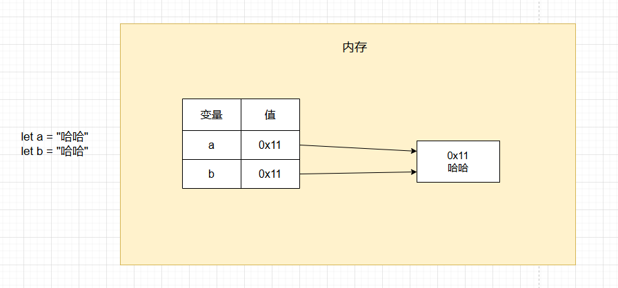
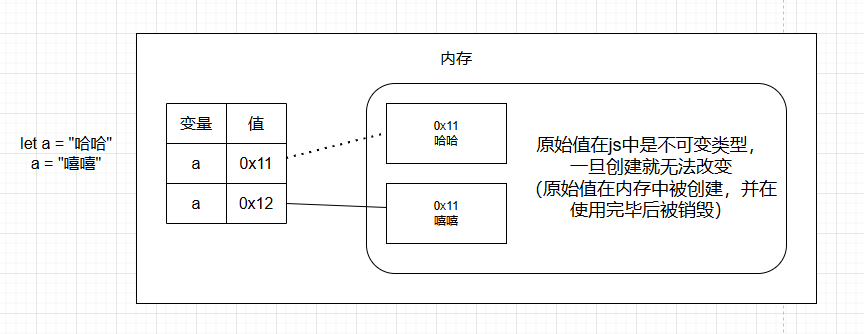

# JavaScript学习

## 一、代码

### 1、入门

#### 1.1helloworld

js例子

```js
<!DOCTYPE html>
<html lang="zh-CN">
<head>
    <meta charset="UTF-8">
    <meta name="viewport" content="width=device-width, initial-scale=1.0">
    <title>Hello World</title>
    <script>
        // alert("Hello World!")

        // console.log("你猜我在哪里？")

        document.write("Hello World!")
    </script>
</head>
<body>
    
</body>
</html>
```

#### 1.2编写位置

js可以编写到多个位置

```javascript
<!DOCTYPE html>
<html lang="zh-CN">

<head>
    <meta charset="UTF-8">
    <meta name="viewport" content="width=device-width, initial-scale=1.0">
    <title>js的编写位置</title>
    <!--
        1.可以将js编写到网页内部的<script>标签中
    -->

    <!-- <script type="text/javascript">
        //type="text/javascript" 可以省略
        alert("Hello, World!");
    </script> -->

    <!--
        2.可以将js编写到外部的js文件中，然后在网页中通过<script>标签引入
    -->
    <!-- <script src="scripts.js"></script> -->
</head>

<body>
    <!-- 3.可以将js代码编写到指定属性中 -->
    <button onclick="alert('你点我干嘛')">点击我一下</button>
    <hr>
    <a href="javascript:alert('你点我干嘛')">超链接</a>
</body>

</html>
```

#### 1.3基本语法

注释，大小写，分号，空格和换行

```javascript
    <script>
        /*
        1.多行注释
            - 注释中的内容会被忽略执行
            - 可以通过注释来对代码进行解释说明
            - 也可以通过注释来屏蔽掉不需要执行的代码
        */

        // 2.单行注释
        // alert("Hello, World!"); // 弹出Hello, World!

        /*
            3.js严格区分大小写
        */
        //    Alert("Hello, World!"); //大写无法识别，会报错

        /*
            4.js中多个换行和空格会被忽略，但是建议不要过度使用空格
                - 可以利用这个特点来对代码进行格式化
        */
        //    alert(  231

        //     )

        /*
            5.js中每条语句以分号结尾，大部分情况可以省略
                - js会自动添加分号，但是有一些情况需要手动添加分号
        */
        alert("Hello, World!");
        console.log("Hello, World!");
    </script>
```

#### 1.4自变量和变量

变量的声明和赋值

```javascript
    <script>
        /*
            字面量
                - 字面量其实就是一个值，它所代表的含义就是它的字面意思。
                - 比如：1 2 3 4 100 "hello" true false null undefined 等都是字面量。
                - js中所有字面量都可以直接使用，但是直接使用字面量不方便

            变量
                - 变量可以用来“存储”字面量
                - 并且变量存储的字面量可以随意修改
                - 通过变量可以对字面量进行描述，并且变量比较方便修改
        */

        let x
        x = 80
        x = "哈哈"
        console.log(x);

        let age
        age = 80
        age = 81
        console.log(age); // 80

        /*
            多行数值：shift + alt + a
            变量的使用
                - 声明变量 -> let 变量名
                - 赋值 -> 变量名 = 值
                - 声明和赋值同时进行 -> let 变量名 = 值
        */
        let a
        let b, c, d

        a = 10
        a = "hello"
        a = true

        console.log(a);

        //var是旧的变量声明方式，let是新的变量声明方式，推荐使用let
        var f
        f = 10
        console.log(f); // 10

        let i = 100
        console.log(i);
    </script>
```

#### 1.5变量的内存结构

变量在被赋值时，会在内存检查这个值是否存在，如果存在，则直接引用



```javascript
    <script>

        /* 
            变量中不存储任何值，而是存储值的内存地址
        */
        let a = "哈哈"
        let b = "哈哈"

    </script>
```

#### 1.6常量

```javascript
    <script>
        /* 
            在js中，使用const来声明常量，常量的值不能被修改。
                在js中，除了常规的常量外，还有一些对象类型的数据也会声明为常量
        */
        const PI = 3.1415926;
        // PI = 3; // 报错，常量的值不能被修改
        console.log(PI);
    </script>
```

#### 1.7标识符

```javascript
    <script>
        /* 
            在js中，所有可以由我们自由命名的内容，都可以认为是一个标识符
                像变量名、函数名、类名、属性名等等

            使用标识符需要遵循如下规范：
                1.标识符只能含有字母、数字、 下划线、$，且不能以数字开头
                2.标识符不能是js中的关键字和保留字，也不建议使用内置的函数或类名作为变量名
                3.命名规范
                    - 通常会使用驼峰命名法
                        - 首字母小写，每个单词开头大写
                        - maxlength -> maxLength
                        - username -> userName

                    - 类名会使用大驼峰命名法
                        - 首字母大写，每个单词开头大写
                        - MyClass -> MyClass
                        - UserLogin -> UserLogin
                    
                    - 常量名全部大写，单词间用下划线连接
                        - MAX_LENGTH -> MAX_LENGTH
                        - USER_NAME -> USER_NAME
        */

        let a = 10  //a变量就是标识符
        let abc = 22
        let abc123 = 22
        let abc123_ = 22

        let _abc123_ = 22
        let $abc123_ = 22

        // 以下是错误的标识符
        // let 1abc = 22 // 不能以数字开头
        // let abc-123 = 22 // 不能包含特殊符号
        // let abc 123 = 22 // 不能包含空格

        // let let = 10 // 不能使用js中的关键字let
        // let function = 10 // 不能使用js中的关键字function

        // let alert = 55 // 不能使用js中的保留字alert
    </script>
```

### 2、数据类型

#### 2.1数据类型_数值

```javascript
    <script>
        /*
            数值（Number）
                - 在js中，所有的整数和浮点数都属于数值类型
                - js中的数字不是无限大的，超过一定范围会用科学计数法显示近似值
                - 在js中进行一些高精度的运算要十分注意，避免出现精度丢失
                - NaN（Not a Number）是一个特殊的数值，表示非法的数字
        */

        let a = 10
        a = 10.5
        a = 99999999999999999   //100000000000000000
        a = 999999999999999999999 // 科学计数法显示1e+21
        a = 0.00000000001   //1e-11
        console.log(a);

        // 数值运算
        //0.1+0.2=0.30000000000000004

        // a = 1 - 'a' // 报错NaN，不能将字符串和数值进行运算

        /* 
            大整数（BigInt）
                - 大整数用来表示一些比较大的整数
                - 大整数使用n结尾，它可以表示的范围无限大，但是会受到内存的限制
        */

        a = 999999999999999999999999999999999999999n
        console.log(a);

        /* 
            其他进制的数字
                - 二进制：0b
                - 八进制：0o
                - 十六进制：0x

        */
       let b = 55
       b = 0b1010 // 二进制

       console.log(b);  // 打印的结果是十进制的10
    </script>
```

#### 2.2类型检查

```javascript
    <script>
        let a = 10
        let b = 10n

        console.log(a);
        console.log(b);

        // a + b // 运行报错，类型不匹配

        /* 
            typeof 运算符可以用来检查变量的类型。
            typeof 运算符返回一个字符串，该字符串表示变量的类型。
        */

        console.log(typeof a); // "number"
        console.log(typeof b); // "bigint"
    </script>
```

#### 2.3字符串

```javascript
    <script>
        /* 
            字符串
                - js中，使用单引号或双引号括起来的字符串，都属于字符串类型
                - 转义字符 \
                    \" -> "
                    \' -> '
                    \\ -> \
                    \n -> 换行符
                    \t -> 制表符
                - 模板字符串
                    - 使用反单引号`来表示模板字符串
                    - 模板字符串可以嵌入变量
                - 使用typeof检查一个字符串时，会返回"string"
        */

        let a = 'hello';
        a = "你好"
        a = "这是一个'字符串'"
        a = '这是一个"字符串"'
        a = "这是一个\"字符串\""    //\转义字符
        a = '这是一个\'字\\符串\''   //\转义字符
        a = "这是一个\n换行符"      //\n换行符
        a = "这是一个\t制表符"      //\t制表符

        a = "今天天气真不错"
        a = `今天天气
        挺好的` //模板字符串可以跨行使用

        console.log(a);

        let name = "孙悟空"
        let str = `你好, ${name}`
        console.log(str);

        let b = 10
        console.log(`b = ${b}`);

        let c = 5   //数字5
        c = "5"   //字符串"5"
        console.log(typeof c);
    </script>
```

#### 2.4其他数据类型

```javascript
    <script>
        /*
            整数（Number）
                - js中，整数和浮点数统称为数字
                - 整数可以使用十进制、八进制、十六进制表示
                - 整数可以使用前缀0x或0o表示
                - 使用typeof检查一个数字时，会返回"number"

            字符串（String）
                - js中，使用单引号或双引号括起来的字符串，都属于字符串类型
                - 转义字符 \
                    \" -> "
                    \' -> '
                    \\ -> \
                    \n -> 换行符
                    \t -> 制表符
                - 模板字符串
                    - 使用反单引号`来表示模板字符串
                    - 模板字符串可以嵌入变量
                - 使用typeof检查一个字符串时，会返回"string"

            布尔值（Boolean）
                - 布尔值主要用来进行逻辑判断
                - 只有两个值：true 和 false
                - 使用typeof检查一个布尔值会返回"boolean"

            空值（null）
                - 空值表示一个空对象，它是一个特殊的值，表示“没有值”
                - 空值只有一个值：null
                - 使用typeof检查一个空值会返回"object"
                - 使用typeof无法检查空值

            未定义值（undefined）
                - 当声明一个变量而没有赋值时，它的值就是undefined
                - 未定义值只有一个值：undefined
                - 使用typeof检查一个未定义值会返回"undefined"

            符号（Symbol）
                - 用来创建一个唯一的标识
                - 使用typeof检查一个符号会返回"symbol"

            js中原始值一共有7种
                1. 数字（Number）
                2.大整数（BigInt）
                3.字符串（String）
                4.布尔值（Boolean）
                5.空值（null）
                6.未定义值（undefined）
                7.符号（Symbol）
            
            这7种原始值是构成各种数据的基石
                原始值在js中是不可变类型，一旦创建就无法改变（原始值在内存中被创建，并在使用完毕后被销毁）
        */

        let bool = true //真
        bool = false    //假
        console.log(bool);
        console.log(typeof bool);   //"boolean"

        let a = null;
        console.log(a);
        console.log(typeof a);   //"object"

        let b
        console.log(b);
        console.log(typeof b);   //"undefined"

        let c = Symbol()    //调用Symbol函数创建一个唯一的标识符
        console.log(c);        //Symbol()
        console.log(typeof c);   //"symbol"
    </script>
```

* 注意原始值是不可变类型，一旦创建就无法改变



#### 2.5类型转换_字符串

```javascript
    <script>
        /* 
            类型转换：将一种数据类型转换为其他数据类型
                主要将其他类型转换为（字符串、数字和布尔值）

            转换字符串
                1.调用toString()方法将其他类型转换为字符串
                    - 调用方法：
                        xxx的yyy方法 -> xxx.yyy()
                    - 由于null和undefined没有toString()方法，所以不能转换为字符串
                2.调用String()函数将其他类型转换为字符串
                    - 调用函数：
                        调用xxx的函数 -> 函数名(xxx)
                    - 原理：
                        对于拥有toString()方法的值调用String()函数时，
                            实际上就是在调用toString()方法。
                        对于null和undefined调用String()函数时，
                            实际上返回字符串"null"和"undefined"。
         */

        let a = 10
        a = true
        a = 11n
        // a = null //报错，null不能转换为字符串
        // a = undefined //报错，undefined也不能转换为字符串
        a = a.toString();   //将a转换为字符串
        console.log(typeof a, a);   //typeof a,a 输出变量a的类型和值

        let b = 33
        b = null    //"null"
        b = undefined    //"undefined"
        b = String(b);   //将b转换为字符串
        console.log(typeof b, b)
    </script>
```

#### 2.6类型转换_数值

```javascript
    <script>
        /* 
            将其他的数据类型转换为数值
                1. Number()函数：将其他数据类型转换为数值
                    转换的情况：
                        - 字符串：
                            - 如果字符串是一个合法的数字，则会自动转换为相应的数值
                            - 如果字符串不是一个合法的数字，则会返回NaN
                            - 如果字符串是空串或纯空格的字符串，则会返回0
                        - 布尔值：
                            - true转换为1，false转换为0
                        - null
                            - null转换为0
                        - undefined
                            - undefined转换为NaN

                2. parseInt()函数：将字符串转换为整数
                    - 解析时，会自左向右读取一个字符串，直到读到所有字符串中的有效整数
                    - 也可以用parseInt()来对一个数字取整
                3. parseFloat()函数：将字符串转换为浮点数
                    - 解析时，会自左向右读取一个字符串，直到读到所有字符串中的有效浮点数
        */

        let a = "123"
        a = "abc" // "abc"不是一个合法的数字，返回NaN
        a = "" // 0
        a = " " // 0
        a = true // 1
        a = false // 0
        a = null // 0
        a = undefined // NaN
        a = Number(a) // 123

        console.log(typeof a, a);

        let b = '123px'
        b = '123.45'
        // b = 'a123'  // 'a123'不是一个合法的数字，返回NaN
        // b = Number(b) // NaN
        b = parseInt(b) // 123
        
        console.log(typeof b, b);
    </script>
```

#### 2.7类型转换_布尔值

```javascript
    <script>
        /* 
            1.使用Boolean()函数将其他类型的值转换为布尔值
                - 转换情况：
                    - 数字：
                        - 除了0和NaN转换为false，其他数字都为true
                    - 字符串：
                        - 空串是false，非空串是true
                    - null和undefined：
                        - 都转换为false
                    - 其他对象：
                        - 除了null和undefined，其他对象都转换为true

                - 所有表示空性的，错误的，没有的都会转换为false
                    0, NaN, "", null, undefined,false
        */

        let a = 1
        a = 0 // false
        a = -1 // true
        a = NaN // false
        a = Infinity // true

        a = "abc"    // true
        a = "true"   // true
        a = "false"  // true
        a = ""       // false
        a = " "    // true

        a = null     // false
        a = undefined // false

        a = Boolean(a) // true

        console.log(typeof a,a);
    </script>
```

### 3、运算符

#### 3.1算术运算符

```javascript
    <script>
        /* 
            运算符（操作符）
                - 运算符可以用来对一个或多个值（操作数）进行运算
                - 算术运算符：
                    + 加法运算符
                    - 减法运算符
                    * 乘法运算符
                    / 除法运算符
                    % 取模运算符
                    ** 幂运算符
                
                - 注意：
                    - 算术运算时，除了字符串的加法，
                        其他运算的操作数是非数值时，都会自动转换为数值再运算
        */
        let a = 1 + 1
        a = 10 - 5
        a = 2 * 4
        a = 10 / 5
        a = 10 / 3
        a = 10 / 0   // 除数不能为0，返回值为Infinity
        a = 10 % 3   // 取模运算符，返回余数
        a = 2 ** 3   // 2的3次方
        a = 9 ** 0.5    // 9的平方根
        a = 9 ** .5     // 省略0的写法

        /* 
            js是一门弱类型语言，当进行运算时会通过自动的类型转换来完成运算
        */
        a = 10 - '5'    //10-5
        a = 10 + true   //10+1
        a = 5 + null    //5+0
        // a = 6 - undefined   //6-NaN，结果为NaN，不能这么操作

        /* 
            当任意一个值和字符串做运算时，会先将其他值转换为字符串
                然后再进行字符串的拼接
            可以利用这个特点来进行类型转换
                可以为任意类型 + 一个空串的形式来完成转换字符串
                    其原理和String()函数一样，但使用起来更方便
        */
        a = 1 + "2"    // "12"

        a = true
        a = a + ""      // "true"
        console.log(typeof a, a);
    </script>
```

#### 3.2赋值运算符

```javascript
    <script>
        /* 
            赋值运算符用来将一个值赋给一个变量。
                =   赋值运算符
                    - 将右侧的值赋给左侧的变量
                +=  加等于运算符
                    - 相当于 a = a + b
                -=  减等于运算符
                    - 相当于 a = a - b
                *=  乘等于运算符
                    - 相当于 a = a * b
                /=  除等于运算符
                    - 相当于 a = a / b
                %=  取模等于运算符
                    - 相当于 a = a % b
                **= 幂等于运算符
                    - 相当于 a = a ** b
                ??= 三元赋值运算符
                    - 相当于 a = a ?? b
                    - 只有变量的值为null或undefined时才会赋值，否则不会赋值。
        */
        let a = 10
        a = 20   //将右边的值赋值给左边的变量
        let b = a   //将变量a的值赋值给变量b

        a = 66
        a = a + 11   //大部分运算符都不会改变变量的值，只有赋值运算符会改变变量的值。

        a = 5
        a += 5   //相当于 a = a + 5

        a = undefined
        a??=20

        console.log(a)
    </script>
```

#### 3.3一元±

```javascript
    <script>
        /* 
            一元±运算符
                + 正好
                    - 不会改变数值的符号

                - 负号
                    - 可以对符号位取反，将正数变成负数，将负数变成正数。

                当我们对非数值类型进行正负运算时，会先将其转换为数值然后再运算。
        */

        let a = 10
        a = +a
        a = -a
        console.log(a);

        let b = '123'
        b = +b // 123，隐式类型转换

        console.log(b);
    </script>
```

#### 3.4自增和自减

```javascript
    <script>
        /* 
            ++ 自增运算符
                - ++ 使用会使得原来的变量立刻增加1
                - 自增分为前置和后置两种形式，前置形式 ++a，后置形式 a++
                - 无论是a++还是++a，都表示变量a的值增加1
                - 不同的是++a和a++所返回的值不同
                    a++返回的是a的旧值
                    ++a返回的是a的新值
        */
        let a = 10

        // let b = a++ //a++返回的是a的旧值，即10，而a自增后的值为11
        let b = ++a // ++a返回的是a的新值，即11，而a自增后的值为11

        console.log(a);
        console.log(b);

        let n = 5
        let result = n++ + ++n + n // 5+7+7=19
        console.log(result); // 19

        /* 
            -- 自减运算符
                - -- 使用会使得原来的变量立刻减少1
                - 自减分为前置和后置两种形式，前置形式 --a，后置形式 a--
                - 无论是a--还是--a，都表示变量a的值减少1
                - 不同的是--a和a--所返回的值不同
                    a--返回的是a的旧值
                    --a返回的是a的新值
        */
    </script>
```

#### 3.5逻辑运算符-非

```javascript
    <script>
        /* 
            ! 非运算符
                - 可以用来对一个值进行非运算，即取反。
                - 它可以对一个布尔值进行非运算，将其取反。
                    true -> false
                    false -> true
                - 如果对一个非布尔值取反，则会先将其转换为布尔值，然后再取反。
                    可以利用这个特点将其他值转换为布尔值。
                
                - 类型转换
                    转换为字符串
                        显式转换
                            String()
                        隐式转换
                            + ""

                    转换为数值
                        显式转换
                            Number()
                        隐式转换
                            + 0

                    转换为布尔值
                        显式转换
                            Boolean()
                        隐式转换
                            !!
                

            && 与运算符

            || 或运算符
        */
        let a = 1
        a = !a
        console.log(a)

        a = 123
        // a = Boolean(a)
        a = !!a // 取两次反可以转换为布尔值

        console.log(typeof a, a);
    </script>
```

#### 3.6逻辑运算符-与-或

```javascript
    <script>
        /* 
            && 逻辑与
                - 可以对两个值进行与运算
                - && 左右两边的表达式都为真，结果才为真
                - 否则，结果为假
                - 与运算是找flase的，如果找到false则直接返回，没有false才会执行第二个
                - 对应非布尔值进行运算，它会先转换为布尔值再进行运算
                    但是最后回返回的是原值，而不是布尔值
                    - 如果第一个值为false，则直接返回第一个值
                    - 如果第一个值为true，则返回第二个值

            || 逻辑或
                - 可以对两个值进行或运算
                - 当||左右两边的表达式有一个为真，结果为真
                - 否则，结果为假
                - 或运算时找true的，如果第一个值为true，则不看第二个
                - 对应非布尔值进行运算，它会先转换为布尔值再进行运算
                    但是最后回返回的是原值，而不是布尔值
                    - 如果第一个值为true，则直接返回第一个值
                    - 如果第一个值为false，则返回第二个值
        */
        let result = true && true; // true
        result = true && false; // false
        result = false && true; // false

        //    true && alert("hello"); // 第一个为true，alert会执行
        // false && alert("hello"); // 第一个为false，alert不会执行

        result = 1 && 2; // 2
        result = 1 && 0; // 0
        result = 0 && NaN; // 0，第一个为false，直接返回第一个

        result = true || false; // true
        result = false || true; // true
        result = false || false; // false

        // false || alert("hello"); // 第一个为false，alert会执行
        true || alert("hello"); // 第一个为true，alert不会执行
        console.log(result);
    </script>
```

#### 3.7关系运算符

```javascript
    <script>
        /* 
            关系运算符：
                - 关系运算符用来检查两个值之间的关系是否成立
                    成立：返回true
                    不成立：返回false
                >   大于
                    - 用来检查左值是否大于右值
                <   小于
                    - 用来检查左值是否小于右值
                >=  大于等于
                     - 用来检查左值是否大于等于右值
                <=  小于等于
                     - 用来检查左值是否小于等于右值

            注意：
                当对非数值运算时，它会先将其转换为数值再进行比较。
                当关系运算符的两端是两个字符串时，它会先将字符串转换为unicode编码的比较，再进行比较。
                    - 字符串的比较是按照unicode编码的顺序逐位进行的。
                      利用这个特点可以对字符串安装字母排序
                    - 注意比较字符串和数字时一定要进行类型转换
                
                ==  等于
                    - 用来检查两个值是否相等
                === 全等（值和类型都相等）
                     - 用来检查两个值是否全等（值和类型都相等）
               !=  不等于
                  - 用来检查两个值是否不相等
               !== 不全等（值或类型不相等）
                    - 用来检查两个值是否不全等（值或类型不相等）
        */
        let result = 10 > 5; // true
        result = 5 > 5; // false
        result = 5 >= 5; // true

        result = 5 < "10"   // true
        result = 1 > false; // true
        result = "a" < "b"  // true
        result = "abc" < "b"     // false

        result = "12" < "2" //ture，字符串比较，从左往右比较，"1" < "2"
        result = +"12" < "2" //false，转换为数字，12 < 2

        //检查number是否在5和10之间
        let num = 6
        result = 5 < num && num < 10; // true
        console.log(result);
    </script>
```

#### 3.8相等运算符

```javascript
    <script>
        /* 
            == 
                - 相等运算符，用来比较两个值是否相等，如果相等返回true，否则返回false。
                - 使用相等运算符比较两个不同类型的值时
                    它会转换为相同类型后再比较，通常转换为数字比较
                    类型转换后值相同，也会返回true
                - 对于null和undefined，相等运算符会返回true
                - NaN与任何值都不相等，包括它自己

            ===
                - 全等运算符，用来比较两个值是否全等，如果全等返回true，否则返回false。
                - 它不会进行类型转换，如果两个值类型不同，则返回false
                - 对于null和undefined，全等运算符会返回false

            !=
                - 不等于运算符，用来比较两个值是否不相等，如果不相等返回true，否则返回false。
                - 它也会进行类型转换，如果两个值类型不同，则返回true

            !==
                - 不全等运算符，用来比较两个值是否不全等，如果不全等返回true，否则返回false。
                - 它不会进行类型转换，如果两个值类型不同，则返回true
        */
        let result = 1 == 1   //true
        result = 1 == "2"    //false
        result = 1 == "1"   //true
        result = true == "1"    //true

        result = null == undefined   //true
        result = NaN == NaN   //false

        result = 1 === 1   //true
        result = 1 === "1"    //false
        result = null === undefined   //false

        result = 1 != 1   //false
        result = 1 != "1"    //false

        result = 1 !== "1"   //false

        console.log(result);
    </script>
```

#### 3.9条件运算符

```javascript
    <script>
        /* 
            条件运算符：
                语法：条件? 表达式1 : 表达式2
                - 执行顺序：
                    条件运算符在执行时，会先对条件进行求值判断
                        如果结果为true，则执行表达式1
                        如果结果为false，则执行表达式2
        */
        // true ? alert(1) : alert(2); // 1
        // false? alert(1) : alert(2); // 2

        let a = 10
        let b = 20
        // a > b ? alert("a>b") : alert("a<=b") // a<=b

        let max = a > b ? a : b;    //获取两个值当中的最大值
        alert(max); // 20
    </script>
```

#### 3.10运算符的优先级

```javascript
    <script>
        /* 
            和数学一样，js中的运算符也有优先级，比如先乘除，再加减。

            可以通过优先级的表格来查询运算符的优先级
                - 运算符的优先级表格：https://developer.mozilla.org/zh-CN/docs/Web/JavaScript/Reference/Operators/Operator_Precedence
                - 在表格中，运算符的优先级由高到低排列，优先级相同的运算符，则从左到右进行运算。
                    优先级的表格不需要记忆，甚至表格都不用看
                    因为()拥有最高优先级，使用运算符时，如果遇到拿不准的，可以直接通过()来改变优先级即可
        */
        let a = 1 + 2 * 3; // 先乘除，再加减

        a = 1 && (2 || 3);
        console.log(a); // 7
    </script>
```

### 4、流程控制

#### 4.1代码块

```javascript
    <script>
        /* 
            使用{}来创建代码块，代码块可以用来对代码进行分组，提高代码的可读性和可维护性。
                同一个代码块中的代码，就是同一组代码，一个代码块的中的代码，要么都执行，要么都不执行。

            let和var
                - 在js中，使用let声明的变量具有块级作用域
                    在代码块中声明的变量无法在代码块外访问，只能在代码块内访问。
                - 使用var声明的变量，不具有块级作用域
                    在代码块中声明的变量可以在代码块外访问。
        */
        {
            // let a = 10
            var a = 10
            // console.log(a);

        }
        console.log(a);
    </script>
```

#### 4.2if语句

```javascript
    <script>
        /* 
            流程控制语句
                1.条件判断语句
                2.条件分支语句
                3.循环语句

            if语句
                - 语法：
                    if (条件表达式) {
                        语句...
                    }

                - 执行顺序
                    if语句在执行时，会先对if后的条件表达式进行求值判断，
                        如果结果为true，则执行if语句块内的代码，
                        如果结果为false，则跳过
                    
                    if语句只会控制紧随其后的那一行代码，如果希望控制多行代码，可以使用{}将语句括起来
                        最佳实践：即使只有一行代码，也要使用{}将代码括起来，以提高可读性

                    if后面的表达式不是布尔值，会转换为布尔值，然后再执行
        */

        // if (false)
        //     alert("哈哈")

        let a = 10
        // if (a > 10) {
        //     alert("a大于10")
        //     alert(11111)
        // }

        // if(100){
        //     alert("你猜我执行吗")
        // }

        if (a === 10) {
            alert("a等于10")
        }
    </script>
```

#### 4.3if-else语句

```javascript
    <script>
        /* 
            if-else语句
                - 语法：
                    if(条件表达式){
                        语句...
                    }else{
                        语句...
                    }
                
                - 执行流程
                    if-else执行时，先对条件表达式求值判断
                        如果结果为true，则执行if语句块
                        如果结果为false，则执行else语句块

                if-else if-else语句
                    - 语法：
                        if(条件表达式1){
                            语句...
                        }else if(条件表达式2){
                            语句...
                        }else if(条件表达式3){
                            语句...
                        }else{
                            语句...
                        }
                - 执行流程
                    if-else if-else执行时，会自上向下依次对if条件表达式求值判断
                        如果结果为true，则执行if语句块
                        如果结果为false，则对条件表达式2求值判断
                            如果结果为true，则执行else if语句块
                            如果结果为false，则对条件表达式3求值判断
                                如果结果为true，则执行else if语句块
                                如果结果为false，则执行else语句块

                注意：
                    if-else if-else语句只会有一个代码块被执行，
                        一旦有执行的代码块，下边的条件都不会再继续判断了
                        所以一定要注意条件的编写顺序，确保正确的执行代码块
        */

        let age = 10
        // if (age >= 60) {
        //     alert("你已经退休了！")
        // } else {
        //     alert("你还没退休！")
        // }

        age = 200

        // if (age >= 100) {
        //     alert("你真是一个长寿的人！")
        // } else if (age >= 80) {
        //     alert("你比楼上那位还年轻不少")
        // } else if (age >= 60) {
        //     alert("你已经退休了！")
        // } else if (age >= 30) {
        //     alert("你已经步入中年了")
        // } else if (age >= 18) {
        //     alert("你已经成年了")
        // } else {
        //     alert("你还未成年！")
        // }

        /*
            - 练习1：
            编写一个程序，获取一个用户输入的整数。然后通过程序显示这个数是奇数还是偶数。


            - 练习2：
            从键盘输入小明的期末成绩:
                    当成绩为100时，'奖励一辆BMW'
                    当成绩为[80-99]时，'奖励一台iphone'
                    当成绩为[60-79]时，'奖励一本参考书'
                    其他时，什么奖励也没有

            - 练习3：
            大家都知道，男大当婚，女大当嫁。那么女方家长要嫁女儿，当然要提出一定的条件：
                高：180cm以上; 富:1000万以上; 帅:500以上;
                如果这三个条件同时满足，则:'我一定要嫁给他'
                如果三个条件有为真的情况，则:'嫁吧，比上不足，比下有余。'
                如果三个条件都不满足，则:'不嫁！'
        */

        // prompt()可以用来获取用户输入的内容
        // 它会返回一个字符串，可以通过变量来接收
        let num = +prompt("请输入一个整数：");  // 加号将字符串转换为数字
        alert(typeof num, num)
    </script>
```

#### 4.4练习1

```javascript
    <script>
        /* 
            编写一个程序，获取一个用户输入的整数。然后通过程序显示这个数是奇数还是偶数。
        */

        //声明一个变量，接收用户输入的整数
        // let num = +prompt("请输入一个整数：");
        let num = parseInt(prompt("请输入一个整数：")); //parseInt()函数可以将用户输入的字符串转换为整数，比如输入10.5，则会自动转换为整数10

        //验证一下用户的输入是否合法，只有是有效数字时，我们才判断是否为偶数
        //我们不能使用==或===来判断NaN，因为NaN是唯一一个不等于自身的值
        //可以使用isNaN()函数来判断是否为NaN
        if (isNaN(num)) {
            alert("你的输入有问题，请输入一个有效数字！")
        } else if (num % 2 == 0) {
            alert(`${num}是偶数`); //如果输入的整数是偶数，则显示"num是偶数"
        } else {
            alert(`${num}是奇数`); //如果输入的整数是奇数，则显示"num是奇数"
        }
    </script>
```

#### 4.5练习2

```javascript
    <script>
        /*
            从键盘输入小明的期末成绩:
                当成绩为100时，'奖励一辆BMW'
                当成绩为[80-99]时，'奖励一台iphone'
                当成绩为[60-79]时，'奖励一本参考书'
                其他时，什么奖励也没有
        */

        //声明一个变量，用来存储用户输入的成绩
        let score = +prompt("请输入小明的期末成绩：");

        //判断用户输入的成绩是否有效
        if (isNaN(score) || score < 0 || score > 100) {
            alert("输入的成绩有误，请重新输入！");
        } else if (score == 100) {
            alert("恭喜小明，奖励一辆BMW！");
        } else if (score >= 80) {
            alert("恭喜小明，奖励一台iphone！");
        } else if (score >= 60) {
            alert("恭喜小明，奖励一本参考书！");
        } else {
            alert("什么奖励也没有！");
        }
    </script>
```

#### 4.6练习3

```javascript
    <script>
        /* 
            大家都知道，男大当婚，女大当嫁。那么女方家长要嫁女儿，当然要提出一定的条件：
                高：180cm以上; 富:1000万以上; 帅:500以上;
                如果这三个条件同时满足，则:'我一定要嫁给他'
                如果三个条件有为真的情况，则:'嫁吧，比上不足，比下有余。'
                如果三个条件都不满足，则:'不嫁！'
        */
        //获取用户的输入（身高、财富、颜值）
        let height = +prompt("请输入您的身高(cm)：");
        let money = +prompt("请输入您的财富(万)：");
        let face = +prompt("请输入您的颜值(像素)：");

        if (height > 180 && money > 1000 && face > 500) {
            alert("我一定要嫁给他");
        } else if (height > 180 || money > 1000 || face > 500) {
            alert("嫁吧，比上不足，比下有余。");
        } else {
            alert("不嫁！");
        }
    </script>
```

#### 4.7switch语句

```javascript
    <script>
        /* 
            根据用户输入的数字，显示对应的中文
                1 壹
                2 贰
                3 叁                
                4 肆
                5 伍
        */
        let num = +prompt("请输入1-5之间的数字:");

        // if (num === 1) {
        //     alert("壹");
        // } else if (num === 2) {
        //     alert("贰");
        // } else if (num === 3) {
        //     alert("叁");
        // } else if (num === 4) {
        //     alert("肆");
        // } else if (num === 5) {
        //     alert("伍");
        // } else {
        //     alert("输入错误");
        // }

        /* 
        - 执行的流程
            switch语句在执行时，会依次将switch后的表达式和case后的表达式进行全等比较
                如果比较结果为true，则自当前case处开始执行代码
                如果比较结果为false，则继续比较其他case后的表达式，直到找到true为止
                如果所有的比较都是false，则执行default后的语句

        - 注意：
            当比较结果为true时，会从当前case处开始执行代码
                也就是说case是代码执行的起始位置
            这就意味着只要是当前case后的代码，都会执行
            可以使用break来避免执行其他的case

        - 总结
            switch语句和if语句的功能是重复，switch能做的事if也能做，反之亦然。
                它们最大的不同在于，switch在多个全等判断时，结构比较清晰
        */

        //注意switch是全等判断
        switch (num) {
            case 1:
                alert("壹");
                break;
            case 2:
                alert("贰");
                break;
            case 3:
                alert("叁");
                break;
            case 4:
                alert("肆");
                break;
            case 5:
                alert("伍");
                break;
            default:
                alert("输入错误");
        }
    </script>
```

#### 4.8循环语句

```javascript
    <script>
        /* 
            循环语句
                - 通过循环语句可以使指定的代码反复执行
                - js中一共有3种循环语句：for、while、do-while

                - while语句
                    - 语法：
                        while(条件表达式){
                            语句...
                        }
                    - 执行流程
                        while在执行时，会先对条件表达式就行判断
                            如果结果为true，则执行循环体，然后再次判断条件表达式，继续执行循环体...
                            如果结果为false，则退出循环
        */
        //当一个循环的条件表达式恒为true时，这个循环将是一个死循环，会一直执行下去，导致浏览器崩溃或浏览器卡死。
        // while(true){
        //     alert("哈哈")
        //     }

        /* 
            通常写一个循环需要3个条件
                1. 初始化条件表达式
                    - 用来初始化变量
                2. 循环条件表达式
                    - 用来判断循环是否继续
                3. 更新条件表达式
                    - 用来修改变量的值
        */

        // //初始化条件表达式
        // let a = 0

        // //循环条件表达式
        // while (a < 5){
        //     console.log(a);

        //     //更新条件表达式
        //         a++
        // }

        let i = 0
        while (true) {
            console.log(i)
            i++
            if (i === 5) {
                break
            }
        }

        /*
            练习：
                假设银行存款的年利率为5%，求存1000多少年可以变成5000
        */
    </script>
```

#### 4.9while练习

```javascript
    <script>
        /* 
            假设银行存款的年利率为5%，求存1000多少年可以变成5000
        */

        //创建一个计数器，记录存款1000年后变成5000需要多少年
        let year = 0;

        //初始化余额为1000
        let balance = 1000;

        //判断表达式，当余额小于5000时，执行循环
        while (balance < 5000) {
            balance = balance * (1 + 0.05);
            year++;
        }
        console.log(`存款1000后变成5000需要${year}年`);
    </script>
```

#### 4.10while循环

```javascript
    <script>
        /* 
            do-while循环
                - 语法：
                    do {
                        语句...
                    }while(条件表达式);

                - 执行顺序：
                    do-while在执行时，会先执行do后面的循环体，
                        执行完毕后，会对while后的条件表达式进行判断，
                        如果条件表达式为true，则继续执行循环体，
                        如果条件表达式为false，则退出循环。

                - do-while和while的区别：
                    while是先判断，再执行
                    do-while是先执行，再判断

                - 实质区别：
                    do-while可以确保循环至少执行一次
        */
       let i = 0

       //while循环
    //    while(i < 5){
    //        console.log(i);
    //        i++;
    //    }

       //do-while循环
       do {
           console.log(i);
           i++;
       }while(i < 5);
    </script>
```

#### 4.11for循环

```javascript
    <script>
        /* 
            for循环
                - for循环和while没有本质区别，只是语法上有区别。
                - 不同点就是语法结构，for循环的语法结构更加简洁，更加易读。
                - 语法：
                    for(初始化表达式;条件表达式;更新表达式){
                        循环体语句
                        }

                - 执行流程：
                    1.执行初始化表达式，来初始化变量
                    2.执行条件表达式，判断是否执行(true执行，false终止)
                    3.条件更新表达式，更新变量

                -  初始化表达式，在循环的整个周期中只执行一次，一般用来初始化变量。
                - for循环中的3个表达式都可以省略
                - 使用let声明的变量，是局部变量，只能在for循环中使用，不能在外部访问。
                    使用var声明的变量，是全局变量，可以在for循环外访问。
                - 创建死循环的方式：
                    for(;;) {
                        // 循环体语句
                    }
                - 死循环会一直执行，直到浏览器崩溃或手动关闭页面。

                练习1：
                    求100内所有3的倍数(求他们的个数和总和)
        */
        // let i = 0
        // while (i < 5) {
        //     console.log(i)
        //     i++
        // }

        for (let i = 0; i < 5; i++) {
            console.log(i)
        }

        // console.log(i);


        //省略3个表达式
        // for(;;){
        //     console.log(1);
        // }

        // let i = 0
        // for(;i<5;){
        //     console.log(i);
        //     i++;
        // }

        //死循环
        for (; ;) {
            console.log(1);
        }
    </script>
```

#### 4.11练习1-求100内所有3的倍数

```javascript
    <script>
        /* 
            求100内所有3的倍数(求他们的个数和总和)

            思路；
                先求100以内所有的数
        */

        // //计数器
        let count = 0

        //累加器
        let sum = 0

        // for (let i = 1; i < 100; i++) {
        //     // 判断是否是3的倍数
        //     if (i % 3 == 0) {
        //         count++
        //         sum = sum + i;
        //     }
        // }

        // 优化版，使用for循环的步长为3，从3开始，直到100结束

        for (let i = 3; i < 100; i += 3) {
            if (i % 3 == 0) {
                count++;
                sum = sum + i;
            }
        }
        // 输出结果
        console.log(`3的倍数一共有${count}个，总和为${sum}`);

        /* 
            求1000以内的水仙花数
                - 一个n位数的水仙花数，是指一个n位数（n>=3），它的每个位上的数字的n次方之和等于它本身。例如，153是一个3位数的水仙花数，因为1^3 + 5^3 + 3^3 = 153。
        */
    </script>
```

#### 4.12练习2-求1000以内的水仙花数

```javascript
    <script>
        /*
            求1000以内的水仙花数
                - 一个n位数的水仙花数，是指一个n位数（n>=3），它的每个位上的数字的n次方之和等于它本身。例如，153是一个3位数的水仙花数，因为1^3 + 5^3 + 3^3 = 153。
        */

        //获取1000以内的所有的3位数

        // for (let i = 100; i < 1000; i++) {
        //     //判断是否为水仙花数
        //     //如果i的百位数的平方加上十位数的平方加上个位数的和等于i本身，i则为水仙花数
        //     //parseInt()用来取整
        //     //获取百位数
        //     let bai = parseInt(i / 100);

        //     //获取十位数
        //     let shi = parseInt((i - bai * 100) / 10);

        //     //获取个位数
        //     // let ge = i - bai * 100 - shi * 10;
        //     let ge = i % 10;

        //     //判断是否为水仙花数
        //     if (bai ** 3 + shi ** 3 + ge ** 3 == i) {
        //         console.log(i);
        //     }
        // }

        //优化代码
        for (let i = 100; i < 1000; i++) {
            //获取i的字符串形式
            // let stri = String(i);
            let stri = i + '';

            //判断是否为水仙花数
            if (stri[0] ** 3 + stri[1] ** 3 + stri[2] ** 3 == i) {
                console.log(i);
            }
        }

        /*
            获取用户输入大于1的整数（暂时不考虑输入错误的情况）
                编写代码，判断这个数是否为质数，并打印结果
            质数
                - 一个数如果只能被1和它本身整除，则称为质数。例如，2、3、5、7、11、13、17、19等都是质数。
 
        */
    </script>
```

#### 4.13练习3-判断是否为质数

```javascript
    <script>
        /*
            获取用户输入大于1的整数（暂时不考虑输入错误的情况）
                编写代码，判断这个数是否为质数，并打印结果

            质数
                - 一个数如果只能被1和它本身整除，则称为质数。例如，2、3、5、7、11、13、17、19等都是质数。
        */

        // 获取用户输入
        let num = +prompt("请输入大于1的整数:");

        // 判断是否为质数

        /*
            编写代码，判断9是否为质数
                - 检查9有没有1和9以外的因数
                    如果有，则9不是质数
                    如果没有，则9是质数
                -获取所有的可能的因数
                    2,3,4,5,6,7,8
                - 判断这些数是否都能整除9
                    如果有，则9不是质数
                    如果没有，则9是质数
        */
        //记录num的状态，默认为质数
        let flag = true;

        for (let i = 2; i < num; i++) {
            if (num % i === 0) {
                //如果9能被i整除，则9不是质数
                //如果循环体没有执行，则说明9是质数
                flag = false;
            }
        }

        if (flag == true) {
            alert(`${num}是质数`)
        } else {
            alert(`${num}不是质数`)
        }
    </script>
```

#### 4.14循环嵌套

```javascript
    <script>
        /* 
            在循环中，也可以嵌套其他的循环

            希望在网页中打印如下图像
            *****
            *****
            *****
            *****
            *****

            *
            **
            ***
            ****
            *****

            *****
            ****
            ***
            **
            *

            当循环发生嵌套时，外层循环执行1次，内层循环就执行一个完整的周期

            练习：
                打印99乘法表
                1*1=1
                1*2=2 2*2=4
                1*3=3 2*3=6 3*3=9
                ...
        */

        //for循环控制图像的高度
        // for (let i = 0; i < 5; i++) {
        //     //<br>标签用于换行
        //     document.write('*****<br>');
        // }

        //创建一个外层循环，来控制图像的高度
        // for (let i = 0; i < 5; i++) {
        //     //创建一个内层循环，来控制图片的宽度
        //     for (let j = 0; j < 5; j++) {
        //         //使用&nbsp标签来控制图形的间距
        //         document.write('*&nbsp;&nbsp;');
        //     }
        //     document.write('<br>');
        // }

        // for (let i = 0; i < 5; i++) {
        //     //创建一个内层循环，来控制图片的宽度
        //     for (let j = 0; j < i + 1; j++) {
        //         //使用&nbsp标签来控制图形的间距
        //         document.write('*&nbsp;&nbsp;');
        //     }
        //     document.write('<br>');
        // }

        for (let i = 0; i < 5; i++) {
            //创建一个内层循环，来控制图片的宽度
            for (let j = 0; j < 5 - i; j++) {
                //使用&nbsp标签来控制图形的间距
                document.write('*&nbsp;&nbsp;');
            }
            document.write('<br>');
        }
    </script>
```

#### 4.15练习1-99乘法表

```javascript
    <style>
        span{
            display: inline-block;
            width: 100px;
        }
    </style>
    <script>
        /* 
            打印99乘法表
                1*1=1
                1*2=2 2*2=4
                1*3=3 2*3=6 3*3=9
                ...

            练习：
                编写代码，求100以内所有的质数
        */

        //创建一个外层循环，控制高度
        for (let i = 1; i <= 9; i++) {
            //创建一个内层循环，控制宽度
            for (let j = 1; j <= i; j++) {
                document.write(`<span>${i} × ${j} = ${i * j}</span>`);
            }
            document.write("<br>");
        }
    </script>
```

#### 4.16练习2-求100以内所有的质数

```javascript
    <script>
        /* 
            编写代码，求100以内所有的质数
        */
        //求100以内所有的数
        for (let i = 2; i < 100; i++) {
            //判断i是否为质数
            //记录i的状态，默认i是质数
            let flag = true;

            //获取1-i直接的数
            for (let j = 2; j < i; j++) {
                //判断i能不能被i整除
                if (i % j == 0) {
                    //进入判断，i不是质数
                    flag = false;
                }
            }
            //判断结果
            if (flag) {
                console.log(`${i}是质数`);
            }

        }
    </script>
```

#### 4.17break和contine

```javascript
    <script>
        /* 
            break和contine
                - break
                    - break用来终止swich或循环语句
                    - break执行后，switch或循环语句会立即停止
                    - break会终止离它最近的循环

                - contine
                    - contine跳过本次循环


        */

        // for (let i = 0; i < 5; i++) {
        //     if (i === 3) {
        //         break; // 遇到i=3时，终止循环
        //     }
        //     console.log(i);
        // }

        // for (let i = 0; i < 5; i++) {
        //     console.log(i);

        //     for (let j = 0; j < 5; j++) {
        //         if (j === 1) break
        //             console.log('内层循环--->', j);
        //     }
        // }

        // for (let i = 0; i < 5; i++) {
        //     if (i === 3) {
        //         continue; // 遇到i=3时，跳过本次循环
        //     }
        //     console.log(i);
        // }

        for (let i = 0; i < 5; i++) {
            console.log(i);

            for (let j = 0; j < 5; j++) {
                if (j === 1) continue
                console.log('内层循环--->', j);
            }
        }
    </script>
```

#### 4.18练习-性能优化1

```javascript
    <script>
        /* 
            优化前
                1.10000以内：191ms
                2.100000以内：18043ms

            优化后
                1.10000以内：27ms
                2.100000以内：1948ms

            问题：如何修改代码，使得优化后运行速度更快？
         */

        //开始一个计时器
        //计时器名称，可以随便起，但要保证唯一性，即开始计时器和结束计时器的名称要一致
        console.time('质数练习');

        for (let i = 2; i < 10000; i++) {
            //判断i是否为质数
            //记录i的状态，默认i是质数
            let flag = true;

            //获取1-i直接的数
            for (let j = 2; j < i; j++) {
                //判断i能不能被i整除
                if (i % j == 0) {
                    //进入判断，i不是质数
                    flag = false;

                    //进入判断，说明i不是质数，退出循环
                    break;
                }
            }
            //判断结果
            if (flag) {
                // console.log(`${i}是质数`);
            }
        }

        //结束计时器
        console.timeEnd('质数练习');
    </script>
```

#### 4.19练习-性能优化2

```javascript
    <script>
        /* 
            优化前
                1.10000以内：191ms
                2.100000以内：18043ms

            优化后
                1.10000以内：27ms
                2.100000以内：1948ms

            问题：如何修改代码，使得优化后运行速度更快？

                36
                1 26
                2 18
                3 12
                4 9

            36的平方根6，6以后就没有必要判断了

            第二次优化：
                1.10000以内：0.68ms
                2.100000以内：4.5ms

            偶数不可能是质数，所以只需要判断奇数即可，优化后运行速度更快

            第三次优化：
                1.10000以内：0.41ms
                2.100000以内：2.6ms
         */

        //开始一个计时器
        //计时器名称，可以随便起，但要保证唯一性，即开始计时器和结束计时器的名称要一致
        console.time('质数练习');

        for (let i = 2; i < 100000; i+=2) {
            //判断i是否为质数
            //记录i的状态，默认i是质数
            let flag = true;

            //获取1-i直接的数
            //优化时，这里改为.5 ** i，因为i的平方根大于i，所以不需要判断i的平方根以后的数，可能会出现.5 ** i === i的情况,所有要加上=
            for (let j = 2; j <= .5 ** i; j++) {
                //判断i能不能被i整除
                if (i % j == 0) {
                    //进入判断，i不是质数
                    flag = false;

                    //进入判断，说明i不是质数，退出循环
                    break;
                }
            }
            //判断结果
            if (flag) {
                // console.log(`${i}是质数`);
            }
        }

        //结束计时器
        console.timeEnd('质数练习');
    </script>
```

### 5、对象

#### 5.1对象

```javascript
    <script>
        /* 
            数据类型：
                原始值：
                    1.数值 Number
                    2.大整数 BigInt
                    3.字符串 String
                    4.布尔值 Boolean
                    5.空值 null
                    6.未定义 undefined
                    7.符号 Symbol
                
                对象：
                    - 对象是js中一种复合数据类型
                        它相当于一个容器，在对象中可以存储各种不同类型的数据


                原始值只能用来表示一些简单的数据，不能表示复杂数据

                比如：现在需要在程序中表示一个人的信息

        */
        //创建对象
        // let obj = new Object();

        //省略new关键字
        let obj = Object();

        /* 
            对象中可以存储多个各种类型的数据
                对象中存储的数据，我们称为属性

            向对象中添加属性：
                对象.属性名 = 属性值

            读取对象中属性：
                对象.属性名
                - 如果读取的是对象中没有的属性
                    不会报错，而是返回undefined
        */

        obj.name = "孙悟空"
        obj.age = 18
        obj.gender = "男"

        //修改属性
        obj.name = "Tom sun"

        //删除属性
        delete obj.name

        console.log(obj);
    </script>
```

#### 5.2对象的属性

```javascript
    <script>
        /* 
            属性名
                - 通常属性名就是一个字符串，所以属性名可以是任何值，没有什么特殊要求
                    但是属性名很特殊，不能直接使用，需要使用[]来设置
                    虽然如此，我们还是强烈建议属性名来按照标识符的规范来命名
                
                - 也可以使用符号Symbol作为属性名，来添加属性
                    获取这种属性，也必须使用symbol来获取
                使用symbol添加的属性，通常是不希望被外界访问的属性，可以用来隐藏一些信息

                - 使用[]去操作属性时，可以使用变量

            属性值：
                - 对象的属性值可以是任意数据类型

            使用typeof检查对象，返回的是object
        */
        let obj = Object()
        obj.name = "孙悟空"

        //不要使用保留字作为属性名
        // obj.if = 18

        //不建议这么取名
        // obj["123@fsdfs#!"] = "你好"

        let mySymbol = Symbol()

        //使用Symbol作为属性名
        obj[mySymbol] = "通过Symbol添加的属性名"

        // console.log(obj["123@fsdfs#!"]);
        // console.log(obj[mySymbol]);

        obj.age = 18;
        obj["gender"] = "男";

        let str = "address"
        obj[str] = "花果山" //等价于obj.address = "花果山"

        obj.a = 123
        obj.b = 'hello'
        obj.c = true
        obj.d = null
        obj.e = undefined
        obj.f = Symbol()
        obj.g = 123n

        //添加对象属性
        obj.h = Object()

        console.log(obj);
        console.log(obj.age);
        console.log(obj.gender);
        console.log(obj.address);
        console.log(obj[str]);

        console.log(typeof obj);  //object

        //检查in运算符
        //检查obj中是否包含name属性，返回true
        console.log("name" in obj);
    </script>
```

