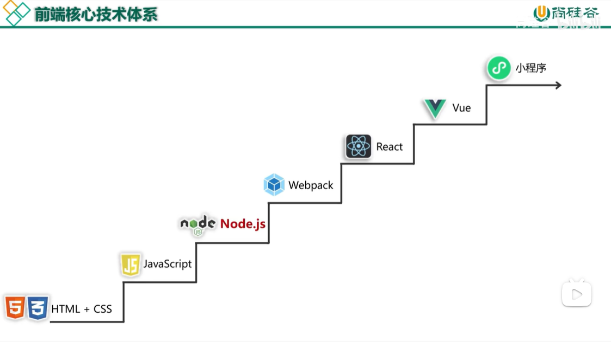
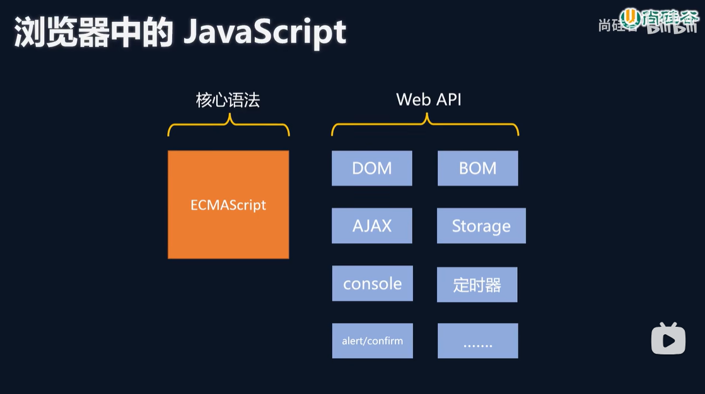
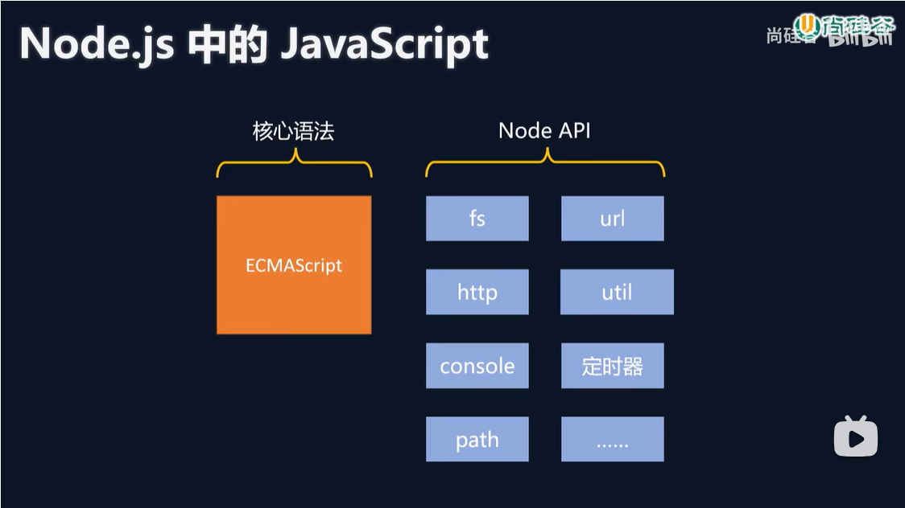
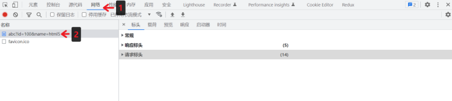
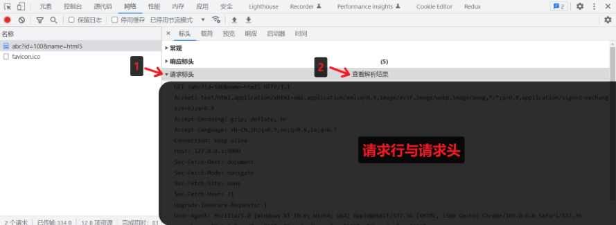
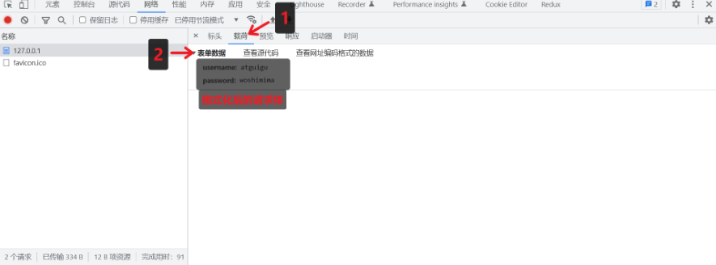
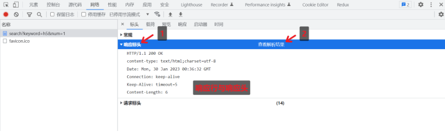
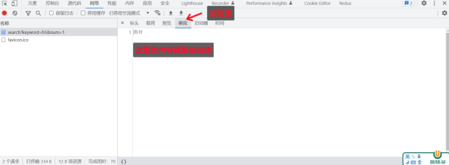

# NodeJS学习

## 一、简介

### 1.1 简介

Node.js 是一个基于 Chrome V8 引擎的 JavaScript 运行时环境，允许开发者使用 JavaScript 编写服务器端代码。

它采用事件驱动、非阻塞 I/O 模型，使其轻量且高效，尤其适合数据密集型实时应用。 

### 1.2 使用场景

|使用场景|示例|
| ---- | ---- |
| 服务器端开发 | web服务器 |
| 开发工具类应用 | vscode等 |
| 桌面应用开发 | electron框架开发跨平台桌面应用 |

### 1.3 下载安装

官网下载：[https://nodejs.org/zh-cn/download](https://nodejs.org/zh-cn/download)，推荐使用LTS版本

安装后，使用node命令查看版本

```
C:\Users\kk>node -v
v22.14.0
```

### 1.4 前端核心技术体系



### 1.5 学习教程

尚硅谷视频：[https://www.bilibili.com/video/BV1gM411W7ex/](https://www.bilibili.com/video/BV1gM411W7ex/)

### 1.6 注意事项

- 浏览器中的Javascript



- Node.js中的Javascript



注意：

1. Node.js中不能使用BOM和DOM的API，可以使用console和定时器API

2. Node.js中的顶级对象为global，也可用globalThis访问顶级对象(globalThis === global)

### 1.7 相关资料

https://nodejs.cn/

## 二、Buffer

### 2.1 概念

Buffer 是一个类似于数组的 `对象` ，用于表示固定长度的字节序列

Buffer 本质是一段内存空间，专门用来处理 `二进制数据` 。


### 2.2 特点

1. Buffer 大小固定且无法调整
2. Buffer 性能较好，可以直接对计算机内存进行操作
3. 每个元素的大小为 1 字节（byte）


### 2.3 使用

#### 1. 创建 Buffer

Node.js 中创建 Buffer 的方式主要如下几种：

1. Buffer.alloc

```javascript
//创建了一个长度为 10 字节的 Buffer，相当于申请了 10 字节的内存空间，每个字节的值为 0
let buf_1 = Buffer.alloc(10); // 结果为 <Buffer 00 00 00 00 00 00 00 00 00 00>
```

2. Buffer.allocUnsafe

```javascript
//创建了一个长度为 10 字节的 Buffer，buffer 中可能存在旧的数据, 可能会影响执行结果，所以叫
unsafe
let buf_2 = Buffer.allocUnsafe(10);
```

3. Buffer.from

```javascript
//通过字符串创建 Buffer
let buf_3 = Buffer.from('hello');
//通过数组创建 Buffer
let buf_4 = Buffer.from([105, 108, 111, 118, 101, 121, 111, 117]);
```

#### 2. Buffer 与字符串的转化

我们可以借助 toString 方法将 Buffer 转为字符串

```javascript
let buf_4 = Buffer.from([105, 108, 111, 118, 101, 121, 111, 117]);
console.log(buf_4.toString())
```

> toString 默认是按照 utf-8 编码方式进行转换的。

#### 3. Buffer 的读写

Buffer 可以直接通过 [] 的方式对数据进行处理。

```javascript
//读取
console.log(buf_3[1]);
//修改
buf_3[1] = 97;
//查看字符串结果
console.log(buf_3.toString());
```

> 注意:
> 1. 如果修改的数值超过 255 ，则超过 8 位数据会被舍弃
> 2. 一个 utf-8 的字符 一般 占 3 个字节

## 三、fs模块

fs 全称为 file system ，称之为 文件系统 ，是 Node.js 中的 内置模块 ，可以对计算机中的磁盘进行操作

### 3.1 文件写入

文件写入就是将 数据 保存到 文件 中，我们可以使用如下几个方法来实现该效果

| 方法                      | 说明     |
| ------------------------- | -------- |
| writeFile                 | 异步写入 |
| writeFIleSync             | 同步写入 |
| appendFile/appendFileSync | 追加写入 |
| createWriteStream         | 流式写入 |

#### 1. writeFile 异步写入

语法： fs.writeFile(file, data[, options], callback)

参数说明：

* file 文件名

*  data 待写入的数据

* options 选项设置 （可选）

* callback 写入回调

返回值： undefined

代码示例：

```javascript
// require 是 Node.js 环境中的'全局'变量，用来导入模块
const fs = require('fs');
//将 『三人行，必有我师焉。』 写入到当前文件夹下的『座右铭.txt』文件中
fs.writeFile('./座右铭.txt', '三人行，必有我师焉。', err => {
//如果写入失败，则回调函数调用时，会传入错误对象，如写入成功，会传入 null
if(err){
console.log(err);
return;
}
console.log('写入成功')；
});
```

#### 2. writeFileSync 同步写入

语法: fs.writeFileSync(file, data[, options])

参数与 fs.writeFile 大体一致，只是没有 callback 参数

返回值： undefined

代码示例：

```javascript
try{
fs.writeFileSync('./座右铭.txt', '三人行，必有我师焉。');
}catch(e){
console.log(e);
}
```

> Node.js 中的磁盘操作是由其他 线程 完成的，结果的处理有两种模式：
>
> * 同步处理 JavaScript 主线程 会等待 其他线程的执行结果，然后再继续执行主线程的代码，
>   效率较低
>
> * 异步处理 JavaScript 主线程 不会等待 其他线程的执行结果，直接执行后续的主线程代码，
>   效率较好

#### 3. appendFile / appendFileSync 追加写入

appendFile 作用是在文件尾部追加内容，appendFile 语法与 writeFile 语法完全相同
语法:

fs.appendFile(file, data[, options], callback)

fs.appendFileSync(file, data[, options])

返回值： 二者都为 undefined

实例代码：

```javascript
fs.appendFile('./座右铭.txt','择其善者而从之，其不善者而改之。', err => {
if(err) throw err;
console.log('追加成功')
});
fs.appendFileSync('./座右铭.txt','\r\n温故而知新, 可以为师矣');
```

#### 4. createWriteStream 流式写入

语法： fs.createWriteStream(path[, options])

参数说明：

* path 文件路径

* (options 选项配置（ 可选 ）

返回值： Object

代码示例：

```javascript
let ws = fs.createWriteStream('./观书有感.txt');
ws.write('半亩方塘一鉴开\r\n');
ws.write('天光云影共徘徊\r\n');
ws.write('问渠那得清如许\r\n');
ws.write('为有源头活水来\r\n');
ws.end();
```

> 程序打开一个文件是需要消耗资源的 ，流式写入可以减少打开关闭文件的次数。
> 流式写入方式适用于 大文件写入或者频繁写入 的场景, writeFile 适合于 写入频率较低的场景

#### 5. 写入文件的场景

文件写入 在计算机中是一个非常常见的操作，下面的场景都用到了文件写入

* 下载文件

* 安装软件

* 保存程序日志，如 Git

* 编辑器保存文件

* 视频录制

> 当 需要持久化保存数据 的时候，应该想到 文件写入

### 3.2 文件读取

文件读取顾名思义，就是通过程序从文件中取出其中的数据，我们可以使用如下几种方式：

| 方法             | 说明     |
| ---------------- | -------- |
| readFile         | 异步读取 |
| readFileSync     | 同步读取 |
| createReadStream | 流式读取 |

#### 1. readFile 异步读取

语法： fs.readFile(path[, options], callback)

参数说明：

* path 文件路径

* options 选项配置

* callback 回调函数

返回值： undefined

代码示例：

```javascript
//导入 fs 模块
const fs = require('fs');
fs.readFile('./座右铭.txt', (err, data) => {
if(err) throw err;
console.log(data);
});
fs.readFile('./座右铭.txt', 'utf-8',(err, data) => {
if(err) throw err;
console.log(data);
});
```

#### 2. readFileSync 同步读取

语法： fs.readFileSync(path[, options])


参数说明：

* path 文件路径

* options 选项配置

返回值： string | Buffer

代码示例：

```javascript
let data = fs.readFileSync('./座右铭.txt');
let data2 = fs.readFileSync('./座右铭.txt', 'utf-8');
```

#### 3. createReadStream 流式读取

语法： fs.createReadStream(path[, options])

参数说明：

* path 文件路径

* options 选项配置（ 可选 ）

返回值： Object

代码示例：

```javascript
//创建读取流对象
let rs = fs.createReadStream('./观书有感.txt');
//每次取出 64k 数据后执行一次 data 回调
rs.on('data', data => {
console.log(data);
console.log(data.length);
});
//读取完毕后, 执行 end 回调
rs.on('end', () => {
console.log('读取完成')
})
```

#### 4. 读取文件应用场景

* 电脑开机

* 程序运行

* 编辑器打开文件

* 查看图片

* 播放视频

* 播放音乐

* Git 查看日志

* 上传文件

* 查看聊天记录

### 3.3 文件移动与重命名

在 Node.js 中，我们可以使用 rename 或 renameSync 来移动或重命名 文件或文件夹
语法：

fs.rename(oldPath, newPath, callback)

fs.renameSync(oldPath, newPath)

参数说明：

* oldPath 文件当前的路径

* newPath 文件新的路径

* callback 操作后的回调

代码示例：

```javascript
fs.rename('./观书有感.txt', './论语/观书有感.txt', (err) =>{
if(err) throw err;
console.log('移动完成')
});
fs.renameSync('./座右铭.txt', './论语/我的座右铭.txt');
```

### 3.4 文件删除

在 Node.js 中，我们可以使用 unlink 或 unlinkSync 来删除文件
语法：

fs.unlink(path, callback)

fs.unlinkSync(path)

参数说明：

* path 文件路径

* callback 操作后的回调

代码示例：

```javascript
const fs = require('fs');
fs.unlink('./test.txt', err => {
if(err) throw err;
console.log('删除成功');
});
fs.unlinkSync('./test2.txt');
```

### 3.5 文件夹操作

借助 Node.js 的能力，我们可以对文件夹进行 创建 、 读取 、 删除 等操作

| 方法                  | 说明       |
| --------------------- | ---------- |
| mkdir / mkdirSync     | 创建文件夹 |
| readdir / readdirSync | 读取文件夹 |
| rmdir / rmdirSync     | 删除文件夹 |

#### 1. mkdir 创建文件夹

在 Node.js 中，我们可以使用 mkdir 或 mkdirSync 来创建文件夹
语法：

fs.mkdir(path[, options], callback)

fs.mkdirSync(path[, options])

参数说明：

* path 文件夹路径

* options 选项配置（ 可选 ）

* callback 操作后的回调

示例代码：

```javascript
//异步创建文件夹
fs.mkdir('./page', err => {
if(err) throw err;
console.log('创建成功');
});
//递归异步创建
fs.mkdir('./1/2/3', {recursive: true}, err => {
if(err) throw err;
console.log('递归创建成功');
});
//递归同步创建文件夹
fs.mkdirSync('./x/y/z', {recursive: true});
```

#### 2. readdir 读取文件夹

在 Node.js 中，我们可以使用 readdir 或 readdirSync 来读取文件夹
语法：

fs.readdir(path[, options], callback)

fs.readdirSync(path[, options])

参数说明：

* path 文件夹路径

* options 选项配置（ 可选 ）

* callback 操作后的回调

示例代码：

```javascript
//异步读取
fs.readdir('./论语', (err, data) => {
if(err) throw err;
console.log(data);
});
//同步读取
let data = fs.readdirSync('./论语');
console.log(data);
```

#### 3. rmdir 删除文件夹

在 Node.js 中，我们可以使用 rmdir 或 rmdirSync 来删除文件夹
语法：

fs.rmdir(path[, options], callback)

fs.rmdirSync(path[, options])

参数说明：

* path 文件夹路径

* options 选项配置（ 可选 ）

* callback 操作后的回调

示例代码：

```javascript
//异步删除文件夹
fs.rmdir('./page', err => {
if(err) throw err;
console.log('删除成功');
});
//异步递归删除文件夹
fs.rmdir('./1', {recursive: true}, err => {
if(err) {
console.log(err);
}
console.log('递归删除')
});
//同步递归删除文件夹
fs.rmdirSync('./x', {recursive: true})
```

### 3.6 查看资源状态

在 Node.js 中，我们可以使用 stat 或 statSync 来查看资源的详细信息

语法：

fs.stat(path[, options], callback)

fs.statSync(path[, options])

参数说明：

* path 文件夹路径

* options 选项配置（ 可选 ）

* callback 操作后的回调

示例代码：

```javascript
//异步获取状态
fs.stat('./data.txt', (err, data) => {
if(err) throw err;
console.log(data);
});
//同步获取状态
let data = fs.statSync('./data.txt');
```

结果值对象结构：

* size 文件体积

* birthtime 创建时间

* mtime 最后修改时间

* isFile 检测是否为文件

* isDirectory 检测是否为文件夹
* ....

### 3.7 相对路径问题

fs 模块对资源进行操作时，路径的写法有两种：

* 相对路径

  * ./座右铭.txt 当前目录下的座右铭.txt

  * 座右铭.txt 等效于上面的写法

  * ../座右铭.txt 当前目录的上一级目录中的座右铭.txt

* 绝对路径

  * D:/Program Files windows 系统下的绝对路径

  * /usr/bin Linux 系统下的绝对路径

> 相对路径中所谓的 当前目录 ，指的是 命令行的工作目录 ，而并非是文件的所在目录
> 所以当命令行的工作目录与文件所在目录不一致时，会出现一些 BUG

### 3.8 __dirname

__dirname 与 require 类似，都是 Node.js 环境中的'全局'变量

__dirname 保存着 当前文件所在目录的绝对路径 ，可以使用 __dirname 与文件名拼接成绝对路径

代码示例：

```javascript
let data = fs.readFileSync(__dirname + '/data.txt');
console.log(data);
```

> 使用 fs 模块的时候，尽量使用 __dirname 将路径转化为绝对路径，这样可以避免相对路径产生的
> Bug

### 3.9 练习

1. 编写一个 JS 文件，实现复制文件的功能
2. 文件重命名

## 四、path模块

path 模块提供了 操作路径 的功能，这是几个较为常用的几个 API：

| API           | 说明                     |
| ------------- | ------------------------ |
| path.resolve  | 拼接规范的绝对路径常用   |
| path.sep      | 获取操作系统的路径分隔符 |
| path.parse    | 解析路径并返回对象       |
| path.basename | 获取路径的基础名称       |
| path.dirname  | 获取路径的目录名         |
| path.extname  | 获得路径的扩展名         |

代码示例：

```javascript
const path = require('path');
//获取路径分隔符
console.log(path.sep);
//拼接绝对路径
console.log(path.resolve(__dirname, 'test'));
//解析路径
let pathname = 'D:/program file/nodejs/node.exe';
console.log(path.parse(pathname));
//获取路径基础名称
console.log(path.basename(pathname))
//获取路径的目录名
console.log(path.dirname(pathname));
//获取路径的扩展名
console.log(path.extname(pathname));
```

## 五、http协议

### 5.1 概念

HTTP（hypertext transport protocol）协议；中文叫超文本传输协议
是一种基于TCP/IP的应用层通信协议

这个协议详细规定了 浏览器 和万维网 服务器 之间互相通信的规则。

协议中主要规定了两个方面的内容

* 客户端：用来向服务器发送数据，可以被称之为请求报文
* 服务端：向客户端返回数据，可以被称之为响应报文

> 报文：可以简单理解为就是一堆字符串

### 5.2 请求报文的组成

* 请求行

* 请求头

* 空行

* 请求体

### 5.3 http的请求行

* 请求方法（get、post、put、delete等）

* 请求 URL（统一资源定位器）

    例如： http://www.baidu.com:80/index.html?a=100&b=200#logo

    * http： 协议（https、ftp、ssh等

    * www.baidu.com 域名
    * 80 端口号
    * /index.html 路径
    * a=100&b=200 查询字符串
    * #logo 哈希（锚点链接）
* HTTP协议版本号

### 5.4 http请求头

格式：『头名：头值』

常见的请求头有：

| 请求头                              | 解释                                                         |
| ----------------------------------- | ------------------------------------------------------------ |
| Host                                | 主机名                                                       |
| Connection                          | 连接的设置 keep-alive（保持连接）；close（关闭连接）         |
| Cache-Control                       | 缓存控制 max-age = 0 （没有缓存）                            |
| Upgrade-<br/>Insecure-<br/>Requests | 将网页中的http请求转化为https请求（很少用）老网站升级        |
| User-Agent                          | 用户代理，客户端字符串标识，服务器可以通过这个标识来识别这个请求来自<br/>哪个客户端 ，一般在PC端和手机端的区分 |
| Accept                              | 设置浏览器接收的数据类型                                     |
| Accept-Encoding                     | 设置接收的压缩方式                                           |
| Accept-<br/>Language                | 设置接收的语言 q=0.7 为喜好系数，满分为1                     |
| Cookie                              | 后面单独讲                                                   |

### 5.5 http的请求体

请求体内容的格式是非常灵活的，

（可以是空）==> GET请求，

（也可以是字符串，还可以是JSON）===> POST请求

例如：

* 字符串：keywords=手机&price=2000
* JSON：{"keywords":"手机","price":2000}

### 5.6 响应报文的组成

* 相应行

    ```
    HTTP/1.1 200 OK
    ```
    
    * HTTP/1.1：HTTP协议版本号
    
    * 200：响应状态码 404 Not Found 500 Internal Server Error
    
    * 还有一些状态码，参考： https://developer.mozilla.org/zh-CN/docs/Web/HTTP/Status
    
    * OK：响应状态描述

* 响应头

  ```
  Cache-Control:缓存控制 private 私有的，只允许客户端缓存数据
  Connection 链接设置
  Content-Type:text/html;charset=utf-8 设置响应体的数据类型以及字符集,响应体为html，字符集
  utf-8
  Content-Length:响应体的长度，单位为字节
  ```

* 空行

* 响应体
    响应体内容的类型是非常灵活的，常见的类型有 HTML、CSS、JS、图片、JSON

### 5.7 创建http服务

使用 nodejs 创建 HTTP 服务

#### 1. 操作步骤

```javascript
//1. 导入 http 模块
const http = require('http');

//2. 创建服务对象 create 创建 server 服务
// request 意为请求. 是对请求报文的封装对象, 通过 request 对象可以获得请求报文的数据
// response 意为响应. 是对响应报文的封装对象, 通过 response 对象可以设置响应报文
const server = http.createServer((request, response) => {
response.end('Hello HTTP server');
});

//3. 监听端口, 启动服务
server.listen(9000, () => {
console.log('服务已经启动, 端口 9000 监听中...');
});
```

> http.createServer 里的回调函数的执行时机： 当接收到 HTTP 请求的时候，就会执行

#### 2. 测试

浏览器请求对应端口

```
http://127.0.0.1:9000
```

#### 3. 注意事项

1. 命令行 ctrl + c 停止服务

2. 当服务启动后，更新代码 必须重启服务才能生效

3. 响应内容中文乱码的解决办法

   ```javascript
   response.setHeader('content-type','text/html;charset=utf-8');
   ```

4. 端口号被占用

  ```javascript
  Error: listen EADDRINUSE: address already in use :::9000
  ```

  1）关闭当前正在运行监听端口的服务 （ 使用较多 ）
  2）修改其他端口号

5. HTTP 协议默认端口是 80 。HTTPS 协议的默认端口是 443, HTTP 服务开发常用端口有 3000，8080，8090，9000 等

> 如果端口被其他程序占用，可以使用 资源监视器 找到占用端口的程序，然后使用 任务管理器关闭对应的程序

### 5.8 浏览器查看 HTTP 报文

点击步骤



#### 1. 查看请求行与请求头



#### 2. 查看请求体



#### 3. 查看 URL 查询字符串


#### 4. 查看响应行与响应头



#### 5. 查看响应体



### 5.9 获取 HTTP 请求报文

想要获取请求的数据，需要通过 request 对象

| 含义           | 语法                                                         | 重点掌握 |
| -------------- | ------------------------------------------------------------ | -------- |
| 请求方法       | request.method                                               | *        |
| 请求版本       | request.httpVersion                                          |          |
| 请求路径       | request.url                                                  | *        |
| URL 路径       | require('url').parse(request.url).pathname                   | *        |
| URL 查询字符串 | require('url').parse(request.url, true).query                | *        |
| 请求头         | request.headers                                              | *        |
| 请求体         | request.on('data', function(chunk){})<br/>request.on('end', function(){}); |          |

注意事项：
1. request.url 只能获取路径以及查询字符串，无法获取 URL 中的域名以及协议的内容
2. request.headers 将请求信息转化成一个对象，并将属性名都转化成了『小写』
3. 关于路径：如果访问网站的时候，只填写了 IP 地址或者是域名信息，此时请求的路径为『 / 』
4. 关于 favicon.ico：这个请求是属于浏览器自动发送的请求

#### 1. 练习

按照以下要求搭建 HTTP 服务

| 请求类型(方法) | 请求地址 | 响应体结果 |
| -------------- | -------- | ---------- |
| get            | /login   | 登录页面   |
| get            | /reg     | 注册页面   |

```javascript
//1、引入http模块
const http = require("http");

//2、建立服务
const server = http.createServer((request,response)=>{
let {url,method} = request; //对象的解构赋值
//设置响应头信息
//解决中文乱码
response.setHeader("Content-Type","text/html;charset=utf-8")
if(url == "/register" && method == "GET"){
response.end("注册页面");
}else if(url=="/login" && method == "GET"){
response.end("登录页面");
}else{
response.end("<h1>404 Not Found</h1>")
}
})

//3、监听端口
server.listen(8000,()=>{
console.log('服务启动中....');
})
```

### 5.10 设置 HTTP 响应报文

| 作用             | 语法                                         |
| ---------------- | -------------------------------------------- |
| 设置响应状态码   | response.statusCode                          |
| 设置响应状态描述 | response.statusMessage （ 用的非常少 ）      |
| 设置响应头信息   | response.setHeader('头名', '头值')           |
| 设置响应体       | response.write('xx')<br/>response.end('xxx') |

```javascript
//write 和 end 的两种使用情况：
//1. write 和 end 的结合使用 响应体相对分散
response.write('xx');
response.write('xx');
response.write('xx');
response.end(); //每一个请求，在处理的时候必须要执行 end 方法的

//2. 单独使用 end 方法 响应体相对集中
response.end('xxx');
```

#### 1. 练习

搭建 HTTP 服务，响应一个 4 行 3 列的表格，并且要求表格有 隔行换色效果 ，且 点击 单元格能 高亮显示

```javascript
//1.导入http模块
const http = require('http')

//2.创建服务对象
const server = http.createServer((request, response) => {
    response.end(`
    <!DOCTYPE html>
    <html lang="zh-CN">
    <head>
    <meta charset="UTF-8">
    <meta name="viewport" content="width=device-width, initial-scale=1.0">
    <title>Document</title>
    <style>
        td{
            padding: 20px 40px;
        }
        table tr:nth-child(odd){
            background-color: #fcb;
        }
        table tr:nth-child(even){
            background-color: #fdf;
        }
        table,td{
            border-collapse: collapse;
        }
    </style>
    </head>
    <body>
        <table border="1">
            <tr>
                <td></td>
                <td></td>
                <td></td>
            </tr>
            <tr>
                <td></td>
                <td></td>
                <td></td>
            </tr>
            <tr>
                <td></td>
                <td></td>
                <td></td>
            </tr>
            <tr>
                <td></td>
                <td></td>
                <td></td>
            </tr>
        </table>
        <script>
            //获取所有的td
            const tds = document.querySelectorAll('td');
            //遍历td
            tds.forEach(item => {
                item.onclick = function() {
                    this.style.background = '#222';
                    }
                })
            
        </script>
    
    </body>
    </html>
        `)
})

//3.监听端口，启动服务
server.listen(9000, () => {
    console.log("服务已经启动");

})
```

### 5.11 网页资源的基本加载过程


网页资源的加载都是循序渐进的，首先获取 HTML 的内容， 然后解析 HTML 在发送其他资源的请求，如CSS，Javascript，图片等。 

理解了这个内容对于后续的学习与成长有非常大的帮助

### 5.12 静态资源服务

静态资源是指 内容长时间不发生改变的资源 ，例如图片，视频，CSS 文件，JS文件，HTML文件，字体文件等

动态资源是指 内容经常更新的资源 ，例如百度首页，网易首页，京东搜索列表页面等

#### 1. 网站根目录或静态资源目录

HTTP 服务在哪个文件夹中寻找静态资源，那个文件夹就是 静态资源目录 ，也称之为 网站根目录

> 思考：vscode 中使用 live-server 访问 HTML 时， 它启动的服务中网站根目录是谁？

#### 2. 网页中的 URL

网页中的 URL 主要分为两大类：相对路径与绝对路径

##### (1) 绝对路径

绝对路径可靠性强，而且相对容易理解，在项目中运用较多

| 形式                   | 特点                                                         |
| ---------------------- | ------------------------------------------------------------ |
| http://atguigu.com/web | 直接向目标资源发送请求，容易理解。网站的外链会用到此形式     |
| //atguigu.com/web      | 与页面 URL 的协议拼接形成完整 URL 再发送请求。大型网站用的比较多 |
| /web                   | 与页面 URL 的协议、主机名、端口拼接形成完整 URL 再发送请求。中小<br/>型网站 |

##### (2) 相对路径

相对路径在发送请求时，需要与当前页面 URL 路径进行 计算 ，得到完整 URL 后，再发送请求，学习阶段用的较多

例如当前网页 url 为 http://www.atguigu.com/course/h5.html

| 形式               | 最终的 URL                                |
| ------------------ | ----------------------------------------- |
| ./css/app.css      | http://www.atguigu.com/course/css/app.css |
| js/app.js          | http://www.atguigu.com/course/js/app.js   |
| ../img/logo.png    | http://www.atguigu.com/img/logo.png       |
| ../../mp4/show.mp4 | http://www.atguigu.com/mp4/show.mp4       |

##### (3) 网页中使用 URL 的场景小结

包括但不限于如下场景：

* a 标签 href
* link 标签 href
* script 标签 src
  img 标签 src
* video audio 标签 src
* form 中的 action
* AJAX 请求中的 URL

#### 3. 设置资源类型（mime类型）

媒体类型（通常称为 Multipurpose Internet Mail Extensions 或 MIME 类型 ）是一种标准，用来表示文档、文件或字节流的性质和格式。

```
mime 类型结构： [type]/[subType]
例如： text/html text/css image/jpeg image/png application/json
```

HTTP 服务可以设置响应头 Content-Type 来表明响应体的 MIME 类型，浏览器会根据该类型决定如何处理资源

下面是常见文件对应的 mime 类型

```
html: 'text/html',
css: 'text/css',
js: 'text/javascript',
png: 'image/png',
jpg: 'image/jpeg',
gif: 'image/gif',
mp4: 'video/mp4',
mp3: 'audio/mpeg',
json: 'application/json'
```

> 对于未知的资源类型，可以选择 application/octet-stream 类型，浏览器在遇到该类型的响应时，会对响应体内容进行独立存储，也就是我们常见的 下载 效果

```javascript
require('http').createServer((request, response) => {
    //获取请求的方法已经路径
    let { url, method } = request;
    //判断请求方式以及请求路径
    if (method == "GET" && url == "/index.html") {
        //需要响应文件中的内容
        let data = require('fs').readFileSync(__dirname + '/index.html');
        response.end(data);
    } else if (method == "GET" && url == "/css/app.css") {
        //需要响应文件中的内容
        let data = require('fs').readFileSync(__dirname + '/public/css/app.css');
        response.end(data);
    } else if (method == "GET" && url == "/js/app.js") {
        //需要响应文件中的内容
        let data = require('fs').readFileSync(__dirname + '/public/js/app.js');
        response.end(data);
    }
    else {
        //404响应
        response.statusCode = 404;
        response.end("<h1>404 Not Found</h1>");
    }
}).listen(80, () => {
    console.log('80端口正在启动中....');
})
```

很明显上面的代码，当只要有一个请求路径就需要进行判断，显然这种方式不够完美，那么我们需要封装

```javascript
require('http').createServer((request, response) => {
    //获取请求的方法已经路径
    let { url, method } = request;
    //文件夹路径
    let rootDir = __dirname + '/public';
    //拼接文件路径
    let filePath = rootDir + url;
    //读取文件内容
    fs.readFile(filePath, (err, data) => {
        //判断
        if (err) {
            //如果出现错误，响应404状态码
            response.statusCode = 404;
            response.end('<h1>404 Not Found</h1>');
        } else {
            //响应文件内容
            response.end(data);
        }
    })
}).listen(80, () => {
    console.log('80端口正在启动中....');
})
```

#### 4. GET 和 POST 请求场景小结

GET 请求的情况：

* 在地址栏直接输入 url 访问

* 点击 a 链接

* link 标签引入 css

* script 标签引入 js

* img 标签引入图片

* form 标签中的 method 为 get （不区分大小写）

* ajax 中的 get 请求

POST 请求的情况：

* form 标签中的 method 为 post（不区分大小写）
* AJAX 的 post 请求

### 5.13 GET和POST请求的区别

GET 和 POST 是 HTTP 协议请求的两种方式。

* GET 主要用来获取数据，POST 主要用来提交数据

* GET 带参数请求是将参数缀到 URL 之后，在地址栏中输入 url 访问网站就是 GET 请求，
  POST 带参数请求是将参数放到请求体中

* POST 请求相对 GET 安全一些，因为在浏览器中参数会暴露在地址栏

* GET 请求大小有限制，一般为 2K，而 POST 请求则没有大小限制