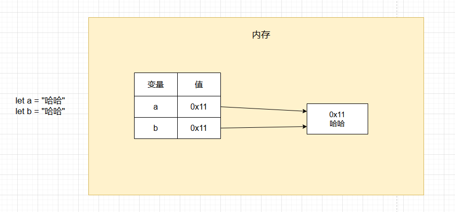
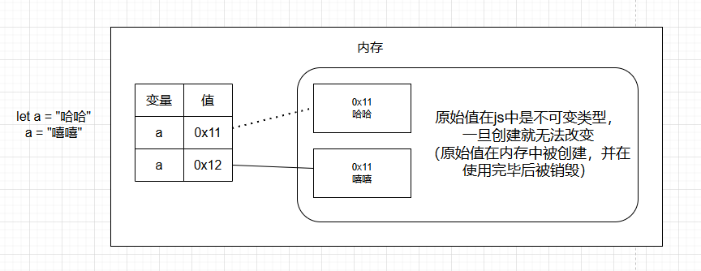

# JavaScript学习

## 一、代码

### 1、入门

#### 1.1 helloworld

js例子

```js
<!DOCTYPE html>
<html lang="zh-CN">
<head>
    <meta charset="UTF-8">
    <meta name="viewport" content="width=device-width, initial-scale=1.0">
    <title>Hello World</title>
    <script>
        // alert("Hello World!")

        // console.log("你猜我在哪里？")

        document.write("Hello World!")
    </script>
</head>
<body>
    
</body>
</html>
```

#### 1.2 编写位置

js可以编写到多个位置

```javascript
<!DOCTYPE html>
<html lang="zh-CN">

<head>
    <meta charset="UTF-8">
    <meta name="viewport" content="width=device-width, initial-scale=1.0">
    <title>js的编写位置</title>
    <!--
        1.可以将js编写到网页内部的<script>标签中
    -->

    <!-- <script type="text/javascript">
        //type="text/javascript" 可以省略
        alert("Hello, World!");
    </script> -->

    <!--
        2.可以将js编写到外部的js文件中，然后在网页中通过<script>标签引入
    -->
    <!-- <script src="scripts.js"></script> -->
</head>

<body>
    <!-- 3.可以将js代码编写到指定属性中 -->
    <button onclick="alert('你点我干嘛')">点击我一下</button>
    <hr>
    <a href="javascript:alert('你点我干嘛')">超链接</a>
</body>

</html>
```

#### 1.3 基本语法

注释，大小写，分号，空格和换行

```javascript
    <script>
        /*
        1.多行注释
            - 注释中的内容会被忽略执行
            - 可以通过注释来对代码进行解释说明
            - 也可以通过注释来屏蔽掉不需要执行的代码
        */

        // 2.单行注释
        // alert("Hello, World!"); // 弹出Hello, World!

        /*
            3.js严格区分大小写
        */
        //    Alert("Hello, World!"); //大写无法识别，会报错

        /*
            4.js中多个换行和空格会被忽略，但是建议不要过度使用空格
                - 可以利用这个特点来对代码进行格式化
        */
        //    alert(  231

        //     )

        /*
            5.js中每条语句以分号结尾，大部分情况可以省略
                - js会自动添加分号，但是有一些情况需要手动添加分号
        */
        alert("Hello, World!");
        console.log("Hello, World!");
    </script>
```

#### 1.4 自变量和变量

变量的声明和赋值

```javascript
    <script>
        /*
            字面量
                - 字面量其实就是一个值，它所代表的含义就是它的字面意思。
                - 比如：1 2 3 4 100 "hello" true false null undefined 等都是字面量。
                - js中所有字面量都可以直接使用，但是直接使用字面量不方便

            变量
                - 变量可以用来“存储”字面量
                - 并且变量存储的字面量可以随意修改
                - 通过变量可以对字面量进行描述，并且变量比较方便修改
        */

        let x
        x = 80
        x = "哈哈"
        console.log(x);

        let age
        age = 80
        age = 81
        console.log(age); // 80

        /*
            多行数值：shift + alt + a
            变量的使用
                - 声明变量 -> let 变量名
                - 赋值 -> 变量名 = 值
                - 声明和赋值同时进行 -> let 变量名 = 值
        */
        let a
        let b, c, d

        a = 10
        a = "hello"
        a = true

        console.log(a);

        //var是旧的变量声明方式，let是新的变量声明方式，推荐使用let
        var f
        f = 10
        console.log(f); // 10

        let i = 100
        console.log(i);
    </script>
```

#### 1.5 变量的内存结构

变量在被赋值时，会在内存检查这个值是否存在，如果存在，则直接引用



```javascript
    <script>

        /* 
            变量中不存储任何值，而是存储值的内存地址
        */
        let a = "哈哈"
        let b = "哈哈"

    </script>
```

#### 1.6 常量

```javascript
    <script>
        /* 
            在js中，使用const来声明常量，常量的值不能被修改。
                在js中，除了常规的常量外，还有一些对象类型的数据也会声明为常量
        */
        const PI = 3.1415926;
        // PI = 3; // 报错，常量的值不能被修改
        console.log(PI);
    </script>
```

#### 1.7 标识符

```javascript
    <script>
        /* 
            在js中，所有可以由我们自由命名的内容，都可以认为是一个标识符
                像变量名、函数名、类名、属性名等等

            使用标识符需要遵循如下规范：
                1.标识符只能含有字母、数字、 下划线、$，且不能以数字开头
                2.标识符不能是js中的关键字和保留字，也不建议使用内置的函数或类名作为变量名
                3.命名规范
                    - 通常会使用驼峰命名法
                        - 首字母小写，每个单词开头大写
                        - maxlength -> maxLength
                        - username -> userName

                    - 类名会使用大驼峰命名法
                        - 首字母大写，每个单词开头大写
                        - MyClass -> MyClass
                        - UserLogin -> UserLogin
                    
                    - 常量名全部大写，单词间用下划线连接
                        - MAX_LENGTH -> MAX_LENGTH
                        - USER_NAME -> USER_NAME
        */

        let a = 10  //a变量就是标识符
        let abc = 22
        let abc123 = 22
        let abc123_ = 22

        let _abc123_ = 22
        let $abc123_ = 22

        // 以下是错误的标识符
        // let 1abc = 22 // 不能以数字开头
        // let abc-123 = 22 // 不能包含特殊符号
        // let abc 123 = 22 // 不能包含空格

        // let let = 10 // 不能使用js中的关键字let
        // let function = 10 // 不能使用js中的关键字function

        // let alert = 55 // 不能使用js中的保留字alert
    </script>
```

### 2、数据类型

#### 2.1 数据类型_数值

```javascript
    <script>
        /*
            数值（Number）
                - 在js中，所有的整数和浮点数都属于数值类型
                - js中的数字不是无限大的，超过一定范围会用科学计数法显示近似值
                - 在js中进行一些高精度的运算要十分注意，避免出现精度丢失
                - NaN（Not a Number）是一个特殊的数值，表示非法的数字
        */

        let a = 10
        a = 10.5
        a = 99999999999999999   //100000000000000000
        a = 999999999999999999999 // 科学计数法显示1e+21
        a = 0.00000000001   //1e-11
        console.log(a);

        // 数值运算
        //0.1+0.2=0.30000000000000004

        // a = 1 - 'a' // 报错NaN，不能将字符串和数值进行运算

        /* 
            大整数（BigInt）
                - 大整数用来表示一些比较大的整数
                - 大整数使用n结尾，它可以表示的范围无限大，但是会受到内存的限制
        */

        a = 999999999999999999999999999999999999999n
        console.log(a);

        /* 
            其他进制的数字
                - 二进制：0b
                - 八进制：0o
                - 十六进制：0x

        */
       let b = 55
       b = 0b1010 // 二进制

       console.log(b);  // 打印的结果是十进制的10
    </script>
```

#### 2.2 类型检查

```javascript
    <script>
        let a = 10
        let b = 10n

        console.log(a);
        console.log(b);

        // a + b // 运行报错，类型不匹配

        /* 
            typeof 运算符可以用来检查变量的类型。
            typeof 运算符返回一个字符串，该字符串表示变量的类型。
        */

        console.log(typeof a); // "number"
        console.log(typeof b); // "bigint"
    </script>
```

#### 2.3 字符串

```javascript
    <script>
        /* 
            字符串
                - js中，使用单引号或双引号括起来的字符串，都属于字符串类型
                - 转义字符 \
                    \" -> "
                    \' -> '
                    \\ -> \
                    \n -> 换行符
                    \t -> 制表符
                - 模板字符串
                    - 使用反单引号`来表示模板字符串
                    - 模板字符串可以嵌入变量
                - 使用typeof检查一个字符串时，会返回"string"
        */

        let a = 'hello';
        a = "你好"
        a = "这是一个'字符串'"
        a = '这是一个"字符串"'
        a = "这是一个\"字符串\""    //\转义字符
        a = '这是一个\'字\\符串\''   //\转义字符
        a = "这是一个\n换行符"      //\n换行符
        a = "这是一个\t制表符"      //\t制表符

        a = "今天天气真不错"
        a = `今天天气
        挺好的` //模板字符串可以跨行使用

        console.log(a);

        let name = "孙悟空"
        let str = `你好, ${name}`
        console.log(str);

        let b = 10
        console.log(`b = ${b}`);

        let c = 5   //数字5
        c = "5"   //字符串"5"
        console.log(typeof c);
    </script>
```

#### 2.4 其他数据类型

```javascript
    <script>
        /*
            整数（Number）
                - js中，整数和浮点数统称为数字
                - 整数可以使用十进制、八进制、十六进制表示
                - 整数可以使用前缀0x或0o表示
                - 使用typeof检查一个数字时，会返回"number"

            字符串（String）
                - js中，使用单引号或双引号括起来的字符串，都属于字符串类型
                - 转义字符 \
                    \" -> "
                    \' -> '
                    \\ -> \
                    \n -> 换行符
                    \t -> 制表符
                - 模板字符串
                    - 使用反单引号`来表示模板字符串
                    - 模板字符串可以嵌入变量
                - 使用typeof检查一个字符串时，会返回"string"

            布尔值（Boolean）
                - 布尔值主要用来进行逻辑判断
                - 只有两个值：true 和 false
                - 使用typeof检查一个布尔值会返回"boolean"

            空值（null）
                - 空值表示一个空对象，它是一个特殊的值，表示“没有值”
                - 空值只有一个值：null
                - 使用typeof检查一个空值会返回"object"
                - 使用typeof无法检查空值

            未定义值（undefined）
                - 当声明一个变量而没有赋值时，它的值就是undefined
                - 未定义值只有一个值：undefined
                - 使用typeof检查一个未定义值会返回"undefined"

            符号（Symbol）
                - 用来创建一个唯一的标识
                - 使用typeof检查一个符号会返回"symbol"

            js中原始值一共有7种
                1. 数字（Number）
                2.大整数（BigInt）
                3.字符串（String）
                4.布尔值（Boolean）
                5.空值（null）
                6.未定义值（undefined）
                7.符号（Symbol）
            
            这7种原始值是构成各种数据的基石
                原始值在js中是不可变类型，一旦创建就无法改变（原始值在内存中被创建，并在使用完毕后被销毁）
        */

        let bool = true //真
        bool = false    //假
        console.log(bool);
        console.log(typeof bool);   //"boolean"

        let a = null;
        console.log(a);
        console.log(typeof a);   //"object"

        let b
        console.log(b);
        console.log(typeof b);   //"undefined"

        let c = Symbol()    //调用Symbol函数创建一个唯一的标识符
        console.log(c);        //Symbol()
        console.log(typeof c);   //"symbol"
    </script>
```

* 注意原始值是不可变类型，一旦创建就无法改变



#### 2.5 类型转换_字符串

```javascript
    <script>
        /* 
            类型转换：将一种数据类型转换为其他数据类型
                主要将其他类型转换为（字符串、数字和布尔值）

            转换字符串
                1.调用toString()方法将其他类型转换为字符串
                    - 调用方法：
                        xxx的yyy方法 -> xxx.yyy()
                    - 由于null和undefined没有toString()方法，所以不能转换为字符串
                2.调用String()函数将其他类型转换为字符串
                    - 调用函数：
                        调用xxx的函数 -> 函数名(xxx)
                    - 原理：
                        对于拥有toString()方法的值调用String()函数时，
                            实际上就是在调用toString()方法。
                        对于null和undefined调用String()函数时，
                            实际上返回字符串"null"和"undefined"。
         */

        let a = 10
        a = true
        a = 11n
        // a = null //报错，null不能转换为字符串
        // a = undefined //报错，undefined也不能转换为字符串
        a = a.toString();   //将a转换为字符串
        console.log(typeof a, a);   //typeof a,a 输出变量a的类型和值

        let b = 33
        b = null    //"null"
        b = undefined    //"undefined"
        b = String(b);   //将b转换为字符串
        console.log(typeof b, b)
    </script>
```

#### 2.6 类型转换_数值

```javascript
    <script>
        /* 
            将其他的数据类型转换为数值
                1. Number()函数：将其他数据类型转换为数值
                    转换的情况：
                        - 字符串：
                            - 如果字符串是一个合法的数字，则会自动转换为相应的数值
                            - 如果字符串不是一个合法的数字，则会返回NaN
                            - 如果字符串是空串或纯空格的字符串，则会返回0
                        - 布尔值：
                            - true转换为1，false转换为0
                        - null
                            - null转换为0
                        - undefined
                            - undefined转换为NaN

                2. parseInt()函数：将字符串转换为整数
                    - 解析时，会自左向右读取一个字符串，直到读到所有字符串中的有效整数
                    - 也可以用parseInt()来对一个数字取整
                3. parseFloat()函数：将字符串转换为浮点数
                    - 解析时，会自左向右读取一个字符串，直到读到所有字符串中的有效浮点数
        */

        let a = "123"
        a = "abc" // "abc"不是一个合法的数字，返回NaN
        a = "" // 0
        a = " " // 0
        a = true // 1
        a = false // 0
        a = null // 0
        a = undefined // NaN
        a = Number(a) // 123

        console.log(typeof a, a);

        let b = '123px'
        b = '123.45'
        // b = 'a123'  // 'a123'不是一个合法的数字，返回NaN
        // b = Number(b) // NaN
        b = parseInt(b) // 123
        
        console.log(typeof b, b);
    </script>
```

#### 2.7 类型转换_布尔值

```javascript
    <script>
        /* 
            1.使用Boolean()函数将其他类型的值转换为布尔值
                - 转换情况：
                    - 数字：
                        - 除了0和NaN转换为false，其他数字都为true
                    - 字符串：
                        - 空串是false，非空串是true
                    - null和undefined：
                        - 都转换为false
                    - 其他对象：
                        - 除了null和undefined，其他对象都转换为true

                - 所有表示空性的，错误的，没有的都会转换为false
                    0, NaN, "", null, undefined,false
        */

        let a = 1
        a = 0 // false
        a = -1 // true
        a = NaN // false
        a = Infinity // true

        a = "abc"    // true
        a = "true"   // true
        a = "false"  // true
        a = ""       // false
        a = " "    // true

        a = null     // false
        a = undefined // false

        a = Boolean(a) // true

        console.log(typeof a,a);
    </script>
```

### 3、运算符

#### 3.1 算术运算符

```javascript
    <script>
        /* 
            运算符（操作符）
                - 运算符可以用来对一个或多个值（操作数）进行运算
                - 算术运算符：
                    + 加法运算符
                    - 减法运算符
                    * 乘法运算符
                    / 除法运算符
                    % 取模运算符
                    ** 幂运算符
                
                - 注意：
                    - 算术运算时，除了字符串的加法，
                        其他运算的操作数是非数值时，都会自动转换为数值再运算
        */
        let a = 1 + 1
        a = 10 - 5
        a = 2 * 4
        a = 10 / 5
        a = 10 / 3
        a = 10 / 0   // 除数不能为0，返回值为Infinity
        a = 10 % 3   // 取模运算符，返回余数
        a = 2 ** 3   // 2的3次方
        a = 9 ** 0.5    // 9的平方根
        a = 9 ** .5     // 省略0的写法

        /* 
            js是一门弱类型语言，当进行运算时会通过自动的类型转换来完成运算
        */
        a = 10 - '5'    //10-5
        a = 10 + true   //10+1
        a = 5 + null    //5+0
        // a = 6 - undefined   //6-NaN，结果为NaN，不能这么操作

        /* 
            当任意一个值和字符串做运算时，会先将其他值转换为字符串
                然后再进行字符串的拼接
            可以利用这个特点来进行类型转换
                可以为任意类型 + 一个空串的形式来完成转换字符串
                    其原理和String()函数一样，但使用起来更方便
        */
        a = 1 + "2"    // "12"

        a = true
        a = a + ""      // "true"
        console.log(typeof a, a);
    </script>
```

#### 3.2 赋值运算符

```javascript
    <script>
        /* 
            赋值运算符用来将一个值赋给一个变量。
                =   赋值运算符
                    - 将右侧的值赋给左侧的变量
                +=  加等于运算符
                    - 相当于 a = a + b
                -=  减等于运算符
                    - 相当于 a = a - b
                *=  乘等于运算符
                    - 相当于 a = a * b
                /=  除等于运算符
                    - 相当于 a = a / b
                %=  取模等于运算符
                    - 相当于 a = a % b
                **= 幂等于运算符
                    - 相当于 a = a ** b
                ??= 三元赋值运算符
                    - 相当于 a = a ?? b
                    - 只有变量的值为null或undefined时才会赋值，否则不会赋值。
        */
        let a = 10
        a = 20   //将右边的值赋值给左边的变量
        let b = a   //将变量a的值赋值给变量b

        a = 66
        a = a + 11   //大部分运算符都不会改变变量的值，只有赋值运算符会改变变量的值。

        a = 5
        a += 5   //相当于 a = a + 5

        a = undefined
        a??=20

        console.log(a)
    </script>
```

#### 3.3 一元±

```javascript
    <script>
        /* 
            一元±运算符
                + 正好
                    - 不会改变数值的符号

                - 负号
                    - 可以对符号位取反，将正数变成负数，将负数变成正数。

                当我们对非数值类型进行正负运算时，会先将其转换为数值然后再运算。
        */

        let a = 10
        a = +a
        a = -a
        console.log(a);

        let b = '123'
        b = +b // 123，隐式类型转换

        console.log(b);
    </script>
```

#### 3.4 自增和自减

```javascript
    <script>
        /* 
            ++ 自增运算符
                - ++ 使用会使得原来的变量立刻增加1
                - 自增分为前置和后置两种形式，前置形式 ++a，后置形式 a++
                - 无论是a++还是++a，都表示变量a的值增加1
                - 不同的是++a和a++所返回的值不同
                    a++返回的是a的旧值
                    ++a返回的是a的新值
        */
        let a = 10

        // let b = a++ //a++返回的是a的旧值，即10，而a自增后的值为11
        let b = ++a // ++a返回的是a的新值，即11，而a自增后的值为11

        console.log(a);
        console.log(b);

        let n = 5
        let result = n++ + ++n + n // 5+7+7=19
        console.log(result); // 19

        /* 
            -- 自减运算符
                - -- 使用会使得原来的变量立刻减少1
                - 自减分为前置和后置两种形式，前置形式 --a，后置形式 a--
                - 无论是a--还是--a，都表示变量a的值减少1
                - 不同的是--a和a--所返回的值不同
                    a--返回的是a的旧值
                    --a返回的是a的新值
        */
    </script>
```

#### 3.5 逻辑运算符-非

```javascript
    <script>
        /* 
            ! 非运算符
                - 可以用来对一个值进行非运算，即取反。
                - 它可以对一个布尔值进行非运算，将其取反。
                    true -> false
                    false -> true
                - 如果对一个非布尔值取反，则会先将其转换为布尔值，然后再取反。
                    可以利用这个特点将其他值转换为布尔值。
                
                - 类型转换
                    转换为字符串
                        显式转换
                            String()
                        隐式转换
                            + ""

                    转换为数值
                        显式转换
                            Number()
                        隐式转换
                            + 0

                    转换为布尔值
                        显式转换
                            Boolean()
                        隐式转换
                            !!
                

            && 与运算符

            || 或运算符
        */
        let a = 1
        a = !a
        console.log(a)

        a = 123
        // a = Boolean(a)
        a = !!a // 取两次反可以转换为布尔值

        console.log(typeof a, a);
    </script>
```

#### 3.6 逻辑运算符-与-或

```javascript
    <script>
        /* 
            && 逻辑与
                - 可以对两个值进行与运算
                - && 左右两边的表达式都为真，结果才为真
                - 否则，结果为假
                - 与运算是找flase的，如果找到false则直接返回，没有false才会执行第二个
                - 对应非布尔值进行运算，它会先转换为布尔值再进行运算
                    但是最后回返回的是原值，而不是布尔值
                    - 如果第一个值为false，则直接返回第一个值
                    - 如果第一个值为true，则返回第二个值

            || 逻辑或
                - 可以对两个值进行或运算
                - 当||左右两边的表达式有一个为真，结果为真
                - 否则，结果为假
                - 或运算时找true的，如果第一个值为true，则不看第二个
                - 对应非布尔值进行运算，它会先转换为布尔值再进行运算
                    但是最后回返回的是原值，而不是布尔值
                    - 如果第一个值为true，则直接返回第一个值
                    - 如果第一个值为false，则返回第二个值
        */
        let result = true && true; // true
        result = true && false; // false
        result = false && true; // false

        //    true && alert("hello"); // 第一个为true，alert会执行
        // false && alert("hello"); // 第一个为false，alert不会执行

        result = 1 && 2; // 2
        result = 1 && 0; // 0
        result = 0 && NaN; // 0，第一个为false，直接返回第一个

        result = true || false; // true
        result = false || true; // true
        result = false || false; // false

        // false || alert("hello"); // 第一个为false，alert会执行
        true || alert("hello"); // 第一个为true，alert不会执行
        console.log(result);
    </script>
```

#### 3.7 关系运算符

```javascript
    <script>
        /* 
            关系运算符：
                - 关系运算符用来检查两个值之间的关系是否成立
                    成立：返回true
                    不成立：返回false
                >   大于
                    - 用来检查左值是否大于右值
                <   小于
                    - 用来检查左值是否小于右值
                >=  大于等于
                     - 用来检查左值是否大于等于右值
                <=  小于等于
                     - 用来检查左值是否小于等于右值

            注意：
                当对非数值运算时，它会先将其转换为数值再进行比较。
                当关系运算符的两端是两个字符串时，它会先将字符串转换为unicode编码的比较，再进行比较。
                    - 字符串的比较是按照unicode编码的顺序逐位进行的。
                      利用这个特点可以对字符串安装字母排序
                    - 注意比较字符串和数字时一定要进行类型转换
                
                ==  等于
                    - 用来检查两个值是否相等
                === 全等（值和类型都相等）
                     - 用来检查两个值是否全等（值和类型都相等）
               !=  不等于
                  - 用来检查两个值是否不相等
               !== 不全等（值或类型不相等）
                    - 用来检查两个值是否不全等（值或类型不相等）
        */
        let result = 10 > 5; // true
        result = 5 > 5; // false
        result = 5 >= 5; // true

        result = 5 < "10"   // true
        result = 1 > false; // true
        result = "a" < "b"  // true
        result = "abc" < "b"     // false

        result = "12" < "2" //ture，字符串比较，从左往右比较，"1" < "2"
        result = +"12" < "2" //false，转换为数字，12 < 2

        //检查number是否在5和10之间
        let num = 6
        result = 5 < num && num < 10; // true
        console.log(result);
    </script>
```

#### 3.8 相等运算符

```javascript
    <script>
        /* 
            == 
                - 相等运算符，用来比较两个值是否相等，如果相等返回true，否则返回false。
                - 使用相等运算符比较两个不同类型的值时
                    它会转换为相同类型后再比较，通常转换为数字比较
                    类型转换后值相同，也会返回true
                - 对于null和undefined，相等运算符会返回true
                - NaN与任何值都不相等，包括它自己

            ===
                - 全等运算符，用来比较两个值是否全等，如果全等返回true，否则返回false。
                - 它不会进行类型转换，如果两个值类型不同，则返回false
                - 对于null和undefined，全等运算符会返回false

            !=
                - 不等于运算符，用来比较两个值是否不相等，如果不相等返回true，否则返回false。
                - 它也会进行类型转换，如果两个值类型不同，则返回true

            !==
                - 不全等运算符，用来比较两个值是否不全等，如果不全等返回true，否则返回false。
                - 它不会进行类型转换，如果两个值类型不同，则返回true
        */
        let result = 1 == 1   //true
        result = 1 == "2"    //false
        result = 1 == "1"   //true
        result = true == "1"    //true

        result = null == undefined   //true
        result = NaN == NaN   //false

        result = 1 === 1   //true
        result = 1 === "1"    //false
        result = null === undefined   //false

        result = 1 != 1   //false
        result = 1 != "1"    //false

        result = 1 !== "1"   //false

        console.log(result);
    </script>
```

#### 3.9 条件运算符

```javascript
    <script>
        /* 
            条件运算符：
                语法：条件? 表达式1 : 表达式2
                - 执行顺序：
                    条件运算符在执行时，会先对条件进行求值判断
                        如果结果为true，则执行表达式1
                        如果结果为false，则执行表达式2
        */
        // true ? alert(1) : alert(2); // 1
        // false? alert(1) : alert(2); // 2

        let a = 10
        let b = 20
        // a > b ? alert("a>b") : alert("a<=b") // a<=b

        let max = a > b ? a : b;    //获取两个值当中的最大值
        alert(max); // 20
    </script>
```

#### 3.10 运算符的优先级

```javascript
    <script>
        /* 
            和数学一样，js中的运算符也有优先级，比如先乘除，再加减。

            可以通过优先级的表格来查询运算符的优先级
                - 运算符的优先级表格：https://developer.mozilla.org/zh-CN/docs/Web/JavaScript/Reference/Operators/Operator_Precedence
                - 在表格中，运算符的优先级由高到低排列，优先级相同的运算符，则从左到右进行运算。
                    优先级的表格不需要记忆，甚至表格都不用看
                    因为()拥有最高优先级，使用运算符时，如果遇到拿不准的，可以直接通过()来改变优先级即可
        */
        let a = 1 + 2 * 3; // 先乘除，再加减

        a = 1 && (2 || 3);
        console.log(a); // 7
    </script>
```

### 4、流程控制

#### 4.1 代码块

```javascript
    <script>
        /* 
            使用{}来创建代码块，代码块可以用来对代码进行分组，提高代码的可读性和可维护性。
                同一个代码块中的代码，就是同一组代码，一个代码块的中的代码，要么都执行，要么都不执行。

            let和var
                - 在js中，使用let声明的变量具有块级作用域
                    在代码块中声明的变量无法在代码块外访问，只能在代码块内访问。
                - 使用var声明的变量，不具有块级作用域
                    在代码块中声明的变量可以在代码块外访问。
        */
        {
            // let a = 10
            var a = 10
            // console.log(a);

        }
        console.log(a);
    </script>
```

#### 4.2 if语句

```javascript
    <script>
        /* 
            流程控制语句
                1.条件判断语句
                2.条件分支语句
                3.循环语句

            if语句
                - 语法：
                    if (条件表达式) {
                        语句...
                    }

                - 执行顺序
                    if语句在执行时，会先对if后的条件表达式进行求值判断，
                        如果结果为true，则执行if语句块内的代码，
                        如果结果为false，则跳过
                    
                    if语句只会控制紧随其后的那一行代码，如果希望控制多行代码，可以使用{}将语句括起来
                        最佳实践：即使只有一行代码，也要使用{}将代码括起来，以提高可读性

                    if后面的表达式不是布尔值，会转换为布尔值，然后再执行
        */

        // if (false)
        //     alert("哈哈")

        let a = 10
        // if (a > 10) {
        //     alert("a大于10")
        //     alert(11111)
        // }

        // if(100){
        //     alert("你猜我执行吗")
        // }

        if (a === 10) {
            alert("a等于10")
        }
    </script>
```

#### 4.3 if-else语句

```javascript
    <script>
        /* 
            if-else语句
                - 语法：
                    if(条件表达式){
                        语句...
                    }else{
                        语句...
                    }
                
                - 执行流程
                    if-else执行时，先对条件表达式求值判断
                        如果结果为true，则执行if语句块
                        如果结果为false，则执行else语句块

                if-else if-else语句
                    - 语法：
                        if(条件表达式1){
                            语句...
                        }else if(条件表达式2){
                            语句...
                        }else if(条件表达式3){
                            语句...
                        }else{
                            语句...
                        }
                - 执行流程
                    if-else if-else执行时，会自上向下依次对if条件表达式求值判断
                        如果结果为true，则执行if语句块
                        如果结果为false，则对条件表达式2求值判断
                            如果结果为true，则执行else if语句块
                            如果结果为false，则对条件表达式3求值判断
                                如果结果为true，则执行else if语句块
                                如果结果为false，则执行else语句块

                注意：
                    if-else if-else语句只会有一个代码块被执行，
                        一旦有执行的代码块，下边的条件都不会再继续判断了
                        所以一定要注意条件的编写顺序，确保正确的执行代码块
        */

        let age = 10
        // if (age >= 60) {
        //     alert("你已经退休了！")
        // } else {
        //     alert("你还没退休！")
        // }

        age = 200

        // if (age >= 100) {
        //     alert("你真是一个长寿的人！")
        // } else if (age >= 80) {
        //     alert("你比楼上那位还年轻不少")
        // } else if (age >= 60) {
        //     alert("你已经退休了！")
        // } else if (age >= 30) {
        //     alert("你已经步入中年了")
        // } else if (age >= 18) {
        //     alert("你已经成年了")
        // } else {
        //     alert("你还未成年！")
        // }

        /*
            - 练习1：
            编写一个程序，获取一个用户输入的整数。然后通过程序显示这个数是奇数还是偶数。


            - 练习2：
            从键盘输入小明的期末成绩:
                    当成绩为100时，'奖励一辆BMW'
                    当成绩为[80-99]时，'奖励一台iphone'
                    当成绩为[60-79]时，'奖励一本参考书'
                    其他时，什么奖励也没有

            - 练习3：
            大家都知道，男大当婚，女大当嫁。那么女方家长要嫁女儿，当然要提出一定的条件：
                高：180cm以上; 富:1000万以上; 帅:500以上;
                如果这三个条件同时满足，则:'我一定要嫁给他'
                如果三个条件有为真的情况，则:'嫁吧，比上不足，比下有余。'
                如果三个条件都不满足，则:'不嫁！'
        */

        // prompt()可以用来获取用户输入的内容
        // 它会返回一个字符串，可以通过变量来接收
        let num = +prompt("请输入一个整数：");  // 加号将字符串转换为数字
        alert(typeof num, num)
    </script>
```

#### 4.4 练习1

```javascript
    <script>
        /* 
            编写一个程序，获取一个用户输入的整数。然后通过程序显示这个数是奇数还是偶数。
        */

        //声明一个变量，接收用户输入的整数
        // let num = +prompt("请输入一个整数：");
        let num = parseInt(prompt("请输入一个整数：")); //parseInt()函数可以将用户输入的字符串转换为整数，比如输入10.5，则会自动转换为整数10

        //验证一下用户的输入是否合法，只有是有效数字时，我们才判断是否为偶数
        //我们不能使用==或===来判断NaN，因为NaN是唯一一个不等于自身的值
        //可以使用isNaN()函数来判断是否为NaN
        if (isNaN(num)) {
            alert("你的输入有问题，请输入一个有效数字！")
        } else if (num % 2 == 0) {
            alert(`${num}是偶数`); //如果输入的整数是偶数，则显示"num是偶数"
        } else {
            alert(`${num}是奇数`); //如果输入的整数是奇数，则显示"num是奇数"
        }
    </script>
```

#### 4.5 练习2

```javascript
    <script>
        /*
            从键盘输入小明的期末成绩:
                当成绩为100时，'奖励一辆BMW'
                当成绩为[80-99]时，'奖励一台iphone'
                当成绩为[60-79]时，'奖励一本参考书'
                其他时，什么奖励也没有
        */

        //声明一个变量，用来存储用户输入的成绩
        let score = +prompt("请输入小明的期末成绩：");

        //判断用户输入的成绩是否有效
        if (isNaN(score) || score < 0 || score > 100) {
            alert("输入的成绩有误，请重新输入！");
        } else if (score == 100) {
            alert("恭喜小明，奖励一辆BMW！");
        } else if (score >= 80) {
            alert("恭喜小明，奖励一台iphone！");
        } else if (score >= 60) {
            alert("恭喜小明，奖励一本参考书！");
        } else {
            alert("什么奖励也没有！");
        }
    </script>
```

#### 4.6 练习3

```javascript
    <script>
        /* 
            大家都知道，男大当婚，女大当嫁。那么女方家长要嫁女儿，当然要提出一定的条件：
                高：180cm以上; 富:1000万以上; 帅:500以上;
                如果这三个条件同时满足，则:'我一定要嫁给他'
                如果三个条件有为真的情况，则:'嫁吧，比上不足，比下有余。'
                如果三个条件都不满足，则:'不嫁！'
        */
        //获取用户的输入（身高、财富、颜值）
        let height = +prompt("请输入您的身高(cm)：");
        let money = +prompt("请输入您的财富(万)：");
        let face = +prompt("请输入您的颜值(像素)：");

        if (height > 180 && money > 1000 && face > 500) {
            alert("我一定要嫁给他");
        } else if (height > 180 || money > 1000 || face > 500) {
            alert("嫁吧，比上不足，比下有余。");
        } else {
            alert("不嫁！");
        }
    </script>
```

#### 4.7 switch语句

```javascript
    <script>
        /* 
            根据用户输入的数字，显示对应的中文
                1 壹
                2 贰
                3 叁                
                4 肆
                5 伍
        */
        let num = +prompt("请输入1-5之间的数字:");

        // if (num === 1) {
        //     alert("壹");
        // } else if (num === 2) {
        //     alert("贰");
        // } else if (num === 3) {
        //     alert("叁");
        // } else if (num === 4) {
        //     alert("肆");
        // } else if (num === 5) {
        //     alert("伍");
        // } else {
        //     alert("输入错误");
        // }

        /* 
        - 执行的流程
            switch语句在执行时，会依次将switch后的表达式和case后的表达式进行全等比较
                如果比较结果为true，则自当前case处开始执行代码
                如果比较结果为false，则继续比较其他case后的表达式，直到找到true为止
                如果所有的比较都是false，则执行default后的语句

        - 注意：
            当比较结果为true时，会从当前case处开始执行代码
                也就是说case是代码执行的起始位置
            这就意味着只要是当前case后的代码，都会执行
            可以使用break来避免执行其他的case

        - 总结
            switch语句和if语句的功能是重复，switch能做的事if也能做，反之亦然。
                它们最大的不同在于，switch在多个全等判断时，结构比较清晰
        */

        //注意switch是全等判断
        switch (num) {
            case 1:
                alert("壹");
                break;
            case 2:
                alert("贰");
                break;
            case 3:
                alert("叁");
                break;
            case 4:
                alert("肆");
                break;
            case 5:
                alert("伍");
                break;
            default:
                alert("输入错误");
        }
    </script>
```

#### 4.8 循环语句

```javascript
    <script>
        /* 
            循环语句
                - 通过循环语句可以使指定的代码反复执行
                - js中一共有3种循环语句：for、while、do-while

                - while语句
                    - 语法：
                        while(条件表达式){
                            语句...
                        }
                    - 执行流程
                        while在执行时，会先对条件表达式就行判断
                            如果结果为true，则执行循环体，然后再次判断条件表达式，继续执行循环体...
                            如果结果为false，则退出循环
        */
        //当一个循环的条件表达式恒为true时，这个循环将是一个死循环，会一直执行下去，导致浏览器崩溃或浏览器卡死。
        // while(true){
        //     alert("哈哈")
        //     }

        /* 
            通常写一个循环需要3个条件
                1. 初始化条件表达式
                    - 用来初始化变量
                2. 循环条件表达式
                    - 用来判断循环是否继续
                3. 更新条件表达式
                    - 用来修改变量的值
        */

        // //初始化条件表达式
        // let a = 0

        // //循环条件表达式
        // while (a < 5){
        //     console.log(a);

        //     //更新条件表达式
        //         a++
        // }

        let i = 0
        while (true) {
            console.log(i)
            i++
            if (i === 5) {
                break
            }
        }

        /*
            练习：
                假设银行存款的年利率为5%，求存1000多少年可以变成5000
        */
    </script>
```

#### 4.9 while练习

```javascript
    <script>
        /* 
            假设银行存款的年利率为5%，求存1000多少年可以变成5000
        */

        //创建一个计数器，记录存款1000年后变成5000需要多少年
        let year = 0;

        //初始化余额为1000
        let balance = 1000;

        //判断表达式，当余额小于5000时，执行循环
        while (balance < 5000) {
            balance = balance * (1 + 0.05);
            year++;
        }
        console.log(`存款1000后变成5000需要${year}年`);
    </script>
```

#### 4.10 while循环

```javascript
    <script>
        /* 
            do-while循环
                - 语法：
                    do {
                        语句...
                    }while(条件表达式);

                - 执行顺序：
                    do-while在执行时，会先执行do后面的循环体，
                        执行完毕后，会对while后的条件表达式进行判断，
                        如果条件表达式为true，则继续执行循环体，
                        如果条件表达式为false，则退出循环。

                - do-while和while的区别：
                    while是先判断，再执行
                    do-while是先执行，再判断

                - 实质区别：
                    do-while可以确保循环至少执行一次
        */
       let i = 0

       //while循环
    //    while(i < 5){
    //        console.log(i);
    //        i++;
    //    }

       //do-while循环
       do {
           console.log(i);
           i++;
       }while(i < 5);
    </script>
```

#### 4.11 for循环

```javascript
    <script>
        /* 
            for循环
                - for循环和while没有本质区别，只是语法上有区别。
                - 不同点就是语法结构，for循环的语法结构更加简洁，更加易读。
                - 语法：
                    for(初始化表达式;条件表达式;更新表达式){
                        循环体语句
                        }

                - 执行流程：
                    1.执行初始化表达式，来初始化变量
                    2.执行条件表达式，判断是否执行(true执行，false终止)
                    3.条件更新表达式，更新变量

                -  初始化表达式，在循环的整个周期中只执行一次，一般用来初始化变量。
                - for循环中的3个表达式都可以省略
                - 使用let声明的变量，是局部变量，只能在for循环中使用，不能在外部访问。
                    使用var声明的变量，是全局变量，可以在for循环外访问。
                - 创建死循环的方式：
                    for(;;) {
                        // 循环体语句
                    }
                - 死循环会一直执行，直到浏览器崩溃或手动关闭页面。

                练习1：
                    求100内所有3的倍数(求他们的个数和总和)
        */
        // let i = 0
        // while (i < 5) {
        //     console.log(i)
        //     i++
        // }

        for (let i = 0; i < 5; i++) {
            console.log(i)
        }

        // console.log(i);


        //省略3个表达式
        // for(;;){
        //     console.log(1);
        // }

        // let i = 0
        // for(;i<5;){
        //     console.log(i);
        //     i++;
        // }

        //死循环
        for (; ;) {
            console.log(1);
        }
    </script>
```

#### 4.11 练习1-求100内所有3的倍数

```javascript
    <script>
        /* 
            求100内所有3的倍数(求他们的个数和总和)

            思路；
                先求100以内所有的数
        */

        // //计数器
        let count = 0

        //累加器
        let sum = 0

        // for (let i = 1; i < 100; i++) {
        //     // 判断是否是3的倍数
        //     if (i % 3 == 0) {
        //         count++
        //         sum = sum + i;
        //     }
        // }

        // 优化版，使用for循环的步长为3，从3开始，直到100结束

        for (let i = 3; i < 100; i += 3) {
            if (i % 3 == 0) {
                count++;
                sum = sum + i;
            }
        }
        // 输出结果
        console.log(`3的倍数一共有${count}个，总和为${sum}`);

        /* 
            求1000以内的水仙花数
                - 一个n位数的水仙花数，是指一个n位数（n>=3），它的每个位上的数字的n次方之和等于它本身。例如，153是一个3位数的水仙花数，因为1^3 + 5^3 + 3^3 = 153。
        */
    </script>
```

#### 4.12 练习2-求1000以内的水仙花数

```javascript
    <script>
        /*
            求1000以内的水仙花数
                - 一个n位数的水仙花数，是指一个n位数（n>=3），它的每个位上的数字的n次方之和等于它本身。例如，153是一个3位数的水仙花数，因为1^3 + 5^3 + 3^3 = 153。
        */

        //获取1000以内的所有的3位数

        // for (let i = 100; i < 1000; i++) {
        //     //判断是否为水仙花数
        //     //如果i的百位数的平方加上十位数的平方加上个位数的和等于i本身，i则为水仙花数
        //     //parseInt()用来取整
        //     //获取百位数
        //     let bai = parseInt(i / 100);

        //     //获取十位数
        //     let shi = parseInt((i - bai * 100) / 10);

        //     //获取个位数
        //     // let ge = i - bai * 100 - shi * 10;
        //     let ge = i % 10;

        //     //判断是否为水仙花数
        //     if (bai ** 3 + shi ** 3 + ge ** 3 == i) {
        //         console.log(i);
        //     }
        // }

        //优化代码
        for (let i = 100; i < 1000; i++) {
            //获取i的字符串形式
            // let stri = String(i);
            let stri = i + '';

            //判断是否为水仙花数
            if (stri[0] ** 3 + stri[1] ** 3 + stri[2] ** 3 == i) {
                console.log(i);
            }
        }

        /*
            获取用户输入大于1的整数（暂时不考虑输入错误的情况）
                编写代码，判断这个数是否为质数，并打印结果
            质数
                - 一个数如果只能被1和它本身整除，则称为质数。例如，2、3、5、7、11、13、17、19等都是质数。
 
        */
    </script>
```

#### 4.13 练习3-判断是否为质数

```javascript
    <script>
        /*
            获取用户输入大于1的整数（暂时不考虑输入错误的情况）
                编写代码，判断这个数是否为质数，并打印结果

            质数
                - 一个数如果只能被1和它本身整除，则称为质数。例如，2、3、5、7、11、13、17、19等都是质数。
        */

        // 获取用户输入
        let num = +prompt("请输入大于1的整数:");

        // 判断是否为质数

        /*
            编写代码，判断9是否为质数
                - 检查9有没有1和9以外的因数
                    如果有，则9不是质数
                    如果没有，则9是质数
                -获取所有的可能的因数
                    2,3,4,5,6,7,8
                - 判断这些数是否都能整除9
                    如果有，则9不是质数
                    如果没有，则9是质数
        */
        //记录num的状态，默认为质数
        let flag = true;

        for (let i = 2; i < num; i++) {
            if (num % i === 0) {
                //如果9能被i整除，则9不是质数
                //如果循环体没有执行，则说明9是质数
                flag = false;
            }
        }

        if (flag == true) {
            alert(`${num}是质数`)
        } else {
            alert(`${num}不是质数`)
        }
    </script>
```

#### 4.14 循环嵌套

```javascript
    <script>
        /* 
            在循环中，也可以嵌套其他的循环

            希望在网页中打印如下图像
            *****
            *****
            *****
            *****
            *****

            *
            **
            ***
            ****
            *****

            *****
            ****
            ***
            **
            *

            当循环发生嵌套时，外层循环执行1次，内层循环就执行一个完整的周期

            练习：
                打印99乘法表
                1*1=1
                1*2=2 2*2=4
                1*3=3 2*3=6 3*3=9
                ...
        */

        //for循环控制图像的高度
        // for (let i = 0; i < 5; i++) {
        //     //<br>标签用于换行
        //     document.write('*****<br>');
        // }

        //创建一个外层循环，来控制图像的高度
        // for (let i = 0; i < 5; i++) {
        //     //创建一个内层循环，来控制图片的宽度
        //     for (let j = 0; j < 5; j++) {
        //         //使用&nbsp标签来控制图形的间距
        //         document.write('*&nbsp;&nbsp;');
        //     }
        //     document.write('<br>');
        // }

        // for (let i = 0; i < 5; i++) {
        //     //创建一个内层循环，来控制图片的宽度
        //     for (let j = 0; j < i + 1; j++) {
        //         //使用&nbsp标签来控制图形的间距
        //         document.write('*&nbsp;&nbsp;');
        //     }
        //     document.write('<br>');
        // }

        for (let i = 0; i < 5; i++) {
            //创建一个内层循环，来控制图片的宽度
            for (let j = 0; j < 5 - i; j++) {
                //使用&nbsp标签来控制图形的间距
                document.write('*&nbsp;&nbsp;');
            }
            document.write('<br>');
        }
    </script>
```

#### 4.15 练习1-99乘法表

```javascript
    <style>
        span{
            display: inline-block;
            width: 100px;
        }
    </style>
    <script>
        /* 
            打印99乘法表
                1*1=1
                1*2=2 2*2=4
                1*3=3 2*3=6 3*3=9
                ...

            练习：
                编写代码，求100以内所有的质数
        */

        //创建一个外层循环，控制高度
        for (let i = 1; i <= 9; i++) {
            //创建一个内层循环，控制宽度
            for (let j = 1; j <= i; j++) {
                document.write(`<span>${i} × ${j} = ${i * j}</span>`);
            }
            document.write("<br>");
        }
    </script>
```

#### 4.16 练习2-求100以内所有的质数

```javascript
    <script>
        /* 
            编写代码，求100以内所有的质数
        */
        //求100以内所有的数
        for (let i = 2; i < 100; i++) {
            //判断i是否为质数
            //记录i的状态，默认i是质数
            let flag = true;

            //获取1-i直接的数
            for (let j = 2; j < i; j++) {
                //判断i能不能被i整除
                if (i % j == 0) {
                    //进入判断，i不是质数
                    flag = false;
                }
            }
            //判断结果
            if (flag) {
                console.log(`${i}是质数`);
            }

        }
    </script>
```

#### 4.17 break和contine

```javascript
    <script>
        /* 
            break和contine
                - break
                    - break用来终止swich或循环语句
                    - break执行后，switch或循环语句会立即停止
                    - break会终止离它最近的循环

                - contine
                    - contine跳过本次循环


        */

        // for (let i = 0; i < 5; i++) {
        //     if (i === 3) {
        //         break; // 遇到i=3时，终止循环
        //     }
        //     console.log(i);
        // }

        // for (let i = 0; i < 5; i++) {
        //     console.log(i);

        //     for (let j = 0; j < 5; j++) {
        //         if (j === 1) break
        //             console.log('内层循环--->', j);
        //     }
        // }

        // for (let i = 0; i < 5; i++) {
        //     if (i === 3) {
        //         continue; // 遇到i=3时，跳过本次循环
        //     }
        //     console.log(i);
        // }

        for (let i = 0; i < 5; i++) {
            console.log(i);

            for (let j = 0; j < 5; j++) {
                if (j === 1) continue
                console.log('内层循环--->', j);
            }
        }
    </script>
```

#### 4.18 练习-性能优化1

```javascript
    <script>
        /* 
            优化前
                1.10000以内：191ms
                2.100000以内：18043ms

            优化后
                1.10000以内：27ms
                2.100000以内：1948ms

            问题：如何修改代码，使得优化后运行速度更快？
         */

        //开始一个计时器
        //计时器名称，可以随便起，但要保证唯一性，即开始计时器和结束计时器的名称要一致
        console.time('质数练习');

        for (let i = 2; i < 10000; i++) {
            //判断i是否为质数
            //记录i的状态，默认i是质数
            let flag = true;

            //获取1-i直接的数
            for (let j = 2; j < i; j++) {
                //判断i能不能被i整除
                if (i % j == 0) {
                    //进入判断，i不是质数
                    flag = false;

                    //进入判断，说明i不是质数，退出循环
                    break;
                }
            }
            //判断结果
            if (flag) {
                // console.log(`${i}是质数`);
            }
        }

        //结束计时器
        console.timeEnd('质数练习');
    </script>
```

#### 4.19 练习-性能优化2

```javascript
    <script>
        /* 
            优化前
                1.10000以内：191ms
                2.100000以内：18043ms

            优化后
                1.10000以内：27ms
                2.100000以内：1948ms

            问题：如何修改代码，使得优化后运行速度更快？

                36
                1 26
                2 18
                3 12
                4 9

            36的平方根6，6以后就没有必要判断了

            第二次优化：
                1.10000以内：0.68ms
                2.100000以内：4.5ms

            偶数不可能是质数，所以只需要判断奇数即可，优化后运行速度更快

            第三次优化：
                1.10000以内：0.41ms
                2.100000以内：2.6ms
         */

        //开始一个计时器
        //计时器名称，可以随便起，但要保证唯一性，即开始计时器和结束计时器的名称要一致
        console.time('质数练习');

        for (let i = 2; i < 100000; i+=2) {
            //判断i是否为质数
            //记录i的状态，默认i是质数
            let flag = true;

            //获取1-i直接的数
            //优化时，这里改为.5 ** i，因为i的平方根大于i，所以不需要判断i的平方根以后的数，可能会出现.5 ** i === i的情况,所有要加上=
            for (let j = 2; j <= .5 ** i; j++) {
                //判断i能不能被i整除
                if (i % j == 0) {
                    //进入判断，i不是质数
                    flag = false;

                    //进入判断，说明i不是质数，退出循环
                    break;
                }
            }
            //判断结果
            if (flag) {
                // console.log(`${i}是质数`);
            }
        }

        //结束计时器
        console.timeEnd('质数练习');
    </script>
```

### 5、对象

#### 5.1 对象

```javascript
    <script>
        /* 
            数据类型：
                原始值：
                    1.数值 Number
                    2.大整数 BigInt
                    3.字符串 String
                    4.布尔值 Boolean
                    5.空值 null
                    6.未定义 undefined
                    7.符号 Symbol
                
                对象：
                    - 对象是js中一种复合数据类型
                        它相当于一个容器，在对象中可以存储各种不同类型的数据


                原始值只能用来表示一些简单的数据，不能表示复杂数据

                比如：现在需要在程序中表示一个人的信息

        */
        //创建对象
        // let obj = new Object();

        //省略new关键字
        let obj = Object();

        /* 
            对象中可以存储多个各种类型的数据
                对象中存储的数据，我们称为属性

            向对象中添加属性：
                对象.属性名 = 属性值

            读取对象中属性：
                对象.属性名
                - 如果读取的是对象中没有的属性
                    不会报错，而是返回undefined
        */

        obj.name = "孙悟空"
        obj.age = 18
        obj.gender = "男"

        //修改属性
        obj.name = "Tom sun"

        //删除属性
        delete obj.name

        console.log(obj);
    </script>
```

#### 5.2 对象的属性

```javascript
    <script>
        /* 
            属性名
                - 通常属性名就是一个字符串，所以属性名可以是任何值，没有什么特殊要求
                    但是属性名很特殊，不能直接使用，需要使用[]来设置
                    虽然如此，我们还是强烈建议属性名来按照标识符的规范来命名
                
                - 也可以使用符号Symbol作为属性名，来添加属性
                    获取这种属性，也必须使用symbol来获取
                使用symbol添加的属性，通常是不希望被外界访问的属性，可以用来隐藏一些信息

                - 使用[]去操作属性时，可以使用变量

            属性值：
                - 对象的属性值可以是任意数据类型

            使用typeof检查对象，返回的是object
        */
        let obj = Object()
        obj.name = "孙悟空"

        //不要使用保留字作为属性名
        // obj.if = 18

        //不建议这么取名
        // obj["123@fsdfs#!"] = "你好"

        let mySymbol = Symbol()

        //使用Symbol作为属性名
        obj[mySymbol] = "通过Symbol添加的属性名"

        // console.log(obj["123@fsdfs#!"]);
        // console.log(obj[mySymbol]);

        obj.age = 18;
        obj["gender"] = "男";

        let str = "address"
        obj[str] = "花果山" //等价于obj.address = "花果山"

        obj.a = 123
        obj.b = 'hello'
        obj.c = true
        obj.d = null
        obj.e = undefined
        obj.f = Symbol()
        obj.g = 123n

        //添加对象属性
        obj.h = Object()

        console.log(obj);
        console.log(obj.age);
        console.log(obj.gender);
        console.log(obj.address);
        console.log(obj[str]);

        console.log(typeof obj);  //object

        //检查in运算符
        //检查obj中是否包含name属性，返回true
        console.log("name" in obj);
    </script>
```

#### 5.3 对象字面量

```javascript
    <script>
        /* 
            对象字面量
                - 可以直接使用{}来创建对象
                - 使用{}创建的对象，可以直接向对象中添加属性
                - 语法：
                    {
                        属性名：属性值,
                        [属性名]：属性值,
                    }
        */

        // let obj = Object()

        // let obj2 = {}
        // obj2.name = "孙悟空"

        let obj2 = {
            name: "孙悟空",
            age: 18,
            ["gender"]: "男",
            ["mysymbol"]: "特殊的属性",
            hello: {
                a: 1,
                b: true
            }
        }
        // console.log(obj);
        console.log(typeof obj2, obj2);
    </script>
```

#### 5.4 枚举属性

```javascript
    <script>
        /* 
            枚举属性：将对象中所有的属性全部获取

            for in语法：
                - 语法
                    for(let proName in 对象){
                        ...
                    }

                - for-in的循环多执行多次，有几个属性就会执行多少次
                    每次执行时，都会把属性名赋值给proName变量

                - 注意：并不是所有属性都可以枚举，比如使用符号添加的属性无法枚举
        */

        let obj = {
            name: "孙悟空",
            age: 18,
            gender: "男",
            address: "花果山",
            [Symbol()]: "测试的属性"   //符号属性不可枚举
        }

        for (let value in obj) {
            //获取属性名和属性值
            console.log(value, obj[value]);
        }
    </script>
```

#### 5.5 可变类型

```javascript
    <script>
        /* 
            原始值都属于不可变类型，一旦创建就不能改变。
            原始值包括：字符串、数字、布尔值、null、undefined。
            在内存中不会重复创建相同的值，因此可以直接使用。
            对于原始值来说，可以直接使用，不需要考虑引用的问题。
        */
        let a = 10
        let b = 10
        a = 12

        console.log("a =", a);
        console.log("b =", b);

        /* 
            对象属于可变类型
            对象创建完成后，可以修改其属性
            注意：
                - 当对两个对象进行相等或全等比较时，比较的是对象的内存引用地址。
                - 如果有两个变量同时指向一个对象，
                    通过一个变量修改对象时(实质上只有一个对象，对象的内存地址没变，修改的是对象内存地址中的属性)，
                    对另一个变量也会造成影响。
        */

        let obj = Object()
        obj.name = "孙悟空"
        obj.age = 18

        let obj2 = Object()
        let obj3 = Object()

        // console.log("obj =", obj);

        // console.log(obj2 === obj3);

        let obj4 = obj
        obj4.name = "猪八戒"

        console.log("obj =", obj);
        console.log("obj4 =", obj4);
        console.log(obj === obj4);
    </script>
```

#### 5.6 改变量和改对象

```javascript
    <script>
        /* 
            - 修改对象时，如果有其他对象指向该对象，则其他对象也会受到影响

            - 修改变量时，只会影响当前变量，不会影响其他变量

            在使用变量存储对象时，很容易因为改变变量指向的对象而导致其他变量也发生变化，造成程序运行错误。
                所以通常情况下，声明存储对象的变量时，最好使用 const 关键字，避免变量指向的对象被修改。

            注意：
                const只是禁止变量被重新赋值(锁定了变量的内存地址)，对对象的修改没有任何影响
        */
        // let obj = {
        //     name: "孙悟空",
        // }

        const obj = {
            name: "孙悟空",
        }

        // let obj2 = obj;
        const obj2 = obj;

        obj2.name = "猪八戒";   //修改对象
        // obj2 = null  //修改变量

        console.log(obj);
        console.log(obj2);

        const obj3 = {
            name: "猪八戒",
        }

        obj3.name = "沙和尚"

        console.log(obj3);
    </script>
```

#### 5.7 方法

```javascript
    <script>
        /* 
            补充内容

            方法(method):
                - 当一个对象的属性指向一个函数时，
                    那么我们就称这个函数是该对象的方法，
                    调用函数就称为调用对象的方法。
        */
        let obj = {}

        obj.name = "孙悟空"
        obj.age = 18

        //函数也可以成为一个对象的属性
        obj.sayHello = function () {
            alert("hello")
        }

        // console.log(obj);

        //调用方法
        obj.sayHello() // hello
    </script>
```

### 6、函数

#### 6.1 函数

```javascript
    <script>
        /*
            函数(Function)
                - 函数也是一个对象
                - 它具有其他对象的所有功能
                - 函数中可以存储代码，且可以在需要时调用执行

            语法：
                function 函数名(){
                        语句...
                    }
                
            调用函数：
                - 调用函数就是执行函数体中的代码
                语法：
                    函数对象()
            
            使用typeof检查函数，返回值是"function"

        */
        //创建函数对象
        function fn() {
            console.log("你好");
            console.log("hello");
            console.log("萨瓦迪卡");
            console.log("阿尼哈撒有");
            
        }

        // console.log(fn);

        //调用函数
        // fn();

        console.log(typeof fn); //function
    </script>
```

#### 6.2 函数的创建方式

```javascript
    <script>
        /* 
            函数的定义方式：
                1.函数声明
                    function 函数名() {
                        // 函数体
                    }

                2.函数表达式
                    const 函数名 = function() {
                        // 函数体
                    }

                3.箭头函数
                    const 函数名 = () => {
                        // 函数体
                    }
        */
        //声明函数
        function fn() {
            console.log("函数声明定义的函数");
        }

        //函数表达式定义的函数
        const fn2 = function () {
            log("函数表达式定义的函数");
        }

        //箭头函数定义的函数
        const fn3 = () => {
            console.log("箭头函数定义的函数");
        }

        //如果箭头函数只有一行，可以简写成如下形式
        const fn4 = () => console.log("箭头函数定义的函数");

        console.log(typeof fn);
        console.log(typeof fn2);
        console.log(typeof fn3);
        console.log(typeof fn4);
    </script>
```

#### 6.3 参数

```javascript
    <script>
        /* 
            定义一个可以求任意两个数的和的函数
        */

        // 方式1：使用函数声明
        function sum() {
            console.log(1 + 1);
        }

        // 方式2：使用函数表达式
        const sum2 = function () {
            console.log(1 + 1);
        }

        // 方式3：使用箭头函数
        const sum3 = () => console.log(1 + 1);

        sum(); // 输出2
        sum2(); // 输出2
        sum3(); // 输出2

        /* 
            形式参数：
                - 在定义函数时，可以指定数量不等的参数
                - 在函数中定义形参，就相当于在函数内部声明了内部变量，但是没有赋值
                - 参数：
                    1.如果实参和形参数量相同，则按顺序对应
                    2.如果实参多于形参数，则多余的实参会被忽略
                    3.如果实参少于形参数，则缺少的形参数会被赋值为undefined

                - 参数的类型：
                    - js中不会检查参数的类型，可以传递任何类型的值作为参数
            
            实际参数：
                - 调用函数时，在函数()中传入数量不等的实参
                - 实参会被传递给对应的形参

            1.函数声明
                function 函数名([参数]) {
                    // 函数体
                }

            2.函数表达式
                const 函数名 = function([参数]) {
                    // 函数体
                }

            3.箭头函数
                const 函数名 = ([参数]) => {
                    // 函数体
                }
        */
        function sum4(a, b) {
            console.log(a + b);
        }

        sum4(1, 2); // 输出3
        sum4(2, 3); // 输出5
        sum4("hello", "world"); // 输出 helloworld
        sum4(1); // 输出 NaN，因为缺少第二个参数
    </script>
```

#### 6.4 箭头函数的参数

```javascript
    <script>
        /* 
            
        */
        const fn = (a, b) => {
            console.log("a = ", a);
            console.log("b = ", b);
        }

        //只有一个参数时，可以省略括号
        const fn1 = a => {
            console.log("a = ", a);
        }

        //定义参数时，可以指定默认值
        const fn3 = (a = 10, b = 20, c = 30) => {
            console.log("a = ", a);
            console.log("b = ", b);
            console.log("c = ", c);
        }

        fn(123, 456);
        fn1(789);
        fn3(1, 2, 3);

        //当没有传入参数时，默认值就会生效
        fn3();
    </script>
```

#### 6.5 对象作为参数

```javascript
    <script>

        function fn(a) {
            // console.log("a = ", a);

            //对象属性也可以作为参数传递给函数
            // console.log(a.name);

            a = {}
            a.name = "猪八戒";
            console.log(a);
        }

        //对象可以作为参数传递给函数
        let obj = { name: "孙悟空" }

        // fn(123)

        //传递实参时，传递的不是变量本身，而是变量所指向的对象
        fn(obj)

        console.log(obj);

        //函数每次调用时，都会创建一个新的对象，因此，函数内部的修改不会影响到外部的对象
        function fn2(a = { name: "沙和尚" }) {
            console.log("a = ", a);
            a.name = "唐僧"
            console.log("a = ", a);
        }

        fn2()   //沙和尚, 唐僧
        fn2()   //沙和尚, 唐僧

        //传递实参时，传递的不是变量本身，而是变量所指向的对象
        let obj2 = { name: "沙和尚" }

        function fn3(a = obj2) {
            console.log("a = ", a);
            a.name = "唐僧"
            console.log("a = ", a);
        }

        fn3()   //沙和尚, 唐僧
        fn3()   //唐僧, 唐僧
    </script>
```

#### 6.6 函数参数

```javascript
    <script>

        function fn(a) {
            console.log("a = ", a);
        }

        /* 
            在js中，函数也是一个对象(一等对象)
                别的对象能做的事，函数也可以
        */

        let obj = { name: "孙悟空" }

        function fn2() {
            console.log("我是fn2");
        }

        //把函数作为参数传递给另一个函数
        fn(fn2)

        //把匿名函数作为参数传递给另一个函数
        fn(function () {
            console.log("我是匿名函数");
        })

        //把箭头函数作为参数传递给另一个函数
        fn(() => console.log("我是箭头函数"));
    </script>
```

#### 6.7 函数的返回值

```javascript
    <script>
        function sum(a, b) {
            // console.log(a + b);
            //计算完成后，将结果返回而不是直接打印
            return a + b;
        }

        // sum(1, 2); // 3
        // sum(123, 456); // 579

        function fn() {
            /* 
                在函数中，可以通过return关键字来指定函数的返回值。
                    返回值就是函数的执行结果，函数调用完毕，返回值便会作为结果返回

                任何值都可以作为函数的返回值（包括对象，函数，数组等）
                    如果return后没有指定返回值，则默认返回undefined
                    如果不写return，函数的返回值依然是undefined

                return一执行，函数立即结束，后续代码不会再执行
            */
            // return "hello"
            // return { name: "孙悟空" }
            // return () => alert(123)
        }

        let result = fn(); // 调用函数并将结果赋值给变量result

        result = sum(1, 2)
        console.log(result); // hello
    </script>
```

#### 6.8 箭头函数的返回值

```javascript
    <script>
        /* 
            箭头函数的返回值
                如果直接在箭头后设置对象字面量作为返回值，对象字面量必须使用()括起来，否则会报错
        */
        // const sum = (a, b) => {
        //     return a + b;
        // }

        //箭头函数的返回值可以直接写在箭头后(只有一个语句才能这么写)
        const sum = (a, b) => a + b;

        //箭头函数后的返回值是一个对象字面量，必须使用()括起来
        const fn = () => ({ name: "孙悟空" })

        // let result = sum(123, 456);
        let result = fn();

        console.log(result);
    </script>
```

#### 6.9 全局作用域和局部作用域

```javascript
    <script>
        /* 
            作用域(scope)
                - 作用域指的是一个变量的可见区域
                - 作用域分为两种
                    - 全局作用域(global scope)
                        - 全局作用域在网页运行时创建，在网页关闭时销毁
                        - 所有直接编写到script标签中的代码都属于全局作用域
                        - 全局作用域中的变量是全局变量，可以在任意位置访问
                        - 全局作用域中的函数是全局函数，可以在任意位置调用

                    - 局部作用域(local scope)
                        - 块作用域(block scope)
                            - 是一种局部作用域
                            - 在代码块执行时创建，在代码块执行完毕结束时销毁
                            - 在块作用域中声明的变量是局部变量，只能在块内部范围访问
        */
        let a = "变量a"

        {
            let b = "变量b"
            console.log(a) // 变量a
            console.log(b) // 变量b
        }

        console.log(a) // 变量a
        console.log(b) // 报错，b未定义
    </script>
```

#### 6.10 函数作用域

```javascript
    <title>函数作用域</title>
    <script>
        /* 
            函数作用域：
                - 函数作用域也是一种局部作用域
                - 函数作用域在函数调用时产生，函数执行完毕后，函数作用域也就销毁了
                - 函数每次调用都会产生一个全新的函数作用域，互不干扰
                - 在函数中定义的变量是局部变量，只能在函数内部访问，外部不能访问
        */
        function fn() {
            let a = "fn中的变量a"
            console.log(a);
        }

        fn()
        fn()
        fn()

        // console.log(a); // 报错，a是全局变量，在函数外部不能访问
    </script>
```

#### 6.11 作用域链

```javascript
    <script>
        /* 
            作用域链
                - 当我们使用一个变量时
                    js引擎会优先在当前作用域中寻找变量
                        如果找到了，则直接使用该变量
                        如果没有找到，则向上一级作用域中寻找，直到全局作用域
                        如果全局作用域中也没有找到，则报错xxx is not defined
        */
        let a = 10
        {
            let a = "第一代码块中的a"
            {
                let a = "第二代码块中的a"
                console.log(a);
            }
        }

        let b = 33
        function fn() {
            let b = 44;
            function f1() {
                let b = 55;
                console.log(b);
            }
            f1();
        }

        fn();
    </script>
```

#### 6.12 window对象

```javascript
    <script>
        /*
            window对象
                - 在浏览器中，浏览器为我们提供了一个window对象，可以直接访问
                - window对象代表的是浏览器窗口，通过该对象可以对浏览器窗口进行各种操作
                    除此之外window对象还负责存储js的内置对象和浏览器的宿主对象
                - window对象的属性可以通过windows对象访问，也可以直接访问
                - 函数可以认为是window对象的方法
        */
        // alert(123)
        // window.alert(123)
        // window.console.log("哈哈");

        //向window对象添加是属性，会自动成为全局变量
        // window.a = 10;

        // console.log(a); // 10
        // console.log(window.a); // 10

        /*
            var用来声明变量，作用和let相同，但是var不具有块作用域
                - 在全局中使用var声明的变量，都会成为window对象的属性保存
                - 使用function声明的函数，都会成为window对象的方法保存
                - 使用let声明的变量，不会存储在window对象中，而是存在一个秘密的地方
        */
        var b = 20;  //等价于window.b = 20;

        function fn() {
            alert("我是fn")
        }

        // console.log(b);

        // fn()
        // window.fn(); // 等价于fn()

        // let c = 33
        // window.c = 44

        //优先访问33，如果没有33，再访问window.c
        // console.log(c);

        function fn2() {
            // let d = 10
            //var虽然没有块作用域，但是有函数作用域
            // var d = 10

            //在局部作用域中，如果没有使用let或var声明变量，则会自动声明为windows对象的属性，即全局变量
            d = 10  //等价于window.d = 10
        }

        fn2()

        console.log(d);
    </script>
```

#### 6.13 提升

```javascript
    <script>
        /* 
            变量的提升：
                - 使用var声明的变量，它会在所有代码执行前被声明
                    所以我们可以在变量声明之前使用它

            函数的提升：
                - 使用函数声明创建的函数，会在其他代码执行前被创建
                    所以我们可以在函数声明之前调用它

            let声明的变量实际上也会提升，但是在赋值之前被禁止访问
        */

        // fn();
        // fn2();    //报错，fn2未定义
        console.log(b); //报错，Cannot access 'b' before initialization
        

        console.log(a);

        var a = 10;
        // a = 10  //等价于window.a = 10;

        // console.log(a);

        function fn(){
            alert("我是fn函数")
        }

        //这个函数声明不行，这不会被提升
        var fn2 = function(){
            alert("我是fn2函数")
        }

        // fn();

        let b = 10

        // console.log(b);
    </script>
```

#### 6.14 练习

```javascript
    <script>
        // var a = 1

        // function fn() {
        //     a = 2;
        //     console.log(a);  // 2
        // }

        // fn(); 

        // console.log(a); // 2


        //变量和函数的提升同样适用于函数作用域
        // var a = 1

        // function fn() {
        //     //var提升到函数作用域顶部，此时a的值为undefined
        //     console.log(a);  // undefined
        //     var a = 2;
        //     console.log(a);  // 2
        // }

        // fn();

        // console.log(a); // 1


        // var a = 1

        // //定义形参，就相当于在函数作用域中声明了变量a，但是没有赋值
        // function fn(a) {
        //     console.log(a);  // undefined
        //     //给形参赋值，此时形参a的值为2，而不是函数作用域中的a
        //     a = 2;
        //     console.log(a);  // 2
        // }

        // fn();

        // console.log(a); // 1


        // var a = 1

        // //定义形参，就相当于在函数作用域中声明了变量a，但是没有赋值
        // function fn(a) {
        //     console.log(a);  // 1
        //     //给形参赋值，此时形参a的值为2，而不是函数作用域中的a
        //     a = 2;
        //     console.log(a);  // 2
        // }

        // fn(a);

        // console.log(a); // 1


        //练习
        console.log(a); //2
        var a = 1
        console.log(a); //1
        
        //提升后，赋值a为函数，此时a的值为函数，而不是函数的返回值
        function a() {
            alert(2)
        }
        console.log(a);//1
        
        var a = 3
        console.log(a);//3
        
        var a = function () {
            alert(4)
        }
        console.log(a);//4
        
        var a
        console.log(a);//4
    </script>
```

#### 6.15 debug

```javascript
    <script>
        //在代码中设置断点，可以让程序暂停运行，并进入调试模式
        //或者在浏览器中打断点，可以让程序暂停运行，并进入调试模式
        // debugger

        console.log(a); //2
        var a = 1
        console.log(a); //1

        //提升后，赋值a为函数，此时a的值为函数，而不是函数的返回值
        function a() {
            alert(2)
        }
        console.log(a);//1

        var a = 3
        console.log(a);//3

        var a = function () {
            alert(4)
        }
        console.log(a);//4

        var a
        console.log(a);//4
    </script>
```

#### 6.16 立即执行函数

```javascript
    <script>
        /*
            在开发中应该减少在全局作用域中编写代码

            所以我们的代码要尽可能编写到局部作用域中

            如果使用let声明变量，可以使用{}来创建块作用域
        */
        // let a = 10
        // let a = 20  // 这行代码会导致语法错误，因为变量a已经被声明过了

        // var a = 10;
        // var a = 20; // 这行代码不会导致语法错误，但是会覆盖之前的变量a的值，导致不可预测的结果

        // {
        //     let a = 10
        // }

        // {
        //     let a = 20
        // }

        // {
        //     var a = 10;
        // }

        // {
        //     var a = 20; // 这行代码不会导致语法错误，但是会覆盖之前的变量a的值，导致不可预测的结果
        // }

        // function fn() {
        //     var a = 10;
        // }

        // fn()

        // function fn2() {
        //     var a = 20;
        // }

        // fn2()

        //希望只创建一个只执行一次的匿名函数

        /* 
            立即执行函数(Immediately-Invoked Function Expression, IIFE)
                - 语法：
                    (function () {
                        // 这里是函数体
                    })()
                - 立即执行函数是一个匿名函数，并且它只会调用一次
                - 可以利用IIFE来创建一个一次性的函数作用域，避免污染全局作用域
        */
        (function () {
            let a = 10;
            console.log(a);
        })();

        //两个立即执行函数直接要用;隔开，否则会报错
        (function () {
            let a = 20;
            console.log(a);
        })()
    </script>
```

#### 6.17 函数中this

```javascript
    <script>
        /*
            this
                - 函数在执行时，js引擎每次都会传递进一个隐含的参数
                - 这个参数就是this
                - this会执行一个对象
                    - this所指向的对象根据调用方式的不同而不同
                        - 1.以函数形式调用时，this指向的是window
                        - 2.以方法形式调用时，this指向的是调用该方法的对象
                        ...
                - 通过this可以在方法中调用方法的对象
        */
        // function fn() {
        //     //this指向window
        //     console.log(this);
        // }

        // fn() //本质上还是调用window.fn()

        function fn2() {
            console.log("fn打印", this);
        }

        const obj = { name: "孙悟空" }

        obj.test = fn2;

        const obj2 = { name: "猪八戒", test: fn2 }

        // obj2.test() // 输出：fn打印 Object { name: "猪八戒", test: ƒ }

        // obj.test()    // 输出：fn打印 Object { name: "孙悟空", test: ƒ }


        //为两个对象添加一个方法，可以打印自己的名字
        const obj3 = {
            name: "沙和尚",
            sayHello: function () {
                console.log(this.name);
            }
        }
        const obj4 = {
            name: "唐僧",
            sayHello: function () {
                console.log(this.name);
            }
        }

        obj3.sayHello() // 输出：沙和尚
        obj4.sayHello() // 输出：唐僧
    </script>
```

#### 6.18 箭头函数的this

```javascript
    <title>箭头函数的this</title>
    <script>
        /* 
            箭头函数：
                ([arguments]) => 返回值

            例子：
                无参箭头函数：() => 返回值
                一个参数的箭头函数：a => 返回值
                多个参数的箭头函数：(a, b) => 返回值

                只有一个语句的箭头函数：() => 返回值
                只返回一个对象的箭头函数：() => ({...})
                有多行语句的函数：() => {
                    语句1;
                    语句2;
                    return 返回值;
                }

            箭头函数没有自己的this，它的this取决于外层作用域的this。
                箭头函数的this和它的调用方式无关
            
        */
        function fn() {
            console.log("fn->", this);
        }

        const fn2 = () => {
            console.log("fn2->", this); // 箭头函数没有自己的this，它的this取决于外层作用域的this。总是指向window
        }

        // fn()       // window
        // fn2()      // window

        const obj = {
            name: "孙悟空",
            // fn: fn,
            // fn2: fn2
            //简写为fn
            fn,
            fn2,
            sayHello() {
                console.log("hello, " + this.name);
                // function t(){
                //     console.log("t->", this);
                // }
                // t(); // window

                const t2 = () => {
                    console.log("t2->", this);
                }
                t2();    // 箭头函数没有自己的this，它的this取决于外层作用域的this。
            }
        }

        // obj.fn()    // obj
        // obj.fn2()   // window

        obj.sayHello() // hello, 孙悟空
    </script>
```

#### 6.19 严格模式

```javascript
    <script>
        /* 
            js中运行代码的模式有两种：正常模式和严格模式。
                - 正常模式：
                    - 默认情况下代码都运行在正常模式，
                        在正常模式下，语法检查不严格
                        它的原则是：只要代码能运行，就不要报错。
                    - 这种处理方式会导致代码运行效率较差
                
                - 严格模式：
                    - 在严格模式下，代码运行时，会进行语法检查，
                        1.它会禁止一些语法
                        2.更容易报错
                        3.提升了性能

                - 在开发中，尽量使用严格模式
                    这样可以将一些隐蔽的问题消灭在萌芽阶段
                        同时也能提升代码的运行性能
        */

        "use strict";

        // let a = 10;
        // a = 10;       // 正常模式下，可以直接赋值给变量，不报错。
        a = 10;       // 严格模式下，会报错，因为变量没有声明。

        // console.log(a);

        //函数的严格模式
        function fn() {
            "use strict";
        }
    </script>
```

### 7、面向对象

#### 7.1 面向对象

```javascript
    <script>
        /* 
            面向对象编程（Object-Oriented Programming，OOP）
                - 1.程序是干嘛的？
                    - 程序就是对现实世界的抽象(照片就是对人的抽象)
                - 2.对象是干嘛的？
                    - 一个事物抽象到程序中后就变成了对象
                    - 在程序的世界中，一切皆对象
                - 3.面向对象的编程
                    - 程序中的所有操作都是通过对象来完成的
                    - 做任何操作之前都要先找到对象，通过对象来完成各种操作
        */

        /* 
            心仪的女人：王老五
                - 一个事物通常由两部分组成：数据和功能
                - 一个对象有两部分组成：属性和方法
                - 事物的数据到了对象中，体现为属性
                - 事物的功能到了对象中，体现为方法

                - 数据：
                    姓名
                    年龄
                    身高
                    体重
                
                - 功能：
                    睡
                    吃
        */

        const five = {
            //添加属性
            name: '王老五',
            age: 48,
            height: 170,
            weight: 60,

            //添加方法
            sleep() {
                console.log(this.name + "睡觉了~");
            },

            eat() {
                console.log(this.name + "吃了东西~");
            }
        }

        console.log(five.name);
        five.sleep()
    </script>
```

#### 7.2 类

```javascript
    <script>
        /*
            使用object创建对象的问题
                1.无法区分出类型不同的对象
                2.不方便批量创建对象

            在js中可以通过类(class)来解决这个问题
                1.类是创建对象的模板，可以将对象中属性和方法定义在类中
                    定义后，就是直接通过类来创建对象
                2.通过同一个类创建的对象，我们成为同类对象
                    可以通过instaceof操作符来判断对象是否属于某个类
                    如果某个对象是由某个类创建的，那么该对象称为该类的实例

            语法：
                class 类名 {}   //类名要使用大驼峰命名法
                const 类名 = class {}

            通过类来创建对象
                new 类名()   //创建对象
         */

        // const five = {
        //     //添加属性
        //     name: '王老五',
        //     age: 48,
        //     height: 170,
        //     weight: 60,

        //     //添加方法
        //     sleep() {
        //         console.log(this.name + "睡觉了~");
        //     },

        //     eat() {
        //         console.log(this.name + "吃了东西~");
        //     }
        // }

        // const yellow = {
        //     name: "大黄",
        //     age: 3,
        //     sleep() {
        //         console.log(this.name + "睡觉了~");
        //     },
        //     eat() {
        //         console.log(this.name + "吃了东西~");
        //     }
        // }

        // console.log(yellow.name);
        // yellow.eat();

        // console.log(five);
        // console.log(yellow);


        //用const定义类
        // const Person = class {}

        //用class定义类
        //用Person类专门用来创建人的对象
        class Person {

        }

        //调用构造函数创建对象
        const p1 = new Person();
        const p2 = new Person();

        //测试对象是否创建成功
        //p1和p2都是同类对象，他们由Person类创建
        console.log(p1);
        console.log(p2);

        //检查p1是否属于Person类的实例
        console.log(p1 instanceof Person);  //true

        //用Dog类专门用来创建狗的对象
        class Dog {
        }

        const d1 = new Dog();
        const d2 = new Dog();

        console.log(d1);
        console.log(d2);
    </script>
```

#### 7.3 属性

```javascript
    <script>
        /* 
            类是创建对象的模板，要创建第一件事就是创建类。

            类自带严格模式，所以不需要使用"use strict"语句。
        */

        class Person {
            /* 
                类的代码块，默认就是严格模式            
                    类的代码块是用来设置对象属性的，不是什么代码可以都可以写
            */
            name = "孙悟空"   //Person的实例属性name p1.name
            age = 18  //实例属性，只能通过实例访问age p1.age

            static test = "test"  //静态属性，只能通过类名访问 Person.test
        }

        const p1 = new Person();
        const p2 = new Person();

        console.log(p1);
        console.log(p2);
    </script>
```

#### 7.4 方法

```javascript
    <script>
        class Person {
            name = "孙悟空"

            // sayHello= function() {}

            //实例方法，实例方法中this指向实例对象
            sayHello() {
                console.log('大家好，我是' + this.name);
            }

            //静态方法(类方法)，通过类来调用
            //静态方法中this指向类对象
            static test() {
                console.log('我是静态方法,' + this);
            }
        }

        const p1 = new Person()

        // console.log(p1);

        //实例方法调用
        p1.sayHello()

        //通过类调用
        Person.test()
    </script>
```

#### 7.5 构造函数

```javascript
    <script>
        /* 
            
        */
        // class Person {
        //     //当我们直接在类中指定实例属性的值时，
        //     //意味着我们创建的所有对象的属性都是相同的。
        //     name = "孙悟空"
        //     age = 18
        //     gendar = "男"

        //     sayHello() {
        //         console.log(this.name);
        //     }
        // }

        // const p1 = new Person();
        // const p2 = new Person();
        // const p3 = new Person();

        // console.log(p1);
        // console.log(p2);
        // console.log(p3);

        class Person {
            //类中可以添加一个特殊的方法constructor
            //该方法我们称为构造函数(构造方法)
            //构造函数在调用类创建对象时自动执行
            constructor(a, b, c) {
                //在构造函数中，为实例属性赋值
                //this关键字代表当前实例对象
                this.name = a;
                this.age = b;
                this.gendar = c;
            }

            sayHello() {
                console.log(this.name);
            }
        }

        const p1 = new Person("孙悟空", 18, "男");
        const p2 = new Person("猪八戒", 20, "男");
        const p3 = new Person("沙和尚", 16, "男");

        console.log(p1);
        console.log(p2);
        console.log(p3);

        p1.sayHello();
        p2.sayHello();
        p3.sayHello();
    </script>
```

#### 7.6 封装

```javascript
    <script>
        /* 
            面向对象的特点：
                封装、继承、多态

            1.封装
                - 对象就是存储不同数据的容器
                - 对象不仅负责存储属性，还有负责数据的安全
                - 直接添加到对象中的属性，并不安全，因为它们可以被外部代码随意修改
                - 如何确保数据的安全性？
                    1.私有化数据
                        - 将需要保护的属性设置为私有，只能在内部使用
                    2.提供setters和getters方法来开放属性的访问权限
                        - 属性设置私有，通过getter和setter方法操作属性带来的好处
                            1.可以控制属性的读取权限
                            2.可以在方法中对属性的值进行验证
                        
                - 封装主要用来保证数据的安全
                - 实现封装的方式
                    1.属性私有化
                    2.通过getters和setters方法来控制属性的访问权限
                        get 属性名() {
                            return this._属性名;
                        }

                        set 属性名(value) {
                            //对属性值进行验证
                            if (value < 0) {
                                console.log('属性值不能为负数');
                                return;
                            }
                            this._属性名 = value;
                        }
        */

        class Person {
            //使用#开头定义私有属性
            //私有属性只能在类的内部访问，外部代码无法访问
            #address = '花果山'

            //私有化属性，必须先声明属性，再定义构造函数
            #name
            #age
            #gender

            constructor(name, age, gender) {
                this.#name = name;
                this.#age = age;
                this.#gender = gender;
            }

            sayHello() {
                console.log(this.#name, this.#address);
            };


            //getter方法用来读取私有属性
            getName() {
                return this.#name;
            }

            //setter方法用来修改私有属性
            setName(name) {
                this.#name = name;
            }

            getAge() {
                return this.#age;
            }

            setAge(age) {
                if (age < 0) {
                    console.log('年龄不能为负数');
                    return;
                }
                this.#age = age;
            }

            //上面的getter和setter方法是旧的写法
            //ES6提供了更简洁的写法，直接在属性前加上get和set关键字
            get gender() {
                return this.#gender;
            }

            set gender(gender) {
                this.#gender = gender;
            }
        }

        const p1 = new Person('孙悟空', 18, '男');

        // p1.age = 'hello'  // 直接修改属性，不安全

        p1.setName('猪八戒');

        //错误的赋值，年龄不能为负数
        p1.setAge(-19);

        p1.gender = '女'; //这个时候调用的是set gender方法

        console.log(p1);
    </script>
```

#### 7.7 多态

```javascript
    <script>
        class Person {
            constructor(name) {
                this.name = name;
            }
        };

        class Dog {
            constructor(name) {
                this.name = name;
            }
        }

        class Test {
        }

        const dog = new Dog("旺财");
        const person = new Person("小李");
        const test = new Test();

        // console.log(dog);
        // console.log(person);

        /* 
            定义一个函数，这个函数将接受一个对象作为参数，它可以输出hello并打印name属性。

            多态
                - 在js中不会检查参数的类型，所以这就意味着任何数据都可以作为参数传递给函数。
                - 要调用某个函数，无需指定的类型，只要对象满足某些条件即可
                - 如果一个东西走路像鸭子，叫起来像鸭子，那么它就是鸭子。
                - 多态为我们提供了灵活性
        */
        function sayHello(obj) {
            //判断obj是否是Person的实例
            // if (obj instanceof Person) {
            console.log("hello," + obj.name);
            // }
        }

        sayHello(dog); // 输出 "hello,旺财"
        sayHello(person); // 输出 "hello,小李"

        sayHello(test) // 输出 "hello,undefined", 因为test没有name属性
    </script>
```

#### 7.8 继承

```javascript
    <script>
        /* 
            继承
                - 可以通过extends关键字来实现继承
                - 当一个类可以继承另一个类时，就相当于另一个类中的代码复制到当前类中
                - 继承发生时，被继承的类称为父类(超类)，继承它的类称为子类
                - 通过继承可以减少重复的代码，并且在不修改父类代码的情况下，可以扩展子类的功能

                封装 - 安全性
                继承 - 扩展性
                多态 - 灵活性
        */

        class Animal {
            constructor(name) {
                this.name = name;
            }

            sayHello() {
                console.log("动物在叫~");
            }
        }

        class Dog extends Animal {
        }

        class Cat extends Animal {
        }


        // class Dog {
        //     constructor(name) {
        //         this.name = name;
        //     }

        //     sayHello() {
        //         console.log("汪汪汪");
        //     }
        // }

        // class Cat {
        //     constructor(name) {
        //         this.name = name;
        //     }

        //     sayHello() {
        //         console.log("喵喵喵");
        //     }
        // }

        const dog = new Dog("旺财");
        const cat = new Cat("汤姆");

        dog.sayHello(); // 输出 "汪汪汪"
        cat.sayHello(); // 输出 "喵喵喵"

        console.log(dog);
        console.log(cat);
    </script>
```

#### 7.8 继承

```javascript
    <script>
        /*
            继承
                - 通过继承，可以在不修改一个类的情况下对其进行扩展
                - OCP开闭原则
                    - 程序应该对修改关闭，对扩展开放
        */

        class Animal {
            constructor(name) {
                this.name = name;
            }

            sayHello() {
                console.log("动物在叫~");
            }
        }

        class Dog extends Animal {
            //在子类中，可以通过创建同名方法来重写父类的方法
            sayHello() {
                console.log("汪汪汪");
            }
        }

        class Cat extends Animal {
            //构造函数也可以重写
            constructor(name, age) {
                //重写构造函数时，构造函数的第一行代码必须是super()，用来调用父类的构造函数
                super(name);    //调用父类的构造函数
                this.age = age;  //添加属性
            }
            sayHello() {
                //调用父类的sayHello方法
                super.sayHello();   //在方法中可以使用super关键字来调用父类的方法
                console.log("喵喵喵");
            }
        }

        const dog = new Dog("旺财");
        const cat = new Cat("汤姆", 5);

        dog.sayHello(); // 输出 "汪汪汪"
        cat.sayHello(); // 输出 "喵喵喵"

        console.log(dog);
        console.log(cat);
    </script>
```

#### 7.9 对象的结构

```javascript
    <script>
        /* 
            对象中储存的区域实际上由两个：
                1.对象自身
                    - 直接通过对象添加的属性
                    - 在类中通过x = y的形式添加的属性

                2.神秘的位置
                    - 对象中还有一些内容，会储存到其他的对象里(原型对象)
                    - 在对象中会有一个属性用来储存原型对象，这个属性叫做__proto__
                    - 原型对象也负责为对象储存属性
                        当我们访问对象中的属性时，会优先访问对象自身中的属性，
                        如果没有，则会访问原型对象中的属性
                    - 会添加到原型对象中的情况：
                        1.在类中通过xxx(){}方式添加的方法，位于原型对象中
                        2.主动向原型对象中添加的属性或方法
        */
        class Person {
            //在类中通过x = y的形式添加的属性
            name = '孙悟空'
            age = 18

            //直接通过对象添加的属性
            // constructor() {
            //     this.gender = '男';
            // }

            sayHello() {
                console.log(`hello，我是${this.name}`);
            }
        }

        const p = new Person();

        // p.address = '北京市朝阳区'; //直接通过对象添加的属性

        //优先访问对象自身中的属性
        p.sayHello = "hello"

        console.log(p.sayHello);
    </script>
```

#### 7.10 原型对象

```javascript
    <script>
        class Person {
            name = "孙悟空"
            age = 18

            sayHello() {
                console.log("Hello,我是", this.name);
            }
        }

        const p = new Person();

        // console.log(p.__proto__);    //打印p的原型对象

        /* 
            访问一个对象的原型对象
                对象.__proto__
            
            原型对象中的数据
                1.对象中的数据(属性和方法)
                2.constructor属性，指向构造函数

            注意：
                原型对象也有自己的原型对象，这样就构造了一个链条，称为原型链
                根据对象的复杂程度，原型链的长度也不同
                p的原型链：p对象->原型->原型->null
                obj的原型链：obj对象->原型->null

            原型链：
                - 对象读取属性时，有优先读取自身的属性
                    如果对象自身中没有，则读取原型对象中的属性
                    如果原型对象中也没有，则继续读取原型对象的原型对象中的属性，直到找到Object对象的原型null为止
                    如果依然没有找到，则返回undefined

                - 作用域链，是找变量的链，找不到会报错
                - 原型链，是找属性的链，找不到会返回undefined
        */

        //检查某个对象的原型
        console.log(Object.getPrototypeOf(p));

        //两个方法获取原型对象，Object.getPrototypeOf()和__proto__属性
        // console.log(Object.getPrototypeOf(p) === Person.prototype);   //true

        // console.log(p.constructor);
        // console.log(p.__proto__);
        // console.log(p.__proto__.__proto__);
        // console.log(p.__proto__.__proto__.__proto__); //null

        const obj = {}

        console.log(obj);
        console.log(obj.__proto__);
        console.log(obj.__proto__.__proto__);
    </script>
```

#### 7.11 原型对象

```javascript
    <script>
        class Person {
            name = "孙悟空"
            age = 18

            sayHello() {
                console.log("hello, my name is " + this.name);
            }
        }

        class Dog {

        }

        const p = new Person();
        const p2 = new Person();

        const d = new Dog();
        const d2 = new Dog();

        /* 
            所有的同类对象它们的原型对象都是同一个
                也就意味着同类对象它们的原型对象是相同的

            原型的作用：
                原型就相当于一个公共的区域，它可以被所有该类实例访问
                    可以将一个该类实例中，所有的公共属性和方法，都放在原型上，
                    这样就可以让所有该类实例都可以访问到这些属性和方法。

                js中继承就是通过原型来实现的
                    当我们继承时，子类的原型就是父类的实例
                
            在对象中有些值是对象独有的，像属性(name,age,gender)，每个对象都有自己的属性，
                但是有些值对于每个对象都是一样的，比如一些方法，这些方法对于每个对象都是一样的，
                所以可以将这些方法放在原型上，这样就可以让所有该类实例都可以访问到这些方法。

            尝试：
                函数的原型链是什么样？
                Object的原型链是什么样？
        */

        console.log(p);
        console.log(p2);
        console.log(p === p2);  // false

        //同类对象它们的原型对象都是同一个
        console.log(p.__proto__ === p2.__proto__);  // true

        //不同类对象它们的原型对象不同
        console.log(d.__proto__ === p2.__proto__);  //false

        class Animal { }

        class Cat extends Animal { }

        const cat = new Cat();

        console.log(cat);
        console.log(cat.__proto__);
        console.log(cat.__proto__.__proto__);
        console.log(cat.__proto__.__proto__.__proto__);
        console.log(cat.__proto__.__proto__.__proto__.__proto__);
    </script>
```

#### 7.12 如何修改原型

```javascript
    <script>
        /* 
            大部分情况下，我们不建议修改原型，因为这样会影响到所有实例的行为。
                注意：
                    千万不要通过类的实例修改原型
                        1.通过一个对象，影响所有同类对象，这么做不合适
                        2.修改原型得先创建实例，麻烦
                        3.危险！！！

            除了__proto__属性，还有其他方式修改原型
                还可以用类的prototype属性改变原型，但不建议使用。
                修改原型时，最好通过类去修改
                好处：
                    1.已经修改就会修改所有实例的原型
                    2.无需创建实例，直接修改原型，更加方便

            原则：
                1.原型尽量不要手动改
                2.要改也不要通过实例对象改
                3.要通过.prototype属性改原型，不要直接修改__proto__属性
                4.最好不要给prototype去赋值，因为会影响所有实例的原型
        */

        class Person {
            name = "孙悟空"
            age = 18

            sayHello() {
                console.log(`hello,my name is ${this.name}`);
            }
        }

        class Dog {

        }

        const p = new Person();
        const p2 = new Person();

        //通过对象修改原型，向原型中添加方法，修改后所有实例都可以调用该方法
        // p.__proto__.run = () => {
        //     console.log(`I am running!`);
        // }

        // p.__proto__ = new Dog() //直接为对象赋值了一个新的原型

        // console.log(p);
        // console.log(p2);

        // p.run() // 输出：I am running!
        // p2.run() // 输出：I am running!

        // console.log(Person.prototype);  //访问Person实例的原型

        Person.prototype.fly = () => {
            console.log(`I am flying!`);
        }

        p.fly()
        p2.fly()
    </script>
```

#### 7.13 instanceof和hasown

```javascript
    <script>
        class Animal { }
        class Dog extends Animal { }
        const dog = new Dog();

        /* 
            instanceof用来检查一个对象是否是某个类的实例，返回true或false。
                - instanceof检查的是该对象的原型链是否有该类实例
                    只要原型链上有该类实例，就返回true，否则返回false。

                - 
                    dog -> animal -> Object -> null
                    dog -> Dog -> Animal -> Object -> null

                - object是所有对象的原型，所以任何和对象object进行instanceof的操作，都会返回true。
        */
        // console.log(dog instanceof Dog);     // true
        // console.log(dog instanceof Animal);  // true
        // console.log(dog instanceof Object);  // true

        const obj = new Object();
        // console.log(obj.__proto__);
        // console.log(Object.prototype);
        // console.log(Object.prototype ===obj.__proto__); // true

        class Person {
            name = "孙悟空"
            age = 18

            sayHello() {
                console.log("hello,我是" + this.name);
            }
        }
        const p = new Person()
        /* 
            in
                - in用来判断对象是否有某个属性，返回true或false
                - 无论属性是在对象本身还是原型链上，都可以用in判断。

            hasOwnProperty(不推荐使用了)
                - 用法
                    对象.hasOwnProperty(属性名)
                    判断对象本身是否有该属性，返回true或false。
                    注意：hasOwnProperty只判断对象本身的属性，不包括原型链上的属性。

            Object.hasOwn(推荐使用)
                - 用法
                    Object.hasOwn(对象,属性名)
                    判断对象本身是否有该属性，返回true或false。
                    注意：Object.hasOwn只判断对象本身的属性，不包括原型链上的属性。

        */
        console.log("name" in p)      //true
        console.log("sayHello" in p)    //true

        console.log(p.hasOwnProperty("name"))    //true
        console.log(p.hasOwnProperty("sayHello"))    //false

        //hasprototype也在原型当中
        console.log(p.__proto__.__proto__.hasOwnProperty("hasOwnProperty"));    //true

        //Object.hasOwn
        //用来判断对象是否有某个属性，返回true或false。
        //注意：Object.hasOwn只判断对象本身的属性，不包括原型链上的属性。
        console.log(Object.hasOwn(p, "name"));    //true
    </script>
```

#### 7.14 旧类

```javascript
    <script>
        /* 
            早期的js中，直接通过函数来定义类
                - 一个函数直接调用xxx()，那么这个就是普通函数
                - 一个函数如果通过new调用 new xxx()，那么这个就是构造函数


        */
        /* 
            等价于 class Person {
            
            }
        */

        //用立即函数包裹，避免全局变量污染
        var Person = (function () {
            function Person(name, age) {
                //在构造函数中，this指向实例对象
                this.name = name;
                this.age = age

                //不推荐这么写
                // this.sayHello = function () {
                //     console.log("Hello, my name is " + this.name);
                // }

            }

            //向原型中添加属性(方法)
            Person.prototype.sayHello = function () {
                console.log("Hello, my name is " + this.name);
            }

            //添加静态属性
            Person.stateProperty = "xxx"

            //添加静态方法
            Person.staticMethod = function () {
                console.log("静态方法");
            }
            return Person;
        })();


        const p = new Person("孙悟空", 18)

        console.log(p);

        var Animal = (function () {
            function Animal() {

            }

            return Animal;
        })();

        var Cat = (function () {
            function Cat() { 

            }

            //继承Animal
            Cat.prototype = new Animal();

            return Cat;
        })();

        var cat = new Cat();

        console.log(cat);
    </script>
```

#### 7.15 new运算符

```javascript
    <script>
        /* 
            new运算符是创建对象时要使用的操作符。
                - 使用new时，到底发生了什么？
                - https://developer.mozilla.org/zh-CN/docs/Web/JavaScript/Reference/Operators/new
                - 当使用 new 关键字调用函数时，该函数将被用作构造函数。
                    使用new调用函数时，将会发生这些事
                    1.创建一个空的简单 JavaScript 对象。为方便起见，我们称之为 newInstance。
                    2.如果构造函数的 prototype 属性是一个对象，则将 newInstance 的 [[Prototype]] 指向构造函数的 prototype 属性，
                        否则 newInstance 将保持为一个普通对象，其 [[Prototype]] 为 Object.prototype。
                    3.使用给定参数执行构造函数，并将 newInstance 绑定为 this 的上下文（换句话说，在构造函数中的所有 this 引用都指向 newInstance）。
                    4.如果构造函数返回非原始值，则该返回值成为整个 new 表达式的结果。
                        否则，如果构造函数未返回任何值或返回了一个原始值，则返回 newInstance。（通常构造函数不返回值，但可以选择返回值，以覆盖正常的对象创建过程。）
        */

        function Myclass() {
            // var newInstance = {}
            // obj.__proto__ = Myclass.prototype;

            // return { name: "孙悟空" }
            return 1
        }

        var mc = new Myclass();

        // console.log(mc);

        class Person {
            constructor() {

            }

        }

        new Person();

    </script>
```

#### 7.16 总结

```javascript
    <script>
        /* 
            面向对象本质：编写代码时，所有的操作都是通过对象来进行的。
                面向对象的编程的步骤：
                    1.找对象
                    2.搞对象

                学习对象：
                    1.明确对象代表什么，有什么用
                    2.如果获取到这个对象
                    3.如何使用这个对象（对象中的属性和方法）

                对象的分类：
                    1.内建对象
                        - 有ES标准定义的对象
                        - 比如，Object String Number...

                    2.宿主对象
                        - 由浏览器提供的对象
                        - BOM DOM

                    3.自定义对象
                        - 由开发人员创建的对象
        */
    </script>
```

### 8、数组

#### 8.1 数组

```javascript
    <script>
        /* 
            数组(Array)
                - 数组也是一种复合类型的数据类型，在数组可以储存多个不同类型的数据
                - 数组中存储的是有序的数据，数组中的每个数据都有一个唯一的索引
                    可以通过索引来操作获取数据
                - 数组中存储的数据叫做元素

                - 创建数组
                    通过Array()来创建数组，也可以通过[]创建数组

                - 索引(index)
                    是一组大于0的整数

                - 向数组中添加元素
                    语法：
                        数组[索引] = 元素

                - 读取数组中的元素
                    语法：
                        数组[索引]
                        - 如果索引了一个不存在的元素，不会报错，而是返回undefined
                - length属性
                    - 获取数组元素的长度
                    - 获取的实际值就是数组的索引最大值+1
                    - 向数组的最后添加元素
                        数组[数组.length] = 元素
                

        */
        const obj = { name: "孙悟空", age: 18 }

        // 创建数组
        const arr = new Array()
        const arr2 = [] //数组字面量，和上面的等价

        arr[0] = 10
        arr[1] = "hello"
        arr[2] = true
        arr[3] = obj
        arr[0] = 30

        //使用数组时，应该避免非连续数组，它的性能不好
        // arr[100] = "world" // 索引可以大于数组长度，会自动填充空位

        console.log(arr);
        console.log(arr2);

        console.log(arr[1]);

        console.log(typeof arr); // object

        console.log(arr.length); // 4

        arr[arr.length] = 33; // 向数组末尾添加元素

        arr.length = 10; // 改变数组长度，会自动填充空位
        arr.length = 2; // 改变数组长度，会自动删除数组末尾元素

        console.log(arr);
    </script>
```

#### 8.2 遍历数组

```javascript
    <script>
        //任何数据类型的值都可以成为数组中的元素
        let arr = [1, "hello", true, null, { name: "孙悟空" }, () => { }]

        //创建数组时，尽量确保数组中存储的数据类型是相同的
        arr = ["孙悟空", "猪八戒", "沙和尚", "唐僧", "白骨精"]
        // console.log(arr);

        /* 
            遍历数组
                - 遍历数组简单理解，就是获取数组中的每一个元素
        */

        // console.log(arr[0]);
        // console.log(arr[1]);
        // console.log(arr[2]);

        //正常遍历数组
        // for (let i = 0; i < arr.length; i++) {
        //     console.log(arr[i]);
        // }

        //倒着遍历数组
        // for (let i = arr.length - 1; i >= 0; i--) {
        //     console.log(arr[i]);
        // }

        /* 
            定义一个Person类，类中有两个属性name和age，分别代表人的姓名和年龄
                然后创建几个Person对象，将其添加到一个数组中

            遍历数组，并打印未成年人的信息
        */

        class Person {
            constructor(name, age) {
                this.name = name;
                this.age = age;
            }
        }

        const personArr = [
            new Person("孙悟空", 18),
            new Person("沙和尚", 38),
            new Person("猪八戒", 8),
        ]

        for(let i = 0; i < personArr.length; i++) {
            if(personArr[i].age < 18) {
                console.log(personArr[i].name + "只有" + personArr[i].age + "岁，是未成年");
            }
        }
    </script>
```

#### 8.3 for-of语句

```javascript
    <script>
        /* 
            for-of语句可以用来遍历数组或者其他可迭代对象

            语法：
                for(变量 of 可迭代对象){
                    语句...
                }

            执行流程：
                for-of的循环体会执行多次，数组中有几个元素，循环体就会执行几次。
                    每次执行时都会将一个元素赋值给元素

        */

        const arr = ["孙悟空", "猪八戒", "沙和尚", "唐僧"]

        for(value of arr){
            console.log(value);
        }

        //遍历字符串
        for(value of "hello world"){
            console.log(value);
        }
    </script>
```

#### 8.4 数组方法

```javascript
    <script>
        /* 
            https://developer.mozilla.org/zh-CN/docs/Web/JavaScript/Reference/Global_Objects/Array

            Array.isArray()
                - 检查一个值是否是数组
                - 返回一个布尔值
            
            at()
                - 可以根据索引获取数组中的元素
                - at可以接收负数索引
                - 如果索引超出范围，则返回undefined

            concat()
                - 用来连接两个或多个数组，并返回一个新数组
                - 非破坏性方法,不会修改原数组，而是返回一个新数组
        */

        // console.log(Array.isArray([1, 2, 3])); // true
        // console.log(Array.isArray({})); // false

        const arr = ["孙悟空", "猪八戒", "沙和尚", "唐僧"]

        // console.log(arr.at(1)); // "猪八戒"

        // //at可以接收负数索引
        // console.log(arr.at(-1)); // "唐僧"

        // console.log(arr.at(10)); // undefined

        const arr2 = ["白骨精", "蜘蛛精", "玉兔精"]

        // arr3 = arr.concat(arr2);
        arr3 = arr.concat(arr2,["牛魔王","蝙蝠精"]);    //连接多个数组

        console.log(arr3);
    </script>
```

#### 8.5 数组里的方法

```javascript
    <script>
        const arr = ["孙悟空", "猪八戒", "沙和尚", "唐僧", "沙和尚"]

        /* 
            indexof()
                - 获取元素在数组中第一次出现的索引，如果不存在则返回-1。
                - 参数：
                    1.要查询的元素
                    2.查询的起始位置（可选，默认为0）
                
            lastIndexOf()
                - 获取元素在数组中最后一次出现的索引，如果不存在则返回-1。
                - 参数：
                    1.要查询的元素
                    2.查询的起始位置

            join()
                - 将一个数组中元素连接成一个字符串。
                - 参数：
                    1.分隔符（可选，默认为逗号）

            slice()
                - 截取数组的一部分，返回一个新数组。(非破坏性操作)
                - 参数：
                    1.起始索引（可选，默认为0）
                    2.结束索引，不包括该位置（可选，默认为数组长度）
                        - 第二个参数可以省略，表示截取到数组末尾
                        - 索引可以是负值，表示从数组末尾向前数的位置
                    3.如果两个参数都省略，则返回整个数组的浅拷贝。

        */

        // let result = arr.indexOf("沙和尚",3)    // 从索引3开始查询

        // let result = arr.lastIndexOf("沙和尚")    // 从数组末尾开始查询
        // let result = arr.lastIndexOf("沙和尚", 3)

        // result = arr.lastIndexOf("白骨精")    // 没有查询到，返回-1

        // result = arr.join()    // 将数组元素连接成一个字符串，默认使用逗号分隔
        // result = arr.join("-")    // 将数组元素连接成一个字符串，使用"-"分隔

        // result = arr.slice(0,2)    // 截取数组的前两个元素，返回一个新数组

        // result = arr.slice(2)    // 截取数组的从索引2开始到末尾的所有元素，返回一个新数组

        // result = arr.slice(-2)    // 截取数组的最后两个元素，返回一个新数组

        result = arr.slice()     // 截取整个数组，返回一个新数组

        console.log(result)
    </script>
```

#### 8.6 对象的复制

```javascript
    <script>
        const arr = ["孙悟空", "猪八戒", "沙和尚"]

        // const arr2 = arr

        //这不是复制，只是创建了两个变量，指向同一个数组对象
        // arr[0] = "唐僧" // 修改arr的第一个元素，会影响arr2的第一个元素

        //复制必须产生一个新对象
        //当调用slice()方法时，会产生一个新的数组对象，从而完成数组的复制
        const arr3 = arr.slice()

        arr[0] = "唐僧"

        console.log(arr);
        console.log(arr3);
    </script>
```

#### 8.7 浅拷贝和深拷贝

```javascript
    <script>
        /* 
            浅拷贝(shallow copy)
                - 通常对对象的拷贝都市浅拷贝
                - 浅拷贝顾名思义，只对对象的浅层进行复制（只复制一层对象的引用，而不复制其内部的对象）
                - 对象中存储的数据是原始值，那么拷贝的深浅不重要
                - 浅拷贝只会对对象本身进行复制，不会复制其内部的对象

            深拷贝(deep copy)
                - 深拷贝不仅要复制对象本身，还要复制对象中的属性和元素
                - 深拷贝会递归地复制对象中的所有子对象，直到所有子对象都被复制完毕
                - 深拷贝会创建新的对象，并复制所有属性和元素，因此，深拷贝比浅拷贝更加耗费资源
                - 因为性能差，通常不用深拷贝，只用浅拷贝即可
        */

        const arr = [{ name: "孙悟空" }, { name: "猪八戒" }]
        const arr2 = arr.slice() // 浅拷贝

        // 修改arr中的值
        //浅拷贝只会复制对象引用，不会复制对象内部的属性
        //所以arr2中的值也会随之改变
        arr[0].name = "唐僧";

        console.log(arr);
        console.log(arr2);

        //专门用来深拷贝的方法 structuredClone()
        const arr3 = structuredClone(arr)

        console.log(arr3);
    </script>
```

#### 8.8 对象的复制

```javascript
    <script>
        const arr = ["孙悟空", "猪八戒", "沙和尚"]

        // 数组的浅拷贝
        const arr2 = arr.slice()

        // console.log(arr2 === arr);     // false

        /* 
            ...(展开运算符)
                - 可以将一个数组中的元素展开到另一个数组中或作为函数的参数传递
        */
        //手动实现数组的浅拷贝
        // const arr3 = [arr[0], arr[1], arr[2]]

        //利用展开运算符实现浅拷贝，和上面手动拷贝的结果一样
        const arr3 = [...arr]

        //复制的同时修改原数组的值
        // const arr3 = ["唐僧", ...arr, "白骨精"] //

        // console.log(arr);
        // console.log(arr3);

        function sum(a, b, c) {
            return a + b + c;
        }

        const arr4 = [10, 20, 30]

        // let result = sum(arr4[0], arr4[1], arr4[2])

        //简写为
        const result = sum(...arr4)

        // console.log(result);

        /* 
        
            对象的复制
                - Object.assign(目标对象,被复制对象)
                - 被复制对象中的属性元素复制到目标对象，并返回目标对象

            - 也可以使用展开运算符对对象进行复制
        */

        const obj = { name: "孙悟空", age: 18 }


        // const obj2 = ({}, obj)

        //把后面这个对象属性和元素复制到前面这个对象中
        //会增加新属性，会覆盖已有属性
        const obj2 = { address: "北京市海淀区西二旗", age: 20 }

        Object.assign(obj2, obj)

        // console.log(obj2);

        // console.log(obj2 === obj); // false

        //利用展开运算符实现对象浅拷贝
        //会增加新属性，会覆盖已有属性,18会覆盖5,后面的25会覆盖前面的18
        const obj3 = { address: "高老庄", age: 5, ...obj, age: 25 }

        console.log(obj3);
    </script
```

#### 8.9 数组的方法

```javascript
    <script>
        const arr = ["孙悟空", "猪八戒", "沙和尚"]

        /* 
            push()
                - 在数组末尾添加一个或多个元素,返回数组长度
            pop()
                - 删除数组末尾的元素,返回删除的元素
            unshift()
                - 在数组开头添加一个或多个元素,返回数组长度
            shift()
                - 删除数组开头的元素,返回删除的元素
            splice()
                - 可以删除、添加、替换数组中的元素
                - 参数：
                    1.删除的起始位置
                    2.删除的元素个数（可选）
                    3.要添加的元素（可选）
                - 返回被删除的元素
            reverse()
                - 反转数组元素的顺序
        */

        let result = arr.push("唐僧") // 在数组末尾添加一个或多个元素,返回数组长度

        console.log(arr);
        // console.log(result); // 4

        result = arr.pop() // 删除数组末尾的元素,返回删除的元素

        console.log(arr);

        result = arr.unshift("白骨精") // 在数组开头添加一个或多个元素,返回数组长度

        console.log(result);    //4

        console.log(arr);

        result = arr.shift() // 删除数组开头的元素,返回删除的元素

        console.log(result);

        console.log(arr);

        //删除数组中指定位置的元素，并返回被删除的元素
        result = arr.splice(1, 1)

        console.log(result); // ["猪八戒"]

        console.log(arr);

        //替换数组中指定位置的元素，并返回被替换的元素
        result = arr.splice(1, 1, "牛魔王")

        console.log(result); // ["沙和尚"]

        console.log(arr); //增加了一个牛魔王

        //增加多个元素
        result = arr.splice(1, 0, "白龙", "玉女")

        console.log(result); // []

        console.log(arr); //增加了白龙和玉女

        arr2 = ["a", "b", "c", "d"]

        //反转数组元素的顺序
        arr2.reverse()

        console.log(arr2);

        /*
            有如下一个数组
                arr = [1,2,1,3,2,4,5,5,6,7]

            编写代码，去除数组中重复的元素，并返回一个新的数组。
        */
    </script>
```

#### 8.10 数组去重

```javascript
    <script>

        /*
            有如下一个数组
                arr = [1,2,1,3,2,4,5,5,6,7]

            编写代码，去除数组中重复的元素，并返回一个新的数组。
        */

        arr = [1, 2, 1, 3, 2, 2, 4, 5, 5, 6, 7]

        // console.log(arr.length); // 10

        //分别获取数组中元素
        for (i = 0; i < arr.length; i++) {
            //获取当前值后面的所有值
            for (j = i + 1; j < arr.length; j++) {
                //判断两个值是否相等
                if (arr[i] == arr[j]) {
                    //出现了重复的元素，删除后面的元素
                    arr.splice(j, 1);

                    /* 
                        当arr[i]和arr[j]相等时，删除arr[j]，j+1位置的元素会自动前移一位，成为j，
                        就不会比较这个元素和其他元素了，就漏掉了

                        解决办法，当删除一个元素后，j--，让j指向下一个元素，继续比较
                    */
                    j--;
                }

            }
        }

        console.log(arr);
    </script>
```

#### 8.11 数组去重

```javascript
    <script>
        /*
            有如下一个数组
                arr = [1,2,1,3,2,4,5,5,6,7]

            编写代码，去除数组中重复的元素，并返回一个新的数组。
        */

        arr = [1, 2, 1, 3, 2, 2, 4, 5, 5, 6, 7]

        // //获取数组中元素
        // for (let i = 0; i < arr.length; i++) {
        //     const index = arr.indexOf(arr[i], i + 1)
        //     if (index !== -1) {
        //         //出现重复元素
        //         arr.splice(index, 1)
        //         i--
        //     }
        // }

        // console.log(arr)

        const newArr = []
        for (let ele of arr) {
            if (newArr.indexOf(ele) === -1) {
                newArr.push(ele)
            }
        }
        console.log(newArr)

        /*
            有一个数组
            [9,1,3,2,8,0,5,7,6,4]

            编写代码，排序（升序）
        */
    </script>
```

#### 8.12 冒泡排序

```javascript
    <script>
        /*
            有一个数组
            [9,1,3,2,8,0,5,7,6,4]

            编写代码，排序（升序）

            思路一：
                9,1,3,2,8,0,5,7,6,4
                - 比较相邻的两个元素，然后根据大小来交换位置
                - 例子：
                    第一次比较：1,3,2,8,0,5,7,6,4,9
                    第二次比较：1,2,3,0,5,7,6,4,8,9

                - 这种排序方式，被称为冒泡排序，时间复杂度为O(n^2)，是最慢的排序算法
                    数量少还行，数量多就很慢了

            思路二：
                9,1,3,2,8,0,5,7,6,4
                - 取出一个元素，然后将其他元素与它比较，如果比它小，则交换位置
                - 例子：
                    第一次比较：0,9,3,2,8,1,5,7,6,4
                    第二次比较：0,1,9,3,8,2,5,7,6,4
                - 这种排序方式，被称为选择排序，时间复杂度为O(n^2)，是不稳定的排序算法
        */
        const arr = [9, 1, 3, 2, 8, 0, 5, 7, 6, 4]
        for (let j = 0; j < arr.length - 1; j++) {
            for (let i = 0; i < arr.length - 1; i++) {
                //arr[i] 前面的元素  arr[i+1] 后面的元素
                //大数在前面，小数在后面，需要交换位置
                //改变>和<的位置，可以实现降序排序
                if (arr[i] < arr[i + 1]) {
                    //临时变量，用于交换位置
                    let temp = arr[i]
                    arr[i] = arr[i + 1]
                    arr[i + 1] = temp
                }
            }
        }

        console.log(arr);
    </script>
```

#### 8.13 选择排序

```javascript
    <script>

        /* 
            9, 1, 3, 2, 8, 0, 5, 7, 6, 4
            第一次排序： 1, 3, 2, 8, 0, 5, 7, 6, 4, 9
            第二次排序： 1, 2, 3, 0, 5 ,7, 6, 4, 8, 9
            第三次排序： 1,2,0,3,5,6,4,7,8,9
        */

        const arr = [9, 1, 3, 2, 8, 0, 5, 7, 6, 4]

        //冒泡排序
        // for (let j = 0; j < arr.length - 1; j++) {
        //     for (let i = 0; i < arr.length - j - 1; i++) {
        //         if (arr[i] > arr[i + 1]) {
        //             let temp = arr[i]
        //             arr[i] = arr[i + 1]
        //             arr[i + 1] = temp
        //         }
        //     }
        //     console.log(arr);
        // }

        // console.log(arr);

        /* 
            选择排序
                - 取出一个元素，然后将它和其他元素进行比较，如果它比其他元素小，则交换位置
        */
        for (let i = 0; i < arr.length; i++) {
            for (let j = i + 1; j < arr.length; j++) {
                if (arr[i] > arr[j]) {
                    let temp = arr[i]
                    arr[i] = arr[j]
                    arr[j] = temp
                }
            }
            // console.log(arr);
        }
        console.log(arr);
    </script>
```

#### 8.14 封装函数

```javascript
    <script>

        // const arr = [9, 1, 3, 2, 8, 0, 5, 7, 6, 4]
        // const arr2 = [9, 8, 7, 6, 5, 4, 3, 2, 1]

        // function sort(array) {

        //     //做个浅复制
        //     // const arr = array.slice()
        //     const arr = [...array]

        //     for (let i = 0; i < arr.length; i++) {
        //         for (let j = i + 1; j < arr.length; j++) {
        //             if (arr[i] > arr[j]) {
        //                 let temp = arr[i]
        //                 arr[i] = arr[j]
        //                 arr[j] = temp
        //             }
        //         }
        //     }
        //     //返回这个新的数组
        //     return arr
        // }

        // // sort(arr)

        // console.log(sort(arr));
        // console.log(sort(arr2));

        class Person {
            constructor(name, age) {
                this.name = name;
                this.age = age;
            }
        }

        const personArr = [
            new Person("孙悟空", 18),
            new Person("沙和尚", 38),
            new Person("猪八戒", 8),
            new Person("白骨精", 16),
        ]

        //filter函数用来过滤数组中的元素
        function filter(arr) {

            const newArr = []

            for (let i = 0; i < arr.length; i++) {
                if (arr[i].age < 18) {
                    newArr.push(arr[i])
                }
            }
            return newArr
        }

        let result = filter(personArr)
        console.log(result);
        
    </script>
```

#### 8.15 问题(回调函数)

```javascript
    <script>
        class Person {
            constructor(name, age) {
                this.name = name;
                this.age = age;
            }
        }

        const personArr = [
            new Person("孙悟空", 18),
            new Person("沙和尚", 38),
            new Person("猪八戒", 8),
            new Person("白骨精", 16),
        ]

        //filter函数用来过滤数组中的元素
        /* 
            目前我们的函数只能过滤age小于18的对象
                希望过滤更加灵活
                    比如：过滤数组中大于18的对象
                            age大于60的对象
                            age大于n的对象
                        过滤数组中的偶数
                        过滤数组中的奇数
                        ...

            一个函数的参数也可以是函数
                如果将函数作为参数，我们就称这个函数为回调函数(callback function)
        */
        function filter(arr, cd) {

            const newArr = []

            // console.log("-->", cd);

            for (let i = 0; i < arr.length; i++) {
                // if (arr[i].age < 18) 
                // if (arr[i].age < 18) 
                // if (arr[i].age < 60)
                if (cd(arr[i])) {
                    newArr.push(arr[i])
                }
            }
            return newArr
        }

        function fn(a){
            // return a.age < 18
            return a.name === "孙悟空"
        }

        let result = filter(personArr, fn)
        console.log(result);
    </script>
```

#### 8.16 高阶函数

```javascript
    <script>
        /* 
            高阶函数：
                - 如果一个函数的参数或者返回值是一个函数，那么这个函数就称为高阶函数
                - 为什么要将函数作为参数传递(回调函数的作用)？
                    - 将函数作为参数，意味着可以对另一个函数可以动态的传递代码，从而实现代码的可复用
        */
        class Person {
            constructor(name, age) {
                this.name = name;
                this.age = age;
            }
        }

        const personArr = [
            new Person("孙悟空", 18),
            new Person("沙和尚", 38),
            new Person("猪八戒", 8),
            new Person("白骨精", 16),
        ]

        //filter函数用来过滤数组中的元素
        /* 
            目前我们的函数只能过滤age小于18的对象
                希望过滤更加灵活
                    比如：过滤数组中大于18的对象
                            age大于60的对象
                            age大于n的对象
                        过滤数组中的偶数
                        过滤数组中的奇数
                        ...

            一个函数的参数也可以是函数
                如果将函数作为参数，我们就称这个函数为回调函数(callback function)
        */
        function filter(arr, cd) {

            const newArr = []

            // console.log("-->", cd);

            for (let i = 0; i < arr.length; i++) {
                // if (arr[i].age < 18) 
                // if (arr[i].age < 18) 
                // if (arr[i].age < 60)
                if (cd(arr[i])) {
                    newArr.push(arr[i])
                }
            }
            return newArr
        }

        //我们这样定义回调函数的形式比较少见，通常回调函数都是匿名函数

        // function fn(a) {
        //     // return a.age < 18
        //     return a.name === "孙悟空"
        // }

        // let result = filter(personArr, a => a.name === "孙悟空")
        let result = filter(personArr, a => a.name === "孙悟空")

        const arr = [1, 2, 3, 4, 5, 6, 7, 8, 9, 10]

        result = filter(arr, a => a % 2 === 0)

        console.log(result);
    </script>
```

#### 8.17 高阶函数2

```javascript
    <script>
        /* 
            希望在someFn()函数执行时，可以记录一条日志

            在不修改原函数的基础上，为其增加记录日志的功能，可以用高阶函数来实现。

            可以通过高阶函数来动态的生成一个新函数
        */
        function someFn() {
            return "hello"
        }

        function outer(cb) {
            return () => {
                console.log("记录日志~~");

                const result = cb()

                return result

            }
        }

        let result = outer(someFn)

        // console.log(result);

        function test(){
            console.log("test~~");
            return "test";
        }

        let newtest = outer(test);

        newtest();
    </script>
```

#### 8.18 闭包简介

```javascript
    <script>
        /*
           创建一个函数，第一次调用时，打印1，第二次调用时打印2，第三次调用时打印3，以此类推。

           可以利用函数，来隐藏不希望被外部访问到的变量。

           闭包：
              所谓闭包就是能访问函数作用域变量的函数。

           什么时候使用闭包？
              当我们需要隐藏一些不希望被别人访问的内容时，就可以使用闭包。
            
            构成闭包的条件：
              1. 函数嵌套
              2. 内部函数引用了外部函数的变量
              3. 内部函数作为返回值返回
            
         */
        // let sum = 0
        // function fn() {
        //     sum++
        //     console.log(sum)

        // }
        // fn

        //闭包
        function outer() {
            let num = 0 //let位于函数作用域中，只能在函数内部使用

            return () => {
                num++
                console.log(num);
            }
        }

        const newFn = outer()

        // console.log(newFn);

        newFn() // 1
        newFn() // 2
        newFn() // 3
    </script>
```

#### 8.19 闭包的原理

```javascript
    <script>
        let a = "全局变量a"
        /* 
            函数的外层作用域，在函数作用域创建时就已经确当了，和调用位置无关

			闭包利用的就是词法作用域，函数的作用域在函数定义的时候就已经确定了
        */
        function fn() {
            console.log(a);
        }

        function fn2() {
            let a = "fn2中的a"
            fn();
        }

        // fn2(); // 输出 "全局变量a"

        function fn3() {
            let a = "fn3中的a"
            function fn4() {
                console.log(a);
            }
            return fn4();
        }

        let fn4 = fn3();
        fn4(); // 输出 "fn3中的a"
    </script>
```

#### 8.20 闭包的注意事项

```javascript
    <script>
        function outer() {
            let someVariable = "someValue"

            return function () {
                console.log(someVariable)
            }
        }

        // let myFunc = outer()
        // myFunc() // "someValue"

        /* 
            闭包的声明周期：
                1. 闭包在外部函数调用时产生，外部函数每次调用每次都会产生一个全新的闭包
                2. 在内部函数丢失时销毁（内部函数被垃圾回收了，闭包才会消失）
            
            注意事项：
                闭包主要是用来隐藏不希望被外部访问的变量
                    这就意味着闭包需要占用一定的内存空间，·如果过多的闭包被创建，会导致内存占用过多，影响程序的运行效率

                相较于类，闭包比较浪费内存空间（类可以使用原型，而闭包不能）
                    需要执行次数较少时，使用闭包
                    需要大量创建实例时，使用类
        */

        function outer2() {
            let num = 0
            return () => {
                num++
                console.log(num)
            }
        }

        const fn1 = outer2()    //独立的闭包
        const fn2 = outer2()    //独立的闭包
        fn1() // 1
        fn1() // 2

        fn2() // 1
        fn2() // 2

        //赋予null，让闭包销毁
        // fn1 = null
        // fn2 = null
    </script>
```

#### 8.21 递归

```javascript
    <script>
        /* 
            递归：
                - 调用自身的函数称为递归
                - 递归的作用和循环是基本一致的 
        */

        //想创建一个函数，用来求任意数的阶乘
        /* 
           1! = 1
           2! = 1 * 2 = 2
           3! = 1 * 2 * 3 = 6
           4! = 1 * 2 * 3 * 4 = 24
          ...
           n! = 1 * 2 * 3 *... * n = n * (n-1) * (n-2) *... * 2 * 1

           如何用递归来解决这个问题呢？
                5! = 5 * 4!
                4! = 4 * 3!
                3! = 3 * 2!
                2! = 2 * 1!
                1! = 1

            递归的核心思想就是将一个问题分解成更小的子问题，然后递归地解决这些子问题，最后再合并这些子问题的结果得到原问题的解。

            编写递归的条件：
                1. 基线条件-递归的终止条件
                2. 递归条件-如何对问题就行分解

            递归的作用和循环是一致的，不同点在于，递归的思路比较清晰，循环的性能更好
                在开发中，一般的问题都可以用循环，少用递归
                只在一些使用循环比较麻烦的情况下，才会使用递归
        */

        //用for循环来求阶乘
        function jieChen(num) {
            //创建一个变量，用来保存结果
            let result = 1;
            //创建一个循环，用来求阶乘
            for (let i = 2; i <= num; i++) {
                result *= i;
            }
            //返回结果
            return result;
        }

        // let result = jieChen(3)
        // console.log(result);

        //用递归来求阶乘
        function jieChen2(num) {
            //基线条件
            //如果num等于1，则返回1
            if (num === 1) {
                return 1;
            }
            //递归条件
            //否则，返回num乘以jieChen2(num-1)
            return num * jieChen2(num - 1);
        }

        let result2 = jieChen2(3);
        console.log(result2);
    </script>
```

#### 8.22 递归练习

```javascript
    <script>
        /* 
            一对兔子出生后两个月每个月都能生一对兔子
                - 要求编写一个函数，可以用来计算第n个月有多少兔子
            1   2   3   4   5   6   7   8
            1   1   2   3   5   8   13  21
            - 规律：当前数等于前两个数之和
            斐波拉且数列
        */
        //求斐波拉数列第n项
        function fib(n) {
            //确定基线
            if (n < 3) {
                return 1;
            }

            //递归条件
            //第n个数= 第n-1个数+第n-2个数
            return fib(n - 1) + fib(n - 2);
        }

        //求兔子数量
        result = fib(8);
        console.log(result);
    </script>
```

#### 8.23 数组的方法

```javascript
    <script>
        let arr = ["a", "c", "e", "f", "d", "b"]
        arr = [2, 3, 1, 9, 0, 4, 5, 8, 7, 6, 10]
        /* 
            sort()
                - sort用来对数组进行排序(会改变原数组)
                - sort默认会将数组升序排列
                    注意：sort总会按照Unicode编码排序，所有直接通过sort对数字排序，可能会得到一个不正确的结果
                - 参数：
                    - 可以传递一个回调函数作为参数，来指定排序规则
                    - (a, b) => a - b 升序排列
                    - (a, b) => b - a 降序排列

            forEach()
                - 用来遍历数组
                - 它需要一个回调函数作为参数，这个回调函数会被调用多次
                    数组中有几个元素，回调函数就会调用几次
                    每次调用都会把数组的数据作为参数传递给回调函数
                - 回调函数有3个参数：
                    element: 当前正在处理的元素
                    index: 当前元素的索引
                    array: 被遍历的数组

            filter()
                - 将数组中符合条件的元素保存到一个新数组中返回
                - 需要一个回调函数作为参数，会为每个元素调用回调函数，并根据条件决定是否返回该元素
                - 非破坏性方法，不会改变原数组

            map()
                - 根据当前数组生成一个新数组
                - 需要一个回调函数作为参数
                - 回调函数有3个参数：
                    回调函数的返回值会成为新数组的元素
                - 非破坏性方法，不会改变原数组

            reduce()
                - 可以用来将一个数组中的元素合并成一个值
                - 参数
                    1.回调函数，通过回调函数来指定合并的规则
                    2.初始值，可选，默认为数组中的第一个元素

        */

        // console.log(arr);

        // arr.sort();

        // arr.sort((a, b) => a - b)
        arr.sort((a, b) => b - a)

        // console.log(arr);

        arr = ["孙悟空", "猪八戒", "沙和尚", "唐僧"]
        // arr.forEach((element, index, array) => {
        //     console.log(element, index, array);

        // })

        // arr.forEach((element, index) => { console.log(index, element); })

        arr = [1, 2, 3, 4, 5, 6, 7, 8]

        //获取数组中所有的偶数
        // let result = arr.filter(Element => Element % 2 === 0)
        // let result = arr.filter(Element => Element % 2 !== 0)    //获取数组中所有的奇数
        let result = arr.filter(Element => Element > 5)    //获取数组中大于5的元素
        // console.log(result)

        // result = arr.map(ele => ele * 2)    //将数组中的元素都乘以2

        arr = ["孙悟空", "猪八戒", "沙和尚"]

        result = arr.map(ele => "<li>" + ele + "</li>")

        arr = [1, 2, 3, 4, 5, 6, 7, 8]

        //arr数组求和
        result = arr.reduce((a, b) => a + b, 10)

        console.log(result)
    </script>
```

#### 8.24 可变参数

```javascript
    <script>
        function fn() {
            /* 
                arguments
                    - arguments是函数中又一个隐含参数
                    - arguments是一个类数组对象(伪数组对象)
                        和数组相似，可以通过索引来读取元素，也可以通过for循环来遍历，但是它不是一个数组对象，不能调用数组的方法
                    - arguments用来存储函数的实参
                        无论用户是否定义形参，实参都会存储到arguments当中
                        可以通过该对象直接访问实参

            */
            // console.log(arguments[1]);
            // console.log(Array.isArray(arguments));  //false，所以arguments不是数组对象

            // for (let i = 0; i < arguments.length; i++) {
            //     console.log(arguments[i]);

            // }

            // for (let v of arguments) {
            //     console.log(v);
            // }

            // arguments.forEach(ele => console.log(ele))  //报错，不是数组，不能调用数组的方法

        }

        // fn(1, 10, 33)


        //定义一个函数，求任意个数字的和|
        function sum() {
            //通过arguments，可以更加灵活不受参数数量限制的更加灵活的创建函数
            let result = 0;
            for (let num of arguments) {
                result += num;
            }
            return result;
        }

        // sum(1)  //1
        // sum(1, 10)  //11
        // sum(1, 10, 33)  //44

        /* 
            可变参数，可以将参数指定为可变参数
                - 可变参数可以接收任意数量的实参，并将他们统一存储到数字中
                - 可变参数的作用和arguments基本一致，但是也有一些不同点
                    1.可变参数的名字可以自己指定
                    2.可变参数就是一个数组，可以直接使用数组的方法
                    3.可变参数可以配合其他参数一起使用
        */
        function fn2(...args) {
            console.log(args);
        }

        function sum2(...args) {
            return args.reduce((a, b) => a + b, 0);     //指定一个0作为初始值，可以避免数组为空的情况
        }

        //a,b先接收前两个参数，...args接收剩余参数
        //当可变参数和其他参数一起使用时，必须放在最后一个位置
        function fn3(a, b, ...args) {
            // for (let v of arguments) {
            //     console.log(v);
            // }
            console.log(args);
        }

        fn3(123, 456)
    </script>
```

#### 8.25 函数

```javascript
    <script>
        /* 
            根据函数调用方式的不同，this的值会指向不同的对象。
                1.以函数形式调用，this就是window。
                2.以方法形式调用，this就是调用该方法的对象。
                3.以构造函数形式调用，this就是新创建的对象。
                4.箭头函数没有this，它只会捕获其所在函数的作用域中的this。
                5.通过call()和apply()方法调用函数时，他们的第一个参数将会成为this。
                6.通过bind()返回的新函数，this由bind第一个参数决定(无法修改，锁死)
         */
        function fn() {
            console.log("函数执行了吗~", this);

        }

        const obj = {
            fn,
            name: "孙悟空"
        }

        /* 
            调用函数除了函数()外，还可以通过其他的方式来调用函数
                比如，我们可以通过调用call()和apply()方法来调用函数
                    函数.call()
                    函数.apply()
                    - call和apply除了调用函数，还可以用来指定函数中的this
                    - call和apply的第一个参数，将会成为函数的this
                    - 通过call方法调用函数时，函数的实参直接在第一个参数后一个一个的列出来
                    - 通过apply方法调用函数时，函数的实参必须是一个数组，数组中的元素将会作为函数的实参
        */

        // fn.call(obj)
        // fn.apply()

        function fn2(a, b) {
            console.log("a=", a, "b=", b, this);

        }
        // fn2(123, 456)
        // fn2.call(obj, "hello", true)
        fn2.apply(obj, ["hello", true])
    </script>
```

#### 8.26 bind

```javascript
    <script>
        /* 

            根据函数调用方式的不同，this的值会指向不同的对象。
                1.以函数形式调用，this就是window。
                2.以方法形式调用，this就是调用该方法的对象。
                3.以构造函数形式调用，this就是新创建的对象。
                4.箭头函数没有this，它只会捕获其所在函数的作用域中的this。
                5.通过call()和apply()方法调用函数时，他们的第一个参数将会成为this。
                6.通过bind()返回的新函数，this由bind第一个参数决定(无法修改，锁死)


            bind()是函数的方法，可以用来创建一个新的函数
                - bind可以为新函数绑定this
                - bind可以为新函数绑定参数

            箭头函数没有自身的this，它的this由外层作用域的this决定
                也无法通过call,apply,bind方法修改this
                箭头函数也没有arguments

        */

        function fn(a, b, c) {
            console.log("fn执行了~", this);
            console.log(a, b, c);

        }

        const obj = { name: "孙悟空" }

        const newFn = fn.bind(obj, 10)  // 绑定this为obj，并传入第一个参数10,第一个参数不能修改，锁死

        // newFn()

        const arrowFn = () => {
            console.log("箭头函数执行了~", this);
        }

        // arrowFn.call(obj)

        const newArrowFn = arrowFn.bind(obj)

        newArrowFn()

        class MyClass {
            fn = () => {
                console.log(this);

            }
        }

        const mc = new MyClass()

        // mc.fn()
        // mc.fn.call(obj)
    </script>
```

### 9、内建对象

#### 9.1 解构赋值

```javascript
    <script>
        /* 
            结构赋值
         */
        const arr = ["孙悟空", "猪八戒", "沙和尚"]
        let a, b, c

        // a = arr[0]
        // b = arr[1]
        // c = arr[2]

        // [a, b, c] = ["孙悟空", "猪八戒", "沙和尚"]

        // 结构赋值的简写
        // [a, b, c] = arr


        // let [d, e, f, g] = [1, 2, 3]   //声明同时解构 1 2 3 undefined

        // [d, e, f, g = 10] = [1, 2, 3]   //给g赋默认值 10
        // [d, e] = [1, 2, 3]   //只解构 1 2
        [n1, n2, ...n3] = [1, 2, 3, 7] //解构数组时，...表示剩余元素，n3是一个数组

        // console.log(n1, n2, n3)

        function fn() {
            return ["二郎神", "猪八戒"]
        }

        // let [name1, name2] = fn()
        // console.log(name1, name2)

        //可以通过解构赋值来快速交换两个变量的值
        let a1 = 10
        let a2 = 20

            // let temp = a1
            // a1 = a2
            // a2 = temp

            ;[a1, a2] = [a2, a1]    //开头添加;表示这行单独执行

        // console.log("a1 =", a1);
        // console.log("a2 =", a2);

        const arr2 = ["孙悟空", "猪八戒"]
            // console.log(arr2);

            ;[arr2[0], arr2[1]] = [arr2[1], arr2[0]]

        // console.log(arr2)

        /* 
            数组中可以存储任意类型的数据，也可以存数组
                如果一个数组中的元素还是数组，则这个数组我就称为是二维数组
        */
        //    const arr3 = [[1,2,3],[3,4,5]]

        //    console.log(arr3[0][1]); //访问数组中数组的元素

        const arr3 = [["孙悟空", 18, "男"], ["猪八戒", 28, "男"]]

        //遍历二维数组
        // for (let stu of arr3) {
        //     for (let val of stu) {
        //         console.log(val);
        //     }
        // }

        let [[name, age, gender], obj] = arr3
        console.log(name, age, gender, obj) //孙悟空 18 男 (3) ['猪八戒', 28, '男']
    </script>
```

#### 9.2 对象的解构

```javascript
    <script>
        const obj = { name: '孙悟空', age: 20, gender: '男' }

        // let  name = obj.name
        // let  age = obj.age
        // let  gender = obj.gender

        //对象的解构用{}
        // let { name, age, gender } = obj;    //声明变量同时解构对象赋值

        let name, age, gender;    //先声明变量
        ({ name, age, gender } = obj);    //再解构对象赋值，注意前后添加括号

        // console.log(name, age, gender);

        let { address } = obj
        // console.log(address)     //没有的属性，返回undefined

        // let { name: a, age: b, gender: c, add = "花果山" } = obj   //别名赋值,add为默认值
        let { name: a, age: b, gender: c, add: d = "花果山" } = obj   //别名赋值,add为默认值,如果d没有值，则赋值默认值"花果山"

        console.log(a, b, c, d);
    </script>
```

#### 9.3 对象的序列化

```javascript
    <script>
        /* 
            对象的序列化
                - js的对象使用时都是存在于内存中
                - 序列化是将对象转换为一个可以存储的格式
                    在js中的序列化通常是将一个对象转换为字符串
                - 序列化的用途（对象转换为字符串有什么用）：
                    - 对象转换为字符串后，可以将字符串在不同的语言之间传递|
                        甚至人直接可以对字符串进行读写操作，使得js对象可以跨越平台
                    - 用途：
                        1.作为数据交换的格式
                        2.用来编写配置文件
                - 如何进行序列化
                    - 在js中有一个工具类，JSON(javaScript Object Notation)  js对象表示法
                    - js对象序列化后会转换为一个字符串，这个字符串就是json格式
                
                - 也可以手动编写json字符串，然后将其转换为对象
                    很多软件的配置文件就是用json格式存储的
                - 编写json的注意事项：
                    1.json字符串有两种类型
                        json对象{}
                        json数组[]
                    2.json字符串的属性名必须使用双引号""
                    3.json中可以使用的属性值(元素)
                        - 数字 number
                        - 字符串 string
                        - 布尔值    boolean
                        - null      
                        - 对象       object
                        - 数组  array
                    4.json的格式和js对象的格式基本上一致
                        注意，json字符串中如果属性是最后一个，则不需要加逗号

        */
        const obj = {
            name: "孙悟空",
            age: 18
        }

        //将obj转换为json字符串
        //JSON.stringify()可以将一个对象转换为json字符串
        const str = JSON.stringify(obj);

        console.log(obj);
        console.log(str);

        //将json字符串转换为对象
        //JSON.parse()可以将一个json字符串转换为一个对象
        const obj2 = JSON.parse(str);

        console.log(obj2);

        const str2 = '{"name":"猪八戒","age":26}'

        console.log(str2);

        const obj3 = JSON.parse(str2);

        console.log(obj3);

        const str3 = '{}'   //空对象
        const str4 = '[]'   //空数组
        const str5 = '["hello",true,null,{"name":"张无忌"},[1,2,3],666]'
        console.log(JSON.parse(str3));
        console.log(JSON.parse(str4));
        console.log(JSON.parse(str5));

    </script>
```

#### 9.4 json深复制

```javascript
    <script>
        const obj = {
            name: "孙悟空",
            friend: {
                name: "猪八戒",
            }
        }

        //对obj进行浅复制
        const obj2 = Object.assign({}, obj);

        //对obj进行深复制
        const obj3 = structuredClone(obj);

        //利用json完成深复制
        // const str = JSON.stringify(obj);
        // const obj4 = JSON.parse(str);

        //把上面两步合并成一步
        const obj5 = JSON.parse(JSON.stringify(obj));
    </script>
```

#### 9.5 Map

```javascript
    <script>
        /* 
            map
                - map用来存储键值对结构的数据(ket-value pairs)
                - object中存储的数据可以认为是键值对的结构
                - map和object的区别在于：
                    - object中属性名只能是字符串或符号，如果传递了其他类型的属性名
                        js会自动将其转换为字符串
                    - map中键可以是任意值，包括对象、函数、数组等
                    - map中的键值对可以动态添加、删除、修改
        */

        const obj2 = {}
        const obj = {
            name: '张三',
            age: 20,
            gender: '男',
            [Symbol('id')]: 123,
            [obj2]: 'obj2'
        }

        /* 
            创建map
                - new Map()
            
            属性和方法
                - map.size: 返回map中键值对的数量
                - map.set(key, value): 设置键值对
                - map.get(key): 根据键获取值
                - map.has(key): 判断是否存在键
                - map.delete(key): 根据键删除键值对
                - map.clear(): 清空map
        */

        //创建一个map
        const map = new Map();

        //向map中添加键值对
        map.set('name', '李四')
        map.set(obj2, "哈哈")
        map.set(null, "嘻嘻")

        console.log(map)

        //获取map中的值
        console.log(map.get("name"));
        console.log(map.get(obj2));
        console.log(map.get(null));

        //删除map中的键值对
        map.delete(obj2)

        //判断map中是否存在键
        console.log(map.has(null));

        //清空map
        map.clear()
        console.log(map)
    </script>
```

#### 9.6 Map-2

```javascript
    <script>
        /* 

        */
        const map = new Map();

        map.set("name", "孙悟空")
        map.set("age", 18)
        map.set({}, "呵呵")

        //将map转化为数组
        // const arr = Array.from(map) // [["name", "孙悟空"], ["age", 18], [{}, "呵呵"]]

        //展开运算符
        const arr = [...map] // [["name", "孙悟空"], ["age", 18], [{}, "呵呵"]]
        // console.log(arr);

        const map2 = new Map([["name", "猪八戒"], ["age", 16], [{}, () => { }]])

        // console.log(map2);

        //遍历map
        // for(const entry of map){
        //     const [key, value] = entry;
        //     console.log(entry, key, value);
        // }

        //直接解构
        // for(const [key, value] of map){
        //     console.log(key, value);
        // }

        // map.forEach((value, key, map) => {
        //     console.log(key, value, map);
        // })

        /* 
            map.keys()  获取map所有key
            map.values()     获取map所有value
        */

        for (const key of map.keys()) {
            console.log(key);
        }
    </script>
```

#### 9.7 Set

```javascript
    <script>
        /* 
            set
                -set用来创建集合
                - 它的功能和数组类似，不同点在于set不能存储重复的值

            使用方式：
                创建
                    - new Set() 创建一个空的set
                    - new Set(item ...)

                方法
                    - add(item) 添加元素
                    - delete(item) 删除元素
                    - has(item) 判断元素是否存在
                    - clear() 清空set
                    - size 获取set的长度
        */
       // 创建一个空的set
        const set = new Set();

        // 添加元素
        set.add(10)
        set.add("孙悟空")
        set.add(10) // 重复的元素不会被添加

        // 删除元素
        // set.delete(10)

        // 判断元素是否存在
        // console.log(set.has(10)); // false

        // 遍历set
        // for(let item of set){
        //     console.log(item);
        // }

        // 转换成数组
        const arr = [...set]
        // console.log(arr);

        //数组去重
        const arr2 = [1,2,3,2,1,3,5,6,2,4,5,6,7,8,9,5,10]
        const set2 = new Set(arr2)
        const arr3 = [...set2]
        console.log(arr3);

        // console.log(set);
    </script>
```

#### 9.8 Math

```javascript
    <script>
        /* 
            Math
                - Math 一个工具类
                - Math 中为我们提供了一些常用的数学计算的常量和方法
                - 常量
                    Math.PI 圆周率
                    Math.E 自然常数
                - 方法
                    Math.abs(x) 返回 x 的绝对值
                    Math.min()   返回所有参数中的最小值
                    Math.max()   返回所有参数中的最大值
                    Math.pow(x,y) 返回 x 的 y 次方
                    Math.sqrt(x)  返回 x 的平方根

                    Math.round(x) 四舍五入
                    Math.floor(x) 向下取整
                    Math.ceil(x)  向上取整
                    Math.trunc(x) 去除小数部分，返回整数部分

                    Math.random() 返回 0-1 之间的伪随机数
        */

        // 常量PI
        console.log(Math.PI);

        // 常量E
        console.log(Math.E);

        //绝对值
        let resul = Math.abs(-10);

        // 最小值
        resul = Math.min(1, 2, 3, 4, 5);

        // 最大值
        resul = Math.max(1, 2, 3, 4, 5);

        // 平方根
        resul = Math.sqrt(16);  // 4

        // x的y次方
        resul = Math.pow(2, 3);  // 2***3=8

        // 四舍五入
        resul = Math.round(3.5);  // 4

        // 向下取整
        resul = Math.floor(3.1);  // 3

        // 向上取整
        resul = Math.ceil(3.1);  // 4

        // 去除小数部分，返回整数部分
        resul = Math.trunc(3.5);  // 3

        // 随机数
        resul = Math.random();  // 0-1 之间的随机数
        resul = Math.random() * 100;  // 0-100 之间的随机数

        //随机整数
        resul = Math.floor(Math.random() * 100);  // 0-99 之间的随机整数
        resul = Math.floor(Math.random() * 1000);   // 0-999 之间的随机整数
        resul = Math.floor(Math.random() * 10 + 1);   // 1-10 之间的随机整数

        console.log(resul);

        //得到一个两数之间的随机数
        function getRandomArbitrary(min, max) {
            return Math.random() * (max - min) + min;
        }

        //得到一个两数之间的随机整数
        function getRandomInt(min, max) {
            const minCeiled = Math.ceil(min);
            const maxFloored = Math.floor(max);
            return Math.floor(Math.random() * (maxFloored - minCeiled) + minCeiled); // 不包含最大值，包含最小值
        }

        //得到一个两数之间的随机整数，包括两个数在内
        function getRandomIntInclusive(min, max) {
            const minCeiled = Math.ceil(min);
            const maxFloored = Math.floor(max);
            return Math.floor(Math.random() * (maxFloored - minCeiled + 1) + minCeiled); // 包含最小值和最大值
        }
    </script>
```

#### 9.9 Date

```javascript
    <script>
        /* 
            Date
                - 在js中所有的和时间相关的数据都由Date对象来表示
                - 对象的方法
                    - getFullYear() 获取年份
                    - getMonth() + 1 获取月份（从0开始，需要加1）
                    - getDate() 获取日期
                    - getHours() 获取小时
                    - getMinutes() 获取分钟
                    - getSeconds() 获取秒
                    - getMilliseconds() 获取毫秒

                    - getTime() 获取时间戳，从1970年1月1日00:00:00 UTC+00:00开始到现在的毫秒数
                        计算机底层都是采用的时间戳

                    - Date.now() 获取当前时间戳，与对象.getTime()相同

        */
        let d = new Date(); // 获取当前时间  Tue Jan 07 2025 01:17:02 GMT+0800 (中国标准时间)

        //可以在Date()的构造函数中，传递一个表示时间的字符串
        //字符串格式： 月/日/年 时:分:秒 时区
        //其他格式：年-月-日 时:分:秒 时区
        // d = new Date("10/20/1998 12:22:33")//Tue Oct 20 1998 12:22:33 GMT+0800 (中国标准时间)
        d = new Date("2021-10-10 12:00:00")

        d = new Date()

        //获取年份
        result = d.getFullYear()

        //获取月份
        result = d.getMonth() + 1

        //获取日期
        result = d.getDate()

        //获取小时
        result = d.getHours()

        //获取分钟
        result = d.getMinutes()

        //获取秒
        result = d.getSeconds()

        //获取毫秒
        result = d.getMilliseconds()

        // console.log(result);

        //推荐使用这种格式创建日期对象
        d = new Date(2016, 0, 1, 13, 45, 33)  // Fri Jan 01 2016 13:45:33 GMT+0800 (中国标准时间)

        d = new Date()

        //返回当前日期的时间戳
        //从1970年1月1日00:00:00 UTC+00:00开始到现在的毫秒数
        result = d.getTime() //返回时间戳，单位是毫秒

        //直接获取时间戳
        result = Date.now() //返回时间戳，单位是毫秒

        console.log(result);
    </script>
```

#### 9.10 日期的格式化

```javascript
    <script>
        const d = new Date();

        //把日期转化为本地字符串格式
        let result = d.toLocaleDateString();    //2025/1/7

        result = d.toLocaleTimeString();    //01:52:36

        result = d.toLocaleString();        //2025/1/7 01:52:48

        /* 
            toLocalString()
                - 可以将一个日期转化为本地时间格式的字符串。
                - 参数：
                    1.描述语言和国家地区的字符串
                        zh-CN 中文-中国
                        zh-HK 中文-香港
                        zh-TW 中文-台湾
                        en-US 英文-美国
                    2.需要一个对象作为参数，在对象中可以通过对象的属性来设置语言和时区。
                        datestyle: "full" 日期的风格
                        timestyle: "short" 时间的风格
                            full long medium short
                        hour12: true/false 是否使用12小时制
                            false true
                        weekday: "long" 星期的名称
                            long short narrow
                        year:"numeric" 年份的格式
                            2-digit numeric
        */
        // result = d.toLocaleString("zh-CN", { dateStyle: "full", timeStyle: "medium", hour12: false})
        // result = d.toLocaleString({ weekday: "narrow" })
        result = d.toLocaleString({ year: "2-digit", month: "2-digit", day: "2-digit", hour: "2-digit", minute: "2-digit", second: "2-digit" })
        console.log(result);
    </script>
```

#### 9.11 包装类

```javascript
    <script>
        /* 
            在js中，除了直接创建原始值外，也可以创建原始值的对象
                通过new String()可以创建String类型的对象
                通过new Number()可以创建Number类型的对象
                通过new Boolean()可以创建Boolean类型的对象
                    - 但是千万不要这么做

            包装类：
                js中一共有5个包装类
                    String -> 字符串包装成String对象
                    Number -> 数字包装成Number对象
                    Boolean -> 布尔值包装成Boolean对象
                    BigInt -> 大整数包装成BigInt对象
                    Symbol -> 符号包装成Symbol对象

                - 通过包装类，可以将一个原始值包装成一个对象
                    当我们对一个原始值调用方法或属性时，js解释器会临时将原始值包装成对应的对象
                        然后调用这个对象的属性或方法

            - 由于原始值会被临时转化为对应的对象，这就意味着对象中的方法都可以直接通过原始值来调用

        */
        // let str = new String("hello");
        // let num = new Number(10);
        // let bool = new Boolean(true);
        // let bool2 = new Boolean(true)

        // alert(bool === bool2)

        let str = "hello";
        str.name = "哈哈"

        console.log(str.name);

        let num = 10;
        num = num.toString();
        console.log(num);    // "10"
    </script>
```

#### 9.12 字符串的方法

```javascript
    <script>
        /* 
            https://developer.mozilla.org/en-US/docs/Web/JavaScript/Reference/Global_Objects/String

            字符串：
                - 字符串其本质就是一个字符数组
                - "hello" -> ["h", "e", "l", "l", "o"]
                - 字符串的很多方法都和数组类似
                - 属性和方法：
                    - str.length：返回字符串的长度
                    - str.charAt(index)：返回指定索引处的字符，老方法，不推荐使用
                        - 不支持负数索引
                    - str.at(index)：返回指定索引处的字符，新方法，推荐使用
                        - 支持负数索引
                    - str.concat(str2, str3,...)：返回一个新的字符串，该字符串是将多个字符串连接后的结果
                    - str.includes(str2)：判断字符串是否包含指定字符串，返回布尔值
                    - str.indexOf(str2)：返回指定字符串第一次出现的索引，如果没有找到，返回-1
                    - str.lastIndexOf(str2)：返回指定字符串最后一次出现的索引，如果没有找到，返回-1
                    - str.endsWith(str2)：判断字符串是否以指定字符串结尾，返回布尔值
                    - str.startsWith(str2)：判断字符串是否以指定字符串开头，返回布尔值
                    - str.padStart(length, padString)：返回一个新的字符串，该字符串是原字符串在左侧填充指定字符后的结果
                    - str.padEnd(length, padString)：返回一个新的字符串，该字符串是原字符串在右侧填充指定字符后的结果
                    - str.repeat(count)：返回一个新的字符串，该字符串是原字符串重复指定次数后的结果
                    - str.replace(str1, str2)：返回一个新的字符串，该字符串是原字符串中所有出现的str1替换为str2后的结果
                    - str.replaceAll(str1, str2)：返回一个新的字符串，该字符串是原字符串中所有出现的str1替换为str2后的结果，与replace的区别是replaceAll是全局替换，而replace只替换第一个出现的str1
                    - str.slice(start, end)：返回一个新的字符串，该字符串是原字符串从start开始到end结束的切片结果
                    - str.substring(start, end)：返回一个新的字符串，该字符串是原字符串从start开始到end结束的切片结果
                    - str.split(separator, limit)：返回一个数组，该数组是原字符串按照separator切割后的结果，如果limit指定了，则最多返回limit个元素
                    - str.toLowerCase()：将字符串转换为小写，返回新的字符串
                    - str.toUpperCase()：将字符串转换为大写，返回新的字符串
                    - str.trim()：去除字符串两端的空格，返回新的字符串
                    - str.trimLeft()：去除字符串左侧的空格，返回新的字符串
                    - str.trimRight()：去除字符串右侧的空格，返回新的字符串

        */
        let str = "hello"
        // console.log(str.length);
        // console.log(str[0]);

        // for(let char of str){
        //     console.log(char);
        // }

        // console.log(str.at(0));

        str = "hello hello how are you"

        //13表示从第13个字符开始查找
        // console.log(str.includes("how", 13));

        // console.log(str.indexOf("hello"));  // 0
        // console.log(str.lastIndexOf("hello")); // 13
        // console.log(str.indexOf("hhh")); // -1

        // console.log(str.endsWith("you")); // true
        // console.log(str.startsWith("hello")); // true

        str = "100"

        //第二个参数表示填充的字符，默认为空格
        // console.log(str.padStart(5, "0")); // "00100", 字符串长度不够时，在左侧填充0
        // console.log(str.padEnd(5, "0")); // "10000", 字符串长度不够时，在右侧填充0
        // console.log(str.padStart(6, "-"));   // "----100", 字符串长度不够时，在左侧填充-

        // console.log(str.repeat(3)); // "100100100", 重复字符串

        str = "hello hello how are you"

        // let result = str.replace("hello", "abc")    // 替换一个字符串, 返回abc hello how are you
        // result = str.replaceAll("hello", "abc")   // 替换所有字符串, 返回abc abc how are you

        result = str.slice(12, 15)    // 截取字符串
        result = str.substring(12, 15)    // 截取字符串

        // console.log(result);

        str = "abc@bcd@cde@def@jqk"

        // console.log(str.split("@"))    // ["abc", "bcd", "cde", "def", "jqk"]

        str = "abcdABCD"

        // console.log(str.toLowerCase()); // "abcdabcd"
        // console.log(str.toUpperCase()); // "ABCDABCD"

        str = "   a  b  c    "

        console.log(str.trim());    // "a  b  c",去除前后空格
        console.log(str.trimLeft());    // "a  b  c    ",去除左侧空格
        console.log(str.trimRight());    // "   a  b  c",去除右侧空格
    </script>
```

#### 9.13 正则表达式

```javascript
    <script>
        /* 
            正则表达式
                - 用来定义一个规则
                - 通过这个规则，计算机是否符合规则
                    或者将字符串中符合规则的部分提取出来
                - 正则表达式也是js中的一个对象
                    所以要使用正则表达式，必须先创建正则表达式对象
        */

        // 通过构造函数创建正则表达式对象
        //new RegExp()可以接收两个参数，1. 正则表达式字符串，2. 匹配模式
        let reg = new RegExp("a", "i");

        // 通过字面量创建正则表达式对象
        reg = /a/i;    // 等价于new RegExp("a","i")

        reg = /\w/

        reg = new RegExp("\\w")   // 等价于 /\w/

        // console.log(reg);

        //检查一个字符串中是否有a
        reg = new RegExp("a")

        //通过正则表达式来检查一个字符串是否符合规则
        let str = "a"

        //用reg检查str是否符合规则
        let result = reg.test(str)   // true

        result = reg.test("b")   // false
        result = reg.test("abc")     // true
        result = reg.test("ABC")     // false

        console.log(result);
    </script>
```

#### 9.14 正则表达式语法

```javascript
    <script>
        /* 
            正则表达式语法
                1.在正则表达式中大部分字符都可以直接写
                2. | 表示或
                3. \ 表示转义字符
                4. [] 表示匹配字符集
                    [a-z] 表示匹配 a-z 范围内的任意小写字母
                    [0-9] 表示匹配任意数字
                    [a-zA-Z] 表示匹配 a-z 或 A-Z 范围内的任意字母
                    [a-zA-Z0-9] 表示匹配 a-z 或 A-Z 或 0-9 范围内的任意字符
                5. ^ 表示除了
                    [^x] 表示匹配除了 x 范围内的任意字符
                6. . 表示除了换行符外的任意字符
                7. 其他字符集
                    \w 任意的单词字符 等价于 [a-zA-Z0-9_]
                    \W 除了单词字符，等价于 [^a-zA-Z0-9_]的取反
                    \d 任意的数字字符 等价于 [0-9]
                    \D 除了数字字符，等价于 [^0-9]的取反
                    \s 任意的空白字符 等价于 [\f\n\r\t\v]
                    \S 除了空白字符，等价于 [^\f\n\r\t\v]的取反
                    \b 单词边界
                    \B 非单词边界
                8. 开头和结尾
                    ^ 匹配字符串的开头
                    $ 匹配字符串的结尾
         */

        let re = /abc|bcd/ // 匹配 abc 或 bcd
        re = /[ab]/ // 匹配 a 或 b
        re = /[a-z]/ // 匹配 a-z 范围内的任意小写字母
        re = /[^a-z]/ // 匹配除了 a-z 范围内的任意字符
        re = /./ // 匹配除了换行符外的任意字符
        re = /\./ // 匹配 .
        re = /\w/ // 匹配任意的单词字符
        re = /^/ // 匹配字符串的开头
        re = /^a/ // 匹配以 a 开头的字符串
        re = /$/ // 匹配字符串的结尾
        re = /a$/ // 匹配以 a 结尾的字符串
        re = /^abc$/ // 匹配 abc 字符串，完全匹配
        re = /^a$/ // 匹配 a 字符串，完全匹配

        let result = re.test('a')

        console.log(result)
    </script>
```

#### 9.15 正则表达式语法-2

```javascript
    <script>
        /* 
            量词
                {m} 匹配m次
                {m,} 至少匹配m次
                {m,n} 匹配m到n次
                + 匹配1次或多次，等价于{1,}
                * 匹配0次或多次，等价于{0,}
                ? 匹配0次或1次，等价于{0,1}
        */
        let re = /a{3}/ // 匹配a出现3次的字符串
        re = /^a{3}$/ // 匹配a出现3次的字符串，并且字符串的开头和结尾都为a
        re = /^[a-z]{3}$/ // 匹配3个小写字母，完全匹配
        re = /^[a-z]{1,}$/ // 匹配1到多个小写字母，至少1个
        re = /^[a-z]{1,3}$/ // 匹配1到3个小写字母，至少1个，最多3个
        re = /^ba+$/ // 匹配b后面跟着1个或多个a的字符串
        re = /^ba*$/ // 匹配b后面跟着0个或多个a的字符串
        re = /^ba?$/ // 匹配b后面跟着0个或1个a的字符串

        let result = re.test("b")

        console.log(result);

    </script>
```

#### 9.16 正则表达式语法-3

```javascript
    <script>
        /* 
            re.exec(str)
                - 获取字符串中符合正则表达式的内容
        */
        let str = "abcaecafcahc"

        //提取出str中axc格式的内容
        //i 忽略大小写
        //g 全局匹配
        let re = /(a)([a-z])(c)/ig

        let result = re.exec(str)

        // console.log(result);

        while (result) {
            console.log(result[0], result[1], result[2], result[3]);
            result = re.exec(str);
        }

        /*
            dajsdh13715678903jasdlakdkjg13457890657djashdjka13811678908sdadadasd
        */
    </script>
```

#### 9.17 正则表达式练习

```javascript
    <script>
        /*
            匹配手机号码
            dajsdh13715678903jasdlakdkjg13457890657djashdjka13811678908sdadadasd

            先用自己的语言把规则描述出来
                1   3     501789087
                1 [3-9]   [0-9]{9}
            
        */

        // let re = /1[3-9]\d{9}/g
        let re = /(1[3-9]\d)\d{4}(\d{4})/g

        let str = "dajsdh13715678903jasdlakdkjg13457890657djashdjka13811678908sdadadasd"

        let result
        while (result = re.exec(str)) {
            // console.log(result[0],result[1],result[2])
            console.log(result[1] + "****" + result[2]);

        }

        //完全匹配规则
        re = /^1[3-9]\d{9}$/

        console.log(re.test("13456789042"));
    </script>
```

#### 9.18 字符串正则匹配

```javascript
    <script>
        /* 
            split()
                - 可以根据正则表达式来对一个字符串进行拆分
            search()
                - 可以去搜索符合正则表达式的内容第一次在字符串中出现的位置
            replace()
                - 根据正则表达式替换字符串的内容
            match()
                - 根据正则表达式去匹配字符串中要求的内容
            matchAll()
                - 必须设置g参数
                - 根据正则表达式去匹配字符串中所有符合要求的内容，返回的是一个迭代器
        */
        let str = "a@b@c@d"

        let result = str.split("@")

        str = "孙悟空abc猪八戒adc沙和尚"

        result = str.split(/a[bd]c/) //可以把拆分为['孙悟空', '猪八戒', '沙和尚']

        str = "dajsdh13715678903jasdlakdkjg13457890657djashdjka13811678908sdadadasd"

        result = str.search("abc")

        result = str.search(/1[3-9]\d{9}/)

        result = str.replace(/1[3-9]\d{9}/g, "哈哈哈") //加上g表示全局替换，不加g表示只替换第一个匹配项

        result = str.match(/1[3-9]\d{9}/g) //返回所有匹配项

        result = str.matchAll(/1[3-9]\d{9}/g) //返回所有匹配项，返回的是一个迭代器

        // 迭代器的用法,直接用
        for (let item of result) {
            // console.log(item)
            console.log(item[0]);    // 索引0匹配手机号
        }

        // console.log(result);
    </script>
```

#### 9.19 垃圾回收

```javascript
    <script>
        /* 
            垃圾回收机制(Garbage Collection)：
                - 和生活一样，生活时间长了以后会产生生活垃圾
                    程序运行时，也会产生程序垃圾
                - 在程序的世界，什么是垃圾？
                    - 如果一个对象没有任何变量对其引用，那么这个对象就是一个垃圾
                    - 垃圾对象的存在，会严重影响程序的运行效率，所以需要进行垃圾回收机制
                    - 在js中，垃圾回收机制是自动进行的，不需要手动操作
                    - 对于垃圾回收来说，我们唯一要做的事，就是把不用的变量设置为null，让垃圾回收机制来回收它
                    
        */
        let obj = { name: "孙悟空" }

        // obj = null // 手动将obj变量设置为null，此时obj旧变量的{ name: "孙悟空" }，可以被回收

        let obj2 = obj

        obj = null //obj2还在引用{ name: "孙悟空" }，所以不会被回收

        //如果不用某个对象了，就将其设置为null，让垃圾回收机制来回收它
        obj2 = null
    </script>
```

## 二、DOM

### 1、DOM简介

#### 1.1 DOM

DOM，全称Document Object Model，中文翻译为文档对象模型。

DOM属于Web API的一部分。Web API中定义了非常多的对象，通过这些对象可以完成对网页的各种操作（添加删除元素、发送请求、操作浏览器等）。 

DOM中的D意为Document，即文档。所谓文档就是指整个网页，换言之，DOM是用来操作网页的。

O意为Object，即对象。DOM将网页中的每一部分内容都转换为了对象，div有div的对象，input有input的对象，甚至一段文本，一段注释也有其所对应的对象。 

转换为对象干什么？还记得面向对象吗？转换对象以后，我们就可以以面向对象的方式去操作网页，想要操作哪个元素就获取哪个元素的对象，然后通过调用其方法或属性完成各种操作。

M意为Model，即模型。模型用来表示对象之间的关系，也就是父子元素、祖先后代、兄弟元素等，明确关系后我们便可以通过任意一个对象去获取其他的对象。

#### 1.2 节点

在DOM标准下，网页中的每一个部分都会转换为对象。

这些对象有一个共同的称呼——节点（Node）。

一个页面将会由多个节点构成，虽然都称为节点，但是它们却有着不同的类型：文档节点，元素节点， 文本节点， 属性节点。。。

每一个节点都有其不同的作用，文档节点表示整个网页，元素节点表示某个标签，文本节点表示网页中的文本内容，属性节点表示标签中的各种属性。如果从对象的结构上来讲，这些对象都有一个共同的父类Node。总的来说，都是属于节点，但是具体类型不同。 

#### 1.3 关系

- 祖先 —— 包含后代元素的元素是祖先元素

- 后代 —— 被祖先元素包含的元素是后代元素

- 父 —— 直接包含子元素的元素是父元素

- 子 —— 直接被父元素包含的元素是子元素

- 兄弟 —— 拥有相同父元素的元素是兄弟元素

#### 1.4 如何使用DOM

面向对象的编程语言，无非就是两个步骤：

1.找对象

2.搞对象

所以使用DOM我们首先要先拿到一个DOM对象，然后以该对象为切入点来完成各种操作。

### 2、dom代码

#### 2.1 hello_world

```javascript
<body>
    <button id="btn">点我一下</button>

    <script>
        /* 
            要使用dom来操作网页，我们需要浏览器先给我一个对象
                才能完成各种操作
            
            浏览器为我们提供了一个document对象，它是一个全局变量可以直接使用
                document代表的是整个网页
        */
    //    console.log(document);

    //获取btn对象
    const btn = document.getElementById("btn")

    // console.log(btn);
    //修改btn中的文字
    btn.innerText = "Click ME"
       
    </script>
</body>
```

#### 2.2 document对象

```javascript
<body>
    <a href="#"></a>
    <script>
        /*
            document对象：
                - document对象表示的是整个网页
                - document对象的原型链
                    HTMLDocument -> Document -> Node -> EventTarget -> Object -> null
                - 凡是在原型链上存在的属性和方法，都可以在document对象上使用
                - 部分属性
                    document.documentElement：返回网页的根元素（html）
                    document.body：返回网页的body元素
                    document.title：返回网页的标题
                    document.head：返回网页的head元素
                    document.linsk：返回当前页面的URL
                    ...
        */
        console.log(document.links);

    </script>
</body>
```

#### 2.3 元素节点

```javascript
<body>
    <button id="btn">点我一下</button>
    <span class="s1">我是span</span>
    <span class="s1">我是span</span>
    <span class="s1">我是span</span>
    <span class="s1">我是span</span>
    <span class="s1">我是span</span>

    <div>我是div</div>
    <div>我是div</div>
    <div>我是div</div>
    <div>我是div</div>
    <div>我是div</div>

    <form>
        <input type="text" name="username">

        <input type="radio" name="gender" value="male">男
        <input type="radio" name="gender" value="female">女

    </form>
    <script>
        /* 
            元素节点(element node)
                - 在网页中，每一个标签都是一个元素节点
                - 如何获取元素节点对象？
                    1.通过document对象来获取元素节点对象
                    2.通过document对象来创建元素节点对象
                - 通过document对象来获取已有的元素节点对象
                    document.getElementById()
                        - 根据id来获取一个元素节点对象
                    document.getElementsByClass()
                        - 根据class来获取一组元素节点对象
                        - 返回的是一个类数组对象
                        - 该方法返回的结果是一个实时更新的集合
                            当网页中新添加元素时，集合会自动更新
                    document.getElementsByTagName()
                        - 根据标签名来获取一组元素节点对象
                        - 返回的是可以实时更新的集合
                        - document.getElementsByTagName("*")
                            - 获取页面所有元素节点对象
                    document.getElementsByName()
                        - 根据name属性来获取一组元素节点对象
                        - 返回一个实时更新的集合
                        - 主要用于表单项
                    document.querySelectorAll()
                        - 根据选择器去页面中查询元素
                        - 会返回一个类数组，不会实时更新
                    document.querySelector()
                        - 根据选择器去页面中查询第一个符合条件的元素

                创建一个元素节点对象
                    document.createElement()
                        - 根据标签名来创建一个元素节点对象
        */
        const btn = document.getElementById("btn");
        const spans = document.getElementsByClassName("s1");
        const divs = document.getElementsByTagName("div");
        const genderInput = document.getElementsByName("gender");
        const divs2 = document.querySelectorAll("div");
        const div = document.querySelector("div");

        const h2 = document.createElement("h2");

        //    console.log(spans);

        // for (let i = 0; i < spans.length; i++) {
        //     // alert(spans[i])
        //     spans[i].innerHTML = "哈哈哈" + i
        // }

    </script>
</body>
```

#### 2.4 元素的属性和方法

```javascript
<body>
    <div id="box1">
        我是box1
        <span class="s1">我是s1</span>
        <span class="s1">我是s1</span>
    </div>

    <span class="s1">我是s1</span>

    <script>

        /* 
            div元素的原型链
                HTMLDivElement->HTMLElement->Element->Node->....

            通过元素节点对象获取其他节点的方法
                element.childNodes 获取元素的子节点(会包含空白的子节点)，不推荐用这个方法
                element.children    获取元素的子元素节点(不包含空白的子节点)
                element.firstChild  获取元素的第一个子节点，不推荐用这个方法
                element.lastChild   获取元素的最后一个子节点，不推荐用这个方法
                element.nextSibling 获取元素的下一个兄弟节点，不推荐用这个方法
                element.nextElementSibling 获取元素的下一个元素兄弟节点
                element.previousElementSibling 获取元素的上一个元素兄弟节点
                element.parentNode  获取元素的父节点
                element.parentElement 获取元素的父元素节点
                element.tagName     获取元素的标签名
        */
        const box1 = document.getElementById("box1");

        const spans = box1.getElementsByTagName("span");

        const spans2 = box1.getElementsByClassName("s1");

        const cns = box1.childNodes

        const children = box1.children

        console.log(children.length);
    </script>

</body>
```

#### 2.5 文本节点

```javascript
<body>
    <div id="box1">
        <span style="text-transform: uppercase;">我是box1</span>
    </div>

    <script>
        /* 
            在dom中，网页所有的文件内容都是文本节点对象
                可以通过元素来获取其中的文本节点对象，但是通常不这么做

                我们可以直接通过元素去修改其中的文本
                    修改文本的三个属性
                        element.textContent: 赋值或者修改元素的文本内容
                            - 获取的是标签中的内容，不会考虑css样式
                            - 当字符中有标签时，会自动对其进行转义

                        element.innerText: 赋值或者修改元素的文本内容
                            - 会考虑css样式
                            - 通过innerText去读取css样式时，会触发网页的重排（计算css样式）
                            - 当字符中有标签时，会自动对其进行转义

                        element.innerHTML: 赋值或者修改元素的HTML代码
                            - 会自动对标签进行解析
                            - 可以直接向元素中添加HTML代码，有被xss攻击的风险
        */

        const box1 = document.getElementById('box1');

        // const text = box1.firstChild
        // console.log(text);

        //使用textContent属性修改文本内容
        // box1.textContent = '我是修改后的div'

        //使用innerText属性修改文本内容
        // box1.innerText = '我是修改后的div3'

        //使用innerHTML属性修改文本内容
        // box1.innerHTML = '我是修改后的div2'

        //引起外部脚本注入的风险
        // box1.innerHTML = "<script src='https://www.google.com/js'></script>"
    </script>
</body>

```

#### 2.6 属性节点

```javascript
<body>
    <input disabled="disabled" class="a" type="text" name="username" value="admin">

    <script>
        /*
            属性节点(Attribute Node)
                - 在dom中也是一个对象，通常不需要获取对象，而是直接通过元素即可完成对其的各种操作
                - 如何操作属性节点
                    方式一：
                        读取：元素.属性名(class属性需要使用className来改)
                            读取一个布尔值，会返回true或false

                        修改: 元素.属性名 = 属性值

                    方式二：
                        读取：元素.getAttribute(属性名)

                        修改：元素.setAttribute(属性名, 属性值)

                        删除：元素.removeAttribute(属性名)

        */
        //const input = document.getElementsByName("username")[0]   //[0]

        const input = document.querySelector("[name=username]")

        // 读取属性值
        // console.log(input.name);
        // console.log(input.value);
        // console.log(input.type);

        // 读取属性
        console.log(input.getAttribute("type"));

        // 修改属性值
        input.setAttribute("value", "孙悟空");

        // 删除属性
        input.removeAttribute("disabled");
    </script>

</body>
```

#### 2.7 事件

```javascript
<body>
    <!-- <button id="btn" onclick="alert('你点我干麻~')">点我一下</button> -->
    <button id="btn">点我一下</button>

    <script>
        /*
            event(事件)
                - 事件就是用户和页面发生的交互行为
                    比如：点击按钮、鼠标移动、双击按钮，敲击键盘等
                - 可以通过为事件绑定响应函数(回调函数)，来完成和用户的交互
                - 绑定响应函数的方式：
                    1.可以直接在元素的属性中设置
                    2.通过为元素的指定属性设置回调函数来绑定事件(一个事件只能绑定一个回调函数)
                    3.通过元素的addEventListener()方法绑定事件(可以绑定多个事件)
        */
        //获取按钮对象
        const btn = document.getElementById('btn');

        //为按钮绑定点击事件
        // btn.onclick = function () {
        //     alert('你点我干麻~');
        // }

        //后面的覆盖前面
        // btn.onclick = function () {
        //     alert('123');
        // }

        //使用addEventListener()方法绑定点击事件
        btn.addEventListener('click', function () {
            alert('你点我干麻~');
        });


        //不会覆盖前面的，两个事件都会执行
        btn.addEventListener('click', function () {
            alert('123');
        });
    </script>
</body>
```

#### 2.8 文档的加载

```javascript
    <script>
        /*
            网页是自上向下加载的，如果js代码编写在网页上面
                js代码执行时，网页还没有加载完成，这时候会出现无法获取到dom对象的情况

                window.onload事件会在窗口的内容加载完毕后才触发
                document.addEventListener会在当前文档加载完毕后才触发

                解决方法：
                    1.将script标签放在body标签的最后面，这样网页加载完成后才会执行js代码(这个速度最快)
                    2.将我们的代码编写到window.onload回调函数中
                    3.将代码编写到document对象的DOMContentLoaded回调函数中(执行时机更早)
                    4.将代码编写到外部的js文件中，然后以defer或async的方式引入到网页中(这个的执行时间比第三个还早)
         */

        // window.onload = function () {
        //     const btn = document.getElementById('btn');

        //     console.log(btn);
        // }

        // window.addEventListener('load', function () {
        //     const btn = document.getElementById('btn');

        //     alert(btn);
        // })

        // document.addEventListener("DOMContentLoaded", function () {
        //     const btn = document.getElementById('btn');

        //     alert(btn);
        // })

    </script>
    <script defer src="./script/script.js"></script>
</head>

<body>
    <button id="btn">点我一下</button>

    <iframe src="https://www.lilichao.com/" frameborder="0"></iframe>
</body>
```

#### 2.9 练习

```javascript
    <style>
        .outer {
            margin: 50px auto;
            width: 640px;
            text-align: center;
        }
    </style>
    <script>
        window.onload = function () {
            /* 
                点击按钮切换图片
            */
            //获取info
            const info = document.getElementById('info');

            //获取图片
            const img = document.getElementsByTagName('img')[0];

            //获取按钮
            const prev = document.getElementById('prev');
            const next = document.getElementById('next');

            //创建一个数组来存储图片的路径
            const imgArr = ['./images/1.png', './images/2.png', './images/3.png', './images/4.png', './images/5.png']

            //创建一个变量，记录图片的索引
            let current = 0

            info.textContent = `总共${imgArr.length}张图片，当前显示第${current + 1}张图片`

            //点击按钮，切换上一张图片
            prev.addEventListener('click', function () {
                //切换图片->2.png修改src属性、
                current--;

                //检查current是否合法
                if (current < 0) {
                    current = imgArr.length - 1;
                }
                img.src = imgArr[current];

                info.textContent = `总共${imgArr.length}张图片，当前显示第${current + 1}张图片`
            });

            //点击按钮，切换下一张图片
            next.addEventListener('click', function () {
                current++;

                //检查current是否合法
                if (current >= imgArr.length) {
                    current = 0;
                }
                img.src = imgArr[current];

                info.textContent = `总共${imgArr.length}张图片，当前显示第${current + 1}张图片`
            });
        }
    </script>
</head>

<body>
    <div class="outer">
        <p id="info">
            总共n张图片，当前显示第m张图片
        </p>
        <div class="img-wrapper">
            
        </div>

        <div class="btn-wrapper">
            <button id="prev">上一张</button>
            <button id="next">下一张</button>
        </div>
    </div>
</body>
```

#### 2.10 练习-2

```javascript
    <script>
        window.onload = function () {
            /* 
                全选功能
                取消
                反选
                提交
                小的checkbox和大的checkbox同步
            */

            /* 
                全选功能
                    - 点击全选按钮，将4个多选框的状态设置为选中
            */

            //获取4个多选框
            const hobbies = document.getElementsByName("hobby");

            //获取全选按钮
            const allBtn = document.getElementById("all");

            //获取取消按钮
            const noBtn = document.getElementById("no");

            //获取反选按钮
            const reverseBtn = document.getElementById("reverse");

            //获取提交按钮
            const sendBtn = document.getElementById("send");

            
            //给全选按钮绑定点击事件
            allBtn.onclick = function () {
                //将多选框设置为选中状态
                for (let i = 0; i < hobbies.length; i++) {
                    hobbies[i].checked = true;
                }
            }

            //给取消按钮绑定点击事件
            noBtn.onclick = function () {
                //将多选框设置为未选中状态
                for (let i = 0; i < hobbies.length; i++) {
                    hobbies[i].checked = false;
                }
            }

            //给反选按钮绑定点击事件
            reverseBtn.onclick = function () {
                //将多选框的选中状态反转
                for (let i = 0; i < hobbies.length; i++) {
                    hobbies[i].checked = !hobbies[i].checked;
                }
            }

            /* 
                提交按钮
                    - 点击按钮后，将选中的内容显示出来
            */
            sendBtn.onclick = function () {
                for (let i = 0; i < hobbies.length; i++) {
                    // if (hobbies[i].checked) {
                    //     alert(hobbies[i].value);
                    // }

                    //与写法
                    hobbies[i].checked && alert(hobbies[i].value);
                }
            }
        }
    </script>
</head>

<body>
    <div>
        <form action="#">
            <div>
                请选择你的爱好
                <input type="checkbox" id="check-all">全选
            </div>
            <div>
                <input type="checkbox" name="hobby" value="乒乓球">乒乓球
                <input type="checkbox" name="hobby" value="篮球">篮球
                <input type="checkbox" name="hobby" value="羽毛球">羽毛球
                <input type="checkbox" name="hobby" value="足球">足球
            </div>
            <div>
                <button type="button" id="all">全选</button>
                <button type="button" id="no">取消</button>
                <button type="button" id="reverse">反选</button>
                <button type="button" id="send">提交</button>
            </div>

        </form>
    </div>

</body>
```

#### 2.11 练习3

```javascript
    <script>
        window.onload = function () {
            /* 
                全选功能
                取消
                反选
                提交
                小的checkbox和大的checkbox同步
            */

            /* 
                全选功能
                    - 点击全选按钮，将4个多选框的状态设置为选中
            */

            //获取4个多选框
            const hobbies = document.getElementsByName("hobby");

            //获取全选按钮
            const allBtn = document.getElementById("all");

            const checkAll = document.getElementById("check-all");

            //获取取消按钮
            const noBtn = document.getElementById("no");

            //获取反选按钮
            const reverseBtn = document.getElementById("reverse");

            //获取提交按钮
            const sendBtn = document.getElementById("send");


            //给全选按钮绑定点击事件
            allBtn.onclick = function () {
                //将多选框设置为选中状态
                for (let i = 0; i < hobbies.length; i++) {
                    hobbies[i].checked = true;
                }

                //同步最上方的全选框与4个小checkbox的状态
                checkAll.checked = true;
            }

            //给取消按钮绑定点击事件
            noBtn.onclick = function () {
                //将多选框设置为未选中状态
                for (let i = 0; i < hobbies.length; i++) {
                    hobbies[i].checked = false;
                }

                //同步最上方的全选框与4个小checkbox的状态
                checkAll.checked = false;
            }

            //给反选按钮绑定点击事件
            reverseBtn.onclick = function () {
                //将多选框的选中状态反转
                for (let i = 0; i < hobbies.length; i++) {
                    hobbies[i].checked = !hobbies[i].checked;

                }

                //获取所有选中的checkbox
                const checkedbox = document.querySelectorAll("[name='hobby']:checked")

                //判断是否全选
                if (checkedbox.length === hobbies.length) {
                    checkAll.checked = true;
                } else {
                    checkAll.checked = false;
                }
            }

            /* 
                提交按钮
                    - 点击按钮后，将选中的内容显示出来
            */
            sendBtn.onclick = function () {
                for (let i = 0; i < hobbies.length; i++) {
                    // if (hobbies[i].checked) {
                    //     alert(hobbies[i].value);
                    // }

                    //与写法
                    hobbies[i].checked && alert(hobbies[i].value);
                }
            }

            /* 
                check-all
                    - 点击全选按钮，将所有多选框的状态设置为选中
    
            */

            //onchange和onclick都行
            checkAll.onchange = function () {

                // console.log(this);
                //在事件的函数中，this指代的是事件源对象，即checkAll(箭头函数除外)

                for (let i = 0; i < hobbies.length; i++) {
                    //同步最上方的全选框与4个小checkbox的状态
                    // hobbies[i].checked = checkAll.checked;

                    //可以用this代替checkAll
                    hobbies[i].checked = this.checked;
                }
            }

            /* 
                希望使全选的checkbox和小checkbox的状态同步
                    如果4个全选了，checkbox也选中
                    如果4个没全选，checkbox也不选中
            */

            for (let i = 0; i < hobbies.length; i++) {
                hobbies[i].onchange = function () {
                    //判断hobbies[i]是否选中
                    //获取所有选中的checkbox
                    const checkedbox = document.querySelectorAll("[name='hobby']:checked")

                    //判断是否全选
                    if (checkedbox.length === hobbies.length) {
                        checkAll.checked = true;
                    } else {
                        checkAll.checked = false;
                    }

                }
            }
        }
    </script>
</head>

<body>
    <div>
        <form action="#">
            <div>
                请选择你的爱好
                <input type="checkbox" id="check-all">全选
            </div>
            <div>
                <input type="checkbox" name="hobby" value="乒乓球">乒乓球
                <input type="checkbox" name="hobby" value="篮球">篮球
                <input type="checkbox" name="hobby" value="羽毛球">羽毛球
                <input type="checkbox" name="hobby" value="足球">足球
            </div>
            <div>
                <button type="button" id="all">全选</button>
                <button type="button" id="no">取消</button>
                <button type="button" id="reverse">反选</button>
                <button type="button" id="send">提交</button>
            </div>

        </form>
    </div>

</body>
```

#### 2.12 dom的修改

```javascript
<body>

    <button id="btn01">按钮1</button>
    <button id="btn02">按钮2</button>
    <hr>

    <ul id="list">
        <li id="swk">孙悟空</li>
        <li id="zbj">猪八戒</li>
        <li id="shs">沙和尚</li>
    </ul>

    <script>
         /* 
            点击按钮后，向ul中添加一个唐僧
         */

         // 获取按钮元素
         const btn01 = document.getElementById('btn01');

         // 获取ul元素
         const list = document.getElementById('list');

         // 绑定点击事件
         btn01.onclick = function() {
            //新增一个<li id="ts">唐僧</li>元素

            // 创建一个新的li元素
            const li = document.createElement('li');

            // 设置li的id属性
            li.id = 'ts';

            // 设置li的文本内容
            li.textContent = '唐僧';

            // 将li添加到ul中，默认加到最后
            // list.appendChild(li);

            //将li添加到ul中
            list.insertAdjacentElement('beforeend', li);    //加到结束标签前
            // list.insertAdjacentElement('afterbegin', li);   //加到开始标签后
            // list.insertAdjacentElement('beforebegin', li) //加到开始标签前(兄弟元素)
            // list.insertAdjacentElement('afterend', li)    //加到结束标签后(兄弟元素)

            //也可以用这种方式添加
            list.insertAdjacentHTML('beforeend', '<li id="bgj">白骨精</li>'); 
         }

         const btn02 = document.getElementById('btn02');

         btn02.onclick = function() {
            //创建一个蜘蛛精替换孙悟空
            const li = document.createElement('li');
            li.textContent = '蜘蛛精';
            li.id = 'zzj'

            //获取孙悟空元素
            const swk = document.getElementById('swk');

            //将蜘蛛精元素替换孙悟空元素
            // list.replaceChild(li, swk);

            //也可以用这种方式替换
            // swk.replaceWith(li);

            //也可以用这种方式删除
            swk.remove();

            //增加zzj
            list.insertAdjacentElement('beforeend', li);

         }
    </script>

</body>
```

#### 2.13 练习

```javascript
    <style>
        .outer {
            width: 400px;
            margin: 100px auto;
            text-align: center;
        }

        table {
            width: 400px;
            border-collapse: collapse;
            margin-bottom: 20px;
        }

        td,
        th {
            border: 1px black solid;
            padding: 10px 0;
        }

        form div {
            margin: 10px 0;
        }
    </style>

    <script>

        // window.onload = function () {

        //使用DOMContentLoaded事件代替window.onload事件，因为window.onload事件在页面所有资源加载完毕后才会触发，而DOMContentLoaded事件只会在DOM树构建完成后触发。
        document.addEventListener('DOMContentLoaded', function () {
            /* 
                点击超链接后，删除员工信息
            */

            function delEmpHandler() {
                //本练习的超链接，我们不希望它发生跳转，但是跳转行为是超链接的默认行为
                //只有添加超链接就会触发跳转，事件中可以通过取消默认行为来阻止跳转
                //使用return false来取消默认行为，只在xxx.xxx = function(){}这种绑定的事件中有效
                // return false

                //删除当前员工信息，删除当前超链接所在的tr
                // console.log(this);
                // this表示当前的超链接
                //获取this的父节点的父节点tr
                const tr = this.parentNode.parentNode;

                //获取要删除的员工信息
                // const empName = tr.getElementsByTagName('td')[0].innerText
                const empName = tr.firstElementChild.textContent


                //弹出一个友好的提示，是否删除
                //使用confirm()方法弹出一个确认框
                // confirm()方法返回true表示点击确定，false表示点击取消
                //如果点击确定，则删除tr
                if (confirm(`是否删除${empName}信息？`)) {
                    tr.remove()
                }
            }

            //获取所有的超链接
            const links = document.links


            //为他们绑定点击事件
            for (let i = 0; i < links.length; i++) {
                links[i].onclick = delEmpHandler

                //     links[i].addEventListener('click', function (event) {
                //         alert(123)
                //         // return false    //无法取消默认行为
                //     })
            }
        })
    </script>
</head>

<body>
    <div class="outer">
        <table>
            <tbody>
                <tr>
                    <th>姓名</th>
                    <th>邮件</th>
                    <th>薪资</th>
                    <th>操作</th>
                </tr>
                <tr>
                    <td>孙悟空</td>
                    <td>swk@hgs.com</td>
                    <td>10000</td>
                    <td><a href="javascript:;">删除</a></td>
                </tr>
                <tr>
                    <td>猪八戒</td>
                    <td>zbj@glz.com</td>
                    <td>8000</td>
                    <td><a href="javascript:;">删除</a></td>
                </tr>
                <tr>
                    <td>沙和尚</td>
                    <td>shs@lsh.com</td>
                    <td>6000</td>
                    <td><a href="javascript:;">删除</a></td>
                </tr>
            </tbody>
        </table>

        <form action="#">
            <div>
                <label for="name">姓名</label>
                <input type="text" id="name" />
            </div>
            <div>
                <label for="email">邮件</label>
                <input type="email" id="email" />
            </div>
            <div>
                <label for="salary">薪资</label>
                <input type="number" id="salary" />
            </div>
            <button>添加</button>
        </form>
    </div>
</body>
```

#### 2.14 练习-2

```javascript
    <style>
        .outer {
            width: 400px;
            margin: 100px auto;
            text-align: center;
        }

        table {
            width: 400px;
            border-collapse: collapse;
            margin-bottom: 20px;
        }

        td,
        th {
            border: 1px black solid;
            padding: 10px 0;
        }

        form div {
            margin: 10px 0;
        }
    </style>

    <script>

        // window.onload = function () {

        //使用DOMContentLoaded事件代替window.onload事件，因为window.onload事件在页面所有资源加载完毕后才会触发，而DOMContentLoaded事件只会在DOM树构建完成后触发。
        document.addEventListener('DOMContentLoaded', function () {
            /* 
                点击超链接后，删除员工信息
            */

            function delEmpHandler() {
                //本练习的超链接，我们不希望它发生跳转，但是跳转行为是超链接的默认行为
                //只有添加超链接就会触发跳转，事件中可以通过取消默认行为来阻止跳转
                //使用return false来取消默认行为，只在xxx.xxx = function(){}这种绑定的事件中有效
                // return false

                //删除当前员工信息，删除当前超链接所在的tr
                // console.log(this);
                // this表示当前的超链接
                //获取this的父节点的父节点tr
                const tr = this.parentNode.parentNode;

                //获取要删除的员工信息
                // const empName = tr.getElementsByTagName('td')[0].innerText
                const empName = tr.firstElementChild.textContent


                //弹出一个友好的提示，是否删除
                //使用confirm()方法弹出一个确认框
                // confirm()方法返回true表示点击确定，false表示点击取消
                //如果点击确定，则删除tr
                if (confirm(`是否删除${empName}信息？`)) {
                    tr.remove()
                }
            }

            //获取所有的超链接
            const links = document.links

            //为他们绑定点击事件
            for (let i = 0; i < links.length; i++) {
                links[i].onclick = delEmpHandler

                //     links[i].addEventListener('click', function (event) {
                //         alert(123)
                //         // return false    //无法取消默认行为
                //     })
            }

            /* 
                添加按钮后，将员工信息添加到表格中
            */
            //获取添加按钮
            const btn = document.getElementById('btn')

            //获取tbody
            const tbody = document.querySelector('tbody')

            //为按钮绑定点击事件
            btn.onclick = function () {
                //获取用户输入框的值
                const name = document.getElementById('name').value
                const email = document.getElementById('email').value
                const salary = document.getElementById('salary').value

                //将获取到数据设置为dom对象
                //这种写法有被xss注入的风险，不建议使用
                tbody.insertAdjacentHTML('afterend', `
                <tr>
                    <td>${name}</td>
                    <td>${email}</td>
                    <td>${salary}</td>
                    <td><a href="javascript:;">删除</a></td>
                </tr>`)

                //取消跳转的默认行为
                // return false

                //由于上面的超链接是新添加的，所以它上面没有绑定单击响应函数，所以无法删除
                //解决办法：为新添加的超链接绑定单击响应函数
                links[links.length - 1].onclick = delEmpHandler
            }
        })
    </script>
</head>

<body>
    <div class="outer">
        <table>
            <tbody>
                <tr>
                    <th>姓名</th>
                    <th>邮件</th>
                    <th>薪资</th>
                    <th>操作</th>
                </tr>
                <tr>
                    <td>孙悟空</td>
                    <td>swk@hgs.com</td>
                    <td>10000</td>
                    <td><a href="javascript:;">删除</a></td>
                </tr>
                <tr>
                    <td>猪八戒</td>
                    <td>zbj@glz.com</td>
                    <td>8000</td>
                    <td><a href="javascript:;">删除</a></td>
                </tr>
                <tr>
                    <td>沙和尚</td>
                    <td>shs@lsh.com</td>
                    <td>6000</td>
                    <td><a href="javascript:;">删除</a></td>
                </tr>
            </tbody>
        </table>

        <form action="#">
            <div>
                <label for="name">姓名</label>
                <input type="text" id="name" />
            </div>
            <div>
                <label for="email">邮件</label>
                <input type="email" id="email" />
            </div>
            <div>
                <label for="salary">薪资</label>
                <input type="number" id="salary" />
            </div>
            <button id="btn" type="button">添加</button>
        </form>
    </div>
</body>

```

#### 2.15 练习-3-解决xss注入问题

```javascript
    <style>
        .outer {
            width: 400px;
            margin: 100px auto;
            text-align: center;
        }

        table {
            width: 400px;
            border-collapse: collapse;
            margin-bottom: 20px;
        }

        td,
        th {
            border: 1px black solid;
            padding: 10px 0;
        }

        form div {
            margin: 10px 0;
        }
    </style>

    <script>

        // window.onload = function () {

        //使用DOMContentLoaded事件代替window.onload事件，因为window.onload事件在页面所有资源加载完毕后才会触发，而DOMContentLoaded事件只会在DOM树构建完成后触发。
        document.addEventListener('DOMContentLoaded', function () {
            /* 
                点击超链接后，删除员工信息
            */

            function delEmpHandler() {
                //本练习的超链接，我们不希望它发生跳转，但是跳转行为是超链接的默认行为
                //只有添加超链接就会触发跳转，事件中可以通过取消默认行为来阻止跳转
                //使用return false来取消默认行为，只在xxx.xxx = function(){}这种绑定的事件中有效
                // return false

                //删除当前员工信息，删除当前超链接所在的tr
                // console.log(this);
                // this表示当前的超链接
                //获取this的父节点的父节点tr
                const tr = this.parentNode.parentNode;

                //获取要删除的员工信息
                // const empName = tr.getElementsByTagName('td')[0].innerText
                const empName = tr.firstElementChild.textContent


                //弹出一个友好的提示，是否删除
                //使用confirm()方法弹出一个确认框
                // confirm()方法返回true表示点击确定，false表示点击取消
                //如果点击确定，则删除tr
                if (confirm(`是否删除${empName}信息？`)) {
                    tr.remove()
                }
            }

            //获取所有的超链接
            const links = document.links

            //为他们绑定点击事件
            for (let i = 0; i < links.length; i++) {
                links[i].onclick = delEmpHandler

                //     links[i].addEventListener('click', function (event) {
                //         alert(123)
                //         // return false    //无法取消默认行为
                //     })
            }

            /* 
                添加按钮后，将员工信息添加到表格中
            */
            //获取添加按钮
            const btn = document.getElementById('btn')

            //获取tbody
            const tbody = document.querySelector('tbody')

            //为按钮绑定点击事件
            btn.onclick = function () {
                //获取用户输入框的值
                const name = document.getElementById('name').value
                const email = document.getElementById('email').value
                const salary = document.getElementById('salary').value

                //将获取到数据设置为dom对象
                //这种写法有被xss注入的风险，不建议使用
                // tbody.insertAdjacentHTML('afterend', `
                // <tr>
                //     <td>${name}</td>
                //     <td>${email}</td>
                //     <td>${salary}</td>
                //     <td><a href="javascript:;">删除</a></td>
                // </tr>`)

                //手动创建元素
                const tr = document.createElement('tr')

                //创建td元素
                const nameTd = document.createElement('td')
                const emailTd = document.createElement('td')
                const salaryTd = document.createElement('td')

                //设置td元素的文本内容
                nameTd.textContent = name
                emailTd.textContent = email
                salaryTd.textContent = salary

                //将td元素添加到tr元素中
                tr.appendChild(nameTd)
                tr.appendChild(emailTd)
                tr.appendChild(salaryTd)
                tr.insertAdjacentHTML('beforeend',`<td><a href="javascript:;">删除</a></td>`)

                //将tr元素添加到tbody中
                tbody.appendChild(tr)

                //取消跳转的默认行为
                // return false

                //由于上面的超链接是新添加的，所以它上面没有绑定单击响应函数，所以无法删除
                //解决办法：为新添加的超链接绑定单击响应函数
                links[links.length - 1].onclick = delEmpHandler
            }
        })
    </script>
</head>

<body>
    <div class="outer">
        <table>
            <tbody>
                <tr>
                    <th>姓名</th>
                    <th>邮件</th>
                    <th>薪资</th>
                    <th>操作</th>
                </tr>
                <tr>
                    <td>孙悟空</td>
                    <td>swk@hgs.com</td>
                    <td>10000</td>
                    <td><a href="javascript:;">删除</a></td>
                </tr>
                <tr>
                    <td>猪八戒</td>
                    <td>zbj@glz.com</td>
                    <td>8000</td>
                    <td><a href="javascript:;">删除</a></td>
                </tr>
                <tr>
                    <td>沙和尚</td>
                    <td>shs@lsh.com</td>
                    <td>6000</td>
                    <td><a href="javascript:;">删除</a></td>
                </tr>
            </tbody>
        </table>

        <form action="#">
            <div>
                <label for="name">姓名</label>
                <input type="text" id="name" />
            </div>
            <div>
                <label for="email">邮件</label>
                <input type="email" id="email" />
            </div>
            <div>
                <label for="salary">薪资</label>
                <input type="number" id="salary" />
            </div>
            <button id="btn" type="button">添加</button>
        </form>
    </div>
</body>
```

#### 2.16 节点的复制

```javascript
<body>
    <button id="btn01">点我一下</button>
    <ul id="list1">
        <li id="l1">孙悟空</li>
        <li id="l2">猪八戒</li>
        <li id="l3">沙和尚</li>
    </ul>

    <ul id="list2">
        <li>蜘蛛精</li>
    </ul>

    <script>
        /* 
            点击按钮后，将id为l1的元素添加到list2中
        */
        const btn01 = document.getElementById('btn01');
        const l1 = document.getElementById('l1');
        const list2 = document.getElementById('list2');
        btn01.onclick = function () {
            /* 
                使用cloneNode() 方法对节点进行复制时，它会复制节点的所有特点包括属性
                    这个方法只会复制当前节点，不会复制其子节点
                    可以传递一个true参数来复制节点及其子节点
            */
            // const newL1 = l1.cloneNode()  //对节点进行复制，返回一个新的节点对象
            const newL1 = l1.cloneNode(true)  //true表示是否复制子节点

            newL1.id = 'newL1'  //给新节点添加id属性

            list2.appendChild(newL1)
        }
    </script>
</body>
```

#### 2.17 修改css样式

```javascript
    <style>
        .box1 {
            width: 200px;
            height: 200px;
            background-color: #bfa !important;
        }
    </style>

</head>

<body>
    <button id="btn">点我一下</button>

    <hr />

    <div class="box1"></div>

    <script>
        /* 
            点击按钮后，修改box1的宽度
        */
        const btn = document.getElementById('btn');
        const box1 = document.querySelector('.box1');

        btn.onclick = function () {
            //修改box1的宽度
            //修改样式的方式： 元素.style.样式名 = 样式值
            //注意样式名含有-，需要使用驼峰命名法
            box1.style.width = '400px';
            box1.style.height = '400px';
            box1.style.backgroundColor = '#f00';
        }
    </script>

</body>
```

#### 2.18 读取css样式

```javascript
    <style>
        .box1 {
            /* width: 200px !important; */
            width: auto;
            height: 200px;
            background-color: #bfa !important;
        }

        .box1::before {
            content: "hello";
            color: red;
        }
    </style>

</head>

<body>
    <button id="btn">点我一下</button>

    <hr />

    <div class="box1"></div>

    <script>
        /* 
            点击按钮后，去读元素的css样式
        */
        const btn = document.getElementById('btn');
        const box1 = document.querySelector('.box1');

        btn.onclick = function () {

            /* 
                getComputedStyle() 
                    - 方法返回一个对象，包含了指定元素最终所有生效的样式。
                    - 参数
                        1.要获取样式的对象
                        2.要获取的伪元素
                    - 返回值：
                        返回的是一个对象，对象中存储了当前的样式

                    - 注意：
                        样式对象的返回值，不一定能拿来直接使用，所以使用时一定要确保值是可以计算的
            */
            const obj = getComputedStyle(box1)

            //获取box1的width属性值
            console.log(obj.width);

            //注意返回的width属性值是字符串类型，需要转换成数字类型才能进行运算
            console.log(parseInt(obj.width) + 100);

            //设置样式加上单位
            box1.style.width = parseInt(obj.width) + 100 + 'px';

            //获取box1的background-color属性值
            console.log(obj.backgroundColor);

            //获取box1的::before伪元素的样式
            const beforeStyle = getComputedStyle(box1, '::before')

            console.log(beforeStyle);
        }

    </script>

</body>
```

#### 2.19 通过属性读取样式

```javascript
    <style>
        #box1 {
            width: 200px;
            height: 200px;
            padding: 50px;
            margin: 50px;
            border: 10px solid red;
            background-color: #bfa;
            overflow: auto;
        }

        #box2 {
            width: 100px;
            height: 500px;
            background-color: orange;
        }
    </style>
</head>

<body>
    <button id="btn">点我一下</button>
    <hr>
    <div>
        <div id="box1">
            <div id="box2"></div>
        </div>
    </div>

    <script>
        const btn = document.getElementById('btn');
        const box1 = document.getElementById('box1');

        btn.onclick = function () {
            /* 
                元素.clientHeight
                元素.clientWidth
                    - 获取元素内部的宽度和高度(包括内容区和内边距)

                元素.offsetHeight
                元素.offsetWidth
                    - 获取元素可见框的大小(包括内容区、内边距和边框)

                元素.scrollHeight
                元素.scrollWidth
                    - 获取元素滚动区域的高度和宽度(包括内容区和内边距)

                元素.offsettop
                元素.offsetleft
                    - 获取元素相对于其定位父级的位置

                元素.offsetParent
                    - 获取元素的定位父级
                    - 定位父元素：
                        离当前元素最近的开启了定位的祖先元素
                        如果没有开启定位的祖先元素，则返回body元素
                    
                元素.scrollTop
                元素.scrollLeft
                    - 获取或设置元素滚动条的位置
            */
            // console.log(box1.clientWidth);
            // console.log(box1.clientHeight);

            // console.log(box1.offsetWidth);
            // console.log(box1.offsetHeight);

            // console.log(box1.scrollHeight);
            // console.log(box1.scrollWidth);

            console.log(box1.offsetTop);
            console.log(box1.offsetLeft);

            console.log(box1.offsetParent);

            console.log(box1.scrollTop);

        }
    </script>

</body>
```

#### 2.20 通过属性读取样式

```javascript
    <style>
        .box1 {
            width: 200px;
            height: 200px;
            background-color: #bfa;
        }

        .box2 {
            width: 300px;
            height: 500px;
            border: 10px solid red;
            background-color: yellow;
        }
    </style>
</head>

<body>
    <button id="btn">点我一下</button>
    <hr>
    <div class="box1"> </div>

    <script>
        const btn = document.getElementById('btn');
        const box1 = document.querySelector('.box1');

        btn.onclick = function () {
            //除了直接修改样式，也可以修改class属性，间接修改样式
            /* 
                通过class修改样式的好处：
                    1.可以一次性修改多个元素的样式
                    2.对js和css解耦
            */
            // box1.className += " box2";

            //元素.classList 是一个对象，可以方便的操作class属性

            /* 
                元素.classList.add() 方法可以添加多个class，多个参数可以同时添加多个class
                元素.classList.remove() 方法可以删除多个class，多个参数可以同时删除多个class
                元素.classList.toggle() 方法可以切换1个class
                元素.classList.replace() 方法可以替换掉原来的class
            */
            // box1.classList.add("box2","box3","box4");
            // box1.classList.remove("box1");
            // box1.classList.toggle("box2");
            // box1.classList.replace("box1","box2"); //替换掉原来的class
            const result = box1.classList.contains("box2"); //判断是否有这个class
            console.log(result);
        }
    </script>

</body>
```

#### 2.21 事件对象

```javascript
    <style>
        #box1 {
            width: 300px;
            height: 300px;
            border: 10px greenyellow solid;
        }
    </style>
</head>

<body>
    <div id="box1"></div>

    <script>
        /*
            event 事件对象
                - 事件对象
                - 事件对象是浏览器在事件触发时创建的对象
                    这个对象中封装了事件相关的各种信息
                - 通过事件对象可以获取到事件的详细信息
                    如：鼠标点击的位置、按键的按下状态、鼠标滚轮的滚动方向等
                - 浏览器在创建事件对象后，会将事件对象作为响应函数的参数传递
                    所以我们可以在事件的回调函数定义一个形参来接收事件对象
        */
        const box1 = document.getElementById('box1');
        // box1.onmousemove = function (event) {
        //     console.log(event);

        // }

        box1.addEventListener('mousemove', function (event) {
            console.log(event.clientX, event.clientY);

            box1.textContent = event.clientX + ',' + event.clientY;

        })
    </script>
</body>
```

#### 2.22 事件对象-2

```javascript
    <style>
        #box1 {
            width: 300px;
            height: 300px;
            background-color: greenyellow;
        }

        #box2 {
            width: 250px;
            height: 250px;
            background-color: #ff0;
        }

        #box3 {
            width: 200px;
            height: 200px;
            background-color: orange;
        }
    </style>
</head>

<body>
    <div id="box1">
        <div id="box2">
            <div id="box3"></div>
        </div>
    </div>

    <a href="https://lilichao.com" id="chao">这是一个超连接</a>

    <script>
        /* 
            在dom存在多种不同类型的事件对象
                - 多种事件对象有一个共同的祖先 event
                    - event.target 表示触发事件的对象
                    - event.stopPropagation() 取消事件冒泡
                    - event.currentTarget 表示绑定事件的对象(同this)
                    - event.preventDefault() 取消默认行为
                -  事件的冒泡(bubble)
                    - 事件的冒泡就是指事件的向上传导
                    - 当元素上的某个事件被触发后，其祖先元素上的同类型事件也会被触发
                    - 冒泡的存在大大的简化了代码的编写，但是在一些场景下我们也不希望冒泡存在
                        不希望事件冒泡时，可以通过事件对象来取消冒泡
        */
        const box1 = document.getElementById("box1");
        const box2 = document.getElementById("box2");
        const chao = document.getElementById("chao");

        chao.onclick = function (event) {
            event.preventDefault(); // 阻止默认行为, 即默认的超链接跳转行为
            alert("被点击了")
        }

        box1.addEventListener("click", function (event) {
            // alert(event)
            /* 
                event.target 表示触发事件的对象
            */
            // console.log(event.target);
            // console.log(this);

            console.log(event.currentTarget); // 表示绑定事件的对象(同this)


            // alert("hello,我是box1")
        })

        // box2.addEventListener("click", function (event) {
        //     event.stopPropagation(); // 取消事件冒泡
        //     alert("hello,我是box2")
        // })

        // box3.addEventListener("click", function (event) {
        //     event.stopPropagation(); // 取消事件冒泡
        //     alert("hello,我是box3")
        // })
    </script>
</body>
```

#### 2.23 冒泡

```javascript
    <style>
        #box1 {
            width: 100px;
            height: 100px;
            background-color: greenyellow;
            border-radius: 50%;
            position: absolute;
        }

        #box2 {
            width: 500px;
            height: 500px;
            background-color: orange;
        }

        #box3 {
            width: 200px;
            height: 200px;
            background-color: tomato;
        }

        #box4 {
            width: 100px;
            height: 100px;
            background-color: skyblue;
            position: absolute;
            bottom: 0;
        }
    </style>
</head>

<body>
    <div id="box1"></div>

    <div id="box2"></div>

    <div id="box3" onclick="alert(3)">
        <div id="box4" onclick="alert(4)"></div>
    </div>

    <script>
        /* 
            使得小绿球可以跟随鼠标移动

            事件的冒泡和元素的样式的无关，之和结构相关
        */
        const box1 = document.getElementById('box1');
        const box2 = document.getElementById('box2');

        document.addEventListener('mousemove', function (event) {
            box1.style.left = event.clientX + 'px';
            box1.style.top = event.clientY + 'px';

        })

        box2.addEventListener('mousemove', event => {
            event.stopPropagation(); // 阻止事件冒泡
        })
    </script>
</body>
```

#### 2.24 事件的委派

```javascript
<body>
    <button id="btn">点我一下</button>

    <hr>

    <ul id="list">
        <li><a href="javascript:;">链接一</a></li>
        <li><a href="javascript:;">链接二</a></li>
        <li><a href="javascript:;">链接三</a></li>
        <li><a href="javascript:;">链接四</a></li>
    </ul>

    <script>

        /* 
            希望只绑定一次事件，让所有的超链接，包括当前的和新添加的，都能触发相同的事件处理函数

            可以将事件绑定给document，这样点击超链接时，由于事件的冒泡机制，会导致document上的事件被触发，这样只绑定一次，就能触发所有超链接的事件处理函数
        */
        const lins = document.querySelectorAll('ul a')
        const list = document.getElementById('list')
        const btn = document.getElementById('btn')

        document.addEventListener('click', function (event) {
            alert(event.target.textContent);
            
        })

        // for (let i = 0; i < lins.length; i++) {
        //     lins[i].addEventListener('click', function (event) {
        //         alert(event.target.textContent);
        //     });
        // }

        //点击按钮后，ul中添加一个新的li
        btn.addEventListener('click', function () {
            list.insertAdjacentHTML('beforeend', '<li><a href="javascript:;">新链接</a></li>')
        })
    </script>

</body>
```

#### 2.25 事件的委派-2

```javascript
<body>
    <button id="btn">点我一下</button>

    <hr>

    <ul id="list">
        <li><a href="javascript:;">链接一</a></li>
        <li><a href="javascript:;">链接二</a></li>
        <li><a href="javascript:;">链接三</a></li>
        <li><a href="javascript:;">链接四</a></li>
    </ul>

    <script>

        /* 
            希望只绑定一次事件，让所有的超链接，包括当前的和新添加的，都能触发相同的事件处理函数

            可以将事件绑定给document，这样点击超链接时，由于事件的冒泡机制，会导致document上的事件被触发，这样只绑定一次，就能触发所有超链接的事件处理函数

            委派就是将本该绑定给多个元素的事件，统一绑定给document(不一定是document)，然后由document来判断事件的目标元素是否是自己要处理的元素，如果是，则执行相应的事件处理函数
        */
        const list = document.getElementById('list')
        const btn = document.getElementById('btn')

        //获取去list中所有的超链接
        const links = list.getElementsByTagName('a')

        document.addEventListener('click', function (event) {
            //在执行代码之前，先判断事件由谁触发的
            //检查event.target是否有超链接

            if ([...links].includes(event.target))

                alert(event.target.textContent)

        })

        //点击按钮后，ul中添加一个新的li
        btn.addEventListener('click', function () {
            list.insertAdjacentHTML('beforeend', '<li><a href="javascript:;">新链接</a></li>')
        })
    </script>

</body>
```

#### 2.26 事件的捕获

```javascript
    <style>
        #box1 {
            width: 300px;
            height: 300px;
            background-color: greenyellow;
        }

        #box2 {
            width: 200px;
            height: 200px;
            background-color: orange;
        }

        #box3 {
            width: 100px;
            height: 100px;
            background-color: tomato;
        }
    </style>
</head>

<body>
    <div id="box1">
        <div id="box2">
            <div id="box3"></div>
        </div>

        <script>

            /* 
                事件的传播机制
                    - 在dom中，事件的传播可以分为3个阶段
                        1.捕获阶段(由祖先元素向目标元素进行事件的捕获)(默认情况下，事件不会在捕获阶段触发)
                        2.目标阶段(触发事件的对象)
                        3.冒泡阶段(由目标元素向祖先元素的冒泡)

                    - 事件的捕获，值事件从外向内传导，
                        当前元素触发事件后，会先从当前元素最大的祖先元素开始向当前元素开始事件的捕获

                    - 如果希望在捕获阶段触发事件，可以将addEventListener的第三个参数设置为true，如：
                        一般情况下，我们不希望在捕获阶段触发事件，所以通常不需要设置第三个参数
            */
            const box1 = document.getElementById('box1');
            const box2 = document.getElementById('box2');
            const box3 = document.getElementById('box3');

            box1.addEventListener('click', function (event) {
                // event.stopPropagation() // 阻止事件冒泡
                //eventPhase属性返回事件的阶段，值为1表示捕获阶段，值为2表示目标阶段，值为3表示冒泡阶段
                alert("1" + event.eventPhase)
            })

            box2.addEventListener('click', function (event) {
                alert("2" + event.eventPhase)
            })

            box3.addEventListener('click', function (event) {
                alert("3" + event.eventPhase)
            })
        </script>
    </div>
</body>
```

#### 2.27 bom对象

```javascript
<body>
    <script>
        /* 
            bom对象
                - 浏览器对象模型（Browser Object Model）
                - bom为我们提供了一组对象，通过这组对象可以完成对浏览器的各种操作
                    - window 代表浏览器窗口(全局对象)
                    - navigator 浏览器对象(可以识别浏览器)
                    - location 浏览器的地址栏信息
                    - history 浏览器的历史记录(控制浏览器的前进、后退)
                    - screen 屏幕的信息

                - bom对象都是作为window对象的属性保存，可以直接在js访问这些对象
        */
        console.log(history);

        console.log(navigator);

        console.log(location);
    </script>

</body>
```

#### 2.28 navigator

```javascript
<body>
    <script>
        /*
            bom对象
                    - navigator 浏览器对象(可以识别浏览器)
                        userAgent 返回一个用来描述浏览器信息的字符串
        */

        // console.log(navigator.userAgent);

        function getBrowserName(userAgent) {
            // 此处顺序很重要，并且对于未列出的浏览器，这可能会报错。

            if (userAgent.includes("Firefox")) {
                // "Mozilla/5.0 (X11; Linux i686; rv:104.0) Gecko/20100101 Firefox/104.0"
                return "Mozilla Firefox";
            } else if (userAgent.includes("SamsungBrowser")) {
                // "Mozilla/5.0 (Linux; Android 9; SAMSUNG SM-G955F Build/PPR1.180610.011) AppleWebKit/537.36 (KHTML, like Gecko) SamsungBrowser/9.4 Chrome/67.0.3396.87 Mobile Safari/537.36"
                return "Samsung Internet";
            } else if (userAgent.includes("Opera") || userAgent.includes("OPR")) {
                // "Mozilla/5.0 (Macintosh; Intel Mac OS X 12_5_1) AppleWebKit/537.36 (KHTML, like Gecko) Chrome/104.0.0.0 Safari/537.36 OPR/90.0.4480.54"
                return "Opera";
            } else if (userAgent.includes("Edge")) {
                // "Mozilla/5.0 (Windows NT 10.0; Win64; x64) AppleWebKit/537.36 (KHTML, like Gecko) Chrome/58.0.3029.110 Safari/537.36 Edge/16.16299"
                return "Microsoft Edge (Legacy)";
            } else if (userAgent.includes("Edg")) {
                // "Mozilla/5.0 (Windows NT 10.0; Win64; x64) AppleWebKit/537.36 (KHTML, like Gecko) Chrome/104.0.0.0 Safari/537.36 Edg/104.0.1293.70"
                return "Microsoft Edge (Chromium)";
            } else if (userAgent.includes("Chrome")) {
                // "Mozilla/5.0 (X11; Linux x86_64) AppleWebKit/537.36 (KHTML, like Gecko) Chrome/104.0.0.0 Safari/537.36"
                return "Google Chrome 或 Chromium";
            } else if (userAgent.includes("Safari")) {
                // "Mozilla/5.0 (iPhone; CPU iPhone OS 15_6_1 like Mac OS X) AppleWebKit/605.1.15 (KHTML, like Gecko) Version/15.6 Mobile/15E148 Safari/604.1"
                return "Apple Safari";
            } else {
                return "未知";
            }
        }

        const browserName = getBrowserName(navigator.userAgent);
        console.log(`你正在使用 ${browserName} 浏览器`);

    </script>

</body>
```

#### 2.29 location

```javascript
<body>
    <button id="btn">点我一下</button>

    <form action="#">
        <input type="text" name="username">
    </form>


    <script>
        const btn = document.getElementById('btn');
        btn.addEventListener('click', function () {

            /* 
                location 表示的是浏览器地址栏的信息
                    - 可以直接将location的值修改为一个新的地址，这样会使得网页发生跳转
                    - location.assign() 跳转到一个新的url地址
                    - location.replace() 跳转到一个新的url地址，无法回退
                    - location.href 表示当前页面的完整URL地址
                    - location.reload() 重新加载当前页面
            */
            // console.log(location.href);

            // location = "https://www.baidu.com"

            // location.assign("https://www.baidu.com")

            // location.replace("https://www.baidu.com")

            location.reload(true)    // 重新加载当前页面，true表示强制刷新
        })

    </script>

</body>
```

#### 2.30 history

```javascript
<body>
    <button id="btn">点我一下</button>

    <script>
        const btn = document.getElementById('btn');
        btn.addEventListener('click', function () {

            /* 
                history.back() 后退
                history.forward() 前进
                history.go(-1) 后退一步，数字为步数，可正可负
            */
            // console.log(history.length);

            // history.back();

            // history.forward();

            history.go(-1)
        })

    </script>
</body>
```

#### 2.31 定时器

```javascript
<body>

    <h1 id="number"></h1>
    <script>
        /* 
            通过定时器，可以使代码在指定时间后执行
                - 设置定时器的方式有两种
                    - setTimeout()
                        - 参数：
                            1.回调函数(要执行的代码)
                            2.延迟时间(以毫秒为单位)
                    - 关闭定时器
                        - clearTimeout()
                    - setInterval() 每间隔一段时间代码就会执行一次
                        - 参数：
                            1.回调函数(要执行的代码)
                            2.间隔时间(以毫秒为单位)
                        - 关闭定时器
                            - clearInterval()


        */
        // const timer = setTimeout(() => {
        //     alert("我是定时器中的代码")
        // }, 3000)

        // clearTimeout(timer)


        const num = document.getElementById("number")

        let numer = 0;

        const timer = setInterval(() => {
            numer++;
            num.textContent = numer;

            if (numer === 200) {
                clearInterval(timer)
            }
        }, 100)

        // clearInterval(timer)
    </script>

</body>
```

#### 2.32 事件循环

```javascript
    <script>
        /* 
            事件循环(Event Loop)
                - 函数在每次执行时，都会产生一个执行环境
                - 执行环境负责存储函数执行时产生的一切数据
                - 问题：执行环境要存储到哪里？
                    - 函数的执行环境存储到一个叫调用栈的地方
                    - 栈，是一种数据结构，特点是先进后出，后进先出

                调用栈(Call Stack)
                    - 调用栈负责存储函数的执行环境
                    - 当一个函数被调用时，它的执行环境会作为一个栈帧
                        插入到调用栈的栈顶，函数执行完毕其栈帧会自动从栈中弹出
        */
        function fn() {
            let a = 10
            let b = 20

            function fn2(){
                console.log("fn2~");
                
            }
            console.log("fn~");
        }

        fn()

        console.log(123);
        
    </script>
```

#### 2.33 消息队列

```javascript
<body>
    <button id="btn">点我一下</button>
    <button id="btn02">点我一下</button>
    
    <script>
        /* 
            事件循环(Event Loop)
                - 函数在每次执行时，都会产生一个执行环境
                - 执行环境负责存储函数执行时产生的一切数据
                - 问题：执行环境要存储到哪里？
                    - 函数的执行环境存储到一个叫调用栈的地方
                    - 栈，是一种数据结构，特点是先进后出，后进先出
                    - 队列，是一种数据结构，特点是先进先出

                调用栈(Call Stack)
                    - 调用栈负责存储函数的执行环境
                    - 当一个函数被调用时，它的执行环境会作为一个栈帧
                        插入到调用栈的栈顶，函数执行完毕其栈帧会自动从栈中弹出

                消息队列
                    - 消息队列负责存储将要执行的函数
                    - 当我们触发了一个事件时，其响应函数并不是直接添加到调用栈当中
                        因为调用栈中有可能存在一些还没执行完的代码
                    - 事件触发后，js引擎是将事件函数插入到消息队列中排队等待执行
        */
        function fn() {
            let a = 10
            let b = 20

            function fn2() {
                console.log("fn2~");

            }
            console.log("fn~");
        }

        fn()

        console.log(123);

        const btn = document.getElementById("btn");
        const btn02 = document.getElementById("btn02");

        btn.onclick = function () {
            alert(123)

            const begin = Date.now();

            while (Date.now() - begin < 3000) { }

        }

        btn02.onclick = function () {
            alert(222)
        }

    </script>
</body>
```

#### 2.34 定时器

```javascript
<body>

    <script>

        /* 
            定时器的本质，就是在指定时间后将函数添加到消息队列中
        */
        // console.time();

        // setTimeout(function () {
        //     console.timeEnd();
        //     console.log("定时器执行了");

        // }, 3000)

        // //使程序卡6秒
        // const begin = Date.now();
        // while (Date.now() - begin < 6000) { }


        /* 
            setinterval的本质，就是在指定时间后，每隔一段时间将函数添加到消息队列中
                但是如果函数执行的速度慢，它是无法确保每次执行的间隔都是一样的
        */
        // console.time("间隔");
        // setInterval(function () {
        //     console.timeEnd("间隔"); 

        //     // console.log("定时器执行了");
        //     alert("定时器执行了");

        //     console.time("间隔");

        // }, 3000)

        /* 
            希望可以确保函数每次执行时都有相同的间隔
        */
        // console.time("间隔");
        // setTimeout(function fn() {
        //     console.timeEnd("间隔");
        //     console.log("定时器执行了");

        //     console.time("间隔");
        //     //在settimeout的回调函数的最后，在调用一个settimeout
        //     setTimeout(fn, 3000);
        // }, 3000)

        setTimeout(() => {
            console.log(111);

        }, 0)

        console.log(222);
        
    </script>

</body>
```

#### 2.35 练习

```javascript
    <style>
        .outer {
            margin: 50px auto;
            width: 640px;
            text-align: center;
        }
    </style>
    <script>
        window.onload = function () {
            /* 
                点击按钮切换图片
            */
            //获取info
            const info = document.getElementById('info');

            //获取图片
            const img = document.getElementsByTagName('img')[0];

            //获取按钮
            const prev = document.getElementById('prev');
            const next = document.getElementById('next');

            //创建一个数组来存储图片的路径
            const imgArr = ['./images/1.png', './images/2.png', './images/3.png', './images/4.png', './images/5.png']

            //创建一个变量，记录图片的索引
            let current = 0

            /* 
                图片自动切换
            */
            const autoButton = document.getElementById('autoButton');

            // 创建一个变量存储定时器的id
            let timer

            autoButton.onclick = function () {
                //关闭定时器
                clearTimeout(timer)

                //开启定时器，切换图片
                timer = setTimeout(function auto() {
                    //修改索引
                    current++;
                    if (current >= imgArr.length) {
                        current = 0;
                    }
                    img.src = imgArr[current];

                    info.textContent = `总共${imgArr.length}张图片，当前显示第${current + 1}张图片`

                    //开启下一次定时器
                    setTimeout(auto, 3000)

                }, 3000)
            }


            info.textContent = `总共${imgArr.length}张图片，当前显示第${current + 1}张图片`

            //点击按钮，切换上一张图片
            prev.addEventListener('click', function () {

                //关闭定时器
                clearTimeout(timer)

                //切换图片->2.png修改src属性、
                current--;

                //检查current是否合法
                if (current < 0) {
                    current = imgArr.length - 1;
                }
                img.src = imgArr[current];

                info.textContent = `总共${imgArr.length}张图片，当前显示第${current + 1}张图片`
            });

            //点击按钮，切换下一张图片
            next.addEventListener('click', function () {

                //关闭定时器
                clearTimeout(timer)

                current++;

                //检查current是否合法
                if (current >= imgArr.length) {
                    current = 0;
                }
                img.src = imgArr[current];

                info.textContent = `总共${imgArr.length}张图片，当前显示第${current + 1}张图片`
            });
        }
    </script>
</head>

<body>
    <div class="outer">
        <p id="info">
            总共n张图片，当前显示第m张图片
        </p>
        <div class="img-wrapper">
            
        </div>

        <div class="btn-wrapper">
            <button id="prev">上一张</button>
            <button id="autoButton">自动</button>
            <button id="next">下一张</button>
        </div>
    </div>
</body>
```

#### 2.36 练习

```javascript
    <style>
        * {
            margin: 0;
            padding: 0;
        }

        img {
            vertical-align: top;
        }

        ul {
            list-style: none;
        }

        .outer {
            width: 640px;
            height: 390px;
            margin: 100px auto;
        }

        .img-list li {
            position: absolute;
            opacity: 0;
            transition: opacity 1s;
        }

        li.current {
            z-index: 1;
            opacity: 1;
        }
    </style>
</head>

<body>

    <div class="outer">
        <ul class="img-list">
            <li class="current">
                <a href="#">
                    
                </a>
            </li>
            <li>
                <a href="#">
                    
                </a>
            </li>
            <li>
                <a href="#">
                    
                </a>
            </li>
            <li>
                <a href="#">
                    
                </a>
            </li>
            <li>
                <a href="#">
                    
                </a>
            </li>
        </ul>
    </div>

    <script>
        /* 
            自动切换图片
        */
        setTimeout(function auto() {
            //获取当前显示的图片
            const current = document.querySelector('.img-list .current')

            //获取下一张图片
            const next = current.nextElementSibling || document.querySelector('.img-list li')

            //切换显示状态
            current.classList.remove('current')
            next.classList.add('current')

            setTimeout(auto, 3000)
        }, 3000)
    </script>
</body>
```

#### 2.37 练习

```javascript
    <style>
        * {
            margin: 0;
            padding: 0;
        }

        img {
            vertical-align: top;
        }

        ul {
            list-style: none;
        }

        .outer {
            width: 640px;
            height: 390px;
            margin: 100px auto;
        }

        .img-list li {
            position: absolute;
            opacity: 0;
            transition: opacity 1s;
        }

        li.current {
            z-index: 1;
            opacity: 1;
        }

        .prev-next a {
            font-size: 60px;
            color: red;
            font-weight: bold;
            text-decoration: none;
            position: absolute;
            height: 60px;
            top: 0;
            bottom: 0;
            margin: auto;
            z-index: 2;
            opacity: 0.5;
        }

        #next {
            right: 0;
        }

        .prev-next a:hover {
            opacity: 1;
        }
    </style>
</head>

<body>

    <div class="outer">
        <ul class="img-list">
            <li class="current">
                <a href="#">
                    
                </a>
            </li>
            <li>
                <a href="#">
                    
                </a>
            </li>
            <li>
                <a href="#">
                    
                </a>
            </li>
            <li>
                <a href="#">
                    
                </a>
            </li>
            <li>
                <a href="#">
                    
                </a>
            </li>
        </ul>

        <!-- 
            添加切换按钮
        -->
        <div class="prev-next">
            <a id="prev" href="javascript:;">
                << /a>
                    <a id="next" href="javascript:;">></a>
        </div>
    </div>

    <script>
        /* 
            问题1：能不能简化一下代码？
            问题2：如何控制图片自动切换的开启和关闭？
        */

        /* 
            自动切换图片
        */
        setTimeout(function auto() {
            //获取当前显示的图片
            const current = document.querySelector('.img-list .current')

            //获取下一张图片
            const next = current.nextElementSibling || document.querySelector('.img-list li')

            //切换显示状态
            current.classList.remove('current')
            next.classList.add('current')

            setTimeout(auto, 3000)
        }, 3000)

        /* 
            点击按钮切换图片
        */
        const prev = document.querySelector('#prev')
        const next = document.querySelector('#next')

        prev.onclick = function () {
            //获取当前显示的图片
            const current = document.querySelector('.img-list .current')

            //获取上一张图片
            const next = current.previousElementSibling || document.querySelector('li:last-child')

            //切换显示状态
            current.classList.remove('current')
            next.classList.add('current')
        }

        next.onclick = function () {
            //获取当前显示的图片
            const current = document.querySelector('.img-list .current')

            //获取下一张图片
            const next = current.nextElementSibling || document.querySelector('.img-list li')

            //切换显示状态
            current.classList.remove('current')
            next.classList.add('current')
        }

    </script>
</body>
```

#### 2.38 练习

```javascript
    <style>
        * {
            margin: 0;
            padding: 0;
        }

        img {
            vertical-align: top;
        }

        ul {
            list-style: none;
        }

        .outer {
            width: 640px;
            height: 390px;
            margin: 100px auto;
        }

        .img-list li {
            position: absolute;
            opacity: 0;
            transition: opacity 1s;
        }

        li.current {
            z-index: 1;
            opacity: 1;
        }

        .prev-next a {
            font-size: 60px;
            color: red;
            font-weight: bold;
            text-decoration: none;
            position: absolute;
            height: 60px;
            top: 0;
            bottom: 0;
            margin: auto;
            z-index: 2;
            opacity: 0.5;
        }

        #next {
            right: 0;
        }

        .prev-next a:hover {
            opacity: 1;
        }
    </style>
</head>

<body>

    <div class="outer">
        <ul class="img-list">
            <li class="current">
                <a href="#">
                    
                </a>
            </li>
            <li>
                <a href="#">
                    
                </a>
            </li>
            <li>
                <a href="#">
                    
                </a>
            </li>
            <li>
                <a href="#">
                    
                </a>
            </li>
            <li>
                <a href="#">
                    
                </a>
            </li>
        </ul>

        <!-- 
            添加切换按钮
        -->
        <div class="prev-next">
            <a id="prev" href="javascript:;">上一张</a>
            <a id="next" href="javascript:;">下一张</a>
        </div>
    </div>

    <script>
        /* 
            问题1：能不能简化一下代码？
            问题2：如何控制图片自动切换的开启和关闭？
        */

        /* 
            自动切换图片
        */
        const toggleChange = (function () {
            let timer = null

            return () => {
                //判断timr是否为null
                if (timer === null) {
                    timer = setTimeout(function auto() {
                        changeImg('next')
                        timer = setTimeout(auto, 3000)
                    }, 3000)
                } else {
                    clearTimeout(timer)
                    timer = null
                }
            }
        })()


        toggleChange()

        //获取outer
        const outer = document.getElementsByClassName('outer')[0]
        outer.onmouseenter = () => {
            toggleChange()
        }

        outer.onmouseleave = () => {
            toggleChange()
        }


        /* 
            点击按钮切换图片
        */
        const prev = document.getElementById('prev')
        const next = document.getElementById('next')
        prev.onclick = function () {
            changeImg('prev')
        }

        next.onclick = function () {
            changeImg('next')
        }

        /* 
            changeImg 用来切换图片
                参数：
                    dir 切换图片方向
                        next
                        prev
        */

        function changeImg(dir) {
            const current = document.querySelector('.img-list .current')

            let next
            if (dir === 'next') {
                next = current.nextElementSibling || document.getElementsByTagName('li')[0]
            } else if (dir === 'prev') {
                next = current.previousElementSibling || document.querySelector('li:last-child')
            }

            //切换显示状态
            current.classList.remove('current')
            next.classList.add('current')
        }
    </script>
</body>
```

#### 2.39 练习

```javascript
    <style>
        * {
            margin: 0;
            padding: 0;
        }

        img {
            vertical-align: top;
        }

        ul {
            list-style: none;
        }

        .outer {
            width: 640px;
            height: 390px;
            margin: 100px auto;
        }

        .img-list li {
            position: absolute;
            opacity: 0;
            transition: opacity 1s;
        }

        li.current {
            z-index: 1;
            opacity: 1;
        }

        .prev-next a {
            font-size: 60px;
            color: red;
            font-weight: bold;
            text-decoration: none;
            position: absolute;
            height: 60px;
            top: 0;
            bottom: 0;
            margin: auto;
            z-index: 2;
            opacity: 0.5;
        }

        #next {
            right: 0;
        }

        .prev-next a:hover {
            opacity: 1;
        }

        /* 
            设置导航点样式
        */
        .dot {
            position: absolute;
            display: flex;
            justify-content: center;
            z-index: 3;
            left: 0;
            right: 0;
            /* bottom: 5px; */
            margin: auto;
        }

        .dot a {
            margin: 5px;
            width: 20px;
            height: 20px;
            border-radius: 50%;
            background-color: #f00;
            opacity: .5;
        }

        .dot a:hover,
        .dot .active {
            opacity: 1;
        }
    </style>
</head>

<body>

    <div class="outer">
        <ul class="img-list">
            <li class="current">
                <a href="#">
                    
                </a>
            </li>
            <li>
                <a href="#">
                    
                </a>
            </li>
            <li>
                <a href="#">
                    
                </a>
            </li>
            <li>
                <a href="#">
                    
                </a>
            </li>
            <li>
                <a href="#">
                    
                </a>
            </li>
        </ul>

        <!-- 
            添加切换按钮
        -->
        <div class="prev-next">
            <a id="prev" href="javascript:;">上一张</a>
            <a id="next" href="javascript:;">下一张</a>
        </div>

        <!-- 
            导航点
        -->
        <div class="dot">
            <a class="active" href="javascript:;"></a>
            <a href="javascript:;"></a>
            <a href="javascript:;"></a>
            <a href="javascript:;"></a>
            <a href="javascript:;"></a>
        </div>
    </div>

    <script>

        /* 
            获取5个小点
        */
        const dots = Array.from(document.querySelectorAll('.dot a'))

        document.addEventListener('click', (event) => {
            const index = dots.indexOf(event.target)

            if (index !== -1) {
                //切换图片
                changeImg(index)
            }
        })

        /* 
            自动切换图片
        */
        const toggleChange = (function () {
            let timer = null

            return () => {
                //判断timr是否为null
                if (timer === null) {
                    timer = setTimeout(function auto() {
                        changeImg('next')
                        timer = setTimeout(auto, 3000)
                    }, 3000)
                } else {
                    clearTimeout(timer)
                    timer = null
                }
            }
        })()


        toggleChange()

        //获取outer
        const outer = document.getElementsByClassName('outer')[0]
        outer.onmouseenter = () => {
            toggleChange()
        }

        outer.onmouseleave = () => {
            toggleChange()
        }


        /* 
            点击按钮切换图片
        */
        const prev = document.getElementById('prev')
        const next = document.getElementById('next')
        prev.onclick = function () {
            changeImg('prev')
        }

        next.onclick = function () {
            changeImg('next')
        }

        /* 
            changeImg 用来切换图片
                参数：
                    dir 切换图片方向
                        next
                        prev
        */

        function changeImg(dir) {
            const current = document.querySelector('.img-list .current')
            const imgArr = Array.from(document.querySelectorAll('.img-list img'))

            //获取当前图片的索引
            const index = imgArr.indexOf(current)

            let next
            if (dir === 'next') {
                next = current.nextElementSibling || document.getElementsByTagName('li')[0]
            } else if (dir === 'prev') {
                next = current.previousElementSibling || document.querySelector('li:last-child')
            } else if (typeof dir === 'number') {
                next = imgArr[dir]
            }

            //切换显示状态
            current.classList.remove('current')
            next.classList.add('current')

            //切换active状态
            const currentActive = document.querySelector('.dot .active')
            currentActive.classList.remove('active')

            //获取到当前要显示的小点
            dots[index].classList.add('active')
        }
    </script>
</body>
```

#### 2.40 贪吃蛇

```javascript
    <style>
        * {
            margin: 0;
            padding: 0;
            box-sizing: border-box;
        }

        #main {
            height: 420px;
            width: 360px;
            border: 10px solid #000;
            background-color: #b7d4a8;
            border-radius: 20px;
            margin: 50px auto;
        }

        #stage {
            width: 304px;
            height: 304px;
            border: 2px solid #000;
            margin: 20px auto;
            position: relative;
        }

        #snake>div {
            width: 10px;
            height: 10px;
            background-color: #000;
            position: absolute;
        }

        #food {
            width: 10px;
            height: 10px;
            position: absolute;
            top: 100px;
            left: 120px;
            display: flex;
            flex-flow: wrap;
        }

        #food>div {
            width: 5px;
            height: 5px;
            background-color: #000;
            transform: rotate(45deg);
        }

        #info {
            width: 304px;
            margin: 0 auto;
            display: flex;
            justify-content: space-between;
            font: bold 20px courier
        }
    </style>
</head>

<body>
    <div id="main">
        <div id="stage">
            <div id="snake">
                <div></div>
            </div>
            <div id="food">
                <div></div>
                <div></div>
                <div></div>
                <div></div>
            </div>
        </div>
        <div id="info">
            <div>SCORE:<span id="score">100</span></div>
            <div>LEVEL:<span id="level">1</span></div>
        </div>
    </div>

</body>
```


#### 2.41 贪吃蛇-2

```javascript
    <style>
        * {
            margin: 0;
            padding: 0;
            box-sizing: border-box;
        }

        #main {
            height: 420px;
            width: 360px;
            border: 10px solid #000;
            background-color: #b7d4a8;
            border-radius: 20px;
            margin: 50px auto;
        }

        #stage {
            width: 304px;
            height: 304px;
            border: 2px solid #000;
            margin: 20px auto;
            position: relative;
        }

        #snake>div {
            width: 10px;
            height: 10px;
            background-color: #000;
            position: absolute;
        }

        #food {
            width: 10px;
            height: 10px;
            position: absolute;
            top: 100px;
            left: 120px;
            display: flex;
            flex-flow: wrap;
        }

        #food>div {
            width: 5px;
            height: 5px;
            background-color: #000;
            transform: rotate(45deg);
        }

        #info {
            width: 304px;
            margin: 0 auto;
            display: flex;
            justify-content: space-between;
            font: bold 20px courier
        }
    </style>
</head>

<body>
    <div id="main">
        <div id="stage">
            <div id="snake">
                <div></div>
            </div>
            <div id="food">
                <div></div>
                <div></div>
                <div></div>
                <div></div>
            </div>
        </div>
        <div id="info">
            <div>SCORE:<span id="score">100</span></div>
            <div>LEVEL:<span id="level">1</span></div>
        </div>
    </div>

    <script>
        //获取蛇
        const snake = document.getElementById('snake');

        //获取蛇的各个部分
        const snakes = snake.getElementsByTagName('div');

        //获取蛇头
        const head = snakes[0];

        /*
            绑定按键事件keydown和keyup
                - 键盘事件只能绑定给可以获取焦点的元素或document
        */
        document.addEventListener('keydown', (event) => {
            /* 
                通过事件对象可以读取到用户按下的键的keyCode值
            */
            // console.log(event.keyCode);  // 不推荐这种用法
            // console.log(event.key); //推荐这个用法

            /* 
                当我们按着某个键不松开时，按键按下事件会持续触发
                    但是第一次和第二次触发的间隔会比较长
                    这样会导致蛇不能流畅的移动

                    贪吃蛇的游戏，蛇不能停止移动
            */

            switch (event.key) {
                case "ArrowUp":
                    //向上移动蛇头
                    head.style.top = head.offsetTop - 10 + "px"
                    break;
                case "ArrowDown":
                    //向下移动蛇头
                    head.style.top = head.offsetTop + 10 + "px"
                    break;
                case "ArrowLeft":
                    //向左移动蛇头
                    head.style.left = head.offsetLeft - 10 + "px"
                    break;
                case "ArrowRight":
                    //向右移动蛇头
                    head.style.left = head.offsetLeft + 10 + "px"
                    break;
            }


        })
    </script>

</body>
```

#### 2.42 贪吃蛇-3

```javascript
    <style>
        * {
            margin: 0;
            padding: 0;
            box-sizing: border-box;
        }

        #main {
            height: 420px;
            width: 360px;
            border: 10px solid #000;
            background-color: #b7d4a8;
            border-radius: 20px;
            margin: 50px auto;
        }

        #stage {
            width: 304px;
            height: 304px;
            border: 2px solid #000;
            margin: 20px auto;
            position: relative;
        }

        #snake>div {
            width: 10px;
            height: 10px;
            background-color: #000;
            position: absolute;
        }

        #food {
            width: 10px;
            height: 10px;
            position: absolute;
            top: 100px;
            left: 120px;
            display: flex;
            flex-flow: wrap;
        }

        #food>div {
            width: 5px;
            height: 5px;
            background-color: #000;
            transform: rotate(45deg);
        }

        #info {
            width: 304px;
            margin: 0 auto;
            display: flex;
            justify-content: space-between;
            font: bold 20px courier
        }
    </style>
</head>

<body>
    <div id="main">
        <div id="stage">
            <div id="snake">
                <div></div>
            </div>
            <div id="food">
                <div></div>
                <div></div>
                <div></div>
                <div></div>
            </div>
        </div>
        <div id="info">
            <div>SCORE:<span id="score">100</span></div>
            <div>LEVEL:<span id="level">1</span></div>
        </div>
    </div>

    <script>
        //获取蛇
        const snake = document.getElementById('snake');

        //获取蛇的各个部分
        const snakes = snake.getElementsByTagName('div');

        //获取蛇头
        const head = snakes[0];

        /* 
            定义一个变量，用来存储蛇移动的方向
        */
        let dir

        /*
            绑定按键事件keydown和keyup
                - 键盘事件只能绑定给可以获取焦点的元素或document
        */
        document.addEventListener('keydown', (event) => {
            //设置方向
            dir = event.key

        })

        setTimeout(function move() {
            switch (dir) {
                case "ArrowUp":
                    //向上移动蛇头
                    head.style.top = head.offsetTop - 10 + "px"
                    break;
                case "ArrowDown":
                    //向下移动蛇头
                    head.style.top = head.offsetTop + 10 + "px"
                    break;
                case "ArrowLeft":
                    //向左移动蛇头
                    head.style.left = head.offsetLeft - 10 + "px"
                    break;
                case "ArrowRight":
                    //向右移动蛇头
                    head.style.left = head.offsetLeft + 10 + "px"
                    break;
            }
            //调用自身
            setTimeout(move, 30)
        }, 30)

    </script>

</body>
```

#### 2.43 贪吃蛇-4

```javascript
    <style>
        * {
            margin: 0;
            padding: 0;
            box-sizing: border-box;
        }

        #main {
            height: 420px;
            width: 360px;
            border: 10px solid #000;
            background-color: #b7d4a8;
            border-radius: 20px;
            margin: 50px auto;
        }

        #stage {
            width: 304px;
            height: 304px;
            border: 2px solid #000;
            margin: 20px auto;
            position: relative;
        }

        #snake>div {
            width: 10px;
            height: 10px;
            background-color: #000;
            position: absolute;
        }

        #food {
            width: 10px;
            height: 10px;
            position: absolute;
            top: 100px;
            left: 120px;
            display: flex;
            flex-flow: wrap;
        }

        #food>div {
            width: 5px;
            height: 5px;
            background-color: #000;
            transform: rotate(45deg);
        }

        #info {
            width: 304px;
            margin: 0 auto;
            display: flex;
            justify-content: space-between;
            font: bold 20px courier
        }
    </style>
</head>

<body>
    <div id="main">
        <div id="stage">
            <div id="snake">
                <div></div>
            </div>
            <div id="food">
                <div></div>
                <div></div>
                <div></div>
                <div></div>
            </div>
        </div>
        <div id="info">
            <div>SCORE:<span id="score">100</span></div>
            <div>LEVEL:<span id="level">1</span></div>
        </div>
    </div>

    <script>
        //获取蛇
        const snake = document.getElementById('snake');

        //获取蛇的各个部分
        const snakes = snake.getElementsByTagName('div');

        //获取蛇头
        const head = snakes[0];

        //获取食物
        const food = document.getElementById('food');

        //食物的坐标应该在0-290之间，必须是10的倍数
        function changeFood() {
            //生成0-29之间的随机数
            const x = Math.floor(Math.random() * 30) * 10
            const y = Math.floor(Math.random() * 30) * 10

            //设置食物的坐标
            food.style.left = x + "px"
            food.style.top = y + "px"
        }

        changeFood()


        /* 
            定义一个变量，用来存储蛇移动的方向
        */
        let dir

        /*
            绑定按键事件keydown和keyup
                - 键盘事件只能绑定给可以获取焦点的元素或document
        */

        const keyArr = ['ArrowUp', 'ArrowDown', 'ArrowLeft', 'ArrowRight']

        document.addEventListener('keydown', (event) => {
            if (keyArr.includes(event.key)) {
                //设置方向
                dir = event.key
            }

        })

        setTimeout(function move() {
            switch (dir) {
                case "ArrowUp":
                    //向上移动蛇头
                    head.style.top = head.offsetTop - 10 + "px"
                    break;
                case "ArrowDown":
                    //向下移动蛇头
                    head.style.top = head.offsetTop + 10 + "px"
                    break;
                case "ArrowLeft":
                    //向左移动蛇头
                    head.style.left = head.offsetLeft - 10 + "px"
                    break;
                case "ArrowRight":
                    //向右移动蛇头
                    head.style.left = head.offsetLeft + 10 + "px"
                    break;
            }
            //判断是否吃到食物
            if (head.offsetTop === food.offsetTop && head.offsetLeft === food.offsetLeft) {
                //1.改食物的位置
                changeFood()

                //2.增加蛇的长度
                snake.insertAdjacentHTML("beforeend", "<div></div>")

            }

            //调用自身
            setTimeout(move, 300)
        }, 30)

    </script>

</body>
```

#### 2.44 贪吃蛇-5

```javascript
    <style>
        * {
            margin: 0;
            padding: 0;
            box-sizing: border-box;
        }

        #main {
            height: 420px;
            width: 360px;
            border: 10px solid #000;
            background-color: #b7d4a8;
            border-radius: 20px;
            margin: 50px auto;
        }

        #stage {
            width: 304px;
            height: 304px;
            border: 2px solid #000;
            margin: 20px auto;
            position: relative;
        }

        #snake>div {
            width: 10px;
            height: 10px;
            background-color: #000;
            position: absolute;
            border: 1px solid #b7d4a8;
        }

        #food {
            width: 10px;
            height: 10px;
            position: absolute;
            top: 100px;
            left: 120px;
            display: flex;
            flex-flow: wrap;
        }

        #food>div {
            width: 5px;
            height: 5px;
            background-color: #000;
            transform: rotate(45deg);
        }

        #info {
            width: 304px;
            margin: 0 auto;
            display: flex;
            justify-content: space-between;
            font: bold 20px courier
        }
    </style>
</head>

<body>
    <div id="main">
        <div id="stage">
            <div id="snake">
                <div></div>
            </div>
            <div id="food">
                <div></div>
                <div></div>
                <div></div>
                <div></div>
            </div>
        </div>
        <div id="info">
            <div>SCORE:<span id="score">100</span></div>
            <div>LEVEL:<span id="level">1</span></div>
        </div>
    </div>

    <script>
        /* 
            1.禁止掉头
            2.游戏终止
            3.记分
        */
       
        //获取蛇
        const snake = document.getElementById('snake');

        //获取蛇的各个部分
        const snakes = snake.getElementsByTagName('div');

        //获取食物
        const food = document.getElementById('food');

        //食物的坐标应该在0-290之间，必须是10的倍数
        function changeFood() {
            //生成0-29之间的随机数
            const x = Math.floor(Math.random() * 30) * 10
            const y = Math.floor(Math.random() * 30) * 10

            //设置食物的坐标
            food.style.left = x + "px"
            food.style.top = y + "px"
        }

        changeFood()


        /* 
            定义一个变量，用来存储蛇移动的方向
        */
        let dir

        /*
            绑定按键事件keydown和keyup
                - 键盘事件只能绑定给可以获取焦点的元素或document
        */

        const keyArr = ['ArrowUp', 'ArrowDown', 'ArrowLeft', 'ArrowRight']

        document.addEventListener('keydown', (event) => {
            if (keyArr.includes(event.key)) {
                //设置方向
                dir = event.key
            }

        })

        /* 
            要使得身体和头一起移动，只需要在蛇移动时，改变蛇尾巴的位置
        */

        setTimeout(function move() {
            //获取蛇头
            const head = snakes[0];

            //获取蛇头的坐标
            let x = head.offsetLeft
            let y = head.offsetTop

            switch (dir) {
                case "ArrowUp":
                    //向上移动蛇头
                    y -= 10
                    break;
                case "ArrowDown":
                    //向下移动蛇头
                    y += 10
                    break;
                case "ArrowLeft":
                    //向左移动蛇头
                    x -= 10
                    break;
                case "ArrowRight":
                    //向右移动蛇头
                    x += 10
                    break;
            }

            //判断是否吃到食物
            if (head.offsetTop === food.offsetTop && head.offsetLeft === food.offsetLeft) {
                //1.改食物的位置
                changeFood()

                //2.增加蛇的长度
                snake.insertAdjacentHTML("beforeend", "<div></div>")

            }

            //获取尾巴
            const tail = snakes[snakes.length - 1]

            //移动蛇的位置
            tail.style.left = x + "px"
            tail.style.top = y + "px"

            //将尾巴移动到头部
            snake.insertAdjacentElement("afterbegin", tail)

            //调用自身
            setTimeout(move, 300)
        }, 30)

    </script>

</body>
```

#### 2.45 贪吃蛇-6

```javascript
    <style>
        * {
            margin: 0;
            padding: 0;
            box-sizing: border-box;
        }

        #main {
            height: 420px;
            width: 360px;
            border: 10px solid #000;
            background-color: #b7d4a8;
            border-radius: 20px;
            margin: 50px auto;
        }

        #stage {
            width: 304px;
            height: 304px;
            border: 2px solid #000;
            margin: 20px auto;
            position: relative;
        }

        #snake>div {
            width: 10px;
            height: 10px;
            background-color: #000;
            position: absolute;
            border: 1px solid #b7d4a8;
        }

        #food {
            width: 10px;
            height: 10px;
            position: absolute;
            top: 100px;
            left: 120px;
            display: flex;
            flex-flow: wrap;
        }

        #food>div {
            width: 5px;
            height: 5px;
            background-color: #000;
            transform: rotate(45deg);
        }

        #info {
            width: 304px;
            margin: 0 auto;
            display: flex;
            justify-content: space-between;
            font: bold 20px courier
        }
    </style>
</head>

<body>
    <div id="main">
        <div id="stage">
            <div id="snake">
                <div></div>
            </div>
            <div id="food">
                <div></div>
                <div></div>
                <div></div>
                <div></div>
            </div>
        </div>
        <div id="info">
            <div>SCORE:<span id="score">100</span></div>
            <div>LEVEL:<span id="level">1</span></div>
        </div>
    </div>

    <script>
        /* 
            1.禁止掉头
            2.游戏终止
            3.记分
        */

        //获取蛇
        const snake = document.getElementById('snake');

        //获取蛇的各个部分
        const snakes = snake.getElementsByTagName('div');

        //获取食物
        const food = document.getElementById('food');

        //食物的坐标应该在0-290之间，必须是10的倍数
        function changeFood() {
            //生成0-29之间的随机数
            const x = Math.floor(Math.random() * 30) * 10
            const y = Math.floor(Math.random() * 30) * 10

            //设置食物的坐标
            food.style.left = x + "px"
            food.style.top = y + "px"
        }

        changeFood()


        /* 
            定义一个变量，用来存储蛇移动的方向
        */
        let dir

        /*
            绑定按键事件keydown和keyup
                - 键盘事件只能绑定给可以获取焦点的元素或document
        */

        const keyArr = ['ArrowUp', 'ArrowDown', 'ArrowLeft', 'ArrowRight']

        //创建一个对象
        const reObj = {
            'ArrowUp': 'ArrowDown',
            'ArrowDown': 'ArrowUp',
            'ArrowLeft': 'ArrowRight',
            'ArrowRight': 'ArrowLeft'
        }

        /* 
            禁止掉头
                构成的要件：
                    1.身体超过2
                    2.方向不能是相反的方向

                处理：
                    保持原来方向不变(不改变dir的值)

        */

        document.addEventListener('keydown', (event) => {
            if (keyArr.includes(event.key)) {
                if (snakes.length < 2 || reObj[dir] !== event.key) {
                    //设置方向
                    dir = event.key
                }
            }

        })

        /* 
            要使得身体和头一起移动，只需要在蛇移动时，改变蛇尾巴的位置
        */

        setTimeout(function move() {
            //获取蛇头
            const head = snakes[0];

            //获取蛇头的坐标
            let x = head.offsetLeft
            let y = head.offsetTop

            switch (dir) {
                case "ArrowUp":
                    //向上移动蛇头
                    y -= 10
                    break;
                case "ArrowDown":
                    //向下移动蛇头
                    y += 10
                    break;
                case "ArrowLeft":
                    //向左移动蛇头
                    x -= 10
                    break;
                case "ArrowRight":
                    //向右移动蛇头
                    x += 10
                    break;
            }

            //判断是否吃到食物
            if (head.offsetTop === food.offsetTop && head.offsetLeft === food.offsetLeft) {
                //1.改食物的位置
                changeFood()

                //2.增加蛇的长度
                snake.insertAdjacentHTML("beforeend", "<div></div>")

            }

            //获取尾巴
            const tail = snakes[snakes.length - 1]

            //移动蛇的位置
            tail.style.left = x + "px"
            tail.style.top = y + "px"

            //将尾巴移动到头部
            snake.insertAdjacentElement("afterbegin", tail)

            //调用自身
            setTimeout(move, 300)
        }, 30)

    </script>

</body>
```

#### 2.46 贪吃蛇-7

```javascript
    <style>
        * {
            margin: 0;
            padding: 0;
            box-sizing: border-box;
        }

        #main {
            height: 420px;
            width: 360px;
            border: 10px solid #000;
            background-color: #b7d4a8;
            border-radius: 20px;
            margin: 50px auto;
        }

        #stage {
            width: 304px;
            height: 304px;
            border: 2px solid #000;
            margin: 20px auto;
            position: relative;
        }

        #snake>div {
            width: 10px;
            height: 10px;
            background-color: #000;
            position: absolute;
            border: 1px solid #b7d4a8;
        }

        #food {
            width: 10px;
            height: 10px;
            position: absolute;
            top: 100px;
            left: 120px;
            display: flex;
            flex-flow: wrap;
        }

        #food>div {
            width: 5px;
            height: 5px;
            background-color: #000;
            transform: rotate(45deg);
        }

        #info {
            width: 304px;
            margin: 0 auto;
            display: flex;
            justify-content: space-between;
            font: bold 20px courier
        }
    </style>
</head>

<body>
    <div id="main">
        <div id="stage">
            <div id="snake">
                <div></div>
            </div>
            <div id="food">
                <div></div>
                <div></div>
                <div></div>
                <div></div>
            </div>
        </div>
        <div id="info">
            <div>SCORE:<span id="score">100</span></div>
            <div>LEVEL:<span id="level">1</span></div>
        </div>
    </div>

    <script>
        /* 
            1.禁止掉头
            2.游戏终止
            3.记分
        */

        //获取蛇
        const snake = document.getElementById('snake');

        //获取蛇的各个部分
        const snakes = snake.getElementsByTagName('div');

        //获取食物
        const food = document.getElementById('food');

        //食物的坐标应该在0-290之间，必须是10的倍数
        function changeFood() {
            //生成0-29之间的随机数
            const x = Math.floor(Math.random() * 30) * 10
            const y = Math.floor(Math.random() * 30) * 10

            //设置食物的坐标
            food.style.left = x + "px"
            food.style.top = y + "px"
        }

        changeFood()


        /* 
            定义一个变量，用来存储蛇移动的方向
        */
        let dir

        //创建一个变量，来记录按键的状态
        let keyActive = true

        /*
            绑定按键事件keydown和keyup
                - 键盘事件只能绑定给可以获取焦点的元素或document
        */

        const keyArr = ['ArrowUp', 'ArrowDown', 'ArrowLeft', 'ArrowRight']

        //创建一个对象
        const reObj = {
            'ArrowUp': 'ArrowDown',
            'ArrowDown': 'ArrowUp',
            'ArrowLeft': 'ArrowRight',
            'ArrowRight': 'ArrowLeft'
        }

        /* 
            禁止掉头
                构成的要件：
                    1.身体超过2
                    2.方向不能是相反的方向

                处理：
                    保持原来方向不变(不改变dir的值)

        */

        document.addEventListener('keydown', (event) => {
            if (keyActive && keyArr.includes(event.key)) {
                if (snakes.length < 2 || reObj[dir] !== event.key) {
                    //设置方向
                    dir = event.key
                    keyActive = false
                }
            }

        })

        /* 
            要使得身体和头一起移动，只需要在蛇移动时，改变蛇尾巴的位置
        */
        let isGameOver = false

        setTimeout(function move() {
            keyActive = true
            //获取蛇头
            const head = snakes[0];

            //获取蛇头的坐标
            let x = head.offsetLeft
            let y = head.offsetTop

            switch (dir) {
                case "ArrowUp":
                    //向上移动蛇头
                    y -= 10
                    break;
                case "ArrowDown":
                    //向下移动蛇头
                    y += 10
                    break;
                case "ArrowLeft":
                    //向左移动蛇头
                    x -= 10
                    break;
                case "ArrowRight":
                    //向右移动蛇头
                    x += 10
                    break;
            }

            //判断是否吃到食物
            if (head.offsetTop === food.offsetTop && head.offsetLeft === food.offsetLeft) {
                //1.改食物的位置
                changeFood()

                //2.增加蛇的长度
                snake.insertAdjacentHTML("beforeend", "<div></div>")

            }

            /* 
                判断游戏是否结束
                    1.撞墙
                    2.撞自己
            */
            //判断是否撞墙
            if (x < 0 || x > 290 || y < 0 || y > 290) {
                //游戏结束
                alert("Game Over!")
                return

            }

            //判断是否撞自己
            for (let i = 1; i < snakes.length - 1; i++) {
                if (snakes[i].offsetLeft === x && snakes[i].offsetTop === y) {
                    //游戏结束
                    alert("撞到自己了，Game Over!")
                    return
                }
            }

            //获取尾巴
            const tail = snakes[snakes.length - 1]

            //移动蛇的位置
            tail.style.left = x + "px"
            tail.style.top = y + "px"

            //将尾巴移动到头部
            snake.insertAdjacentElement("afterbegin", tail)

            //调用自身
            setTimeout(move, 300)
        }, 300)

    </script>

</body>
```

#### 2.47 贪吃蛇-8

```javascript
    <style>
        * {
            margin: 0;
            padding: 0;
            box-sizing: border-box;
        }

        #main {
            height: 420px;
            width: 360px;
            border: 10px solid #000;
            background-color: #b7d4a8;
            border-radius: 20px;
            margin: 50px auto;
        }

        #stage {
            width: 304px;
            height: 304px;
            border: 2px solid #000;
            margin: 20px auto;
            position: relative;
        }

        #snake>div {
            width: 10px;
            height: 10px;
            background-color: #000;
            position: absolute;
            border: 1px solid #b7d4a8;
        }

        #food {
            width: 10px;
            height: 10px;
            position: absolute;
            top: 100px;
            left: 120px;
            display: flex;
            flex-flow: wrap;
        }

        #food>div {
            width: 5px;
            height: 5px;
            background-color: #000;
            transform: rotate(45deg);
        }

        #info {
            width: 304px;
            margin: 0 auto;
            display: flex;
            justify-content: space-between;
            font: bold 20px courier
        }
    </style>
</head>

<body>
    <div id="main">
        <div id="stage">
            <div id="snake">
                <div></div>
            </div>
            <div id="food">
                <div></div>
                <div></div>
                <div></div>
                <div></div>
            </div>
        </div>
        <div id="info">
            <div>SCORE:<span id="score">0</span></div>
            <div>LEVEL:<span id="level">1</span></div>
        </div>
    </div>

    <script>
        /* 
            1.禁止掉头
            2.游戏终止
            3.记分
        */

        //获取蛇
        const snake = document.getElementById('snake');

        //获取蛇的各个部分
        const snakes = snake.getElementsByTagName('div');

        //获取食物
        const food = document.getElementById('food');

        //获取分数和level的span
        const scoreSpan = document.getElementById('score')
        const levelSpan = document.getElementById('level')

        //创建变量存储分数和等级
        let score = 0
        let level = 0


        //食物的坐标应该在0-290之间，必须是10的倍数
        function changeFood() {
            //生成0-29之间的随机数
            const x = Math.floor(Math.random() * 30) * 10
            const y = Math.floor(Math.random() * 30) * 10

            //设置食物的坐标
            food.style.left = x + "px"
            food.style.top = y + "px"
        }

        changeFood()


        /* 
            定义一个变量，用来存储蛇移动的方向
        */
        let dir

        //创建一个变量，来记录按键的状态
        let keyActive = true

        /*
            绑定按键事件keydown和keyup
                - 键盘事件只能绑定给可以获取焦点的元素或document
        */

        const keyArr = ['ArrowUp', 'ArrowDown', 'ArrowLeft', 'ArrowRight']

        //创建一个对象
        const reObj = {
            'ArrowUp': 'ArrowDown',
            'ArrowDown': 'ArrowUp',
            'ArrowLeft': 'ArrowRight',
            'ArrowRight': 'ArrowLeft'
        }

        /* 
            禁止掉头
                构成的要件：
                    1.身体超过2
                    2.方向不能是相反的方向

                处理：
                    保持原来方向不变(不改变dir的值)

        */

        document.addEventListener('keydown', (event) => {
            if (keyActive && keyArr.includes(event.key)) {
                if (snakes.length < 2 || reObj[dir] !== event.key) {
                    //设置方向
                    dir = event.key
                    keyActive = false
                }
            }

        })

        /* 
            要使得身体和头一起移动，只需要在蛇移动时，改变蛇尾巴的位置
        */
        let isGameOver = false

        setTimeout(function move() {
            keyActive = true
            //获取蛇头
            const head = snakes[0];

            //获取蛇头的坐标
            let x = head.offsetLeft
            let y = head.offsetTop

            switch (dir) {
                case "ArrowUp":
                    //向上移动蛇头
                    y -= 10
                    break;
                case "ArrowDown":
                    //向下移动蛇头
                    y += 10
                    break;
                case "ArrowLeft":
                    //向左移动蛇头
                    x -= 10
                    break;
                case "ArrowRight":
                    //向右移动蛇头
                    x += 10
                    break;
            }

            //判断是否吃到食物
            if (head.offsetTop === food.offsetTop && head.offsetLeft === food.offsetLeft) {
                //1.改食物的位置
                changeFood()

                //2.增加蛇的长度
                snake.insertAdjacentHTML("beforeend", "<div></div>")
                score++
                scoreSpan.textContent = score

                //检查等级
                if (score % 3 === 0 && level < 14) {
                    level++
                    levelSpan.textContent = level + 1
                }

            }

            /* 
                判断游戏是否结束
                    1.撞墙
                    2.撞自己
            */
            //判断是否撞墙
            if (x < 0 || x > 290 || y < 0 || y > 290) {
                //游戏结束
                alert("Game Over!")
                return

            }

            //判断是否撞自己
            for (let i = 1; i < snakes.length - 1; i++) {
                if (snakes[i].offsetLeft === x && snakes[i].offsetTop === y) {
                    //游戏结束
                    alert("撞到自己了，Game Over!")
                    return
                }
            }

            //获取尾巴
            const tail = snakes[snakes.length - 1]

            //移动蛇的位置
            tail.style.left = x + "px"
            tail.style.top = y + "px"

            //将尾巴移动到头部
            snake.insertAdjacentElement("afterbegin", tail)

            //调用自身
            setTimeout(move, 300 - level * 20)
        }, 300)

    </script>

</body>
```

### 3、jQuery

#### 3.1 简介

jQuery是一个快速的、小型的、具有丰富功能的JavaScript库。它的出现使得网页中的DOM、事件、动画、Ajax等操作变得更加简单。“写更少的代码，做更多的事儿”是jQuery一直坚信的开发理念。

库就是一组代码，这组代码中包含了一些已经定义好的对象和函数。只需要将库引入到页面中，即可直接使用这些对象和函数。库中的代码通常是为了解决一些我们开发中的一些不便。jQuery中的代码就是为了简化原生JS的操作，同样一个功能使用原生JS你也许要编写五行代码，使用jQuery一行就可以搞定，同时jQuery还可以帮助我们处理掉浏览器的兼容问题。

#### 3.2 一个过时的库

所有的库都是为了解决我们开发时的痛点而存在的。jQuery解决的问题主要有两个：简化DOM操作、解决浏览器兼容问题。然而随着前端的发展、DOM标准的更新、IE的消亡。DOM操作和浏览器兼容性早已不是什么大问题了，再加上React、Vue、Angular这些大型框架的出现，在实际项目中使用jQuery的机会可以说是少之又少。 

#### 3.3  cdn引用

上文说过，库就是一组现成的JS代码，要使用库就需要先把这组代码引入到页面中，也就是引入库。实际的操作就是通过script标签引入一个外部的js文件，这一点所有的库都是一样的。

引入jQuery，可以直接下载jQuery脚本文件，然后放入本地服务器，并在网页中通过script标签进行引入。也可以通过公共的cdn来引入。

使用公共cdn比较简单，以字节跳动静态资源为例，要引入3.x版本的jQuery，只需要将如下代码粘贴到网页中即可： 

```javascript
<script src="https://lf9-cdn-tos.bytecdntp.com/cdn/expire-1-M/jquery/3.6.0/jquery.js"></script>
```

或者：

```javascript
<script src="https://lf26-cdn-tos.bytecdntp.com/cdn/expire-1-M/jquery/3.6.0/jquery.min.js"></script>
```

完整：

```javascript
<!DOCTYPE html>
<html lang="zh">
    <head>
        <meta charset="UTF-8" />
        <meta http-equiv="X-UA-Compatible" content="IE=edge" />
        <meta name="viewport" content="width=device-width, initial-scale=1.0" />
        <title>Document</title>
        <script src="https://lf3-cdn-tos.bytecdntp.com/cdn/expire-1-M/jquery/3.6.0/jquery.min.js"></script>
    </head>
    <body>
    </body>
</html>
```

#### 3.4 本地引入

下载地址：

开发环境版：https://code.jquery.com/jquery-3.6.1.js

生产环境版：https://code.jquery.com/jquery-3.6.1.min.js

完整：

```javascript
<!DOCTYPE html>
<html lang="zh">
    <head>
        <meta charset="UTF-8" />
        <meta http-equiv="X-UA-Compatible" content="IE=edge" />
        <meta name="viewport" content="width=device-width, initial-scale=1.0" />
        <title>Document</title>
        <script src="./script/jquery/jquery-3.6.1.min.js"></script>
    </head>
    <body>
        
       
    </body>
</html>
```

开发环境版是未经压缩过的jQuery代码，文件格式略大，需要查看jQuery源代码时可以引用这个版本。生产环境版是经过压缩的jQuery代码，文件较小，不方便查看代码，一般用于生产环境中。如果不需要查看源代码建议使用生产环境版。 

 ```javascript
<!DOCTYPE html>
<html lang="zh-CN">
<head>
    <meta charset="UTF-8">
    <meta name="viewport" content="width=device-width, initial-scale=1.0">
    <title>引入jQuery</title>
    <script src="./scripts/jquery-3.6.1.js"></script>
</head>
<body>
    <script>
        console.log($); //有输出，说明引入成功
        
    </script>
</body>
</html>
 ```

#### 3.5 jQuery核心函数

引入jQuery后，它会自动在全局作用域添加一个名为`jQuery`的新函数，新函数还有一个别名`$`。换句话说，通过`jQuery`和`$`都可以访问到这个函数，这个函数我们称为jQuery的核心函数。 

```
核心函数的功能
    - 两种作用
        1.将它作为工具使用
            - 在核心函数中jQuery为我们提供了多个工具方法
        2.将它作为函数使用
            - 将一个函数作为$的参数
                - 这个函数会在文档加载完毕之后执行
                - 相当于：
                    document.addEventListener("DOMContentLoaded", function(){})
            - 将选择器字符串作为参数
                - jQuery自动去网页中查找元素
                - 作用类似于document.querySelectorAll("...")
                - 注意：
                    通过jQuery核心函数查询到的元素不是原生的DOM对象
                        而是一个经过包装的对象，称为jQuery对象
                        jQuery对象为我们提供很多新的方法，方便我们做各种DOM操作
                            但是jQuery对象不能之间调用原生的DOM对象的方法
                            通常我们为jQuery对象命名时，会使用$开头，加以区分
        3.将DOM对象作为参数
            - 可以将DOM对象转换为jQuery对象，从而使用jQuery提供的各种方法
        4.将html代码作为参数
            -会根据html代码创建元素，并返回jQuery对象
```

```javascript
<!DOCTYPE html>
<html lang="zh-CN">

<head>
    <meta charset="UTF-8">
    <meta name="viewport" content="width=device-width, initial-scale=1.0">
    <title>jQuery核心函数</title>
    <script src="./scripts/jquery-3.6.1.js"></script>
</head>

<body>
    <div></div>
    <button id="btn01">点我一下</button>
    <script>
        /*
            引用jQuery库，其实就是向网页中引入了一个新的函数$(jQuery) 
                - $是jQuery中的核心函数，jQuery的所有功能都是通过该函数进行的
                - 核心函数的功能
                    - 两种作用
                        1.将它作为工具使用
                            - 在核心函数中jQuery为我们提供了多个工具方法
                        2.将它作为函数使用
                            - 将一个函数作为$的参数
                                - 这个函数会在文档加载完毕之后执行
                                - 相当于：
                                    document.addEventListener("DOMContentLoaded", function(){})
                            - 将选择器字符串作为参数
                                - jQuery自动去网页中查找元素
                                - 作用类似于document.querySelectorAll("...")
                                - 注意：
                                    通过jQuery核心函数查询到的元素不是原生的DOM对象
                                        而是一个经过包装的对象，称为jQuery对象
                                        jQuery对象为我们提供很多新的方法，方便我们做各种DOM操作
                                            但是jQuery对象不能之间调用原生的DOM对象的方法
                                            通常我们为jQuery对象命名时，会使用$开头，加以区分
                        3.将DOM对象作为参数
                            - 可以将DOM对象转换为jQuery对象，从而使用jQuery提供的各种方法
                        4.将html代码作为参数
                            -会根据html代码创建元素，并返回jQuery对象
         */
        //$===jQuery，$和jQuery是等价的
        // console.log(jQuery);
        // console.log($);

        // var num = 10
        // function fn(){}

        // console.log($.isFunction(num)); //false
        // console.log($.isFunction(fn)); //true

        // console.log(typeof fn === "function"); //true

        // console.log($);


        $(function () {
            $("#btn01").click(function () {
                // alert("jQuery核心函数-内部");
                var btn = document.getElementById("btn01");
                var $btn2 = $("#btn01");

                //原生DOM对象
                // alert(btn); //[object HTMLButtonElement]

                //jQuery对象
                // alert($btn2); //[object Object]

                //将DOM对象转换为jQuery对象
                // alert($(btn))

                var $h1 = $("<h1>我是一个标题</h1>")  //根据一个html代码创建元素

                $("div").append($h1)  //将元素添加到div元素中

            })
        })

        // alert("jQuery核心函数-外部");
    </script>
</body>

</html>
```

#### 3.6 jQuery对象

```javascript
<!DOCTYPE html>
<html lang="zh-CN">

<head>
    <meta charset="UTF-8">
    <meta name="viewport" content="width=device-width, initial-scale=1.0">
    <title>jQuery对象</title>
    <script src="./scripts/jquery-3.6.1.js"></script>
</head>

<body>
    <button id="btn">点我一下</button>
    <ul>
        <li id="swk">孙悟空</li>
        <li id="zbj">猪八戒</li>
        <li>沙和尚</li>
        <li>唐僧</li>
        <li>白骨精</li>
    </ul>

    <script>
        /* 
            jQuery对象：
                - 通过jQuery核心函数获取到的对象就是jQuery对象
                - jQuery对象是jQuery中定义的对象
                    可以将其理解为是DOM对象的升级版，在jQuery对象为我们提供了很多简单易用的方法
                        来帮助我们简化DOM操作
                - jQuery对象本质上是一个DOM对象的数组(类数组)
                    可以通过索引获取到jQuery对象中的DOM元素
                - 当我们修改jQuery对象时，它会自动修改jQuery中所有元素
                    这一特点称为jQuery的隐式迭代
                - 通常情况下，jQuery对象的方法的返回值依然是一个jQuery对象
                    所以我们可以调用方法后继续调用方法，这个过程称为“jQuery对象的链式调用“
        */
        $("#btn").click(function () {
            var $li = $("li")

            // alert($li[0].textContent)

            // $li.text("哈哈哈")

            var text = $li.text()  // 获取所有li元素的文本内容
            var id = $li.attr("id")  // 获取第一个标签的id属性值

            // alert(text)
            // alert(id)

            //通常情况下，jQuery对象的方法的返回值依然是一个jQuery对象
            var result = $li.text("新的文本内容")
            // alert(result == $li);  // true

            $li.text("新的文本内容").css("color", "red")


        })

    </script>

</body>

</html>
```

#### 3.7 jQuery对象的方法

```javascript
<!DOCTYPE html>
<html lang="zh-CN">

<head>
    <meta charset="UTF-8">
    <meta name="viewport" content="width=device-width, initial-scale=1.0">
    <title>jQuery对象的方法</title>
    <script src="./scripts/jquery-3.6.1.js"></script>
    <style>
        .box1 {
            width: 200px;
            height: 200px;
            background-color: #bfa;
        }

        .box2 {
            border: 10px solid red;
        }

        .box3 {
            background-color: orange;
        }
    </style>
    <script>
        $(function () {
            //为按钮绑定响应函数
            $("#btn").click(function () {

                //为box1添加class
                //addClass()可以为元素添加一个或多个类
                // $(".box1").addClass(["box2", "box3"])

                //addClass()可以接收一个回调函数作为参数
                // $(".box1").addClass(function (index, className) {
                //在回调函数中，this表示当前的元素

                // if (index % 2 === 0) {
                //     //添加box=2
                //     this.classList.add("box2");

                // } else {
                //     //添加box=3
                //     thi
                // s.classList.add("box3");
                // }

                // if (index % 2 === 0) {
                //     //添加box=2
                //     $(this).addClass("box2");

                // } else {
                //     //添加box=3
                //     $(this).addClass("box3");
                // }
                // })

                $(".box1").addClass(function (index) {
                    //回调函数的返回值会成为当前元素是class
                    // return ["box2", "box3"]
                    if (index % 2 === 0) {
                        //添加box=2
                        return "box2";

                    } else {
                        //添加box=3
                        return "box3";
                    }
                })
            })

        })
    </script>
</head>

<body>
    <button id="btn">点我</button>

    <hr>

    <div class="box1"></div>
    <div class="box1"></div>
    <div class="box1"></div>
</body>

</html>
```

#### 3.8 jQuery对象复制

```javascript
<!DOCTYPE html>
<html lang="zh-CN">

<head>
    <meta charset="UTF-8">
    <meta name="viewport" content="width=device-width, initial-scale=1.0">
    <title></title>
    <script src="./scripts/jquery-3.6.1.js"></script>
    <script>
        $(function () {

            $("#list li:nth-child(1)").click(function () {
                alert("孙悟空")
            })
            /* 
                clone() 可以用来复制jQuery对象
            */
            var $swk = $("#list li:nth-child(1)").clone(true)
            var $list2 = $("#list2")

            $("#btn").click(function () {
                $list2.append($swk)
            })
        })
    </script>
</head>

<body>
    <button id="btn">点我</button>

    <hr>

    <ul id="list">
        <li>孙悟空</li>
        <li>猪八戒</li>
    </ul>

    <ul id="list2">
        <li>沙和尚</li>
        <li>唐僧</li>
    </ul>

</body>

</html>
```

#### 3.9 容器

```javascript
<!DOCTYPE html>
<html lang="zh-CN">

<head>
    <meta charset="UTF-8">
    <meta name="viewport" content="width=device-width, initial-scale=1.0">
    <title></title>
    <script src="./scripts/jquery-3.6.1.js"></script>
    <script>
        $(function () {

            /* 
                unwrap() 删除外层父元素
                wrap() 为当前元素添加外层父元素
                wrapAll() 为当前的所有元素统一添加容器
                wrapInner() 为当前元素添加一个内部容器
            */
            $("#list li:nth-child(1)").click(function () {
                // $("#list li").unwrap(); // 删除所有外层元素

                // $("#list li").wrap("<div/>"); // 为当前元素添加外层父元素

                // $("#list li").wrapAll("<div/>"); // 为当前的所有元素统一添加容器

                $("#list li").wrapInner("<div/>"); // 为当前元素添加一个内部容器
            })
        })
    </script>
</head>

<body>
    <button id="btn">点我</button>

    <hr>

    <ul id="list">
        <li>孙悟空</li>
        <li>猪八戒</li>
    </ul>

    <ul id="list2">
        <li>沙和尚</li>
        <li>唐僧</li>
    </ul>

</body>

</html>
```

#### 3.10 添加元素

```javascript
<!DOCTYPE html>
<html lang="zh-CN">

<head>
    <meta charset="UTF-8">
    <meta name="viewport" content="width=device-width, initial-scale=1.0">
    <title></title>
    <style>
        #box1 {
            width: 200px;
            height: 200px;
            background-color: #bfa;
        }

        #box2 {
            width: 100px;
            height: 100px;
            background-color: orange;
        }

        #box3 {
            width: 100px;
            height: 100px;
            background-color: yellow;
        }
    </style>
    <script src="./scripts/jquery-3.6.1.js"></script>
    <script>
        $(function () {
            /* 
                append()
                    - 向父元素后边添加一个子元素

                appendTo()
                    - 将子元素添加到父元素后边

                prepend()
                    - 向父元素前边添加一个子元素

                prependTo()
                    - 将子元素添加到父元素前边

                text()
                    - 设置或获取元素的文本内容

                html()
                    - 设置或获取元素的内容，包括其中的HTML代码
            */

            $("#btn").click(function () {
                // $("#box1").append("<div/ id='box2'>")

                // $("<div/ id='box2'>").appendTo("#box1")

                // $("#box1").prepend("<div/ id='box2'>")

                $("<div/ id='box2'>").prependTo("#box1")

            })
        })
    </script>
</head>

<body>
    <button id="btn">点我</button>

    <hr>

    <div id="box1">
        <div id="box3"></div>
    </div>
</body>

</html>
```

#### 3.10 删除元素

```javascript
<!DOCTYPE html>
<html lang="zh-CN">

<head>
    <meta charset="UTF-8">
    <meta name="viewport" content="width=device-width, initial-scale=1.0">
    <title></title>
    <style>
        #box1 {
            width: 200px;
            height: 200px;
            background-color: #bfa;
        }

        #box2 {
            width: 100px;
            height: 100px;
            background-color: orange;
        }

        #box3 {
            width: 100px;
            height: 100px;
            background-color: yellow;
        }
    </style>
    <script src="./scripts/jquery-3.6.1.js"></script>
    <script>
        $(function () {
            /* 
                empty() 删除所有的子元素
                remove() 移除元素(移除事件)
                detach() 移除元素(保留事件)
            */

            var $li = $("li:nth-child(1)");

            $li.click(function () {
                alert("哈哈哈")
            })


            $("#btn").click(function () {
                // $("ul").empty()

                // $("li:nth-child(1)").remove()
                $("li:nth-child(1)").detach()

            })

            $("#btn2").click(function () {
                // $("ul").empty()

                $("ul").append($li)

            })

            $("#btn3").click(function () {
                /* 
                    attr() 读取布尔值返回实际值
                    prop() 读取布尔值返回true/false
                        - 用来读取和设置元素的属性
                        - 读取布尔值属性时，两者会返回不同的值
                */

                var type = $("input[type='text']").attr("type")
                var name = $("input[type='text']").prop("name")

                // var checked = $("input[type='radio']").attr("checked")
                var checked = $("input[type='radio']").prop("checked")

                // alert(type)
                // alert(name)
                // alert(checked)

                //修改属性值
                // $("input[type='text']").prop("value","哈哈哈")

                $("input[type='text']").val("xxx")

            })
        })
    </script>
</head>

<body>
    <button id="btn">点我</button>
    <button id="btn2">点我</button>

    <hr>

    <ul>
        <li>孙悟空</li>
        <li>猪八戒</li>
        <li>沙和尚</li>
        <li>唐僧</li>
    </ul>

    <input type="radio" name="gender" value="male" checked="checked">男
    <input type="radio" name="gender" value="female">女

    <hr>

    <input type="text" name="username">

    <hr>

    <button id="btn3">点我3</button>

</body>

</html>
```

#### 3.11 css样式方法

```javascript
<!DOCTYPE html>
<html lang="zh-CN">

<head>
    <meta charset="UTF-8">
    <meta name="viewport" content="width=device-width, initial-scale=1.0">
    <title></title>
    <style>
        #box1 {
            width: 200px;
            height: 200px;
            background-color: #bfa;
            padding: 100px;
            border: 10px solid #f00;
        }

        #box2 {
            width: 100px;
            height: 100px;
            background-color: orange;
        }

        #box3 {
            width: 100px;
            height: 100px;
            background-color: yellow;
        }
    </style>
    <script src="./scripts/jquery-3.6.1.js"></script>
    <script>
        $(function () {

            var $li = $("li:nth-child(1)");

            $li.click(function () {
                alert("哈哈哈")
            })


            $("#btn").click(function () {
                /* 
                    css 可以用来读取或设置元素的样式
                */
                var $width = $("#box1").css("width")

                //读取宽度
                // alert($width)

                //读取背景色
                // alert($("#box1").css("background-color"))

                //设置宽度
                // $("#box1").css("width", "300px")
                // $("#box1").css("width", 300) //也可以用数字

                //设置多个样式
                // $("#box1").css({ width: 300, height: 500, "background-color": "red" })

                // alert($("#box1").innerHeight())

                // $("#box1").innerHeight(500)

                // alert($("#box1").offset().top + "--" + $("#box1").offset().left)

                $("#box1").offset({ top: 500, left: 300 })

            })

            $("#btn2").click(function () {

            })

            $("#btn3").click(function () {

            })
        })
    </script>
</head>

<body>
    <button id="btn">点我</button>
    <button id="btn2">点我</button>


    <hr>

    <div id="box1"></div>

    <hr>

    <button id="btn3">点我3</button>

</body>

</html>
```

#### 3.12 jQuery常用方法

```javascript
<!DOCTYPE html>
<html lang="zh-CN">

<head>
    <meta charset="UTF-8">
    <meta name="viewport" content="width=device-width, initial-scale=1.0">
    <title>筛选方法</title>
    <script src="./scripts/jquery-3.6.1.js"></script>
    <style>
        .box1 {
            float: left;
            width: 100px;
            height: 100px;
            border: 1px solid red;
            margin: 10px;
        }
    </style>
    <script>
        $(function () {
            $("#btn01").click(function () {
                // $(".box1:nth-of-type(1)").css("background-color", "#bfa")

                //eq() 方法可以获取jQuery对象中指定索引的元素
                // $(".box1").eq(-1).css("background-color", "#bfa")

                //first() 方法可以获取jQuery对象中第一个元素
                // $(".box1").first().css("background-color", "#bfa")

                //last() 方法可以获取jQuery对象中最后一个元素
                // $(".box1").last().css("background-color", "#bfa")

                //even() 方法可以获取jQuery对象中所有偶数索引的元素
                // $(".box1").even().css("background-color", "#bfa")

                //odd() 方法可以获取jQuery对象中所有奇数索引的元素
                // $(".box1").odd().css("background-color", "#bfa")

                //slice() 方法可以获取jQuery对象中指定索引范围的元素
                // $(".box1").slice(1, 3).css("background-color", "#bfa")

                //filter() 方法可以获取jQuery对象中符合条件的元素
                // $(".box1").filter(".a").css("background-color", "#bfa")

                //has() 方法可以获取jQuery对象中包含指定元素的元素

                //is() 方法可以获取jQuery对象中符合指定条件的元素

                //not() 方法可以获取jQuery对象中不符合指定条件的元素

            })
        })
    </script>
</head>

<body>

    <button id="btn01">点我</button>

    <hr>

    <div class="box1"></div>
    <div class="box1"></div>
    <div class="box1"></div>
    <div class="box1 a"></div>
    <div class="box1"></div>
    <div class="box1 a"></div>
    <div class="box1"></div>
    <div class="box1 a"></div>
    <div class="box1"></div>

</body>

</html>
```

#### 3.13 jQuery常用方法-2

```javascript
<!DOCTYPE html>
<html lang="zh-CN">

<head>
    <meta charset="UTF-8">
    <meta name="viewport" content="width=device-width, initial-scale=1.0">
    <title>筛选方法</title>
    <script src="./scripts/jquery-3.6.1.js"></script>
    <style>
        .box1 {
            float: left;
            width: 100px;
            height: 100px;
            border: 1px solid red;
            margin: 10px;
        }

        .box2 {
            float: left;
            width: 200px;
            height: 200px;
            border: 1px solid orange;
        }
    </style>
    <script>
        $(function () {
            $("#btn01").click(function () {
                // $(".box1").filter(".a").css("background-color", "#bfa")
                // $(".box1")
                //     .css("border-color", "blue")
                //     .filter(".a")
                //     .css("background-color", "#bfa")

                //end()方法可以返回选择器的初始状态
                // $(".box1")
                //     .filter(".a")
                //     .css("background-color", "#bfa")
                //     .end()
                //     .css("border-color", "blue")

                // add() 向jQuery对象中添加元素
                // $(".box1").add(".box2").css("background-color", "#bfa")

                //contents() 获取当前jQuery对象中所有元素的内容
                //addBack() 向jQuery对象中添加当前选择器的所有元素和内容
                $(".box1").contents().addBack().css("background-color", "#bfa")
            })
        })
    </script>
</head>

<body>

    <button id="btn01">点我</button>

    <hr>

    <div class="box1"><span>我是span</span></div>
    <div class="box1"><span>我是span</span></div>
    <div class="box1"><span>我是span</span></div><span>我是span</span>
    <div class="box1 a"><span>我是span</span></div>
    <div class="box1"><span>我是span</span></div>
    <div class="box1 a"></div>
    <div class="box1"></div>
    <div class="box1 a"></div>
    <div class="box1"></div>

    <div class="box2"></div>
</body>

</html>
```

#### 3.14 绑定事件

```javascript
<!DOCTYPE html>
<html lang="zh-CN">

<head>
    <meta charset="UTF-8">
    <meta name="viewport" content="width=device-width, initial-scale=1.0">
    <title>事件</title>
    <script src="./scripts/jquery-3.6.1.js"></script>
    <style>
        .box1 {
            float: left;
            width: 100px;
            height: 100px;
            margin: 10px;
            border: 2px solid red;
        }
    </style>
</head>

<body>
    <button id="btn01">点我</button>
    <button id="btn02">点我2</button>
    <button id="btn03">点我3</button>

    <a href="#">超链接</a>

    <hr>

    <div class="box1"></div>
    <div class="box1"></div>
    <div class="box1"></div>
    <div class="box1"></div>
    <div class="box1"></div>

    <script>
        $(function () {
            //通过指定方法来为jQuery对象绑定事件
            $("a").click(function (event) {
                //在jQuery的事件响应函数中，同样有事件对象，但是这个对象是经过jQuery封装的，并不是原生的DOM事件对象
                //包装该对象主要是为了兼容性问题
                // event.preventDefault() //阻止默认行为
                event.stopPropagation()
                alert(event)

                //在jQuery的事件回调函数中，可以通过 return false 来阻止默认行为和事件冒泡
                // return false
            })

            // $(document.body).click(function () {
            //     alert("body被点击了")
            // })

            //通过on方法来为jQuery对象绑定事件
            $("#btn01").on("click.a", function () {
                alert("通过on绑定的事件")
            })

            $("#btn01").on("click.b", function () {
                alert("通过on绑定的事件2")
            })

            $("#btn01").on("click.c", function () {
                alert("通过on绑定的事件3")
            })

            //通过off方法来解绑事件
            // $("#btn01").off("click")

            $("#btn02").on("click", function () {

                //通过off方法来解绑事件
                $("#btn01").off("click.a")
            })

            $("#btn03").on("click", function () {
                $(document.body).append("<div class='box1'></div>")
            })

            // $(".box1").on("click", function () {
            //     alert("哈哈哈")
            // })

            //给document中的.box1元素绑定click事件
            // $(document).on("click", ".box1", function (event) {
            //     alert("哈哈哈")
            // })

            //one() 用来绑定一次性事件
            $(".box1").one("click", function () {
                alert("嘻嘻")
            })

        })
    </script>

</body>

</html>
```

#### 3.15 练习

```javascript
<!DOCTYPE html>
<html lang="zh-CN">

<head>
    <meta charset="UTF-8">
    <meta name="viewport" content="width=device-width, initial-scale=1.0">
    <title>练习3</title>
    <script src="./scripts/jquery-3.6.1.js"></script>
    <script>
        $(function () {
            //点击全选框后，所有其他多选框同步切换状态
            //获取全选框
            var $checkAll = $('#check-all');

            //获取四个多选框
            var $hobbies = $("[name='hobby']")

            $checkAll.click(function () {
                //在世界的响应函数中，this是绑定事件的对象，这点在jQuery中同样适用
                //在这里this是dom对象
                // alert(this.checked);
                $hobbies.prop('checked', this.checked);
            })

            //使得全选框和四个多选框的状态同步
            $hobbies.click(function () {
                //判断4个多选框是否全选
                // var flag = $hobbies.filter(":checked").length !== 0;
                // var flag = $hobbies.is(":not(:checked)");
                $checkAll.prop("checked", !$hobbies.is(":not(:checked)"));
            })

            //全选按钮
            $('#all').click(function () {
                //add()不会影响原理的jQuery对象
                $hobbies.add($checkAll).prop('checked', true);
            })

            //取消按钮
            $('#no').click(function () {
                $hobbies.add($checkAll).prop('checked', false);
            })

            //反选按钮
            $('#reverse').click(function () {
                // $hobbies.prop('checked', function (i, val) {
                //     return !val;
                // });

                // $checkAll.prop("checked", !$hobbies.is(":not(:checked)"));

                //把上面两行代码合并成一行
                $checkAll.prop("checked", !$hobbies.prop("checked", function (i, val) {
                    return !val;
                }).is(":not(:checked)"));
            })

            //提交按钮
            $('#send').click(function () {
                // for (var i = 0; i < $hobbies.length; i++) {
                //     alert($hobbies[i].value)
                // }

                //each()方法 用来遍历jQuery元素，需要一个函数作为参数
                // 函数会执行多次，每次执行时都会把当前元素设置为函数中的this
                // $hobbies.each(function (i, elem) {
                //     this.checked && alert(this.value)
                // })

                $hobbies.filter(":checked").each(function () {
                    alert(this.value)
                })
            })
        })
    </script>
</head>

<body>
    <div>
        <form action="#">
            <div>
                请选择你的爱好
                <input type="checkbox" id="check-all">全选
            </div>
            <div>
                <input type="checkbox" name="hobby" value="乒乓球">乒乓球
                <input type="checkbox" name="hobby" value="篮球">篮球
                <input type="checkbox" name="hobby" value="羽毛球">羽毛球
                <input type="checkbox" name="hobby" value="足球">足球
            </div>
            <div>
                <button type="button" id="all">全选</button>
                <button type="button" id="no">取消</button>
                <button type="button" id="reverse">反选</button>
                <button type="button" id="send">提交</button>
            </div>

        </form>
    </div>

</body>

</html>
```

#### 3.16 练习-2

```javascript
<!DOCTYPE html>
<html lang="zh-CN">

<head>
    <meta charset="UTF-8">
    <meta name="viewport" content="width=device-width, initial-scale=1.0">
    <title>练习-2</title>
    <script src="./scripts/jquery-3.6.1.js"></script>
    <style>
        .outer {
            width: 400px;
            margin: 100px auto;
            text-align: center;
        }

        table {
            width: 400px;
            border-collapse: collapse;
            margin-bottom: 20px;
        }

        td,
        th {
            border: 1px black solid;
            padding: 10px 0;
        }

        form div {
            margin: 10px 0;
        }
    </style>

    <script>
        $(function () {
            //删除
            $(document).on("click", "a", function () {
                // alert(this)  //委托时，jQuery将this设置为触发事件的对象
                //获取当前的tr
                // var tr = this.parentNode.parentNode

                //parents() 在当前祖先元素中寻找tr
                var $tr = $(this).parents("tr")

                if (confirm("确定删除【" + $tr.children()[0].textContent + "】吗？")) {
                    //移除当前的tr
                    $tr.remove()
                }

                return false
            })

            //添加
            $("#btn").on("click", function () {
                //获取用户输入的内容
                var name = $("#name").val().trim()
                var email = $("#email").val().trim()
                var salary = $("#salary").val().trim()

                //这样写不安全，有xss注入风险
                // $("tbody").append("<tr><td>" + name + "</td><td>" + email + "</td><td>" + salary + "</td><td><a href='javascript:;'>删除</a></td></tr>")

                //更安全的写法
                //创建一个tr
                var $tr = $("<tr><td/><td/><td/><td><a href='javascript:;'>删除</a></td></tr>")

                //添加内容
                var $tds = $tr.find("td")
                $tds.eq(0).text(name)
                $tds.eq(1).text(email)
                $tds.eq(2).text(salary)

                //将tr添加到tbody中
                $("tbody").append($tr)


            })
        })
    </script>
</head>

<body>
    <div class="outer">
        <table>
            <tbody>
                <tr>
                    <th>姓名</th>
                    <th>邮件</th>
                    <th>薪资</th>
                    <th>操作</th>
                </tr>
                <tr>
                    <td>孙悟空</td>
                    <td>swk@hgs.com</td>
                    <td>10000</td>
                    <td><a href="javascript:;">删除</a></td>
                </tr>
                <tr>
                    <td>猪八戒</td>
                    <td>zbj@glz.com</td>
                    <td>8000</td>
                    <td><a href="javascript:;">删除</a></td>
                </tr>
                <tr>
                    <td>沙和尚</td>
                    <td>shs@lsh.com</td>
                    <td>6000</td>
                    <td><a href="javascript:;">删除</a></td>
                </tr>
            </tbody>
        </table>

        <form action="#">
            <div>
                <label for="name">姓名</label>
                <input type="text" id="name" />
            </div>
            <div>
                <label for="email">邮件</label>
                <input type="email" id="email" />
            </div>
            <div>
                <label for="salary">薪资</label>
                <input type="number" id="salary" />
            </div>
            <button id="btn" type="button">添加</button>
        </form>
    </div>
</body>

</html>
```

