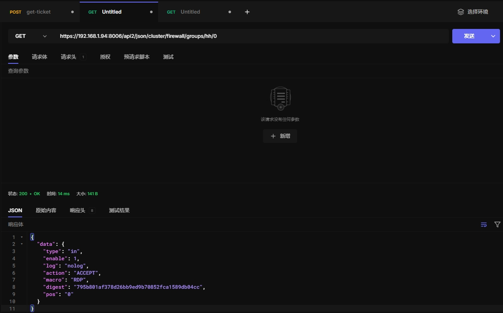

## Proxmox api调试

### 一、准备环境

服务器：1台pve服务器

api工具： Hoppscotch 

Hoppscotch下载链接：[https://hoppscotch.com/download](https://hoppscotch.com/download)

远程调试主机：win10环境

proxmox api官网教程：[https://pve.proxmox.com/pve-docs/api-viewer/index.html](https://pve.proxmox.com/pve-docs/api-viewer/index.html)

proxmox api官方说明：[https://pve.proxmox.com/wiki/Proxmox_VE_API](https://pve.proxmox.com/wiki/Proxmox_VE_API)

### 二、获取Ticket Cookie

#### 2.1 取消ssl认证

设置调整为中文，并取消ssl认证


#### 2.2 使用curl获取Ticket Cookie

```
curl -k -X POST "https://192.168.1.15:8006/api2/json/access/ticket" -d "username=root@pam&password=123456"
```

#### 2.3 使用hoppscotch获取Ticket Cookie

Ticket Cookie两小时后失效


#### 2.4 使用永久api令牌认证(不推荐)

创建api令牌，hh是用户名称，0表示特权用户

```
pveum user token add root@pam hh --privsep 0
```

使用api令牌登录


#### 2.5 转化为其他代码

显示代码


选择时候的语言环境


### 三、使用api获取信息

利用获取的cookie和token进行get和post

注意cookic的值前面要添加“PVEAuthCookie=”

#### 3.1 获取节点信息

```
https://192.168.1.15:8006/api2/json/nodes
```


#### 3.2 获取存储信息

```
https://192.168.1.15:8006/api2/json/storage
```


#### 3.3 获取虚拟机信息

```
https://192.168.1.15:8006/api2/json/nodes/t3680/qemu
```


#### 3.4 获取虚拟机配置

```
https://192.168.1.15:8006/api2/json/nodes/t3680/qemu/203/config
```


### 四、使用post提交信息

#### 4.1 克隆新的虚拟机

```
https://192.168.1.15:8006/api2/json/nodes/t3680/qemu/107/clone
```


#### 4.2 虚拟机转换为模板

```
https://192.168.1.15:8006/api2/json/nodes/t3680/qemu/805/template
```


#### 4.3 删除虚拟机

```
https://192.168.1.15:8006/api2/json/nodes/t3680/qemu/888
```

### 五、常见操作


#### 5.1 开启虚拟机

```
https://192.168.1.15:8006/api2/json/nodes/t3680/qemu/124/status/start
```


#### 5.2 关闭虚拟机

```
https://192.168.1.15:8006/api2/json/nodes/t3680/qemu/124/status/shutdown
```


#### 5.3 停止虚拟机

```
https://192.168.1.15:8006/api2/json/nodes/t3680/qemu/124/status/stop
```


#### 5.4 重启虚拟机

```
https://192.168.1.15:8006/api2/json/nodes/t3680/qemu/124/status/reboot
```


#### 5.5 重置虚拟机

```
https://192.168.1.15:8006/api2/json/nodes/t3680/qemu/124/status/reset
```


#### 5.6 暂停虚拟机

```
https://192.168.1.15:8006/api2/json/nodes/t3680/qemu/124/status/suspend
```


#### 5.7 恢复虚拟机

```
https://192.168.1.15:8006/api2/json/nodes/t3680/qemu/124/status/resume
```


#### 5.8 当前虚拟机状态

```
https://192.168.1.15:8006/api2/json/nodes/t3680/qemu/124/status/current
```


### 六、agent api

#### 6.1 exec执行命令

```
https://192.168.1.15:8006/api2/json/nodes/t3680/qemu/124/agent/exec
```


#### 6.2 file-write文件写入内容

```
https://192.168.1.15:8006/api2/json/nodes/t3680/qemu/124/agent/file-write
```


#### 6.3 file-read 读取文件内容

```
https://192.168.1.15:8006/api2/json/nodes/t3680/qemu/124/agent/file-read
```


#### 6.4 冻结文件系统状态

文件系统冻结后，虚拟机内的文件系统会变得静止，数据不会发生变化，直到文件系统解冻。

这个操作常常用于创建一致的快照或备份，确保文件系统数据一致性。

```
https://192.168.1.15:8006/api2/json/nodes/t3680/qemu/124/agent/fsfreeze-freeze
```


#### 6.5 取消冻结状态

```
https://192.168.1.15:8006/api2/json/nodes/t3680/qemu/124/agent/fsfreeze-thaw
```


#### 6.6 查看冻结状态

```
https://192.168.1.15:8006/api2/json/nodes/t3680/qemu/124/agent/fsfreeze-status
```


#### 6.8  fstrim SSD优化

效果待定

```
https://192.168.1.15:8006/api2/json/nodes/t3680/qemu/124/agent/fstrim
```


#### 6.9 获取文件系统信息

```
https://192.168.1.15:8006/api2/json/nodes/t3680/qemu/124/agent/get-osinfo
```


#### 6.10 获取主机名

```
https://192.168.1.15:8006/api2/json/nodes/t3680/qemu/123/agent/get-host-name
```


#### 6.11 获取虚拟机内存块信息

测试发现windows无效

```
https://192.168.1.15:8006/api2/json/nodes/t3680/qemu/124/agent/get-memory-block-info
```


#### 6.12 获取虚拟机内存信息

测试发现windows无效

```
https://192.168.1.15:8006/api2/json/nodes/t3680/qemu/124/agent/get-memory-blocks
```


#### 6.13 获取系统信息

```
https://192.168.1.15:8006/api2/json/nodes/t3680/qemu/124/agent/get-osinfo
```


#### 6.14 获取虚拟机时间戳

```
https://192.168.1.15:8006/api2/json/nodes/t3680/qemu/124/agent/get-time
```


#### 6.15 获取虚拟机时区

```
https://192.168.1.15:8006/api2/json/nodes/t3680/qemu/124/agent/get-timezone
```


#### 6.16 获取虚拟机用户

用户在web界面登录才能获取到信息

```
https://192.168.1.15:8006/api2/json/nodes/t3680/qemu/123/agent/get-users
```


#### 6.17 获取vcpu

```
https://192.168.1.15:8006/api2/json/nodes/t3680/qemu/124/agent/get-vcpus
```


#### 6.18 获取虚拟机信息

不知道这个干啥的。。。

```
https://192.168.1.15:8006/api2/json/nodes/t3680/qemu/124/agent/info
```


#### 6.19 获取网络信息

```
https://192.168.1.15:8006/api2/json/nodes/t3680/qemu/124/agent/network-get-interfaces
```


#### 6.20 ping

不知道怎么使用

```
https://192.168.1.15:8006/api2/json/nodes/t3680/qemu/124/agent/ping
```


#### 6.21 修改虚拟机用户密码

windows和Linux够都支持

测试只能修改本地用户，不能修改域用户

```
https://192.168.1.15:8006/api2/json/nodes/t3680/qemu/124/agent/set-user-password
```


#### 6.22 关闭虚拟机

```
https://192.168.1.16:8006/api2/json/nodes/pve3/qemu/135/agent/shutdown
```


#### 6.23 冻结磁盘

```
https://192.168.1.16:8006/api2/json/nodes/pve3/qemu/135/agent/suspend-disk
```


#### 6.24 挂起虚拟机

混合挂起模式用于将虚拟机的内存、CPU 和磁盘状态都保存到磁盘上，同时冻结磁盘 I/O 操作。

这样，当虚拟机稍后恢复时，能够从挂起的状态恢复，并且数据不会丢失，系统能够继续运行 

```
https://192.168.1.16:8006/api2/json/nodes/pve3/qemu/136/agent/suspend-hybrid
```

需要用resume恢复

```
https://192.168.1.16:8006/api2/json/nodes/pve3/qemu/135/status/resume
```


#### 6.25 挂起虚拟机

这个 API 会通过 QEMU Guest Agent 向虚拟机发送暂停内存的命令，即将虚拟机的内存状态保存在磁盘上，并冻结虚拟机的操作。

暂停的虚拟机不会进行任何计算或磁盘操作，直到恢复。

虚拟机的内存、CPU 状态会被保存，而磁盘 I/O 操作将被冻结。 

```
https://192.168.1.16:8006/api2/json/nodes/pve3/qemu/135/agent/suspend-ram
```

需要用resume恢复

```
https://192.168.1.16:8006/api2/json/nodes/pve3/qemu/135/status/resume
```


#### 6.26 创建虚拟机

使用api创建虚拟机，配置参数参考/etc/pve/qemu-server/142.conf

```shell
root@pve3:~# cat /etc/pve/qemu-server/142.conf 
agent: 1
audio0: device=ich9-intel-hda,driver=none
balloon: 0
bios: ovmf
boot: order=scsi0;ide0;ide2;net0
cores: 4
cpu: host
efidisk0: local-lvm:vm-142-disk-0,efitype=4m,pre-enrolled-keys=1,size=4M
ide0: none,media=cdrom
ide2: none,media=cdrom
machine: pc-q35-7.2
memory: 2048
meta: creation-qemu=9.0.2,ctime=1736912319
name: vm-test
net0: virtio=BC:24:11:C5:D3:D8,bridge=vmbr0,firewall=1
numa: 0
ostype: win10
scsi0: local-lvm:vm-142-disk-1,iothread=1,size=100G
scsihw: virtio-scsi-single
smbios1: uuid=e6ec9f32-f842-43f9-9c6d-18e4d3a0ff00
sockets: 1
usb0: spice,usb3=1
usb1: spice,usb3=1
usb2: spice,usb3=1
usb3: spice,usb3=1
vga: virtio
vmgenid: 7e7763d4-0e06-4eb0-9c61-2147d6eacfd8
```

api创建参数

```shell
agent: 1
balloon: 0
bios: ovmf
boot: order=scsi0;ide0;ide2;net0
cores: 4
cpu: host
ide0: none,media=cdrom
ide2: none,media=cdrom
machine: pc-q35-7.2
memory: 2048
name: vm-test-cli
numa: 0
ostype: win10
efidisk0: "local-lvm:vm-142-disk-0,efitype=4m,pre-enrolled-keys=1,size=4M"
scsi0: "local-lvm:vm-142-disk-1,iothread=1,size=100G"
scsihw: virtio-scsi-single
sockets: 1
vga: virtio
usb0: spice,usb3=1
usb1: spice,usb3=1
usb2: spice,usb3=1
usb3: spice,usb3=1
audio0: device=ich9-intel-hda,driver=none
net0: "virtio=BC:24:11:5B:88:DE,bridge=vmbr0,firewall=1"
vmid: 160
```

api 创建测试

```
https://192.168.1.16:8006/api2/json/nodes/pve3/qemu
```


#### 6.27 销毁虚拟机

```
https://192.168.1.16:8006/api2/json/nodes/pve3/qemu/158
```


### 七、cloudinit

#### 7.1 cloudinitial dump

导出cloudinit信息，支持导出 meta     network  user 这3个参数信息

```
https://192.168.1.16:8006/api2/json/nodes/pve3/qemu/137/cloudinit/dump
```


#### 7.2 重新生成cloutinit镜像

```
https://192.168.1.16:8006/api2/json/nodes/pve3/qemu/137/cloudinit
```


### 八、snapshot快照

#### 8.1 获取快照信息

```
https://192.168.1.16:8006/api2/json/nodes/pve3/qemu/1017/snapshot
```


#### 8.2 获取快照点配置

```
https://192.168.1.16:8006/api2/json/nodes/pve3/qemu/1017/snapshot/Milestone/config
```


#### 8.3 回滚快照点

```
https://192.168.1.16:8006/api2/json/nodes/pve3/qemu/1017/snapshot/Milestone/rollback
```


### 九、vmid

#### 9.1 获取虚拟机配置

```
https://192.168.1.16:8006/api2/json/nodes/pve3/qemu/135/config
```


#### 9.2 获取虚拟机迁移信息

```javascript
https://192.168.1.16:8006/api2/json/nodes/pve3/qemu/137/migrate
```


#### 9.3 monitor

不确认这个命令的用途，这里测试了stop命令

```
https://192.168.1.16:8006/api2/json/nodes/pve3/qemu/137/monitor
```


#### 9.4 迁移磁盘

Move volume to different storage or to a different VM.

```
HTTP:   	POST /api2/json/nodes/\{node\}/qemu/\{vmid\}/move_disk
```

#### 9.5 公网迁移虚拟机

Migration tunnel endpoint - only for internal use by VM migration.

```
HTTP:   	POST /api2/json/nodes/\{node\}/qemu/\{vmid\}/mtunnel
```

#### 9.6 迁移

Path: /nodes/\{node\}/qemu/\{vmid\}/mtunnelwebsocket
Migration tunnel endpoint for websocket upgrade - only for internal use by VM migration.

```
HTTP:   	GET /api2/json/nodes/\{node\}/qemu/\{vmid\}/mtunnelwebsocket
```

#### 9.7 获取虚拟机配置和任务查询

获取虚拟机配置和查询指定虚拟机在指定节点上的待处理任务或操作 

```
https://192.168.1.16:8006/api2/json/nodes/pve3/qemu/137/pending
```


#### 9.8 迁移虚拟机到其他集群

Migrate virtual machine to a remote cluster. Creates a new migration task. EXPERIMENTAL feature!

```
HTTP:   	POST /api2/json/nodes/\{node\}/qemu/\{vmid\}/remote_migrate
```

#### 9.9 扩展磁盘大小

注意，这种方法仅适用于扩展磁盘，不能缩小磁盘。 

```
https://192.168.1.16:8006/api2/json/nodes/pve3/qemu/135/resize
```


#### 9.10 获取虚拟机性能数据 

返回图片，但不知道怎么转化为图片

```
https://192.168.1.16:8006/api2/json/nodes/pve3/qemu/135/rrd
```


#### 9.11 获取虚拟机性能数据 

```
https://192.168.1.16:8006/api2/json/nodes/pve3/qemu/135/rrddata
```


#### 9.12 模拟键盘输入

这个 API 允许你模拟按键事件，通常用于远程控制虚拟机 

这里演示发送ctrl-alt-delete重启命令

```
https://192.168.1.16:8006/api2/json/nodes/pve3/qemu/135/sendkey
```


发送tab键


#### 9.13 返回spice配置

可以增加一个spice代理服务配置，实现网关的效果，不确定，没有测试过

```
https://192.168.1.16:8006/api2/json/nodes/pve3/qemu/136/spiceproxy
```


#### 9.14 转化为模板

```
https://192.168.1.16:8006/api2/json/nodes/pve3/qemu/136/template
```


#### 9.15 移除镜像挂载

```
https://192.168.1.16:8006/api2/json/nodes/pve3/qemu/136/unlink
```


在开机状态不会生效，等虚拟机关机才会生效


#### 9.16 vnc代理

Creates a TCP VNC proxy connections. 

```
HTTP:   	POST /api2/json/nodes/\{node\}/qemu/\{vmid\}/vncproxy
```

#### 9.17  vncwebsocket 

Opens a weksocket for VNC traffic.

```
HTTP:   	GET /api2/json/nodes/\{node\}/qemu/\{vmid\}/vncwebsocket
```

#### 9.18 销毁虚拟机

```
https://192.168.1.16:8006/api2/json/nodes/pve3/qemu/142
```


### 10、access访问授权

#### 10.1 查看领域认证

领域为pve

```
https://192.168.1.16:8006/api2/json/access/domains/pve
```


领域为pam

```
https://192.168.1.16:8006/api2/json/access/domains/pam
```


领域为ad


领域为ldap、openid待测试

#### 10.2 添加领域认证

这里添加ad域认证

```
https://192.168.1.16:8006/api2/json/access/domains
```


#### 10.3 删除领域信息

```
https://192.168.1.16:8006/api2/json/access/domains/ad
```


#### 10.4 同步ad用户和组

使用api同步用户和组信息

```
https://192.168.1.16:8006/api2/json/access/domains/ad/sync
```


#### 10.5 查看群组信息

```
https://192.168.1.16:8006/api2/json/access/groups
```


#### 10.6 创建组

```
https://192.168.1.16:8006/api2/json/access/groups
```


#### 10.7 获取组信息

```
https://192.168.1.16:8006/api2/json/access/groups/kk
```


#### 10.8 更新组信息

```
https://192.168.1.16:8006/api2/json/access/groups/kk
```


#### 10.9 删除组

```
https://192.168.1.16:8006/api2/json/access/groups/kk
```


#### 10.10 获取openid信息

Directory index.

```
HTTP:   	GET /api2/json/access/openid
```

#### 10.11 获取openid认证网址

Get the OpenId Authorization Url for the specified realm. 

```
HTTP:   	POST /api2/json/access/openid/auth-url
```

#### 10.12 校验openid认证

Verify OpenID authorization code and create a ticket. 

```
HTTP:   	POST /api2/json/access/openid/login
```

#### 10.13 获取角色信息

```
https://192.168.1.16:8006/api2/json/access/roles
```


#### 10.14 创建新角色

```
https://192.168.1.16:8006/api2/json/access/roles
```


#### 10.15 查看角色具体信息

```
https://192.168.1.16:8006/api2/json/access/roles/kkk
```


#### 10.16 增加角色权限

```
https://192.168.1.16:8006/api2/json/access/roles/kkk
```


#### 10.17 删除角色

```
https://192.168.1.16:8006/api2/json/access/roles/kkk
```


#### 10.18 获取二次验证信息

 List TFA configurations of users. 

```
HTTP:   	GET /api2/json/access/tfa
```

#### 10.19 查看二次验证用户信息

 List TFA configurations of users. 

```
HTTP:   	GET /api2/json/access/tfa/\{userid\}
```

#### 10.20 增加TFA

Add a TFA entry for a user.

```
HTTP:   	POST /api2/json/access/tfa/\{userid\}
```

#### 10.21 获取TFA条目

Fetch a requested TFA entry if present.

```
HTTP:   	GET /api2/json/access/tfa/\{userid\}/\{id\}
```

#### 10.22 增加TFA

 Add a TFA entry for a user. 

```
HTTP:   	PUT /api2/json/access/tfa/\{userid\}/\{id\}
```

#### 10.23 删除TFA

Delete a TFA entry by ID. 

```
HTTP:   	DELETE /api2/json/access/tfa/\{userid\}/\{id\}
```

#### 10.24 获取用户信息

```
https://192.168.1.16:8006/api2/json/access/users
```


#### 10.25 创建新用户

```
https://192.168.1.16:8006/api2/json/access/users
```


#### 10.26 获取用户信息

```
https://192.168.1.16:8006/api2/json/access/users/kk@pam
```


#### 10.27 更新用户信息

```
https://192.168.1.16:8006/api2/json/access/users/kk@pam
```


#### 10.28 删除用户

```
https://192.168.1.16:8006/api2/json/access/users/kk@pam
```


#### 10.29 获取apitoken

```
https://192.168.1.16:8006/api2/json/access/users/user01@ad/token
```


#### 10.30 获取特殊的api token信息

Get specific API token information. 

```
HTTP:   	GET /api2/json/access/users/\{userid\}/token/\{tokenid\}
```

#### 10.31 生成新api token

Generate a new API token for a specific user. NOTE: returns API token  value, which needs to be stored as it cannot be retrieved afterwards! 

```
HTTP:   	POST /api2/json/access/users/\{userid\}/token/\{tokenid\}
```

#### 10.32 更新用户api

Update API token for a specific user. 

```
HTTP:   	PUT /api2/json/access/users/\{userid\}/token/\{tokenid\}
```

#### 10.32 删除用户token

Remove API token for a specific user. 

```
HTTP:   	DELETE /api2/json/access/users/\{userid\}/token/\{tokenid\}
```

#### 10.33 获取用户TFA类型

Get user TFA types (Personal and Realm). 

```
HTTP:   	GET /api2/json/access/users/\{userid\}/tfa
```

#### 10.34 解锁用户TFA认证

Unlock a user's TFA authentication. 

```
HTTP:   	PUT /api2/json/access/users/\{userid\}/unlock-tfa
```

#### 10.35 ACl

Get Access Control List (ACLs). 

```
HTTP:   	GET /api2/json/access/acl
```

#### 10.36 变更ACL列表

Update Access Control List (add or remove permissions). 

```
HTTP:   	PUT /api2/json/access/acl
```

#### 10.37 改变用户密码

```
https://192.168.1.16:8006/api2/json/access/password
```


#### 10.38  获取给定用户或令牌的访问权限

```
https://192.168.1.16:8006/api2/json/access/permissions
```


#### 10.39 获取票据信息

Dummy. Useful for formatters which want to provide a login page. 

```
HTTP:   	GET /api2/json/access/ticket
```

#### 10.30 创建或修改票据

```
https://192.168.1.16:8006/api2/json/access/ticket
```


### 十一、Cluster  

#### 11.1 获取cluster信息

```
https://192.168.1.16:8006/api2/json/cluster
```


#### 11.2 创建cluster集群

必须使用票据才能操作

```
https://192.168.1.94:8006/api2/json/cluster/config
```


#### 11.3 获取cluster集群配置

```
https://192.168.1.94:8006/api2/json/cluster/config
```


#### 11.4 获取集群加入信息

```
https://192.168.1.94:8006/api2/json/cluster/config/join
```


#### 11.5 加入集群

必须使用票据认证才能加入

```
https://192.168.1.95:8006/api2/json/cluster/config/join
```


#### 11.6 获取pve集群节点信息

```
https://192.168.1.94:8006/api2/json/cluster/config/nodes
```


#### 11.7 添加节点配置

Adds a node to the cluster configuration. This call is for internal use.

```
HTTP:   	POST /api2/json/cluster/config/nodes/\{node\}
```

#### 11.8 移除节点配置

Removes a node from the cluster configuration. 

```
HTTP:   	DELETE /api2/json/cluster/config/nodes/\{node\}
```

#### 11.9 获取集群api版本信息

```
https://192.168.1.94:8006/api2/json/cluster/config/apiversion
```


#### 11.10 获取 QDevice 状态

Get QDevice status 

```
https://192.168.1.94:8006/api2/json/cluster/config/qdevice
```


QDevice是集群中用于确保一致性和防止脑裂（split-brain）的一种机制。它通常用于高可用性（HA）集群中，特别是在分布式系统中。QDevice可以充当一个投票设备，帮助集群判断是否有足够的节点可用，以保持系统的一致性。 

#### 11.11  获取 corosync 的 totem 协议设置 

Get corosync totem protocol settings. 

```
https://192.168.1.94:8006/api2/json/cluster/config/totem
```


Corosync 提供了集群成员之间的可靠通信，并且用于维护集群的稳定性和一致性，特别是在高可用性配置中。

Totem 是 Corosync 集群协议的一部分，用于在集群中的节点之间进行消息传递和投票。 

Totem 本质上是 Corosync 中用于实现节点间心跳检测、成员加入和离开的通信协议 

cluster/config/totem：表示查询集群配置中的Totem相关信息。 

### 十二、 ACME

#### 12.1 acme

 ACMEAccount index. 

```
https://192.168.1.94:8006/api2/json/cluster/acme
```


ACME（Automatic Certificate Management Environment）是一种协议，用于自动化SSL/TLS证书的申请、更新和撤销。Proxmox VE支持与ACME兼容的证书颁发机构（如Let’s Encrypt）集成，允许自动申请和管理SSL证书，以加密HTTP和HTTPS通信。 

#### 12.2 获取acme账户信息

获取acme账户信息

```
https://192.168.1.94:8006/api2/json/cluster/acme/account
```


#### 12.3 创建acme账户

创建acme账户

```
https://192.168.1.94:8006/api2/json/cluster/acme/account
```


#### 12.4 待定

acme暂无使用，跳过

### 十三、备份虚拟机

在数据中心中配置备份虚拟机的任务，适合批量备份

#### 13.1 backup

列出 vzdump 备份计划 

```
https://192.168.1.94:8006/api2/json/cluster/backup
```


#### 13.2 创建备份任务

全部备份

```
https://192.168.1.94:8006/api2/json/cluster/backup
```


#### 13.3 获取备份任务信息

```
https://192.168.1.94:8006/api2/json/cluster/backup/729a9744-6dcf-446e-a228-1c10cbf5998d
```


#### 13.4 更新备份任务

此处方便演示，仅修改了备份模式

```
https://192.168.1.94:8006/api2/json/cluster/backup/729a9744-6dcf-446e-a228-1c10cbf5998d
```


#### 13.5 删除备份任务

```
https://192.168.1.94:8006/api2/json/cluster/backup/729a9744-6dcf-446e-a228-1c10cbf5998d
```


#### 13.6 查看备份任务状态

返回包含的虚拟机及其磁盘的备份状态。优化用于在 ExtJS 树视图中使用。

这里提到的 "guests" 通常指的是虚拟机或容器，"ExtJS" 是一种常用于构建Web界面的JavaScript框架，"tree views" 是指以树形结构展示数据的视图形式。

```
https://192.168.1.94:8006/api2/json/cluster/backup/backup-2df239d3-c452/included_volumes
```


#### 13.7 backup-info

 Index for backup info related endpoints 

```
https://192.168.1.94:8006/api2/json/cluster/backup-info
```


#### 13.8  not-backed-up 

Shows all guests which are not covered by any backup job.

```
https://192.168.1.94:8006/api2/json/cluster/backup-info/not-backed-up
```


### 十四、ceph

推荐在web界面配置，存储这块手动配置即可

### 十五、集群防火墙

#### 15.1 获取防火墙信息

```
https://192.168.1.94:8006/api2/json/cluster/firewall
```


#### 15.2 查看别名

别名：可以是 IP 地址、端口、IP 范围等的集合。

防火墙规则：可以使用这些别名来设置更简洁的防火墙规则。

```
https://192.168.1.94:8006/api2/json/cluster/firewall/aliases
```


#### 15.3 创建别名

```
https://192.168.1.94:8006/api2/json/cluster/firewall/aliases
```


#### 15.4 获取别名内容

```
https://192.168.1.94:8006/api2/json/cluster/firewall/aliases/kk
```


#### 15.5 更新别名内容

```
https://192.168.1.94:8006/api2/json/cluster/firewall/aliases/kk
```


#### 15.6 删除别名

```
https://192.168.1.94:8006/api2/json/cluster/firewall/aliases/kk
```


#### 15.7 获取安全组

```
https://192.168.1.94:8006/api2/json/cluster/firewall/groups
```


#### 15.8 创建安全组

```
https://192.168.1.94:8006/api2/json/cluster/firewall/groups
```


#### 15.9 查看安全组

```
https://192.168.1.94:8006/api2/json/cluster/firewall/groups/hh
```


#### 15.10 创建规则

```
https://192.168.1.94:8006/api2/json/cluster/firewall/groups/hh
```


#### 15.11 删除安全租

```
https://192.168.1.94:8006/api2/json/cluster/firewall/groups/hh
```


#### 15.12 查看防火墙

```
https://192.168.1.94:8006/api2/json/cluster/firewall/options
```


#### 15.13 设置防火墙

这里可以配置开启集群防火墙

```
https://192.168.1.94:8006/api2/json/cluster/firewall/options
```


#### 15.14 查看规则内容

0表示安全组内规则的索引

```
https://192.168.1.94:8006/api2/json/cluster/firewall/groups/hh/0
```



#### 15.15 修改规则内容

```
https://192.168.1.94:8006/api2/json/cluster/firewall/groups/hh/0
```


#### 15.16 删除规则

```
https://192.168.1.94:8006/api2/json/cluster/firewall/groups/hh/0
```


#### 15.17 查看防火墙规则

注意：这样查看只能看直接添加的规则，不能查看安全组里创建的规则

```
https://192.168.1.94:8006/api2/json/cluster/firewall/rules
```


#### 15.18 创建防火墙规则

```
https://192.168.1.94:8006/api2/json/cluster/firewall/rules
```


#### 15.19 查看单条防火墙规则

```
https://192.168.1.94:8006/api2/json/cluster/firewall/rules/0
```


#### 15.20 更新单条防火墙规则

```
https://192.168.1.94:8006/api2/json/cluster/firewall/rules/0
```


#### 15.21 删除单调防火墙规则

```
https://192.168.1.94:8006/api2/json/cluster/firewall/rules/1
```


#### 15.22 查看ipset

在 Proxmox VE 中，IP 集合（IP set）是防火墙规则中的一种功能，用于管理多个 IP 地址、IP 范围、网络或子网的集合。

使用 IP 集合，你可以将多个 IP 地址或者网络范围（如 CIDR）组合成一个逻辑集合，并在防火墙规则中引用这个集合，而不是单独列出每个 IP 地址或网络。这样可以简化防火墙规则的配置，减少重复性，并提高规则的可读性。 

```
https://192.168.1.94:8006/api2/json/cluster/firewall/ipset
```


#### 15.23 创建ipset

```
https://192.168.1.94:8006/api2/json/cluster/firewall/ipset
```


#### 15.24 查看ipset内容

```
https://192.168.1.94:8006/api2/json/cluster/firewall/ipset/ips
```


#### 15.25 ipset添加别名

别名可以某个子网或单个ip

```
https://192.168.1.94:8006/api2/json/cluster/firewall/ipset/ips
```


#### 15.26 删除ipset

当ipset里没有内容才能删除

```
https://192.168.1.94:8006/api2/json/cluster/firewall/ipset/ips
```


#### 15.27 查看ipset某条cidr

```
https://192.168.1.94:8006/api2/json/cluster/firewall/ipset/ips/dc/k1
```


#### 15.28 更新ipset某条cidr

nomatch 参数具体不明白什么意思

```
https://192.168.1.94:8006/api2/json/cluster/firewall/ipset/ips/dc/k1
```


#### 15.29 删除ipset某条cidr

```
https://192.168.1.94:8006/api2/json/cluster/firewall/ipset/ips/dc/k1
```


#### 15.30 查看内置防火墙宏规则

```
https://192.168.1.94:8006/api2/json/cluster/firewall/macros
```


#### 15.31 查看创建的别名和ipset

```
https://192.168.1.94:8006/api2/json/cluster/firewall/refs
```


### 十六、集群HA高可用

#### 16.1 查看HA

```
https://192.168.1.94:8006/api2/json/cluster/ha
```


#### 16.2 查看群组

```
https://192.168.1.94:8006/api2/json/cluster/ha/groups
```


#### 16.3 创建群组

```
https://192.168.1.94:8006/api2/json/cluster/ha/groups
```


#### 16.4 查看群组配置

```
https://192.168.1.94:8006/api2/json/cluster/ha/groups/kg
```


#### 16.5 更新群组配置

```
https://192.168.1.94:8006/api2/json/cluster/ha/groups/kg
```


#### 16.6 删除群组配置

```
https://192.168.1.94:8006/api2/json/cluster/ha/groups/kg
```


#### 16.7 查看HA资源

```
https://192.168.1.94:8006/api2/json/cluster/ha/resources
```


#### 16.8 创建HA资源

```
https://192.168.1.94:8006/api2/json/cluster/ha/resources
```


#### 16.9 读取HA资源

```
https://192.168.1.94:8006/api2/json/cluster/ha/resources/vm:100
```


#### 16.10 更新HA资源

```
https://192.168.1.94:8006/api2/json/cluster/ha/resources/vm:100
```


#### 16.11 删除HA资源

```
https://192.168.1.94:8006/api2/json/cluster/ha/resources/vm:100
```


#### 16.12 在线迁移虚拟机

从pve1迁移到pve2

```
https://192.168.1.94:8006/api2/json/cluster/ha/resources/vm:100/migrate
```


#### 16.13 关机迁移虚拟机

```
https://192.168.1.94:8006/api2/json/cluster/ha/resources/vm:100/relocate
```


#### 16.14 查看HA状态

```
https://192.168.1.94:8006/api2/json/cluster/ha/status
```


#### 16.15 查看HA当前状态

```
https://192.168.1.94:8006/api2/json/cluster/ha/status/current
```


#### 16.16 查看HA完整状态

```
https://192.168.1.94:8006/api2/json/cluster/ha/status/manager_status
```


### 十七、集群任务

#### 17.1 任务信息

```
https://192.168.1.94:8006/api2/json/cluster/jobs
```


#### 17.2 认证任务信息

```
https://192.168.1.94:8006/api2/json/cluster/jobs/realm-sync
```


#### 17.3 获取ream同步任务

 Read realm-sync job definition. 

```
HTTP:   	GET /api2/json/cluster/jobs/realm-sync/\{id\}
```

#### 17.4 创建ream同步任务

Create new realm-sync job. 

```
HTTP:   	POST /api2/json/cluster/jobs/realm-sync/\{id\}
```

#### 17.5更新ream同步任务

Update realm-sync job definition. 

```
HTTP:   	PUT /api2/json/cluster/jobs/realm-sync/\{id\}
```

#### 17.6 删除ream同步任务

Delete realm-sync job definition. 

```
HTTP:   	DELETE /api2/json/cluster/jobs/realm-sync/\{id\}
```

#### 17.7 查看计划任务

Returns a list of future schedule runtimes. 

```
HTTP:   	GET /api2/json/cluster/jobs/schedule-analyze
```

### 十八、集群资源映射

节点启用iommu才能做资源映射

此功能适合做显卡资源映射usb资源映射

#### 18.1 查看资源类型

```
https://192.168.1.94:8006/api2/json/cluster/mapping
```


#### 18.2 查看pci资源

List PCI Hardware Mapping 

```
HTTP:   	GET /api2/json/cluster/mapping/pci
```

#### 18.3 创建pci资源

Create a new hardware mapping. 

```
HTTP:   	POST /api2/json/cluster/mapping/pci
```

#### 18.4 获取pci映射

Get PCI Mapping.

```
HTTP:   	GET /api2/json/cluster/mapping/pci/\{id\}
```

#### 18.5 更新pci映射

Update a hardware mapping. 

```
HTTP:   	PUT /api2/json/cluster/mapping/pci/\{id\}
```

#### 18.6 删除pci映射

Remove Hardware Mapping. 

```
HTTP:   	DELETE /api2/json/cluster/mapping/pci/\{id\}
```

#### 18.7 查看usb资源

List USB Hardware Mappings 

```
HTTP:   	GET /api2/json/cluster/mapping/usb
```

#### 18.8 usb资源

Create a new hardware mapping.

```
HTTP:   	POST /api2/json/cluster/mapping/usb
```

#### 18.9 获取usb映射

Get USB Mapping.

```
HTTP:   	GET /api2/json/cluster/mapping/usb/\{id\}
```

#### 18.10 更新usb映射

Update a hardware mapping. 

```
HTTP:   	PUT /api2/json/cluster/mapping/usb/\{id\}
```

#### 18.11 删除usb映射

Remove Hardware Mapping. 

```
HTTP:   	DELETE /api2/json/cluster/mapping/usb/\{id\}
```

### 十九、集群指标服务器

这个api用来查询集群的性能指标信息，可以用来做图表展示

#### 19.1 指标索引

```
https://192.168.1.94:8006/api2/json/cluster/metrics
```


#### 19.2 查看指标索引服务器

```
https://192.168.1.94:8006/api2/json/cluster/metrics/server
```


#### 19.3 读取指标索引服务器

Read metric server configuration.

```
HTTP:   	GET /api2/json/cluster/metrics/server/\{id\}
```

#### 19.4 创建指标索引服务器

Create a new external metric server config

```
HTTP:   	POST /api2/json/cluster/metrics/server/\{id\}
```

#### 19.5 更新指标索引服务器

Update metric server configuration. 

```
HTTP:   	PUT /api2/json/cluster/metrics/server/\{id\}
```

#### 19.6 删除指标索引服务器

Remove Metric server. 

```
HTTP:   	DELETE /api2/json/cluster/metrics/server/\{id\}
```

#### 19.7 实时导出数据

Retrieve metrics of the cluster.

```
HTTP:   	GET /api2/json/cluster/metrics/export
```

### 二十、消息通知

待定，应该用不到这个功能

### 二十一、集群复制

不懂这个功能怎么使用

#### 21.1 查看复制任务

```
https://192.168.1.94:8006/api2/json/cluster/replication
```


#### 21.2 创建新复制任务

Create a new replication job 

```
HTTP:   	POST /api2/json/cluster/replication
```

#### 21.3 读取复制任务配置

Read replication job configuration. 

```
HTTP:   	GET /api2/json/cluster/replication/\{id\}
```

#### 21.4 更新复制任务配置

Update replication job configuration. 

```
HTTP:   	PUT /api2/json/cluster/replication/\{id\}
```

#### 21.5 删除复制任务配置

Mark replication job for removal.

```
HTTP:   	DELETE /api2/json/cluster/replication/\{id\}
```

### 二十二、sdn软件自定义网络

如果要使用dhcp，需要在每个节点安装dnsmasq

```bash
apt update
apt install dnsmasq
# disable default instance
systemctl disable --now dnsmasq
```

如果要使用sdn路由集成，需要在每个节点安装frr-pythontools

```bash
apt update
apt install frr-pythontools
```

#### 22.1 sdn索引

```
https://192.168.1.94:8006/api2/json/cluster/sdn
```


#### 22.2 重载sdn

修改完sdn后，需要重载sdn让其生效

```
https://192.168.1.94:8006/api2/json/cluster/sdn
```


#### 22.3 查看区域

```
https://192.168.1.94:8006/api2/json/cluster/sdn/zones
```


#### 22.4 创建区域

```
https://192.168.1.94:8006/api2/json/cluster/sdn/zones
```


#### 22.5 读取区域配置

```
https://192.168.1.94:8006/api2/json/cluster/sdn/zones/simple
```


#### 22.6 更新区域配置

改成pve1节点

```
https://192.168.1.94:8006/api2/json/cluster/sdn/zones/simple
```


取消dhcp

```
https://192.168.1.94:8006/api2/json/cluster/sdn/zones/simple
```


#### 22.7 删除区域

```
https://192.168.1.94:8006/api2/json/cluster/sdn/zones/simple
```


#### 22.8 查看Vnets

```
https://192.168.1.94:8006/api2/json/cluster/sdn/vnets
```


#### 22.9 新建Vnets

```
https://192.168.1.94:8006/api2/json/cluster/sdn/vnets
```


#### 22.10 读取Vnet配置

```
https://192.168.1.94:8006/api2/json/cluster/sdn/vnets/svnets
```


#### 22.11 更新Vnet配置

```
https://192.168.1.94:8006/api2/json/cluster/sdn/vnets/svnets
```


#### 22.12 删除Vnets配置

```
https://192.168.1.94:8006/api2/json/cluster/sdn/vnets/svnets
```


#### 22.13 查看子网

```
https://192.168.1.94:8006/api2/json/cluster/sdn/vnets/svnet/subnets
```


#### 22.14 创建子网

```
https://192.168.1.94:8006/api2/json/cluster/sdn/vnets/svnet/subnets
```


#### 22.15 查看子网配置

这里的ksimple-10.0.0.0-24名称，可以使用查看子网api获取

```
https://192.168.1.94:8006/api2/json/cluster/sdn/vnets/svnet/subnets/ksimple-10.0.0.0-24
```


#### 22.16 更新子网配置

```
https://192.168.1.94:8006/api2/json/cluster/sdn/vnets/svnet/subnets/ksimple-10.0.0.0-24
```


#### 22.17 删除子网配置

```
https://192.168.1.94:8006/api2/json/cluster/sdn/vnets/svnet/subnets/ksimple-10.0.0.0-24
```


#### 22.18 ips-create

Create IP Mapping in a VNet 

```
HTTP:   	POST /api2/json/cluster/sdn/vnets/\{vnet\}/ips
```

#### 22.19 ips-update

Update IP Mapping in a VNet 

```
HTTP:   	PUT /api2/json/cluster/sdn/vnets/\{vnet\}/ips
```

#### 22.20 ips-delete

 Delete IP Mappings in a VNet 

```
HTTP:   	DELETE /api2/json/cluster/sdn/vnets/\{vnet\}/ips
```

....集群sdn功能待测，不是很了解，暂时用不上

### 二十三、集群状态

#### 23.1获取集群日志

```
https://192.168.1.94:8006/api2/json/cluster/log
```


#### 23.2 获取可用ip

当你在 PVE 创建 VM 或 CT 时，每个实例都需要一个唯一的 **VM ID**（整数，例如 `100`, `101`, `102`）。

这个 API 可以自动返回 **下一个可用的 ID**，避免手动查找或重复分配。 

```
https://192.168.1.94:8006/api2/json/cluster/nextid
```


#### 23.3 获取集群选项配置

```
https://192.168.1.94:8006/api2/json/cluster/options
```


#### 23.4  更新集群选项配置

```
https://192.168.1.94:8006/api2/json/cluster/options
```


#### 23.5 获取集群资源

```
https://192.168.1.94:8006/api2/json/cluster/resources
```


#### 23.6 获取集群状态

```
https://192.168.1.94:8006/api2/json/cluster/status
```


#### 23.7 获取集群任务

```
https://192.168.1.94:8006/api2/json/cluster/tasks
```


### 二十四、资源池

#### 24.1 查看资源池

```
https://192.168.1.94:8006/api2/json/pools
```


#### 24.2 创建资源池

```
https://192.168.1.94:8006/api2/json/pools
```


#### 24.3 更新资源池

```
https://192.168.1.94:8006/api2/json/pools/kpool
```


#### 24.4 删除资源池

```
https://192.168.1.94:8006/api2/json/pools/kpool
```


#### 24.5 获取资源池内容

```
https://192.168.1.94:8006/api2/json/pools/kpool
```


#### 24.6 更新资源池内容

```
https://192.168.1.94:8006/api2/json/pools/kpool
```


### 二十五、存储

#### 25.1 存储索引

```
https://192.168.1.94:8006/api2/json/storage
```


#### 25.2 添加存储

此处以添加smb/cifs为例

```
https://192.168.1.94:8006/api2/json/storage
```


#### 25.3 读取存储配置

```
https://192.168.1.94:8006/api2/json/storage/kk
```


#### 25.4 更新存储配置

```
https://192.168.1.94:8006/api2/json/storage/kk
```


#### 25.5 删除存储

```
https://192.168.1.94:8006/api2/json/storage/kk
```


### 二十六、api

#### 26.1 api详情

```
https://192.168.1.94:8006/api2/json/version
```


### 二十七、虚拟机配置静态ip和dns

网卡名称改完英文

- 配置静态ip

```
https://192.168.1.94:8006/api2/json/nodes/pve1/qemu/101/agent/exec
```


- 配置静态dns

```
https://192.168.1.94:8006/api2/json/nodes/pve1/qemu/101/agent/exec
```


### 二十八、