## Vue互动教程

[vue中文官网](https://cn.vuejs.org/)

本教程的目标是让你在浏览器中快速体验使用 Vue 是什么感受，因此它不会太过深入解释所有细节，如果有些东西你一时无法完全理解，也不必担心。但是，在完成本教程之后，请务必阅读[深入指南](https://cn.vuejs.org/guide/introduction.html)，以确保你对涉及的话题有更深入、完整的理解。 

### step-1：helloworld

本教程假定你基本熟悉 HTML、CSS 和 JavaScript。 

Vue 提供了两种 API 风格：选项式 API 和组合式 API（推荐学习）。

App.vue

```vue
<template>
  <h1>Hello World!</h1>
</template>
```

预览

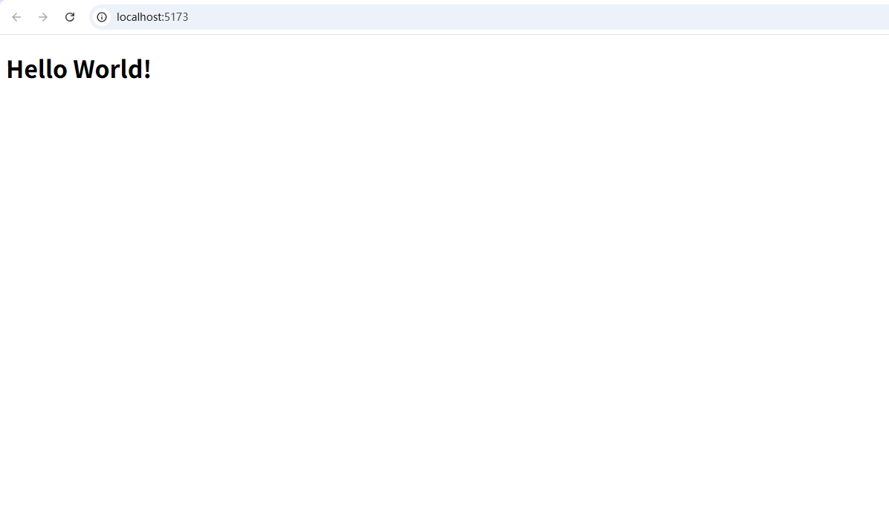

### step-2：声明式渲染

一个 Vue 单文件组件 (Single-File Component，缩写为 SFC)。单文件组件是一种可复用的代码组织形式，它将从属于同一个组件的 HTML、CSS 和 JavaScript 封装在使用 `.vue` 后缀的文件中。

Vue 的核心功能是**声明式渲染**：通过扩展于标准 HTML 的模板语法，我们可以根据 JavaScript 的状态来描述 HTML 应该是什么样子的。当状态改变时，HTML 会自动更新。

能在改变时触发更新的状态被称作是**响应式**的。我们可以使用 Vue 的 `reactive()` API 来声明响应式状态。由 `reactive()` 创建的对象都是 JavaScript [Proxy](https://developer.mozilla.org/en-US/docs/Web/JavaScript/Reference/Global_Objects/Proxy)，其行为与普通对象一样： 

`reactive()` 只适用于对象 (包括数组和内置类型，如 `Map` 和 `Set`)。而另一个 API `ref()` 则可以接受任何值类型。`ref` 会返回一个包裹对象，并在 `.value` 属性下暴露内部值。 

在组件的 ` script setup ` 块中声明的响应式状态，可以直接在模板中使用。使用双花括号语法，根据 `counter` 对象和 `message` ref 的值渲染动态文本

 模板中访问的 `message` ref 时不需要使用 `.value`：它会被自动解包，让使用更简单。 

App.vue

```vue
<script setup>
import { reactive, ref } from 'vue'

const counter = reactive({ count: 0 })
const message = ref('Hello World!')
</script>

<template>
  <h1>{{ message }}</h1>
  <p>Count is: {{ counter.count }}</p>
</template>
```

预览

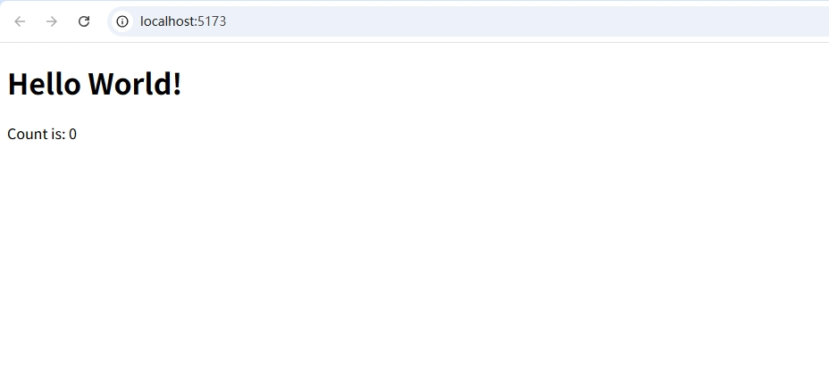

### step-3：Attribute 绑定

在 Vue 中，mustache 语法 (即双大括号) 只能用于文本插值。

为了给 attribute 绑定一个动态值，需要使用 `v-bind` 指令： 

```vue
<div v-bind:id="dynamicId"></div>
```

**指令**是由 `v-` 开头的一种特殊 attribute。它们是 Vue 模板语法的一部分。和文本插值类似，指令的值是可以访问组件状态的 JavaScript 表达式。 

冒号后面的部分 (`:id`) 是指令的“参数”。此处，元素的 `id` attribute 将与组件状态里的 `dynamicId` 属性保持同步。 

由于 `v-bind` 使用地非常频繁，它有一个专门的简写语法： 

```vue
<div :id="dynamicId"></div>
```

 App.vue

```vue
<script setup>
import { ref } from 'vue'

const titleClass = ref('title')
</script>

<template>
  <h1 :class="titleClass">Make me red</h1>
</template>

<style>
.title {
  color: red;
}
</style>
```

预览

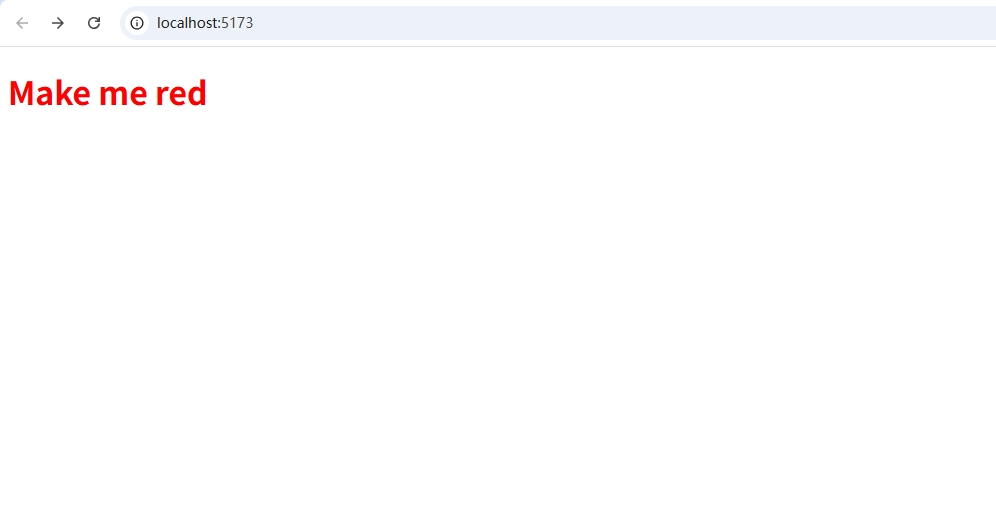

### step-4：事件监听

我们可以使用 `v-on` 指令监听 DOM 事件： 

```vue
<button v-on:click="increment">{{ count }}</button>
```

因为其经常使用，`v-on` 也有一个简写语法： 

```vue
<button @click="increment">{{ count }}</button>
```

此处，`increment` 引用了一个在 ` script setup ` 中声明的函数： 

```vue
<script setup>
import { ref } from 'vue'

const count = ref(0)

function increment() {
  // 更新组件状态
  count.value++
}
</script>
```

App.vue

```vue
<script setup>
import { ref } from 'vue'

const count = ref(0)

function increment() {
  count.value++
}
</script>

<template>
  <button @click="increment">Count is: {{ count }}</button>
</template>
```

预览

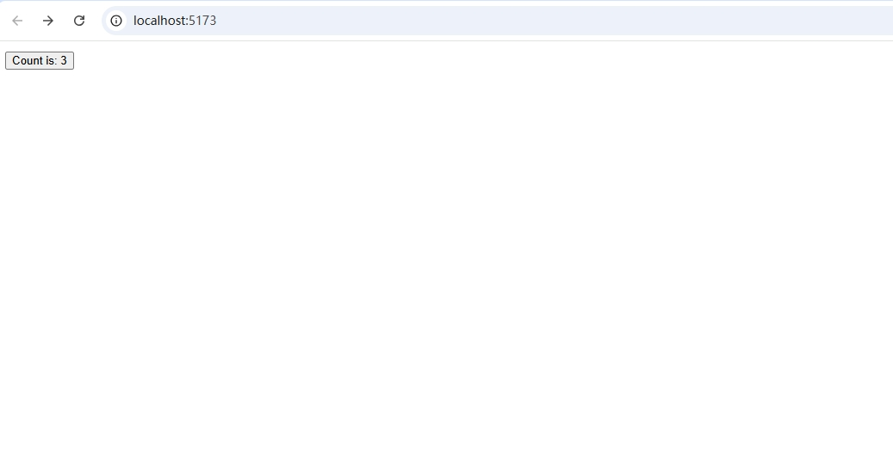

### step-5：表单绑定

我们可以同时使用 `v-bind` 和 `v-on` 来在表单的输入元素上创建双向绑定： 

```vue
<input :value="text" @input="onInput">
```

```js
function onInput(e) {
  // v-on 处理函数会接收原生 DOM 事件
  // 作为其参数。
  text.value = e.target.value
}
```

试着在文本框里输入——你会看到 `<p>` 里的文本也随着你的输入更新了。

为了简化双向绑定，Vue 提供了一个 `v-model` 指令，它实际上是上述操作的语法糖：

```vue
<input v-model="text">
```

`v-model` 会将被绑定的值与 `input` 的值自动同步，这样我们就不必再使用事件处理函数了。

`v-model` 不仅支持文本输入框，也支持诸如多选框、单选框、下拉框之类的输入类型

App.vue

```vue
<script setup>
import { ref } from 'vue'

const text = ref('')
</script>

<template>
  <input v-model="text" placeholder="Type here">
  <p>{{ text }}</p>
</template>
```

预览

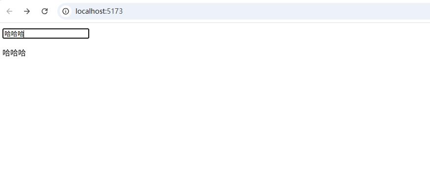

### step-6：条件渲染

我们可以使用 `v-if` 指令来有条件地渲染元素： 

```vue
<h1 v-if="awesome">Vue is awesome!</h1>
```

这个 `h1` 标签只会在 `awesome` 的值为[真值 (Truthy)](https://developer.mozilla.org/zh-CN/docs/Glossary/Truthy) 时渲染。若 `awesome` 更改为[假值 (Falsy)](https://developer.mozilla.org/zh-CN/docs/Glossary/Falsy)，它将被从 DOM 中移除。 

我们也可以使用 `v-else` 和 `v-else-if` 来表示其他的条件分支： 

```vue
<h1 v-if="awesome">Vue is awesome!</h1>
<h1 v-else>Oh no 😢</h1>
```

App.vue

```vue
<script setup>
import { ref } from 'vue'

const awesome = ref(true)

function toggle() {
  awesome.value = !awesome.value
}
</script>

<template>
  <button @click="toggle">Toggle</button>
  <h1 v-if="awesome">Vue is awesome!</h1>
  <h1 v-else>Oh no 😢</h1>
</template>
```

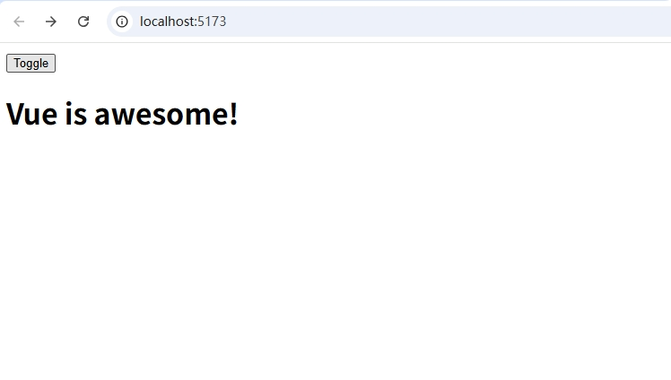

### step-7：列表渲染

 我们可以使用 `v-for` 指令来渲染一个基于源数组的列表： 

```vue
<ul>
  <li v-for="todo in todos" :key="todo.id">
    {{ todo.text }}
  </li>
</ul>
```

这里的 `todo` 是一个局部变量，表示当前正在迭代的数组元素。它只能在 `v-for` 所绑定的元素上或是其内部访问，就像函数的作用域一样。

注意，我们还给每个 todo 对象设置了唯一的 `id`，并且将它作为[特殊的 `key` attribute](https://cn.vuejs.org/api/built-in-special-attributes.html#key) 绑定到每个 `<li>`。`key` 使得 Vue 能够精确地移动每个 `<li>`，以匹配对应的对象在数组中的位置。

更新列表有两种方式：

1. 在源数组上调用[变更方法](https://stackoverflow.com/questions/9009879/which-javascript-array-functions-are-mutating)：

```js
todos.value.push(newTodo)
```

2. 使用新的数组替代原数组： 

```js
todos.value = todos.value.filter(/* ... */)
```

App.vue

```vue
<script setup>
import { ref } from 'vue'

// 给每个 todo 对象一个唯一的 id
let id = 0

const newTodo = ref('')
const todos = ref([
  { id: id++, text: 'Learn HTML' },
  { id: id++, text: 'Learn JavaScript' },
  { id: id++, text: 'Learn Vue' }
])

function addTodo() {
  todos.value.push({ id: id++, text: newTodo.value })
  newTodo.value = ''
}

function removeTodo(todo) {
  todos.value = todos.value.filter((t) => t !== todo)
}
</script>

<template>
  <form @submit.prevent="addTodo">
    <input v-model="newTodo" required placeholder="new todo">
    <button>Add Todo</button>
  </form>
  <ul>
    <li v-for="todo in todos" :key="todo.id">
      {{ todo.text }}
      <button @click="removeTodo(todo)">X</button>
    </li>
  </ul>
</template>
```

预览

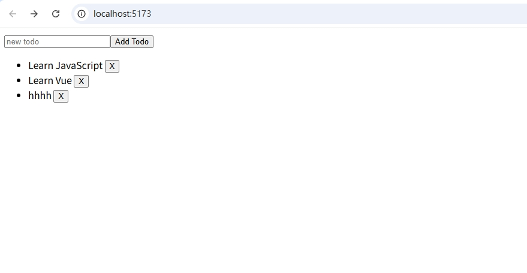

### step-8：计算属性

在 Vue3 中，计算属性（computed） 是一种根据其他响应式数据计算出来的属性。计算属性会自动缓存计算结果，只有当依赖的数据发生变化时才重新计算。

简单来说，计算属性可以看作一个“自动更新的变量”，它的值取决于其他数据。

 使用 Vue 提供的 `computed` 函数定义计算属性： 

```vue
import { computed, ref } from 'vue'

const firstName = ref('John')
const lastName = ref('Doe')

// 计算属性 fullName 将自动组合 firstName 和 lastName
const fullName = computed(() => {
  return firstName.value + ' ' + lastName.value
})
```

App.vue

```vue
<script setup>
import { ref, computed } from 'vue'

// 待办事项列表
const todos = ref([
  { id: 1, text: '学习HTML' },
  { id: 2, text: '学习JavaScript' },
  { id: 3, text: '学习Vue' }
])

// 计算属性：自动计算待办事项的数量
const todoCount = computed(() => {
  return todos.value.length
})
</script>

<template>
  <p>一共有 {{ todoCount }} 个待办事项</p>
</template>
```

预览

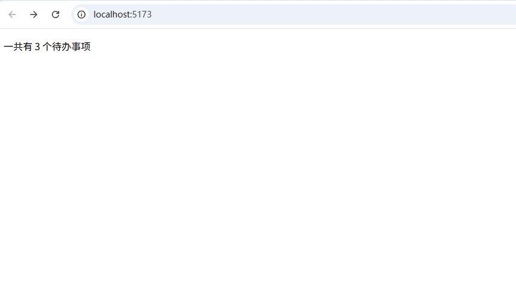


>📌 为什么要用计算属性？
>
>缓存机制：计算属性的结果会缓存，只有依赖的数据发生变化时才重新计算，性能更高效。
>
>逻辑清晰：将复杂的逻辑计算封装在一个计算属性内，使模板更加简洁和易于维护。

### step-9：生命周期和模板引用


生命周期是指一个组件从创建、挂载到页面、更新数据、直到卸载销毁的整个过程。Vue 提供了一些钩子函数，让我们可以在组件生命周期的特定阶段执行代码。 

```vue
<script setup>
import { ref, onMounted, onUpdated, onUnmounted } from 'vue'

const count = ref(0)

onMounted(() => {
  console.log('组件已挂载到页面！')
})

onUpdated(() => {
  console.log('组件数据更新了！')
})

onUnmounted(() => {
  console.log('组件即将销毁！')
})

function increment() {
  count.value++
}
</script>

<template>
  <button @click="increment">点击次数：{{ count }}</button>
</template>
```

模板引用是一种特殊的属性 (`ref`)，允许我们在 JavaScript 中访问模板中的 DOM 元素或子组件。 

```vue
<script setup>
import { ref, onMounted } from 'vue'

// 定义一个模板引用
const inputRef = ref(null)

onMounted(() => {
  // 组件挂载完成后，让输入框自动获得焦点
  inputRef.value.focus()
})
</script>

<template>
  <input ref="inputRef" placeholder="组件挂载后自动聚焦" />
</template>
```

App.vue

```vue
<script setup>
import { ref, onMounted } from 'vue'

const pElementRef = ref(null)

onMounted(() => {
  pElementRef.value.textContent = 'mounted!'
})
</script>

<template>
  <p ref="pElementRef">Hello</p>
</template>
```

预览

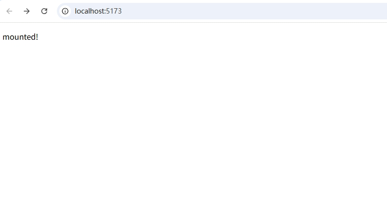

### step-10：侦听器

在 Vue 3 中，**侦听器（watch）** 可以让你**监听响应式数据的变化**，当数据变化时执行特定的操作或函数。

简单说，侦听器就是当某个数据发生变化时，Vue 会自动通知你，这样你可以根据数据变化做一些额外的事情（比如请求数据、改变其他数据等）。

- 基本语法

```js
import { ref, watch } from 'vue'

const data = ref('')

// 监听 data 的变化
watch(data, (newValue, oldValue) => {
  console.log('data 变化了！新值：', newValue, '旧值：', oldValue)
})
```

>watch 接受两个参数：
>第一个参数是要监听的数据。
>第二个参数是一个函数，当数据变化时自动执行。

- 简单示例：监听输入框的变化

App.vue

```vue
<script setup>
import { ref, watch } from 'vue'

const message = ref('')

// 监听 message 变化
watch(message, (newVal, oldVal) => {
  console.log(`输入框内容变化了，从 ${oldVal} 变成了 ${newVal}`)
})
</script>

<template>
  <input v-model="message" placeholder="输入一些内容">
  <p>你输入的是：{{ message }}</p>
</template>
```

预览

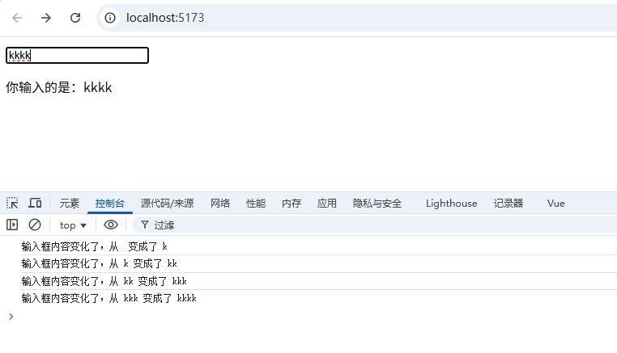

当用户在输入框输入内容，`message` 数据发生变化。

`watch` 侦听器自动执行函数，输出新旧数据的变化。

- 进阶示例：监听对象或数组（需要开启深度监听）

App.vue

```vue
<script setup>
import { reactive, watch } from 'vue'

const user = reactive({ name: '小明', age: 18 })

// 深度监听对象
watch(user, (newVal, oldVal) => {
  console.log('user 对象变化了：', newVal)
}, { deep: true })
</script>

<template>
  <input v-model="user.name" placeholder="输入姓名">
  <input v-model="user.age" type="number" placeholder="输入年龄">
  <p>{{ user.name }} - {{ user.age }}岁</p>
</template>
```

预览

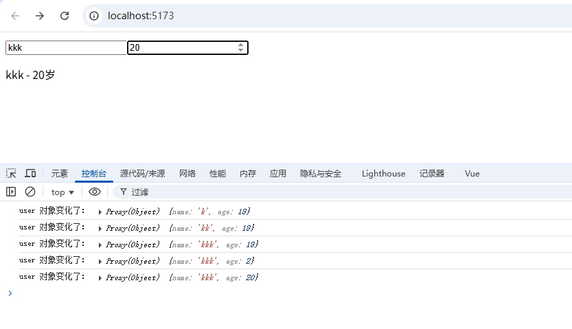

使用 `{ deep: true }` 深度监听，表示监听对象内部属性的变化。

- watch 和 computed 的区别：

|          | watch（侦听器）                        | computed（计算属性）                   |
| -------- | -------------------------------------- | -------------------------------------- |
| 作用     | 数据变化时执行额外操作                 | 根据依赖数据计算新数据                 |
| 是否缓存 | ❌ 不缓存，每次变化都执行               | ✅ 缓存，数据不变不重新执行             |
| 使用场景 | 执行副作用（如请求数据、修改其他状态） | 计算派生状态（如拼接字符串、数值计算） |

### step-11：组件

目前为止，我们只使用了单个组件。真正的 Vue 应用往往是由嵌套组件创建的。

父组件可以在模板中渲染另一个组件作为子组件。要使用子组件，我们需要先导入它：

```js
import ChildComp from './ChildComp.vue'
```

然后我们就可以在模板中使用组件，就像这样： 

```vue
<ChildComp />
```

App.vue

```vue
<script setup>
import ChildComp from './ChildComp.vue'
</script>

<template>
  <ChildComp />
</template>
```

ChildComp.vue

```vue
<template>
  <h2>A Child Component!</h2>
</template>
```

预览

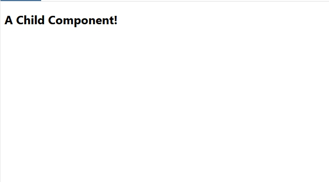

### step-12：Props

子组件可以通过 **props** 从父组件接受动态数据。首先，需要声明它所接受的 props： 

```vue
<!-- ChildComp.vue -->
<script setup>
const props = defineProps({
  msg: String
})
</script>
```

注意 `defineProps()` 是一个编译时宏，并不需要导入。一旦声明，`msg` prop 就可以在子组件的模板中使用。它也可以通过 `defineProps()` 所返回的对象在 JavaScript 中访问。

父组件可以像声明 HTML attributes 一样传递 props。若要传递动态值，也可以使用 `v-bind` 语法：

```vue
<ChildComp :msg="greeting" />
```

App.vue

```vue
<script setup>
import { ref } from 'vue'
import ChildComp from './ChildComp.vue'

const greeting = ref('Hello from parent')
</script>

<template>
  <ChildComp :msg="greeting" />
</template>
```

ChildComp.vue

```vue
<script setup>
const props = defineProps({
  msg: String
})
</script>

<template>
  <h2>{{ msg || 'No props passed yet' }}</h2>
</template>
```

预览

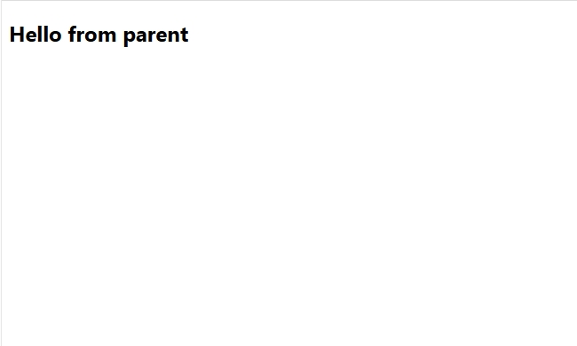

### step-13：Emits

 除了接收 props，子组件还可以向父组件触发事件： 

```vue
<script setup>
// 声明触发的事件
const emit = defineEmits(['response'])

// 带参数触发
emit('response', 'hello from child')
</script>
```

`emit()` 的第一个参数是事件的名称。其他所有参数都将传递给事件监听器。

父组件可以使用 `v-on` 监听子组件触发的事件——这里的处理函数接收了子组件触发事件时的额外参数并将它赋值给了本地状态：

```vue
<ChildComp @response="(msg) => childMsg = msg" />
```

ChildComp.vue

```vue
<script setup>
const emit = defineEmits(['response'])

emit('response', 'hello from child')
</script>

<template>
  <h2>Child component</h2>
</template>
```

App.vue

```vue
<script setup>
import { ref } from 'vue'
import ChildComp from './ChildComp.vue'

const childMsg = ref('No child msg yet')
</script>

<template>
  <ChildComp @response="(msg) => childMsg = msg" />
  <p>{{ childMsg }}</p>
</template>
```

> 注意： (msg) => childMsg = msg 
> 这会将子组件发送过来的消息`'hello from child'`赋值给父组件中的响应式变量`childMsg`。 

预览

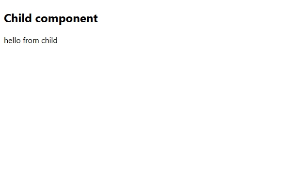

### step-14：插槽

除了通过 props 传递数据外，父组件还可以通过**插槽** (slots) 将模板片段传递给子组件： 

```vue
<ChildComp>
  This is some slot content!
</ChildComp>
```

 在子组件中，可以使用 `<slot>` 元素作为插槽出口 (slot outlet) 渲染父组件中的插槽内容 (slot content)： 

```vue
<!-- 在子组件的模板中 -->
<slot/>
```

 `<slot>` 插口中的内容将被当作“默认”内容：它会在父组件没有传递任何插槽内容时显示： 

```vue
<slot>Fallback content</slot>
```

ChildComp.vue

```vue
<template>
  <slot>Fallback content</slot>
</template>
```

App.vue

```vue
<script setup>
import { ref } from 'vue'
import ChildComp from './ChildComp.vue'

const msg = ref('from parent')
</script>

<template>
  <ChildComp>Message: {{ msg }}</ChildComp>
</template>
```

预览


### step-15：你做到了！

App.vue

```vue
<script setup>
import JSConfetti from 'js-confetti'

const confetti = new JSConfetti()

function showConfetti() {
  confetti.addConfetti()
}

showConfetti()
</script>

<template>
  <h1 @click="showConfetti">🎉 Congratulations!</h1>
</template>

<style>
h1 {
  text-align: center;
  cursor: pointer;
  margin-top: 3em;
}
</style>
```

预览

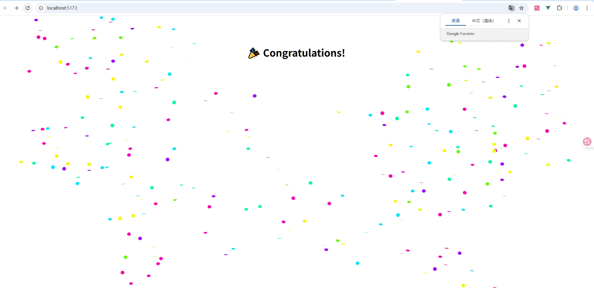

