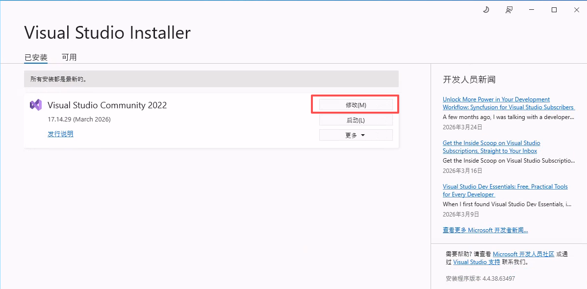
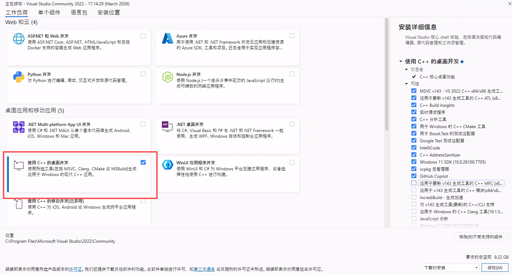

# freerdp编译安装步骤

参考教程：https://juejin.cn/post/7372403209053208613

freerdp官方编译教程：[freerdp官方编译教程](https://github.com/FreeRDP/FreeRDP/wiki/Compilation#common-instructions)

## 一、安装choco

powershell管理员权限安装choco，重启生效

```powershell
Set-ExecutionPolicy Bypass -Scope Process -Force; [System.Net.ServicePointManager]::SecurityProtocol = [System.Net.ServicePointManager]::SecurityProtocol -bor 3072; iex ((New-Object System.Net.WebClient).DownloadString('https://community.chocolatey.org/install.ps1'))
```

## 二、安装vs2022

通过cmd管理员权限安装

```cmd
choco install -y VisualStudio2022Community

#也可换成2026版本
#choco install -y VisualStudio2026Community
```

打开visual studio install安装c++桌面开发





## 三、安装Ninja

```cmd
choco install -y ninja
```

## 四、安装cmake

```cmd
choco install -y cmake.install --installargs '"ADD_CMAKE_TO_PATH=System"'
```

## 五、安装git

```cmd
choco install -y git
```

## 六、安装vcpkg

这里一定要从git clone，因为vcpkg.json里面用到了override指定了依赖库的版本

```cmd
mkdir workspace
cd workspace
git clone https://github.com/microsoft/vcpkg.git

#如果下载失败，可以配置http代理
#git config --global http.proxy http://192.168.1.12:1081
#git config --global https.proxy http://192.168.1.12:1081

#验证http代理是否配置完成
#git config --global --get http.proxy
#git config --global --get https.proxy

#初始化vckg
.\vcpkg\bootstrap-vcpkg.bat

#记得添加环境变量！！！
```

## 七、安装freerdp依赖

```cmd
#最小化安装依赖
vcpkg install zlib:x64-windows openssl:x64-windows 

#启用usb重定向，启用ffmpeg
libusb:x64-windows ffmpeg:x64-windows  icu:x64-windows jansson:x64-windows json-c:x64-windows cjson:x64-windows uriparser:x64-windows
 
#待定，
vcpkg install openh264:x64-windows
vcpkg install gstreamer:x64-windows
```

## 八、下载freerdp源码

下载freerdp最新release源码，解压到workspace目录

[freerdp release下载](https://github.com/FreeRDP/FreeRDP/releases)

## 九、编译freerdp

在freerdp源码目录新建build目录，进入build目录开始编译

```
mkdir build
cd build
```

CMake 配置命令

```cmd
#如果是vs2026，需要改参数
#-G "Visual Studio 18 2026" ^

#最小化客户端
cmake .. ^
-G "Visual Studio 17 2022" ^
-A x64 ^
-DCMAKE_TOOLCHAIN_FILE=C:\Users\Administrator\Desktop\workspace\vcpkg\scripts\buildsystems\vcpkg.cmake ^
-DWITH_CLIENT=ON ^
-DWITH_SERVER=OFF ^
-DWITH_SHADOW_SERVER=OFF ^
-DWITH_PROXY=OFF ^
-DWITH_FFMPEG=OFF ^
-DWITH_OPENH264=OFF ^
-DWITH_GSTREAMER=OFF ^
-DWITH_MEDIA=OFF ^
-DWITH_CUPS=OFF ^
-DWITH_PULSE=OFF ^
-DWITH_ALSA=OFF ^
-DWITH_USB=OFF ^
-DWITH_URBDRC=OFF ^
-DCHANNEL_URBDRC=OFF ^
-DWITH_CLIENT_SDL=OFF ^
-DWITH_CLIENT_WIN32=ON ^
-DBUILD_TESTING=OFF ^
-DBUILD_SHARED_LIBS=ON ^
-DWITH_SERVER_INTERFACE=OFF ^
-DWITH_SERVER_CHANNELS=OFF ^
-DWITH_KRB5=OFF ^
-DWITH_FUSE=OFF ^
-DWITH_SWSCALE=OFF ^
-DWITH_AVCODEC=OFF ^
-DWITH_AVUTIL=OFF ^
-DWITH_SWRESAMPLE=OFF


#支持usb重定向，使用方法：/usb:id,dev:vid:pid，/usb:auto暂时不生效
cmake .. ^
-G "Visual Studio 17 2022" ^
-A x64 ^
-DCMAKE_TOOLCHAIN_FILE=C:\Users\Administrator\Desktop\workspace\vcpkg\scripts\buildsystems\vcpkg.cmake ^
-DVCPKG_TARGET_TRIPLET=x64-windows ^
-DVCPKG_APPLOCAL_DEPS=ON ^
-DWITH_CLIENT=ON ^
-DWITH_CLIENT_WIN32=ON ^
-DWITH_CLIENT_SDL=OFF ^
-DWITH_SERVER=OFF ^
-DWITH_PROXY=OFF ^
-DWITH_CLIPBOARD=ON ^
-DWITH_WEBAUTHN=ON ^
-DWITH_USB=ON ^
-DWITH_URBDRC=ON ^
-DCHANNEL_URBDRC=ON ^
-DWITH_SOUND=ON ^
-DWITH_WINMM=ON ^
-DWITH_VIDEO=ON ^
-DWITH_FFMPEG=ON ^
-DWITH_GFX_H264=ON ^
-DWITH_OPENH264=OFF ^
-DWITH_GSTREAMER=OFF ^
-DWITH_MEDIA=OFF ^
-DWITH_D3D11=ON ^
-DWITH_DXGI=ON ^
-DWITH_DXVA=ON ^
-DWITH_CUPS=OFF ^
-DWITH_JPEG=ON ^
-DWITH_PNG=ON ^
-DWITH_ZLIB=ON ^
-DWITH_JANSSON=OFF ^
-DWITH_JSON_DISABLED=ON ^
-DWITH_CJSON=OFF ^
-DWITH_JSONC=OFF ^
-DBUILD_TESTING=OFF ^
-DBUILD_SHARED_LIBS=ON ^
-DWITH_SERVER_INTERFACE=OFF ^
-DWITH_SERVER_CHANNELS=OFF ^
-DWITH_KRB5=OFF ^
-DWITH_FUSE=OFF ^
-DWITH_CHANNELS=ON ^
-DWITH_DVC=ON ^
-DWITH_DVC_CAM=ON
```

构建命令

```cmd
cmake --build . --config Release
```

在build目录执行，拷贝运行依赖

```cmd
copy /Y client\common\Release\*.dll client\Windows\cli\Release\
copy /Y client\Windows\Release\*.dll client\Windows\cli\Release\

#在freerdp根目录执行，自动打包依赖到dist目录，如果开启了usb重定向参数，缺少的依赖到workspace\vcpkg\installed\x64-windows\bin拷贝dll库文件
cmake --install build --config Release --prefix dist
```

在client\Windows\cli\Release\运行wfreerdp

```cmd
wfreerdp.exe /v:192.168.1.106 /u:administrator /p:123456 /cert:ignore
```

可以把Release目录拷贝到任意windows环境运行

## 十、代理

国内网络不行，大概率需要代理

```cmd
set HTTP_PROXY=http://192.168.1.12:1081
set HTTPS_PROXY=http://192.168.1.12:1081
set VCPKG_HTTP_PROXY=http://192.168.1.12:1081
set VCPKG_HTTPS_PROXY=http://192.168.1.12:1081
```

