# Docker源加速

教程资料来源：[https://www.bilibili.com/video/BV1Zn4y19743](https://www.bilibili.com/video/BV1Zn4y19743)，感谢技术爬爬虾的分享

本教程使用了阿里云的镜像服务和GitHub的action自动化部署服务

## 一、搭建教程

### 1.1 开通容器镜像仓库

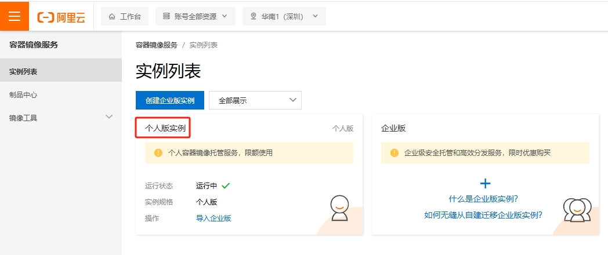

### 1.2  创建命名空间 

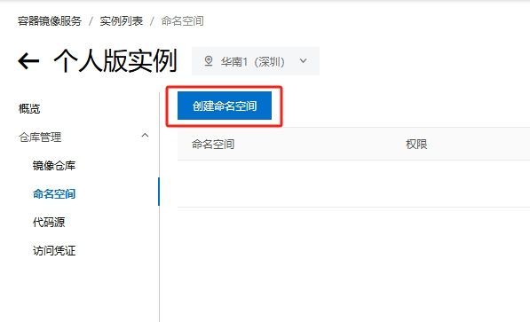

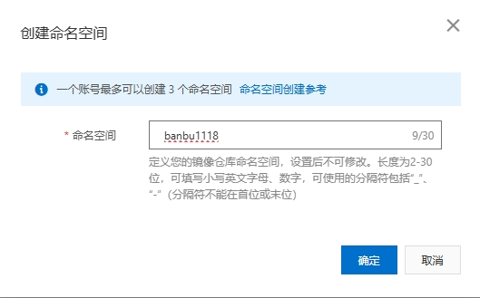

这里推荐设置为公开仓库

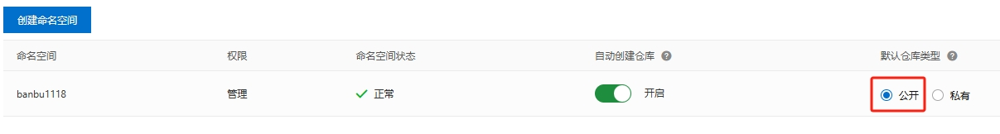

### 1.3 设置阿里云镜像仓库密码

在拉取私有镜像或者上传镜像前，需要docker login输入您的凭证信息。您可以选择通过 固定密码 作为访问凭证

固定密码没有时效限制，请注意妥善保管。如果遗失，可以通过再次设置重置固定密码。 

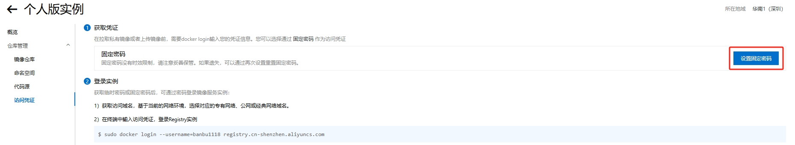

### 1.4 克隆GitHub仓库

技术爬爬虾仓库地址：https://github.com/tech-shrimp/docker_image_pusher

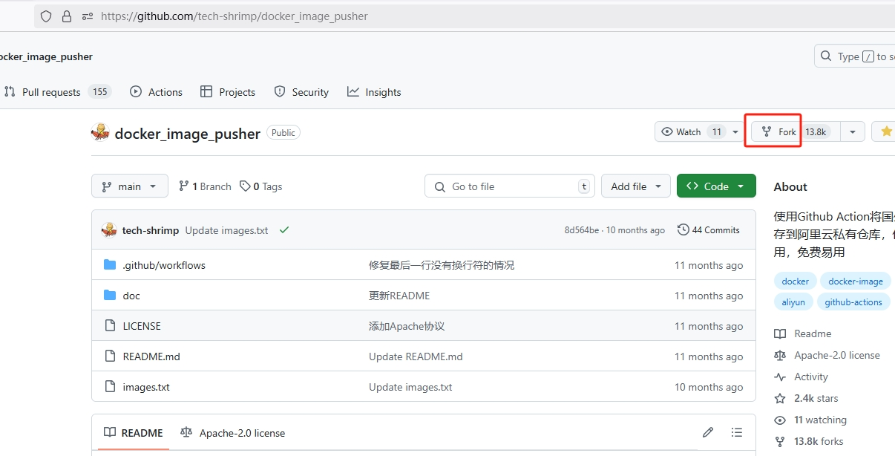

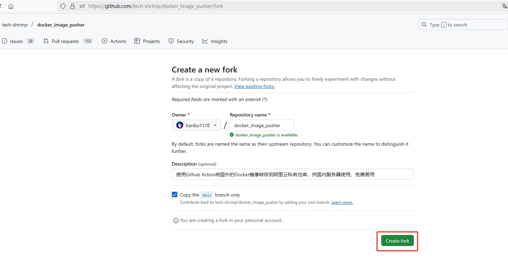

### 1.5 仓库设置

请注意，进入自己fork的仓库设置

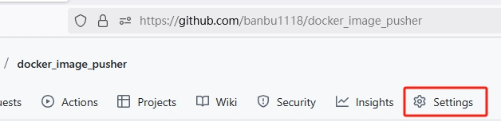

找到secrets and variables的Actions 

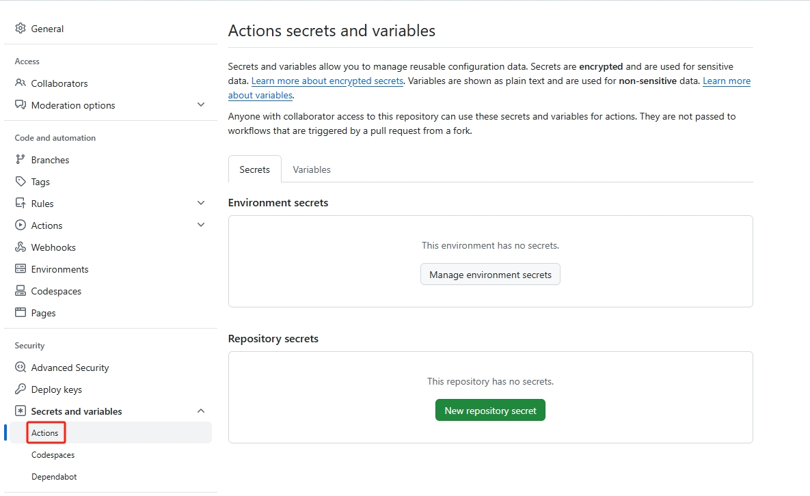

添加变量

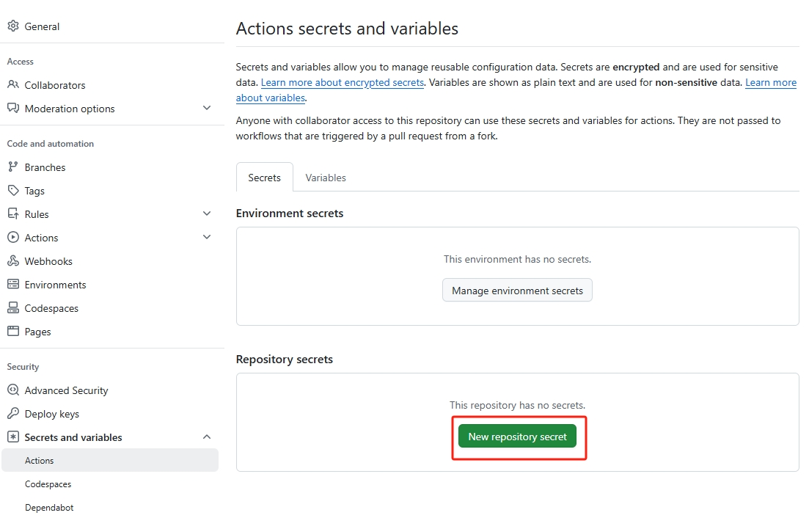

请先准备查看好这4个变量信息再添加

| 变量名称                 | 变量值                            | 备注                     |
| ------------------------ | --------------------------------- | ------------------------ |
| ALIYUN_REGISTRY_USER     | banbu1118                         | 用户名                   |
| ALIYUN_REGISTRY_PASSWORD | \*\*\*\*\*\*                           | 命名空间中设置的固定密码 |
| ALIYUN_NAME_SPACE        | banbu1118                         | 命名空间                 |
| ALIYUN_REGISTRY          | registry.cn-shenzhen.aliyuncs.com | 访问凭证                 |

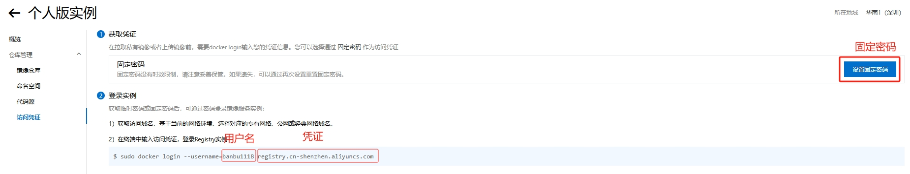

开始添加变量

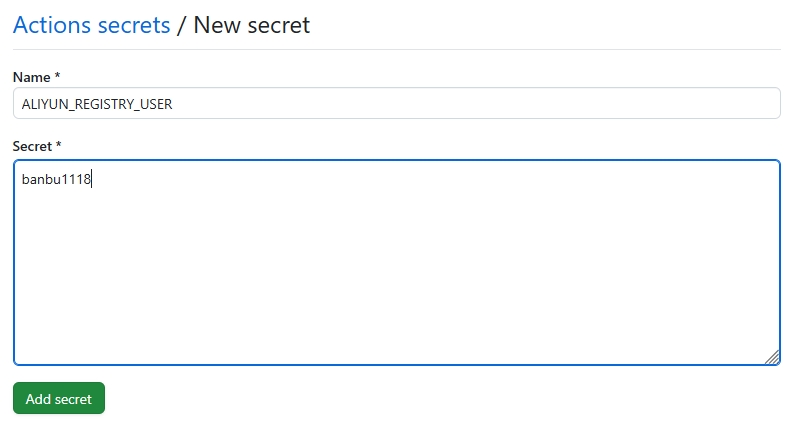

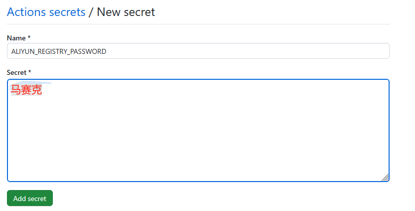

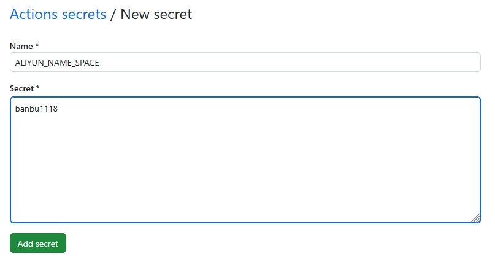

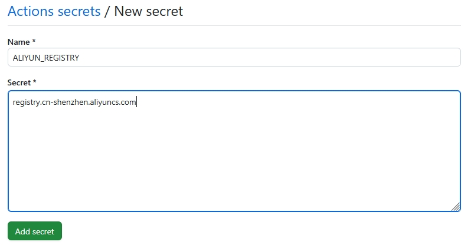

添加完成，如图所示

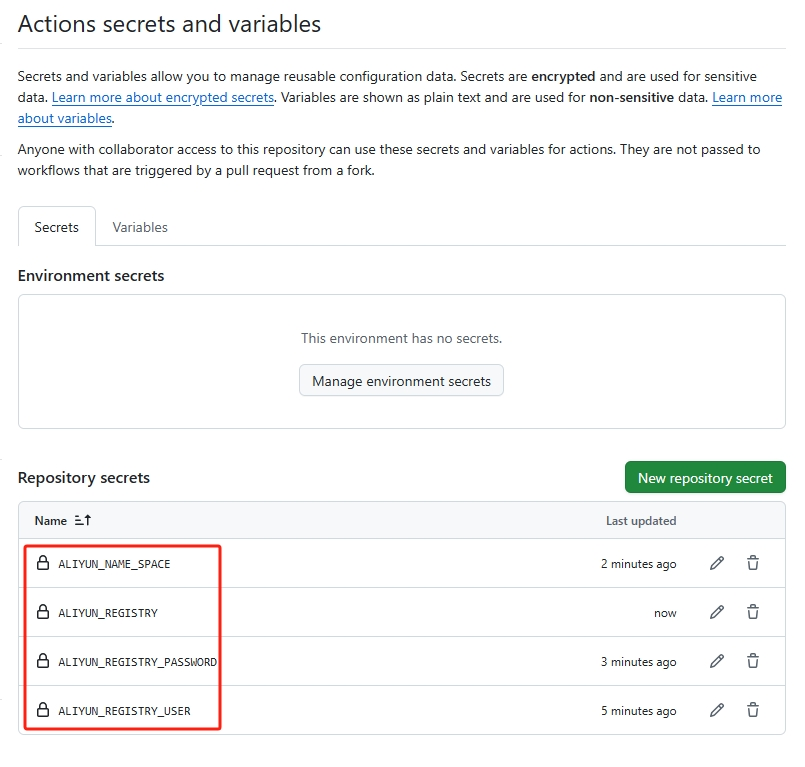

### 1.6 开启actions

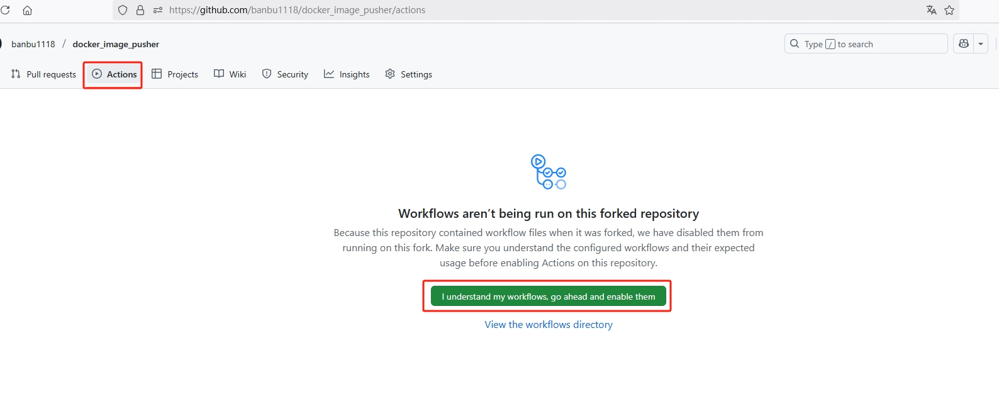

## 二、使用教程

### 2.1 拉取镜像步骤

编辑images.txt文件

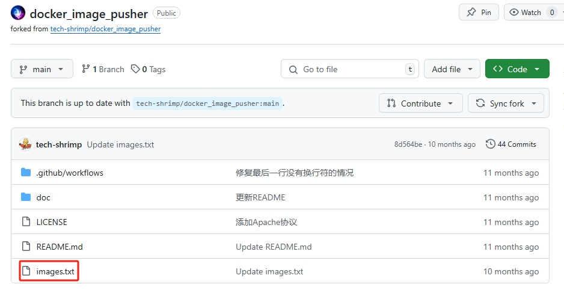

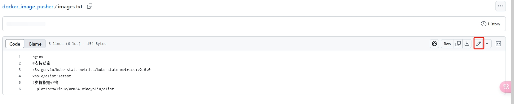

编辑需要拉取的镜像
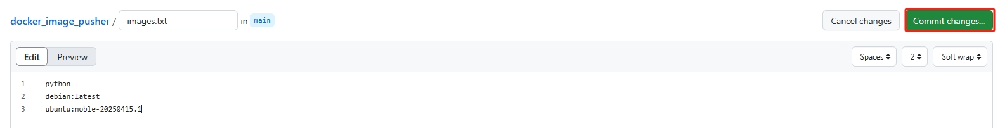

commit提交后GitHub的act会自动将镜像同步到阿里云镜像仓库


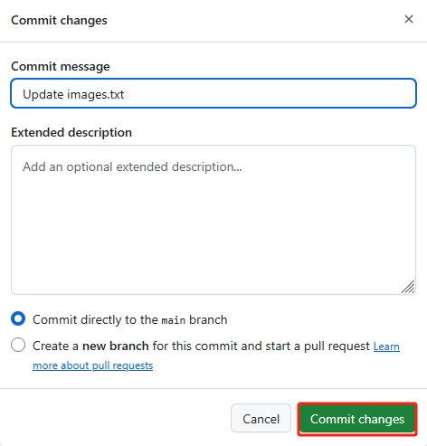

查看actions任务进度，完成后进行下一步

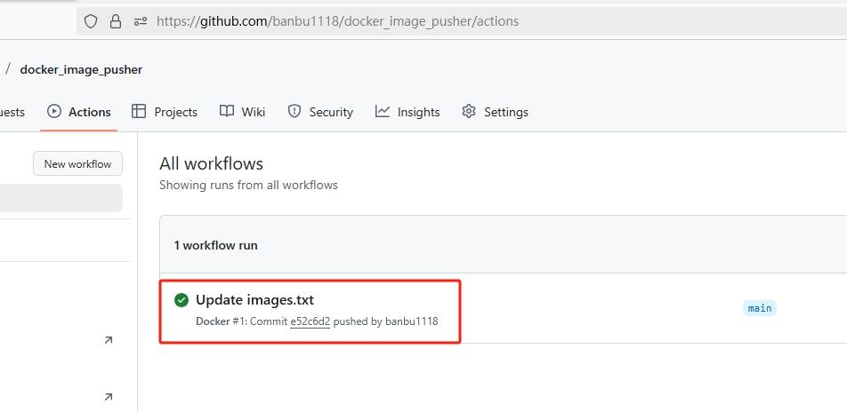

阿里云已经同步了images.txt填写的镜像

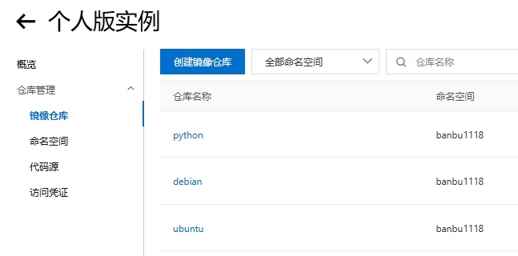

拉取镜像，因为设置的是公开仓库可以直接拉取，如果是私有仓库就需要登陆才能拉取镜像

参考阿里云拉取镜像的名称

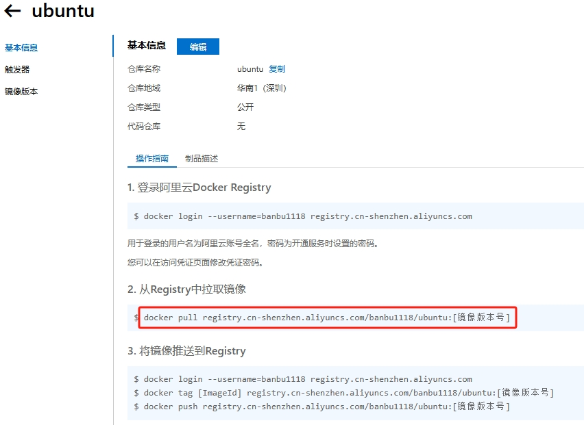

拉取操作

```bash
docker pull registry.cn-shenzhen.aliyuncs.com/banbu1118/python

docker pull registry.cn-shenzhen.aliyuncs.com/banbu1118/debian:latest

docker pull registry.cn-shenzhen.aliyuncs.com/banbu1118/ubuntu:noble-20250415.1
```

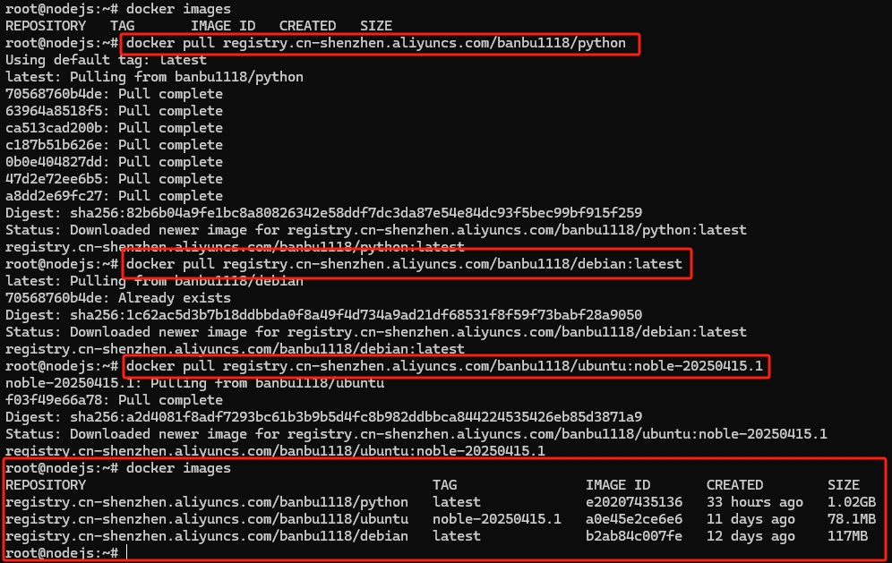

### 2.2 镜像改名

直接拉取的镜像名称太长了，不方便我们使用，这是对镜像改名的操作

docker tag 原镜像名[:原标签] 新镜像名[:新标签]

```bash
docker tag registry.cn-shenzhen.aliyuncs.com/banbu1118/ubuntu:noble-20250415.1 ubuntu:1.3
```

### 2.3 镜像导出

有些离线环境，无法直接拉取，我们可以在有网的设备拉取导出后，再导入离线的环境

导出

```bash
docker save -o ubuntu.tar ubuntu:1.3
```

导入

```bash
docker load -i ubuntu.tar
```
