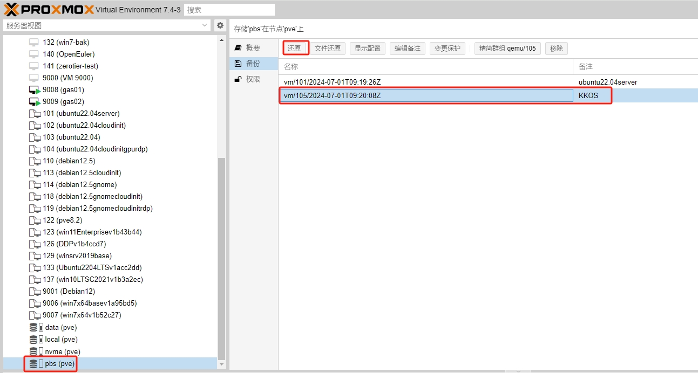

## PBS开源备份方案

### 一、简介

Proxmox Backup Server（PBS）是一款基于开源软件的备份解决方案，为 Proxmox Virtual Environment（PVE）虚拟化平台提供高可靠性的数据备份和恢复功能。

### 二、存储规划

#### 1.硬件RAID

硬RAID，又称为硬件RAID，是由独立于硬盘之外的硬件RAID卡组成。这些RAID卡有自己的处理器和内存，用于处理RAID操作，无需依赖于主机的CPU资源。硬RAID通常具有更高的性能和更好的数据安全性。 

#### 2.软件RAID

软RAID，也被称为软件RAID，是由操作系统模拟的RAID。它依赖于主机的CPU资源来处理RAID操作，无需额外的硬件支持。这种RAID的实现在很大程度上取决于操作系统的功能和稳定性。 

#### 3.软硬件RAID对比

|          | 硬件RAID                   | 软件RAID                                     |
| -------- | -------------------------- | -------------------------------------------- |
| 性能     | 专用硬件，高性能           | 和系统共享硬件，大量处理数据时，cpu性能下降  |
| 数据安全 | 在数据安全性方面表现更佳   | 数据安全性方面相对较弱                       |
| 灵活性   | 配置后难以修改，扩容不方便 | 由系统控制，可随时添加或删除磁盘，扩容更方便 |
| 成本     | 需要RAID控制器，成本更高   | 无需硬件支持，成本较低                       |

#### 4.硬件RAID与ZFS RAID

| **硬件RAID** | **ZFS RAID** | **最少需要硬盘数量** |
| ------------ | ------------ | -------------------- |
| raid-0       | raid-0       | 1                    |
| raid-1       | raid-1       | 2                    |
| raid-10      | raid-10      | 4                    |
| raid-5       | raidz-1      | 2                    |
| raid-6       | raidz-2      | 4                    |

#### 5.选择合适的RAID

存储是备份服务器的核心，所以在选择RAID方案时，需要综合考虑性能、数据安全性、灵活性、成本以及实际应用场景等因素。无论选择哪种RAID方案，都需要确保正确配置和维护，以充分发挥其优势并保障数据的安全性和可用性。 

#### 6.项目实例

|   型号    |                             配置                             | 数量 |
| :-------: | :----------------------------------------------------------: | :--: |
| 戴尔 R620 | CPU：E5-2620\*1 @2.0GHz<br />内存：16G\*1<br />SSD：120G\*1<br />HDD：1T*4 |  1   |

利用一台旧服务器存备份存储服务器，其他1块SSD做系统盘，HDD做成数据盘使用。

其中4块HDD做raid10。

### 三、部署PBS

#### 1.获取PBS

[中科大镜像站下载链接](https://mirrors.ustc.edu.cn/proxmox/iso/)

#### 2.安装PBS

选择第一项，回车


选择“I agree”


选择PBS安装的系统盘，然后选择"next"


选择“next”


输入密码和邮箱，选择“next”


选择合适网卡，配置主机名和ip信息，然后选择“next”


选择“next”


等待安装


安装完成，等待设备自动重启或选择“reboot”重启。


拔出启动U盘，等待设备重启，进入以下界面


#### 3.登录PBS

浏览器输入上面的ip和端口信息，登录PBS


输入账号root，和配置的密码登录PBS系统


#### 4.创建目录存储—硬RAID模式

硬RAID模式下，已经在服务器的RAID卡创建了RAID。

选择”存储磁盘“


选择磁盘，进行擦除操作


创建存储存储


选择ext4文件系统，给个名称，创建目录存储


#### 5.创建ZFS存储—软RAID模式

如果服务器没有做硬RAID，可以做在PBS层面利用ZFS实现软RAID。


### 四、虚拟机备份配置

#### 1.PVE配置PBS存储信息

登录PVE，添加PBS存储


配置PBS连接信息

IP：给PBS备份服务器起个名字

服务器：PBS服务器IP

用户名：root@pam

密码：PBS的root密码

Datastore：PBS存储空间的名字data

指纹：PBS的指纹信息，PBS登录首页点击显示指纹复制即可


#### 2.PVE添加备份信息

登录PVE，添加备份任务


节点：选择需要备份的PVE节点，可以给PVE集群做备份

存储：选择前面添加的pbs存储

计划：此处配置每天晚上九点开始备份，可以按照实际情况做调整，做到每天备份或每周，每月备份

选择模式：手动选择需要备份的虚拟机，或备份全部虚拟机

模式：默认即可，三个模式的区别可以去PBS官网查看


#### 3.测试备份任务

立即执行任务测试一下


确认备份任务可以正常进行


#### 4.创建校验任务

创建校验任务，在备份任务完成后，对虚拟机备份文件做哈希校验，确保备份的虚拟机数据正确无误


计划的时间，是所有虚拟机都备份完成后再执行，建议配置为备份任务时间晚两个小时


#### 5.测试检验任务

立即执行任务测试一下


#### 6.创建精简任务

精简任务是保留备份虚拟机的个数，例如，保留虚拟机最后15次的备份数据，如果出现问题，可以找回半个月内的数据。


精简时间表：执行精简任务的时间
保留上次：保留虚拟机最后15次的备份，如果设置每天备份任务的话，就是保留半个月的备份数据。


#### 7.测试精简任务

立即执行任务测试一下


#### 8.任务查看

查看所有的备份任务，校验任务，精简任务运行情况


点击查看详情


### 五、虚拟机还原

登录pve，选择还原的虚拟机，进行还原恢复



选择合适的存储路径，还原虚拟机


### 六、PBS备份的优势

#### 1.集成性

Proxmox Backup Server与Proxmox VE虚拟化平台紧密集成，可以轻松地管理和备份Proxmox VE主机上的虚拟机和容器。 

#### 2.简单易用

提供直观的Web界面，使用户可以轻松设置和管理备份任务，包括计划备份、增量备份等。 

#### 3.高性能

Proxmox Backup Server使用Zstandard压缩算法，提供高效的数据压缩和备份速度，同时支持快速的增量备份和恢复。

#### 4.安全性

支持数据加密，确保备份数据的安全性和隐私保护 。

#### 5.开源和免费

 Proxmox Backup Server是开源软件，免费提供给用户使用，并且有一个活跃的社区支持。

### 七、维护

#### 1.垃圾回收

如果pbs空间被用完，执行了精简任务空间还没有释放，需要手动执行垃圾回收命令

```shell
proxmox-backup-manager garbage-collection start data
```
