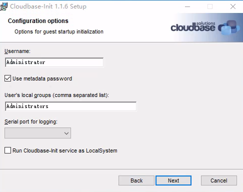
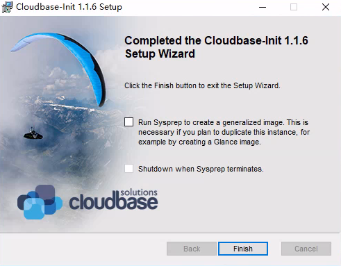
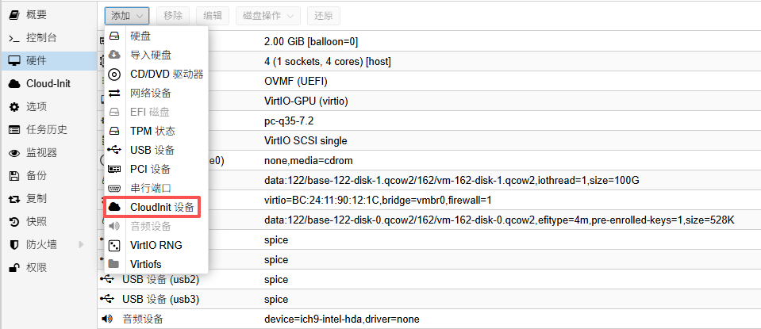
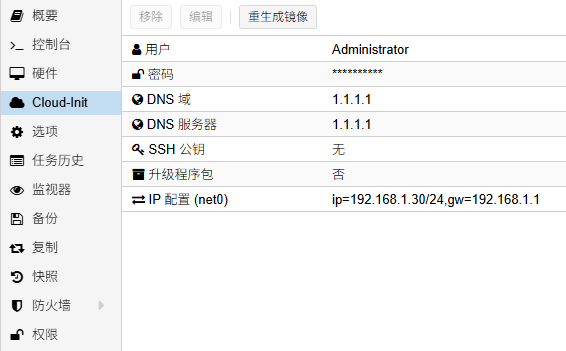

## Windows操作系统安装Cloudbase-Init

### 一、简介

通过cloudbase-init，可以快速配置虚拟机的用户信息，ip信息等配置

参考资料：

[https://www.riv3n.com/2025/10/28/PVE-Windows-Cloudbase-init/](https://www.riv3n.com/2025/10/28/PVE-Windows-Cloudbase-init/)

[https://www.tcps.cc/posts/pve-windows-cloudinit-guide](https://www.tcps.cc/posts/pve-windows-cloudinit-guide)

### 二、下载

GitHub仓库release下载：[https://github.com/cloudbase/cloudbase-init/releases](https://github.com/cloudbase/cloudbase-init/releases)

注意：win7和win server 2008 R2请安装 Cloudbase-Init 1.1.2版本。

如使用1.1.4及以上版本，将出现“无法启动此程序，因为计算机中丢失 api-ms-win-core-path-l1-1-0.dll”报错。

### 三、安装

前面默认，这里用户名输入虚拟机的管理员用户administrator，串口没有就跳过，不要勾选Run Cloudbase-init service as LocalSystem



安装完成不要勾选最后两个



### 四、配置文件

编辑“C:\Program Files\Cloudbase Solutions\Cloudbase-Init\conf\cloudbase-init.conf”，清空后，替换为以下内容，保存后关机

```
[DEFAULT]
username=administrator
groups=Administrators
inject_user_password=true
first_logon_behaviour=no
rename_admin_user=true
bsdtar_path=C:\Program Files\Cloudbase Solutions\Cloudbase-Init\bin\bsdtar.exe
mtools_path=C:\Program Files\Cloudbase Solutions\Cloudbase-Init\bin\
verbose=true
debug=true
log_dir=C:\Program Files\Cloudbase Solutions\Cloudbase-Init\log\
log_file=cloudbase-init.log
default_log_levels=comtypes=INFO,suds=INFO,iso8601=WARN,requests=WARN
mtu_use_dhcp_config=false
ntp_use_dhcp_config=false
local_scripts_path=C:\Program Files\Cloudbase Solutions\Cloudbase-Init\LocalScripts\
check_latest_version=false
metadata_services=cloudbaseinit.metadata.services.configdrive.ConfigDriveService
plugins=cloudbaseinit.plugins.common.networkconfig.NetworkConfigPlugin,cloudbaseinit.plugins.windows.extendvolumes.ExtendVolumesPlugin,cloudbaseinit.plugins.common.setuserpassword.SetUserPasswordPlugin,cloudbaseinit.plugins.common.sethostname.SetHostNamePlugin,cloudbaseinit.plugins.windows.createuser.CreateUserPlugin
[config_drive]
cdrom=true
```

### 五、添加cloudinit设备



### 六、应用cloud-init

编辑cloud-init配置，用户为安装时的Administrator，密码可以自定义，ip和ip可以自定义，编辑后点击右上角的重生成镜像，开机后即可生效



### 七、测试验证

测试了win7，win10，win11，server2019，server2025可以正常使用