### 前言

```shell
alist是一款轻量级的文件列表和分享服务,它可以帮助用户快速搭建一个文件分享服务器。

alist支持多种存储方式,如阿里云盘、夸克网盘、本地硬盘等,方便用户在不同场景下使用。

通过alist,用户可以方便地管理和分享自己的文件,同时支持在线预览、下载等功能。
```


### 1.下载AlistCloud模板

```shell
pve下载并导入AlistCloud模板
https://share.weiyun.com/IJQ6kY0b
```

### 2.完整克隆一个AlistCloud虚拟机

```shell
推荐完整克隆
```

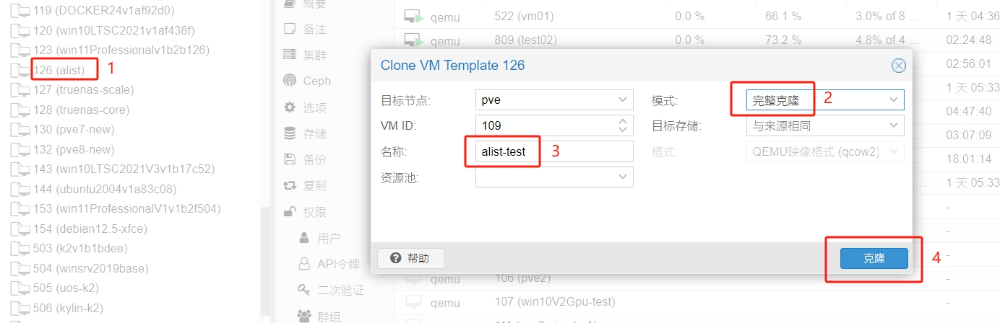

### 3. 给虚拟机添加一块磁盘

```shell
这磁盘将用户存储服务，请提前确认好容量
```

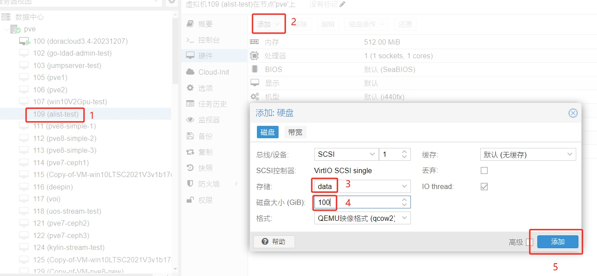

### 4.磁盘创建文件系统

```shell
请确认好新挂载磁盘的名称
fdisk /dev/sdb
```

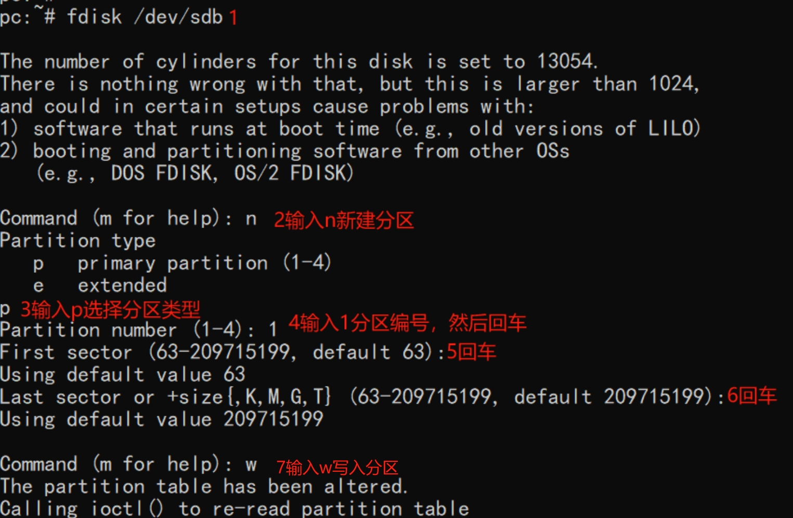

### 5.格式化分区

```shell
将格式为ext4
mkfs.ext4 /dev/sdb1
```

### 6.永久挂载分区

```shell
编辑/etc/fstab文件，末尾添加如下内容
/dev/sdb1    /mnt    ext4    defaults    0    0
```

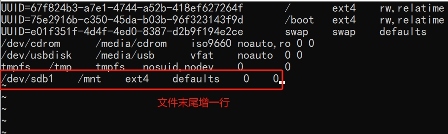

### 7.重启虚拟机让挂载生效

```shell
reboot
```

### 8.docker-compose创建容器

```shell
在/root路径执行容器命令
docker-compose -f alist.yaml up -d

```

### 9.初始化alist登录密码为admin

```shell
可以将末尾的admin密码替换为其他的
docker exec -it alist ./alist admin set admin

```

### 10.浏览器输入ip登录

```shell
登录管理员账户
admin/admin

```

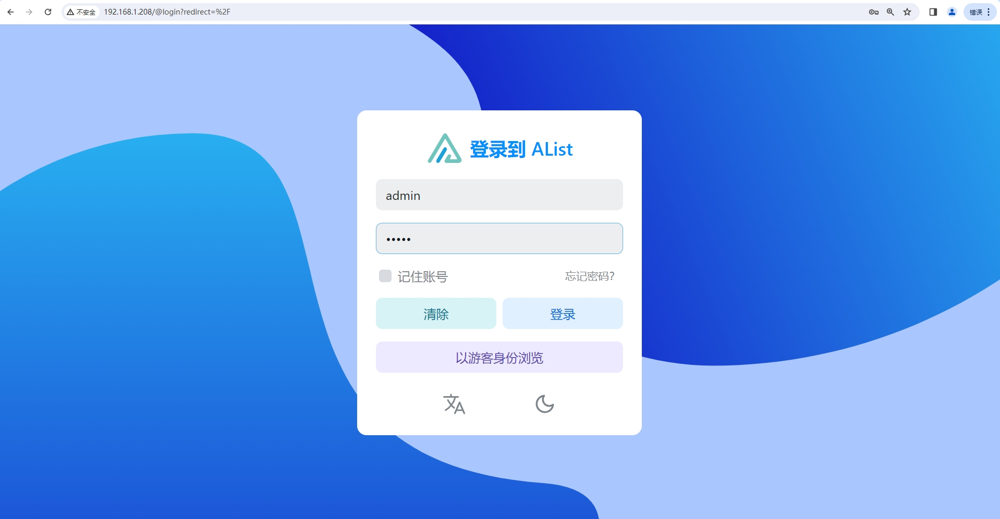

### 11.配置存储

```shell
登录后选择管理，进入后台配置存储，添加本地存储
注意挂载路径如图所示，和dockr卷挂载相关
添加成功后如图所示

```

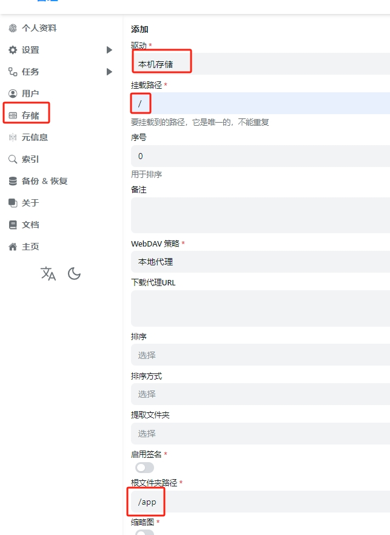
<br />
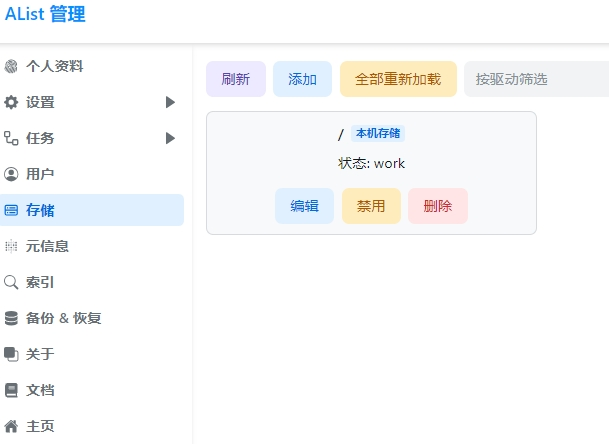

### 12.配置用户权限

```shell
按照需求配置用户权限
这里有2个账户
admin作为管理员，需要密码登录，拥有上传下载的权限
guest作为游客账户登录，只能下载不能上传文件

```

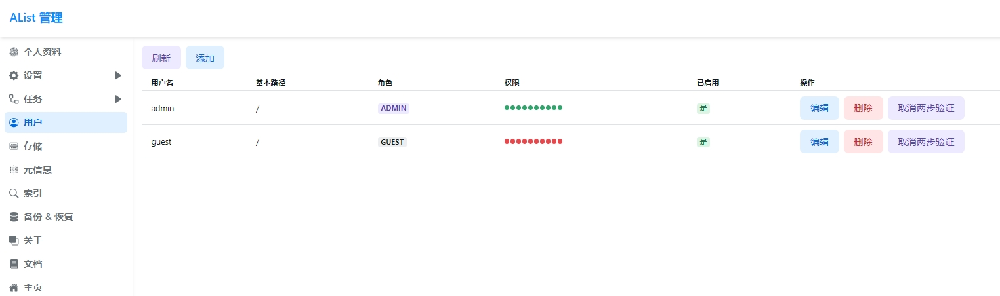
<br />
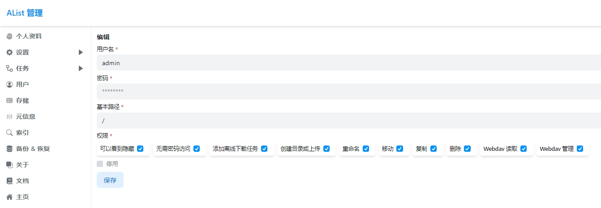
<br />
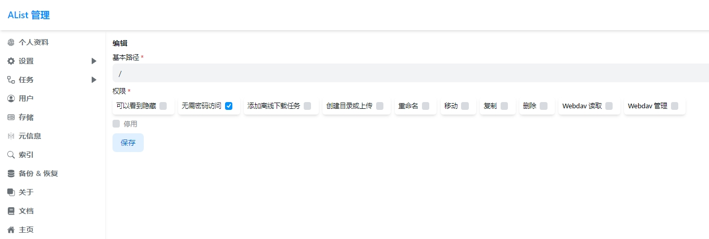

### 13.上传数据

```shell
选择上传数据

```


<br />
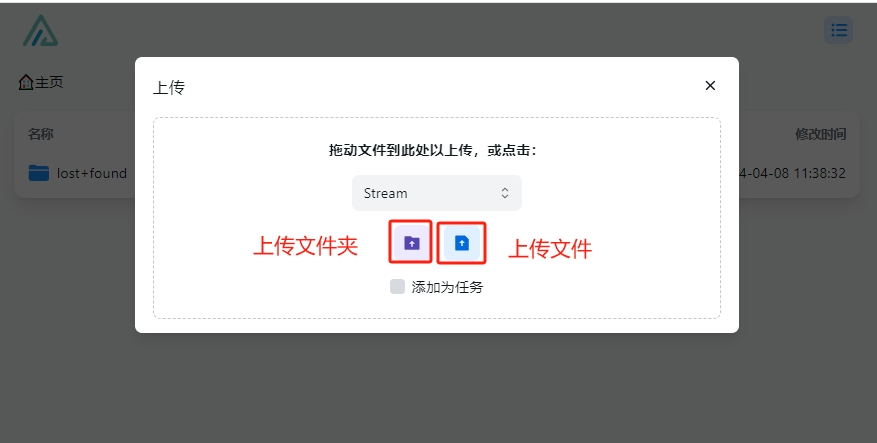
<br />
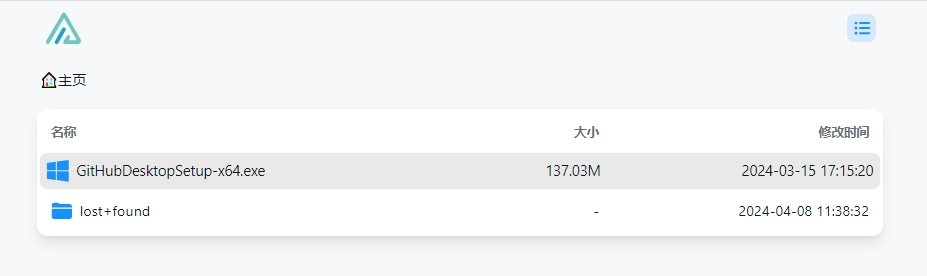

### 14.下载数据

```shell
右键下载数据

```

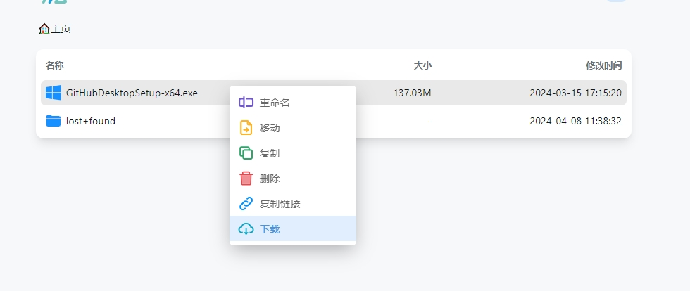

### 15.注意事项

```shell
lost+found存储意外掉电的错误，可以用作数据恢复。可以选择直接删除这个目录

```

