# nginx学习教程

参照资料：[https://www.yuque.com/wexiao/nginx/nr0app](https://www.yuque.com/wexiao/nginx/nr0app)

## 一、nginx安装、启动

### 1.1版本区别

常用版本分为四大阵营 

| 版本              | 网址                        | 备注                 |
| ----------------- | --------------------------- | -------------------- |
| Nginx开源版       | http://nginx.org            | 开源版本，功能少     |
| Nginx plus 商业版 | https://www.nginx.com       | 商业版本，功能更丰富 |
| openresty         | https://openresty.org/cn/   | 常见的版本           |
| Tengine           | https://tengine.taobao.org/ | 淘宝的web服务器项目  |

### 1.2源码安装nignx

* 基本信息

学习环境：centos7

nginx版本：https://nginx.org/download/nginx-1.21.6.tar.gz

* 安装依赖关系

```
yum install -y gcc pcre pcre-devel zlib zlib-devel
```

* 下载nginx

```
curl -O https://nginx.org/download/nginx-1.21.6.tar.gz
```

* 解压并进入源码目录

```
tar -zxvf nginx-1.21.6.tar.gz

cd nginx-1.21.6
```

* 配置安装路径

```
./configure --prefix=/usr/local/nginx
```

* 编译安装

```
make

make install
```

### 1.3启动nginx

* 进入nginx安装目录

```
cd /usr/local/nginx/sbin/
```

* 启动nginx

```
./nginx
```

* nginx相关命令

```
./nginx 启动
./nginx -s stop 快速停止
./nginx -s quit 优雅关闭，在退出前完成已经接受的连接请求
./nginx -s reload 重新加载配置
```

* 防火墙放行

```
firewall-cmd --zone=public --add-port=80/tcp --permanent
```

* 重启防火墙

```
firewall-cmd --reload
```

* 浏览器访问服务器ip:80

### 1.4配置systemd服务

* 创建服务脚本/usr/lib/systemd/system/nginx.service  

```
[Unit]
Description=nginx - web server
After=network.target remote-fs.target nss-lookup.target
[Service]
Type=forking
PIDFile=/usr/local/nginx/logs/nginx.pid
ExecStartPre=/usr/local/nginx/sbin/nginx -t -c /usr/local/nginx/conf/nginx.conf
ExecStart=/usr/local/nginx/sbin/nginx -c /usr/local/nginx/conf/nginx.conf
ExecReload=/usr/local/nginx/sbin/nginx -s reload
ExecStop=/usr/local/nginx/sbin/nginx -s stop
ExecQuit=/usr/local/nginx/sbin/nginx -s quit
PrivateTmp=true
[Install]
WantedBy=multi-user.target
```

* 重新加载系统服务

```
systemctl daemon-reload
```

* 启动服务

```
systemctl start nginx
```

* 重启nginx服务

```
systemctl reload nginx
```

* 配置开机启动

```
systemctl enable nginx
```

## 二、nginx基本使用

### 2.1目录结构

* 进入nginx目录

```
/usr/local/nginx
```

* 查看目录结构

```
[root@localhost nginx]# ls -l
total 4
drwx------. 2 nobody root    6 Sep 12 20:51 client_body_temp
drwxr-xr-x. 2 root   root 4096 Sep 12 20:51 conf
drwx------. 2 nobody root    6 Sep 12 20:51 fastcgi_temp
drwxr-xr-x. 2 root   root   40 Sep 12 20:51 html
drwxr-xr-x. 2 root   root   58 Sep 12 20:57 logs
drwx------. 2 nobody root    6 Sep 12 20:51 proxy_temp
drwxr-xr-x. 2 root   root   19 Sep 12 20:51 sbin
drwx------. 2 nobody root    6 Sep 12 20:51 scgi_temp
drwx------. 2 nobody root    6 Sep 12 20:51 uwsgi_temp
```

* nginx目录结构

```
conf
用来存放配置文件相关

html
用来存放静态文件的默认目录 html、css等

sbin
nginx的主程序

logs
日志目录

temp文件
nginx运行产生的缓存文件
```

* 用tree来产看目录和文件

```
[root@localhost nginx]# tree .
.
├── client_body_temp
├── conf
│   ├── fastcgi.conf
│   ├── fastcgi.conf.default
│   ├── fastcgi_params
│   ├── fastcgi_params.default
│   ├── koi-utf
│   ├── koi-win
│   ├── mime.types
│   ├── mime.types.default
│   ├── nginx.conf
│   ├── nginx.conf.default
│   ├── scgi_params
│   ├── scgi_params.default
│   ├── uwsgi_params
│   ├── uwsgi_params.default
│   └── win-utf
├── fastcgi_temp
├── html
│   ├── 50x.html	#错误页
│   └── index.html	#默认首页
├── logs
│   ├── access.log	#记录用户访问信息
│   ├── error.log	#错误日志
│   └── nginx.pid	#记录nginx主进程号
├── proxy_temp
├── sbin
│   └── nginx	#主程序
├── scgi_temp
└── uwsgi_temp
```

### 2.2基本运行原理

* 基本概念

nginx采用的是多进程（单线程）& 多路IO复用模型。 使用了 I/O 多路复用技术的nginx，就成了”并发事件驱动“的服务器。 

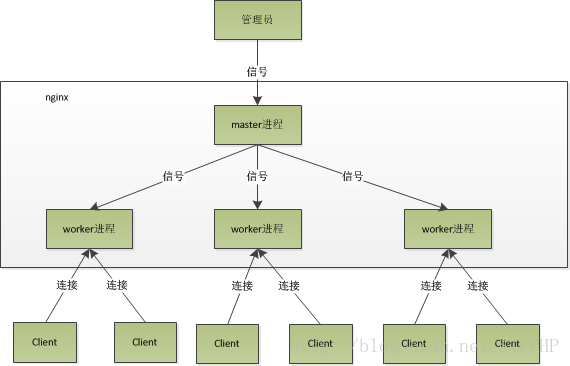

* nginx工作模式

```
单工作进程模式：除主进程外，还有一个工作进程，工作进程是单线程的。

多工作进程模式：每个工作进程包含多个线程。Nginx 默认为单工作进程模式。
```

* masker进程

```
master进程主要用来管理worker进程。
包含：接收来自外界的信号，向各worker进程发送信号，监控 worker进程的运行状态,当异常情况下worker进程退出后，会自动重新启动新的worker进程。

master进程充当整个进程组与用户的交互接口，同时对进程进行监护。
它不需要处理网络事件，不负责业务的执行，只会通过管理worker进程来实现重启服务、平滑升级、更换日志文件、配置文件实时生效等功能。
```

* worker进程

```
多个worker进程之间是对等的。

一个请求只可能在一个worker进程中处理。

worker进程的个数是可以设置的，一般我们会设置与机器CPU核数一致。

使用多进程模式，不仅能提高并发率，而且进程之间相互独立，一个 worker 进程挂了不会影响到其他 worker 进程。
```

* worker工作原理

```
worker进程之间是平等的，每个进程，处理请求的机会也是一样的。

当我们提供80端口的HTTP服务时，一个连接请求过来，每个进程都有可能处理这个连接，怎么做到的呢？步骤如下：

1.每个worker进程都是从master进程fork过来，在master进程里面，建立好需要listen的 socket(listenfd)之后。

2.fork出多个worker进程。

3.所有worker进程的listenfd会在新连接到来时变得可读，为保证只有一个进程处理该连接，所有worker进程在注册listenfd读事件前抢accept_mutex，抢到互斥锁的worker进程注册listenfd读事件；在读事件里调用accept接受该连接。

4. 当一个worker进程在accept这个连接之后，就开始读取请求，解析请求，处理请求。产生数据后，再返回给客户端，最后才断开连接


一个完整的请求就是这样的了。

我们可以看到，一个请求，完全由worker进程来处理，且只在一个worker进程中处理。
```

* 惊群现象

```
主进程（master 进程）首先通过 socket() 来创建一个 sock 文件描述符用来监听，然后fork生成子进程（workers 进程），子进程将继承父进程的 sockfd（socket 文件描述符），之后子进程 accept() 后将创建已连接描述符（connected descriptor）），然后通过已连接描述符来与客户端通信。

那么，由于所有子进程都继承了父进程的 sockfd，那么当连接进来时，所有子进程都将收到通知并“争着”与它建立连接，这就叫“惊群现象”。大量的进程被激活又挂起，只有一个进程可以accept() 到这个连接，这当然会消耗系统资源。
```

* nginx对惊群现象的处理

```
Nginx提供了一个accept_mutex这个东西，这是一个加在accept上的一把互斥锁。即每个worker进程在执行accept之前都需要先获取锁，获取不到就放弃执行accept()。有了这把锁之后，同一时刻，就只会有一个进程去accpet()，这样就不会有惊群问题了。accept_mutex是一个可控选项，我们可以显示地关掉，默认是打开的。
```

### 2.3nginx基础配置

#### 2.3.1最小配置文件

* 默认配置文件

```

#user  nobody;
worker_processes  1;

#error_log  logs/error.log;
#error_log  logs/error.log  notice;
#error_log  logs/error.log  info;

#pid        logs/nginx.pid;


events {
    worker_connections  1024;
}


http {
    include       mime.types;
    default_type  application/octet-stream;

    #log_format  main  '$remote_addr - $remote_user [$time_local] "$request" '
    #                  '$status $body_bytes_sent "$http_referer" '
    #                  '"$http_user_agent" "$http_x_forwarded_for"';

    #access_log  logs/access.log  main;

    sendfile        on;
    #tcp_nopush     on;

    #keepalive_timeout  0;
    keepalive_timeout  65;

    #gzip  on;

    server {
        listen       80;
        server_name  localhost;

        #charset koi8-r;

        #access_log  logs/host.access.log  main;

        location / {
            root   html;
            index  index.html index.htm;
        }

        #error_page  404              /404.html;

        # redirect server error pages to the static page /50x.html
        #
        error_page   500 502 503 504  /50x.html;
        location = /50x.html {
            root   html;
        }

        # proxy the PHP scripts to Apache listening on 127.0.0.1:80
        #
        #location ~ \.php$ {
        #    proxy_pass   http://127.0.0.1;
        #}

        # pass the PHP scripts to FastCGI server listening on 127.0.0.1:9000
        #
        #location ~ \.php$ {
        #    root           html;
        #    fastcgi_pass   127.0.0.1:9000;
        #    fastcgi_index  index.php;
        #    fastcgi_param  SCRIPT_FILENAME  /scripts$fastcgi_script_name;
        #    include        fastcgi_params;
        #}

        # deny access to .htaccess files, if Apache's document root
        # concurs with nginx's one
        #
        #location ~ /\.ht {
        #    deny  all;
        #}
    }


    # another virtual host using mix of IP-, name-, and port-based configuration
    #
    #server {
    #    listen       8000;
    #    listen       somename:8080;
    #    server_name  somename  alias  another.alias;

    #    location / {
    #        root   html;
    #        index  index.html index.htm;
    #    }
    #}


    # HTTPS server
    #
    #server {
    #    listen       443 ssl;
    #    server_name  localhost;

    #    ssl_certificate      cert.pem;
    #    ssl_certificate_key  cert.key;

    #    ssl_session_cache    shared:SSL:1m;
    #    ssl_session_timeout  5m;

    #    ssl_ciphers  HIGH:!aNULL:!MD5;
    #    ssl_prefer_server_ciphers  on;

    #    location / {
    #        root   html;
    #        index  index.html index.htm;
    #    }
    #}

}
```

* 删除注释后的精简配置文件

```
worker_processes  1;	#worker数量，推荐值为cpu个数

events {
    worker_connections  1024;	#每个工作进程（worker_processes）可以同时处理的最大连接数
}


http {
    include       mime.types;	#引用http, mime类型
    default_type  application/octet-stream;		#其他不在mime.types中的文件类型，默认使用二进制流的方式传递

    sendfile        on;		#开启零拷贝，直接传递数据

    keepalive_timeout  65;		#保持长连接的时间

    server {
        listen       80;	#监听服务器端口号
        server_name  localhost;		# 域名、主机名，localhost在hosts解析127.0.0.1为本机

		# http://opendesk.top/xxxx/index.html
        location / {	#匹配路径为/
            root   html; 	#文件根目录，html是相对路径
            index  index.html index.htm;	 #访问80端口，找到nginx目录下的html目录下的index.html
        }
        #http://opendesk.top/50x.html
        error_page   500 502 503 504  /50x.html;	#报错编码对应页面
        location = /50x.html {
            root   html;
        }

    }
}

```

* 虚拟主机配置 virtual host（vhost）

```
server {
    listen 80; 监听端口号
    server_name localhost; #域名、主机名
    location / { 匹配路径
        root html; 文件根目录
        index index.html index.htm; 默认页名称
    }
    error_page 500 502 503 504 /50x.html; 报错编码对应页面
    location = /50x.html {
    		root html;
		}
}
```

#### 2.3.2虚拟主机

原本一台服务器只能对应一个站点，通过虚拟主机技术可以虚拟化成多个站点同时对外提供服务。

* 创建/www目录和两个子目录，每个子目录创建index.html文件

```
[root@localhost conf]# tree /www/
/www/
├── video
│   └── index.html
└── www
    └── index.html
```

* 两个index.html内容分别如下

```
[root@localhost conf]# cat /www/www/index.html
this is www website.

[root@localhost conf]# cat /www/video/index.html
this is video website.
```

* 修改/usr/local/nginx/conf下的nginx.config

```
worker_processes  1;

events {
    worker_connections  1024;
}


http {
    include       mime.types;
    default_type  application/octet-stream;

    sendfile        on;
    keepalive_timeout  65;

    server {
        listen       80;
        server_name  localhost;

        location / {
            root   /www/www;
            index  index.html index.htm;
        }

        error_page   500 502 503 504  /50x.html;
        location = /50x.html {
            root   html;
        }
    }


    server {
        listen       88;
        server_name  localhost;

        location / {
            root   /www/video;
            index  index.html index.htm;
        }

        error_page   500 502 503 504  /50x.html;
        location = /50x.html {
            root   html;
        }
    }

}
```

* 重新加载nginx

```
systemctl reloadnginx

systemctl restart nginx
```

* 防火墙放开对应端口

```
firewall-cmd --zone=public --add-port=88/tcp --permanent

firewall-cmd --reload
```

* 结果

实现同一个主机，通过访问不同端口，访问不同网站


<hr />


#### 2.3.3虚拟机主机多域名配置

* 解析域名
编辑C:\Windows\System32\drivers\etc\hosts文件，添加域名解析记录，模拟实际ddns解析

```
192.168.8.50 www.kk.com
192.168.8.50 vedio.kk.com
192.168.8.50 vedio1.kk.com
192.168.8.50 kk.com.hh
192.168.8.50 666.kk.com
```

* 虚拟主机多域名相同端口配置

注意：域名+端口要唯一

www.kk.com 80

vedio.kk.com 80

* nginx配置

```
worker_processes  1;

events {
    worker_connections  1024;
}


http {
    include       mime.types;
    default_type  application/octet-stream;

    sendfile        on;
    keepalive_timeout  65;

    server {
        listen       80;
        server_name  www.kk.com;

        location / {
            root   /www/www;
            index  index.html index.htm;
        }

        error_page   500 502 503 504  /50x.html;
        location = /50x.html {
            root   html;
        }
    }


    server {
        listen       80;
        server_name  vedio.kk.com;

        location / {
            root   /www/video;
            index  index.html index.htm;
        }

        error_page   500 502 503 504  /50x.html;
        location = /50x.html {
            root   html;
        }
    }

}
```

* 域名匹配规则

多个域名指向一个网站

```
	server {
        listen       80;
        server_name  vedio.kk.com vedio1.kk.com;

        location / {
            root   /www/video;
            index  index.html index.htm;
        }

        error_page   500 502 503 504  /50x.html;
        location = /50x.html {
            root   html;
        }
    }
```

使用通配符匹配

```
	server {
        listen       80;
        server_name  *.kk.com;

        location / {
            root   /www/video;
            index  index.html index.htm;
        }

        error_page   500 502 503 504  /50x.html;
        location = /50x.html {
            root   html;
        }
    }
```

通配符结束匹配

```
    server {
        listen       80;
        server_name  kk.com.*;

        location / {
            root   /www/video;
            index  index.html index.htm;
        }

        error_page   500 502 503 504  /50x.html;
        location = /50x.html {
            root   html;
        }
    }
```

正则匹配

```
    server {
        listen       80;
        server_name  ~^[0-9]+\.kk\.com$;

        location / {
            root   /www/video;
            index  index.html index.htm;
        }

        error_page   500 502 503 504  /50x.html;
        location = /50x.html {
            root   html;
        }
    }
```

### 2.4反向代理和正向代理

#### 2.4.1反向代理

描述:反向代理是指以代理服务器来接受连接请求，然后将请求转发给内部网络上的服务器，并将从服务器上得到的结果返回给请求连接的客户端，此时代理服务器对外就表现为一个反向代理服务器,而且整个过程对于客户端而言是透明的。

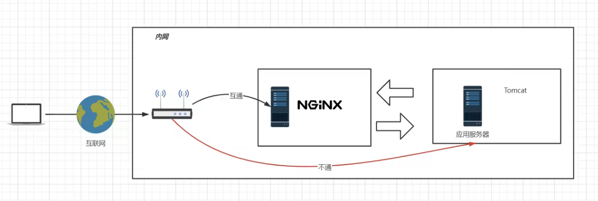

隧道式代理：一进一出一个口

#### 2.4.2正向代理

描述:正向代理意思是一个位于客户端和原始服务器(origin server)之间的服务器，为了从原始服务器取得内容，客户端向代理发送一个请求并指定目标(原始服务器)，然后由代理向原始服务器转交请求并将获得的内容返回给客户端。

简单的说类似于采用VPN来访问google: 


区别正向代理、反向

都是站在客户端的角度，看代理服务器是帮客户端代理（正向代理），还是帮服务端代理（反向代理）

#### 2.4.3隧道模式

lvs（DR模型）

lvs嵌套在内核中

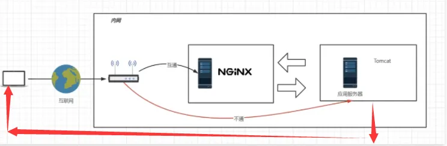

#### 2.4.4反向代理在系统架构中的应用场景

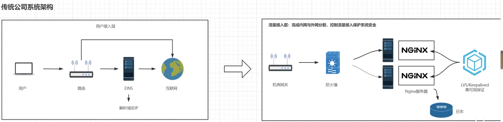


​	

### 2.5负载均衡

描述：负载均衡也是Nginx常用的一个功能。简单而言就是当有2台或以上服务器时，根据规则随机的将请求分发到指定的服务器上处理，负载均衡配置`<span style="color:red">`一般都需要同时配置反向代理，通过反向代理跳转到负载均衡`</span>` 。
而Nginx目前支持自带3种负载均衡策略还有2种常用的第三方策略。

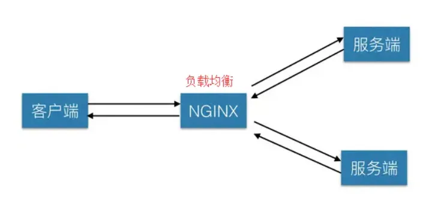

####  2.5.1轮询

默认策略，按顺序将请求依次分发给后端服务器  

#### 2.5.2ip hash

根据客户端 IP 计算哈希值，始终将来自同一 IP 的请求发送到同一台服务器 

#### 2.5.3最少连接

将请求分发给当前活跃连接最少的服务器 

#### 2.5.4其他两种第三方策略

* 一致性哈希  Consistent Hashing （第三方模块）

一致性哈希是一种将请求基于哈希算法映射到后端服务器的策略。它常用于分布式缓存和数据库场景，以确保同一键值（如用户会话或缓存键）总是映射到同一个服务器。 

* Fair 负载均衡 Fair Balancing（第三方模块）

模块根据后端服务器的响应时间来选择服务器，将请求分发给响应最快的服务器。这种策略更适合在服务器性能差异较大时使用，能够动态调节负载，避免慢速服务器处理太多请求


### 2.6配置反向代理

* 配置http反向代理另一台服务器

proxy_pass与root只能二选一，这里注释了root和index

```
http {
    include       mime.types;
    default_type  application/octet-stream;

    sendfile        on;
    keepalive_timeout  65;

    server {
        listen       80;
        server_name  localhost;

        location / {

          proxy_pass http://192.168.8.12:8443;

#            root   /www/www;
#            index  index.html index.htm;
        }

        error_page   500 502 503 504  /50x.html;
        location = /50x.html {
            root   html;
        }
    }
}

```

* 检查配置

```
cd /usr/local/nginx/sbin

./nginx  -t
```

* 重新载入nginx配置

```
systemctl reload nginx
```

### 2.7负载均衡基本配置

#### 2.7.1轮询-最简单负载均衡

* 基本环境

```
192.168.8.50 server1
192.168.8.60 server2
192.168.8.70 server3

serer2和server3分别在80端口配置http服务

[root@kk conf]# cat /www/www/index.html
this is www website. I'm 192.168.8.60

[root@kk nginx]# cat /www/www/index.html
this is www website. I'm 192.168.8.70
```

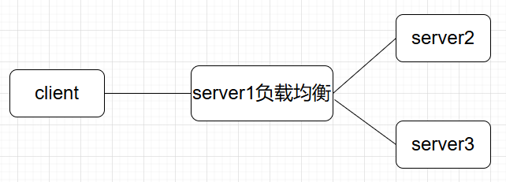

server1配置负载均衡，轮询访问server2和server3

```
http {
    include       mime.types;
    default_type  application/octet-stream;

    sendfile        on;
    keepalive_timeout  65;

    #定义httpserver
    upstream httpserver {
        #需要轮询的主机
        server 192.168.8.60;
        server 192.168.8.70;
    }


    server {
        listen       80;
        server_name  localhost;

        location / {

        #引用httpserver
        proxy_pass http://httpserver;

#            root   /www/www;
#            index  index.html index.htm;
        }

        error_page   500 502 503 504  /50x.html;
        location = /50x.html {
            root   html;
        }
    }
}
```

浏览器访问192.168.8.50，可以看到返回的ip信息在60和70之间循环

#### 2.7.2负载均衡策略

* weight：权重
* down: 当前server暂不参与负载均衡
* backup: 预留的备份服务器； 其它所有的非backup机器down或者忙的时候，请求backup机器。
* max_fails: 请求失败次数限制
* fail_timeout: 经过max_fails后服务暂停时间
* max_conns: 限制最大的连接数 

* 简单实例

```
upstrem weiyigeek {
  server weiyigeek.top:8080 down;
  server weiyigeek.top:8081 backup;
  server weiyigeek.top:8082 max_fails=1 fail_timeout=10s max_conns=1024;
  server weiyigeek.top:8083 weight=1
  server weiyigeek.top:8084 weight=2
  server unix:/tmp/backend3;
}
```

#### 2.7.3负载均衡调度算法

* 轮询:默认算法按时间顺序逐一分配到不同的后端服务器;
  
* 加权轮询:Weight值越大，分配到访问几率越高;

* ip_hash:为每一个请求访问的IP的hash结果分配，可以将来自一个IP的固定访问一个后端服务器;

*  url_hash:需要安装模块安装访问的URL的hash结果来分配，这样每个URL定向到同一个后端服务器

* least_conn:按照某台机器最少连接数的进行分配访问;

* hash关键数值: hash 自定义 KEY 

##### 2.7.3.1轮询

RR（默认轮询）每个请求按时间顺序逐一分配到不同的后端服务器，如果后端服务器down掉能自动剔除。

```
upstream test {
  server weiyigeek.top:8080;
  server weiyigeek.top:8081;
}

server {
  listen  81;
  server_name  weiyigeek.top;
  client_max_body_size 1024M;
  location / {
    proxy_pass http://test;
    proxy_set_header Host $host:$server_port;
  }
}
```

##### 2.7.3.2权重

权重指定轮询几率，weight和访问比率成正比，用于后端服务器性能不均的情况。

```
upstream test {
  server weiyigeek.top:8081 weight=1;
  server weiyigeek.top:8080 weight=9;  #那么10次一般只会有1次会访问到8081，而有9次会访问到8080
}
```

##### 2.7.3.3ip_hash

ip_hash 会话粘连, 上面的2种方式都有一个问题，那就是下一个请求来的时候请求可能分发到另外一个服务器，当我们的程序不是无状态的时候（采用了session保存数据），这时候就有一个很大的很问题了，比如把登录信息保存到了session中，那么跳转到另外一台服务器的时候就需要重新登录了，所以很多时候我们需要一个客户只访问一个服务器，那么就需要用iphash了，iphash的每个请求按访问ip的hash结果分配，这样每个访客固定访问一个后端服务器，可以解决session的问题。 

```
# 会话粘粘可以理解为用户持续访问一个后端机器
upstream test {
  ip_hash;
  server weiyigeek.top:8080;
  server weiyigeek.top:8081;
}
```

##### 2.7.3.4fair

fair（第三方）按后端服务器 的响应时间来分配请求，响应时间短的优先分配。

```
upstream backend {
  fair;
  server weiyigeek.top:8080;
  server weiyigeek.top:8081;
}
```

##### 2.7.3.5url_hash

```
upstream backend {
  hash $request_uri;
  hash_method crc32;
  server weiyigeek.top:8080;
  server weiyigeek.top:8081;
}
```

以上6种负载均衡各自适用不同情况下使用，所以可以根据实际情况选择使用哪种策略模式,不过fair和url_hash需要安装第三方模块才能使用. 

### 2.8动静分离

动静分离是让动态网站里的动态网页根据一定规则把不变的资源和经常变的资源区分开来，动静资源做好了拆分以后，我们就可以根据静态资源的特点将其做缓存操作，这就是网站静态化处理的核心思路; 

```
    server {
        listen       80;
        server_name  localhost;

        #charset koi8-r;

        #access_log  logs/host.access.log  main;


        location / {

        proxy_pass http://192.168.8.80;  #需要代理的服务器

        }

        location /assets {
        root /usr/local/nginx/publii;    #静态资源在nginx目录
        index index.html index.htm;

        }


        location /media {
        root /usr/local/nginx/publii;   #静态资源在nginx目录
        index index.html index.htm;

        }
```

#### 2.8.1location匹配顺序

- 多个正则location直接按书写顺序匹配，成功后就不会继续往后面匹配 

- 普通（非正则）location会一直往下，直到找到匹配度最高的（最大前缀匹配） 

- 当普通location与正则location同时存在，如果正则匹配成功,则不会再执行普通匹配 

- 所有类型location存在时，“=”匹配 > “^~”匹配 > 正则匹配 > 普通（最大前缀匹配） 

```
    server {
        listen       80;
        server_name  localhost;

        #charset koi8-r;

        #access_log  logs/host.access.log  main;


        location / {

        proxy_pass http://192.168.8.80;

        }

        location ~*/(assets|media) {   #正则表达式匹配多个目录
        root /usr/local/nginx/publii;
        index index.html index.htm;

        }
```

### 2.9URLRewrite

#### 2.9.1url重定向的作用

1.优化搜索引擎抓：

通过URL重写，可以优化网站在搜索引擎中的表现，使得网页更容易被搜索引擎收录。这是因为搜索引擎通常更倾向于收录静态页面，而URL重写可以帮助将动态页面转换为静态页面的形式，从而提高网站在搜索引擎结果中的排名。

2.提高安全：

通过URL重写，可以隐藏站点的真实URL地址，减少在URL中暴露过多的参数，从而减少信息泄露的风险。静态化的URL地址比动态地址更难以被黑客利用，因此可以提高网站的安全性。

3.实现跳转和流量变：

URL重写可以帮助网站实现页面跳转，这对于网站升级、内容迁移等情况非常有用。此外，通过重定向到其他页面或网站，可以实现流量的有效利用和变现。

4.美化URL结：

通过URL重写，可以将复杂的URL简化，使URL资源更加简洁，提高用户体验。同时，这也有助于隐藏站点的真实URL地址，使得URL资源更加简介。

5.限制访：

利用URL重写规则，可以限制特定IP访问网站，这对于防止某些IP的大量访问造成的资源消耗非常有效，比如封锁某些搜索引擎的固定抓取或者大量的采集站点。


#### 2.9.2rewrite语法格式及参数语法 

```
rewrite是实现URL重写的关键指令，根据regex (正则表达式)部分内容，
重定向到replacement，结尾是flag标记。 

rewrite 	<regex> 	<replacement> 	[flag];
关键字 		正则 				替代内容 			flag标记


关键字：其中关键字error_log不能改变

正则：perl兼容正则表达式语句进行规则匹配 
替代内容：将正则匹配的内容替换成replacement 
flag标记：rewrite支持的flag标记 

rewrite参数的标签段位置： server,location,if 

flag标记说明： l
ast			#本条规则匹配完成后，继续向下匹配新的location URI规则 
break 		#本条规则匹配完成即终止，不再匹配后面的任何规则 
redirect 		#返回302临时重定向，浏览器地址会显示跳转后的URL地址   (防爬虫)
permanent 	#返回301永久重定向，浏览器地址栏会显示跳转后的URL地址  

例子
rewrite ^/([0-9]+).html$ /index.jsp?pageNum=$1 break;  
```

### 2.10负载均衡+URLRewrite

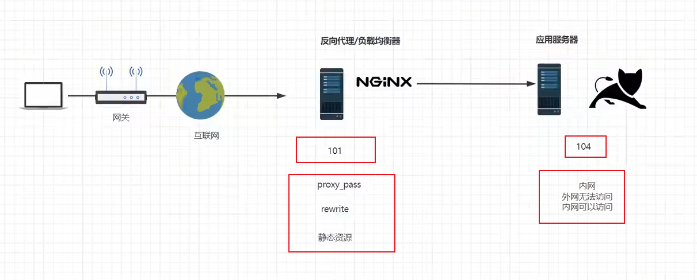

这里面是101通过负载均衡代理配置，rewrite 404:8080（tomcat），（此时nginx：网关服务器）

#### 2.10.1在104打开防火墙

```
systemctl start firewalld
```

#### 2.10.2指定允许访问的ip和端口

这条命令的作用是在防火墙中永久添加一条规则，允许来自 IP 地址为 192.168.8.50 的主机通过 TCP 协议的 80 端口进行连接 

```
firewall-cmd --permanent --add-rich-rule="rule family="ipv4" source address="192.168.8.50" port protocol="tcp" port="80" accept"
```

#### 2.10.3重启防火墙

```
systemctl restart firewalld

#或者重新加载规则
firewall-cmd --reload
```

完成以上步骤后，发现无法访问192.168.8.80:80端口，但是可以通过101(这里的localhost)访问104:80

且URLrewrite把动态资源的地址隐藏起来了。

#### 2.10.4查看已配置规则  

```
firewall-cmd --list-all
```

#### 2.10.5在101配置nginx

```
   upstream httpds {
   server 192.168.8.60 weight=8 down;
   server 192.168.8.80:80 weight=1 backup;

   }

    server {
        listen       80;
        server_name  localhost;

        #charset koi8-r;

        #access_log  logs/host.access.log  main;


        location / {

        proxy_pass http://httpds;

        }
```

- 1.upstream httpds

这是一个负载均衡池的配置，名为 `httpds`，用于定义多个后端服务器。

```nginx
   upstream httpds {
       server 192.168.8.60 weight=8 down;
       server 192.168.8.80:80 weight=1 backup;
   }
```

`192.168.8.60` 是一个后端服务器的 IP 地址。

`weight=8` 指定该服务器的权重（越大代表请求越多地分配到此服务器）。
`down` 表示这个服务器被标记为不参与负载均衡，暂时不可用。尽管设置了权重，它不会接收请求，除非手动移除 `down` 标记。

`192.168.8.80:80` 是另一个后端服务器的 IP 地址和端口号。
`weight=1` 指定该服务器的权重，较低，意味着它分配到的请求较少。
`backup` 表示该服务器是备用服务器，只有当主服务器（`192.168.8.60`）都不可用时，才会转发请求到此服务器。

- 2.server

配置了 Nginx 的 HTTP 服务，用于监听和代理请求。

```nginx
   server {
       listen       80;
       server_name  localhost;
```

listen 80;
指定 Nginx 监听端口为 `80`，这是默认的 HTTP 端口。

server_name localhost;
定义服务器名称为 `localhost`，表示该配置仅适用于访问 `localhost` 的请求。

- 3.location /

定义如何处理根路径 `/` 下的请求。

```nginx
   location / {
       proxy_pass http://httpds;
   }
```

location /
匹配所有 URL 路径（根路径开始的请求）。

proxy_pass http://httpds;
将请求代理到名为 `httpds` 的上游服务器池。Nginx 会根据负载均衡策略转发请求到可用的服务器。
在此例中，Nginx 会优先尝试访问 `192.168.8.60`，但由于它被标记为 `down`，因此实际会将请求发送到 `192.168.8.80` 这个备用服务器。

- 总结：

该配置定义了一个负载均衡的代理服务，Nginx 通过监听 `localhost` 上的 HTTP 请求，将请求转发到上游的后端服务器池 `httpds`。
其中，`192.168.8.60` 被标记为不可用 (`down`)，因此实际请求会转发到备用的`192.168.8.80`。
该配置适用于简单的负载均衡和代理场景，使用 `backup` 服务器保证当主服务器不可用时仍能处理请求。

### 2.11防盗链

http协议中的 referrer

nginx防盗链配置

使用浏览器或curl检测

返回错误码

返回错误页面

整合rewrite返回报错图片 

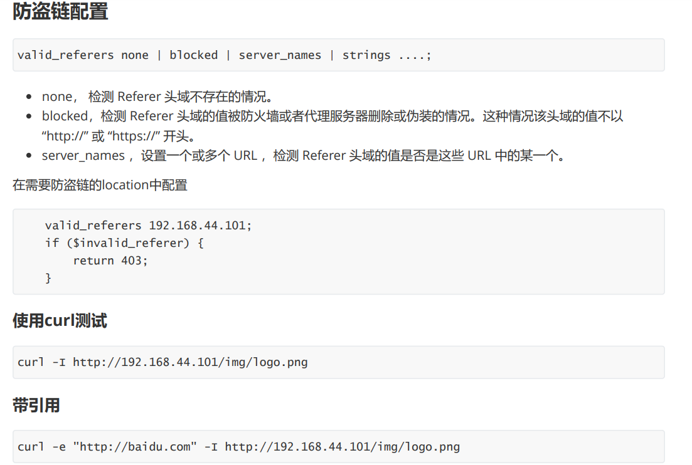

### 2.12高可用Keepalived

- 故障转移（Failover）：

在主备模式下，Keepalived 可以监控多台服务器的状态。通常会有一个主服务器（Master）和一个或多个备用服务器（Backup）。

当主服务器出现故障时，Keepalived 能迅速检测到故障，并自动将服务切换到备用服务器上，从而保证服务的连续性，减少服务中断时间。
- 虚拟 IP（Virtual IP）管理：

Keepalived 可以为服务绑定一个虚拟 IP 地址。客户端通过这个虚拟 IP 来访问服务，而不是直接绑定到具体的物理服务器 IP 上。

在故障转移时，虚拟 IP 会从故障的主服务器上解绑，并绑定到新的主服务器（原来的备用服务器）上，这样客户端无需知道服务器的具体变化，仍能通过虚拟 IP 继续访问服务。

* 安装keepalived

```
yum install keepalived  -y
```

- 最小化配置/etc/keepalived/keepalived.conf

server1

```
! Configuration File for keepalived

global_defs {
   router_id lb50	#服务器命名一个id
}

vrrp_instance kk {
    state MASTER
    interface eth0	#绑定网卡
    virtual_router_id 51
    priority 100	#优先级，数值越大有优先级越高
    advert_int 1
    authentication {	#配对认证
        auth_type PASS
        auth_pass 1111
    }
    virtual_ipaddress {
        192.168.8.90	#虚拟机ip地址
    }
}
```

server2

```
! Configuration File for keepalived

global_defs {
   router_id lb51
}

vrrp_instance kk {
    state MASTER
    interface eth0
    virtual_router_id 51
    priority 50
    advert_int 1
    authentication {
        auth_type PASS
        auth_pass 1111
    }
    virtual_ipaddress {
        192.168.8.90
    }
}
```

* 重启生效

```
systemctl restart keepalived
```

* 测试，关闭server1时，192.168.8.90的ip会自动迁移到server2，保证业务不中断

```
C:\Users\kk>ping 192.168.8.90 -t

正在 Ping 192.168.8.90 具有 32 字节的数据:
来自 192.168.8.90 的回复: 字节=32 时间=1ms TTL=64
来自 192.168.8.90 的回复: 字节=32 时间<1ms TTL=64
来自 192.168.8.90 的回复: 字节=32 时间<1ms TTL=64
来自 192.168.8.90 的回复: 字节=32 时间<1ms TTL=64
来自 192.168.8.90 的回复: 字节=32 时间<1ms TTL=64
来自 192.168.8.90 的回复: 字节=32 时间<1ms TTL=64
来自 192.168.8.90 的回复: 字节=32 时间<1ms TTL=64
来自 192.168.8.90 的回复: 字节=32 时间<1ms TTL=64
来自 192.168.8.90 的回复: 字节=32 时间<1ms TTL=64
来自 192.168.8.90 的回复: 字节=32 时间<1ms TTL=64
来自 192.168.8.90 的回复: 字节=32 时间<1ms TTL=64
来自 192.168.8.90 的回复: 字节=32 时间<1ms TTL=64
来自 192.168.8.90 的回复: 字节=32 时间=1ms TTL=64
来自 192.168.8.90 的回复: 字节=32 时间=1ms TTL=64
来自 192.168.8.90 的回复: 字节=32 时间<1ms TTL=64
来自 192.168.8.90 的回复: 字节=32 时间<1ms TTL=64
来自 192.168.8.90 的回复: 字节=32 时间<1ms TTL=64
来自 192.168.8.90 的回复: 字节=32 时间<1ms TTL=64
来自 192.168.8.90 的回复: 字节=32 时间<1ms TTL=64
来自 192.168.8.90 的回复: 字节=32 时间<1ms TTL=64
来自 192.168.8.90 的回复: 字节=32 时间=1ms TTL=64
来自 192.168.8.90 的回复: 字节=32 时间<1ms TTL=64
来自 192.168.8.90 的回复: 字节=32 时间<1ms TTL=64
请求超时。
来自 192.168.8.90 的回复: 字节=32 时间<1ms TTL=64
来自 192.168.8.90 的回复: 字节=32 时间<1ms TTL=64
来自 192.168.8.90 的回复: 字节=32 时间<1ms TTL=64
来自 192.168.8.90 的回复: 字节=32 时间=1ms TTL=64
```

### 2.13https

#### 2.13.1不安全的http协议

[[HTTP的不安全以及安全的HTTPS原理及流程](https://blog.csdn.net/XinTeng2012/article/details/106917571)

#### 2.13.2对称加密算法

#### 2.13.3非对称加密算法

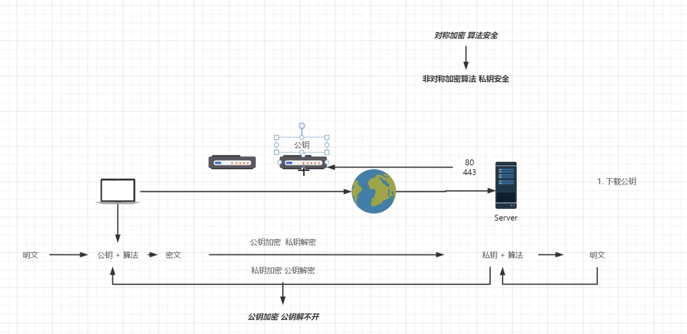

#### 2.13.4ca机构参与保证互联网安全

[什么是证书颁发机构（CA）](https://blog.csdn.net/weixin_33964094/article/details/85100922?ops_request_misc=%7B%22request%5Fid%22%3A%22165052460216782246417186%22%2C%22scm%22%3A%2220140713.130102334..%22%7D&request_id=165052460216782246417186&biz_id=0&utm_medium=distribute.pc_search_result.none-task-blog-2~all~sobaiduend~default-2-85100922.142^v9^control,157^v4^control&utm_term=ca机构&spm=1018.2226.3001.4187)

[CA证书简单介绍](https://blog.csdn.net/Munch_D_Rudy/article/details/114337721?ops_request_misc=%7B%22request%5Fid%22%3A%22165052451316780261916415%22%2C%22scm%22%3A%2220140713.130102334..%22%7D&request_id=165052451316780261916415&biz_id=0&utm_medium=distribute.pc_search_result.none-task-blog-2~all~sobaiduend~default-2-114337721.142^v9^control,157^v4^control&utm_term=ca&spm=1018.2226.3001.4187)

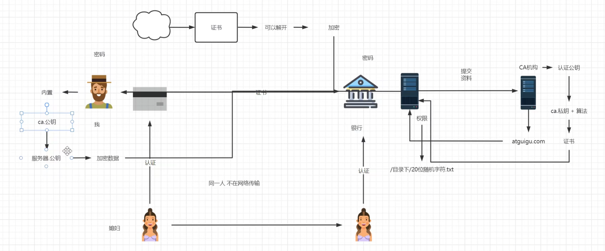

#### 2.13.5证书安装

centos7nginx测试找不到ssl模块，故换成debian12环境

- 安装到nginx

nginx包和nginx-full包如何选择？

nginx包：

nginx的标准安装包，包含了常用的核心功能，适用于大多数基本的web服务器需求。

该包的功能相对较少，适用于简单的nginx使用场景，不包含某些高级或可选的模块。

nginx-full包：

nginx-full是一个更完整的nginx安装包，它包含了比nginx更多的功能和模块。

相比nginx，nginx-full 包含了一些额外的模块和扩展，支持更高级的功能，例如：Gzip压缩模块，SSL/TLS模块，Rewrite模块，Proxy模块，FastCGI模块，以及其他可选nginx模块。

本教程需要使用stream模块和ssl模块，所以需要安装nginx-full

- 安装nginx-full


```
 apt install -y nginx-full 
```

- 安装openssl

```
apt install -y openssl
```

- 在nginx配置目录创建ssl目录

```
cd /etc/nginx/

mkdir ssl
```

* 为nginx生成ssl证书

```
openssl req -x509 -nodes -days 365 -newkey rsa:2048 -keyout /etc/nginx/ssl/nginx.key -out /etc/nginx/ssl/nginx.crt
```

* 配置nginx，SSL 证书文件路径（更换为你自己的证书和私钥文件路径）

```
root@debian:/etc/nginx# cat nginx.conf
# 用户和组
user www-data;

# Nginx 进程数
worker_processes auto;

# 进程 ID 文件的位置
pid /run/nginx.pid;

# 包含模块的配置文件
include /etc/nginx/modules-enabled/*.conf;

# 事件模块配置
events {
    # 每个 worker 进程的最大连接数
    worker_connections 768;
    # multi_accept on; # 是否同时接收多个新连接
}

# HTTP 核心模块配置
http {

    ##
    # 基本设置
    ##

    # 使用 sendfile 来提升文件传输效率
    sendfile on;

    # 启用 TCP_NOPUSH 以优化 TCP 数据包的发送
    tcp_nopush on;

    # 设置 types 哈希表的最大尺寸
    types_hash_max_size 2048;

    # server_tokens off; # 隐藏 Nginx 版本号以提升安全性

    # server_names_hash_bucket_size 64; # 调整 server_names 哈希表桶大小
    # server_name_in_redirect off; # 禁用在重定向中使用服务器名

    # 包含 MIME 类型定义
    include /etc/nginx/mime.types;

    # 默认 MIME 类型
    default_type application/octet-stream;

    ##
    # SSL 设置
    ##
   # listen ssl on;
    # 支持的 SSL/TLS 协议
    #ssl_protocols TLSv1 TLSv1.1 TLSv1.2 TLSv1.3; # 禁用 SSLv3，参考 POODLE 漏洞

    # 优先使用服务器端的密码套件
    ssl_prefer_server_ciphers on;

    # SSL 证书文件路径（更换为你自己的证书和私钥文件路径）
    ssl_certificate /etc/nginx/ssl/nginx.crt;
    ssl_certificate_key /etc/nginx/ssl/nginx.key;

    # SSL 配置
    ssl_protocols TLSv1.2 TLSv1.3;
    ssl_ciphers HIGH:!aNULL:!MD5;

   ##
    # 日志设置
    ##

    # 访问日志的位置
    access_log /var/log/nginx/access.log;

    # 错误日志的位置
    error_log /var/log/nginx/error.log;

    ##
    # Gzip 设置
    ##

    # 启用 Gzip 压缩
    gzip on;

    # gzip_vary on; # 启用响应头 `Vary: Accept-Encoding`
    # gzip_proxied any; # 启用对任何请求的压缩
    # gzip_comp_level 6; # Gzip 压缩级别
    # gzip_buffers 16 8k; # Gzip 缓冲区
    # gzip_http_version 1.1; # Gzip 最低 HTTP 版本要求
    # gzip_types text/plain text/css application/json application/javascript text/xml application/xml application/xml+rss text/javascript; # 需要压缩的 MIME 类型

    ##
    # 虚拟主机配置
    ##

    # 包含其他配置文件
    include /etc/nginx/conf.d/*.conf;
    include /etc/nginx/sites-enabled/*;
}

# 邮件代理模块配置示例（默认注释掉）
# mail {
#     # 参考样例验证脚本：http://wiki.nginx.org/ImapAuthenticateWithApachePhpScript
#
#     # 验证脚本的地址
#     # auth_http localhost/auth.php;
#
#     # POP3 协议的功能支持
#     # pop3_capabilities "TOP" "USER";
#
#     # IMAP 协议的功能支持
#     # imap_capabilities "IMAP4rev1" "UIDPLUS";
#
#     server {
#         listen     localhost:110;
#         protocol   pop3;
#         proxy      on;
#     }
#
#     server {
#         listen     localhost:143;
#         protocol   imap;
#         proxy      on;
#     }
# }
```

* 配置网站信息

```
root@debian:/etc/nginx# cat /etc/nginx/sites-available/default
server {
    # 监听端口，通常是80（HTTP）或443（HTTPS）。这里指定服务器监听80端口，用于处理HTTP请求。
    listen 443 ssl;

    # 定义服务器的域名。当请求的域名与此匹配时，将使用这个服务器块处理请求。
    server_name kk.com;

    # 指定网站的根目录，所有相对路径的文件请求都将从这个目录开始查找。
    root /publii/;

    # 定义默认的首页文件名。当用户请求根目录时，如果该文件存在，将返回该文件。
    index index.html;

    location / {# 尝试按照顺序查找文件：首先是请求的URI，如果不存在，则尝试添加斜杠查找目录，如果仍不存在，则返回404错误。
        try_files $uri $uri/ =404;
    }
}
```

* 删除默认网站配置信息

```
rm /etc/nginx/sites-available/default
```

* 创建网站的新引用

```
ln -s /etc/nginx/sites-available/default  /etc/nginx/sites-enabled/
```

* 检查nginx配置

```
nginx -t
```

* 重启nginx服务

```
systemctl restart nginx
```

配置完成，浏览器访问网站，查看自建ssl证书信息

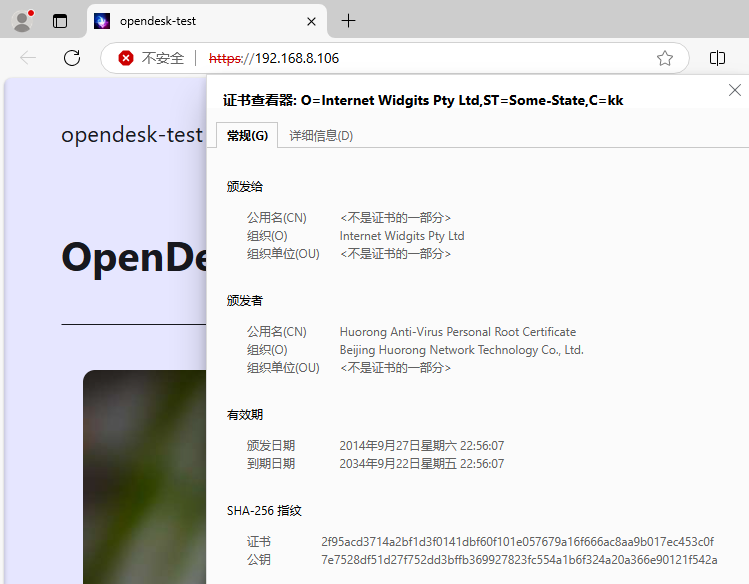

## 三、nginx高级篇

待更新
