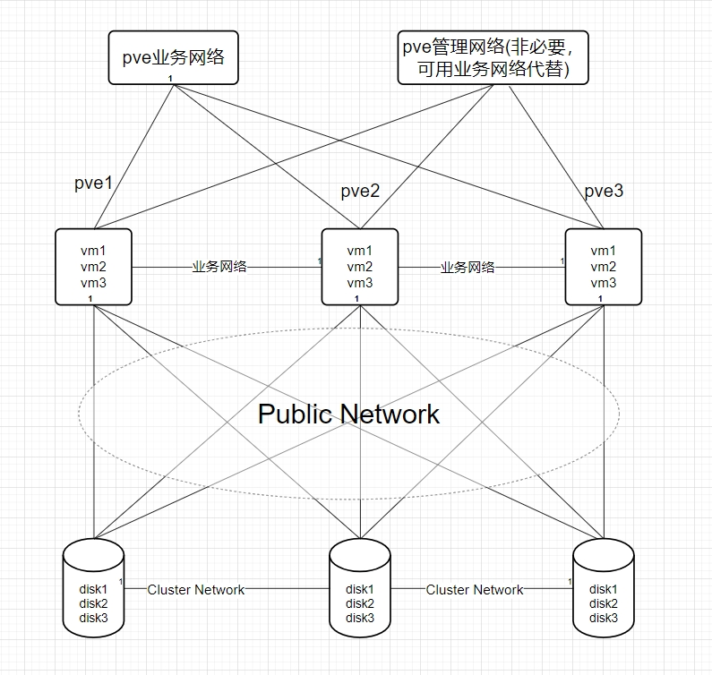

### 部署要求

* 部署最低要求

```bash
3台服务器
万兆网络
12块OSD硬盘（系统盘单独算）
```

* ceph存储

```bash
每台Server有5块盘，共15块，其中3块为pve系统盘，剩余12块为ceph的osd盘
其中ceph推荐使用ssd，如果有上百个机械也可不用ssd，ceph的速度和osd数量成正比

ceph的Cluster Network流量较大，为不影响业务，推荐单独接一个交换机

ceph的硬盘模式推荐为直通模式，raid会影响其crush算法的存储效率
```

* 网络规划

| 服务器   | pve管理网络   | pve业务网络   | Public Network | Cluster Network |
| -------- | ------------- | ------------- | -------------- | --------------- |
| server-1 | 192.168.1.110 | 192.168.1.110 | 10.0.0.10      | 172.16.1.10     |
| server-1 | 192.168.1.120 | 192.168.1.120 | 10.0.0.20      | 172.16.1.20     |
| server-1 | 192.168.1.130 | 192.168.1.130 | 10.0.0.30      | 172.16.1.30     |

* 网络架构图



### 安装步骤
！！！注意：每台服务器都要配置，具体看安装步骤

* 修改主机名（每台主机名不能重复）

```bash
hostnamectl set-hostname pve-ceph01
```

* 设置/etc/hosts主机名

```bash
#nano /etc/hosts
192.168.1.151 pve-ceph01.localhost pve-ceph01
```

* pve7或pve8换中科大源

```bash
#!/bin/bash

# Backup original sources.list
if [ -e /etc/apt/sources.list ];
then cp /etc/apt/sources.list /etc/apt/sources.list.bak
fi

# Backup pve-no-subscription.list
if [ -e /etc/apt/sources.list.d/pve-no-subscription.list ];
then cp /etc/apt/sources.list.d/pve-no-subscription.list /etc/apt/sources.list.d/pve-no-subscription.list.bak
fi

# Backup pve-enterprise.list
if [ -e /etc/apt/sources.list.d/pve-enterprise.list ];
then cp /etc/apt/sources.list.d/pve-enterprise.list /etc/apt/sources.list.d/pve-enterprise.list.bak
fi

# Backup ceph.list
if [ -e /etc/apt/sources.list.d/ceph.list ];
then cp /etc/apt/sources.list.d/ceph.list /etc/apt/sources.list.d/ceph.list.bak
fi

# Backup pveceph.pm
if [ -e /usr/share/perl5/PVE/CLI/pveceph.pm ];
then cp /usr/share/perl5/PVE/CLI/pveceph.pm /usr/share/perl5/PVE/CLI/pveceph.pm.bak
fi


# Determine Proxmox VE version
pve_version=$(pveversion|awk -F '/' '{print $2}'|cut -c1)


#prohibit pve-enterprise
sed -i '1s/^/# /'  /etc/apt/sources.list.d/pve-enterprise.list

# Update sources.list with ustc mirror based on the detected Proxmox VE version
if [[ $pve_version == "7" ]]; then
echo "
deb https://mirrors.ustc.edu.cn/debian bullseye main contrib
deb https://mirrors.ustc.edu.cn/debian bullseye-updates main contrib
# security updates
deb https://mirrors.ustc.edu.cn/debian-security bullseye-security main contrib
" > /etc/apt/sources.list

echo "
deb https://mirrors.ustc.edu.cn/proxmox/debian/pve bullseye pve-no-subscription
" >  /etc/apt/sources.list.d/pve-no-subscription.list

echo "
deb http://mirrors.ustc.edu.cn/proxmox/debian/ceph-quincy bullseye main
" > /etc/apt/sources.list.d/ceph.list

# 换中科大源，一定要修改这里，不然每次面板安装ceph时他会根据这里的配置生成 ceph.list 源文件
sed -i  "s#http://download.proxmox.com/debian#https://mirrors.ustc.edu.cn/proxmox/debian#g" /usr/share/perl5/PVE/CLI/pveceph.pm


elif [[ $pve_version == "8" ]]; then

echo "
deb https://mirrors.ustc.edu.cn/debian bookworm main contrib
deb https://mirrors.ustc.edu.cn/debian bookworm-updates main contrib
# security updates
deb https://mirrors.ustc.edu.cn/debian-security bookworm-security main contrib
" > /etc/apt/sources.list

echo "
deb https://mirrors.ustc.edu.cn/proxmox/debian/pve bookworm pve-no-subscription
" >  /etc/apt/sources.list.d/pve-no-subscription.list

echo "
deb https://mirrors.ustc.edu.cn/proxmox/debian/ceph-quincy/ bookworm no-subscription
" > /etc/apt/sources.list.d/ceph.list

# 换中科大源，一定要修改这里，不然每次面板安装ceph时他会根据这里的配置生成 ceph.list 源文件
sed -i 's|http://download.proxmox.com|https://mirrors.ustc.edu.cn/proxmox|g' /usr/share/perl5/PVE/CLI/pveceph.pm

else
    echo "Unsupported Proxmox VE version."
    exit 1
fi

# Update package index
apt update

echo "APT sources have been updated with ustc mirror for Proxmox VE $pve_version."
```

* 更新索引和时间同步

```bash
#安装ntp服务
apt install ntpdate -y

#与阿里云时间服务器时间同步，内网也可指定时间同步服务器（具体操作百度）
echo "0 0 * * 6     ntpdate ntp1.aliyun.com" >> /var/spool/cron/crontabs/root
```

* 配置ceph网络

```bash
#编辑/etc/network/interfaces，增加cluster network和public network
#此处网卡为ens19和ens20，实际部署看情况，也可在web界面配置ip

auto lo
iface lo inet loopback

iface ens18 inet manual

auto ens19
iface ens19 inet static
        address 10.0.0.10/24

auto ens20
iface ens20 inet static
        address 172.16.1.10/24

auto vmbr0
iface vmbr0 inet static
        address 192.168.1.110/24
        gateway 192.168.1.1
        bridge-ports ens18
        bridge-stp off
        bridge-fd 0

#重启networking让配置生效
systemctl restart networking

#检测配置的ip是否生效
hostname -I
```
* 核实服务器之间的带宽，确保网络质量满足部署ceph的要求

```bash
#安装iperf
apt install iperf

#测试server-1和server-2之间的带宽

#server-1作为服务端
iperf -s

#server作为客户端,10.0.0.10和172.16.1.10为sever-1的public network 与cluster network
iperf -c 10.0.0.10

iperf -c 172.16.1.10
```


* 创建集群（此步骤只在一台服务器操作）

```bash
#创建一个名为pve的集群
pvecm create  pve

#检测集群状态
pvecm status
```

* 其他服务器加入集群

```bash
#这个ip为pve的管理ip/业务ip
pvecm add 192.168.1.110

#检测集群状态
pvecm status
```

* 安装ceph

```bash
#pve7安装ceph的quincy版本
pveceph install --version quincy --allow-experimental 0

#pve8安装ceph的reef版本
pveceph install --version reef --repository no-subscription --allow-experimental 0
```

* ceph网络初始化（此步骤只在一台服务器操作）

```bash
pveceph init --network 10.0.0.10/24 --cluster-network 172.16.1.10/24
```

* 增加ceph 监视器和管理器(提高集群高可用)

```bash
#创建监视器
pveceph mon create

#创建管理器
pveceph mgr create
```

* 创建osd盘

```bash
#检测可以用来创建OSD的磁盘
lsblk

#创建OSD盘，此处为sdb，具体部署看实际情况
pveceph osd create /dev/sdb


#如果磁盘以前正在使用（例如，用于 ZFS 或作为 OSD），则首先需要清除该使用的所有痕迹。要删除分区表、引导扇区和任何其他剩余的 OSD，可以使用以下命令
ceph-volume lvm zap /dev/sd[X] --destroy
```

* 创建存储池（此步骤只在一台服务器操作）

```bash
pveceph pool create deskpool --add_storages
```


### 排错常用命令

```bash
#！！！以下内容ceph供排错使用
#查看ceph集群状态
seph -s

#查看管理节点
ceph mon stat

#查看监视节点
ceph mgr stat

#查看osdh状态和osd目录树
ceph osd stat
ceph osd tree

#查看ceph的io
ceph iostat

#下线osd
ceph osd down 0 
#让编号为0的osd down掉，此时该osd不接受读写请求，但仍然活着

#拉起osd
ceph osd up 0
#让编号为0的osd up，此时该osd接受读写请求

#将osd逐出集群
ceph osd out 0
#将一个编号为0的osd逐出集群，此时可以做维护

#将osd加入集群
ceph osd in 0
#将一个编号为0的osd加入集群

#删除osd
ceph osd rm 0
#在集群中删除一个 osd,可能需要先 stop 该 osd,即 stop osd.0

#删除host节点：ceph osd crush rm node1
#在集群中删除一个host节点

#创建pool池：ceph osd pool create vms(名称) 64(64是PG)

#CEPH服务常用命令
#重启mon服务
systemctl restart ceph-mon.target

#重启osd服务
sysetmctl restart ceph-osd.target

#重启mgr服务
systemctl restart ceph-mgr.target


#删除pve节点
在正常节点上踢出故障节点
{
#查看集群成员 + 查看集群状态
pvecm nodes
pvecm status

#在pve集群中删除故障节点
pvecm delnode $hostname

#删除 故障节点的 ceph节点中故障的 mon信息（前提是有的话）
ceph mon remove $hostname
#删除故障节点上osd相关信息
ceph osd crush remove osd.$id
ceph auth del osd.$id
ceph osd rm osd.$id
}

在故障节点上，清除集群信息，单机运行

{
#首先在待隔离节点上停止 pve-cluster 服务
systemctl stop pve-cluster.service
systemctl stop corosync.service
#将待隔离节点的集群文件系统设置为本地模式
pmxcfs -l

#接下来删除 corosync 配置文件
rm /etc/pve/corosync.conf
rm -rf /etc/corosync/*
#最后重新启动集群文件系统服务
killall pmxcfs        #停止集群文件系统服务
systemctl start pve-cluster.service
}


#pg重建
ceph osd force-create-pg 1.0 --yes-i-really-mean-it

#命令创建osd盘
##此处的sdb具体看你添加的磁盘，可以lsblk查看
pveceph osd create /dev/sdb


#彻底卸载ceph
systemctl stop ceph-mon.target
systemctl stop ceph-mgr.target
systemctl stop ceph-mds.target
systemctl stop ceph-osd.target
rm -rf /etc/systemd/system/ceph*
killall -9 ceph-mon ceph-mgr ceph-mds
rm -rf /var/lib/ceph/mon/  /var/lib/ceph/mgr/  /var/lib/ceph/mds/
pveceph purge
apt purge ceph-mon ceph-osd ceph-mgr ceph-mds
apt purge ceph-base ceph-mgr-modules-core
rm -rf /etc/ceph/*
rm -rf /etc/pve/ceph.conf
rm -rf /etc/pve/priv/ceph.*
```

### ceph案例1

```bash
#检查集群状态
ceph -s

#用户意外拔出磁盘，重新插入磁盘后，集群出现如下警告信息
1 daemons have recently crashed

#排查最新的crash信息
[root@node1 ~]# ceph crash ls-new
ID                                                               ENTITY    NEW
2022-07-05T01:21:14.829333Z_94747800-d04b-423d-98a8-d9c815e01cde  osd.0  *

#如果确认该daemons告警已经恢复的话，需要手工屏蔽该告警即可
#批量清除crash
ceph crash archive-all
#根据 crash-id 清除单个crash
ceph crash archive <crash-id>

#针对目前的问题，清除单个crash即可
ceph crash archive archive 2022-07-05T01:21:14.829333Z_94747800-d04b-423d-98a8-d9c815e01cde
```


