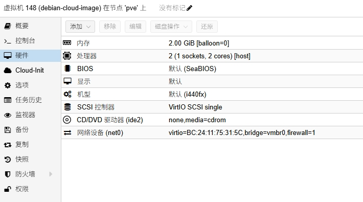
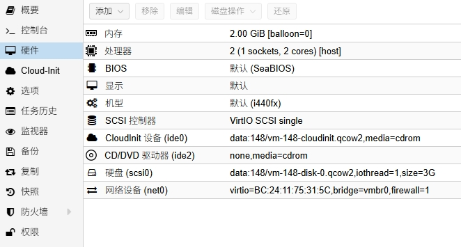
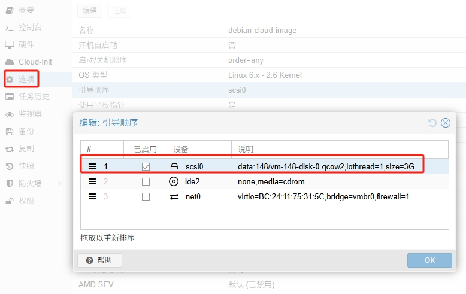
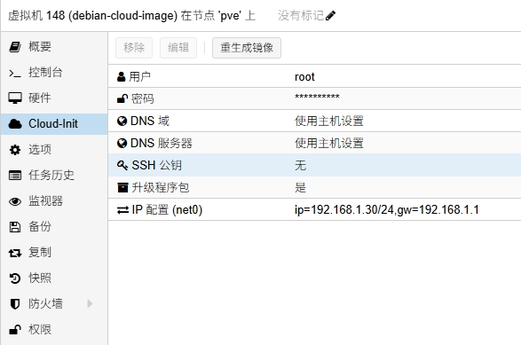

## pve导入cloud-image创建虚拟机

Debian 官方云镜像的目的是：让用户能安全、稳定、快速地在各种云平台上使用原汁原味的 Debian 系统

Debian官方介绍：[https://cloud.debian.org/images/cloud/](https://cloud.debian.org/images/cloud/)

Debian官方下载云镜像：[https://cloud.debian.org/images/cloud/bookworm/](https://cloud.debian.org/images/cloud/bookworm/)

- 获取qcow2云镜像

从中科大镜像站获取最新版本云镜像：[https://mirrors.ustc.edu.cn/debian-cdimage/cloud/bookworm/](https://mirrors.ustc.edu.cn/debian-cdimage/cloud/bookworm/)

- 上传云镜像到pve的根目录

```bash
root@pve:~# ls -lh
total 331M
-rw-r--r-- 1 root root 331M Aug  9 00:15 debian-12-genericcloud-amd64-20250804-2194.qcow2
```

- 创建虚拟机

注意不要添加磁盘



- 导入qcow2云镜像

注意：我这里data（原来是local-lvm），148是上面创建虚拟机的id

```bash
qm importdisk 148 /root/debian-12-genericcloud-amd64-20250804-2194.qcow2  data --format=qcow2
```

- 调整虚拟机硬件配置

启用上面添加的qcow2磁盘，增加clout-init设备



- 调整虚拟机选项配置

只启用qcow2磁盘引导

注意：要启用选项的QEMU Guest Agent，允许宿主机（Proxmox）与虚拟机之间进行更多的通信和控制操作



- cloud-init配置用户密码和ip

注意：先配置用户密码和ip，用户一定要设置，默认空会无效，最后一定点一下重生成镜像

这里是使用cloud-init配置虚拟机的用户信息和网络信息，在虚拟机开机时会自动执行生效



- 启用ssh

编辑ssh配置文件

```bash
nano /etc/ssh/sshd_config
```

把这两行启用并改为yes

```bash
#允许使用root用户通过SSH登录系统
PermitRootLogin yes

#允许通过密码方式进行 SSH 登录
PasswordAuthentication yes
```

重启ssh

```bash
systemctl restart ssh
```

- 换源

编辑仓库源配置

```bash
nano /etc/apt/sources.list.d/debian.sources
```

内容如下

```bash
Types: deb
URIs: http://mirrors.ustc.edu.cn/debian
Suites: bookworm bookworm-updates
Components: main contrib non-free non-free-firmware
Signed-By: /usr/share/keyrings/debian-archive-keyring.gpg

Types: deb
URIs: http://mirrors.ustc.edu.cn/debian-security
Suites: bookworm-security
Components: main contrib non-free non-free-firmware
Signed-By: /usr/share/keyrings/debian-archive-keyring.gpg
```

更新索引

```bash
apt update
```

- 安装qemu-guest-agent

```bash
apt install qemu-guest-agent -y
```

重启检查pve虚拟机的概要界面ip是否正常显示

- 制作模板

把这个虚拟机转化为模板，方便以后使用

- 磁盘扩容

需完整克隆虚拟机