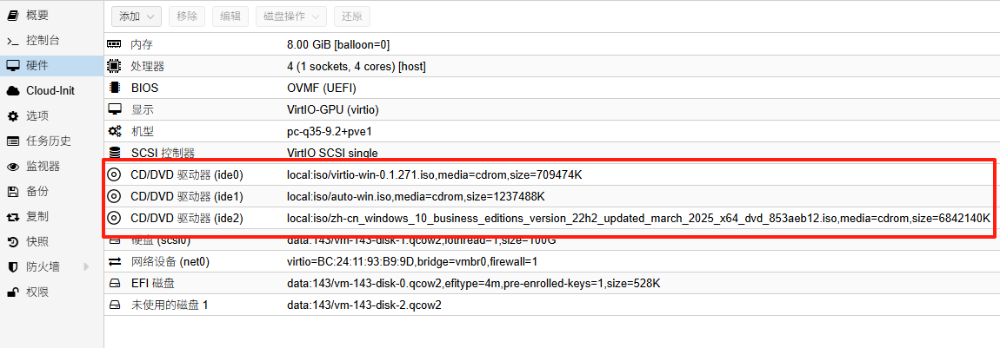
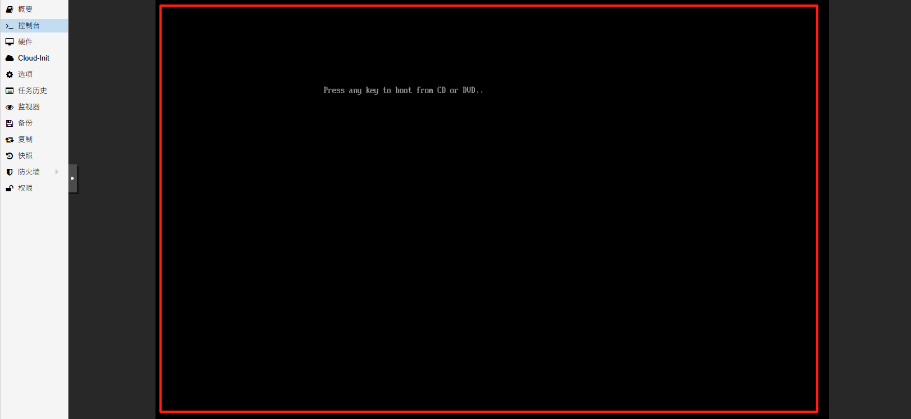
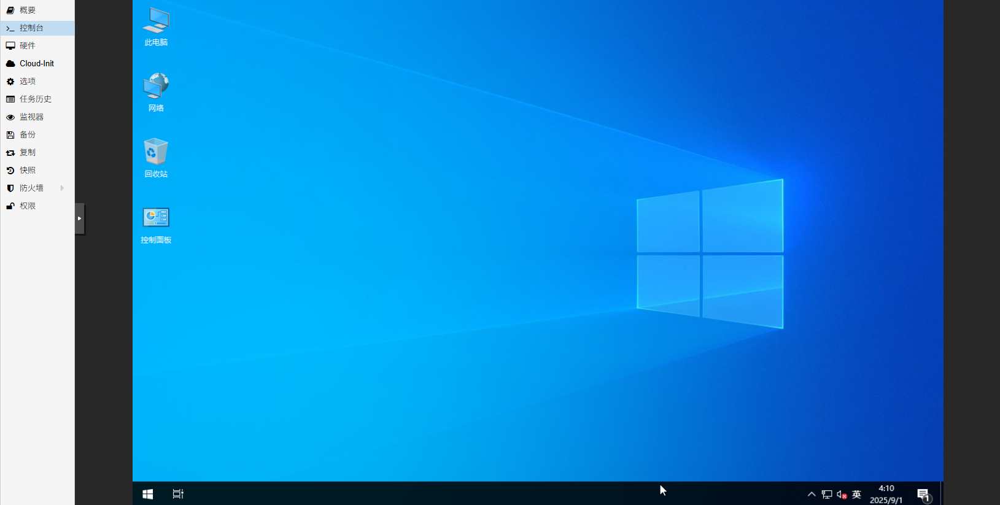

## pve通过应答文件自动安装windows

- Windows 应答文件

无需任何人工干预（如选择区域、输入密钥、创建用户等），系统会自动完成所有安装步骤，直至进入桌面

### 一、环境准备

创建 VM 并配置其 CD/DVD 驱动器，如下所示 



CD/RVD驱动器要添加好3个，分别：
vir-win-*.iso： 最新稳定版本VirtIO 驱动程序镜像，下载连接：[https://fedorapeople.org/groups/virt/virtio-win/direct-downloads/archive-virtio/](https://fedorapeople.org/groups/virt/virtio-win/direct-downloads/archive-virtio/)

auto-win.iso：包含应答文件的镜像，由下文的应答文件封装得到

windows.iso：微软官方windows安装镜像

### 二、一键自动安装

虚拟机开机后，按下任意键开始安装



等待5-10分钟，即可完成安装进入系统桌面



自动安装应答文件启用如下功能：

>默认语言中文简体
>
>启用内置管理员，密码：123456，密码永不过期，10分钟10登陆失败锁定账户，10分钟后自动解锁
>
>启用rdp远程
>
>win11跳过TPM和安全启动
>
>删除恢复分区以支持热扩容磁盘空间
>
>不激活系统
>
>隐藏search搜索栏
>
>禁用win11小部件
>
>禁止创建系统还原点
>
>隐藏 Edge 首次运行体验，禁用 Edge 启动加速和后台模式
>
>自定义视觉效果（在鼠标指针下显示阴影，屏幕字体的平滑边缘，在窗户下显示阴影）
>
>桌面图标（控制面板，此电脑，网络，回收站）
>
>安装virtio guest tools和qemu guest agent
>
>禁止数据发送给Microsoft
>
>删除xbox应用

### 三、制作应答文件镜像

安装genisoimage打包工具，pve自带了这个包，其他环境没有则需要安装

```shell
apt install genisoimage -y
```

新建autounattend.xml应答文件

```shell
nano autounattend.xml
```

#### win10多版本镜像

默认安装专业版

```xml
<?xml version="1.0" encoding="utf-8"?>
<unattend xmlns="urn:schemas-microsoft-com:unattend" xmlns:wcm="http://schemas.microsoft.com/WMIConfig/2002/State">
	<!--https://schneegans.de/windows/unattend-generator/?LanguageMode=Unattended&UILanguage=zh-CN&Locale=zh&Keyboard=00000409&GeoLocation=45&ProcessorArchitecture=amd64&BypassRequirementsCheck=true&ComputerNameMode=Random&CompactOsMode=Default&TimeZoneMode=Explicit&TimeZone=China+Standard+Time&PartitionMode=Unattended&PartitionLayout=GPT&EspSize=300&RecoveryMode=None&DiskAssertionMode=Skip&WindowsEditionMode=Generic&WindowsEdition=pro&InstallFromMode=Automatic&PEMode=Default&UserAccountMode=Unattended&AutoLogonMode=Builtin&BuiltinAdministratorPassword=123456&PasswordExpirationMode=Unlimited&LockoutMode=Default&HideFiles=Hidden&TaskbarSearch=Hide&TaskbarIconsMode=Default&DisableWidgets=true&StartTilesMode=Default&StartPinsMode=Empty&DisableSystemRestore=true&EnableRemoteDesktop=true&HideEdgeFre=true&DisableEdgeStartupBoost=true&EffectsMode=Custom&CursorShadow=true&FontSmoothing=true&DropShadow=true&DesktopIconsMode=Custom&IconControlPanel=true&IconNetwork=true&IconRecycleBin=true&IconThisPC=true&StartFoldersMode=Default&VirtIoGuestTools=true&WifiMode=Skip&ExpressSettings=DisableAll&LockKeysMode=Skip&StickyKeysMode=Default&ColorMode=Default&WallpaperMode=Default&LockScreenMode=Default&RemoveXboxApps=true&WdacMode=Skip-->
	<settings pass="offlineServicing"></settings>
	<settings pass="windowsPE">
        <!-- 区域和语言设置 -->
		<component name="Microsoft-Windows-International-Core-WinPE" processorArchitecture="amd64" publicKeyToken="31bf3856ad364e35" language="neutral" versionScope="nonSxS">
			<UILanguage>zh-CN</UILanguage>
		</component>
        <!-- vitrio驱动程序定制 -->
        <component name="Microsoft-Windows-PnpCustomizationsWinPE" processorArchitecture="amd64" publicKeyToken="31bf3856ad364e35" language="neutral" versionScope="nonSxS">
			<DriverPaths>
			<PathAndCredentials wcm:action="add" wcm:keyValue="1">
                <!-- 添加 VirtIO SCSI 驱动程序路径 -->
				<Path>D:\vioscsi\w10\amd64</Path>
			</PathAndCredentials>
			</DriverPaths>
		</component>
		<component name="Microsoft-Windows-Setup" processorArchitecture="amd64" publicKeyToken="31bf3856ad364e35" language="neutral" versionScope="nonSxS">
			<ImageInstall>
				<OSImage>
					<InstallTo>
                        <!-- 安装到磁盘0 -->
						<DiskID>0</DiskID>
                        <!-- 安装到分区3 (主分区) -->
						<PartitionID>3</PartitionID>
					</InstallTo>
				</OSImage>
			</ImageInstall>
			<UserData>
				<ProductKey>
                    <!-- Windows 10 专业版产品密钥，仅导入不激活系统 -->
					<Key>VK7JG-NPHTM-C97JM-9MPGT-3V66T</Key>
					<WillShowUI>OnError</WillShowUI>
				</ProductKey>
                <!-- 自动接受EULA -->
				<AcceptEula>true</AcceptEula>
			</UserData>
			<UseConfigurationSet>false</UseConfigurationSet>
            <!-- 同步运行命令 (绕过硬件检查) -->
			<RunSynchronous>
				<RunSynchronousCommand wcm:action="add">
					<Order>1</Order>
                    <!-- 绕过TPM检查 -->
					<Path>reg.exe add "HKLM\SYSTEM\Setup\LabConfig" /v BypassTPMCheck /t REG_DWORD /d 1 /f</Path>
				</RunSynchronousCommand>
				<RunSynchronousCommand wcm:action="add">
					<Order>2</Order>
                    <!-- 绕过安全启动检查 -->
					<Path>reg.exe add "HKLM\SYSTEM\Setup\LabConfig" /v BypassSecureBootCheck /t REG_DWORD /d 1 /f</Path>
				</RunSynchronousCommand>
				<RunSynchronousCommand wcm:action="add">
					<Order>3</Order>
                    <!-- 绕过内存检查 -->
					<Path>reg.exe add "HKLM\SYSTEM\Setup\LabConfig" /v BypassRAMCheck /t REG_DWORD /d 1 /f</Path>
				</RunSynchronousCommand>
                </RunSynchronous>
                <!-- 磁盘配置 -->
                <DiskConfiguration>
                <WillShowUI>OnError</WillShowUI>
                <Disk wcm:action="add">
                    <DiskID>0</DiskID>
                    <WillWipeDisk>true</WillWipeDisk>
                    <CreatePartitions>
                        <!-- EFI 系统分区 (100MB) -->
                        <CreatePartition wcm:action="add">
                            <Order>1</Order>
                            <Type>EFI</Type>
                            <Size>100</Size>
                        </CreatePartition>
                        <!-- MSR 保留分区 (128MB) -->
                        <CreatePartition wcm:action="add">
                            <Order>2</Order>
                            <Type>MSR</Type>
                            <Size>128</Size>
                        </CreatePartition>
                        <!-- 主分区 (剩余所有空间) -->
                        <CreatePartition wcm:action="add">
                            <Order>3</Order>
                            <Type>Primary</Type>
                            <Extend>true</Extend>
                        </CreatePartition>
                    </CreatePartitions>
                    <ModifyPartitions>
                        <!-- EFI 分区必须格式化为FAT32 -->
                        <ModifyPartition wcm:action="add">
                            <Order>1</Order>
                            <PartitionID>1</PartitionID>
                            <Format>FAT32</Format>
                            <Label>System</Label>
                        </ModifyPartition>
                        <!-- MSR 分区不需要格式化 -->
                        <ModifyPartition wcm:action="add">
                            <Order>2</Order>
                            <PartitionID>2</PartitionID>
                        </ModifyPartition>
                        <!-- 主分区格式化为NTFS -->
                        <ModifyPartition wcm:action="add">
                            <Order>3</Order>
                            <PartitionID>3</PartitionID>
                            <Format>NTFS</Format>
                            <Label>Windows</Label>
                            <Letter>C</Letter>
                        </ModifyPartition>
                    </ModifyPartitions>
                </Disk>
            </DiskConfiguration>
		</component>
	</settings>
	<settings pass="generalize"></settings>
    <!-- specialize 阶段（系统个性化配置，如时区、运行脚本） -->
	<settings pass="specialize">
		<component name="Microsoft-Windows-Deployment" processorArchitecture="amd64" publicKeyToken="31bf3856ad364e35" language="neutral" versionScope="nonSxS">
			<RunSynchronous>
				<RunSynchronousCommand wcm:action="add">
					<Order>1</Order>
                    <!-- 提取并运行自定义脚本 -->
					<Path>powershell.exe -WindowStyle Normal -NoProfile -Command "$xml = [xml]::new(); $xml.Load('C:\Windows\Panther\unattend.xml'); $sb = [scriptblock]::Create( $xml.unattend.Extensions.ExtractScript ); Invoke-Command -ScriptBlock $sb -ArgumentList $xml;"</Path>
				</RunSynchronousCommand>
				<RunSynchronousCommand wcm:action="add">
					<Order>2</Order>
                    <!-- 运行 Specialize.ps1 -->
					<Path>powershell.exe -WindowStyle Normal -NoProfile -Command "Get-Content -LiteralPath 'C:\Windows\Setup\Scripts\Specialize.ps1' -Raw | Invoke-Expression;"</Path>
				</RunSynchronousCommand>
                <!-- 加载 Default 用户配置 -->
				<RunSynchronousCommand wcm:action="add">
					<Order>3</Order>
					<Path>reg.exe load "HKU\DefaultUser" "C:\Users\Default\NTUSER.DAT"</Path>
				</RunSynchronousCommand>
				<RunSynchronousCommand wcm:action="add">
					<Order>4</Order>
					<Path>powershell.exe -WindowStyle Normal -NoProfile -Command "Get-Content -LiteralPath 'C:\Windows\Setup\Scripts\DefaultUser.ps1' -Raw | Invoke-Expression;"</Path>
				</RunSynchronousCommand>
				<RunSynchronousCommand wcm:action="add">
					<Order>5</Order>
					<Path>reg.exe unload "HKU\DefaultUser"</Path>
				</RunSynchronousCommand>
			</RunSynchronous>
		</component>
        <!-- 设置时区为中国标准时间 -->
		<component name="Microsoft-Windows-Shell-Setup" processorArchitecture="amd64" publicKeyToken="31bf3856ad364e35" language="neutral" versionScope="nonSxS">
			<TimeZone>China Standard Time</TimeZone>
		</component>
	</settings>
	<settings pass="auditSystem"></settings>
	<settings pass="auditUser"></settings>
    <!-- OOBE（首次开机体验阶段） -->
	<settings pass="oobeSystem">
        <!-- 语言、输入法、区域设置 -->
		<component name="Microsoft-Windows-International-Core" processorArchitecture="amd64" publicKeyToken="31bf3856ad364e35" language="neutral" versionScope="nonSxS">
			<InputLocale>7804:00000409</InputLocale>
			<SystemLocale>zh</SystemLocale>
			<UILanguage>zh-CN</UILanguage>
			<UserLocale>zh</UserLocale>
		</component>
		<component name="Microsoft-Windows-Shell-Setup" processorArchitecture="amd64" publicKeyToken="31bf3856ad364e35" language="neutral" versionScope="nonSxS">
			<UserAccounts>
				<AdministratorPassword>
                    <!-- 管理员密码 -->
					<Value>123456</Value>
					<PlainText>true</PlainText>
				</AdministratorPassword>
			</UserAccounts>
            <!-- 自动登录管理员账户 -->
			<AutoLogon>
				<Username>Administrator</Username>
				<Enabled>true</Enabled>
				<LogonCount>1</LogonCount>
				<Password>
					<Value>123456</Value>
					<PlainText>true</PlainText>
				</Password>
			</AutoLogon>
            <!-- OOBE 界面设置 -->
			<OOBE>
                <!-- 禁用自动更新提示 -->
				<ProtectYourPC>3</ProtectYourPC>
                <!-- 隐藏 EULA -->
				<HideEULAPage>true</HideEULAPage>
                <!-- 跳过无线网络设置 -->
				<HideWirelessSetupInOOBE>true</HideWirelessSetupInOOBE>
                <!-- 保留 Microsoft 账户选项 -->
				<HideOnlineAccountScreens>false</HideOnlineAccountScreens>
			</OOBE>
            <!-- 首次登录时执行 FirstLogon.ps1 -->
			<FirstLogonCommands>
				<SynchronousCommand wcm:action="add">
					<Order>1</Order>
					<CommandLine>powershell.exe -WindowStyle Normal -NoProfile -Command "Get-Content -LiteralPath 'C:\Windows\Setup\Scripts\FirstLogon.ps1' -Raw | Invoke-Expression;"</CommandLine>
				</SynchronousCommand>
			</FirstLogonCommands>
		</component>
	</settings>
    <!-- 自定义扩展：嵌入的 PowerShell/注册表脚本，用于优化和个性化 -->
	<Extensions xmlns="https://schneegans.de/windows/unattend-generator/">
		<ExtractScript>
param(
    [xml] $Document
);

foreach( $file in $Document.unattend.Extensions.File ) {
    $path = [System.Environment]::ExpandEnvironmentVariables( $file.GetAttribute( 'path' ) );
    mkdir -Path( $path | Split-Path -Parent ) -ErrorAction 'SilentlyContinue';
    $encoding = switch( [System.IO.Path]::GetExtension( $path ) ) {
        { $_ -in '.ps1', '.xml' } { [System.Text.Encoding]::UTF8; }
        { $_ -in '.reg', '.vbs', '.js' } { [System.Text.UnicodeEncoding]::new( $false, $true ); }
        default { [System.Text.Encoding]::Default; }
    };
    $bytes = $encoding.GetPreamble() + $encoding.GetBytes( $file.InnerText.Trim() );
    [System.IO.File]::WriteAllBytes( $path, $bytes );
}
		</ExtractScript>
        <!-- 移除预装应用包脚本 -->
		<File path="C:\Windows\Setup\Scripts\RemovePackages.ps1">
$selectors = @(
	'Microsoft.Xbox.TCUI';
	'Microsoft.XboxApp';
	'Microsoft.XboxGameOverlay';
	'Microsoft.XboxGamingOverlay';
	'Microsoft.XboxIdentityProvider';
	'Microsoft.XboxSpeechToTextOverlay';
	'Microsoft.GamingApp';
);
$getCommand = {
  Get-AppxProvisionedPackage -Online;
};
$filterCommand = {
  $_.DisplayName -eq $selector;
};
$removeCommand = {
  [CmdletBinding()]
  param(
    [Parameter( Mandatory, ValueFromPipeline )]
    $InputObject
  );
  process {
    $InputObject | Remove-AppxProvisionedPackage -AllUsers -Online -ErrorAction 'Continue';
  }
};
$type = 'Package';
$logfile = 'C:\Windows\Setup\Scripts\RemovePackages.log';
&amp; {
	$installed = &amp; $getCommand;
	foreach( $selector in $selectors ) {
		$result = [ordered] @{
			Selector = $selector;
		};
		$found = $installed | Where-Object -FilterScript $filterCommand;
		if( $found ) {
			$result.Output = $found | &amp; $removeCommand;
			if( $? ) {
				$result.Message = "$type removed.";
			} else {
				$result.Message = "$type not removed.";
				$result.Error = $Error[0];
			}
		} else {
			$result.Message = "$type not installed.";
		}
		$result | ConvertTo-Json -Depth 3 -Compress;
	}
} *&gt;&amp;1 &gt;&gt; $logfile;
		</File>
        <!-- VirtIO 客户工具安装脚本 -->
		<File path="C:\Windows\Setup\Scripts\VirtIoGuestTools.ps1">
&amp; {
	foreach( $letter in 'DEFGHIJKLMNOPQRSTUVWXYZ'.ToCharArray() ) {
		$exe = "${letter}:\virtio-win-guest-tools.exe";
		if( Test-Path -LiteralPath $exe ) {
			Start-Process -FilePath $exe -ArgumentList '/passive', '/norestart' -Wait;
			return;
		}
	}
	'VirtIO Guest Tools image (virtio-win-*.iso) is not attached to this VM.';
} *&gt;&amp;1 &gt;&gt; 'C:\Windows\Setup\Scripts\VirtIoGuestTools.log';
		</File>
        <!-- 设置开始菜单钉选项目脚本 -->
		<File path="C:\Windows\Setup\Scripts\SetStartPins.ps1">
$json = '{"pinnedList":[]}';
if( [System.Environment]::OSVersion.Version.Build -lt 20000 ) {
	return;
}
$key = 'Registry::HKLM\SOFTWARE\Microsoft\PolicyManager\current\device\Start';
New-Item -Path $key -ItemType 'Directory' -ErrorAction 'SilentlyContinue';
Set-ItemProperty -LiteralPath $key -Name 'ConfigureStartPins' -Value $json -Type 'String';
		</File>
        <!-- 系统专用化脚本 -->
		<File path="C:\Windows\Setup\Scripts\Specialize.ps1">
$scripts = @(
	{
		reg.exe add "HKLM\SYSTEM\Setup\MoSetup" /v AllowUpgradesWithUnsupportedTPMOrCPU /t REG_DWORD /d 1 /f;
	}; # 允许不支持的TPM/CPU升级
	{
		ReAgentc.exe /disable;
		Remove-Item -LiteralPath 'C:\Windows\System32\Recovery\Winre.wim' -Force -ErrorAction 'SilentlyContinue';
	}; # 禁用恢复环境
	{
		Get-Content -LiteralPath 'C:\Windows\Setup\Scripts\RemovePackages.ps1' -Raw | Invoke-Expression;
	}; # 移除预装应用包
	{
		net.exe accounts /maxpwage:UNLIMITED;
	}; # 设置密码永不过期
	{
		netsh.exe advfirewall firewall set rule group="@FirewallAPI.dll,-28752" new enable=Yes;
		reg.exe add "HKLM\SYSTEM\CurrentControlSet\Control\Terminal Server" /v fDenyTSConnections /t REG_DWORD /d 0 /f;
	}; # 启用远程桌面
	{
		reg.exe add "HKLM\SOFTWARE\Policies\Microsoft\Dsh" /v AllowNewsAndInterests /t REG_DWORD /d 0 /f;
	}; # 禁用新闻和兴趣
	{
		reg.exe add "HKLM\Software\Policies\Microsoft\Edge" /v HideFirstRunExperience /t REG_DWORD /d 1 /f;
	}; # 隐藏Edge首次运行体验
	{
		reg.exe add "HKLM\Software\Policies\Microsoft\Edge\Recommended" /v BackgroundModeEnabled /t REG_DWORD /d 0 /f;
		reg.exe add "HKLM\Software\Policies\Microsoft\Edge\Recommended" /v StartupBoostEnabled /t REG_DWORD /d 0 /f;
	}; # 禁用Edge后台模式和启动加速
	{
		Get-Content -LiteralPath 'C:\Windows\Setup\Scripts\SetStartPins.ps1' -Raw | Invoke-Expression;
	}; # 设置开始菜单钉选
	{
        # 视觉效果设置
		Set-ItemProperty -LiteralPath "Registry::HKEY_LOCAL_MACHINE\SOFTWARE\Microsoft\Windows\CurrentVersion\Explorer\VisualEffects\ControlAnimations" -Name 'DefaultValue' -Value 0 -Type 'DWord' -Force;
		Set-ItemProperty -LiteralPath "Registry::HKEY_LOCAL_MACHINE\SOFTWARE\Microsoft\Windows\CurrentVersion\Explorer\VisualEffects\AnimateMinMax" -Name 'DefaultValue' -Value 0 -Type 'DWord' -Force;
		Set-ItemProperty -LiteralPath "Registry::HKEY_LOCAL_MACHINE\SOFTWARE\Microsoft\Windows\CurrentVersion\Explorer\VisualEffects\TaskbarAnimations" -Name 'DefaultValue' -Value 0 -Type 'DWord' -Force;
		Set-ItemProperty -LiteralPath "Registry::HKEY_LOCAL_MACHINE\SOFTWARE\Microsoft\Windows\CurrentVersion\Explorer\VisualEffects\DWMAeroPeekEnabled" -Name 'DefaultValue' -Value 0 -Type 'DWord' -Force;
		Set-ItemProperty -LiteralPath "Registry::HKEY_LOCAL_MACHINE\SOFTWARE\Microsoft\Windows\CurrentVersion\Explorer\VisualEffects\MenuAnimation" -Name 'DefaultValue' -Value 0 -Type 'DWord' -Force;
		Set-ItemProperty -LiteralPath "Registry::HKEY_LOCAL_MACHINE\SOFTWARE\Microsoft\Windows\CurrentVersion\Explorer\VisualEffects\TooltipAnimation" -Name 'DefaultValue' -Value 0 -Type 'DWord' -Force;
		Set-ItemProperty -LiteralPath "Registry::HKEY_LOCAL_MACHINE\SOFTWARE\Microsoft\Windows\CurrentVersion\Explorer\VisualEffects\SelectionFade" -Name 'DefaultValue' -Value 0 -Type 'DWord' -Force;
		Set-ItemProperty -LiteralPath "Registry::HKEY_LOCAL_MACHINE\SOFTWARE\Microsoft\Windows\CurrentVersion\Explorer\VisualEffects\DWMSaveThumbnailEnabled" -Name 'DefaultValue' -Value 0 -Type 'DWord' -Force;
		Set-ItemProperty -LiteralPath "Registry::HKEY_LOCAL_MACHINE\SOFTWARE\Microsoft\Windows\CurrentVersion\Explorer\VisualEffects\CursorShadow" -Name 'DefaultValue' -Value 1 -Type 'DWord' -Force;
		Set-ItemProperty -LiteralPath "Registry::HKEY_LOCAL_MACHINE\SOFTWARE\Microsoft\Windows\CurrentVersion\Explorer\VisualEffects\ListviewShadow" -Name 'DefaultValue' -Value 0 -Type 'DWord' -Force;
		Set-ItemProperty -LiteralPath "Registry::HKEY_LOCAL_MACHINE\SOFTWARE\Microsoft\Windows\CurrentVersion\Explorer\VisualEffects\ThumbnailsOrIcon" -Name 'DefaultValue' -Value 0 -Type 'DWord' -Force;
		Set-ItemProperty -LiteralPath "Registry::HKEY_LOCAL_MACHINE\SOFTWARE\Microsoft\Windows\CurrentVersion\Explorer\VisualEffects\ListviewAlphaSelect" -Name 'DefaultValue' -Value 0 -Type 'DWord' -Force;
		Set-ItemProperty -LiteralPath "Registry::HKEY_LOCAL_MACHINE\SOFTWARE\Microsoft\Windows\CurrentVersion\Explorer\VisualEffects\DragFullWindows" -Name 'DefaultValue' -Value 0 -Type 'DWord' -Force;
		Set-ItemProperty -LiteralPath "Registry::HKEY_LOCAL_MACHINE\SOFTWARE\Microsoft\Windows\CurrentVersion\Explorer\VisualEffects\ComboBoxAnimation" -Name 'DefaultValue' -Value 0 -Type 'DWord' -Force;
		Set-ItemProperty -LiteralPath "Registry::HKEY_LOCAL_MACHINE\SOFTWARE\Microsoft\Windows\CurrentVersion\Explorer\VisualEffects\FontSmoothing" -Name 'DefaultValue' -Value 1 -Type 'DWord' -Force;
		Set-ItemProperty -LiteralPath "Registry::HKEY_LOCAL_MACHINE\SOFTWARE\Microsoft\Windows\CurrentVersion\Explorer\VisualEffects\ListBoxSmoothScrolling" -Name 'DefaultValue' -Value 0 -Type 'DWord' -Force;
		Set-ItemProperty -LiteralPath "Registry::HKEY_LOCAL_MACHINE\SOFTWARE\Microsoft\Windows\CurrentVersion\Explorer\VisualEffects\DropShadow" -Name 'DefaultValue' -Value 1 -Type 'DWord' -Force;
	};
);

&amp; {
  [float] $complete = 0;
  [float] $increment = 100 / $scripts.Count;
  foreach( $script in $scripts ) {
    Write-Progress -Activity 'Running scripts to customize your Windows installation. Do not close this window.' -PercentComplete $complete;
    '*** Will now execute command &#xAB;{0}&#xBB;.' -f $(
      $str = $script.ToString().Trim() -replace '\s+', ' ';
      $max = 100;
      if( $str.Length -le $max ) {
        $str;
      } else {
        $str.Substring( 0, $max - 1 ) + '&#x2026;';
      }
    );
    $start = [datetime]::Now;
    &amp; $script;
    '*** Finished executing command after {0:0} ms.' -f [datetime]::Now.Subtract( $start ).TotalMilliseconds;
    "`r`n" * 3;
    $complete += $increment;
  }
} *&gt;&amp;1 &gt;&gt; "C:\Windows\Setup\Scripts\Specialize.log";
		</File>
        <!-- 用户一次性配置脚本 -->
		<File path="C:\Windows\Setup\Scripts\UserOnce.ps1">
$scripts = @(
	{
		Set-WinHomeLocation -GeoId 45;
	}; # 设置家庭位置
	{
		Set-ItemProperty -LiteralPath 'Registry::HKCU\Software\Microsoft\Windows\CurrentVersion\Search' -Name 'SearchboxTaskbarMode' -Type 'DWord' -Value 0;
	}; # 设置任务栏搜索模式
	{
		Set-ItemProperty -LiteralPath 'Registry::HKEY_CURRENT_USER\Software\Microsoft\Windows\CurrentVersion\Explorer\VisualEffects' -Name 'VisualFXSetting' -Type 'DWord' -Value 3 -Force;
	};  # 设置视觉效果
	{
        # 桌面图标设置
		New-Item -Path 'Registry::HKEY_CURRENT_USER\Software\Microsoft\Windows\CurrentVersion\Explorer\HideDesktopIcons\ClassicStartMenu' -Force;
		Set-ItemProperty -Path 'Registry::HKEY_CURRENT_USER\Software\Microsoft\Windows\CurrentVersion\Explorer\HideDesktopIcons\ClassicStartMenu' -Name '{5399e694-6ce5-4d6c-8fce-1d8870fdcba0}' -Value 0 -Type 'DWord';
		Set-ItemProperty -Path 'Registry::HKEY_CURRENT_USER\Software\Microsoft\Windows\CurrentVersion\Explorer\HideDesktopIcons\ClassicStartMenu' -Name '{b4bfcc3a-db2c-424c-b029-7fe99a87c641}' -Value 1 -Type 'DWord';
		Set-ItemProperty -Path 'Registry::HKEY_CURRENT_USER\Software\Microsoft\Windows\CurrentVersion\Explorer\HideDesktopIcons\ClassicStartMenu' -Name '{a8cdff1c-4878-43be-b5fd-f8091c1c60d0}' -Value 1 -Type 'DWord';
		Set-ItemProperty -Path 'Registry::HKEY_CURRENT_USER\Software\Microsoft\Windows\CurrentVersion\Explorer\HideDesktopIcons\ClassicStartMenu' -Name '{374de290-123f-4565-9164-39c4925e467b}' -Value 1 -Type 'DWord';
		Set-ItemProperty -Path 'Registry::HKEY_CURRENT_USER\Software\Microsoft\Windows\CurrentVersion\Explorer\HideDesktopIcons\ClassicStartMenu' -Name '{e88865ea-0e1c-4e20-9aa6-edcd0212c87c}' -Value 1 -Type 'DWord';
		Set-ItemProperty -Path 'Registry::HKEY_CURRENT_USER\Software\Microsoft\Windows\CurrentVersion\Explorer\HideDesktopIcons\ClassicStartMenu' -Name '{f874310e-b6b7-47dc-bc84-b9e6b38f5903}' -Value 1 -Type 'DWord';
		Set-ItemProperty -Path 'Registry::HKEY_CURRENT_USER\Software\Microsoft\Windows\CurrentVersion\Explorer\HideDesktopIcons\ClassicStartMenu' -Name '{1cf1260c-4dd0-4ebb-811f-33c572699fde}' -Value 1 -Type 'DWord';
		Set-ItemProperty -Path 'Registry::HKEY_CURRENT_USER\Software\Microsoft\Windows\CurrentVersion\Explorer\HideDesktopIcons\ClassicStartMenu' -Name '{f02c1a0d-be21-4350-88b0-7367fc96ef3c}' -Value 0 -Type 'DWord';
		Set-ItemProperty -Path 'Registry::HKEY_CURRENT_USER\Software\Microsoft\Windows\CurrentVersion\Explorer\HideDesktopIcons\ClassicStartMenu' -Name '{3add1653-eb32-4cb0-bbd7-dfa0abb5acca}' -Value 1 -Type 'DWord';
		Set-ItemProperty -Path 'Registry::HKEY_CURRENT_USER\Software\Microsoft\Windows\CurrentVersion\Explorer\HideDesktopIcons\ClassicStartMenu' -Name '{645ff040-5081-101b-9f08-00aa002f954e}' -Value 0 -Type 'DWord';
		Set-ItemProperty -Path 'Registry::HKEY_CURRENT_USER\Software\Microsoft\Windows\CurrentVersion\Explorer\HideDesktopIcons\ClassicStartMenu' -Name '{20d04fe0-3aea-1069-a2d8-08002b30309d}' -Value 0 -Type 'DWord';
		Set-ItemProperty -Path 'Registry::HKEY_CURRENT_USER\Software\Microsoft\Windows\CurrentVersion\Explorer\HideDesktopIcons\ClassicStartMenu' -Name '{59031a47-3f72-44a7-89c5-5595fe6b30ee}' -Value 1 -Type 'DWord';
		Set-ItemProperty -Path 'Registry::HKEY_CURRENT_USER\Software\Microsoft\Windows\CurrentVersion\Explorer\HideDesktopIcons\ClassicStartMenu' -Name '{a0953c92-50dc-43bf-be83-3742fed03c9c}' -Value 1 -Type 'DWord';
		New-Item -Path 'Registry::HKEY_CURRENT_USER\Software\Microsoft\Windows\CurrentVersion\Explorer\HideDesktopIcons\NewStartPanel' -Force;
		Set-ItemProperty -Path 'Registry::HKEY_CURRENT_USER\Software\Microsoft\Windows\CurrentVersion\Explorer\HideDesktopIcons\NewStartPanel' -Name '{5399e694-6ce5-4d6c-8fce-1d8870fdcba0}' -Value 0 -Type 'DWord';
		Set-ItemProperty -Path 'Registry::HKEY_CURRENT_USER\Software\Microsoft\Windows\CurrentVersion\Explorer\HideDesktopIcons\NewStartPanel' -Name '{b4bfcc3a-db2c-424c-b029-7fe99a87c641}' -Value 1 -Type 'DWord';
		Set-ItemProperty -Path 'Registry::HKEY_CURRENT_USER\Software\Microsoft\Windows\CurrentVersion\Explorer\HideDesktopIcons\NewStartPanel' -Name '{a8cdff1c-4878-43be-b5fd-f8091c1c60d0}' -Value 1 -Type 'DWord';
		Set-ItemProperty -Path 'Registry::HKEY_CURRENT_USER\Software\Microsoft\Windows\CurrentVersion\Explorer\HideDesktopIcons\NewStartPanel' -Name '{374de290-123f-4565-9164-39c4925e467b}' -Value 1 -Type 'DWord';
		Set-ItemProperty -Path 'Registry::HKEY_CURRENT_USER\Software\Microsoft\Windows\CurrentVersion\Explorer\HideDesktopIcons\NewStartPanel' -Name '{e88865ea-0e1c-4e20-9aa6-edcd0212c87c}' -Value 1 -Type 'DWord';
		Set-ItemProperty -Path 'Registry::HKEY_CURRENT_USER\Software\Microsoft\Windows\CurrentVersion\Explorer\HideDesktopIcons\NewStartPanel' -Name '{f874310e-b6b7-47dc-bc84-b9e6b38f5903}' -Value 1 -Type 'DWord';
		Set-ItemProperty -Path 'Registry::HKEY_CURRENT_USER\Software\Microsoft\Windows\CurrentVersion\Explorer\HideDesktopIcons\NewStartPanel' -Name '{1cf1260c-4dd0-4ebb-811f-33c572699fde}' -Value 1 -Type 'DWord';
		Set-ItemProperty -Path 'Registry::HKEY_CURRENT_USER\Software\Microsoft\Windows\CurrentVersion\Explorer\HideDesktopIcons\NewStartPanel' -Name '{f02c1a0d-be21-4350-88b0-7367fc96ef3c}' -Value 0 -Type 'DWord';
		Set-ItemProperty -Path 'Registry::HKEY_CURRENT_USER\Software\Microsoft\Windows\CurrentVersion\Explorer\HideDesktopIcons\NewStartPanel' -Name '{3add1653-eb32-4cb0-bbd7-dfa0abb5acca}' -Value 1 -Type 'DWord';
		Set-ItemProperty -Path 'Registry::HKEY_CURRENT_USER\Software\Microsoft\Windows\CurrentVersion\Explorer\HideDesktopIcons\NewStartPanel' -Name '{645ff040-5081-101b-9f08-00aa002f954e}' -Value 0 -Type 'DWord';
		Set-ItemProperty -Path 'Registry::HKEY_CURRENT_USER\Software\Microsoft\Windows\CurrentVersion\Explorer\HideDesktopIcons\NewStartPanel' -Name '{20d04fe0-3aea-1069-a2d8-08002b30309d}' -Value 0 -Type 'DWord';
		Set-ItemProperty -Path 'Registry::HKEY_CURRENT_USER\Software\Microsoft\Windows\CurrentVersion\Explorer\HideDesktopIcons\NewStartPanel' -Name '{59031a47-3f72-44a7-89c5-5595fe6b30ee}' -Value 1 -Type 'DWord';
		Set-ItemProperty -Path 'Registry::HKEY_CURRENT_USER\Software\Microsoft\Windows\CurrentVersion\Explorer\HideDesktopIcons\NewStartPanel' -Name '{a0953c92-50dc-43bf-be83-3742fed03c9c}' -Value 1 -Type 'DWord';
	};
	{
		Get-Process -Name 'explorer' -ErrorAction 'SilentlyContinue' | Where-Object -FilterScript {
			$_.SessionId -eq ( Get-Process -Id $PID ).SessionId;
		} | Stop-Process -Force;
	};
);

&amp; {
  [float] $complete = 0;
  [float] $increment = 100 / $scripts.Count;
  foreach( $script in $scripts ) {
    Write-Progress -Activity 'Running scripts to configure this user account. Do not close this window.' -PercentComplete $complete;
    '*** Will now execute command &#xAB;{0}&#xBB;.' -f $(
      $str = $script.ToString().Trim() -replace '\s+', ' ';
      $max = 100;
      if( $str.Length -le $max ) {
        $str;
      } else {
        $str.Substring( 0, $max - 1 ) + '&#x2026;';
      }
    );
    $start = [datetime]::Now;
    &amp; $script;
    '*** Finished executing command after {0:0} ms.' -f [datetime]::Now.Subtract( $start ).TotalMilliseconds;
    "`r`n" * 3;
    $complete += $increment;
  }
} *&gt;&amp;1 &gt;&gt; "$env:TEMP\UserOnce.log";
		</File>
        <!-- 默认用户配置脚本 -->
		<File path="C:\Windows\Setup\Scripts\DefaultUser.ps1">
$scripts = @(
	{
		reg.exe add "HKU\DefaultUser\Software\Microsoft\Windows\CurrentVersion\GameDVR" /v AppCaptureEnabled /t REG_DWORD /d 0 /f;
	};
	{
		reg.exe add "HKU\DefaultUser\Software\Microsoft\Windows\CurrentVersion\RunOnce" /v "UnattendedSetup" /t REG_SZ /d "powershell.exe -WindowStyle Normal -NoProfile -Command \""Get-Content -LiteralPath 'C:\Windows\Setup\Scripts\UserOnce.ps1' -Raw | Invoke-Expression;\""" /f;
	};
);

&amp; {
  [float] $complete = 0;
  [float] $increment = 100 / $scripts.Count;
  foreach( $script in $scripts ) {
    Write-Progress -Activity 'Running scripts to modify the default user&#x2019;&#x2019;s registry hive. Do not close this window.' -PercentComplete $complete;
    '*** Will now execute command &#xAB;{0}&#xBB;.' -f $(
      $str = $script.ToString().Trim() -replace '\s+', ' ';
      $max = 100;
      if( $str.Length -le $max ) {
        $str;
      } else {
        $str.Substring( 0, $max - 1 ) + '&#x2026;';
      }
    );
    $start = [datetime]::Now;
    &amp; $script;
    '*** Finished executing command after {0:0} ms.' -f [datetime]::Now.Subtract( $start ).TotalMilliseconds;
    "`r`n" * 3;
    $complete += $increment;
  }
} *&gt;&amp;1 &gt;&gt; "C:\Windows\Setup\Scripts\DefaultUser.log";
		</File>
        <!-- 首次登录脚本 -->
		<File path="C:\Windows\Setup\Scripts\FirstLogon.ps1">
$scripts = @(
	{
		Set-ItemProperty -LiteralPath 'Registry::HKLM\SOFTWARE\Microsoft\Windows NT\CurrentVersion\Winlogon' -Name 'AutoLogonCount' -Type 'DWord' -Force -Value 0;
	}; # 禁用自动登录
	{
		Disable-ComputerRestore -Drive 'C:\';
	}; # 禁用系统还原
	{
		Get-Content -LiteralPath 'C:\Windows\Setup\Scripts\VirtIoGuestTools.ps1' -Raw | Invoke-Expression;
	}; # 安装VirtIO客户工具
);

&amp; {
  [float] $complete = 0;
  [float] $increment = 100 / $scripts.Count;
  foreach( $script in $scripts ) {
    Write-Progress -Activity 'Running scripts to finalize your Windows installation. Do not close this window.' -PercentComplete $complete;
    '*** Will now execute command &#xAB;{0}&#xBB;.' -f $(
      $str = $script.ToString().Trim() -replace '\s+', ' ';
      $max = 100;
      if( $str.Length -le $max ) {
        $str;
      } else {
        $str.Substring( 0, $max - 1 ) + '&#x2026;';
      }
    );
    $start = [datetime]::Now;
    &amp; $script;
    '*** Finished executing command after {0:0} ms.' -f [datetime]::Now.Subtract( $start ).TotalMilliseconds;
    "`r`n" * 3;
    $complete += $increment;
  }
} *&gt;&amp;1 &gt;&gt; "C:\Windows\Setup\Scripts\FirstLogon.log";
		</File>
	</Extensions>
</unattend>
```

打包应答文件到pve镜像存储目录，方便引用

```shell
genisoimage -o /var/lib/vz/template/iso/auto-win.iso -J -r /root/autounattend.xml
```

### 四、不同系统应答文件

#### win11多版本镜像

```xml
<?xml version="1.0" encoding="utf-8"?>
<unattend xmlns="urn:schemas-microsoft-com:unattend" xmlns:wcm="http://schemas.microsoft.com/WMIConfig/2002/State">
	<!--https://schneegans.de/windows/unattend-generator/?LanguageMode=Unattended&UILanguage=zh-CN&Locale=zh&Keyboard=00000409&GeoLocation=45&ProcessorArchitecture=amd64&BypassRequirementsCheck=true&ComputerNameMode=Random&CompactOsMode=Default&TimeZoneMode=Explicit&TimeZone=China+Standard+Time&PartitionMode=Unattended&PartitionLayout=GPT&EspSize=300&RecoveryMode=None&DiskAssertionMode=Skip&WindowsEditionMode=Generic&WindowsEdition=pro&InstallFromMode=Automatic&PEMode=Default&UserAccountMode=Unattended&AutoLogonMode=Builtin&BuiltinAdministratorPassword=123456&PasswordExpirationMode=Unlimited&LockoutMode=Default&HideFiles=Hidden&TaskbarSearch=Hide&TaskbarIconsMode=Default&DisableWidgets=true&StartTilesMode=Default&StartPinsMode=Empty&DisableSystemRestore=true&EnableRemoteDesktop=true&HideEdgeFre=true&DisableEdgeStartupBoost=true&EffectsMode=Custom&CursorShadow=true&FontSmoothing=true&DropShadow=true&DesktopIconsMode=Custom&IconControlPanel=true&IconNetwork=true&IconRecycleBin=true&IconThisPC=true&StartFoldersMode=Default&VirtIoGuestTools=true&WifiMode=Skip&ExpressSettings=DisableAll&LockKeysMode=Skip&StickyKeysMode=Default&ColorMode=Default&WallpaperMode=Default&LockScreenMode=Default&RemoveXboxApps=true&WdacMode=Skip-->
	<settings pass="offlineServicing"></settings>
	<settings pass="windowsPE">
        <!-- 区域和语言设置 -->
		<component name="Microsoft-Windows-International-Core-WinPE" processorArchitecture="amd64" publicKeyToken="31bf3856ad364e35" language="neutral" versionScope="nonSxS">
			<UILanguage>zh-CN</UILanguage>
		</component>
        <!-- vitrio驱动程序定制 -->
        <component name="Microsoft-Windows-PnpCustomizationsWinPE" processorArchitecture="amd64" publicKeyToken="31bf3856ad364e35" language="neutral" versionScope="nonSxS">
			<DriverPaths>
			<PathAndCredentials wcm:action="add" wcm:keyValue="1">
                <!-- 添加 VirtIO SCSI 驱动程序路径 -->
				<Path>D:\vioscsi\w11\amd64</Path>
			</PathAndCredentials>
			</DriverPaths>
		</component>
		<component name="Microsoft-Windows-Setup" processorArchitecture="amd64" publicKeyToken="31bf3856ad364e35" language="neutral" versionScope="nonSxS">
			<ImageInstall>
				<OSImage>
					<InstallTo>
                        <!-- 安装到磁盘0 -->
						<DiskID>0</DiskID>
                        <!-- 安装到分区3 (主分区) -->
						<PartitionID>3</PartitionID>
					</InstallTo>
				</OSImage>
			</ImageInstall>
			<UserData>
				<ProductKey>
                    <!-- Windows 10 专业版产品密钥，仅导入不激活系统 -->
					<Key>VK7JG-NPHTM-C97JM-9MPGT-3V66T</Key>
					<WillShowUI>OnError</WillShowUI>
				</ProductKey>
                <!-- 自动接受EULA -->
				<AcceptEula>true</AcceptEula>
			</UserData>
			<UseConfigurationSet>false</UseConfigurationSet>
            <!-- 同步运行命令 (绕过硬件检查) -->
			<RunSynchronous>
				<RunSynchronousCommand wcm:action="add">
					<Order>1</Order>
                    <!-- 绕过TPM检查 -->
					<Path>reg.exe add "HKLM\SYSTEM\Setup\LabConfig" /v BypassTPMCheck /t REG_DWORD /d 1 /f</Path>
				</RunSynchronousCommand>
				<RunSynchronousCommand wcm:action="add">
					<Order>2</Order>
                    <!-- 绕过安全启动检查 -->
					<Path>reg.exe add "HKLM\SYSTEM\Setup\LabConfig" /v BypassSecureBootCheck /t REG_DWORD /d 1 /f</Path>
				</RunSynchronousCommand>
				<RunSynchronousCommand wcm:action="add">
					<Order>3</Order>
                    <!-- 绕过内存检查 -->
					<Path>reg.exe add "HKLM\SYSTEM\Setup\LabConfig" /v BypassRAMCheck /t REG_DWORD /d 1 /f</Path>
				</RunSynchronousCommand>
                </RunSynchronous>
                <!-- 磁盘配置 -->
                <DiskConfiguration>
                <WillShowUI>OnError</WillShowUI>
                <Disk wcm:action="add">
                    <DiskID>0</DiskID>
                    <WillWipeDisk>true</WillWipeDisk>
                    <CreatePartitions>
                        <!-- EFI 系统分区 (100MB) -->
                        <CreatePartition wcm:action="add">
                            <Order>1</Order>
                            <Type>EFI</Type>
                            <Size>100</Size>
                        </CreatePartition>
                        <!-- MSR 保留分区 (128MB) -->
                        <CreatePartition wcm:action="add">
                            <Order>2</Order>
                            <Type>MSR</Type>
                            <Size>128</Size>
                        </CreatePartition>
                        <!-- 主分区 (剩余所有空间) -->
                        <CreatePartition wcm:action="add">
                            <Order>3</Order>
                            <Type>Primary</Type>
                            <Extend>true</Extend>
                        </CreatePartition>
                    </CreatePartitions>
                    <ModifyPartitions>
                        <!-- EFI 分区必须格式化为FAT32 -->
                        <ModifyPartition wcm:action="add">
                            <Order>1</Order>
                            <PartitionID>1</PartitionID>
                            <Format>FAT32</Format>
                            <Label>System</Label>
                        </ModifyPartition>
                        <!-- MSR 分区不需要格式化 -->
                        <ModifyPartition wcm:action="add">
                            <Order>2</Order>
                            <PartitionID>2</PartitionID>
                        </ModifyPartition>
                        <!-- 主分区格式化为NTFS -->
                        <ModifyPartition wcm:action="add">
                            <Order>3</Order>
                            <PartitionID>3</PartitionID>
                            <Format>NTFS</Format>
                            <Label>Windows</Label>
                            <Letter>C</Letter>
                        </ModifyPartition>
                    </ModifyPartitions>
                </Disk>
            </DiskConfiguration>
		</component>
	</settings>
	<settings pass="generalize"></settings>
    <!-- specialize 阶段（系统个性化配置，如时区、运行脚本） -->
	<settings pass="specialize">
		<component name="Microsoft-Windows-Deployment" processorArchitecture="amd64" publicKeyToken="31bf3856ad364e35" language="neutral" versionScope="nonSxS">
			<RunSynchronous>
				<RunSynchronousCommand wcm:action="add">
					<Order>1</Order>
                    <!-- 提取并运行自定义脚本 -->
					<Path>powershell.exe -WindowStyle Normal -NoProfile -Command "$xml = [xml]::new(); $xml.Load('C:\Windows\Panther\unattend.xml'); $sb = [scriptblock]::Create( $xml.unattend.Extensions.ExtractScript ); Invoke-Command -ScriptBlock $sb -ArgumentList $xml;"</Path>
				</RunSynchronousCommand>
				<RunSynchronousCommand wcm:action="add">
					<Order>2</Order>
                    <!-- 运行 Specialize.ps1 -->
					<Path>powershell.exe -WindowStyle Normal -NoProfile -Command "Get-Content -LiteralPath 'C:\Windows\Setup\Scripts\Specialize.ps1' -Raw | Invoke-Expression;"</Path>
				</RunSynchronousCommand>
                <!-- 加载 Default 用户配置 -->
				<RunSynchronousCommand wcm:action="add">
					<Order>3</Order>
					<Path>reg.exe load "HKU\DefaultUser" "C:\Users\Default\NTUSER.DAT"</Path>
				</RunSynchronousCommand>
				<RunSynchronousCommand wcm:action="add">
					<Order>4</Order>
					<Path>powershell.exe -WindowStyle Normal -NoProfile -Command "Get-Content -LiteralPath 'C:\Windows\Setup\Scripts\DefaultUser.ps1' -Raw | Invoke-Expression;"</Path>
				</RunSynchronousCommand>
				<RunSynchronousCommand wcm:action="add">
					<Order>5</Order>
					<Path>reg.exe unload "HKU\DefaultUser"</Path>
				</RunSynchronousCommand>
			</RunSynchronous>
		</component>
        <!-- 设置时区为中国标准时间 -->
		<component name="Microsoft-Windows-Shell-Setup" processorArchitecture="amd64" publicKeyToken="31bf3856ad364e35" language="neutral" versionScope="nonSxS">
			<TimeZone>China Standard Time</TimeZone>
		</component>
	</settings>
	<settings pass="auditSystem"></settings>
	<settings pass="auditUser"></settings>
    <!-- OOBE（首次开机体验阶段） -->
	<settings pass="oobeSystem">
        <!-- 语言、输入法、区域设置 -->
		<component name="Microsoft-Windows-International-Core" processorArchitecture="amd64" publicKeyToken="31bf3856ad364e35" language="neutral" versionScope="nonSxS">
			<InputLocale>7804:00000409</InputLocale>
			<SystemLocale>zh</SystemLocale>
			<UILanguage>zh-CN</UILanguage>
			<UserLocale>zh</UserLocale>
		</component>
		<component name="Microsoft-Windows-Shell-Setup" processorArchitecture="amd64" publicKeyToken="31bf3856ad364e35" language="neutral" versionScope="nonSxS">
			<UserAccounts>
				<AdministratorPassword>
                    <!-- 管理员密码 -->
					<Value>123456</Value>
					<PlainText>true</PlainText>
				</AdministratorPassword>
			</UserAccounts>
            <!-- 自动登录管理员账户 -->
			<AutoLogon>
				<Username>Administrator</Username>
				<Enabled>true</Enabled>
				<LogonCount>1</LogonCount>
				<Password>
					<Value>123456</Value>
					<PlainText>true</PlainText>
				</Password>
			</AutoLogon>
            <!-- OOBE 界面设置 -->
			<OOBE>
                <!-- 禁用自动更新提示 -->
				<ProtectYourPC>3</ProtectYourPC>
                <!-- 隐藏 EULA -->
				<HideEULAPage>true</HideEULAPage>
                <!-- 跳过无线网络设置 -->
				<HideWirelessSetupInOOBE>true</HideWirelessSetupInOOBE>
                <!-- 保留 Microsoft 账户选项 -->
				<HideOnlineAccountScreens>false</HideOnlineAccountScreens>
			</OOBE>
            <!-- 首次登录时执行 FirstLogon.ps1 -->
			<FirstLogonCommands>
				<SynchronousCommand wcm:action="add">
					<Order>1</Order>
					<CommandLine>powershell.exe -WindowStyle Normal -NoProfile -Command "Get-Content -LiteralPath 'C:\Windows\Setup\Scripts\FirstLogon.ps1' -Raw | Invoke-Expression;"</CommandLine>
				</SynchronousCommand>
                <!-- 删除恢复分区 -->
                 <SynchronousCommand wcm:action="add">
                    <Order>2</Order>
                    <CommandLine>powershell.exe -Command "@('select disk 0', 'select partition 4', 'delete partition override') | Out-File -FilePath $env:TEMP\dp.txt -Encoding ASCII; diskpart /s $env:TEMP\dp.txt; Remove-Item -Path $env:TEMP\dp.txt -Force"</CommandLine>
                 </SynchronousCommand>
			</FirstLogonCommands>
		</component>
	</settings>
    <!-- 自定义扩展：嵌入的 PowerShell/注册表脚本，用于优化和个性化 -->
	<Extensions xmlns="https://schneegans.de/windows/unattend-generator/">
		<ExtractScript>
param(
    [xml] $Document
);

foreach( $file in $Document.unattend.Extensions.File ) {
    $path = [System.Environment]::ExpandEnvironmentVariables( $file.GetAttribute( 'path' ) );
    mkdir -Path( $path | Split-Path -Parent ) -ErrorAction 'SilentlyContinue';
    $encoding = switch( [System.IO.Path]::GetExtension( $path ) ) {
        { $_ -in '.ps1', '.xml' } { [System.Text.Encoding]::UTF8; }
        { $_ -in '.reg', '.vbs', '.js' } { [System.Text.UnicodeEncoding]::new( $false, $true ); }
        default { [System.Text.Encoding]::Default; }
    };
    $bytes = $encoding.GetPreamble() + $encoding.GetBytes( $file.InnerText.Trim() );
    [System.IO.File]::WriteAllBytes( $path, $bytes );
}
		</ExtractScript>
        <!-- 移除预装应用包脚本 -->
		<File path="C:\Windows\Setup\Scripts\RemovePackages.ps1">
$selectors = @(
	'Microsoft.Xbox.TCUI';
	'Microsoft.XboxApp';
	'Microsoft.XboxGameOverlay';
	'Microsoft.XboxGamingOverlay';
	'Microsoft.XboxIdentityProvider';
	'Microsoft.XboxSpeechToTextOverlay';
	'Microsoft.GamingApp';
);
$getCommand = {
  Get-AppxProvisionedPackage -Online;
};
$filterCommand = {
  $_.DisplayName -eq $selector;
};
$removeCommand = {
  [CmdletBinding()]
  param(
    [Parameter( Mandatory, ValueFromPipeline )]
    $InputObject
  );
  process {
    $InputObject | Remove-AppxProvisionedPackage -AllUsers -Online -ErrorAction 'Continue';
  }
};
$type = 'Package';
$logfile = 'C:\Windows\Setup\Scripts\RemovePackages.log';
&amp; {
	$installed = &amp; $getCommand;
	foreach( $selector in $selectors ) {
		$result = [ordered] @{
			Selector = $selector;
		};
		$found = $installed | Where-Object -FilterScript $filterCommand;
		if( $found ) {
			$result.Output = $found | &amp; $removeCommand;
			if( $? ) {
				$result.Message = "$type removed.";
			} else {
				$result.Message = "$type not removed.";
				$result.Error = $Error[0];
			}
		} else {
			$result.Message = "$type not installed.";
		}
		$result | ConvertTo-Json -Depth 3 -Compress;
	}
} *&gt;&amp;1 &gt;&gt; $logfile;
		</File>
        <!-- VirtIO 客户工具安装脚本 -->
		<File path="C:\Windows\Setup\Scripts\VirtIoGuestTools.ps1">
&amp; {
	foreach( $letter in 'DEFGHIJKLMNOPQRSTUVWXYZ'.ToCharArray() ) {
		$exe = "${letter}:\virtio-win-guest-tools.exe";
		if( Test-Path -LiteralPath $exe ) {
			Start-Process -FilePath $exe -ArgumentList '/passive', '/norestart' -Wait;
			return;
		}
	}
	'VirtIO Guest Tools image (virtio-win-*.iso) is not attached to this VM.';
} *&gt;&amp;1 &gt;&gt; 'C:\Windows\Setup\Scripts\VirtIoGuestTools.log';
		</File>
        <!-- 设置开始菜单钉选项目脚本 -->
		<File path="C:\Windows\Setup\Scripts\SetStartPins.ps1">
$json = '{"pinnedList":[]}';
if( [System.Environment]::OSVersion.Version.Build -lt 20000 ) {
	return;
}
$key = 'Registry::HKLM\SOFTWARE\Microsoft\PolicyManager\current\device\Start';
New-Item -Path $key -ItemType 'Directory' -ErrorAction 'SilentlyContinue';
Set-ItemProperty -LiteralPath $key -Name 'ConfigureStartPins' -Value $json -Type 'String';
		</File>
        <!-- 系统专用化脚本 -->
		<File path="C:\Windows\Setup\Scripts\Specialize.ps1">
$scripts = @(
	{
		reg.exe add "HKLM\SYSTEM\Setup\MoSetup" /v AllowUpgradesWithUnsupportedTPMOrCPU /t REG_DWORD /d 1 /f;
	}; # 允许不支持的TPM/CPU升级
	{
		ReAgentc.exe /disable;
		Remove-Item -LiteralPath 'C:\Windows\System32\Recovery\Winre.wim' -Force -ErrorAction 'SilentlyContinue';
	}; # 禁用恢复环境
	{
		Get-Content -LiteralPath 'C:\Windows\Setup\Scripts\RemovePackages.ps1' -Raw | Invoke-Expression;
	}; # 移除预装应用包
	{
		net.exe accounts /maxpwage:UNLIMITED;
	}; # 设置密码永不过期
	{
		netsh.exe advfirewall firewall set rule group="@FirewallAPI.dll,-28752" new enable=Yes;
		reg.exe add "HKLM\SYSTEM\CurrentControlSet\Control\Terminal Server" /v fDenyTSConnections /t REG_DWORD /d 0 /f;
	}; # 启用远程桌面
	{
		reg.exe add "HKLM\SOFTWARE\Policies\Microsoft\Dsh" /v AllowNewsAndInterests /t REG_DWORD /d 0 /f;
	}; # 禁用新闻和兴趣
	{
		reg.exe add "HKLM\Software\Policies\Microsoft\Edge" /v HideFirstRunExperience /t REG_DWORD /d 1 /f;
	}; # 隐藏Edge首次运行体验
	{
		reg.exe add "HKLM\Software\Policies\Microsoft\Edge\Recommended" /v BackgroundModeEnabled /t REG_DWORD /d 0 /f;
		reg.exe add "HKLM\Software\Policies\Microsoft\Edge\Recommended" /v StartupBoostEnabled /t REG_DWORD /d 0 /f;
	}; # 禁用Edge后台模式和启动加速
	{
		Get-Content -LiteralPath 'C:\Windows\Setup\Scripts\SetStartPins.ps1' -Raw | Invoke-Expression;
	}; # 设置开始菜单钉选
	{
        # 视觉效果设置
		Set-ItemProperty -LiteralPath "Registry::HKEY_LOCAL_MACHINE\SOFTWARE\Microsoft\Windows\CurrentVersion\Explorer\VisualEffects\ControlAnimations" -Name 'DefaultValue' -Value 0 -Type 'DWord' -Force;
		Set-ItemProperty -LiteralPath "Registry::HKEY_LOCAL_MACHINE\SOFTWARE\Microsoft\Windows\CurrentVersion\Explorer\VisualEffects\AnimateMinMax" -Name 'DefaultValue' -Value 0 -Type 'DWord' -Force;
		Set-ItemProperty -LiteralPath "Registry::HKEY_LOCAL_MACHINE\SOFTWARE\Microsoft\Windows\CurrentVersion\Explorer\VisualEffects\TaskbarAnimations" -Name 'DefaultValue' -Value 0 -Type 'DWord' -Force;
		Set-ItemProperty -LiteralPath "Registry::HKEY_LOCAL_MACHINE\SOFTWARE\Microsoft\Windows\CurrentVersion\Explorer\VisualEffects\DWMAeroPeekEnabled" -Name 'DefaultValue' -Value 0 -Type 'DWord' -Force;
		Set-ItemProperty -LiteralPath "Registry::HKEY_LOCAL_MACHINE\SOFTWARE\Microsoft\Windows\CurrentVersion\Explorer\VisualEffects\MenuAnimation" -Name 'DefaultValue' -Value 0 -Type 'DWord' -Force;
		Set-ItemProperty -LiteralPath "Registry::HKEY_LOCAL_MACHINE\SOFTWARE\Microsoft\Windows\CurrentVersion\Explorer\VisualEffects\TooltipAnimation" -Name 'DefaultValue' -Value 0 -Type 'DWord' -Force;
		Set-ItemProperty -LiteralPath "Registry::HKEY_LOCAL_MACHINE\SOFTWARE\Microsoft\Windows\CurrentVersion\Explorer\VisualEffects\SelectionFade" -Name 'DefaultValue' -Value 0 -Type 'DWord' -Force;
		Set-ItemProperty -LiteralPath "Registry::HKEY_LOCAL_MACHINE\SOFTWARE\Microsoft\Windows\CurrentVersion\Explorer\VisualEffects\DWMSaveThumbnailEnabled" -Name 'DefaultValue' -Value 0 -Type 'DWord' -Force;
		Set-ItemProperty -LiteralPath "Registry::HKEY_LOCAL_MACHINE\SOFTWARE\Microsoft\Windows\CurrentVersion\Explorer\VisualEffects\CursorShadow" -Name 'DefaultValue' -Value 1 -Type 'DWord' -Force;
		Set-ItemProperty -LiteralPath "Registry::HKEY_LOCAL_MACHINE\SOFTWARE\Microsoft\Windows\CurrentVersion\Explorer\VisualEffects\ListviewShadow" -Name 'DefaultValue' -Value 0 -Type 'DWord' -Force;
		Set-ItemProperty -LiteralPath "Registry::HKEY_LOCAL_MACHINE\SOFTWARE\Microsoft\Windows\CurrentVersion\Explorer\VisualEffects\ThumbnailsOrIcon" -Name 'DefaultValue' -Value 0 -Type 'DWord' -Force;
		Set-ItemProperty -LiteralPath "Registry::HKEY_LOCAL_MACHINE\SOFTWARE\Microsoft\Windows\CurrentVersion\Explorer\VisualEffects\ListviewAlphaSelect" -Name 'DefaultValue' -Value 0 -Type 'DWord' -Force;
		Set-ItemProperty -LiteralPath "Registry::HKEY_LOCAL_MACHINE\SOFTWARE\Microsoft\Windows\CurrentVersion\Explorer\VisualEffects\DragFullWindows" -Name 'DefaultValue' -Value 0 -Type 'DWord' -Force;
		Set-ItemProperty -LiteralPath "Registry::HKEY_LOCAL_MACHINE\SOFTWARE\Microsoft\Windows\CurrentVersion\Explorer\VisualEffects\ComboBoxAnimation" -Name 'DefaultValue' -Value 0 -Type 'DWord' -Force;
		Set-ItemProperty -LiteralPath "Registry::HKEY_LOCAL_MACHINE\SOFTWARE\Microsoft\Windows\CurrentVersion\Explorer\VisualEffects\FontSmoothing" -Name 'DefaultValue' -Value 1 -Type 'DWord' -Force;
		Set-ItemProperty -LiteralPath "Registry::HKEY_LOCAL_MACHINE\SOFTWARE\Microsoft\Windows\CurrentVersion\Explorer\VisualEffects\ListBoxSmoothScrolling" -Name 'DefaultValue' -Value 0 -Type 'DWord' -Force;
		Set-ItemProperty -LiteralPath "Registry::HKEY_LOCAL_MACHINE\SOFTWARE\Microsoft\Windows\CurrentVersion\Explorer\VisualEffects\DropShadow" -Name 'DefaultValue' -Value 1 -Type 'DWord' -Force;
	};
);

&amp; {
  [float] $complete = 0;
  [float] $increment = 100 / $scripts.Count;
  foreach( $script in $scripts ) {
    Write-Progress -Activity 'Running scripts to customize your Windows installation. Do not close this window.' -PercentComplete $complete;
    '*** Will now execute command &#xAB;{0}&#xBB;.' -f $(
      $str = $script.ToString().Trim() -replace '\s+', ' ';
      $max = 100;
      if( $str.Length -le $max ) {
        $str;
      } else {
        $str.Substring( 0, $max - 1 ) + '&#x2026;';
      }
    );
    $start = [datetime]::Now;
    &amp; $script;
    '*** Finished executing command after {0:0} ms.' -f [datetime]::Now.Subtract( $start ).TotalMilliseconds;
    "`r`n" * 3;
    $complete += $increment;
  }
} *&gt;&amp;1 &gt;&gt; "C:\Windows\Setup\Scripts\Specialize.log";
		</File>
        <!-- 用户一次性配置脚本 -->
		<File path="C:\Windows\Setup\Scripts\UserOnce.ps1">
$scripts = @(
	{
		Set-WinHomeLocation -GeoId 45;
	}; # 设置家庭位置
	{
		Set-ItemProperty -LiteralPath 'Registry::HKCU\Software\Microsoft\Windows\CurrentVersion\Search' -Name 'SearchboxTaskbarMode' -Type 'DWord' -Value 0;
	}; # 设置任务栏搜索模式
	{
		Set-ItemProperty -LiteralPath 'Registry::HKEY_CURRENT_USER\Software\Microsoft\Windows\CurrentVersion\Explorer\VisualEffects' -Name 'VisualFXSetting' -Type 'DWord' -Value 3 -Force;
	};  # 设置视觉效果
	{
        # 桌面图标设置
		New-Item -Path 'Registry::HKEY_CURRENT_USER\Software\Microsoft\Windows\CurrentVersion\Explorer\HideDesktopIcons\ClassicStartMenu' -Force;
		Set-ItemProperty -Path 'Registry::HKEY_CURRENT_USER\Software\Microsoft\Windows\CurrentVersion\Explorer\HideDesktopIcons\ClassicStartMenu' -Name '{5399e694-6ce5-4d6c-8fce-1d8870fdcba0}' -Value 0 -Type 'DWord';
		Set-ItemProperty -Path 'Registry::HKEY_CURRENT_USER\Software\Microsoft\Windows\CurrentVersion\Explorer\HideDesktopIcons\ClassicStartMenu' -Name '{b4bfcc3a-db2c-424c-b029-7fe99a87c641}' -Value 1 -Type 'DWord';
		Set-ItemProperty -Path 'Registry::HKEY_CURRENT_USER\Software\Microsoft\Windows\CurrentVersion\Explorer\HideDesktopIcons\ClassicStartMenu' -Name '{a8cdff1c-4878-43be-b5fd-f8091c1c60d0}' -Value 1 -Type 'DWord';
		Set-ItemProperty -Path 'Registry::HKEY_CURRENT_USER\Software\Microsoft\Windows\CurrentVersion\Explorer\HideDesktopIcons\ClassicStartMenu' -Name '{374de290-123f-4565-9164-39c4925e467b}' -Value 1 -Type 'DWord';
		Set-ItemProperty -Path 'Registry::HKEY_CURRENT_USER\Software\Microsoft\Windows\CurrentVersion\Explorer\HideDesktopIcons\ClassicStartMenu' -Name '{e88865ea-0e1c-4e20-9aa6-edcd0212c87c}' -Value 1 -Type 'DWord';
		Set-ItemProperty -Path 'Registry::HKEY_CURRENT_USER\Software\Microsoft\Windows\CurrentVersion\Explorer\HideDesktopIcons\ClassicStartMenu' -Name '{f874310e-b6b7-47dc-bc84-b9e6b38f5903}' -Value 1 -Type 'DWord';
		Set-ItemProperty -Path 'Registry::HKEY_CURRENT_USER\Software\Microsoft\Windows\CurrentVersion\Explorer\HideDesktopIcons\ClassicStartMenu' -Name '{1cf1260c-4dd0-4ebb-811f-33c572699fde}' -Value 1 -Type 'DWord';
		Set-ItemProperty -Path 'Registry::HKEY_CURRENT_USER\Software\Microsoft\Windows\CurrentVersion\Explorer\HideDesktopIcons\ClassicStartMenu' -Name '{f02c1a0d-be21-4350-88b0-7367fc96ef3c}' -Value 0 -Type 'DWord';
		Set-ItemProperty -Path 'Registry::HKEY_CURRENT_USER\Software\Microsoft\Windows\CurrentVersion\Explorer\HideDesktopIcons\ClassicStartMenu' -Name '{3add1653-eb32-4cb0-bbd7-dfa0abb5acca}' -Value 1 -Type 'DWord';
		Set-ItemProperty -Path 'Registry::HKEY_CURRENT_USER\Software\Microsoft\Windows\CurrentVersion\Explorer\HideDesktopIcons\ClassicStartMenu' -Name '{645ff040-5081-101b-9f08-00aa002f954e}' -Value 0 -Type 'DWord';
		Set-ItemProperty -Path 'Registry::HKEY_CURRENT_USER\Software\Microsoft\Windows\CurrentVersion\Explorer\HideDesktopIcons\ClassicStartMenu' -Name '{20d04fe0-3aea-1069-a2d8-08002b30309d}' -Value 0 -Type 'DWord';
		Set-ItemProperty -Path 'Registry::HKEY_CURRENT_USER\Software\Microsoft\Windows\CurrentVersion\Explorer\HideDesktopIcons\ClassicStartMenu' -Name '{59031a47-3f72-44a7-89c5-5595fe6b30ee}' -Value 1 -Type 'DWord';
		Set-ItemProperty -Path 'Registry::HKEY_CURRENT_USER\Software\Microsoft\Windows\CurrentVersion\Explorer\HideDesktopIcons\ClassicStartMenu' -Name '{a0953c92-50dc-43bf-be83-3742fed03c9c}' -Value 1 -Type 'DWord';
		New-Item -Path 'Registry::HKEY_CURRENT_USER\Software\Microsoft\Windows\CurrentVersion\Explorer\HideDesktopIcons\NewStartPanel' -Force;
		Set-ItemProperty -Path 'Registry::HKEY_CURRENT_USER\Software\Microsoft\Windows\CurrentVersion\Explorer\HideDesktopIcons\NewStartPanel' -Name '{5399e694-6ce5-4d6c-8fce-1d8870fdcba0}' -Value 0 -Type 'DWord';
		Set-ItemProperty -Path 'Registry::HKEY_CURRENT_USER\Software\Microsoft\Windows\CurrentVersion\Explorer\HideDesktopIcons\NewStartPanel' -Name '{b4bfcc3a-db2c-424c-b029-7fe99a87c641}' -Value 1 -Type 'DWord';
		Set-ItemProperty -Path 'Registry::HKEY_CURRENT_USER\Software\Microsoft\Windows\CurrentVersion\Explorer\HideDesktopIcons\NewStartPanel' -Name '{a8cdff1c-4878-43be-b5fd-f8091c1c60d0}' -Value 1 -Type 'DWord';
		Set-ItemProperty -Path 'Registry::HKEY_CURRENT_USER\Software\Microsoft\Windows\CurrentVersion\Explorer\HideDesktopIcons\NewStartPanel' -Name '{374de290-123f-4565-9164-39c4925e467b}' -Value 1 -Type 'DWord';
		Set-ItemProperty -Path 'Registry::HKEY_CURRENT_USER\Software\Microsoft\Windows\CurrentVersion\Explorer\HideDesktopIcons\NewStartPanel' -Name '{e88865ea-0e1c-4e20-9aa6-edcd0212c87c}' -Value 1 -Type 'DWord';
		Set-ItemProperty -Path 'Registry::HKEY_CURRENT_USER\Software\Microsoft\Windows\CurrentVersion\Explorer\HideDesktopIcons\NewStartPanel' -Name '{f874310e-b6b7-47dc-bc84-b9e6b38f5903}' -Value 1 -Type 'DWord';
		Set-ItemProperty -Path 'Registry::HKEY_CURRENT_USER\Software\Microsoft\Windows\CurrentVersion\Explorer\HideDesktopIcons\NewStartPanel' -Name '{1cf1260c-4dd0-4ebb-811f-33c572699fde}' -Value 1 -Type 'DWord';
		Set-ItemProperty -Path 'Registry::HKEY_CURRENT_USER\Software\Microsoft\Windows\CurrentVersion\Explorer\HideDesktopIcons\NewStartPanel' -Name '{f02c1a0d-be21-4350-88b0-7367fc96ef3c}' -Value 0 -Type 'DWord';
		Set-ItemProperty -Path 'Registry::HKEY_CURRENT_USER\Software\Microsoft\Windows\CurrentVersion\Explorer\HideDesktopIcons\NewStartPanel' -Name '{3add1653-eb32-4cb0-bbd7-dfa0abb5acca}' -Value 1 -Type 'DWord';
		Set-ItemProperty -Path 'Registry::HKEY_CURRENT_USER\Software\Microsoft\Windows\CurrentVersion\Explorer\HideDesktopIcons\NewStartPanel' -Name '{645ff040-5081-101b-9f08-00aa002f954e}' -Value 0 -Type 'DWord';
		Set-ItemProperty -Path 'Registry::HKEY_CURRENT_USER\Software\Microsoft\Windows\CurrentVersion\Explorer\HideDesktopIcons\NewStartPanel' -Name '{20d04fe0-3aea-1069-a2d8-08002b30309d}' -Value 0 -Type 'DWord';
		Set-ItemProperty -Path 'Registry::HKEY_CURRENT_USER\Software\Microsoft\Windows\CurrentVersion\Explorer\HideDesktopIcons\NewStartPanel' -Name '{59031a47-3f72-44a7-89c5-5595fe6b30ee}' -Value 1 -Type 'DWord';
		Set-ItemProperty -Path 'Registry::HKEY_CURRENT_USER\Software\Microsoft\Windows\CurrentVersion\Explorer\HideDesktopIcons\NewStartPanel' -Name '{a0953c92-50dc-43bf-be83-3742fed03c9c}' -Value 1 -Type 'DWord';
	};
	{
		Get-Process -Name 'explorer' -ErrorAction 'SilentlyContinue' | Where-Object -FilterScript {
			$_.SessionId -eq ( Get-Process -Id $PID ).SessionId;
		} | Stop-Process -Force;
	};
);

&amp; {
  [float] $complete = 0;
  [float] $increment = 100 / $scripts.Count;
  foreach( $script in $scripts ) {
    Write-Progress -Activity 'Running scripts to configure this user account. Do not close this window.' -PercentComplete $complete;
    '*** Will now execute command &#xAB;{0}&#xBB;.' -f $(
      $str = $script.ToString().Trim() -replace '\s+', ' ';
      $max = 100;
      if( $str.Length -le $max ) {
        $str;
      } else {
        $str.Substring( 0, $max - 1 ) + '&#x2026;';
      }
    );
    $start = [datetime]::Now;
    &amp; $script;
    '*** Finished executing command after {0:0} ms.' -f [datetime]::Now.Subtract( $start ).TotalMilliseconds;
    "`r`n" * 3;
    $complete += $increment;
  }
} *&gt;&amp;1 &gt;&gt; "$env:TEMP\UserOnce.log";
		</File>
        <!-- 默认用户配置脚本 -->
		<File path="C:\Windows\Setup\Scripts\DefaultUser.ps1">
$scripts = @(
	{
		reg.exe add "HKU\DefaultUser\Software\Microsoft\Windows\CurrentVersion\GameDVR" /v AppCaptureEnabled /t REG_DWORD /d 0 /f;
	};
	{
		reg.exe add "HKU\DefaultUser\Software\Microsoft\Windows\CurrentVersion\RunOnce" /v "UnattendedSetup" /t REG_SZ /d "powershell.exe -WindowStyle Normal -NoProfile -Command \""Get-Content -LiteralPath 'C:\Windows\Setup\Scripts\UserOnce.ps1' -Raw | Invoke-Expression;\""" /f;
	};
);

&amp; {
  [float] $complete = 0;
  [float] $increment = 100 / $scripts.Count;
  foreach( $script in $scripts ) {
    Write-Progress -Activity 'Running scripts to modify the default user&#x2019;&#x2019;s registry hive. Do not close this window.' -PercentComplete $complete;
    '*** Will now execute command &#xAB;{0}&#xBB;.' -f $(
      $str = $script.ToString().Trim() -replace '\s+', ' ';
      $max = 100;
      if( $str.Length -le $max ) {
        $str;
      } else {
        $str.Substring( 0, $max - 1 ) + '&#x2026;';
      }
    );
    $start = [datetime]::Now;
    &amp; $script;
    '*** Finished executing command after {0:0} ms.' -f [datetime]::Now.Subtract( $start ).TotalMilliseconds;
    "`r`n" * 3;
    $complete += $increment;
  }
} *&gt;&amp;1 &gt;&gt; "C:\Windows\Setup\Scripts\DefaultUser.log";
		</File>
        <!-- 首次登录脚本 -->
		<File path="C:\Windows\Setup\Scripts\FirstLogon.ps1">
$scripts = @(
	{
		Set-ItemProperty -LiteralPath 'Registry::HKLM\SOFTWARE\Microsoft\Windows NT\CurrentVersion\Winlogon' -Name 'AutoLogonCount' -Type 'DWord' -Force -Value 0;
	}; # 禁用自动登录
	{
		Disable-ComputerRestore -Drive 'C:\';
	}; # 禁用系统还原
	{
		Get-Content -LiteralPath 'C:\Windows\Setup\Scripts\VirtIoGuestTools.ps1' -Raw | Invoke-Expression;
	}; # 安装VirtIO客户工具
);

&amp; {
  [float] $complete = 0;
  [float] $increment = 100 / $scripts.Count;
  foreach( $script in $scripts ) {
    Write-Progress -Activity 'Running scripts to finalize your Windows installation. Do not close this window.' -PercentComplete $complete;
    '*** Will now execute command &#xAB;{0}&#xBB;.' -f $(
      $str = $script.ToString().Trim() -replace '\s+', ' ';
      $max = 100;
      if( $str.Length -le $max ) {
        $str;
      } else {
        $str.Substring( 0, $max - 1 ) + '&#x2026;';
      }
    );
    $start = [datetime]::Now;
    &amp; $script;
    '*** Finished executing command after {0:0} ms.' -f [datetime]::Now.Subtract( $start ).TotalMilliseconds;
    "`r`n" * 3;
    $complete += $increment;
  }
} *&gt;&amp;1 &gt;&gt; "C:\Windows\Setup\Scripts\FirstLogon.log";
		</File>
	</Extensions>
</unattend>
```

#### win10LTSC单版本镜像

```xml
<?xml version="1.0" encoding="utf-8"?>
<unattend xmlns="urn:schemas-microsoft-com:unattend" xmlns:wcm="http://schemas.microsoft.com/WMIConfig/2002/State">
	<!--https://schneegans.de/windows/unattend-generator/?LanguageMode=Unattended&UILanguage=zh-CN&Locale=zh&Keyboard=00000409&GeoLocation=45&ProcessorArchitecture=amd64&BypassRequirementsCheck=true&ComputerNameMode=Random&CompactOsMode=Default&TimeZoneMode=Explicit&TimeZone=China+Standard+Time&PartitionMode=Unattended&PartitionLayout=GPT&EspSize=300&RecoveryMode=None&DiskAssertionMode=Skip&WindowsEditionMode=Generic&WindowsEdition=pro&InstallFromMode=Automatic&PEMode=Default&UserAccountMode=Unattended&AutoLogonMode=Builtin&BuiltinAdministratorPassword=123456&PasswordExpirationMode=Unlimited&LockoutMode=Default&HideFiles=Hidden&TaskbarSearch=Hide&TaskbarIconsMode=Default&DisableWidgets=true&StartTilesMode=Default&StartPinsMode=Empty&DisableSystemRestore=true&EnableRemoteDesktop=true&HideEdgeFre=true&DisableEdgeStartupBoost=true&EffectsMode=Custom&CursorShadow=true&FontSmoothing=true&DropShadow=true&DesktopIconsMode=Custom&IconControlPanel=true&IconNetwork=true&IconRecycleBin=true&IconThisPC=true&StartFoldersMode=Default&VirtIoGuestTools=true&WifiMode=Skip&ExpressSettings=DisableAll&LockKeysMode=Skip&StickyKeysMode=Default&ColorMode=Default&WallpaperMode=Default&LockScreenMode=Default&RemoveXboxApps=true&WdacMode=Skip-->
	<settings pass="offlineServicing"></settings>
	<settings pass="windowsPE">
        <!-- 区域和语言设置 -->
		<component name="Microsoft-Windows-International-Core-WinPE" processorArchitecture="amd64" publicKeyToken="31bf3856ad364e35" language="neutral" versionScope="nonSxS">
			<UILanguage>zh-CN</UILanguage>
		</component>
        <!-- vitrio驱动程序定制 -->
        <component name="Microsoft-Windows-PnpCustomizationsWinPE" processorArchitecture="amd64" publicKeyToken="31bf3856ad364e35" language="neutral" versionScope="nonSxS">
			<DriverPaths>
			<PathAndCredentials wcm:action="add" wcm:keyValue="1">
                <!-- 添加 VirtIO SCSI 驱动程序路径 -->
				<Path>D:\vioscsi\w10\amd64</Path>
			</PathAndCredentials>
			</DriverPaths>
		</component>
		<component name="Microsoft-Windows-Setup" processorArchitecture="amd64" publicKeyToken="31bf3856ad364e35" language="neutral" versionScope="nonSxS">
			<ImageInstall>
				<OSImage>
					<InstallTo>
                        <!-- 安装到磁盘0 -->
						<DiskID>0</DiskID>
                        <!-- 安装到分区3 (主分区) -->
						<PartitionID>3</PartitionID>
					</InstallTo>
				</OSImage>
			</ImageInstall>
			<UserData>
                <!-- 自动接受EULA -->
				<AcceptEula>true</AcceptEula>
			</UserData>
			<UseConfigurationSet>false</UseConfigurationSet>
            <!-- 同步运行命令 (绕过硬件检查) -->
			<RunSynchronous>
				<RunSynchronousCommand wcm:action="add">
					<Order>1</Order>
                    <!-- 绕过TPM检查 -->
					<Path>reg.exe add "HKLM\SYSTEM\Setup\LabConfig" /v BypassTPMCheck /t REG_DWORD /d 1 /f</Path>
				</RunSynchronousCommand>
				<RunSynchronousCommand wcm:action="add">
					<Order>2</Order>
                    <!-- 绕过安全启动检查 -->
					<Path>reg.exe add "HKLM\SYSTEM\Setup\LabConfig" /v BypassSecureBootCheck /t REG_DWORD /d 1 /f</Path>
				</RunSynchronousCommand>
				<RunSynchronousCommand wcm:action="add">
					<Order>3</Order>
                    <!-- 绕过内存检查 -->
					<Path>reg.exe add "HKLM\SYSTEM\Setup\LabConfig" /v BypassRAMCheck /t REG_DWORD /d 1 /f</Path>
				</RunSynchronousCommand>
                </RunSynchronous>
                <!-- 磁盘配置 -->
                <DiskConfiguration>
                <WillShowUI>OnError</WillShowUI>
                <Disk wcm:action="add">
                    <DiskID>0</DiskID>
                    <WillWipeDisk>true</WillWipeDisk>
                    <CreatePartitions>
                        <!-- EFI 系统分区 (100MB) -->
                        <CreatePartition wcm:action="add">
                            <Order>1</Order>
                            <Type>EFI</Type>
                            <Size>100</Size>
                        </CreatePartition>
                        <!-- MSR 保留分区 (128MB) -->
                        <CreatePartition wcm:action="add">
                            <Order>2</Order>
                            <Type>MSR</Type>
                            <Size>128</Size>
                        </CreatePartition>
                        <!-- 主分区 (剩余所有空间) -->
                        <CreatePartition wcm:action="add">
                            <Order>3</Order>
                            <Type>Primary</Type>
                            <Extend>true</Extend>
                        </CreatePartition>
                    </CreatePartitions>
                    <ModifyPartitions>
                        <!-- EFI 分区必须格式化为FAT32 -->
                        <ModifyPartition wcm:action="add">
                            <Order>1</Order>
                            <PartitionID>1</PartitionID>
                            <Format>FAT32</Format>
                            <Label>System</Label>
                        </ModifyPartition>
                        <!-- MSR 分区不需要格式化 -->
                        <ModifyPartition wcm:action="add">
                            <Order>2</Order>
                            <PartitionID>2</PartitionID>
                        </ModifyPartition>
                        <!-- 主分区格式化为NTFS -->
                        <ModifyPartition wcm:action="add">
                            <Order>3</Order>
                            <PartitionID>3</PartitionID>
                            <Format>NTFS</Format>
                            <Label>Windows</Label>
                            <Letter>C</Letter>
                        </ModifyPartition>
                    </ModifyPartitions>
                </Disk>
            </DiskConfiguration>
		</component>
	</settings>
	<settings pass="generalize"></settings>
    <!-- specialize 阶段（系统个性化配置，如时区、运行脚本） -->
	<settings pass="specialize">
		<component name="Microsoft-Windows-Deployment" processorArchitecture="amd64" publicKeyToken="31bf3856ad364e35" language="neutral" versionScope="nonSxS">
			<RunSynchronous>
				<RunSynchronousCommand wcm:action="add">
					<Order>1</Order>
                    <!-- 提取并运行自定义脚本 -->
					<Path>powershell.exe -WindowStyle Normal -NoProfile -Command "$xml = [xml]::new(); $xml.Load('C:\Windows\Panther\unattend.xml'); $sb = [scriptblock]::Create( $xml.unattend.Extensions.ExtractScript ); Invoke-Command -ScriptBlock $sb -ArgumentList $xml;"</Path>
				</RunSynchronousCommand>
				<RunSynchronousCommand wcm:action="add">
					<Order>2</Order>
                    <!-- 运行 Specialize.ps1 -->
					<Path>powershell.exe -WindowStyle Normal -NoProfile -Command "Get-Content -LiteralPath 'C:\Windows\Setup\Scripts\Specialize.ps1' -Raw | Invoke-Expression;"</Path>
				</RunSynchronousCommand>
                <!-- 加载 Default 用户配置 -->
				<RunSynchronousCommand wcm:action="add">
					<Order>3</Order>
					<Path>reg.exe load "HKU\DefaultUser" "C:\Users\Default\NTUSER.DAT"</Path>
				</RunSynchronousCommand>
				<RunSynchronousCommand wcm:action="add">
					<Order>4</Order>
					<Path>powershell.exe -WindowStyle Normal -NoProfile -Command "Get-Content -LiteralPath 'C:\Windows\Setup\Scripts\DefaultUser.ps1' -Raw | Invoke-Expression;"</Path>
				</RunSynchronousCommand>
				<RunSynchronousCommand wcm:action="add">
					<Order>5</Order>
					<Path>reg.exe unload "HKU\DefaultUser"</Path>
				</RunSynchronousCommand>
			</RunSynchronous>
		</component>
        <!-- 设置时区为中国标准时间 -->
		<component name="Microsoft-Windows-Shell-Setup" processorArchitecture="amd64" publicKeyToken="31bf3856ad364e35" language="neutral" versionScope="nonSxS">
			<TimeZone>China Standard Time</TimeZone>
		</component>
	</settings>
	<settings pass="auditSystem"></settings>
	<settings pass="auditUser"></settings>
    <!-- OOBE（首次开机体验阶段） -->
	<settings pass="oobeSystem">
        <!-- 语言、输入法、区域设置 -->
		<component name="Microsoft-Windows-International-Core" processorArchitecture="amd64" publicKeyToken="31bf3856ad364e35" language="neutral" versionScope="nonSxS">
			<InputLocale>7804:00000409</InputLocale>
			<SystemLocale>zh</SystemLocale>
			<UILanguage>zh-CN</UILanguage>
			<UserLocale>zh</UserLocale>
		</component>
		<component name="Microsoft-Windows-Shell-Setup" processorArchitecture="amd64" publicKeyToken="31bf3856ad364e35" language="neutral" versionScope="nonSxS">
			<UserAccounts>
				<AdministratorPassword>
                    <!-- 管理员密码 -->
					<Value>123456</Value>
					<PlainText>true</PlainText>
				</AdministratorPassword>
			</UserAccounts>
            <!-- 自动登录管理员账户 -->
			<AutoLogon>
				<Username>Administrator</Username>
				<Enabled>true</Enabled>
				<LogonCount>1</LogonCount>
				<Password>
					<Value>123456</Value>
					<PlainText>true</PlainText>
				</Password>
			</AutoLogon>
            <!-- OOBE 界面设置 -->
			<OOBE>
                <!-- 禁用自动更新提示 -->
				<ProtectYourPC>3</ProtectYourPC>
                <!-- 隐藏 EULA -->
				<HideEULAPage>true</HideEULAPage>
                <!-- 跳过无线网络设置 -->
				<HideWirelessSetupInOOBE>true</HideWirelessSetupInOOBE>
                <!-- 保留 Microsoft 账户选项 -->
				<HideOnlineAccountScreens>false</HideOnlineAccountScreens>
			</OOBE>
            <!-- 首次登录时执行 FirstLogon.ps1 -->
			<FirstLogonCommands>
				<SynchronousCommand wcm:action="add">
					<Order>1</Order>
					<CommandLine>powershell.exe -WindowStyle Normal -NoProfile -Command "Get-Content -LiteralPath 'C:\Windows\Setup\Scripts\FirstLogon.ps1' -Raw | Invoke-Expression;"</CommandLine>
				</SynchronousCommand>
			</FirstLogonCommands>
		</component>
	</settings>
    <!-- 自定义扩展：嵌入的 PowerShell/注册表脚本，用于优化和个性化 -->
	<Extensions xmlns="https://schneegans.de/windows/unattend-generator/">
		<ExtractScript>
param(
    [xml] $Document
);

foreach( $file in $Document.unattend.Extensions.File ) {
    $path = [System.Environment]::ExpandEnvironmentVariables( $file.GetAttribute( 'path' ) );
    mkdir -Path( $path | Split-Path -Parent ) -ErrorAction 'SilentlyContinue';
    $encoding = switch( [System.IO.Path]::GetExtension( $path ) ) {
        { $_ -in '.ps1', '.xml' } { [System.Text.Encoding]::UTF8; }
        { $_ -in '.reg', '.vbs', '.js' } { [System.Text.UnicodeEncoding]::new( $false, $true ); }
        default { [System.Text.Encoding]::Default; }
    };
    $bytes = $encoding.GetPreamble() + $encoding.GetBytes( $file.InnerText.Trim() );
    [System.IO.File]::WriteAllBytes( $path, $bytes );
}
		</ExtractScript>
        <!-- 移除预装应用包脚本 -->
		<File path="C:\Windows\Setup\Scripts\RemovePackages.ps1">
$selectors = @(
	'Microsoft.Xbox.TCUI';
	'Microsoft.XboxApp';
	'Microsoft.XboxGameOverlay';
	'Microsoft.XboxGamingOverlay';
	'Microsoft.XboxIdentityProvider';
	'Microsoft.XboxSpeechToTextOverlay';
	'Microsoft.GamingApp';
);
$getCommand = {
  Get-AppxProvisionedPackage -Online;
};
$filterCommand = {
  $_.DisplayName -eq $selector;
};
$removeCommand = {
  [CmdletBinding()]
  param(
    [Parameter( Mandatory, ValueFromPipeline )]
    $InputObject
  );
  process {
    $InputObject | Remove-AppxProvisionedPackage -AllUsers -Online -ErrorAction 'Continue';
  }
};
$type = 'Package';
$logfile = 'C:\Windows\Setup\Scripts\RemovePackages.log';
&amp; {
	$installed = &amp; $getCommand;
	foreach( $selector in $selectors ) {
		$result = [ordered] @{
			Selector = $selector;
		};
		$found = $installed | Where-Object -FilterScript $filterCommand;
		if( $found ) {
			$result.Output = $found | &amp; $removeCommand;
			if( $? ) {
				$result.Message = "$type removed.";
			} else {
				$result.Message = "$type not removed.";
				$result.Error = $Error[0];
			}
		} else {
			$result.Message = "$type not installed.";
		}
		$result | ConvertTo-Json -Depth 3 -Compress;
	}
} *&gt;&amp;1 &gt;&gt; $logfile;
		</File>
        <!-- VirtIO 客户工具安装脚本 -->
		<File path="C:\Windows\Setup\Scripts\VirtIoGuestTools.ps1">
&amp; {
	foreach( $letter in 'DEFGHIJKLMNOPQRSTUVWXYZ'.ToCharArray() ) {
		$exe = "${letter}:\virtio-win-guest-tools.exe";
		if( Test-Path -LiteralPath $exe ) {
			Start-Process -FilePath $exe -ArgumentList '/passive', '/norestart' -Wait;
			return;
		}
	}
	'VirtIO Guest Tools image (virtio-win-*.iso) is not attached to this VM.';
} *&gt;&amp;1 &gt;&gt; 'C:\Windows\Setup\Scripts\VirtIoGuestTools.log';
		</File>
        <!-- 设置开始菜单钉选项目脚本 -->
		<File path="C:\Windows\Setup\Scripts\SetStartPins.ps1">
$json = '{"pinnedList":[]}';
if( [System.Environment]::OSVersion.Version.Build -lt 20000 ) {
	return;
}
$key = 'Registry::HKLM\SOFTWARE\Microsoft\PolicyManager\current\device\Start';
New-Item -Path $key -ItemType 'Directory' -ErrorAction 'SilentlyContinue';
Set-ItemProperty -LiteralPath $key -Name 'ConfigureStartPins' -Value $json -Type 'String';
		</File>
        <!-- 系统专用化脚本 -->
		<File path="C:\Windows\Setup\Scripts\Specialize.ps1">
$scripts = @(
	{
		reg.exe add "HKLM\SYSTEM\Setup\MoSetup" /v AllowUpgradesWithUnsupportedTPMOrCPU /t REG_DWORD /d 1 /f;
	}; # 允许不支持的TPM/CPU升级
	{
		ReAgentc.exe /disable;
		Remove-Item -LiteralPath 'C:\Windows\System32\Recovery\Winre.wim' -Force -ErrorAction 'SilentlyContinue';
	}; # 禁用恢复环境
	{
		Get-Content -LiteralPath 'C:\Windows\Setup\Scripts\RemovePackages.ps1' -Raw | Invoke-Expression;
	}; # 移除预装应用包
	{
		net.exe accounts /maxpwage:UNLIMITED;
	}; # 设置密码永不过期
	{
		netsh.exe advfirewall firewall set rule group="@FirewallAPI.dll,-28752" new enable=Yes;
		reg.exe add "HKLM\SYSTEM\CurrentControlSet\Control\Terminal Server" /v fDenyTSConnections /t REG_DWORD /d 0 /f;
	}; # 启用远程桌面
	{
		reg.exe add "HKLM\SOFTWARE\Policies\Microsoft\Dsh" /v AllowNewsAndInterests /t REG_DWORD /d 0 /f;
	}; # 禁用新闻和兴趣
	{
		reg.exe add "HKLM\Software\Policies\Microsoft\Edge" /v HideFirstRunExperience /t REG_DWORD /d 1 /f;
	}; # 隐藏Edge首次运行体验
	{
		reg.exe add "HKLM\Software\Policies\Microsoft\Edge\Recommended" /v BackgroundModeEnabled /t REG_DWORD /d 0 /f;
		reg.exe add "HKLM\Software\Policies\Microsoft\Edge\Recommended" /v StartupBoostEnabled /t REG_DWORD /d 0 /f;
	}; # 禁用Edge后台模式和启动加速
	{
		Get-Content -LiteralPath 'C:\Windows\Setup\Scripts\SetStartPins.ps1' -Raw | Invoke-Expression;
	}; # 设置开始菜单钉选
	{
        # 视觉效果设置
		Set-ItemProperty -LiteralPath "Registry::HKEY_LOCAL_MACHINE\SOFTWARE\Microsoft\Windows\CurrentVersion\Explorer\VisualEffects\ControlAnimations" -Name 'DefaultValue' -Value 0 -Type 'DWord' -Force;
		Set-ItemProperty -LiteralPath "Registry::HKEY_LOCAL_MACHINE\SOFTWARE\Microsoft\Windows\CurrentVersion\Explorer\VisualEffects\AnimateMinMax" -Name 'DefaultValue' -Value 0 -Type 'DWord' -Force;
		Set-ItemProperty -LiteralPath "Registry::HKEY_LOCAL_MACHINE\SOFTWARE\Microsoft\Windows\CurrentVersion\Explorer\VisualEffects\TaskbarAnimations" -Name 'DefaultValue' -Value 0 -Type 'DWord' -Force;
		Set-ItemProperty -LiteralPath "Registry::HKEY_LOCAL_MACHINE\SOFTWARE\Microsoft\Windows\CurrentVersion\Explorer\VisualEffects\DWMAeroPeekEnabled" -Name 'DefaultValue' -Value 0 -Type 'DWord' -Force;
		Set-ItemProperty -LiteralPath "Registry::HKEY_LOCAL_MACHINE\SOFTWARE\Microsoft\Windows\CurrentVersion\Explorer\VisualEffects\MenuAnimation" -Name 'DefaultValue' -Value 0 -Type 'DWord' -Force;
		Set-ItemProperty -LiteralPath "Registry::HKEY_LOCAL_MACHINE\SOFTWARE\Microsoft\Windows\CurrentVersion\Explorer\VisualEffects\TooltipAnimation" -Name 'DefaultValue' -Value 0 -Type 'DWord' -Force;
		Set-ItemProperty -LiteralPath "Registry::HKEY_LOCAL_MACHINE\SOFTWARE\Microsoft\Windows\CurrentVersion\Explorer\VisualEffects\SelectionFade" -Name 'DefaultValue' -Value 0 -Type 'DWord' -Force;
		Set-ItemProperty -LiteralPath "Registry::HKEY_LOCAL_MACHINE\SOFTWARE\Microsoft\Windows\CurrentVersion\Explorer\VisualEffects\DWMSaveThumbnailEnabled" -Name 'DefaultValue' -Value 0 -Type 'DWord' -Force;
		Set-ItemProperty -LiteralPath "Registry::HKEY_LOCAL_MACHINE\SOFTWARE\Microsoft\Windows\CurrentVersion\Explorer\VisualEffects\CursorShadow" -Name 'DefaultValue' -Value 1 -Type 'DWord' -Force;
		Set-ItemProperty -LiteralPath "Registry::HKEY_LOCAL_MACHINE\SOFTWARE\Microsoft\Windows\CurrentVersion\Explorer\VisualEffects\ListviewShadow" -Name 'DefaultValue' -Value 0 -Type 'DWord' -Force;
		Set-ItemProperty -LiteralPath "Registry::HKEY_LOCAL_MACHINE\SOFTWARE\Microsoft\Windows\CurrentVersion\Explorer\VisualEffects\ThumbnailsOrIcon" -Name 'DefaultValue' -Value 0 -Type 'DWord' -Force;
		Set-ItemProperty -LiteralPath "Registry::HKEY_LOCAL_MACHINE\SOFTWARE\Microsoft\Windows\CurrentVersion\Explorer\VisualEffects\ListviewAlphaSelect" -Name 'DefaultValue' -Value 0 -Type 'DWord' -Force;
		Set-ItemProperty -LiteralPath "Registry::HKEY_LOCAL_MACHINE\SOFTWARE\Microsoft\Windows\CurrentVersion\Explorer\VisualEffects\DragFullWindows" -Name 'DefaultValue' -Value 0 -Type 'DWord' -Force;
		Set-ItemProperty -LiteralPath "Registry::HKEY_LOCAL_MACHINE\SOFTWARE\Microsoft\Windows\CurrentVersion\Explorer\VisualEffects\ComboBoxAnimation" -Name 'DefaultValue' -Value 0 -Type 'DWord' -Force;
		Set-ItemProperty -LiteralPath "Registry::HKEY_LOCAL_MACHINE\SOFTWARE\Microsoft\Windows\CurrentVersion\Explorer\VisualEffects\FontSmoothing" -Name 'DefaultValue' -Value 1 -Type 'DWord' -Force;
		Set-ItemProperty -LiteralPath "Registry::HKEY_LOCAL_MACHINE\SOFTWARE\Microsoft\Windows\CurrentVersion\Explorer\VisualEffects\ListBoxSmoothScrolling" -Name 'DefaultValue' -Value 0 -Type 'DWord' -Force;
		Set-ItemProperty -LiteralPath "Registry::HKEY_LOCAL_MACHINE\SOFTWARE\Microsoft\Windows\CurrentVersion\Explorer\VisualEffects\DropShadow" -Name 'DefaultValue' -Value 1 -Type 'DWord' -Force;
	};
);

&amp; {
  [float] $complete = 0;
  [float] $increment = 100 / $scripts.Count;
  foreach( $script in $scripts ) {
    Write-Progress -Activity 'Running scripts to customize your Windows installation. Do not close this window.' -PercentComplete $complete;
    '*** Will now execute command &#xAB;{0}&#xBB;.' -f $(
      $str = $script.ToString().Trim() -replace '\s+', ' ';
      $max = 100;
      if( $str.Length -le $max ) {
        $str;
      } else {
        $str.Substring( 0, $max - 1 ) + '&#x2026;';
      }
    );
    $start = [datetime]::Now;
    &amp; $script;
    '*** Finished executing command after {0:0} ms.' -f [datetime]::Now.Subtract( $start ).TotalMilliseconds;
    "`r`n" * 3;
    $complete += $increment;
  }
} *&gt;&amp;1 &gt;&gt; "C:\Windows\Setup\Scripts\Specialize.log";
		</File>
        <!-- 用户一次性配置脚本 -->
		<File path="C:\Windows\Setup\Scripts\UserOnce.ps1">
$scripts = @(
	{
		Set-WinHomeLocation -GeoId 45;
	}; # 设置家庭位置
	{
		Set-ItemProperty -LiteralPath 'Registry::HKCU\Software\Microsoft\Windows\CurrentVersion\Search' -Name 'SearchboxTaskbarMode' -Type 'DWord' -Value 0;
	}; # 设置任务栏搜索模式
	{
		Set-ItemProperty -LiteralPath 'Registry::HKEY_CURRENT_USER\Software\Microsoft\Windows\CurrentVersion\Explorer\VisualEffects' -Name 'VisualFXSetting' -Type 'DWord' -Value 3 -Force;
	};  # 设置视觉效果
	{
        # 桌面图标设置
		New-Item -Path 'Registry::HKEY_CURRENT_USER\Software\Microsoft\Windows\CurrentVersion\Explorer\HideDesktopIcons\ClassicStartMenu' -Force;
		Set-ItemProperty -Path 'Registry::HKEY_CURRENT_USER\Software\Microsoft\Windows\CurrentVersion\Explorer\HideDesktopIcons\ClassicStartMenu' -Name '{5399e694-6ce5-4d6c-8fce-1d8870fdcba0}' -Value 0 -Type 'DWord';
		Set-ItemProperty -Path 'Registry::HKEY_CURRENT_USER\Software\Microsoft\Windows\CurrentVersion\Explorer\HideDesktopIcons\ClassicStartMenu' -Name '{b4bfcc3a-db2c-424c-b029-7fe99a87c641}' -Value 1 -Type 'DWord';
		Set-ItemProperty -Path 'Registry::HKEY_CURRENT_USER\Software\Microsoft\Windows\CurrentVersion\Explorer\HideDesktopIcons\ClassicStartMenu' -Name '{a8cdff1c-4878-43be-b5fd-f8091c1c60d0}' -Value 1 -Type 'DWord';
		Set-ItemProperty -Path 'Registry::HKEY_CURRENT_USER\Software\Microsoft\Windows\CurrentVersion\Explorer\HideDesktopIcons\ClassicStartMenu' -Name '{374de290-123f-4565-9164-39c4925e467b}' -Value 1 -Type 'DWord';
		Set-ItemProperty -Path 'Registry::HKEY_CURRENT_USER\Software\Microsoft\Windows\CurrentVersion\Explorer\HideDesktopIcons\ClassicStartMenu' -Name '{e88865ea-0e1c-4e20-9aa6-edcd0212c87c}' -Value 1 -Type 'DWord';
		Set-ItemProperty -Path 'Registry::HKEY_CURRENT_USER\Software\Microsoft\Windows\CurrentVersion\Explorer\HideDesktopIcons\ClassicStartMenu' -Name '{f874310e-b6b7-47dc-bc84-b9e6b38f5903}' -Value 1 -Type 'DWord';
		Set-ItemProperty -Path 'Registry::HKEY_CURRENT_USER\Software\Microsoft\Windows\CurrentVersion\Explorer\HideDesktopIcons\ClassicStartMenu' -Name '{1cf1260c-4dd0-4ebb-811f-33c572699fde}' -Value 1 -Type 'DWord';
		Set-ItemProperty -Path 'Registry::HKEY_CURRENT_USER\Software\Microsoft\Windows\CurrentVersion\Explorer\HideDesktopIcons\ClassicStartMenu' -Name '{f02c1a0d-be21-4350-88b0-7367fc96ef3c}' -Value 0 -Type 'DWord';
		Set-ItemProperty -Path 'Registry::HKEY_CURRENT_USER\Software\Microsoft\Windows\CurrentVersion\Explorer\HideDesktopIcons\ClassicStartMenu' -Name '{3add1653-eb32-4cb0-bbd7-dfa0abb5acca}' -Value 1 -Type 'DWord';
		Set-ItemProperty -Path 'Registry::HKEY_CURRENT_USER\Software\Microsoft\Windows\CurrentVersion\Explorer\HideDesktopIcons\ClassicStartMenu' -Name '{645ff040-5081-101b-9f08-00aa002f954e}' -Value 0 -Type 'DWord';
		Set-ItemProperty -Path 'Registry::HKEY_CURRENT_USER\Software\Microsoft\Windows\CurrentVersion\Explorer\HideDesktopIcons\ClassicStartMenu' -Name '{20d04fe0-3aea-1069-a2d8-08002b30309d}' -Value 0 -Type 'DWord';
		Set-ItemProperty -Path 'Registry::HKEY_CURRENT_USER\Software\Microsoft\Windows\CurrentVersion\Explorer\HideDesktopIcons\ClassicStartMenu' -Name '{59031a47-3f72-44a7-89c5-5595fe6b30ee}' -Value 1 -Type 'DWord';
		Set-ItemProperty -Path 'Registry::HKEY_CURRENT_USER\Software\Microsoft\Windows\CurrentVersion\Explorer\HideDesktopIcons\ClassicStartMenu' -Name '{a0953c92-50dc-43bf-be83-3742fed03c9c}' -Value 1 -Type 'DWord';
		New-Item -Path 'Registry::HKEY_CURRENT_USER\Software\Microsoft\Windows\CurrentVersion\Explorer\HideDesktopIcons\NewStartPanel' -Force;
		Set-ItemProperty -Path 'Registry::HKEY_CURRENT_USER\Software\Microsoft\Windows\CurrentVersion\Explorer\HideDesktopIcons\NewStartPanel' -Name '{5399e694-6ce5-4d6c-8fce-1d8870fdcba0}' -Value 0 -Type 'DWord';
		Set-ItemProperty -Path 'Registry::HKEY_CURRENT_USER\Software\Microsoft\Windows\CurrentVersion\Explorer\HideDesktopIcons\NewStartPanel' -Name '{b4bfcc3a-db2c-424c-b029-7fe99a87c641}' -Value 1 -Type 'DWord';
		Set-ItemProperty -Path 'Registry::HKEY_CURRENT_USER\Software\Microsoft\Windows\CurrentVersion\Explorer\HideDesktopIcons\NewStartPanel' -Name '{a8cdff1c-4878-43be-b5fd-f8091c1c60d0}' -Value 1 -Type 'DWord';
		Set-ItemProperty -Path 'Registry::HKEY_CURRENT_USER\Software\Microsoft\Windows\CurrentVersion\Explorer\HideDesktopIcons\NewStartPanel' -Name '{374de290-123f-4565-9164-39c4925e467b}' -Value 1 -Type 'DWord';
		Set-ItemProperty -Path 'Registry::HKEY_CURRENT_USER\Software\Microsoft\Windows\CurrentVersion\Explorer\HideDesktopIcons\NewStartPanel' -Name '{e88865ea-0e1c-4e20-9aa6-edcd0212c87c}' -Value 1 -Type 'DWord';
		Set-ItemProperty -Path 'Registry::HKEY_CURRENT_USER\Software\Microsoft\Windows\CurrentVersion\Explorer\HideDesktopIcons\NewStartPanel' -Name '{f874310e-b6b7-47dc-bc84-b9e6b38f5903}' -Value 1 -Type 'DWord';
		Set-ItemProperty -Path 'Registry::HKEY_CURRENT_USER\Software\Microsoft\Windows\CurrentVersion\Explorer\HideDesktopIcons\NewStartPanel' -Name '{1cf1260c-4dd0-4ebb-811f-33c572699fde}' -Value 1 -Type 'DWord';
		Set-ItemProperty -Path 'Registry::HKEY_CURRENT_USER\Software\Microsoft\Windows\CurrentVersion\Explorer\HideDesktopIcons\NewStartPanel' -Name '{f02c1a0d-be21-4350-88b0-7367fc96ef3c}' -Value 0 -Type 'DWord';
		Set-ItemProperty -Path 'Registry::HKEY_CURRENT_USER\Software\Microsoft\Windows\CurrentVersion\Explorer\HideDesktopIcons\NewStartPanel' -Name '{3add1653-eb32-4cb0-bbd7-dfa0abb5acca}' -Value 1 -Type 'DWord';
		Set-ItemProperty -Path 'Registry::HKEY_CURRENT_USER\Software\Microsoft\Windows\CurrentVersion\Explorer\HideDesktopIcons\NewStartPanel' -Name '{645ff040-5081-101b-9f08-00aa002f954e}' -Value 0 -Type 'DWord';
		Set-ItemProperty -Path 'Registry::HKEY_CURRENT_USER\Software\Microsoft\Windows\CurrentVersion\Explorer\HideDesktopIcons\NewStartPanel' -Name '{20d04fe0-3aea-1069-a2d8-08002b30309d}' -Value 0 -Type 'DWord';
		Set-ItemProperty -Path 'Registry::HKEY_CURRENT_USER\Software\Microsoft\Windows\CurrentVersion\Explorer\HideDesktopIcons\NewStartPanel' -Name '{59031a47-3f72-44a7-89c5-5595fe6b30ee}' -Value 1 -Type 'DWord';
		Set-ItemProperty -Path 'Registry::HKEY_CURRENT_USER\Software\Microsoft\Windows\CurrentVersion\Explorer\HideDesktopIcons\NewStartPanel' -Name '{a0953c92-50dc-43bf-be83-3742fed03c9c}' -Value 1 -Type 'DWord';
	};
	{
		Get-Process -Name 'explorer' -ErrorAction 'SilentlyContinue' | Where-Object -FilterScript {
			$_.SessionId -eq ( Get-Process -Id $PID ).SessionId;
		} | Stop-Process -Force;
	};
);

&amp; {
  [float] $complete = 0;
  [float] $increment = 100 / $scripts.Count;
  foreach( $script in $scripts ) {
    Write-Progress -Activity 'Running scripts to configure this user account. Do not close this window.' -PercentComplete $complete;
    '*** Will now execute command &#xAB;{0}&#xBB;.' -f $(
      $str = $script.ToString().Trim() -replace '\s+', ' ';
      $max = 100;
      if( $str.Length -le $max ) {
        $str;
      } else {
        $str.Substring( 0, $max - 1 ) + '&#x2026;';
      }
    );
    $start = [datetime]::Now;
    &amp; $script;
    '*** Finished executing command after {0:0} ms.' -f [datetime]::Now.Subtract( $start ).TotalMilliseconds;
    "`r`n" * 3;
    $complete += $increment;
  }
} *&gt;&amp;1 &gt;&gt; "$env:TEMP\UserOnce.log";
		</File>
        <!-- 默认用户配置脚本 -->
		<File path="C:\Windows\Setup\Scripts\DefaultUser.ps1">
$scripts = @(
	{
		reg.exe add "HKU\DefaultUser\Software\Microsoft\Windows\CurrentVersion\GameDVR" /v AppCaptureEnabled /t REG_DWORD /d 0 /f;
	};
	{
		reg.exe add "HKU\DefaultUser\Software\Microsoft\Windows\CurrentVersion\RunOnce" /v "UnattendedSetup" /t REG_SZ /d "powershell.exe -WindowStyle Normal -NoProfile -Command \""Get-Content -LiteralPath 'C:\Windows\Setup\Scripts\UserOnce.ps1' -Raw | Invoke-Expression;\""" /f;
	};
);

&amp; {
  [float] $complete = 0;
  [float] $increment = 100 / $scripts.Count;
  foreach( $script in $scripts ) {
    Write-Progress -Activity 'Running scripts to modify the default user&#x2019;&#x2019;s registry hive. Do not close this window.' -PercentComplete $complete;
    '*** Will now execute command &#xAB;{0}&#xBB;.' -f $(
      $str = $script.ToString().Trim() -replace '\s+', ' ';
      $max = 100;
      if( $str.Length -le $max ) {
        $str;
      } else {
        $str.Substring( 0, $max - 1 ) + '&#x2026;';
      }
    );
    $start = [datetime]::Now;
    &amp; $script;
    '*** Finished executing command after {0:0} ms.' -f [datetime]::Now.Subtract( $start ).TotalMilliseconds;
    "`r`n" * 3;
    $complete += $increment;
  }
} *&gt;&amp;1 &gt;&gt; "C:\Windows\Setup\Scripts\DefaultUser.log";
		</File>
        <!-- 首次登录脚本 -->
		<File path="C:\Windows\Setup\Scripts\FirstLogon.ps1">
$scripts = @(
	{
		Set-ItemProperty -LiteralPath 'Registry::HKLM\SOFTWARE\Microsoft\Windows NT\CurrentVersion\Winlogon' -Name 'AutoLogonCount' -Type 'DWord' -Force -Value 0;
	}; # 禁用自动登录
	{
		Disable-ComputerRestore -Drive 'C:\';
	}; # 禁用系统还原
	{
		Get-Content -LiteralPath 'C:\Windows\Setup\Scripts\VirtIoGuestTools.ps1' -Raw | Invoke-Expression;
	}; # 安装VirtIO客户工具
);

&amp; {
  [float] $complete = 0;
  [float] $increment = 100 / $scripts.Count;
  foreach( $script in $scripts ) {
    Write-Progress -Activity 'Running scripts to finalize your Windows installation. Do not close this window.' -PercentComplete $complete;
    '*** Will now execute command &#xAB;{0}&#xBB;.' -f $(
      $str = $script.ToString().Trim() -replace '\s+', ' ';
      $max = 100;
      if( $str.Length -le $max ) {
        $str;
      } else {
        $str.Substring( 0, $max - 1 ) + '&#x2026;';
      }
    );
    $start = [datetime]::Now;
    &amp; $script;
    '*** Finished executing command after {0:0} ms.' -f [datetime]::Now.Subtract( $start ).TotalMilliseconds;
    "`r`n" * 3;
    $complete += $increment;
  }
} *&gt;&amp;1 &gt;&gt; "C:\Windows\Setup\Scripts\FirstLogon.log";
		</File>
	</Extensions>
</unattend>
```

#### win11LTSC单版本镜像

```xml
<?xml version="1.0" encoding="utf-8"?>
<unattend xmlns="urn:schemas-microsoft-com:unattend" xmlns:wcm="http://schemas.microsoft.com/WMIConfig/2002/State">
	<!--https://schneegans.de/windows/unattend-generator/?LanguageMode=Unattended&UILanguage=zh-CN&Locale=zh&Keyboard=00000409&GeoLocation=45&ProcessorArchitecture=amd64&BypassRequirementsCheck=true&ComputerNameMode=Random&CompactOsMode=Default&TimeZoneMode=Explicit&TimeZone=China+Standard+Time&PartitionMode=Unattended&PartitionLayout=GPT&EspSize=300&RecoveryMode=None&DiskAssertionMode=Skip&WindowsEditionMode=Generic&WindowsEdition=pro&InstallFromMode=Automatic&PEMode=Default&UserAccountMode=Unattended&AutoLogonMode=Builtin&BuiltinAdministratorPassword=123456&PasswordExpirationMode=Unlimited&LockoutMode=Default&HideFiles=Hidden&TaskbarSearch=Hide&TaskbarIconsMode=Default&DisableWidgets=true&StartTilesMode=Default&StartPinsMode=Empty&DisableSystemRestore=true&EnableRemoteDesktop=true&HideEdgeFre=true&DisableEdgeStartupBoost=true&EffectsMode=Custom&CursorShadow=true&FontSmoothing=true&DropShadow=true&DesktopIconsMode=Custom&IconControlPanel=true&IconNetwork=true&IconRecycleBin=true&IconThisPC=true&StartFoldersMode=Default&VirtIoGuestTools=true&WifiMode=Skip&ExpressSettings=DisableAll&LockKeysMode=Skip&StickyKeysMode=Default&ColorMode=Default&WallpaperMode=Default&LockScreenMode=Default&RemoveXboxApps=true&WdacMode=Skip-->
	<settings pass="offlineServicing"></settings>
	<settings pass="windowsPE">
        <!-- 区域和语言设置 -->
		<component name="Microsoft-Windows-International-Core-WinPE" processorArchitecture="amd64" publicKeyToken="31bf3856ad364e35" language="neutral" versionScope="nonSxS">
			<UILanguage>zh-CN</UILanguage>
		</component>
        <!-- vitrio驱动程序定制 -->
        <component name="Microsoft-Windows-PnpCustomizationsWinPE" processorArchitecture="amd64" publicKeyToken="31bf3856ad364e35" language="neutral" versionScope="nonSxS">
			<DriverPaths>
			<PathAndCredentials wcm:action="add" wcm:keyValue="1">
                <!-- 添加 VirtIO SCSI 驱动程序路径 -->
				<Path>D:\vioscsi\w11\amd64</Path>
			</PathAndCredentials>
			</DriverPaths>
		</component>
		<component name="Microsoft-Windows-Setup" processorArchitecture="amd64" publicKeyToken="31bf3856ad364e35" language="neutral" versionScope="nonSxS">
			<ImageInstall>
				<OSImage>
					<InstallTo>
                        <!-- 安装到磁盘0 -->
						<DiskID>0</DiskID>
                        <!-- 安装到分区3 (主分区) -->
						<PartitionID>3</PartitionID>
					</InstallTo>
				</OSImage>
			</ImageInstall>
			<UserData>
                <!-- 自动接受EULA -->
				<AcceptEula>true</AcceptEula>
			</UserData>
			<UseConfigurationSet>false</UseConfigurationSet>
            <!-- 同步运行命令 (绕过硬件检查) -->
			<RunSynchronous>
				<RunSynchronousCommand wcm:action="add">
					<Order>1</Order>
                    <!-- 绕过TPM检查 -->
					<Path>reg.exe add "HKLM\SYSTEM\Setup\LabConfig" /v BypassTPMCheck /t REG_DWORD /d 1 /f</Path>
				</RunSynchronousCommand>
				<RunSynchronousCommand wcm:action="add">
					<Order>2</Order>
                    <!-- 绕过安全启动检查 -->
					<Path>reg.exe add "HKLM\SYSTEM\Setup\LabConfig" /v BypassSecureBootCheck /t REG_DWORD /d 1 /f</Path>
				</RunSynchronousCommand>
				<RunSynchronousCommand wcm:action="add">
					<Order>3</Order>
                    <!-- 绕过内存检查 -->
					<Path>reg.exe add "HKLM\SYSTEM\Setup\LabConfig" /v BypassRAMCheck /t REG_DWORD /d 1 /f</Path>
				</RunSynchronousCommand>
                </RunSynchronous>
                <!-- 磁盘配置 -->
                <DiskConfiguration>
                <WillShowUI>OnError</WillShowUI>
                <Disk wcm:action="add">
                    <DiskID>0</DiskID>
                    <WillWipeDisk>true</WillWipeDisk>
                    <CreatePartitions>
                        <!-- EFI 系统分区 (100MB) -->
                        <CreatePartition wcm:action="add">
                            <Order>1</Order>
                            <Type>EFI</Type>
                            <Size>100</Size>
                        </CreatePartition>
                        <!-- MSR 保留分区 (128MB) -->
                        <CreatePartition wcm:action="add">
                            <Order>2</Order>
                            <Type>MSR</Type>
                            <Size>128</Size>
                        </CreatePartition>
                        <!-- 主分区 (剩余所有空间) -->
                        <CreatePartition wcm:action="add">
                            <Order>3</Order>
                            <Type>Primary</Type>
                            <Extend>true</Extend>
                        </CreatePartition>
                    </CreatePartitions>
                    <ModifyPartitions>
                        <!-- EFI 分区必须格式化为FAT32 -->
                        <ModifyPartition wcm:action="add">
                            <Order>1</Order>
                            <PartitionID>1</PartitionID>
                            <Format>FAT32</Format>
                            <Label>System</Label>
                        </ModifyPartition>
                        <!-- MSR 分区不需要格式化 -->
                        <ModifyPartition wcm:action="add">
                            <Order>2</Order>
                            <PartitionID>2</PartitionID>
                        </ModifyPartition>
                        <!-- 主分区格式化为NTFS -->
                        <ModifyPartition wcm:action="add">
                            <Order>3</Order>
                            <PartitionID>3</PartitionID>
                            <Format>NTFS</Format>
                            <Label>Windows</Label>
                            <Letter>C</Letter>
                        </ModifyPartition>
                    </ModifyPartitions>
                </Disk>
            </DiskConfiguration>
		</component>
	</settings>
	<settings pass="generalize"></settings>
    <!-- specialize 阶段（系统个性化配置，如时区、运行脚本） -->
	<settings pass="specialize">
		<component name="Microsoft-Windows-Deployment" processorArchitecture="amd64" publicKeyToken="31bf3856ad364e35" language="neutral" versionScope="nonSxS">
			<RunSynchronous>
				<RunSynchronousCommand wcm:action="add">
					<Order>1</Order>
                    <!-- 提取并运行自定义脚本 -->
					<Path>powershell.exe -WindowStyle Normal -NoProfile -Command "$xml = [xml]::new(); $xml.Load('C:\Windows\Panther\unattend.xml'); $sb = [scriptblock]::Create( $xml.unattend.Extensions.ExtractScript ); Invoke-Command -ScriptBlock $sb -ArgumentList $xml;"</Path>
				</RunSynchronousCommand>
				<RunSynchronousCommand wcm:action="add">
					<Order>2</Order>
                    <!-- 运行 Specialize.ps1 -->
					<Path>powershell.exe -WindowStyle Normal -NoProfile -Command "Get-Content -LiteralPath 'C:\Windows\Setup\Scripts\Specialize.ps1' -Raw | Invoke-Expression;"</Path>
				</RunSynchronousCommand>
                <!-- 加载 Default 用户配置 -->
				<RunSynchronousCommand wcm:action="add">
					<Order>3</Order>
					<Path>reg.exe load "HKU\DefaultUser" "C:\Users\Default\NTUSER.DAT"</Path>
				</RunSynchronousCommand>
				<RunSynchronousCommand wcm:action="add">
					<Order>4</Order>
					<Path>powershell.exe -WindowStyle Normal -NoProfile -Command "Get-Content -LiteralPath 'C:\Windows\Setup\Scripts\DefaultUser.ps1' -Raw | Invoke-Expression;"</Path>
				</RunSynchronousCommand>
				<RunSynchronousCommand wcm:action="add">
					<Order>5</Order>
					<Path>reg.exe unload "HKU\DefaultUser"</Path>
				</RunSynchronousCommand>
			</RunSynchronous>
		</component>
        <!-- 设置时区为中国标准时间 -->
		<component name="Microsoft-Windows-Shell-Setup" processorArchitecture="amd64" publicKeyToken="31bf3856ad364e35" language="neutral" versionScope="nonSxS">
			<TimeZone>China Standard Time</TimeZone>
		</component>
	</settings>
	<settings pass="auditSystem"></settings>
	<settings pass="auditUser"></settings>
    <!-- OOBE（首次开机体验阶段） -->
	<settings pass="oobeSystem">
        <!-- 语言、输入法、区域设置 -->
		<component name="Microsoft-Windows-International-Core" processorArchitecture="amd64" publicKeyToken="31bf3856ad364e35" language="neutral" versionScope="nonSxS">
			<InputLocale>7804:00000409</InputLocale>
			<SystemLocale>zh</SystemLocale>
			<UILanguage>zh-CN</UILanguage>
			<UserLocale>zh</UserLocale>
		</component>
		<component name="Microsoft-Windows-Shell-Setup" processorArchitecture="amd64" publicKeyToken="31bf3856ad364e35" language="neutral" versionScope="nonSxS">
			<UserAccounts>
				<AdministratorPassword>
                    <!-- 管理员密码 -->
					<Value>123456</Value>
					<PlainText>true</PlainText>
				</AdministratorPassword>
			</UserAccounts>
            <!-- 自动登录管理员账户 -->
			<AutoLogon>
				<Username>Administrator</Username>
				<Enabled>true</Enabled>
				<LogonCount>1</LogonCount>
				<Password>
					<Value>123456</Value>
					<PlainText>true</PlainText>
				</Password>
			</AutoLogon>
            <!-- OOBE 界面设置 -->
			<OOBE>
                <!-- 禁用自动更新提示 -->
				<ProtectYourPC>3</ProtectYourPC>
                <!-- 隐藏 EULA -->
				<HideEULAPage>true</HideEULAPage>
                <!-- 跳过无线网络设置 -->
				<HideWirelessSetupInOOBE>true</HideWirelessSetupInOOBE>
                <!-- 保留 Microsoft 账户选项 -->
				<HideOnlineAccountScreens>false</HideOnlineAccountScreens>
			</OOBE>
            <!-- 首次登录时执行 FirstLogon.ps1 -->
			<FirstLogonCommands>
				<SynchronousCommand wcm:action="add">
					<Order>1</Order>
					<CommandLine>powershell.exe -WindowStyle Normal -NoProfile -Command "Get-Content -LiteralPath 'C:\Windows\Setup\Scripts\FirstLogon.ps1' -Raw | Invoke-Expression;"</CommandLine>
				</SynchronousCommand>
                <!-- 删除恢复分区 -->
                 <SynchronousCommand wcm:action="add">
                    <Order>2</Order>
                    <CommandLine>powershell.exe -Command "@('select disk 0', 'select partition 4', 'delete partition override') | Out-File -FilePath $env:TEMP\dp.txt -Encoding ASCII; diskpart /s $env:TEMP\dp.txt; Remove-Item -Path $env:TEMP\dp.txt -Force"</CommandLine>
                 </SynchronousCommand>
			</FirstLogonCommands>
		</component>
	</settings>
    <!-- 自定义扩展：嵌入的 PowerShell/注册表脚本，用于优化和个性化 -->
	<Extensions xmlns="https://schneegans.de/windows/unattend-generator/">
		<ExtractScript>
param(
    [xml] $Document
);

foreach( $file in $Document.unattend.Extensions.File ) {
    $path = [System.Environment]::ExpandEnvironmentVariables( $file.GetAttribute( 'path' ) );
    mkdir -Path( $path | Split-Path -Parent ) -ErrorAction 'SilentlyContinue';
    $encoding = switch( [System.IO.Path]::GetExtension( $path ) ) {
        { $_ -in '.ps1', '.xml' } { [System.Text.Encoding]::UTF8; }
        { $_ -in '.reg', '.vbs', '.js' } { [System.Text.UnicodeEncoding]::new( $false, $true ); }
        default { [System.Text.Encoding]::Default; }
    };
    $bytes = $encoding.GetPreamble() + $encoding.GetBytes( $file.InnerText.Trim() );
    [System.IO.File]::WriteAllBytes( $path, $bytes );
}
		</ExtractScript>
        <!-- 移除预装应用包脚本 -->
		<File path="C:\Windows\Setup\Scripts\RemovePackages.ps1">
$selectors = @(
	'Microsoft.Xbox.TCUI';
	'Microsoft.XboxApp';
	'Microsoft.XboxGameOverlay';
	'Microsoft.XboxGamingOverlay';
	'Microsoft.XboxIdentityProvider';
	'Microsoft.XboxSpeechToTextOverlay';
	'Microsoft.GamingApp';
);
$getCommand = {
  Get-AppxProvisionedPackage -Online;
};
$filterCommand = {
  $_.DisplayName -eq $selector;
};
$removeCommand = {
  [CmdletBinding()]
  param(
    [Parameter( Mandatory, ValueFromPipeline )]
    $InputObject
  );
  process {
    $InputObject | Remove-AppxProvisionedPackage -AllUsers -Online -ErrorAction 'Continue';
  }
};
$type = 'Package';
$logfile = 'C:\Windows\Setup\Scripts\RemovePackages.log';
&amp; {
	$installed = &amp; $getCommand;
	foreach( $selector in $selectors ) {
		$result = [ordered] @{
			Selector = $selector;
		};
		$found = $installed | Where-Object -FilterScript $filterCommand;
		if( $found ) {
			$result.Output = $found | &amp; $removeCommand;
			if( $? ) {
				$result.Message = "$type removed.";
			} else {
				$result.Message = "$type not removed.";
				$result.Error = $Error[0];
			}
		} else {
			$result.Message = "$type not installed.";
		}
		$result | ConvertTo-Json -Depth 3 -Compress;
	}
} *&gt;&amp;1 &gt;&gt; $logfile;
		</File>
        <!-- VirtIO 客户工具安装脚本 -->
		<File path="C:\Windows\Setup\Scripts\VirtIoGuestTools.ps1">
&amp; {
	foreach( $letter in 'DEFGHIJKLMNOPQRSTUVWXYZ'.ToCharArray() ) {
		$exe = "${letter}:\virtio-win-guest-tools.exe";
		if( Test-Path -LiteralPath $exe ) {
			Start-Process -FilePath $exe -ArgumentList '/passive', '/norestart' -Wait;
			return;
		}
	}
	'VirtIO Guest Tools image (virtio-win-*.iso) is not attached to this VM.';
} *&gt;&amp;1 &gt;&gt; 'C:\Windows\Setup\Scripts\VirtIoGuestTools.log';
		</File>
        <!-- 设置开始菜单钉选项目脚本 -->
		<File path="C:\Windows\Setup\Scripts\SetStartPins.ps1">
$json = '{"pinnedList":[]}';
if( [System.Environment]::OSVersion.Version.Build -lt 20000 ) {
	return;
}
$key = 'Registry::HKLM\SOFTWARE\Microsoft\PolicyManager\current\device\Start';
New-Item -Path $key -ItemType 'Directory' -ErrorAction 'SilentlyContinue';
Set-ItemProperty -LiteralPath $key -Name 'ConfigureStartPins' -Value $json -Type 'String';
		</File>
        <!-- 系统专用化脚本 -->
		<File path="C:\Windows\Setup\Scripts\Specialize.ps1">
$scripts = @(
	{
		reg.exe add "HKLM\SYSTEM\Setup\MoSetup" /v AllowUpgradesWithUnsupportedTPMOrCPU /t REG_DWORD /d 1 /f;
	}; # 允许不支持的TPM/CPU升级
	{
		ReAgentc.exe /disable;
		Remove-Item -LiteralPath 'C:\Windows\System32\Recovery\Winre.wim' -Force -ErrorAction 'SilentlyContinue';
	}; # 禁用恢复环境
	{
		Get-Content -LiteralPath 'C:\Windows\Setup\Scripts\RemovePackages.ps1' -Raw | Invoke-Expression;
	}; # 移除预装应用包
	{
		net.exe accounts /maxpwage:UNLIMITED;
	}; # 设置密码永不过期
	{
		netsh.exe advfirewall firewall set rule group="@FirewallAPI.dll,-28752" new enable=Yes;
		reg.exe add "HKLM\SYSTEM\CurrentControlSet\Control\Terminal Server" /v fDenyTSConnections /t REG_DWORD /d 0 /f;
	}; # 启用远程桌面
	{
		reg.exe add "HKLM\SOFTWARE\Policies\Microsoft\Dsh" /v AllowNewsAndInterests /t REG_DWORD /d 0 /f;
	}; # 禁用新闻和兴趣
	{
		reg.exe add "HKLM\Software\Policies\Microsoft\Edge" /v HideFirstRunExperience /t REG_DWORD /d 1 /f;
	}; # 隐藏Edge首次运行体验
	{
		reg.exe add "HKLM\Software\Policies\Microsoft\Edge\Recommended" /v BackgroundModeEnabled /t REG_DWORD /d 0 /f;
		reg.exe add "HKLM\Software\Policies\Microsoft\Edge\Recommended" /v StartupBoostEnabled /t REG_DWORD /d 0 /f;
	}; # 禁用Edge后台模式和启动加速
	{
		Get-Content -LiteralPath 'C:\Windows\Setup\Scripts\SetStartPins.ps1' -Raw | Invoke-Expression;
	}; # 设置开始菜单钉选
	{
        # 视觉效果设置
		Set-ItemProperty -LiteralPath "Registry::HKEY_LOCAL_MACHINE\SOFTWARE\Microsoft\Windows\CurrentVersion\Explorer\VisualEffects\ControlAnimations" -Name 'DefaultValue' -Value 0 -Type 'DWord' -Force;
		Set-ItemProperty -LiteralPath "Registry::HKEY_LOCAL_MACHINE\SOFTWARE\Microsoft\Windows\CurrentVersion\Explorer\VisualEffects\AnimateMinMax" -Name 'DefaultValue' -Value 0 -Type 'DWord' -Force;
		Set-ItemProperty -LiteralPath "Registry::HKEY_LOCAL_MACHINE\SOFTWARE\Microsoft\Windows\CurrentVersion\Explorer\VisualEffects\TaskbarAnimations" -Name 'DefaultValue' -Value 0 -Type 'DWord' -Force;
		Set-ItemProperty -LiteralPath "Registry::HKEY_LOCAL_MACHINE\SOFTWARE\Microsoft\Windows\CurrentVersion\Explorer\VisualEffects\DWMAeroPeekEnabled" -Name 'DefaultValue' -Value 0 -Type 'DWord' -Force;
		Set-ItemProperty -LiteralPath "Registry::HKEY_LOCAL_MACHINE\SOFTWARE\Microsoft\Windows\CurrentVersion\Explorer\VisualEffects\MenuAnimation" -Name 'DefaultValue' -Value 0 -Type 'DWord' -Force;
		Set-ItemProperty -LiteralPath "Registry::HKEY_LOCAL_MACHINE\SOFTWARE\Microsoft\Windows\CurrentVersion\Explorer\VisualEffects\TooltipAnimation" -Name 'DefaultValue' -Value 0 -Type 'DWord' -Force;
		Set-ItemProperty -LiteralPath "Registry::HKEY_LOCAL_MACHINE\SOFTWARE\Microsoft\Windows\CurrentVersion\Explorer\VisualEffects\SelectionFade" -Name 'DefaultValue' -Value 0 -Type 'DWord' -Force;
		Set-ItemProperty -LiteralPath "Registry::HKEY_LOCAL_MACHINE\SOFTWARE\Microsoft\Windows\CurrentVersion\Explorer\VisualEffects\DWMSaveThumbnailEnabled" -Name 'DefaultValue' -Value 0 -Type 'DWord' -Force;
		Set-ItemProperty -LiteralPath "Registry::HKEY_LOCAL_MACHINE\SOFTWARE\Microsoft\Windows\CurrentVersion\Explorer\VisualEffects\CursorShadow" -Name 'DefaultValue' -Value 1 -Type 'DWord' -Force;
		Set-ItemProperty -LiteralPath "Registry::HKEY_LOCAL_MACHINE\SOFTWARE\Microsoft\Windows\CurrentVersion\Explorer\VisualEffects\ListviewShadow" -Name 'DefaultValue' -Value 0 -Type 'DWord' -Force;
		Set-ItemProperty -LiteralPath "Registry::HKEY_LOCAL_MACHINE\SOFTWARE\Microsoft\Windows\CurrentVersion\Explorer\VisualEffects\ThumbnailsOrIcon" -Name 'DefaultValue' -Value 0 -Type 'DWord' -Force;
		Set-ItemProperty -LiteralPath "Registry::HKEY_LOCAL_MACHINE\SOFTWARE\Microsoft\Windows\CurrentVersion\Explorer\VisualEffects\ListviewAlphaSelect" -Name 'DefaultValue' -Value 0 -Type 'DWord' -Force;
		Set-ItemProperty -LiteralPath "Registry::HKEY_LOCAL_MACHINE\SOFTWARE\Microsoft\Windows\CurrentVersion\Explorer\VisualEffects\DragFullWindows" -Name 'DefaultValue' -Value 0 -Type 'DWord' -Force;
		Set-ItemProperty -LiteralPath "Registry::HKEY_LOCAL_MACHINE\SOFTWARE\Microsoft\Windows\CurrentVersion\Explorer\VisualEffects\ComboBoxAnimation" -Name 'DefaultValue' -Value 0 -Type 'DWord' -Force;
		Set-ItemProperty -LiteralPath "Registry::HKEY_LOCAL_MACHINE\SOFTWARE\Microsoft\Windows\CurrentVersion\Explorer\VisualEffects\FontSmoothing" -Name 'DefaultValue' -Value 1 -Type 'DWord' -Force;
		Set-ItemProperty -LiteralPath "Registry::HKEY_LOCAL_MACHINE\SOFTWARE\Microsoft\Windows\CurrentVersion\Explorer\VisualEffects\ListBoxSmoothScrolling" -Name 'DefaultValue' -Value 0 -Type 'DWord' -Force;
		Set-ItemProperty -LiteralPath "Registry::HKEY_LOCAL_MACHINE\SOFTWARE\Microsoft\Windows\CurrentVersion\Explorer\VisualEffects\DropShadow" -Name 'DefaultValue' -Value 1 -Type 'DWord' -Force;
	};
);

&amp; {
  [float] $complete = 0;
  [float] $increment = 100 / $scripts.Count;
  foreach( $script in $scripts ) {
    Write-Progress -Activity 'Running scripts to customize your Windows installation. Do not close this window.' -PercentComplete $complete;
    '*** Will now execute command &#xAB;{0}&#xBB;.' -f $(
      $str = $script.ToString().Trim() -replace '\s+', ' ';
      $max = 100;
      if( $str.Length -le $max ) {
        $str;
      } else {
        $str.Substring( 0, $max - 1 ) + '&#x2026;';
      }
    );
    $start = [datetime]::Now;
    &amp; $script;
    '*** Finished executing command after {0:0} ms.' -f [datetime]::Now.Subtract( $start ).TotalMilliseconds;
    "`r`n" * 3;
    $complete += $increment;
  }
} *&gt;&amp;1 &gt;&gt; "C:\Windows\Setup\Scripts\Specialize.log";
		</File>
        <!-- 用户一次性配置脚本 -->
		<File path="C:\Windows\Setup\Scripts\UserOnce.ps1">
$scripts = @(
	{
		Set-WinHomeLocation -GeoId 45;
	}; # 设置家庭位置
	{
		Set-ItemProperty -LiteralPath 'Registry::HKCU\Software\Microsoft\Windows\CurrentVersion\Search' -Name 'SearchboxTaskbarMode' -Type 'DWord' -Value 0;
	}; # 设置任务栏搜索模式
	{
		Set-ItemProperty -LiteralPath 'Registry::HKEY_CURRENT_USER\Software\Microsoft\Windows\CurrentVersion\Explorer\VisualEffects' -Name 'VisualFXSetting' -Type 'DWord' -Value 3 -Force;
	};  # 设置视觉效果
	{
        # 桌面图标设置
		New-Item -Path 'Registry::HKEY_CURRENT_USER\Software\Microsoft\Windows\CurrentVersion\Explorer\HideDesktopIcons\ClassicStartMenu' -Force;
		Set-ItemProperty -Path 'Registry::HKEY_CURRENT_USER\Software\Microsoft\Windows\CurrentVersion\Explorer\HideDesktopIcons\ClassicStartMenu' -Name '{5399e694-6ce5-4d6c-8fce-1d8870fdcba0}' -Value 0 -Type 'DWord';
		Set-ItemProperty -Path 'Registry::HKEY_CURRENT_USER\Software\Microsoft\Windows\CurrentVersion\Explorer\HideDesktopIcons\ClassicStartMenu' -Name '{b4bfcc3a-db2c-424c-b029-7fe99a87c641}' -Value 1 -Type 'DWord';
		Set-ItemProperty -Path 'Registry::HKEY_CURRENT_USER\Software\Microsoft\Windows\CurrentVersion\Explorer\HideDesktopIcons\ClassicStartMenu' -Name '{a8cdff1c-4878-43be-b5fd-f8091c1c60d0}' -Value 1 -Type 'DWord';
		Set-ItemProperty -Path 'Registry::HKEY_CURRENT_USER\Software\Microsoft\Windows\CurrentVersion\Explorer\HideDesktopIcons\ClassicStartMenu' -Name '{374de290-123f-4565-9164-39c4925e467b}' -Value 1 -Type 'DWord';
		Set-ItemProperty -Path 'Registry::HKEY_CURRENT_USER\Software\Microsoft\Windows\CurrentVersion\Explorer\HideDesktopIcons\ClassicStartMenu' -Name '{e88865ea-0e1c-4e20-9aa6-edcd0212c87c}' -Value 1 -Type 'DWord';
		Set-ItemProperty -Path 'Registry::HKEY_CURRENT_USER\Software\Microsoft\Windows\CurrentVersion\Explorer\HideDesktopIcons\ClassicStartMenu' -Name '{f874310e-b6b7-47dc-bc84-b9e6b38f5903}' -Value 1 -Type 'DWord';
		Set-ItemProperty -Path 'Registry::HKEY_CURRENT_USER\Software\Microsoft\Windows\CurrentVersion\Explorer\HideDesktopIcons\ClassicStartMenu' -Name '{1cf1260c-4dd0-4ebb-811f-33c572699fde}' -Value 1 -Type 'DWord';
		Set-ItemProperty -Path 'Registry::HKEY_CURRENT_USER\Software\Microsoft\Windows\CurrentVersion\Explorer\HideDesktopIcons\ClassicStartMenu' -Name '{f02c1a0d-be21-4350-88b0-7367fc96ef3c}' -Value 0 -Type 'DWord';
		Set-ItemProperty -Path 'Registry::HKEY_CURRENT_USER\Software\Microsoft\Windows\CurrentVersion\Explorer\HideDesktopIcons\ClassicStartMenu' -Name '{3add1653-eb32-4cb0-bbd7-dfa0abb5acca}' -Value 1 -Type 'DWord';
		Set-ItemProperty -Path 'Registry::HKEY_CURRENT_USER\Software\Microsoft\Windows\CurrentVersion\Explorer\HideDesktopIcons\ClassicStartMenu' -Name '{645ff040-5081-101b-9f08-00aa002f954e}' -Value 0 -Type 'DWord';
		Set-ItemProperty -Path 'Registry::HKEY_CURRENT_USER\Software\Microsoft\Windows\CurrentVersion\Explorer\HideDesktopIcons\ClassicStartMenu' -Name '{20d04fe0-3aea-1069-a2d8-08002b30309d}' -Value 0 -Type 'DWord';
		Set-ItemProperty -Path 'Registry::HKEY_CURRENT_USER\Software\Microsoft\Windows\CurrentVersion\Explorer\HideDesktopIcons\ClassicStartMenu' -Name '{59031a47-3f72-44a7-89c5-5595fe6b30ee}' -Value 1 -Type 'DWord';
		Set-ItemProperty -Path 'Registry::HKEY_CURRENT_USER\Software\Microsoft\Windows\CurrentVersion\Explorer\HideDesktopIcons\ClassicStartMenu' -Name '{a0953c92-50dc-43bf-be83-3742fed03c9c}' -Value 1 -Type 'DWord';
		New-Item -Path 'Registry::HKEY_CURRENT_USER\Software\Microsoft\Windows\CurrentVersion\Explorer\HideDesktopIcons\NewStartPanel' -Force;
		Set-ItemProperty -Path 'Registry::HKEY_CURRENT_USER\Software\Microsoft\Windows\CurrentVersion\Explorer\HideDesktopIcons\NewStartPanel' -Name '{5399e694-6ce5-4d6c-8fce-1d8870fdcba0}' -Value 0 -Type 'DWord';
		Set-ItemProperty -Path 'Registry::HKEY_CURRENT_USER\Software\Microsoft\Windows\CurrentVersion\Explorer\HideDesktopIcons\NewStartPanel' -Name '{b4bfcc3a-db2c-424c-b029-7fe99a87c641}' -Value 1 -Type 'DWord';
		Set-ItemProperty -Path 'Registry::HKEY_CURRENT_USER\Software\Microsoft\Windows\CurrentVersion\Explorer\HideDesktopIcons\NewStartPanel' -Name '{a8cdff1c-4878-43be-b5fd-f8091c1c60d0}' -Value 1 -Type 'DWord';
		Set-ItemProperty -Path 'Registry::HKEY_CURRENT_USER\Software\Microsoft\Windows\CurrentVersion\Explorer\HideDesktopIcons\NewStartPanel' -Name '{374de290-123f-4565-9164-39c4925e467b}' -Value 1 -Type 'DWord';
		Set-ItemProperty -Path 'Registry::HKEY_CURRENT_USER\Software\Microsoft\Windows\CurrentVersion\Explorer\HideDesktopIcons\NewStartPanel' -Name '{e88865ea-0e1c-4e20-9aa6-edcd0212c87c}' -Value 1 -Type 'DWord';
		Set-ItemProperty -Path 'Registry::HKEY_CURRENT_USER\Software\Microsoft\Windows\CurrentVersion\Explorer\HideDesktopIcons\NewStartPanel' -Name '{f874310e-b6b7-47dc-bc84-b9e6b38f5903}' -Value 1 -Type 'DWord';
		Set-ItemProperty -Path 'Registry::HKEY_CURRENT_USER\Software\Microsoft\Windows\CurrentVersion\Explorer\HideDesktopIcons\NewStartPanel' -Name '{1cf1260c-4dd0-4ebb-811f-33c572699fde}' -Value 1 -Type 'DWord';
		Set-ItemProperty -Path 'Registry::HKEY_CURRENT_USER\Software\Microsoft\Windows\CurrentVersion\Explorer\HideDesktopIcons\NewStartPanel' -Name '{f02c1a0d-be21-4350-88b0-7367fc96ef3c}' -Value 0 -Type 'DWord';
		Set-ItemProperty -Path 'Registry::HKEY_CURRENT_USER\Software\Microsoft\Windows\CurrentVersion\Explorer\HideDesktopIcons\NewStartPanel' -Name '{3add1653-eb32-4cb0-bbd7-dfa0abb5acca}' -Value 1 -Type 'DWord';
		Set-ItemProperty -Path 'Registry::HKEY_CURRENT_USER\Software\Microsoft\Windows\CurrentVersion\Explorer\HideDesktopIcons\NewStartPanel' -Name '{645ff040-5081-101b-9f08-00aa002f954e}' -Value 0 -Type 'DWord';
		Set-ItemProperty -Path 'Registry::HKEY_CURRENT_USER\Software\Microsoft\Windows\CurrentVersion\Explorer\HideDesktopIcons\NewStartPanel' -Name '{20d04fe0-3aea-1069-a2d8-08002b30309d}' -Value 0 -Type 'DWord';
		Set-ItemProperty -Path 'Registry::HKEY_CURRENT_USER\Software\Microsoft\Windows\CurrentVersion\Explorer\HideDesktopIcons\NewStartPanel' -Name '{59031a47-3f72-44a7-89c5-5595fe6b30ee}' -Value 1 -Type 'DWord';
		Set-ItemProperty -Path 'Registry::HKEY_CURRENT_USER\Software\Microsoft\Windows\CurrentVersion\Explorer\HideDesktopIcons\NewStartPanel' -Name '{a0953c92-50dc-43bf-be83-3742fed03c9c}' -Value 1 -Type 'DWord';
	};
	{
		Get-Process -Name 'explorer' -ErrorAction 'SilentlyContinue' | Where-Object -FilterScript {
			$_.SessionId -eq ( Get-Process -Id $PID ).SessionId;
		} | Stop-Process -Force;
	};
);

&amp; {
  [float] $complete = 0;
  [float] $increment = 100 / $scripts.Count;
  foreach( $script in $scripts ) {
    Write-Progress -Activity 'Running scripts to configure this user account. Do not close this window.' -PercentComplete $complete;
    '*** Will now execute command &#xAB;{0}&#xBB;.' -f $(
      $str = $script.ToString().Trim() -replace '\s+', ' ';
      $max = 100;
      if( $str.Length -le $max ) {
        $str;
      } else {
        $str.Substring( 0, $max - 1 ) + '&#x2026;';
      }
    );
    $start = [datetime]::Now;
    &amp; $script;
    '*** Finished executing command after {0:0} ms.' -f [datetime]::Now.Subtract( $start ).TotalMilliseconds;
    "`r`n" * 3;
    $complete += $increment;
  }
} *&gt;&amp;1 &gt;&gt; "$env:TEMP\UserOnce.log";
		</File>
        <!-- 默认用户配置脚本 -->
		<File path="C:\Windows\Setup\Scripts\DefaultUser.ps1">
$scripts = @(
	{
		reg.exe add "HKU\DefaultUser\Software\Microsoft\Windows\CurrentVersion\GameDVR" /v AppCaptureEnabled /t REG_DWORD /d 0 /f;
	};
	{
		reg.exe add "HKU\DefaultUser\Software\Microsoft\Windows\CurrentVersion\RunOnce" /v "UnattendedSetup" /t REG_SZ /d "powershell.exe -WindowStyle Normal -NoProfile -Command \""Get-Content -LiteralPath 'C:\Windows\Setup\Scripts\UserOnce.ps1' -Raw | Invoke-Expression;\""" /f;
	};
);

&amp; {
  [float] $complete = 0;
  [float] $increment = 100 / $scripts.Count;
  foreach( $script in $scripts ) {
    Write-Progress -Activity 'Running scripts to modify the default user&#x2019;&#x2019;s registry hive. Do not close this window.' -PercentComplete $complete;
    '*** Will now execute command &#xAB;{0}&#xBB;.' -f $(
      $str = $script.ToString().Trim() -replace '\s+', ' ';
      $max = 100;
      if( $str.Length -le $max ) {
        $str;
      } else {
        $str.Substring( 0, $max - 1 ) + '&#x2026;';
      }
    );
    $start = [datetime]::Now;
    &amp; $script;
    '*** Finished executing command after {0:0} ms.' -f [datetime]::Now.Subtract( $start ).TotalMilliseconds;
    "`r`n" * 3;
    $complete += $increment;
  }
} *&gt;&amp;1 &gt;&gt; "C:\Windows\Setup\Scripts\DefaultUser.log";
		</File>
        <!-- 首次登录脚本 -->
		<File path="C:\Windows\Setup\Scripts\FirstLogon.ps1">
$scripts = @(
	{
		Set-ItemProperty -LiteralPath 'Registry::HKLM\SOFTWARE\Microsoft\Windows NT\CurrentVersion\Winlogon' -Name 'AutoLogonCount' -Type 'DWord' -Force -Value 0;
	}; # 禁用自动登录
	{
		Disable-ComputerRestore -Drive 'C:\';
	}; # 禁用系统还原
	{
		Get-Content -LiteralPath 'C:\Windows\Setup\Scripts\VirtIoGuestTools.ps1' -Raw | Invoke-Expression;
	}; # 安装VirtIO客户工具
);

&amp; {
  [float] $complete = 0;
  [float] $increment = 100 / $scripts.Count;
  foreach( $script in $scripts ) {
    Write-Progress -Activity 'Running scripts to finalize your Windows installation. Do not close this window.' -PercentComplete $complete;
    '*** Will now execute command &#xAB;{0}&#xBB;.' -f $(
      $str = $script.ToString().Trim() -replace '\s+', ' ';
      $max = 100;
      if( $str.Length -le $max ) {
        $str;
      } else {
        $str.Substring( 0, $max - 1 ) + '&#x2026;';
      }
    );
    $start = [datetime]::Now;
    &amp; $script;
    '*** Finished executing command after {0:0} ms.' -f [datetime]::Now.Subtract( $start ).TotalMilliseconds;
    "`r`n" * 3;
    $complete += $increment;
  }
} *&gt;&amp;1 &gt;&gt; "C:\Windows\Setup\Scripts\FirstLogon.log";
		</File>
	</Extensions>
</unattend>
```

#### win7多版本镜像

win78的virtio镜像推荐使用0.1.173-1或0.1.173-9版本，其他更新的版本不再支持

只推荐bios传统模式，机型为7.2，我这里使用的win7版本是cn_windows_7_ultimate_with_sp1_x64_dvd_u_677408

```xml
<?xml version="1.0" encoding="utf-8"?>
<unattend xmlns="urn:schemas-microsoft-com:unattend">
    <settings pass="windowsPE">
        <!-- 1. 设置区域和语言为中文 -->
        <component name="Microsoft-Windows-International-Core-WinPE" processorArchitecture="amd64"
            publicKeyToken="31bf3856ad364e35" language="neutral" versionScope="nonSxS"
            xmlns:wcm="http://schemas.microsoft.com/WMIConfig/2002/State"
            xmlns:xsi="http://www.w3.org/2001/XMLSchema-instance">
            <SetupUILanguage>
                <UILanguage>zh-CN</UILanguage>
            </SetupUILanguage>
            <InputLocale>0804:00000804</InputLocale>
            <SystemLocale>zh-CN</SystemLocale>
            <UILanguage>zh-CN</UILanguage>
            <UserLocale>zh-CN</UserLocale>
        </component>

        <!-- 2. 磁盘分区配置和版本选择 -->
        <component name="Microsoft-Windows-Setup" processorArchitecture="amd64"
            publicKeyToken="31bf3856ad364e35" language="neutral" versionScope="nonSxS"
            xmlns:wcm="http://schemas.microsoft.com/WMIConfig/2002/State"
            xmlns:xsi="http://www.w3.org/2001/XMLSchema-instance">
            <UserData>
                <AcceptEula>true</AcceptEula>
            </UserData>

            <ImageInstall>
                <OSImage>
                    <!-- 安装到主分区（分区ID 2） -->
                    <InstallTo>
                        <DiskID>0</DiskID>
                        <PartitionID>2</PartitionID>
                    </InstallTo>
                    <InstallToAvailablePartition>false</InstallToAvailablePartition>
                    <!-- 明确选择第3个版本（专业版） -->
                    <InstallFrom>
                        <MetaData wcm:action="add">
                            <Key>/IMAGE/INDEX</Key>
                            <Value>3</Value>
                        </MetaData>
                    </InstallFrom>
                    <WillShowUI>OnError</WillShowUI>
                </OSImage>
            </ImageInstall>

            <DiskConfiguration>
                <WillShowUI>OnError</WillShowUI>
                <Disk wcm:action="add">
                    <DiskID>0</DiskID>
                    <WillWipeDisk>true</WillWipeDisk>
                    <CreatePartitions>
                        <CreatePartition wcm:action="add">
                            <Order>1</Order>
                            <Type>Primary</Type>
                            <Size>100</Size>
                        </CreatePartition>
                        <CreatePartition wcm:action="add">
                            <Order>2</Order>
                            <Type>Primary</Type>
                            <Extend>true</Extend>
                        </CreatePartition>
                    </CreatePartitions>
                    <ModifyPartitions>
                        <ModifyPartition wcm:action="add">
                            <Order>1</Order>
                            <PartitionID>1</PartitionID>
                            <Format>NTFS</Format>
                            <Label>System Reserved</Label>
                            <Active>true</Active>
                        </ModifyPartition>
                        <ModifyPartition wcm:action="add">
                            <Order>2</Order>
                            <PartitionID>2</PartitionID>
                            <Format>NTFS</Format>
                            <Label>Windows</Label>
                            <Letter>C</Letter>
                        </ModifyPartition>
                    </ModifyPartitions>
                </Disk>
            </DiskConfiguration>
        </component>

        <!-- 3. 在 Windows PE 阶段加载所有 VirtIO 驱动 -->
        <component name="Microsoft-Windows-PnpCustomizationsWinPE" processorArchitecture="amd64"
            publicKeyToken="31bf3856ad364e35" language="neutral" versionScope="nonSxS"
            xmlns:wcm="http://schemas.microsoft.com/WMIConfig/2002/State"
            xmlns:xsi="http://www.w3.org/2001/XMLSchema-instance">
            <DriverPaths>
                <!-- 存储控制器驱动 -->
                <PathAndCredentials wcm:action="add" wcm:keyValue="1">
                    <Path>D:viostor\w7\amd64</Path>
                </PathAndCredentials>
                <!-- 网络驱动 -->
                <PathAndCredentials wcm:action="add" wcm:keyValue="2">
                    <Path>D:\NetKVM\w7\amd64</Path>
                </PathAndCredentials>
                <!-- SCSI 控制器驱动 -->
                <PathAndCredentials wcm:action="add" wcm:keyValue="3">
                    <Path>D:\vioscsi\w7\amd64</Path>
                </PathAndCredentials>
                <!-- 内存气球驱动 -->
                <PathAndCredentials wcm:action="add" wcm:keyValue="4">
                    <Path>D:\Balloon\w7\amd64</Path>
                </PathAndCredentials>
                <!-- 串口驱动 -->
                <PathAndCredentials wcm:action="add" wcm:keyValue="5">
                    <Path>D:\vioserial\w7\amd64</Path>
                </PathAndCredentials>
                <!-- 输入设备驱动 -->
                <PathAndCredentials wcm:action="add" wcm:keyValue="6">
                    <Path>D:\vioinput\w7\amd64</Path>
                </PathAndCredentials>
                <!-- 显卡驱动 -->
                <PathAndCredentials wcm:action="add" wcm:keyValue="7">
                    <Path>D:\xl\w7\amd64</Path>
                </PathAndCredentials>
            </DriverPaths>
        </component>
    </settings>

    <!-- 5. specialize 配置 -->
    <settings pass="specialize">
        <component name="Microsoft-Windows-Shell-Setup" processorArchitecture="amd64"
            publicKeyToken="31bf3856ad364e35" language="neutral" versionScope="nonSxS"
            xmlns:wcm="http://schemas.microsoft.com/WMIConfig/2002/State"
            xmlns:xsi="http://www.w3.org/2001/XMLSchema-instance">
            <ComputerName>W7</ComputerName>
            <TimeZone>China Standard Time</TimeZone>
            <RegisteredOrganization></RegisteredOrganization>
            <RegisteredOwner></RegisteredOwner>

            <UserAccounts>
                <AdministratorPassword>
                    <Value>123456</Value>
                    <PlainText>true</PlainText>
                </AdministratorPassword>
            </UserAccounts>
        </component>

        <component name="Microsoft-Windows-TerminalServices-LocalSessionManager"
            processorArchitecture="amd64" publicKeyToken="31bf3856ad364e35" language="neutral"
            versionScope="nonSxS" xmlns:wcm="http://schemas.microsoft.com/WMIConfig/2002/State"
            xmlns:xsi="http://www.w3.org/2001/XMLSchema-instance">
            <fDenyTSConnections>false</fDenyTSConnections>
        </component>

        <component name="Networking-MPSSVC-Svc" processorArchitecture="amd64"
            publicKeyToken="31bf3856ad364e35" language="neutral" versionScope="nonSxS"
            xmlns:wcm="http://schemas.microsoft.com/WMIConfig/2002/State"
            xmlns:xsi="http://www.w3.org/2001/XMLSchema-instance">
            <FirewallGroups>
                <FirewallGroup wcm:action="add" wcm:keyValue="RemoteDesktop">
                    <Active>true</Active>
                    <Group>@FirewallAPI.dll,-28752</Group>
                    <Profile>all</Profile>
                </FirewallGroup>
            </FirewallGroups>
        </component>
    </settings>

    <!-- 6. OOBE 设置 -->
    <settings pass="oobeSystem">
        <component name="Microsoft-Windows-Shell-Setup" processorArchitecture="amd64"
            publicKeyToken="31bf3856ad364e35" language="neutral" versionScope="nonSxS"
            xmlns:wcm="http://schemas.microsoft.com/WMIConfig/2002/State"
            xmlns:xsi="http://www.w3.org/2001/XMLSchema-instance">
            <OOBE>
                <HideEULAPage>true</HideEULAPage>
                <SkipMachineOOBE>true</SkipMachineOOBE>
                <SkipUserOOBE>true</SkipUserOOBE>
                <ProtectYourPC>1</ProtectYourPC>
                <HideWirelessSetupInOOBE>true</HideWirelessSetupInOOBE>
                <NetworkLocation>Work</NetworkLocation>
            </OOBE>

            <AutoLogon>
                <Password>
                    <Value>123456</Value>
                    <PlainText>true</PlainText>
                </Password>
                <Enabled>true</Enabled>
                <Username>Administrator</Username>
                <LogonCount>3</LogonCount>
            </AutoLogon>

            <FirstLogonCommands>
                <!-- 启用 RDP 服务 -->
                <SynchronousCommand wcm:action="add">
                    <CommandLine>reg add "HKLM\SYSTEM\CurrentControlSet\Control\Terminal Server" /v fDenyTSConnections /t REG_DWORD /d 0 /f</CommandLine>
                    <Description>Enable RDP service</Description>
                    <Order>1</Order>
                </SynchronousCommand>

                <!-- 允许远程连接 -->
                <SynchronousCommand wcm:action="add">
                    <CommandLine>reg add "HKLM\SYSTEM\CurrentControlSet\Control\Terminal Server" /v fSingleSessionPerUser /t REG_DWORD /d 0 /f</CommandLine>
                    <Description>Allow multiple RDP sessions</Description>
                    <Order>2</Order>
                </SynchronousCommand>

                <SynchronousCommand wcm:action="add">
                    <CommandLine>reg add "HKLM\SYSTEM\CurrentControlSet\Control\Terminal Server" /v AllowTSConnections /t REG_DWORD /d 1 /f</CommandLine>
                    <Description>Allow remote connections</Description>
                    <Order>3</Order>
                </SynchronousCommand>

                <!-- 设置网络级身份验证 -->
                <SynchronousCommand wcm:action="add">
                    <CommandLine>reg add "HKLM\SYSTEM\CurrentControlSet\Control\Terminal Server\WinStations\RDP-Tcp" /v UserAuthentication /t REG_DWORD /d 0 /f</CommandLine>
                    <Description>Set NLA to optional</Description>
                    <Order>4</Order>
                </SynchronousCommand>

                <!-- 防火墙允许 RDP -->
                <SynchronousCommand wcm:action="add">
                    <CommandLine>netsh advfirewall firewall set rule group="remote desktop" new enable=Yes</CommandLine>
                    <Description>Enable RDP in firewall</Description>
                    <Order>5</Order>
                </SynchronousCommand>

                <!-- 设置管理员密码 -->
                <SynchronousCommand wcm:action="add">
                    <CommandLine>net user Administrator 123456</CommandLine>
                    <Description>Set Administrator password</Description>
                    <Order>6</Order>
                </SynchronousCommand>

                <!-- 禁用首次登录动画 -->
                <SynchronousCommand wcm:action="add">
                    <CommandLine>reg add "HKLM\SOFTWARE\Microsoft\Windows\CurrentVersion\Policies\System" /v EnableFirstLogonAnimation /t REG_DWORD /d 0 /f</CommandLine>
                    <Description>Disable first logon animation</Description>
                    <Order>7</Order>
                </SynchronousCommand>

                <!--安装驱动程序-->
                <SynchronousCommand wcm:action="add">
                    <CommandLine>msiexec /i "D:\guest-agent\qemu-ga-x86_64.msi" /qn /norestart</CommandLine>
                    <Description>Install qemu-ga driver</Description>
                    <Order>8</Order>
                </SynchronousCommand>

                <!-- 启用桌面图标 -->
                <SynchronousCommand wcm:action="add">
                    <CommandLine>reg add "HKCU\Software\Microsoft\Windows\CurrentVersion\Explorer\HideDesktopIcons\NewStartPanel" /v "{20D04FE0-3AEA-1069-A2D8-08002B30309D}" /t REG_DWORD /d 0 /f</CommandLine>
                    <Description>Show Computer icon on desktop</Description>
                    <Order>9</Order>
                </SynchronousCommand>

                <SynchronousCommand wcm:action="add">
                    <CommandLine>reg add "HKCU\Software\Microsoft\Windows\CurrentVersion\Explorer\HideDesktopIcons\NewStartPanel" /v "{5399E694-6CE5-4D6C-8FCE-1D8870FDCBA0}" /t REG_DWORD /d 0 /f</CommandLine>
                    <Description>Show Control Panel icon on desktop</Description>
                    <Order>10</Order>
                </SynchronousCommand>

                <SynchronousCommand wcm:action="add">
                    <CommandLine>reg add "HKCU\Software\Microsoft\Windows\CurrentVersion\Explorer\HideDesktopIcons\NewStartPanel" /v "{F02C1A0D-BE21-4350-88B0-7367FC96EF3C}" /t REG_DWORD /d 0 /f</CommandLine>
                    <Description>Show Network icon on desktop</Description>
                    <Order>11</Order>
                </SynchronousCommand>

                <SynchronousCommand wcm:action="add">
                    <CommandLine>shutdown /r /t 5 /c "桌面设置已完成，系统将重启"</CommandLine>
                    <Description>Reboot to apply all desktop settings</Description>
                    <Order>12</Order>
                </SynchronousCommand>
            </FirstLogonCommands>
        </component>
    </settings>
</unattend>
```

### 五、注意事项

应答文件不好写，用了很多硬编码，不够灵活，请确认环境一致再执行

### 六、相关资料


应答文件辅助编辑工具：[https://schneegans.de/windows/unattend-generator](https://schneegans.de/windows/unattend-generator)


