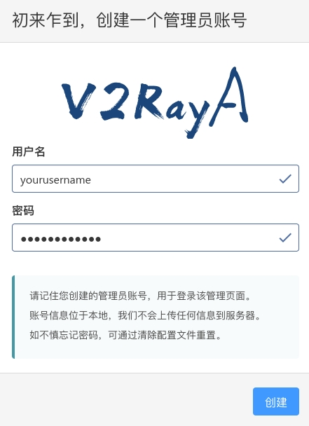
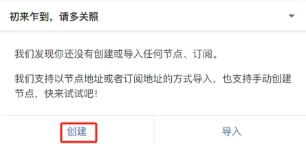
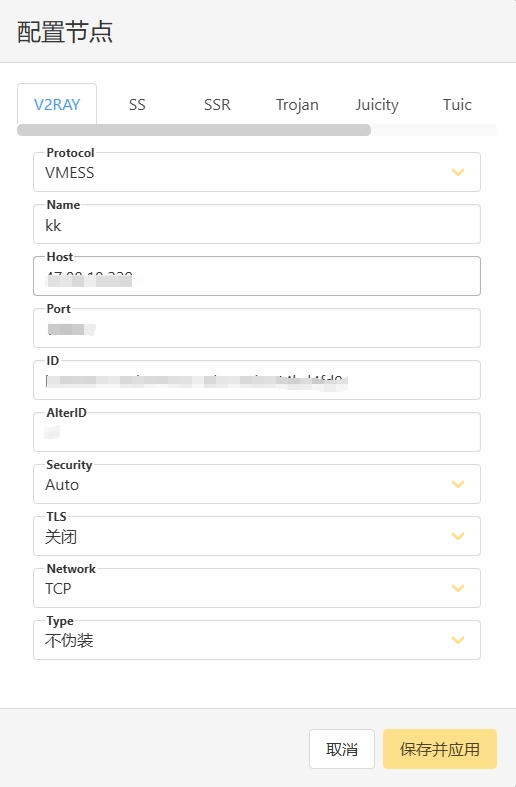
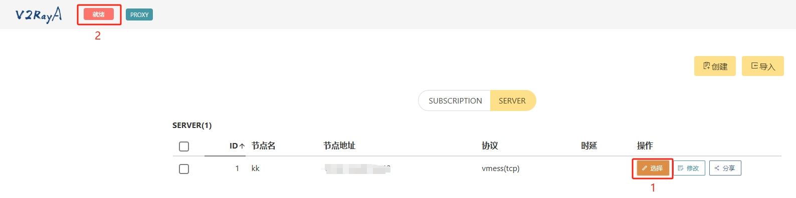
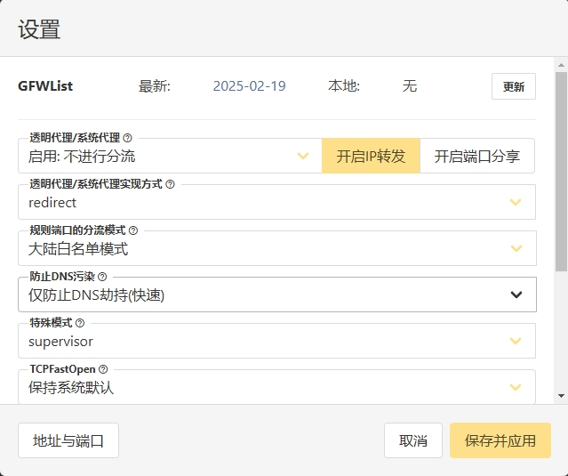

## v2raya搭建透明代理

## 简介

透明代理是一种网络代理技术，客户端无需额外配置即可通过代理服务器访问网络。

所有流量自动经过代理服务器处理，用户无感知。

这里使用 Debian12 搭建，使用 v2ray 部署服务端，v2raya 部署客户端做透明代理。

v2ray 使用 vmess 协议，vmess 是一个加密传输协议，它分为入站和出站两部分，通常作为 v2ray 客户端和服务器之间的桥梁。

vmess 依赖于系统时间，请确保使用 v2ray 的系统 UTC 时间误差在 90 秒之内，时区无关。在 Linux 系统中可以安装ntp服务来自动同步系统时间。


## 一、服务器部署v2ray

### 1. 安装curl

```bash
apt-get update -y && apt-get install curl -y
```

### 2. 安装v2ray

这里使用官方脚本一键安装

```bash
bash <(curl -L https://raw.githubusercontent.com/v2fly/fhs-install-v2ray/master/install-release.sh)
```

### 3. 获取uuid

```bash
cat /proc/sys/kernel/random/uuid
```

### 4. 创建编辑v2ray配置文件

* 创建配置文件

```bash
nano /usr/local/etc/v2ray/config.json
```

* 删除config.json内容，粘贴上以下内容，注意替换为上面的uuid

```bash
{
  "inbounds": [
    {
      "port": 16832, // 服务器端口，建议设置为443，支持多设备连接
      "protocol": "vmess",   
      "settings": {
        "clients": [
          {
            "id": "b831381d-6324-6d53-ad4f-8cda38b30851",  // 用户 ID，
            "alterId": 64
          }
        ]
      }
    }
  ],
  "outbounds": [
    {
      "protocol": "freedom",  
      "settings": {}
    }
  ]
}
```

### 5. 启动v2ray

```bash
systemctl start v2ray
```

### 6. BBR加速（选做）

```bash
wget --no-check-certificate https://github.com/teddysun/across/raw/master/bbr.sh && chmod +x bbr.sh && ./bbr.sh
```

### 7. 重启服务

```bash
systemctl restart v2ray
```

## 二、部署透明代理

本地使用物理机或者虚拟机部署透明代理

### 1. 安装v2raya

#### 1.1 添加公钥

```bash
wget -qO - https://apt.v2raya.org/key/public-key.asc | sudo tee /etc/apt/keyrings/v2raya.asc
```

#### 1.2 添加 V2RayA 软件源

```bash
echo "deb [signed-by=/etc/apt/keyrings/v2raya.asc] https://apt.v2raya.org/ v2raya main" | sudo tee /etc/apt/sources.list.d/v2raya.list
apt update
```

#### 1.3 安装 V2RayA

```bash
apt install v2raya v2ray ## 也可以使用 xray 包
```

#### 1.4 启动v2raya

```bash
systemctl start v2raya
```

#### 1.5 自动启动

```bash
systemctl enable v2raya
```

### 2. 安装iptables

```bash
apt install iptables
```

### 3. 浏览器配置v2raya

浏览器打开`http://ip:2017`

#### 3.1 创建账号

创建一个管理员账号

如果遗忘，使用`v2raya --reset-password`命令重置 



#### 3.2 创建节点



添加vmess节点信息




#### 3.3 连接并启动服务




#### 3.4 配置透明代理



## 三、测试验证

将windows或Linux的网关和dns配置为透明代理主机的ip进行验证

## 四、v2ray客户端直连

### 1. 客户端下载

windows客户端：https://github.com/2dust/v2rayN/releases
mac客户端：https://github.com/Cenmrev/V2RayX/releases/

### 2. 客户端配置

windows客户端配置方法：打开客户端点击右上方的加号，在出现的下拉列表中选择手动输入[Vmess]，然后找到相应区域输入别名（remark，任意名称均可）、服务器IP地址（address）和之前记下的显示在V2Ray配置文件中的几项参数（Port，ID，alterID），还有一项是Security，是选择加密方式，可以自己在下拉列表中选择，和配置文件中的设置无关，建议选择Chacha20-poly1305。输入完成后点击右上方的勾号确定，再点击右下方的连接按钮就可以连接到服务器了。

使用Windows的V2RayN时只要添加服务器（选择Vmess服务器），输入各项信息确定后就会自动连接。注意还要设置系统代理，方法是在Windows的任务栏找到V2RayN的小图标，鼠标右击，在出现的菜单中找到系统代理，然后选择自动配置系统代理。

V2Ray有两种代理模式，有全局模式，和PAC模式，如果平时多用中国以外的网站，那么可以选用全局模式，如果平时会经常用到中国网站，如优酷，QQ音乐等，这些网站的服务只针对中国内的用户开放，这时应该采用PAC模式，让这些没被限制的网站不受V2Ray影响。

## 五、其他

### 1. v2ray一键安装脚本

```bash
系统支持：Ubuntu，Debian，CentOS，推荐使用 Ubuntu 22，谨慎使用 CentOS，脚本可能无法正常运行！

参考资料：https://233boy.com/v2ray/v2ray-script/

更新系统
apt update

执行一键安装脚本
bash <(wget -qO- -o- https://git.io/v2ray.sh)

启用bbr加速
v2ray(shell)-> 9(关于)->1(启用)
```

### 2. v2ray官网

[https://www.v2ray.com/](https://www.v2ray.com/)

### 3. v2raya官网

[https://v2raya.org/](https://v2raya.org/)