## ventoy自动安装windows

### 一、制作应答文件

#### 1.1生成xml应答文件

[https://schneegans.de/windows/unattend-generator](https://schneegans.de/windows/unattend-generator)

登录这个网站，按照自己的需求成生成xml应答文件

#### 1.2win10默认应答文件

以下是win10的xml应答文件，启用内置管理员，密码为123456，启用rdp

```xml
<?xml version="1.0" encoding="utf-8"?>
<unattend xmlns="urn:schemas-microsoft-com:unattend" xmlns:wcm="http://schemas.microsoft.com/WMIConfig/2002/State">
	<!--https://schneegans.de/windows/unattend-generator/?LanguageMode=Unattended&UILanguage=zh-CN&Locale=zh&Keyboard=00000409&GeoLocation=45&ProcessorArchitecture=amd64&ComputerNameMode=Random&TimeZoneMode=Explicit&TimeZone=China+Standard+Time&PartitionMode=Unattended&PartitionLayout=GPT&EspSize=300&RecoveryMode=Folder&WindowsEditionMode=Interactive&UserAccountMode=Unattended&AccountName0=&AccountName1=&AccountName2=&AccountName3=&AccountName4=&AutoLogonMode=Builtin&BuiltinAdministratorPassword=123456&PasswordExpirationMode=Unlimited&LockoutMode=Default&HideFiles=Hidden&TaskbarSearch=Box&EnableRemoteDesktop=true&WifiMode=Skip&ExpressSettings=DisableAll&KeysMode=Skip&WallpaperMode=Default&WdacMode=Skip-->
	<settings pass="offlineServicing"></settings>
	<settings pass="windowsPE">
		<component name="Microsoft-Windows-International-Core-WinPE" processorArchitecture="amd64" publicKeyToken="31bf3856ad364e35" language="neutral" versionScope="nonSxS">
			<SetupUILanguage>
				<UILanguage>zh-CN</UILanguage>
			</SetupUILanguage>
			<InputLocale>7804:00000409</InputLocale>
			<SystemLocale>zh</SystemLocale>
			<UILanguage>zh-CN</UILanguage>
			<UserLocale>zh</UserLocale>
		</component>
		<component name="Microsoft-Windows-Setup" processorArchitecture="amd64" publicKeyToken="31bf3856ad364e35" language="neutral" versionScope="nonSxS">
			<ImageInstall>
				<OSImage>
					<InstallTo>
						<DiskID>0</DiskID>
						<PartitionID>3</PartitionID>
					</InstallTo>
				</OSImage>
			</ImageInstall>
			<UserData>
				<ProductKey>
					<Key>00000-00000-00000-00000-00000</Key>
				</ProductKey>
				<AcceptEula>true</AcceptEula>
			</UserData>
			<RunSynchronous>
				<RunSynchronousCommand wcm:action="add">
					<Order>1</Order>
					<Path>cmd.exe /c "&gt;&gt;"X:\diskpart.txt" echo SELECT DISK=0"</Path>
				</RunSynchronousCommand>
				<RunSynchronousCommand wcm:action="add">
					<Order>2</Order>
					<Path>cmd.exe /c "&gt;&gt;"X:\diskpart.txt" echo CLEAN"</Path>
				</RunSynchronousCommand>
				<RunSynchronousCommand wcm:action="add">
					<Order>3</Order>
					<Path>cmd.exe /c "&gt;&gt;"X:\diskpart.txt" echo CONVERT GPT"</Path>
				</RunSynchronousCommand>
				<RunSynchronousCommand wcm:action="add">
					<Order>4</Order>
					<Path>cmd.exe /c "&gt;&gt;"X:\diskpart.txt" echo CREATE PARTITION EFI SIZE=300"</Path>
				</RunSynchronousCommand>
				<RunSynchronousCommand wcm:action="add">
					<Order>5</Order>
					<Path>cmd.exe /c "&gt;&gt;"X:\diskpart.txt" echo FORMAT QUICK FS=FAT32 LABEL="System""</Path>
				</RunSynchronousCommand>
				<RunSynchronousCommand wcm:action="add">
					<Order>6</Order>
					<Path>cmd.exe /c "&gt;&gt;"X:\diskpart.txt" echo CREATE PARTITION MSR SIZE=16"</Path>
				</RunSynchronousCommand>
				<RunSynchronousCommand wcm:action="add">
					<Order>7</Order>
					<Path>cmd.exe /c "&gt;&gt;"X:\diskpart.txt" echo CREATE PARTITION PRIMARY"</Path>
				</RunSynchronousCommand>
				<RunSynchronousCommand wcm:action="add">
					<Order>8</Order>
					<Path>cmd.exe /c "&gt;&gt;"X:\diskpart.txt" echo FORMAT QUICK FS=NTFS LABEL="Windows""</Path>
				</RunSynchronousCommand>
				<RunSynchronousCommand wcm:action="add">
					<Order>9</Order>
					<Path>cmd.exe /c "diskpart.exe /s "X:\diskpart.txt" &gt;&gt;"X:\diskpart.log" || ( type "X:\diskpart.log" &amp; echo diskpart encountered an error. &amp; pause &amp; exit /b 1 )"</Path>
				</RunSynchronousCommand>
			</RunSynchronous>
		</component>
	</settings>
	<settings pass="generalize"></settings>
	<settings pass="specialize">
		<component name="Microsoft-Windows-Deployment" processorArchitecture="amd64" publicKeyToken="31bf3856ad364e35" language="neutral" versionScope="nonSxS">
			<RunSynchronous>
				<RunSynchronousCommand wcm:action="add">
					<Order>1</Order>
					<Path>reg.exe load "HKU\DefaultUser" "C:\Users\Default\NTUSER.DAT"</Path>
				</RunSynchronousCommand>
				<RunSynchronousCommand wcm:action="add">
					<Order>2</Order>
					<Path>reg.exe add "HKU\DefaultUser\Software\Microsoft\Windows\CurrentVersion\RunOnce" /v "GeoLocation" /t REG_SZ /d "powershell.exe -NoProfile -Command \"Set-WinHomeLocation -GeoId 45;\"" /f</Path>
				</RunSynchronousCommand>
				<RunSynchronousCommand wcm:action="add">
					<Order>3</Order>
					<Path>reg.exe unload "HKU\DefaultUser"</Path>
				</RunSynchronousCommand>
				<RunSynchronousCommand wcm:action="add">
					<Order>4</Order>
					<Path>net.exe accounts /maxpwage:UNLIMITED</Path>
				</RunSynchronousCommand>
				<RunSynchronousCommand wcm:action="add">
					<Order>5</Order>
					<Path>netsh.exe advfirewall firewall set rule group="@FirewallAPI.dll,-28752" new enable=Yes</Path>
				</RunSynchronousCommand>
				<RunSynchronousCommand wcm:action="add">
					<Order>6</Order>
					<Path>reg.exe add "HKLM\SYSTEM\CurrentControlSet\Control\Terminal Server" /v fDenyTSConnections /t REG_DWORD /d 0 /f</Path>
				</RunSynchronousCommand>
				<RunSynchronousCommand wcm:action="add">
					<Order>7</Order>
					<Path>reg.exe load "HKU\DefaultUser" "C:\Users\Default\NTUSER.DAT"</Path>
				</RunSynchronousCommand>
				<RunSynchronousCommand wcm:action="add">
					<Order>8</Order>
					<Path>reg.exe add "HKU\DefaultUser\Software\Microsoft\Windows\CurrentVersion\RunOnce" /v "SearchboxTaskbarMode" /t REG_SZ /d "reg.exe add HKCU\Software\Microsoft\Windows\CurrentVersion\Search /v SearchboxTaskbarMode /t REG_DWORD /d 2 /f" /f</Path>
				</RunSynchronousCommand>
				<RunSynchronousCommand wcm:action="add">
					<Order>9</Order>
					<Path>reg.exe unload "HKU\DefaultUser"</Path>
				</RunSynchronousCommand>
			</RunSynchronous>
		</component>
		<component name="Microsoft-Windows-Shell-Setup" processorArchitecture="amd64" publicKeyToken="31bf3856ad364e35" language="neutral" versionScope="nonSxS">
			<TimeZone>China Standard Time</TimeZone>
		</component>
	</settings>
	<settings pass="auditSystem"></settings>
	<settings pass="auditUser"></settings>
	<settings pass="oobeSystem">
		<component name="Microsoft-Windows-International-Core" processorArchitecture="amd64" publicKeyToken="31bf3856ad364e35" language="neutral" versionScope="nonSxS">
			<InputLocale>7804:00000409</InputLocale>
			<SystemLocale>zh</SystemLocale>
			<UILanguage>zh-CN</UILanguage>
			<UserLocale>zh</UserLocale>
		</component>
		<component name="Microsoft-Windows-Shell-Setup" processorArchitecture="amd64" publicKeyToken="31bf3856ad364e35" language="neutral" versionScope="nonSxS">
			<UserAccounts>
				<AdministratorPassword>
					<Value>123456</Value>
					<PlainText>true</PlainText>
				</AdministratorPassword>
			</UserAccounts>
			<AutoLogon>
				<Username>Administrator</Username>
				<Enabled>true</Enabled>
				<LogonCount>1</LogonCount>
				<Password>
					<Value>123456</Value>
					<PlainText>true</PlainText>
				</Password>
			</AutoLogon>
			<OOBE>
				<ProtectYourPC>3</ProtectYourPC>
				<HideEULAPage>true</HideEULAPage>
				<HideWirelessSetupInOOBE>true</HideWirelessSetupInOOBE>
			</OOBE>
			<FirstLogonCommands>
				<SynchronousCommand wcm:action="add">
					<Order>1</Order>
					<CommandLine>reg.exe add "HKLM\SOFTWARE\Microsoft\Windows NT\CurrentVersion\Winlogon" /v AutoLogonCount /t REG_DWORD /d 0 /f</CommandLine>
				</SynchronousCommand>
			</FirstLogonCommands>
		</component>
	</settings>
</unattend>
```

### 二、制作ventoy启动U盘

#### 2.1制作启动U盘

这步会删除U盘所有数据！！！

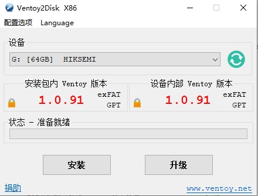

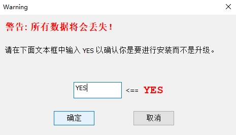

#### 2.2创建win10目录

在ventoy根目录下载创建win目录，win10目录用来存放win10镜像和应答文件

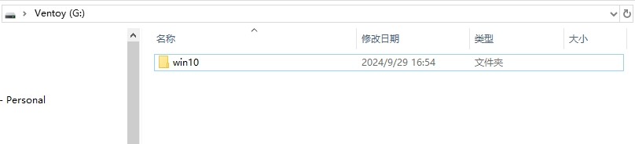

#### 2.3拷贝win10镜像和应答文件到win10目录

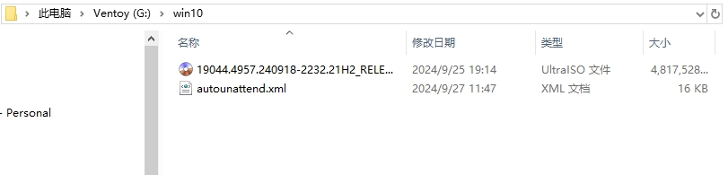

### 三、配置ventoy自动插件

#### 3.1打开ventoy安装目录的插件

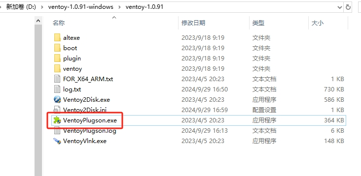

选择启动

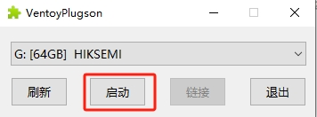

#### 3.2打开自动安装插件功能

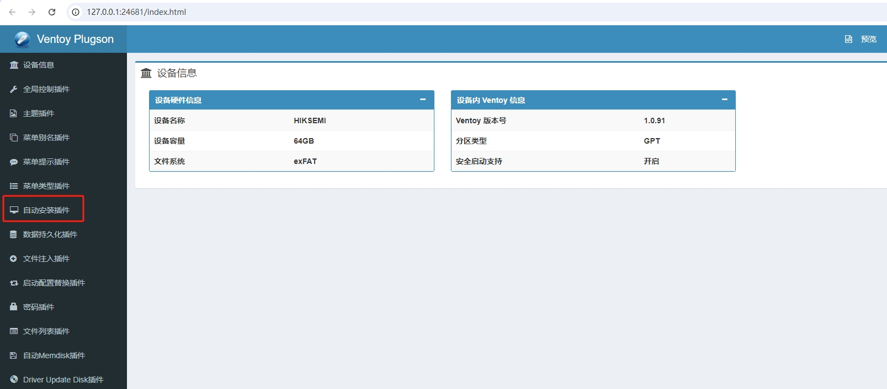

#### 3.3点击新增

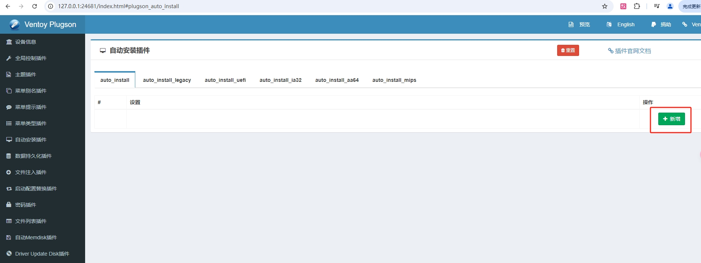

#### 3.4选择“为某个目录下的所有文件设置相同的自动安装脚本 ”

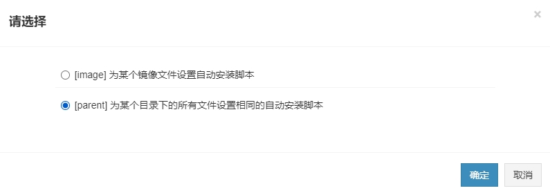

#### 3.5填入win10目录路径和应答硬件路径

按照自己的pc填写，我这里是：

G:\win10

G:\win10\autounattend.xml

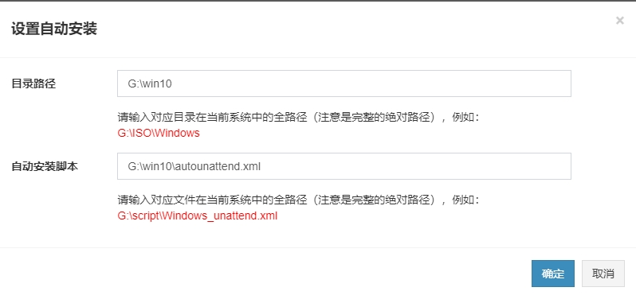

#### 3.6查看配置结果

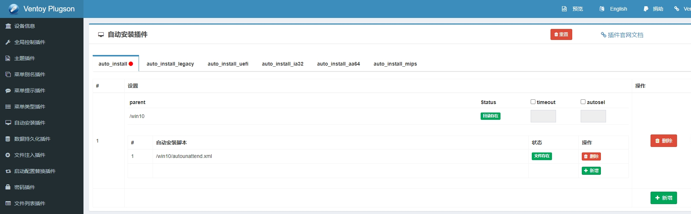

U盘下会自动生成一个ventoy目录，里面包含了配置信息

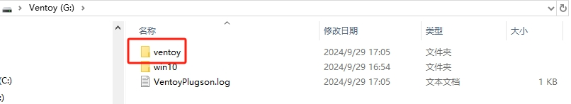

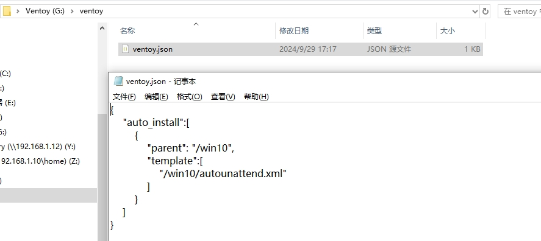

#### 3.7退出自动安装插件

退出自动安装插件后，拔出U盘即可，启动盘制作完成

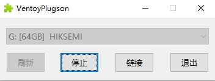

### 四、开始安装

#### 4.1选择要安装的镜像

回车

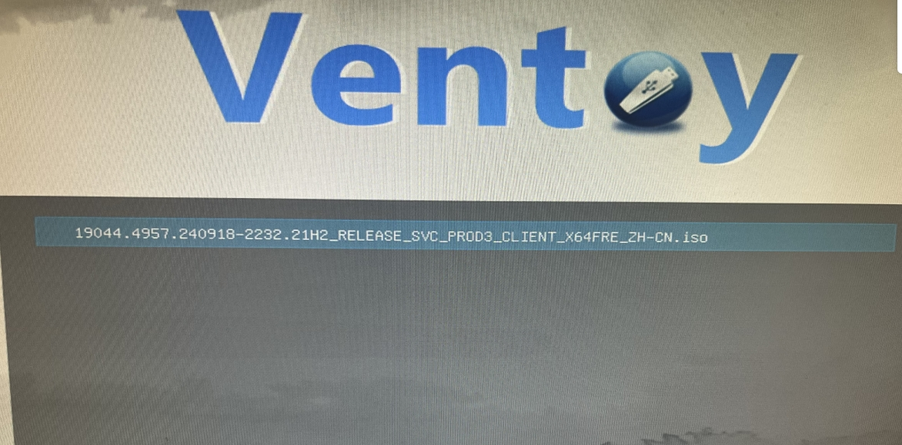

#### 4.4选择“Boot in wimboot mode”

回车

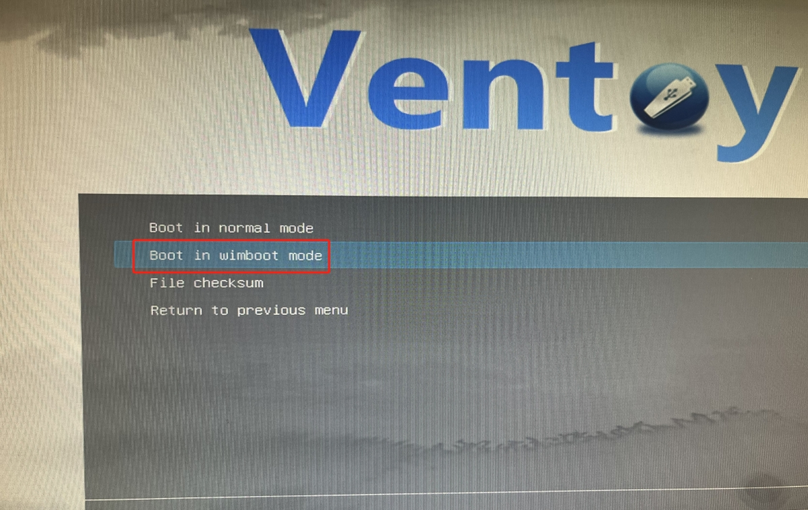

#### 4.5选择对应的应答文件

回车

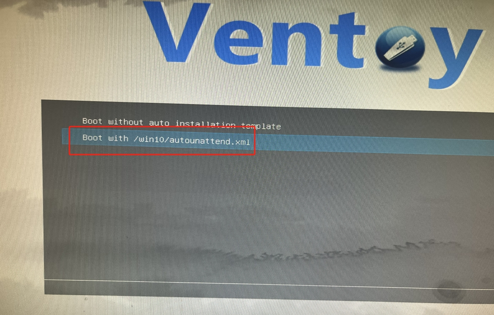

#### 4.6开始自动安装

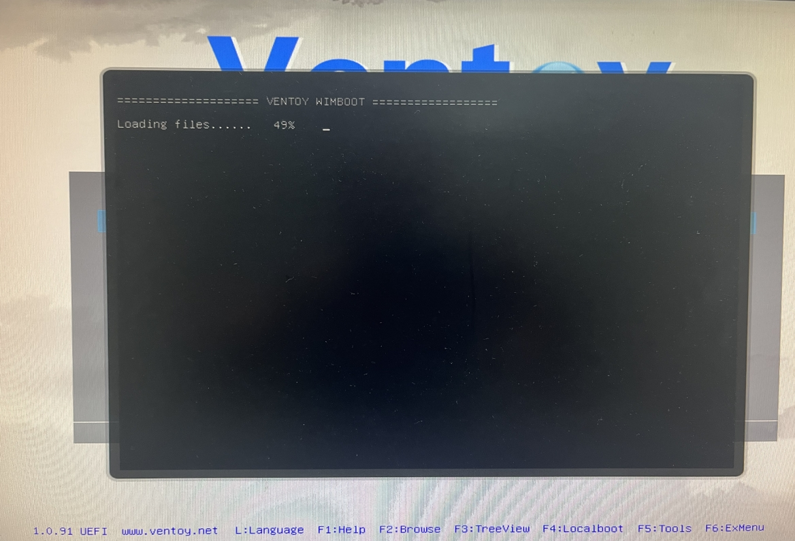

#### 4.7自动安装完成

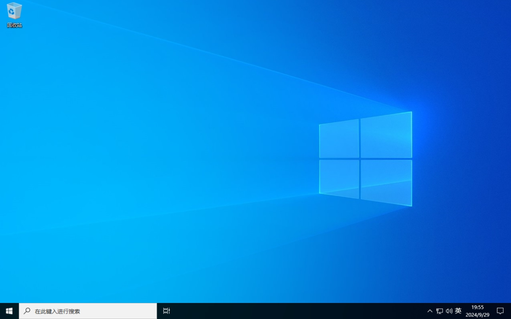
