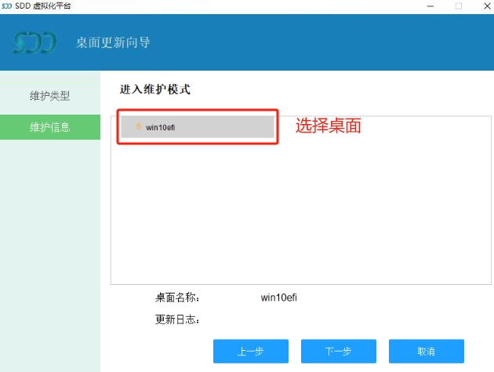

# voi快速部署教程

## 前言

随着信息技术的飞速发展和数字化转型的不断深入，云桌面技术以其高效、安全、易于管理的特点，逐渐成为现代办公与教育领域的重要选择。

为了提升办公效率、简化终端管理以及优化资源利用，我们设计并部署了适用于60人规模的 VOI云桌面解决方案。

下面是云教室部署基本要求：

| 组件   | 描述                                          |
| ------ | --------------------------------------------- |
| 路由器 | 为教室提供c类网，与学校大网隔离，防止网络干扰 |
| 交换机 | 推荐千兆企业交换机，满足镜像更新的带宽要求    |
| 服务器 | 部署voi服务端                                 |
| 教师机 | 教学管理                                      |
| 学生机 | 60台，voi客户机                               |

网络规划：

| 设备   | ip                                   |
| :-- | ---- |
| 服务器 | 192.168.1.201 |
| 教师机 | 192.168.1.10 |
| 学生机 | 192.168.100-192.168.1.200 |
| 路由器 | DHCP范围192.168.1.100-192.1688.1.200 |

## 第一章：安装准备

### 1.1 服务器

winserver2019，c盘100G，d盘200G(用来保存系统模板，推荐200G-500G)

### 1.2 客户机

安装好win10系统和驱动

### 1.3 安装包

voi安装包拷贝到服务器上

### 1.4 服务器配置静态ip

## 第二章：服务端部署

### 2.1 安装voi服务端

解压安装包，找到安装文件，右键管理员权限开始安装

按照图示，前面已经配置过ip，下一步

立即安装

下一步

等待安装完成

安装完成，重启服务器

### 2.2 初始化数据

登录服务器，浏览器登录`http://ip:10013`，配置管理员密码，这里演示密码为：123456

登录管理员账号：admin，密码：123456

添加组织：test

点击保存，更新组织信息

浏览器登录`http://ip:10014`，配置管理员密码，这里演示密码为：123456

选中d盘作为存储盘，下一步

点击+，新建test用户组

点击新建计算机，创建计算机的数量，这里创建10台，输入001，010，选择客户机的启动方式，下一步

初始化完成，点击立即查看

登录voi后台管理页面

## 第三章：客户端部署

### 3.1 安装客户端

把服务器上解压出来的这两个安装包拷贝到客户机

安装两个客户端

下一步

下一步

安装

安装完成，重启客户机

重启后删除安装包，关机

### 3.2 调整网络

让客户机和服务器在同一网段内方便测试

关闭其他dhcp服务，开启voi的dhcp

### 3.3 客户机开启pxe

### 3.4 pxe启动客户机上传系统

选择第一个后回车

确保连接状态为yes

按f3进入上传界面，给镜像命名win10，输入管理员账号：admin，密码：123456，开始上传

等待上传完成

上传完成

### 3.5 创建桌面模板

点击添加模板，命名新模板名称，选择上传的镜像

添加test分组

### 3.6 下发系统

返回客户机，按f8清空磁盘下载系统

选中win10回车，开始下载

等待下载完成

按f10重启，进入下发的系统

## 第四章：维护

### 4.1 更新模板（更新系统盘）

客户机在还原模式下配置

打开右下角的客户端，输入管理员账号密码

勾选更新系统盘，下一步

点击进入维护模式，会重启客户机

进入维护模式

进入系统，桌面右侧弹出更新桌面操作框，先不要做任何操作（不关闭、不点确认、不点取消），该状态下对系统进行更新修改 ，更新完成后点击确认更新，提示重新启动，点击确认

安装微信作为演示，安装后建议填写好日志信息

确认更新后需要重启

等待上传数据

上传完成

下发更新

等待更新完成

更新完成，重启生效

进入系统，桌面版本是2，桌面的微信也出现了，更新任务完成

### 4.2 添加数据磁盘

创建一个数据盘

给模板分配数据盘

添加后如图示

推送数据盘

重启客户机，添加数据盘生效

### 4.3 数据盘更新

特此注意：更新数据磁盘，要确保数据磁盘是处于还原模式才能更新

首次通过服务下发的数据磁盘默认是读写模式，若要进行统一更新需要先设为还原

输入管理员账号，进入维护模式

系统盘可以和数据盘一起更新，也可以单独更新。

以下为更新数据盘为例

重启进入维护模式

重启设备后，进入系统，桌面右侧弹出更新桌面操作框，先不要做任何操作（不关闭、不点确认、不点取消），该状态下对系统进行更新修改 ，更新完成后点击确认更新，提示重新启动，点击确认。

此次对数据盘更新演示示例：更新一个名称为test的文本文档，下发给所有学生端的数据磁盘，确保所有学生终端数据盘更新完毕后，都有这个名称为‘1’的文本文档。

步骤如下：数据磁盘维护模式中，在数据盘中新建一个为test的文本，然后点击右下角确认更新：

填写更新信息

重启后，等待增量更新上传到服务器至完成

下发数据盘更新

下发完成后，重启客户机，数据盘中就会出现test的文本文档

### 4.4 生成新的桌面快照

此功能主要需求是：创建双系统或者多系统的时候使用，并且前提条件是针对同一个系统平台。

例如：基于windows10操作系统需要部署两个、多个系统场景需求或者基于windows7操作系统需要部署两个、多个系统场景需求！

进入维护模式，生成新的快照

选择对应的桌面

给一个新的名字，注意名字不要和父磁盘重名！！！

这里演示快照名称为win10efi-k1

重启进入维护模式

安装google浏览器为例

填写更新信息

重启后，等待数据上传完成

web控制台出现快照点k1

### 4.5 切换桌面

添加快照到模板

推送快照

客户机更新快照点完成

web控制台切换显示桌面

隐藏win10efi，重启客户机就会登录到win10efi-k1快照点

### 4.6 U盘引导

当无法开启pxe时，可以采取U盘引导进行客户机初始化

制作启动U盘

u盘启动进行初始化

检查连接状态，如果无法通行，配手动配置服务器ip和客户机ip

连接状态为YES，可以进行上传下载的操作了

### 4.7 U盘部署镜像

针对网络连接不稳定的情况，也可使用U盘部署镜像

首先制作好启动U盘

把镜像导出

服务器的D盘出导出镜像

把这个目录拷贝启动U盘的VHD目录中

U盘启动客户机，确保连接状态为YES，按f4写入镜像

tab键切换，写入镜像

写入完成后，重启客户机即可进入系统

### 4.8 克隆镜像

选择win10new，克隆出一个新的win10h1镜像

命名为win10h1

克隆完成

