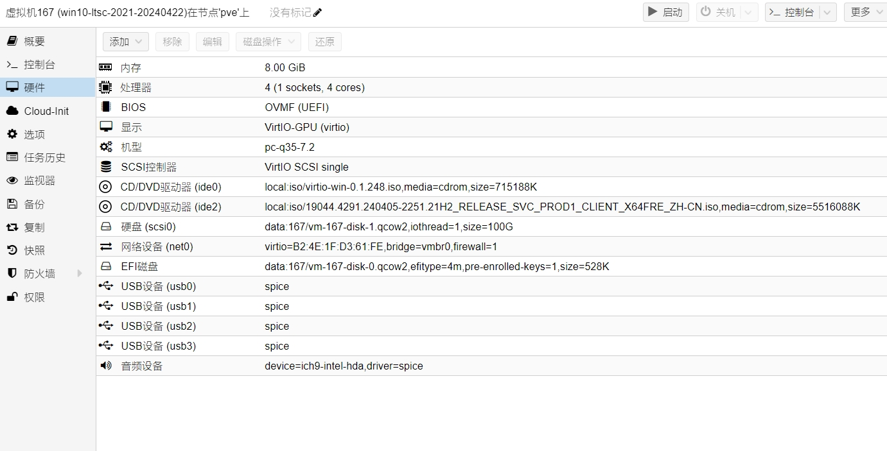

## 下载安装工具

### 获取windows iso

推荐从itellyou官网下载原版iso
[itellyou官网](https://msdn.itellyou.cn/)

### 获取virtio-win驱动

virtio-win包含windows虚拟机所有开源驱动

选择最新版virtio驱动，下载iso文件
[virtio驱动下载链接](https://fedorapeople.org/groups/virt/virtio-win/direct-downloads/archive-virtio/)

### 获取spice驱动

[spice驱动下载链接](https://www.spice-space.org/download.html)

### 获取kms激活工具

[kms激活工具下载连接](https://share.weiyun.com/UaW2pq4I)

### 获取VDOT优化脚本

[VDOT github下载连接](https://github.com/The-Virtual-Desktop-Team/Virtual-Desktop-Optimization-Tool)

### 获取Win_ISO_Patching_Scripts

[Win_ISO_Patching_Scripts下载链接](https://github.com/adavak/Win_ISO_Patching_Scripts/tree/master)

## 优化windows iso

详情参考 Win_ISO_Patching_Scripts github使用说明

## Proxmox安装win10LTSC2021

win11模板制作同理

### 硬件配置



### 安装时加载vioscsi磁盘驱动


### 限制win10安装占用空间


### 启用远程

打开远程桌面


* 强制开启远程桌面

打开gpedit.msc组策略编辑器

编辑 “计算机配置->管理模板->windows组件->远程桌面服务->远程桌面会话主机->连接”

编辑 “允许用户通过使用远程桌面服务进行远程连接” 改为未配置，即可打开远程桌面的权限，然后再打开远程桌面即可

### 激活系统

使用kms激活工具激活系统（仅供测试使用，如果要激活系统，请购买微软原版授权）


### Windows虚拟桌面优化工具（选做）

```powershell
#在对应路径执行优化脚本
.\Windows_VDOT.ps1 -Optimizations All -AdvancedOptimizations All -AcceptEULA -Verbose
```


### 禁止win10系统更新

将以下内容保存为 *.ps1脚本，右键使用 PowerShell 运行

```powershell
param($UpdateValue)

#Clear-Host


Write-Host "0 -> Change setting in Windows Update app (default)"
Write-Host "1 -> Never check for updates (not recommended)"
Write-Host "2 -> Notify for download and notify for install"
Write-Host "3 -> Auto download and notify for install"
Write-Host "4 -> Auto download and schedule the install"

Write-Host "Enter any character to exit"
Write-Host
if ($UpdateValue -ne "1")
{
    switch(Read-Host "Choose Window Update Settings"){
           0 {$UpdateValue = 0}
           1 {$UpdateValue = 1}
           2 {$UpdateValue = 2}
           3 {$UpdateValue = 3}
           4 {$UpdateValue = 4}
           Default{Exit}
    }
}

$WindowsUpdatePath = "HKLM:SOFTWARE\Policies\Microsoft\Windows\WindowsUpdate\"
$AutoUpdatePath = "HKLM:SOFTWARE\Policies\Microsoft\Windows\WindowsUpdate\AU"

If(Test-Path -Path $WindowsUpdatePath) {
    Remove-Item -Path $WindowsUpdatePath -Recurse
}


If ($UpdateValue -gt 0) {
    New-Item -Path $WindowsUpdatePath
    New-Item -Path $AutoUpdatePath
}

If ($UpdateValue -eq 1) {
    Set-ItemProperty -Path $AutoUpdatePath -Name NoAutoUpdate -Value 1
}

If ($UpdateValue -eq 2) {
    Set-ItemProperty -Path $AutoUpdatePath -Name NoAutoUpdate -Value 0
    Set-ItemProperty -Path $AutoUpdatePath -Name AUOptions -Value 2
    Set-ItemProperty -Path $AutoUpdatePath -Name ScheduledInstallDay -Value 0
    Set-ItemProperty -Path $AutoUpdatePath -Name ScheduledInstallTime -Value 3
}

If ($UpdateValue -eq 3) {
    Set-ItemProperty -Path $AutoUpdatePath -Name NoAutoUpdate -Value 0
    Set-ItemProperty -Path $AutoUpdatePath -Name AUOptions -Value 3
    Set-ItemProperty -Path $AutoUpdatePath -Name ScheduledInstallDay -Value 0
    Set-ItemProperty -Path $AutoUpdatePath -Name ScheduledInstallTime -Value 3
}

If ($UpdateValue -eq 4) {
    Set-ItemProperty -Path $AutoUpdatePath -Name NoAutoUpdate -Value 0
    Set-ItemProperty -Path $AutoUpdatePath -Name AUOptions -Value 4
    Set-ItemProperty -Path $AutoUpdatePath -Name ScheduledInstallDay -Value 0
    Set-ItemProperty -Path $AutoUpdatePath -Name ScheduledInstallTime -Value 3
}
```


### 禁止edge浏览器更新

将以下内容保存为 *.ps1脚本，右键使用 PowerShell 运行

```powershell
if ([Environment]::Is64BitOperatingSystem -eq "True") {
    #Write-Host "64-bit OS"
    $PF=${env:ProgramFiles(x86)}
}
else {
    #Write-Host "32-bit OS"
    $PF=$env:ProgramFiles
}

if ($(Test-Path "$PF\Microsoft\Edge\Application\msedge.exe") -eq "True") {
    # 结束进程
    taskkill /im MicrosoftEdgeUpdate.exe /f
    taskkill /im msedge.exe /f
    # Microsoft Edge 更新服务（SYSIN）
    #这里也可以使用 sc.exe stop "service name"
    Stop-Service -Name "edgeupdate"
    Stop-Service -Name "edgeupdatem"
    Stop-Service -Name "MicrosoftEdgeElevationService"
    # Windows 10 默认 PS 版本 5.1 没有 Remove-Service 命令
    # This cmdlet was added in PS v6. See https://docs.microsoft.com/en-us/powershell/scripting/whats-new/what-s-new-in-powershell-core-60?view=powershell-6#cmdlet-updates.
    #Remove-Service -Name "edgeupdate"
    #Remove-Service -Name "edgeupdatem"
    #Remove-Service -Name "MicrosoftEdgeElevationService"
    # sc 在 PowerShell 中是 Set-Content 别名，所以要使用 sc.exe 否则执行后无任何效果
    sc.exe delete "edgeupdate"
    sc.exe delete "edgeupdatem"
    sc.exe delete "MicrosoftEdgeElevationService"
    # 任务计划企业版
    schtasks.exe /Delete /TN \MicrosoftEdgeUpdateBrowserReplacementTask /F
    schtasks.exe /Delete /TN \MicrosoftEdgeUpdateTaskMachineCore /F
    schtasks.exe /Delete /TN \MicrosoftEdgeUpdateTaskMachineUA /F
    # 移除更新程序
    Remove-Item "$PF\Microsoft\EdgeUpdate" -Recurse  -Force
    Write-Output "Disable Microsoft Edge Enterprise Auto Update Successful!"
}
elseif ($(Test-Path "$env:USERPROFILE\AppData\Local\Microsoft\Edge\Application\msedge.exe") -eq "True") {
    # 结束进程
    taskkill /im MicrosoftEdgeUpdate.exe /f
    taskkill /im msedge.exe /f
    # 用户版没有创建服务
    # 获取SID方法
    function Get-CurrentUserSID {
        [CmdletBinding()]
        param(
        )
        Add-Type -AssemblyName System.DirectoryServices.AccountManagement
        return ([System.DirectoryServices.AccountManagement.UserPrincipal]::Current).SID.Value
    }
    # 用户版任务计划
    schtasks.exe /Delete /TN \MicrosoftEdgeUpdateTaskUser$(Get-CurrentUserSID)Core /F
    schtasks.exe /Delete /TN \MicrosoftEdgeUpdateTaskUser$(Get-CurrentUserSID)UA /F
    # 移除更新程序
    Remove-Item  "$env:USERPROFILE\AppData\Local\Microsoft\EdgeUpdate" -Recurse  -Force
    Write-Output "Disable Microsoft Edge Users Setup Auto Update Successful!"
}
else {
    Write-Output "No Microsoft Edge Installation Detected!"
}

```


### 安装虚拟机驱动


### 安装spice驱动（可选）


### 启用管理员账户
取消禁用administrator管理员，启用administrator管理员账户，配置默认密码为123456


### 删除test账户

删除安装系统时配置的账户，重启后删除test目录


### 保存为模板

重启虚拟机，检查无误保存为模板
