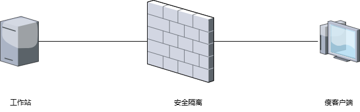

## 云桌面用户资产分离方案

### 一、背景

 为了实现工作站主机和用户的分离，并确保资产的安全管理，本方案采用远程桌面和终端登录的方式，使用户通过远程访问桌面来完成日常工作。此方案不仅可以集中管理企业资产，还可以提高信息安全水平 。

### 二、方案

#### 1.方案架构图

#### 2.方案组件

工作站：安装有重资产或数据重要的工作站

安全隔离：设备物理隔离，仅允许防火墙授权的终端访问

瘦客户端：一个低功耗低成本的终端设备

#### 3.方案简介

工作站放置在安全等级高的地方，物理的方式和使用的用户隔离。终端可以放置在用户使用的地方

用户使用终端，通过远程协议访问工作站，数据始终存在工作站的硬盘上，工作站的上的显卡、硬盘重要资产不和用户产生接触，避免盗窃发生的可能。提升了信息安全水平。

#### 4.效果展示

使用j-1900的终端，采用远程协议，可以支持1080P 60帧的显示效果。

使用n-5095的终端，采用远程协议，可以支持4K 60帧的显示效果。

### 三、方案优势

采用云终端的方案，可以做到用户和资产分离。提升了安全级别。

### 四、方案成本

代采或自购，成本约200-1000
