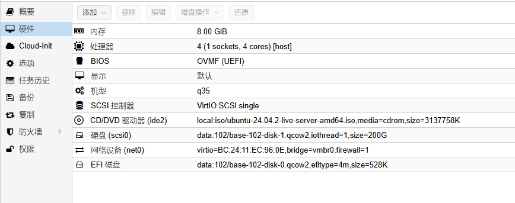
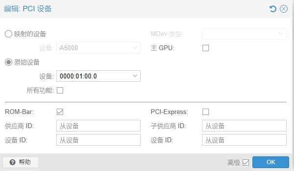
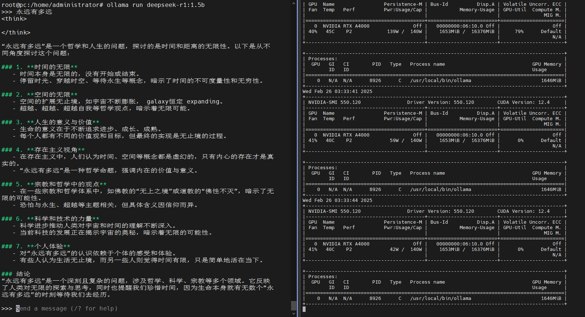

## 制作Ubuntu deepseek模板

### 1. 安装虚拟机

按照图示创建并安装好虚拟机



安装时，注意选择最小化安装并安装openssh-server

### 2. 换源（可选）

编辑 /etc/apt/sources.list.d/ubuntu.sources

```
Types: deb
URIs: https://mirrors.ustc.edu.cn/ubuntu
Suites: noble noble-updates noble-backports
Components: main restricted universe multiverse
Signed-By: /usr/share/keyrings/ubuntu-archive-keyring.gpg

Types: deb
URIs: https://mirrors.ustc.edu.cn/ubuntu
Suites: noble-security
Components: main restricted universe multiverse
Signed-By: /usr/share/keyrings/ubuntu-archive-keyring.gpg
```

### 3. 添加显卡

关机后，添加显卡



### 4. 禁用开源驱动

```
bash -c "echo 'blacklist nouveau' >> /etc/modprobe.d/blacklist-nouveau.conf"

bash -c "echo 'options nouveau modeset=0' >> /etc/modprobe.d/blacklist-nouveau.conf"
```

### 5. 安装显卡驱动

```
apt update
ubuntu-drivers autoinstall
```

### 6. 重启检查驱动是否正常

如何显示以下内容则正常

```
root@pc:/home/administrator# nvidia-smi
Wed Feb 26 02:51:23 2025
+-----------------------------------------------------------------------------------------+
| NVIDIA-SMI 550.120                Driver Version: 550.120        CUDA Version: 12.4     |
|-----------------------------------------+------------------------+----------------------+
| GPU  Name                 Persistence-M | Bus-Id          Disp.A | Volatile Uncorr. ECC |
| Fan  Temp   Perf          Pwr:Usage/Cap |           Memory-Usage | GPU-Util  Compute M. |
|                                         |                        |               MIG M. |
|=========================================+========================+======================|
|   0  NVIDIA RTX A4000               Off |   00000000:06:10.0 Off |                  Off |
| 41%   32C    P8             14W /  140W |       4MiB /  16376MiB |      0%      Default |
|                                         |                        |                  N/A |
+-----------------------------------------+------------------------+----------------------+

+-----------------------------------------------------------------------------------------+
| Processes:                                                                              |
|  GPU   GI   CI        PID   Type   Process name                              GPU Memory |
|        ID   ID                                                               Usage      |
|=========================================================================================|
|  No running processes found                                                             |
+-----------------------------------------------------------------------------------------+
```

### 7. 安装socks5代理支持

我这里使用socks5代理，也可以换换成其他科学上网，比如旁路由透明代理

安装proxychains

```
apt install proxychains
```

配置/etc/proxychains.conf，最后一行添加如下内容

```
socks5 192.168.1.8 1080
```

### 8. 安装ollama

```
curl -x socks5h://192.168.1.8:1080 -fsSL https://ollama.com/install.sh | sh
```

### 9. 下载deepseek模型

以下载最小模型为例

```
proxychains ollama run deepseek-r1:1.5b
```

下载后会自动进入运行

### 10. 退出allama

ctrl + d 退出运行，ollama run deepseek-r1:1.5b 再次运行

### 11. 检查显卡状态

运行大模型时，检查显卡状态

