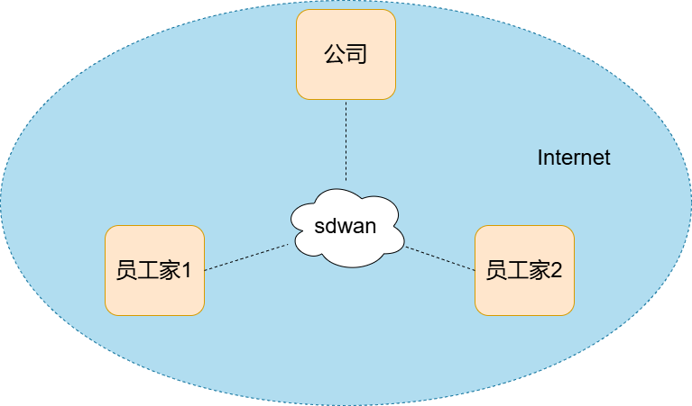

## 搭建wireguard异地组网环境

### 一、背景

 异地组网方案旨在将不同地理位置的网络资源连接起来，以实现数据共享和协同工作。 


### 二、方案

#### 1.方案架构图




#### 2.方案介绍

公司，员工家都在互联网中，无法直接通信。

通过sdwan，把所有公司和员工家组成一个虚拟局域网，实现异地组网方案。

sdwan节点可以部署在公司或者公有云环境（具有公网ip），在每个需要登录节点安装 [wireguard client](https://www.wireguard.com/install/)，接入sdwan网络，每个接入的设备会获取到一个虚拟ip，这个ip用来加入局域网。

WireGuard 是一种新兴的、高性能的网络隧道协议，以其简洁的设计和优秀的性能获得了广泛认可。 

[wg-easy](https://github.com/wg-easy/wg-easy) 是一个轻量级、高效的 WireGuard 配置和管理工具，旨在帮助用户轻松地在各类操作系统上（包括 Linux、Windows 和 macOS）建立安全的网络连接。 

#### 3.wg-easy快速搭建

[How_to_generate_an_bcrypt_hash.md](https://github.com/wg-easy/wg-easy/blob/master/How_to_generate_an_bcrypt_hash.md)

密码需要提前生成，或者不用管理员密码

docker-compose文件

```shell
volumes:
  etc_wireguard:

services:
  wg-easy:
    environment:
      # Change Language:
      # (Supports: en, ua, ru, tr, no, pl, fr, de, ca, es, ko, vi, nl, is, pt, chs, cht, it, th, hi)
      - LANG=chs
      # ⚠️ Required:
      # Change this to your host's public address
      - WG_HOST=192.168.1.172

      # Optional:
      # - PASSWORD_HASH=$$2y$$10$$hBCoykrB95WSzuV4fafBzOHWKu9sbyVa34GJr8VV5R/pIelfEMYyG (needs double $$, hash of 'foobar123'; see "How_to_generate_an_bcrypt_hash.md" for generate the hash)
      # - PORT=51821
      # - WG_PORT=51820
      # - WG_CONFIG_PORT=92820
      # - WG_DEFAULT_ADDRESS=10.8.0.x
      # - WG_DEFAULT_DNS=1.1.1.1
      # - WG_MTU=1420
      # 不拦截未经隧道的流量
      - WG_ALLOWED_IPS=0.0.0.0/1, 128.0.0.0/1, ::/1, 8000::/1
      # - WG_PERSISTENT_KEEPALIVE=25
      # - WG_PRE_UP=echo "Pre Up" > /etc/wireguard/pre-up.txt
      # - WG_POST_UP=echo "Post Up" > /etc/wireguard/post-up.txt
      # - WG_PRE_DOWN=echo "Pre Down" > /etc/wireguard/pre-down.txt
      # - WG_POST_DOWN=echo "Post Down" > /etc/wireguard/post-down.txt
      # - UI_TRAFFIC_STATS=true
      # - UI_CHART_TYPE=0 # (0 Charts disabled, 1 # Line chart, 2 # Area chart, 3 # Bar chart)
      # - WG_ENABLE_ONE_TIME_LINKS=true
      # - UI_ENABLE_SORT_CLIENTS=true
      # - WG_ENABLE_EXPIRES_TIME=true
      # - ENABLE_PROMETHEUS_METRICS=false
      # - PROMETHEUS_METRICS_PASSWORD=$$2a$$12$$vkvKpeEAHD78gasyawIod.1leBMKg8sBwKW.pQyNsq78bXV3INf2G # (needs double $$, hash of 'prometheus_password'; see "How_to_generate_an_bcrypt_hash.md" for generate the hash)

    image: ghcr.io/wg-easy/wg-easy
    container_name: wg-easy
    volumes:
      - etc_wireguard:/etc/wireguard
    ports:
      - "51820:51820/udp"
      - "51821:51821/tcp"
    restart: unless-stopped
    cap_add:
      - NET_ADMIN
      - SYS_MODULE
      # - NET_RAW # ⚠️ Uncomment if using Podman
    sysctls:
      - net.ipv4.ip_forward=1
      - net.ipv4.conf.all.src_valid_mark=1
```


### 三、方案优势

####  1.安全性

WireGuard使用最新的加密算法和协议，保证了数据传输的安全性。同时，它采用了简化的设计，减少了潜在的漏洞和攻击面。 

####  2.易用性

WireGuard的配置文件简单明了，易于理解和编辑。此外，它还提供了命令行和图形界面等多种工具，方便用户进行配置和管理。 

#### 3.性能

WireGuard具有高效的性能和低延迟的特点，适用于各种网络环境和应用场景。 

#### 4.二次开发

 项目遵循模块化设计，易于扩展，同时也支持通过 API 进行集成，适用于开发者进行二次开发。 
