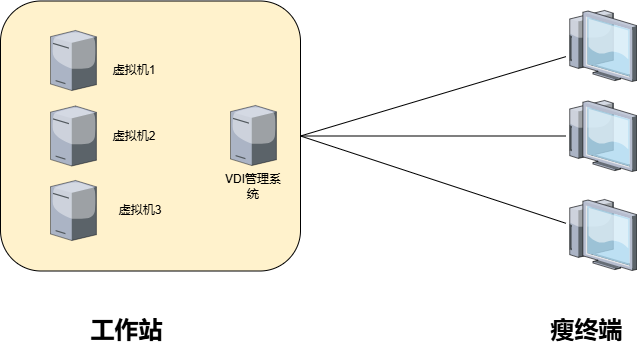

## 迷你云桌面方案

### 一、背景

初创小型公司因为成本的考虑，决定使用VDI云桌面方案。公司的业务主要以网页，微信，QQ为主，属于轻负载使用场景，通常使用网页处理大量的业务操作，包括产品管理、订单处理、客户服务和市场分析等。通过使用虚拟桌面基础架构（VDI）云桌面，可以集中管理IT资源，降低用户成本。

### 二、方案

#### 1.方案架构图

#### 2.方案组件

工作站：小型工作站

虚拟机：运行普通桌面办公应用

瘦客户端：一个低功耗低成本的终端设备

#### 3.方案简介

通过虚拟化技术，可以将一台工作站，虚拟化出7个带gpu的虚拟机，运行轻量级业务。终端使用rdp协议连接虚拟机，满足7个用户的轻办公需求。

#### 4.效果展示

 使用j1900终端，采用RDP远程协议，可以达到1080P 25-30帧的显示效果。 

### 三、方案成本

#### 1.推荐硬件配置

cpu：i7-13700

内存：64G

硬盘：1T NVME

终端：j1900

整套方案：7-8k

#### 2.最低硬件配置

cpu：i5-12400

内存：32G

硬盘：1T NVME

终端：j1900

整套方案：4-5k

### 四、方案优势

使用这套轻量级云桌面，最大的优势就是低成本实现一个轻量云桌面办公需求。

每个用户都有一个虚拟显卡，可以满足基本的设计需求。

