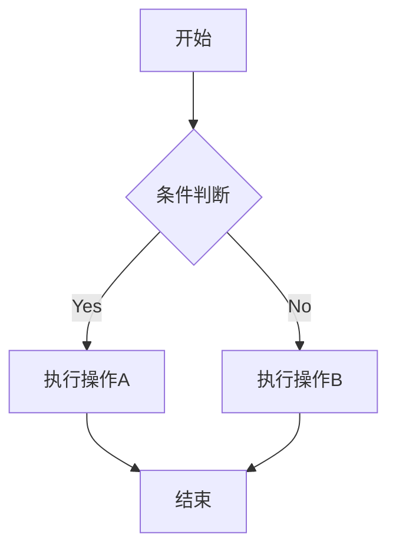
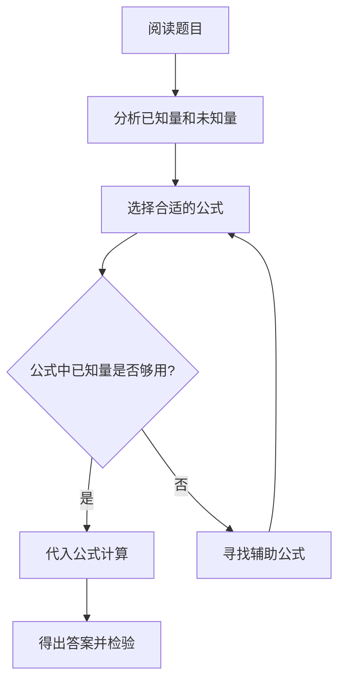
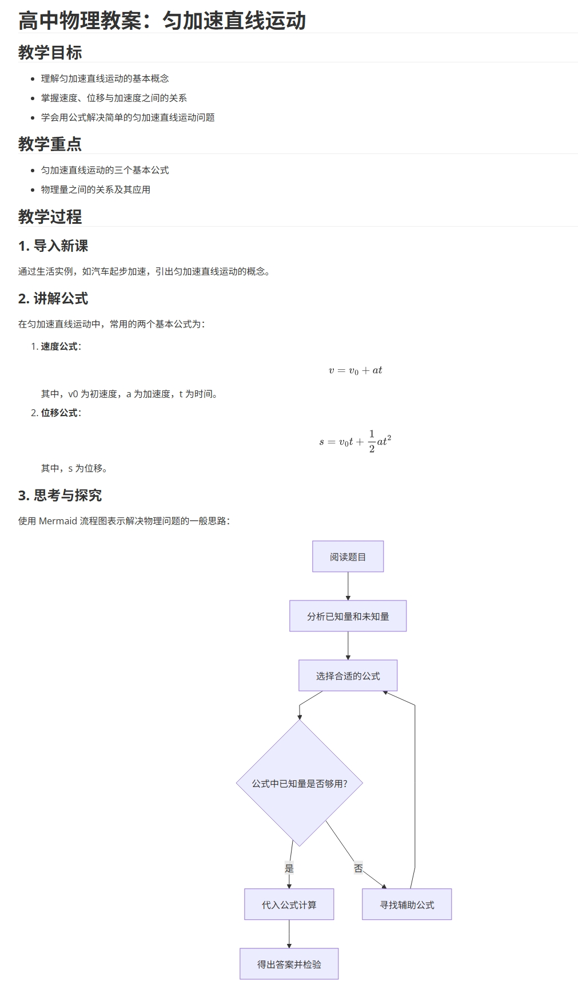

# markdown语法教程

> [!NOTE]
>
> 此教程是对[菜鸟markdown教程](https://www.runoob.com/markdown/md-tutorial.html)的精简，非常感谢菜鸟教程的分享
>

Markdown 是一种轻量级的标记语言

简单来说：用简单符号就能排版的写作工具，让人们回归内容本身

它通过极其简单的语法，降低了格式排版的复杂性，让你能专注于思考和创作，同时又能轻松产出格式优美、结构清晰的文档

请花几分钟，参考如下教程来快速掌握markdown语法

## 一、标题

标题的层次结构应该遵循逻辑顺序，不应该跳级使用。良好的标题结构就像一本书的目录

- 语法

```markdown
# 一级标题
## 二级标题
### 三级标题
#### 四级标题
##### 五级标题
###### 六级标题
```

- 效果

---


---

## 二、文本

Markdown 段落没有特殊的格式，直接编写文字就好，段落的换行是使用两个以上空格加上回车

- 语法

```markdown
测试1  #注意测试1后面有两个空格

测试2  #注意测试2后面有两个空格

测试3  #注意测试3后面有两个空格
```

- 效果

---


---

## 三、列表

### 无序列表

无序列表使用星号(*)、加号(+)或是减号(-)作为列表标记，这些标记后面要添加一个空格，然后再填写内容

- 语法

```markdown
* 第一项
* 第二项
* 第三项

+ 第一项
+ 第二项
+ 第三项


- 第一项
- 第二项
- 第三项
```

- 效果

---

* 第一项
* 第二项
* 第三项

+ 第一项
+ 第二项
+ 第三项


- 第一项
- 第二项
- 第三项

---

> [!NOTE]
>
> 建议统一使用减号 **-**，因为它在视觉上更清晰
>

### 有序列表

用于展示有顺序要求的步骤或项目

有序列表使用数字并加上 . 号来表示

- 语法

```markdown
1. 第一项
2. 第二项
3. 第三项
```

- 效果

---

1. 第一项
2. 第二项
3. 第三项

---

### 任务列表

- 语法

```markdown
- [ ] 未完成的任务
- [x] 已完成的任务
- [ ] 另一个未完成的任务
```

- 效果

---

- [ ] 未完成的任务
- [x] 已完成的任务
- [ ] 另一个未完成的任务

---

## 四、引用块

引用块用于突出显示重要信息、引用他人观点或创建视觉层次

- 语法

```markdown
> 区块引用
> markdown语法教程
> 学的不仅是技术更是梦想
```

- 效果

---

> 区块引用
> markdown语法教程
> 学的不仅是技术更是梦想

---

## 五、代码

Markdown 提供了多种方式来展示代码，从简单的行内代码到复杂的代码块，满足不同场景下的代码展示需求

- 语法

````markdown
```python
print("ok")
```
````

- 效果

---

```python
print("ok")
```

---

## 六、链接

双击可打开此链接的网站

- 语法

```markdown
[百度](https://baidu.com)
```

- 效果

---

[百度](https://baidu.com)

---

## 七、图片

引用图片到此文件中显示

- 语法

```markdown

```

- 效果

---


---

## 八、表格

- 语法

```markdown
|  表头   | 表头  |
|  ----  | ----  |
| 单元格  | 单元格 |
| 单元格  | 单元格 |
```

- 效果

---

|  表头   | 表头  |
|  ----  | ----  |
| 单元格  | 单元格 |
| 单元格  | 单元格 |

---

## 九、分割线

Markdown 支持三种方式创建水平分割线

- 语法

```markdown
使用三个连字符

---

使用三个星号

***

使用三个下划线

___
```

- 效果


使用三个连字符

---

使用三个星号

***

使用三个下划线

___

## 十、数学公式

在 Markdown 中，数学公式通过 LaTeX 语法来表示。

LaTeX 是一个强大的排版系统，特别适用于包含复杂数学公式的文档。

[通过 Overleaf 的 Learn LaTeX in 30 minutes 等快速入门教程掌握核心概念](https://www.overleaf.com/learn/latex/Learn_LaTeX_in_30_minutes)

- 语法

```markdown
$$
    \begin{aligned}
    f(x) &= ax^2 + bx + c \\
    f'(x)  &= 2ax + b \\
    f''(x)  &= 2a
    \end{aligned}
    $$
```

- 效果

---

$$
\begin{aligned}
    f(x) &= ax^2 + bx + c \\
    f'(x)  &= 2ax + b \\
    f''(x)  &= 2a
    \end{aligned}
$$

---

## 十一、图表绘制

Mermaid 是最流行的 Markdown 图表工具之一，它允许你使用简单的文本语法生成各种图表

- 语法

````markdown

````

- 效果


## 十二、实战练习

- 内容

```markdown
# 高中物理教案：匀加速直线运动

## 教学目标
- 理解匀加速直线运动的基本概念  
- 掌握速度、位移与加速度之间的关系  
- 学会用公式解决简单的匀加速直线运动问题  

## 教学重点
- 匀加速直线运动的三个基本公式  
- 物理量之间的关系及其应用  

## 教学过程

### 1. 导入新课
通过生活实例，如汽车起步加速，引出匀加速直线运动的概念。

### 2. 讲解公式
在匀加速直线运动中，常用的两个基本公式为：

1. **速度公式**：
   $$
   v = v_0 + at
   $$
   其中，v0 为初速度，a 为加速度，t 为时间。

2. **位移公式**：
   $$
   s = v_0t + \frac{1}{2}at^2
   $$
   其中，s 为位移。

### 3. 思考与探究
使用 Mermaid 流程图表示解决物理问题的一般思路：



- 效果

---




---
