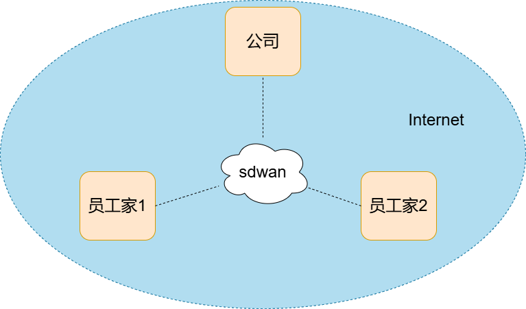

## 搭建wireguard异地组网环境

### 一、背景

 异地组网方案旨在将不同地理位置的网络资源连接起来，以实现数据共享和协同工作。 


### 二、方案

#### 1.方案架构图




#### 2.方案介绍

公司，员工家都在互联网中，无法直接通信。

通过sdwan，把所有公司和员工家组成一个虚拟局域网，实现异地组网方案。

sdwan节点可以部署在公司或者公有云环境（具有公网ip），在每个需要登录节点安装 [wireguard client](https://www.wireguard.com/install/)，接入sdwan网络，每个接入的设备会获取到一个虚拟ip，这个ip用来加入局域网。

WireGuard 是一种新兴的、高性能的网络隧道协议，以其简洁的设计和优秀的性能获得了广泛认可。 

[wg-easy](https://github.com/wg-easy/wg-easy) 是一个轻量级、高效的 WireGuard 配置和管理工具，旨在帮助用户轻松地在各类操作系统上（包括 Linux、Windows 和 macOS）建立安全的网络连接。 

#### 3.wg-easy快速搭建

docker-compose文件

```shell
version: '3.9'
services:
    wg-easy:
        image: weejewel/wg-easy
        restart: unless-stopped
        sysctls:
            - net.ipv4.ip_forward=1
            - net.ipv4.conf.all.src_valid_mark=1
        cap_add:
            - SYS_MODULE
            - NET_ADMIN
        ports:
            - '51821:51821/tcp'
            - '51820:51820/udp'
        volumes:
            - '~/.wg-easy:/etc/wireguard'
        environment:
            - WG_PERSISTENT_KEEPALIVE=25
            - WG_ALLOWED_IPS=10.0.0.0/24
            - WG_DEFAULT_DNS=114.114.114.114
            - WG_DEFAULT_ADDRESS=10.0.0.x
            - PASSWORD=abc@2020
            - WG_HOST=opendesk.top
        container_name: wg-easy

```


## 三、方案优势

####  1.安全性

WireGuard使用最新的加密算法和协议，保证了数据传输的安全性。同时，它采用了简化的设计，减少了潜在的漏洞和攻击面。 

####  2.易用性

WireGuard的配置文件简单明了，易于理解和编辑。此外，它还提供了命令行和图形界面等多种工具，方便用户进行配置和管理。 

#### 3.性能

WireGuard具有高效的性能和低延迟的特点，适用于各种网络环境和应用场景。 

#### 4.二次开发

 项目遵循模块化设计，易于扩展，同时也支持通过 API 进行集成，适用于开发者进行二次开发。 
