## 群晖备份Hyper-V虚拟机备份方案

### 一、群晖

#### 1.群晖简介

群晖科技是中国台湾一家网络附加储存（NAS）的服务商，同时也是世界最大的网络附加存储厂商。群晖的NAS产品被广泛用于家庭和企业环境中，提供了可靠、高性能、易于管理的存储解决方案。 

#### 2.Active Backup for Business

Active Backup for Business是群晖提供全面但集中化的数据保护解决方案，帮助备份企业计算机、虚拟机、物理服务器和文件服务器。

无需授权费或订阅费用，采用强大的重复数据删除技术，支持备份 VMware® vSphere™ 与Microsoft® Hyper-V® 虚拟机 ，并且备份数量无上限。 

### 二、存储推荐

#### 1.工作室存储推荐

型号：DS223

cpu： Realtek RTD1619B 

内存： 2 GB DDR4 non-ECC

磁盘槽数量 ：2

网络：1G

最大单一储存空间容量 ：108TB

#### 2.小微企业存储推荐

型号：RS422+

cpu： AMD Ryzen R1600

内存： 2 GB DDR4 ECC

磁盘槽数量 ：4

网络：1G*2

最大单一储存空间容量：108TB

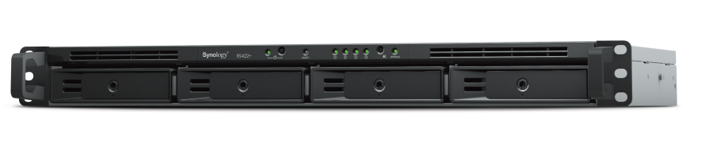

### 三、虚拟机备份配置

#### 1.下载Active Backup for Business

打开套件中心，搜索并下载”Active Backup for Business“，此图已安装好“Active Backup for Business”。

#### 2.配置备份任务

选择“虚拟机”->"Microsoft Hyper-V"->"管理Hypervisor"

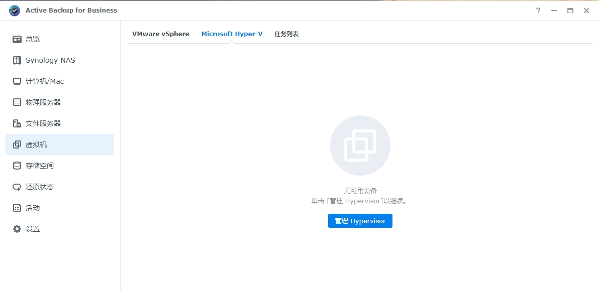

添加windows server

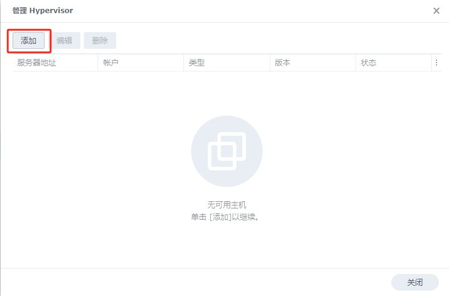

添加服务器地址、账号、密码

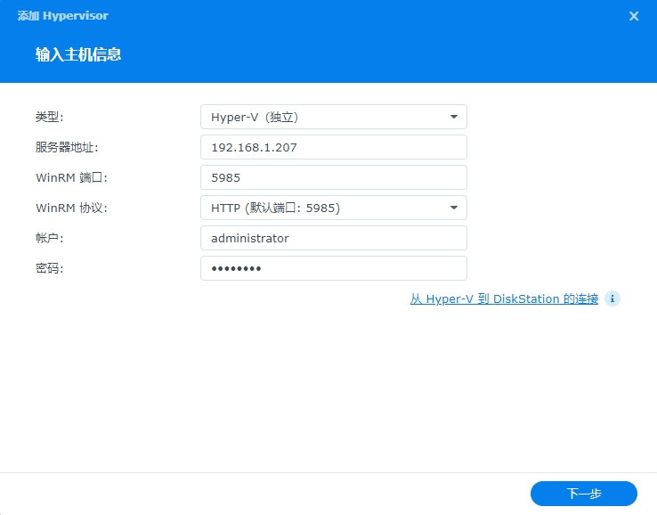

这里群晖会和windows server建立通信，全部成功则完成添加。如果不成功，请点击参考教程

添加成功如图所示，点击关闭后可刷新虚拟机状态

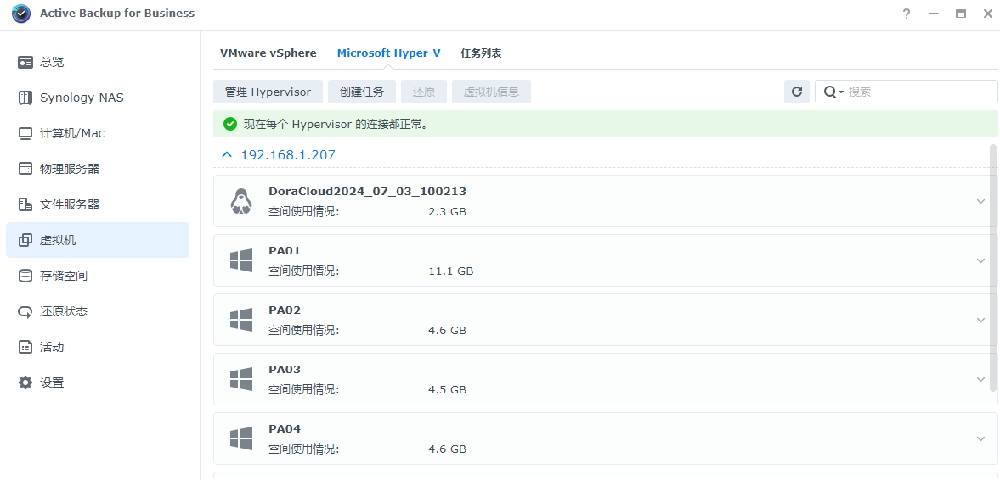

点击”创建任务“，创建虚拟机备份任务

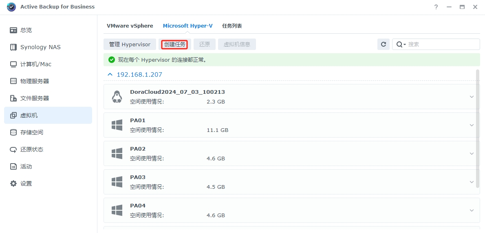

为备份任务指定名称并选择虚拟机，自动发现功能可检测 Hypervisor 上新添加的虚拟机并将其加入备份，建议打开”配置自动发现“功能。

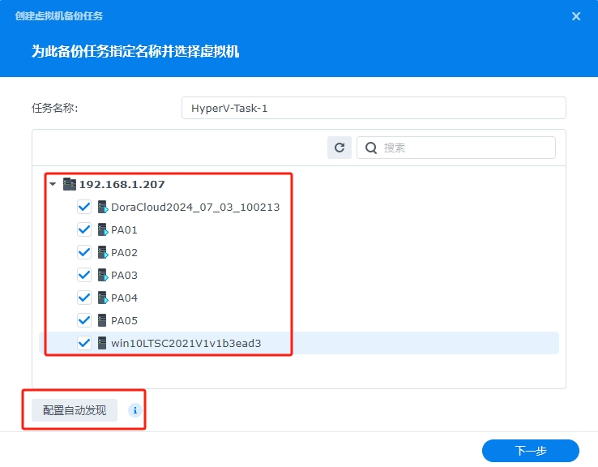

选择共享文件夹作为备份目的地，此处选择Public目录

下一步

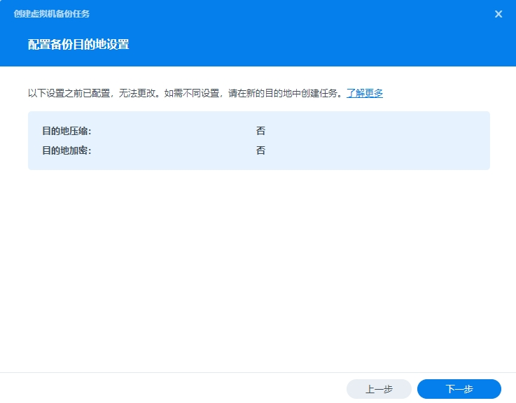

这里默认即可

下一步

按照需求选择备份时间

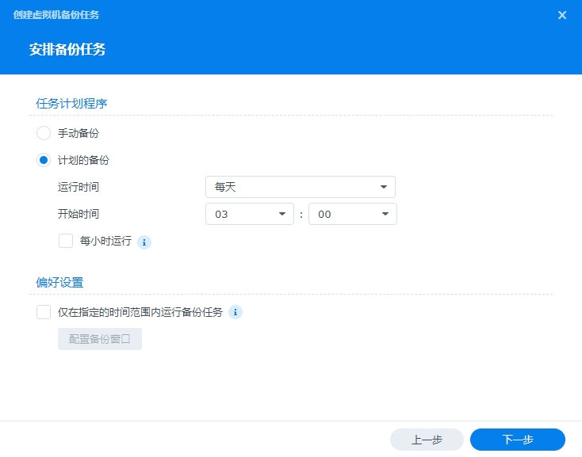

保留策略，按照需求备份版本

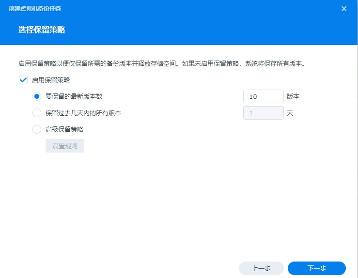

默认即可

完成备份设置

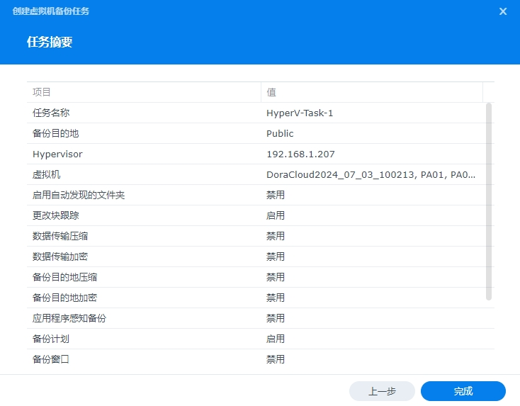

此时会弹出窗口，是否立即备份，建议选是。立即备份检验是否可以正常执行备份任务。

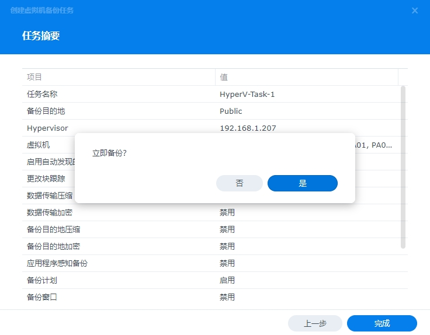

正在执行备份任务

#### 3.还原虚拟机

！！！还原之前，删除对应破环的虚拟机

选择”还原“

勾选需要还原的虚拟机，如果需要选择具体的备份版本，可以点开还原点的选项选择

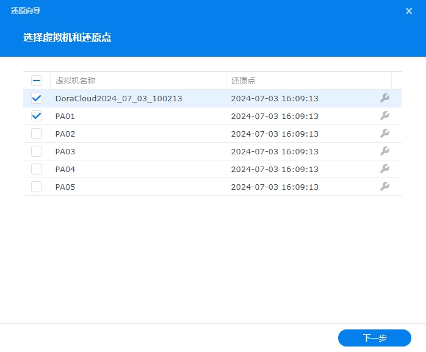

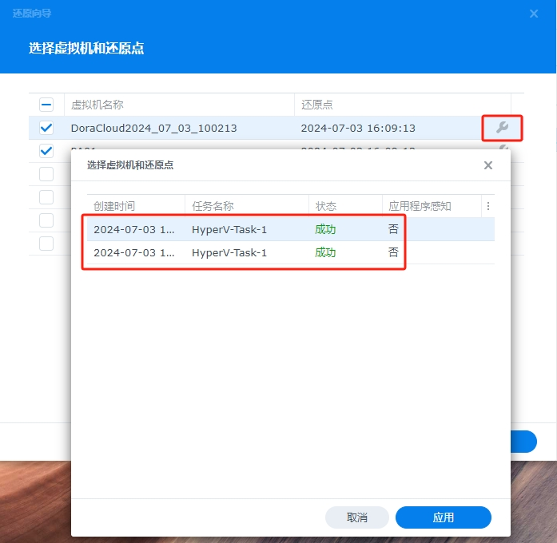

下一步

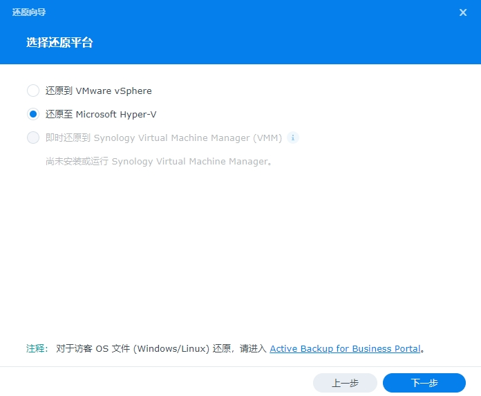

选择第二项

还原到原始位置

可以勾选还原后自动开机，点击完成

查看还原任务

虚拟机还原成功

